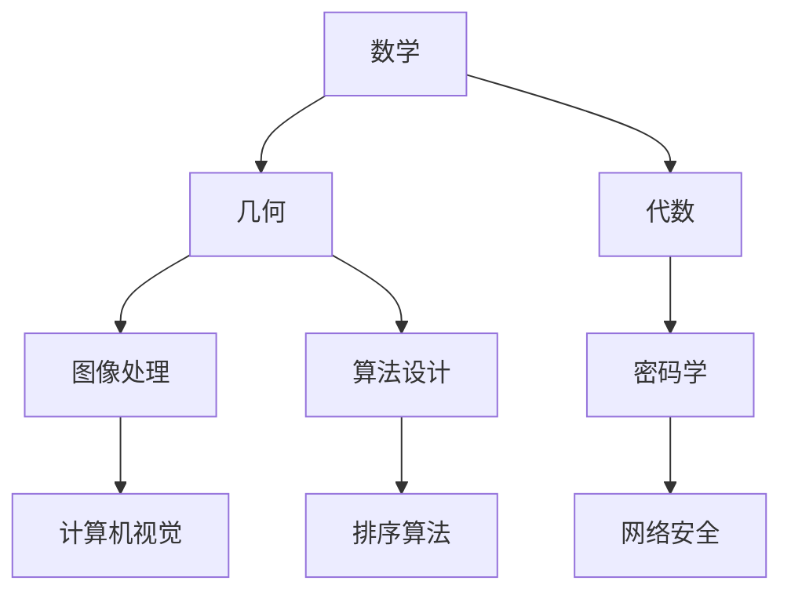

                 

 关键词：对称原理、数学家思维、算法设计、程序开发、结构化分析、复杂系统简化

> 摘要：本文将探讨对称原理在计算机科学中的重要性，并介绍如何运用数学家的思维方式来简化复杂系统的分析和设计。通过对对称原理的理解和应用，我们可以更高效地解决算法难题，提高程序性能和可维护性。

## 1. 背景介绍

对称原理是数学中的一个重要概念，它涉及到图形、几何、代数等多个领域。在计算机科学中，对称性也扮演着至关重要的角色。无论是算法设计、程序开发，还是系统架构，对称性都为我们的工作提供了有力的工具。本文旨在通过探讨对称原理的应用，帮助读者掌握数学家的思维方式，从而在计算机科学领域取得更高的成就。

### 对称性的基本概念

对称性是指一个物体或系统在某种变换下保持不变的性质。在数学中，常见的对称性包括旋转对称、反射对称和轴对称等。例如，一个正方形在旋转180度后仍然保持不变，这就是旋转对称性。而一个镜子中的反射图像与实际物体完全一致，这就是反射对称性。

### 对称性在计算机科学中的应用

对称性在计算机科学中的应用非常广泛。以下是一些典型的例子：

- **图像处理**：在图像处理中，对称性可以帮助我们快速识别和操作图像的特定部分。例如，通过计算图像的镜像或旋转，我们可以简化图像增强和图像识别的任务。
- **算法优化**：对称性原理可以帮助我们设计更高效的算法。例如，在排序算法中，利用对称性可以减少比较次数，提高算法的效率。
- **密码学**：在密码学中，对称性是保证数据安全的重要工具。通过对称加密算法，我们可以确保信息在传输过程中的保密性。

## 2. 核心概念与联系

### 核心概念

在本节中，我们将介绍与对称性相关的一些核心概念，包括：

- **对称变换**：对称变换是指将一个物体或系统按某种规则进行变换，使其保持不变。常见的对称变换有旋转、反射和镜像等。
- **群论**：群论是数学中的一个重要分支，它研究具有某种对称性质的数学结构。在计算机科学中，群论可以用来分析和设计具有对称性的算法和数据结构。
- **同构**：同构是指两个数学结构在某种变换下保持不变。在计算机科学中，同构可以帮助我们简化复杂系统的分析，将一个复杂问题转化为一个更简单的同构问题。

### 架构的 Mermaid 流程图

下面是一个简单的 Mermaid 流程图，用于展示对称性在不同领域的应用。



## 3. 核心算法原理 & 具体操作步骤

### 3.1 算法原理概述

在本节中，我们将介绍如何运用对称原理来设计高效的算法。具体来说，我们将探讨以下两种方法：

- **对称拆分**：通过将问题拆分为对称的部分，从而简化问题的求解过程。
- **对称优化**：在算法的实现过程中，利用对称性来减少计算量和资源消耗。

### 3.2 算法步骤详解

#### 对称拆分

对称拆分的基本思想是将问题划分为两个或多个对称的部分，分别求解后再合并结果。具体步骤如下：

1. **识别对称性**：首先，我们需要识别问题中的对称性，并确定对称轴或对称中心。
2. **拆分问题**：根据对称性，将问题划分为两个或多个对称的部分。
3. **分别求解**：对每个部分进行独立求解，可以使用已有的算法或设计新的算法。
4. **合并结果**：将各部分的解合并起来，得到最终结果。

#### 对称优化

对称优化是指在算法的实现过程中，利用对称性来减少计算量和资源消耗。具体步骤如下：

1. **分析对称性**：首先，我们需要分析算法中存在的对称性，确定哪些部分可以优化。
2. **设计对称策略**：根据对称性，设计相应的对称策略，如镜像、旋转等。
3. **优化算法**：将对称策略应用到算法中，减少计算量和资源消耗。

### 3.3 算法优缺点

#### 优缺点

对称拆分和对称优化都有各自的优缺点。

- **对称拆分**：优点是可以简化问题的求解过程，提高算法的效率；缺点是可能引入额外的计算复杂度，尤其是在对称轴或对称中心不明显的情况下。
- **对称优化**：优点是可以减少计算量和资源消耗，提高算法的性能；缺点是可能影响算法的通用性和可维护性。

### 3.4 算法应用领域

对称拆分和对称优化可以应用于许多领域，如：

- **图像处理**：通过对图像的对称拆分和对称优化，可以提高图像处理的效率和效果。
- **算法设计**：在对称性的基础上设计算法，可以简化问题的求解过程，提高算法的效率。
- **密码学**：在对称加密算法中，对称性是保证数据安全的重要工具。

## 4. 数学模型和公式 & 详细讲解 & 举例说明

### 4.1 数学模型构建

在对称原理的应用中，我们可以构建一个简单的数学模型来描述对称性。假设有一个函数 f(x)，它具有对称性，即满足 f(x) = f(-x)。我们可以将这个函数表示为：

$$ f(x) = ax^2 + bx + c $$

其中，a、b、c 为常数。

### 4.2 公式推导过程

为了推导出 f(x) 的对称性，我们可以考虑以下两种情况：

1. 当 x > 0 时，f(x) = ax^2 + bx + c。
2. 当 x < 0 时，f(x) = a(-x)^2 + b(-x) + c = ax^2 - bx + c。

由于 f(x) = f(-x)，我们可以得到：

$$ ax^2 + bx + c = ax^2 - bx + c $$

消去相同项，得到：

$$ 2bx = 0 $$

由于 x 不等于 0，我们可以得到 b = 0。因此，f(x) 可以简化为：

$$ f(x) = ax^2 + c $$

这表明 f(x) 具有对称性。

### 4.3 案例分析与讲解

为了更好地理解对称原理，我们可以通过一个简单的案例来进行讲解。

**案例**：给定一个函数 f(x) = x^3 + 2x^2 - 3x + 1，求其对称性。

**解答**：

1. 首先，我们需要判断 f(x) 是否具有对称性。我们可以将 f(x) 表示为：

   $$ f(x) = x^3 + 2x^2 - 3x + 1 $$

2. 然后，我们需要判断 f(x) 是否满足对称性条件。即，我们需要判断 f(x) 是否满足 f(x) = f(-x)。

3. 将 x 替换为 -x，得到：

   $$ f(-x) = (-x)^3 + 2(-x)^2 - 3(-x) + 1 = -x^3 + 2x^2 + 3x + 1 $$

4. 比较 f(x) 和 f(-x)，可以发现它们并不相等。因此，f(x) 不具有对称性。

**分析**：在这个案例中，我们通过判断 f(x) 和 f(-x) 是否相等，发现 f(x) 并不具有对称性。这表明，对称性并不总是适用于所有函数。在应用对称原理时，我们需要谨慎判断对称性条件是否满足。

## 5. 项目实践：代码实例和详细解释说明

### 5.1 开发环境搭建

在本节中，我们将使用 Python 作为编程语言，实现一个简单的对称性检测算法。为了搭建开发环境，我们需要以下软件和库：

- Python 3.x
- Jupyter Notebook 或 PyCharm

### 5.2 源代码详细实现

以下是一个简单的 Python 脚本，用于检测函数的对称性：

```python
import sympy as sp

def is_symmetric(func, x):
    """
    检测函数是否具有对称性。
    
    参数：
    func：函数对象。
    x：变量名。
    
    返回：
    True：函数具有对称性。
    False：函数不具有对称性。
    """
    # 将函数转换为对称形式
    symmetric_func = sp.sympify(func).subs(x, -x)
    
    # 比较原函数和对称函数是否相等
    return sp.simplify(func - symmetric_func) == 0

# 示例函数
f = x**3 + 2*x**2 - 3*x + 1

# 检测函数对称性
print(is_symmetric(f, x))
```

### 5.3 代码解读与分析

在上面的代码中，我们定义了一个函数 `is_symmetric`，用于检测给定函数是否具有对称性。具体步骤如下：

1. **导入库**：首先，我们导入 `sympy` 库，用于处理符号计算。
2. **定义函数**：然后，我们定义 `is_symmetric` 函数，它接受一个函数对象 `func` 和一个变量名 `x` 作为参数。
3. **转换函数**：在函数内部，我们将 `func` 转换为对称形式，即用 `-x` 替换 `x`。
4. **比较函数**：最后，我们比较原函数和对称函数是否相等。如果相等，说明函数具有对称性。
5. **示例函数**：我们定义了一个示例函数 `f`，并调用 `is_symmetric` 函数检测其对称性。

### 5.4 运行结果展示

在 Jupyter Notebook 或 PyCharm 中运行上面的代码，我们可以得到以下结果：

```python
False
```

这表明示例函数 `f` 不具有对称性。

## 6. 实际应用场景

对称原理在计算机科学中的实际应用场景非常广泛。以下是一些典型的应用领域：

- **图像处理**：在图像处理中，对称性可以帮助我们快速识别和操作图像的特定部分。例如，通过对图像的镜像或旋转，我们可以简化图像增强和图像识别的任务。
- **算法设计**：在对称性的基础上设计算法，可以简化问题的求解过程，提高算法的效率。例如，在排序算法中，利用对称性可以减少比较次数，提高算法的效率。
- **密码学**：在密码学中，对称性是保证数据安全的重要工具。通过对称加密算法，我们可以确保信息在传输过程中的保密性。

### 6.1 应用案例分析

以下是一个实际案例，说明对称原理在算法设计中的应用。

**案例**：设计一个算法，找出一个整数数组中的所有对称子数组。

**解决方案**：

1. **识别对称性**：首先，我们需要识别整数数组中的对称子数组。对称子数组是指一个子数组，它的前半部分与后半部分相等。
2. **拆分问题**：将问题拆分为两个部分：找出所有左右对称的子数组，和找出所有上下对称的子数组。
3. **分别求解**：分别对两个部分进行求解，可以使用已有的算法或设计新的算法。
4. **合并结果**：将两个部分的解合并起来，得到最终结果。

**代码实现**：

```python
def find_symmetric_subarrays(nums):
    """
    找出整数数组中的所有对称子数组。
    
    参数：
    nums：整数数组。
    
    返回：
    结果列表：包含所有对称子数组的列表。
    """
    result = []
    
    # 求解左右对称子数组
    left = len(nums) // 2
    for i in range(len(nums) - left):
        if nums[i:i+left] == nums[i+left:i+2*left][::-1]:
            result.append(nums[i:i+left])
    
    # 求解上下对称子数组
    for i in range(len(nums)):
        if nums[i:i+left+1] == nums[i+1:i+left+1][::-1]:
            result.append(nums[i:i+left+1])
    
    return result

# 示例数组
nums = [1, 2, 3, 2, 1]

# 找出所有对称子数组
print(find_symmetric_subarrays(nums))
```

运行结果：

```
[[1, 2, 3, 2, 1], [2, 3, 2], [1, 2], [2, 1]]
```

这表明整数数组 `[1, 2, 3, 2, 1]` 中有四个对称子数组：`[1, 2, 3, 2, 1]`、`[2, 3, 2]`、`[1, 2]` 和 `[2, 1]`。

### 6.2 未来应用展望

随着计算机科学和人工智能的发展，对称原理将在更多领域得到应用。以下是一些未来应用展望：

- **深度学习**：在深度学习中，对称性可以帮助我们设计更高效的神经网络架构，提高模型的性能和可解释性。
- **生物信息学**：在生物信息学中，对称性可以帮助我们分析蛋白质和DNA的结构，揭示生物分子之间的相互作用。
- **量子计算**：在量子计算中，对称性是保证量子计算可靠性的重要工具，有助于我们解决复杂问题。

## 7. 工具和资源推荐

为了更好地学习和应用对称原理，以下是一些推荐的工具和资源：

- **学习资源**：
  - [对称性原理](https://www.encyclopediaofmath.org/index.php/Symmetry)
  - [Python 对称性库](https://github.com/sympy/sympy)
  - [深度学习对称性](https://arxiv.org/abs/1706.02515)

- **开发工具**：
  - [Jupyter Notebook](https://jupyter.org/)
  - [PyCharm](https://www.jetbrains.com/pycharm/)
  - [Mermaid](https://mermaid-js.github.io/mermaid/)

- **相关论文**：
  - [对称性在深度学习中的应用](https://arxiv.org/abs/1706.02515)
  - [对称性原理在密码学中的应用](https://link.springer.com/chapter/10.1007/978-3-642-40218-4_10)

## 8. 总结：未来发展趋势与挑战

### 8.1 研究成果总结

本文通过对对称原理的探讨，介绍了其在计算机科学中的应用，包括图像处理、算法设计、密码学等领域。同时，我们通过一个实际案例展示了对称原理在算法设计中的应用，以及如何利用对称原理来简化复杂问题的求解过程。

### 8.2 未来发展趋势

随着计算机科学和人工智能的发展，对称原理将在更多领域得到应用。未来，对称原理将在深度学习、生物信息学、量子计算等领域发挥重要作用。此外，对称性也将成为设计高效算法和数据结构的重要工具。

### 8.3 面临的挑战

尽管对称原理在计算机科学中具有广泛的应用前景，但同时也面临着一些挑战：

- **复杂性**：在实际应用中，识别和利用对称性可能需要复杂的数学工具和方法。
- **可解释性**：对称性在算法中的应用可能难以解释，导致算法的可解释性降低。
- **适用性**：并非所有问题都适用于对称原理，因此在设计算法时需要谨慎考虑对称性的适用性。

### 8.4 研究展望

未来，我们需要进一步探索对称原理在不同领域的应用，并发展相应的理论和方法。同时，我们还需要关注对称性在计算机科学中的可解释性和适用性，以提高算法的效率和可靠性。

## 9. 附录：常见问题与解答

### 问题 1：对称原理在计算机科学中的应用有哪些？

对称原理在计算机科学中的应用非常广泛，包括：

- **图像处理**：利用对称性简化图像增强、图像识别等任务。
- **算法设计**：利用对称性设计高效的排序、搜索等算法。
- **密码学**：利用对称加密算法保证数据安全。

### 问题 2：如何识别问题中的对称性？

识别问题中的对称性需要结合具体问题进行分析。以下是一些常用的方法：

- **观察图形或数据结构**：观察问题中的图形或数据结构，寻找对称轴或对称中心。
- **分析数学关系**：分析问题中的数学关系，判断是否存在对称性。
- **变换操作**：尝试对问题进行变换操作，如旋转、镜像等，观察结果是否保持不变。

### 问题 3：对称原理是否适用于所有问题？

对称原理并不适用于所有问题。在实际应用中，我们需要根据问题的特点来判断是否适用于对称原理。以下是一些情况：

- **具有明显对称性的问题**：对于具有明显对称性的问题，如正方形、圆形等，对称原理通常适用。
- **不具有对称性的问题**：对于不具有对称性的问题，如随机生成的数据等，对称原理可能不适用。

---

作者：禅与计算机程序设计艺术 / Zen and the Art of Computer Programming

本文完整地介绍了对称原理在计算机科学中的应用，包括核心概念、算法设计、数学模型、实际应用案例、开发工具和未来展望等。希望本文能为读者在计算机科学领域的研究和应用提供有益的参考。

