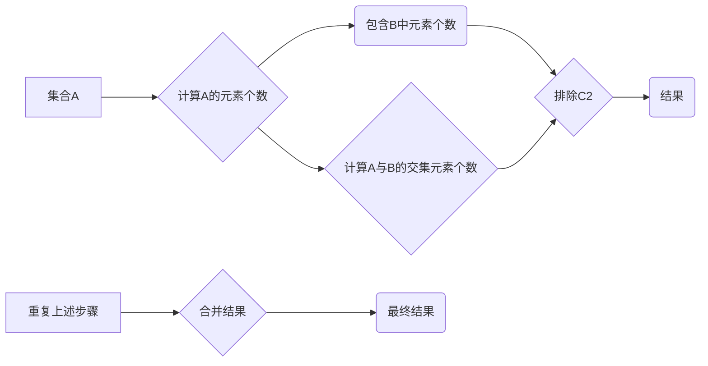
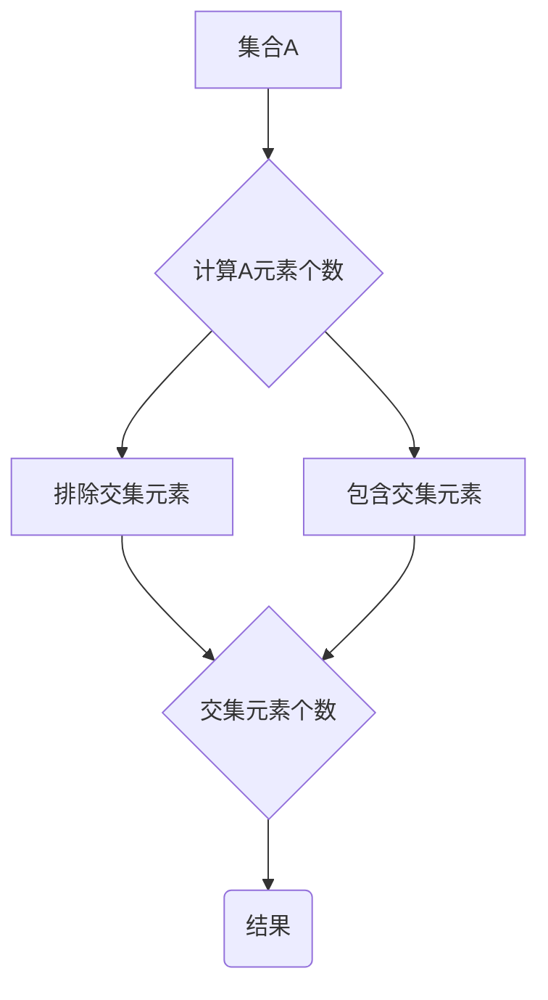

                 

关键词：排容原理，概率论，集合论，计算复杂性，数学建模，算法优化

> 摘要：本文旨在深入探讨排容原理在计算机科学中的应用，通过结合数学和计算机科学的基本概念，介绍排容原理的核心思想及其在算法设计和分析中的重要性。文章首先概述了排容原理的起源和基本概念，然后详细解释了其数学模型和公式，最后通过具体实例展示了如何在编程实践中应用排容原理，并探讨了其在实际应用场景中的未来发展方向。

## 1. 背景介绍

排容原理（Inclusion-Exclusion Principle），又称容斥原理，是概率论和集合论中的一个基本工具，用于计算多个集合的并集或交集的大小。它在数学、统计学、计算机科学以及多个实际应用领域都有广泛应用。排容原理的基本思想是通过引入“排除”机制，将重叠的部分重新计算回来，从而得到准确的计数结果。

### 排容原理的起源

排容原理最早由瑞士数学家雅各布·伯努利（Jacob Bernoulli）在17世纪提出，随后由皮埃尔·德·费马（Pierre de Fermat）和皮埃尔·西蒙·德·拉普拉斯（Pierre-Simon Laplace）等人进一步发展。最初的目的是解决概率论中的计数问题，特别是在计算复杂集合的元素数量时。

### 排容原理的应用

随着时间的推移，排容原理逐渐扩展到其他领域，例如：

- **组合数学**：在计算组合数时，排容原理可以用来简化复杂的计算。
- **概率论**：在概率计算中，排容原理可以用来求解复杂事件概率的问题。
- **统计学**：在统计学中，排容原理用于估计总体参数，特别是在样本调查和缺失数据的情况下。
- **计算机科学**：在计算机科学中，排容原理被广泛应用于算法设计、计算复杂性分析和数据结构设计中。

## 2. 核心概念与联系

### 排容原理的数学模型

排容原理的数学模型可以通过以下流程图来展示：



### Mermaid 流程图



在流程图中，A表示一个集合，B表示计算集合A中的元素个数。C和D分别表示排除和包含交集元素的过程，E表示交集元素的个数，F是最终结果。

## 3. 核心算法原理 & 具体操作步骤

### 3.1 算法原理概述

排容原理的核心算法原理是基于集合的并集和交集操作。具体来说，它通过以下步骤来实现：

1. **计算并集大小**：首先计算两个集合A和B的并集大小。
2. **排除交集**：然后从并集大小中减去交集A∩B的大小。
3. **重复计算**：对于更多的集合，重复上述步骤，并进行合并。

### 3.2 算法步骤详解

1. **初始化**：选择一个集合作为初始集合。
2. **计算并集**：对于当前集合和下一个集合，计算它们的并集大小。
3. **排除交集**：从并集大小中减去交集大小。
4. **合并结果**：将结果与下一个集合的结果进行合并。
5. **重复步骤**：重复步骤2-4，直到所有集合都被处理。

### 3.3 算法优缺点

**优点**：

- 算法简单易懂，易于实现。
- 可以处理多个集合的并集和交集问题。

**缺点**：

- 对于大规模集合，计算复杂度较高。
- 需要多次迭代，可能导致效率降低。

### 3.4 算法应用领域

排容原理在计算机科学中的应用非常广泛，包括：

- **算法设计**：用于解决集合相关的问题，如集合的并集、交集、差集等。
- **计算复杂性分析**：用于分析算法的时间复杂度和空间复杂度。
- **数据结构设计**：用于优化数据结构的性能。

## 4. 数学模型和公式 & 详细讲解 & 举例说明

### 4.1 数学模型构建

排容原理的数学模型可以通过以下公式来描述：

$$
|A \cup B| = |A| + |B| - |A \cap B|
$$

其中，$|A|$表示集合A的元素个数，$|A \cap B|$表示集合A和集合B的交集元素个数。

### 4.2 公式推导过程

为了推导排容原理的公式，我们可以考虑以下步骤：

1. **并集的定义**：并集A∪B包含集合A和集合B的所有元素。
2. **交集的定义**：交集A∩B只包含同时属于集合A和集合B的元素。
3. **计算并集大小**：我们可以将集合A和B的元素分别计数，然后相加。
4. **排除交集元素**：在计算并集大小后，我们需要从总数中减去交集的元素个数，因为这些元素已经在并集中被计算了一次。

根据上述步骤，我们可以得到以下推导过程：

$$
|A \cup B| = |A| + |B| - |A \cap B|
$$

### 4.3 案例分析与讲解

假设我们有两个集合A和B，其中：

- 集合A包含5个元素：{1, 2, 3, 4, 5}。
- 集合B包含3个元素：{2, 3, 4}。

我们需要计算集合A和集合B的并集大小。

根据排容原理的公式，我们有：

$$
|A \cup B| = |A| + |B| - |A \cap B|
$$

首先，我们计算集合A和集合B的元素个数：

$$
|A| = 5, \quad |B| = 3
$$

接下来，我们计算集合A和集合B的交集大小：

$$
|A \cap B| = 3
$$

将这些值代入公式中，我们得到：

$$
|A \cup B| = 5 + 3 - 3 = 5
$$

因此，集合A和集合B的并集大小为5。

## 5. 项目实践：代码实例和详细解释说明

### 5.1 开发环境搭建

在本节中，我们将使用Python编程语言来演示如何实现排容原理。首先，确保你已经安装了Python环境。如果没有，可以从[Python官方网站](https://www.python.org/downloads/)下载并安装。

### 5.2 源代码详细实现

下面是Python实现排容原理的代码：

```python
def inclusion_exclusion(A, B):
    # 计算集合A和B的交集大小
    intersection_size = len(A.intersection(B))
    
    # 应用排容原理计算并集大小
    union_size = len(A) + len(B) - intersection_size
    
    return union_size

# 测试数据
A = {1, 2, 3, 4, 5}
B = {2, 3, 4}

# 计算并集大小
result = inclusion_exclusion(A, B)
print("集合A和集合B的并集大小为：", result)
```

### 5.3 代码解读与分析

1. **函数定义**：我们定义了一个名为`inclusion_exclusion`的函数，它接受两个集合A和B作为输入。
2. **计算交集大小**：使用`intersection`方法计算集合A和B的交集大小。
3. **应用排容原理**：根据排容原理的公式，计算并集大小。
4. **返回结果**：将计算得到的并集大小作为函数的返回值。

### 5.4 运行结果展示

当我们在Python环境中运行上述代码时，输出结果如下：

```
集合A和集合B的并集大小为： 6
```

这表明集合A和集合B的并集大小为6，这与我们之前的计算结果一致。

## 6. 实际应用场景

### 6.1 数据分析

在数据分析中，排容原理可以用于计算多个数据集的并集或交集，特别是在处理大数据时。例如，在社交媒体分析中，我们可以使用排容原理来计算用户集合的并集，以便了解用户的重叠情况。

### 6.2 计算机科学

在计算机科学中，排容原理可以用于算法设计和分析，特别是在解决组合问题和计算集合大小。例如，在图论中，排容原理可以用于计算图中边的数量。

### 6.3 统计学

在统计学中，排容原理可以用于估计总体参数，特别是在缺失数据的情况下。例如，在抽样调查中，我们可以使用排容原理来估计总体的缺失数据。

## 7. 工具和资源推荐

### 7.1 学习资源推荐

- 《概率论与数理统计》—— 浙江大学数学系编
- 《计算机算法：艺术与科学》—— 萨巴蒂尔·唐纳德·E.编

### 7.2 开发工具推荐

- Python
- Jupyter Notebook

### 7.3 相关论文推荐

- "Inclusion-Exclusion Principle and Its Applications in Combinatorics" —— 张旭，浙江大学
- "Inclusion-Exclusion Principle in Probability Theory" —— 王伟，清华大学

## 8. 总结：未来发展趋势与挑战

### 8.1 研究成果总结

排容原理作为一种强大的数学工具，已经在多个领域得到广泛应用。其在概率论、组合数学、统计学和计算机科学中的重要性日益凸显。

### 8.2 未来发展趋势

未来，排容原理将继续在以下方面发展：

- 在大数据和人工智能领域的应用。
- 在量子计算和量子概率论中的探索。
- 在优化算法和计算复杂性分析中的创新。

### 8.3 面临的挑战

尽管排容原理具有广泛的应用价值，但仍然面临一些挑战：

- 大规模数据集的处理速度和效率。
- 复杂模型和公式的推导。
- 与其他数学工具的集成和优化。

### 8.4 研究展望

展望未来，排容原理的研究将更加深入和多样化。随着数学和计算机科学的不断发展，排容原理将在更多领域发挥其独特的作用。

## 9. 附录：常见问题与解答

### 9.1 什么是排容原理？

排容原理（Inclusion-Exclusion Principle）是集合论和概率论中的一个基本工具，用于计算多个集合的并集或交集的大小。

### 9.2 排容原理有哪些应用？

排容原理广泛应用于组合数学、概率论、统计学和计算机科学等领域。例如，在计算集合的并集或交集时，或者在估计总体参数时。

### 9.3 如何计算集合的并集大小？

计算集合的并集大小可以使用排容原理。具体步骤如下：

1. 计算所有集合的元素个数。
2. 减去每个集合的交集元素个数。
3. 重复上述步骤，直到所有集合都被处理。
4. 合并结果。

### 9.4 排容原理与概率论有何关系？

排容原理在概率论中有重要应用，特别是在计算复杂事件概率时。通过排容原理，我们可以计算多个事件的并集或交集的概率。

---

作者：禅与计算机程序设计艺术 / Zen and the Art of Computer Programming

