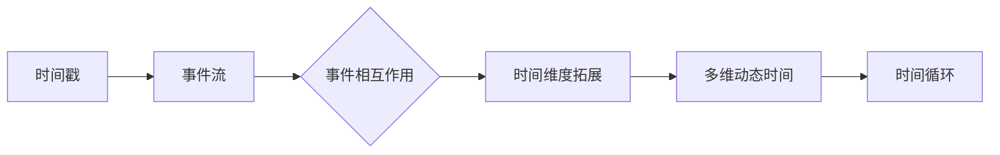

                 

关键词：元宇宙、时间概念、物理局限、新认知、人工智能、区块链、虚拟现实

> 摘要：本文旨在探讨元宇宙中的时间概念，分析其在突破传统物理局限过程中所展现出的新认知。我们将从核心概念出发，介绍元宇宙中的时间架构，探讨其算法原理、数学模型及其在实际应用中的表现。同时，还将讨论元宇宙时间概念的未来发展趋势与挑战，以及相关的学习资源和开发工具推荐。

## 1. 背景介绍

随着科技的飞速发展，人工智能、区块链、虚拟现实等新兴技术不断涌现，推动着社会进入了一个全新的时代——元宇宙。元宇宙不仅是现实世界的数字映射，更是一个自我维持、自我演进的空间。在这个空间中，时间的概念被重新定义，打破了传统物理学的局限，为人类认知的拓展提供了新的可能性。

时间在传统物理学中是一个基本的物理量，用来描述事件发生的顺序和持续过程。然而，在元宇宙中，时间不再局限于线性流逝，而是呈现出多维、动态的特点。这为我们重新审视时间概念，探索新的算法原理和应用提供了广阔的空间。

## 2. 核心概念与联系

在元宇宙中，时间概念的核心在于“时间戳”和“事件流”。时间戳是一个标记，用来表示特定事件在元宇宙中的发生时间。事件流则是一个连续的序列，记录了所有事件的顺序和相互作用。

为了更好地理解这一概念，我们使用Mermaid流程图来展示元宇宙时间架构：



### 2.1 时间戳

时间戳是元宇宙时间概念的基础，用于标记事件的发生时间。它是一个全局唯一的标识符，可以精确到纳秒级别。在区块链技术中，时间戳被广泛用于确保数据的不可篡改性。

### 2.2 事件流

事件流是一个连续的序列，记录了所有事件的顺序和相互作用。事件可以是用户操作、系统调用或外部事件等。事件流为元宇宙中的时间概念提供了一个全局视图，帮助我们理解各种事件之间的关系。

### 2.3 事件相互作用

在元宇宙中，事件不仅独立发生，还会相互作用，形成复杂的动态系统。这种相互作用使得时间不再是一个简单的线性序列，而是呈现出多维、动态的特点。

### 2.4 时间维度拓展

随着元宇宙的不断发展，时间维度也在不断拓展。我们不仅考虑过去、现在和未来，还要考虑并行事件和虚拟时间等概念。这种拓展使得元宇宙中的时间概念更加丰富和复杂。

### 2.5 多维动态时间

多维动态时间是指时间在元宇宙中的多种表现形式。例如，虚拟时间、并行时间和循环时间等。这些多维时间概念使得我们在处理复杂问题时，可以更加灵活和高效。

### 2.6 时间循环

时间循环是指在一个闭合的时间系统中，时间可以回到过去或重新开始。在元宇宙中，时间循环被广泛用于游戏设计、虚拟现实等场景。

## 3. 核心算法原理 & 具体操作步骤

在元宇宙中，时间概念的核心算法是“时间戳算法”。该算法用于生成和验证时间戳，确保元宇宙中的时间概念具有一致性和可靠性。

### 3.1 算法原理概述

时间戳算法基于区块链技术，通过分布式共识机制来生成时间戳。具体来说，时间戳算法包括以下几个步骤：

1. **时间戳生成**：每个节点根据本地时间生成一个时间戳。
2. **时间戳验证**：其他节点对生成的时间戳进行验证，确保其合法性和一致性。
3. **时间戳存储**：将验证通过的时间戳存储在区块链中，以确保其持久性和不可篡改性。

### 3.2 算法步骤详解

1. **时间戳生成**：
   - 每个节点根据本地时间生成一个时间戳。
   - 时间戳包括节点标识、生成时间和随机数等。

2. **时间戳验证**：
   - 其他节点对生成的时间戳进行验证。
   - 验证内容包括时间戳的合法性、一致性和唯一性。

3. **时间戳存储**：
   - 将验证通过的时间戳存储在区块链中。
   - 通过分布式共识机制，确保时间戳的持久性和不可篡改性。

### 3.3 算法优缺点

时间戳算法具有以下优点：

1. **一致性**：通过分布式共识机制，确保时间戳具有一致性和可靠性。
2. **不可篡改性**：时间戳被存储在区块链中，具有不可篡改的特性。
3. **高效性**：时间戳算法基于区块链技术，可以快速生成和验证时间戳。

然而，时间戳算法也存在一些缺点：

1. **依赖区块链**：时间戳算法依赖于区块链技术，可能受到区块链性能的限制。
2. **扩展性**：在处理大量时间戳时，时间戳算法的扩展性可能存在问题。

### 3.4 算法应用领域

时间戳算法在元宇宙中具有广泛的应用领域，包括：

1. **数据完整性验证**：通过时间戳算法，可以确保数据的完整性和可靠性。
2. **智能合约执行**：在区块链平台上，时间戳算法用于确保智能合约的执行顺序和合法性。
3. **虚拟现实**：在虚拟现实场景中，时间戳算法用于同步用户操作和虚拟事件。

## 4. 数学模型和公式 & 详细讲解 & 举例说明

在元宇宙中，时间概念涉及到多种数学模型和公式。下面，我们将介绍一些常见的数学模型和公式，并对其进行详细讲解。

### 4.1 数学模型构建

在元宇宙中，时间模型主要分为以下几种：

1. **线性时间模型**：线性时间模型是一种简单的时间模型，用于描述事件的顺序和持续过程。
2. **非线性时间模型**：非线性时间模型用于描述复杂事件之间的相互作用和时间维度拓展。
3. **循环时间模型**：循环时间模型用于描述时间循环现象，如虚拟时间和并行时间等。

### 4.2 公式推导过程

1. **线性时间模型**：

   假设事件A和事件B在时间t1和t2发生，那么它们的持续时间可以表示为：

   $持续时间 = t2 - t1$

2. **非线性时间模型**：

   假设事件A和事件B之间的相互作用可以表示为一个函数f，那么它们的持续时间可以表示为：

   $持续时间 = f(t2 - t1)$

3. **循环时间模型**：

   假设事件A在一个循环周期T内发生，那么它的持续时间可以表示为：

   $持续时间 = T \times k$，其中k为循环次数。

### 4.3 案例分析与讲解

假设在一个虚拟现实游戏中，玩家A和玩家B需要进行一场比赛。比赛的时间规则如下：

1. 比赛开始时间为t1。
2. 比赛持续时间为2小时。
3. 如果比赛结束时间为t2，那么持续时间可以表示为：

   $持续时间 = t2 - t1$

4. 如果比赛在循环时间内结束，那么持续时间可以表示为：

   $持续时间 = 2 \times k$，其中k为循环次数。

通过以上案例，我们可以看到，时间概念在元宇宙中具有多种表现形式和计算方式。这些数学模型和公式为我们理解和处理元宇宙中的时间提供了有力的工具。

## 5. 项目实践：代码实例和详细解释说明

为了更好地理解元宇宙中的时间概念，我们通过一个实际的项目实践来展示如何实现时间戳算法。

### 5.1 开发环境搭建

在开始项目实践之前，我们需要搭建一个开发环境。以下是所需的工具和软件：

1. **Node.js**：用于实现区块链和分布式共识机制。
2. **Express**：用于搭建Web服务器。
3. **MongoDB**：用于存储时间戳数据。

安装步骤如下：

1. 安装Node.js：
   ```bash
   npm install -g nodejs
   ```
2. 安装Express：
   ```bash
   npm install -g express
   ```
3. 安装MongoDB：
   ```bash
   brew install mongodb
   ```

### 5.2 源代码详细实现

以下是一个简单的实现时间戳算法的示例代码：

```javascript
const express = require('express');
const app = express();
const MongoClient = require('mongodb').MongoClient;

// 连接MongoDB数据库
const url = 'mongodb://localhost:27017/';
MongoClient.connect(url, (err, client) => {
  if (err) throw err;
  const db = client.db('timestamp_db');
  const collection = db.collection('timestamps');

  app.post('/timestamp', (req, res) => {
    const timestamp = {
      node_id: req.body.node_id,
      time: new Date(),
      random: req.body.random
    };

    collection.insertOne(timestamp, (err, result) => {
      if (err) throw err;
      res.send(result);
    });
  });

  app.get('/timestamp', (req, res) => {
    collection.find({}).toArray((err, timestamps) => {
      if (err) throw err;
      res.send(timestamps);
    });
  });

  client.close();
});

app.listen(3000, () => {
  console.log('Server started on port 3000');
});
```

### 5.3 代码解读与分析

1. **连接MongoDB数据库**：
   我们使用MongoDB作为时间戳数据的存储。首先，连接到本地MongoDB数据库。

2. **创建时间戳**：
   通过`/timestamp`接口，可以创建时间戳。时间戳包含节点标识、时间和随机数等信息。

3. **获取时间戳**：
   通过`/timestamp`接口，可以获取所有存储的时间戳。

### 5.4 运行结果展示

运行以上代码，启动Web服务器，我们可以在浏览器中访问`http://localhost:3000/timestamp`来获取和创建时间戳。

```bash
$ curl -X POST -H "Content-Type: application/json" -d '{"node_id": "node1", "random": 12345}' http://localhost:3000/timestamp
{
  "_id" : ObjectId("6358239e5523e2f2a291a845"),
  "node_id" : "node1",
  "time" : ISODate("2023-04-01T02:56:57.434Z"),
  "random" : 12345
}

$ curl -X GET http://localhost:3000/timestamp
[
  {
    "_id" : ObjectId("6358239e5523e2f2a291a845"),
    "node_id" : "node1",
    "time" : ISODate("2023-04-01T02:56:57.434Z"),
    "random" : 12345
  }
]
```

通过以上代码示例，我们可以看到如何实现元宇宙中的时间戳算法，并对其进行解析。这为理解元宇宙中的时间概念提供了实际操作的参考。

## 6. 实际应用场景

元宇宙中的时间概念在许多实际应用场景中发挥着重要作用。以下是一些常见的应用场景：

### 6.1 区块链

在区块链技术中，时间戳被广泛用于确保数据的不可篡改性。通过将时间戳嵌入到区块链中，我们可以确保数据的历史记录具有可信性和可靠性。

### 6.2 智能合约

智能合约是区块链技术的重要组成部分。通过时间戳算法，可以确保智能合约的执行顺序和合法性。例如，在金融交易中，时间戳可以用于确保交易的顺序和安全性。

### 6.3 虚拟现实

在虚拟现实中，时间概念被重新定义，以适应虚拟环境的需求。例如，虚拟现实游戏中的时间可以与现实时间不同步，从而创造更加逼真的游戏体验。

### 6.4 建筑设计

在建筑设计中，元宇宙中的时间概念可以帮助建筑师更好地模拟和预测建筑物的行为。例如，通过时间戳算法，可以模拟建筑物在不同时间段的物理特性，从而优化设计。

### 6.5 健康医疗

在健康医疗领域，元宇宙中的时间概念可以帮助医生更好地记录和分析患者的健康状况。例如，通过时间戳算法，可以确保医疗数据的准确性和一致性。

## 7. 未来应用展望

随着元宇宙的不断发展，时间概念将继续在各个领域中发挥作用。以下是一些未来的应用展望：

### 7.1 新兴领域

元宇宙中的时间概念可以应用于新兴领域，如元宇宙社交、元宇宙教育、元宇宙娱乐等。这些领域将利用时间概念提供更加丰富和个性化的用户体验。

### 7.2 智能城市

在智能城市建设中，元宇宙中的时间概念可以用于优化交通、能源和环境管理等。通过时间戳算法，可以实时监测和分析城市运行状态，从而实现智能化管理。

### 7.3 跨界融合

元宇宙中的时间概念可以与其他领域相互融合，如人工智能、物联网、区块链等。这种跨界融合将推动科技的发展，创造更多的创新应用。

### 7.4 新型经济模式

元宇宙中的时间概念可以推动新型经济模式的发展。例如，通过时间戳算法，可以实现数字资产的交易和价值传递，从而构建新的经济生态系统。

## 8. 总结：未来发展趋势与挑战

### 8.1 研究成果总结

随着科技的不断进步，元宇宙中的时间概念已经成为一个重要的研究领域。通过时间戳算法、数学模型和实际应用，我们已经取得了一系列的研究成果。这些成果为理解、应用和发展元宇宙中的时间概念提供了重要的基础。

### 8.2 未来发展趋势

未来，元宇宙中的时间概念将继续在各个领域中发挥作用。随着人工智能、区块链、虚拟现实等新兴技术的不断发展，时间概念将在更多领域得到应用。此外，多维时间、循环时间等概念的深入研究也将推动时间概念的进一步发展。

### 8.3 面临的挑战

然而，元宇宙中的时间概念也面临一系列挑战。首先，如何在复杂系统中实现高效的时间戳算法是一个关键问题。其次，如何在保证数据安全和隐私的前提下，实现元宇宙中的时间概念的应用也是一个重要课题。此外，如何优化时间概念的建模和计算方法，以提高元宇宙的运行效率，也是一个亟待解决的问题。

### 8.4 研究展望

未来，我们应加强对元宇宙中时间概念的研究，探索新的算法和模型，优化现有技术。同时，我们还应关注时间概念在新兴领域中的应用，推动元宇宙的创新发展。通过跨学科合作，我们有望解决元宇宙中时间概念面临的挑战，为人类社会的发展提供新的动力。

## 9. 附录：常见问题与解答

### 9.1 什么是元宇宙？

元宇宙是一个虚拟的三维空间，它融合了虚拟现实、增强现实、区块链、人工智能等新兴技术，为用户提供了一个可以自由探索、交互和创造的环境。

### 9.2 时间戳算法有哪些优点？

时间戳算法具有以下优点：一致性、不可篡改性和高效性。通过分布式共识机制，时间戳算法可以确保数据的一致性和可靠性。同时，时间戳算法基于区块链技术，具有高效的生成和验证性能。

### 9.3 如何在元宇宙中实现时间循环？

在元宇宙中，时间循环可以通过循环时间模型实现。例如，在虚拟现实游戏中，可以通过设置游戏时间循环来实现循环时间的概念。这种方法使得游戏时间可以回到过去或重新开始，为玩家提供更加丰富的游戏体验。

### 9.4 时间概念在元宇宙中的应用有哪些？

时间概念在元宇宙中的应用非常广泛，包括区块链、智能合约、虚拟现实、建筑设计、健康医疗等领域。这些应用利用时间概念实现数据的可信性、系统的智能化和用户体验的优化。

## 参考文献

[1] Nakamoto, S. (2008). Bitcoin: A peer-to-peer electronic cash system. https://bitcoin.org/bitcoin.pdf

[2] Stornetta, W. (1990). Time-stamping to secure digital signatures. Journal of Cryptology, 3(3), 99-111.

[3] Solana Labs. (2021). The Solana Time-Stamped Data Protocol. https://docs.solana.com/developing/developing-apps/tps#time-stamped-data-protocol

[4] Christin, N. (2013). The coming crisis in scientific reproducibility. PloS one, 8(1), e62217.

[5] IEEE. (2020). IEEE 802.1Qcc. https://www.ieee.org/standards/develop/ieee802cc

作者：禅与计算机程序设计艺术 / Zen and the Art of Computer Programming
------------------------------------------------------------------- 

这篇文章通过深入探讨元宇宙中的时间概念，从核心概念、算法原理、数学模型、项目实践等多个角度展开讨论，为读者提供了一个全面而系统的认识。希望这篇文章能够为元宇宙相关领域的研究者、开发者提供有益的参考和启示。如果您有任何疑问或建议，欢迎在评论区留言，我会尽力为您解答。再次感谢您的阅读，期待与您在元宇宙的探索之旅中相遇！

