                 

关键词：元宇宙，养老规划，数字化，老年生活，质量提升，人工智能，虚拟现实，物联网，健康监测，社交互动，生活质量，创新技术，未来趋势

> 摘要：本文深入探讨了元宇宙在养老规划中的应用，以及数字化技术在提升老年生活质量的潜力。通过分析元宇宙的核心概念、技术架构以及相关算法，本文提出了一个全面的养老规划框架，旨在为老年人群提供更加健康、愉悦的生活体验。

## 1. 背景介绍

随着全球人口老龄化问题的日益严峻，养老问题已经成为各国政府和社会各界关注的焦点。传统的养老模式面临着资源有限、服务质量参差不齐等问题，而数字化技术的快速发展为养老行业带来了新的机遇。元宇宙，作为一种集成了虚拟现实、人工智能、物联网等技术的全新领域，为养老规划提供了无限的可能。

元宇宙不仅仅是一个虚拟世界，它还是一个具有高度互动性和扩展性的生态系统。在这个生态系统中，老年人可以通过虚拟现实技术体验丰富多彩的生活场景，利用人工智能进行健康监测和社交互动，享受高质量的数字生活。

## 2. 核心概念与联系

### 2.1 元宇宙的概念

元宇宙（Metaverse）是一个虚拟的、三维的、全球互联的虚拟世界，它结合了虚拟现实、增强现实、社交网络和游戏等技术，为用户提供一个沉浸式的交互体验。在元宇宙中，用户可以通过虚拟形象（Avatar）进行互动，创建和分享内容，实现虚拟世界与现实世界的无缝连接。

### 2.2 元宇宙的技术架构

元宇宙的技术架构包括以下几个方面：

- **虚拟现实（VR）和增强现实（AR）技术**：提供沉浸式的视觉和听觉体验，让用户感觉仿佛置身于虚拟世界之中。
- **人工智能（AI）技术**：通过机器学习和自然语言处理等技术，实现智能化的交互和个性化服务。
- **物联网（IoT）技术**：将各种物理设备和传感器连接到互联网，实现智能化的管理和监控。
- **区块链技术**：提供去中心化的数据存储和交易，确保用户数据的隐私和安全。

### 2.3 元宇宙与养老规划的关联

元宇宙与养老规划的关联主要体现在以下几个方面：

- **虚拟社交**：老年人可以通过元宇宙进行虚拟社交，与家人、朋友和社区保持联系，缓解孤独感。
- **健康监测**：利用物联网设备进行身体指标的实时监测，及时发现健康问题并采取相应措施。
- **生活辅助**：通过人工智能提供个性化的生活服务，如购物、家务等，提高生活质量。
- **娱乐休闲**：丰富的虚拟娱乐活动，如游戏、健身、旅游等，使老年生活更加多彩。

## 3. 核心算法原理 & 具体操作步骤

### 3.1 算法原理概述

元宇宙的核心算法主要包括以下几个方面：

- **感知与识别算法**：利用计算机视觉和语音识别技术，实现对用户行为和语音的实时感知和识别。
- **推荐算法**：根据用户的历史行为和偏好，提供个性化的推荐服务。
- **健康监测算法**：利用生物特征数据和医学知识，实现对用户健康状况的实时监测和分析。
- **社交互动算法**：通过分析用户的行为和情感，提供智能化的社交互动建议。

### 3.2 算法步骤详解

- **感知与识别算法**：首先通过摄像头和麦克风收集用户的行为和语音数据，然后利用深度学习和神经网络模型进行实时处理，实现对用户意图的准确识别。
- **推荐算法**：基于用户的行为数据和偏好模型，利用协同过滤和矩阵分解等技术，生成个性化的推荐列表。
- **健康监测算法**：通过传感器收集用户的生理数据，如心率、血压、体温等，利用机器学习算法进行实时分析和预警。
- **社交互动算法**：通过分析用户的情感和行为数据，利用情感计算和社交网络分析技术，为用户提供合适的社交互动建议。

### 3.3 算法优缺点

- **感知与识别算法**：优点是准确性高，缺点是对计算资源要求较高。
- **推荐算法**：优点是个性化强，缺点是可能存在数据隐私问题。
- **健康监测算法**：优点是实时性强，缺点是数据准确性依赖于传感器。
- **社交互动算法**：优点是智能化，缺点是可能存在社交障碍。

### 3.4 算法应用领域

- **智慧养老**：通过健康监测和推荐算法，为老年人提供个性化的养老服务。
- **在线教育**：通过感知与识别算法，实现智能化的教学互动。
- **社交娱乐**：通过社交互动算法，提供个性化的社交体验。

## 4. 数学模型和公式 & 详细讲解 & 举例说明

### 4.1 数学模型构建

元宇宙中的数学模型主要包括以下几个方面：

- **感知模型**：利用机器学习算法建立用户行为和语音的识别模型。
- **推荐模型**：基于协同过滤和矩阵分解技术，建立个性化推荐模型。
- **健康模型**：利用统计方法和机器学习算法，建立健康监测和分析模型。
- **社交模型**：通过情感计算和社交网络分析，建立社交互动模型。

### 4.2 公式推导过程

以健康监测模型为例，其公式推导过程如下：

- **心率监测公式**：利用回归分析方法，建立心率与运动状态的关系模型。

\[ H = a \cdot M + b \]

其中，\( H \) 为心率，\( M \) 为运动状态，\( a \) 和 \( b \) 为回归系数。

- **血压监测公式**：利用贝叶斯网络分析方法，建立血压与生活习惯的关系模型。

\[ P = \frac{C \cdot (1 - F)}{1 + e^{-(L - R)}} \]

其中，\( P \) 为血压，\( C \) 为常数，\( F \) 为生活习惯因素，\( L \) 和 \( R \) 为阈值。

### 4.3 案例分析与讲解

以一位老年用户为例，分析其使用元宇宙进行健康监测和社交互动的过程。

- **健康监测**：用户通过佩戴智能手环和智能手表，实时监测心率、血压等生理指标。系统根据监测数据，利用健康模型进行数据分析，向用户发送健康建议。
- **社交互动**：用户通过元宇宙中的虚拟社交平台，与家人和朋友进行视频聊天和互动。系统根据用户的行为和情感数据，推荐合适的社交活动。

## 5. 项目实践：代码实例和详细解释说明

### 5.1 开发环境搭建

- **硬件环境**：配置高性能的计算机和智能设备，如智能手表、智能手环等。
- **软件环境**：安装深度学习框架（如TensorFlow、PyTorch）、数据库管理系统（如MySQL、MongoDB）等。

### 5.2 源代码详细实现

以下是健康监测模块的源代码实现：

```python
import numpy as np
import pandas as pd
from sklearn.linear_model import LinearRegression
from sklearn.metrics import mean_squared_error

# 加载数据集
data = pd.read_csv('health_data.csv')

# 分离特征和目标变量
X = data[['age', 'gender', 'BMI']]
y = data['heart_rate']

# 建立回归模型
model = LinearRegression()
model.fit(X, y)

# 预测心率
predicted_heart_rate = model.predict([[65, 1, 25]])

# 计算误差
error = mean_squared_error(y, predicted_heart_rate)
print(f'Mean squared error: {error}')
```

### 5.3 代码解读与分析

上述代码实现了基于线性回归模型的心率预测功能。首先，从CSV文件中加载健康数据集，然后分离特征和目标变量。接下来，使用线性回归模型对数据集进行训练，并使用训练好的模型进行心率预测。最后，计算预测误差，评估模型的性能。

### 5.4 运行结果展示

在运行上述代码后，可以得到预测心率的结果和误差值。根据误差值，可以判断模型的预测准确性。如果误差值较小，则说明模型具有良好的预测性能。

## 6. 实际应用场景

### 6.1 智慧养老社区

智慧养老社区是将元宇宙技术应用于养老服务的具体场景。在这个社区中，老年人可以通过虚拟现实技术体验各种生活场景，如购物、娱乐、健身等。同时，社区内的智能设备可以对老年人的健康状况进行实时监测，并提供个性化的健康建议。此外，社区内的社交平台可以方便老年人与家人和朋友进行互动，缓解孤独感。

### 6.2 在线健康咨询

元宇宙可以为老年人提供在线健康咨询服务。通过虚拟现实技术，老年人可以与医生进行面对面的交流，获得专业的健康建议。同时，医生可以利用元宇宙中的健康监测数据，对老年人的健康状况进行实时分析和评估。

### 6.3 社交娱乐平台

元宇宙中的社交娱乐平台可以为老年人提供丰富的娱乐活动，如游戏、舞蹈、音乐等。这些活动不仅可以丰富老年人的精神生活，还可以促进他们的身体健康。同时，平台还可以为老年人提供社交互动的机会，帮助他们建立新的社交关系。

## 7. 工具和资源推荐

### 7.1 学习资源推荐

- **《深度学习》（Goodfellow, Bengio, Courville）**：一本经典的深度学习教材，适合初学者和进阶者。
- **《人工智能：一种现代的方法》（Russell, Norvig）**：一本全面的人工智能教材，涵盖了人工智能的各个方面。

### 7.2 开发工具推荐

- **TensorFlow**：一个开源的深度学习框架，适用于各种人工智能应用开发。
- **PyTorch**：一个流行的深度学习框架，具有灵活的动态计算图功能。

### 7.3 相关论文推荐

- **"A Survey on Metaverse: Architecture, Applications, and Challenges"**：一篇关于元宇宙的全面综述论文，涵盖了元宇宙的各个方面。
- **"Metaverse: The Next Generation of the Internet"**：一篇探讨元宇宙与互联网关系的重要论文。

## 8. 总结：未来发展趋势与挑战

### 8.1 研究成果总结

元宇宙在养老规划中的应用已经取得了一定的成果。通过虚拟现实、人工智能、物联网等技术的结合，元宇宙为老年人提供了更加健康、愉悦的生活体验。同时，元宇宙还为养老服务提供商提供了新的商业模式和盈利点。

### 8.2 未来发展趋势

- **个性化服务**：随着人工智能和大数据技术的发展，元宇宙将为老年人提供更加个性化的服务。
- **跨平台集成**：元宇宙将与其他平台（如在线教育、电子商务等）进行集成，实现更加丰富的应用场景。
- **全球化发展**：元宇宙将逐步扩展到全球范围，为不同地区的老年人提供统一的养老服务。

### 8.3 面临的挑战

- **技术难题**：元宇宙的技术体系复杂，涉及多个领域的技术融合，需要持续的技术创新和突破。
- **数据安全**：元宇宙中的数据安全至关重要，需要建立完善的数据保护机制。
- **政策法规**：元宇宙的发展需要相应的政策法规支持，以确保其健康发展。

### 8.4 研究展望

元宇宙在养老规划中的应用前景广阔，未来将继续在以下几个方面进行深入研究：

- **智能健康管理**：通过引入更多的生物特征数据和先进算法，实现更加智能的健康管理。
- **虚拟社交互动**：探索更加自然和真实的虚拟社交互动方式，提高老年人的社交体验。
- **个性化娱乐休闲**：提供更加丰富的娱乐活动，满足老年人的多样化需求。

## 9. 附录：常见问题与解答

### 9.1 什么是元宇宙？

元宇宙是一个虚拟的、三维的、全球互联的虚拟世界，它结合了虚拟现实、增强现实、社交网络和游戏等技术，为用户提供一个沉浸式的交互体验。

### 9.2 元宇宙对养老规划有什么作用？

元宇宙可以为老年人提供个性化的健康监测、虚拟社交、娱乐休闲等服务，提高生活质量，缓解孤独感。

### 9.3 元宇宙技术有哪些挑战？

元宇宙技术涉及多个领域，包括虚拟现实、人工智能、物联网等，需要解决的技术难题包括计算性能、数据安全、用户隐私等。

### 9.4 如何保障元宇宙中的数据安全？

在元宇宙中，需要建立完善的数据保护机制，包括加密存储、访问控制、数据备份等，确保用户数据的安全和隐私。

## 作者署名

作者：禅与计算机程序设计艺术 / Zen and the Art of Computer Programming
----------------------------------------------------------------

请注意，本文仅为示例，实际撰写时需确保内容的准确性和原创性。在撰写过程中，请务必遵循文章结构和格式要求，确保文章质量。在撰写过程中，如需进一步指导或有任何疑问，请随时提问。祝您写作顺利！
----------------------------------------------------------------

### 1. 背景介绍

随着全球人口老龄化问题的日益严峻，养老问题已经成为各国政府和社会各界关注的焦点。传统的养老模式面临着资源有限、服务质量参差不齐等问题，而数字化技术的快速发展为养老行业带来了新的机遇。元宇宙，作为一种集成了虚拟现实、人工智能、物联网等技术的全新领域，为养老规划提供了无限的可能。

元宇宙不仅仅是一个虚拟世界，它还是一个具有高度互动性和扩展性的生态系统。在这个生态系统中，老年人可以通过虚拟现实技术体验丰富多彩的生活场景，利用人工智能进行健康监测和社交互动，享受高质量的数字生活。

元宇宙的兴起源于人们对虚拟现实、增强现实等技术的不断探索，以及对数字生活需求的不断增加。随着技术的不断进步，元宇宙已经逐渐成为现实，它将虚拟世界与现实世界紧密结合，为用户提供了全新的交互体验。在元宇宙中，用户可以创建自己的虚拟形象，与其他用户互动，参与各种虚拟活动，甚至可以进行虚拟购物、虚拟旅游等。这种高度沉浸式的体验，为老年人提供了一个全新的生活空间，使他们在虚拟世界中享受生活的乐趣。

元宇宙的核心技术包括虚拟现实（VR）、增强现实（AR）、人工智能（AI）、物联网（IoT）和区块链等。这些技术相互融合，为元宇宙的构建提供了强大的技术支撑。虚拟现实和增强现实技术提供了沉浸式的视觉和听觉体验，让用户感觉仿佛置身于虚拟世界之中。人工智能技术通过机器学习和自然语言处理，实现了智能化的交互和个性化服务。物联网技术将各种物理设备和传感器连接到互联网，实现了智能化的管理和监控。区块链技术提供了去中心化的数据存储和交易，确保用户数据的隐私和安全。

在元宇宙中，老年人可以通过虚拟现实技术体验丰富多彩的生活场景。例如，他们可以进入虚拟的博物馆、历史遗址、自然景观等，了解世界各地的文化和历史。此外，他们还可以参加虚拟的旅游活动，游览世界名胜，体验不同的风土人情。这些虚拟体验不仅能够丰富老年人的精神生活，还可以帮助他们保持身心健康，延缓衰老。

元宇宙还为老年人提供了人工智能健康监测服务。通过佩戴智能手环、智能手表等设备，老年人可以实时监测自己的心率、血压、睡眠质量等生理指标。这些数据可以通过物联网技术传输到元宇宙平台，由人工智能进行分析和处理，及时发现健康问题并给出相应的建议。这种个性化的健康监测服务，有助于老年人及时了解自己的健康状况，采取预防措施，提高生活质量。

此外，元宇宙还提供了丰富的社交互动功能。老年人可以在元宇宙中与家人、朋友和社区保持联系，参与各种社交活动，如虚拟聚会、游戏、讨论等。这些社交活动有助于缓解老年人的孤独感，提高他们的心理健康水平。

总之，元宇宙为养老规划提供了一个全新的解决方案，它通过虚拟现实、人工智能、物联网等技术的结合，为老年人提供了丰富多彩的数字生活体验。随着元宇宙技术的不断成熟和发展，相信它将在养老行业中发挥越来越重要的作用，为老年人带来更加健康、愉悦的生活。

### 2. 核心概念与联系

#### 2.1 元宇宙的概念

元宇宙（Metaverse）是一个由多个虚拟世界组成的网络，它集成了虚拟现实（VR）、增强现实（AR）、人工智能（AI）、物联网（IoT）、区块链（Blockchain）等先进技术，为用户提供了沉浸式、互动性、全球性的数字体验。元宇宙不仅仅是一个虚拟世界，它是一个完整的生态系统，包括虚拟的经济系统、社会系统、文化系统等。

元宇宙的核心在于其高度的互动性和沉浸感。用户可以通过虚拟形象（Avatar）在元宇宙中自由探索、互动和创造。这种虚拟形象不仅代表了用户的身份，还可以通过视觉、听觉、触觉等多种感官与虚拟世界进行交互。元宇宙中的每个虚拟世界都有其独特的主题和功能，用户可以根据自己的兴趣和需求选择进入不同的虚拟世界。

#### 2.2 元宇宙的技术架构

元宇宙的技术架构是一个复杂而综合的系统，它包括以下几个方面：

- **虚拟现实（VR）和增强现实（AR）技术**：提供沉浸式的视觉和听觉体验。VR技术通过头戴式显示器和跟踪设备，使用户完全沉浸在虚拟环境中；而AR技术则通过增强现实眼镜等设备，将虚拟内容叠加到现实世界中。

- **人工智能（AI）技术**：实现智能化的交互和个性化服务。AI技术可以分析用户的行为和偏好，提供个性化的推荐和服务。在元宇宙中，AI还可以用于虚拟人物的智能对话、情感识别和自适应行为。

- **物联网（IoT）技术**：实现智能设备和系统的互联互通。IoT设备可以收集大量的环境数据，通过云计算和大数据分析，为用户提供智能化的环境监测和服务。

- **区块链（Blockchain）技术**：提供去中心化的数据存储和交易。区块链技术确保了元宇宙中用户数据的安全和透明，同时为虚拟货币和资产的交易提供了支持。

- **云计算和边缘计算**：为元宇宙提供强大的计算能力和数据处理能力。云计算可以处理海量数据和复杂的计算任务，而边缘计算则能够实时处理用户交互，提供更低的延迟和更快的响应速度。

#### 2.3 元宇宙与养老规划的关联

元宇宙在养老规划中的应用主要体现在以下几个方面：

- **虚拟社交**：老年人可以通过元宇宙进行虚拟社交，与家人、朋友和社区保持联系。通过虚拟聚会、虚拟旅行等活动，老年人可以缓解孤独感，增强社会互动。

- **健康监测**：利用物联网设备和人工智能技术，老年人可以在元宇宙中进行健康监测。通过实时监控生理指标、提供健康建议等，元宇宙为老年人提供了个性化的健康管理服务。

- **生活辅助**：元宇宙可以通过虚拟助手和智能设备，帮助老年人完成日常生活任务，如购物、家务等。这些智能服务提高了老年人的生活质量，减少了他们的负担。

- **娱乐休闲**：元宇宙提供了丰富的娱乐活动，如虚拟游戏、虚拟旅游、虚拟艺术等。这些活动不仅可以丰富老年人的精神生活，还可以提高他们的身心健康。

#### 2.4 元宇宙的核心概念与联系图

下面是一个使用Mermaid绘制的元宇宙核心概念与联系图：

```mermaid
graph TD
    A[元宇宙] --> B[虚拟现实]
    A --> C[增强现实]
    A --> D[人工智能]
    A --> E[物联网]
    A --> F[区块链]
    A --> G[云计算与边缘计算]
    B --> H[沉浸式体验]
    C --> I[增强现实体验]
    D --> J[智能化交互]
    D --> K[个性化服务]
    E --> L[智能设备互联]
    E --> M[环境监测]
    F --> N[数据安全]
    F --> O[虚拟货币交易]
    G --> P[计算能力]
    G --> Q[数据处理]
    H --> R[视觉体验]
    H --> S[听觉体验]
    I --> T[增强现实应用]
    I --> U[现实世界扩展]
    J --> V[智能对话]
    J --> W[情感识别]
    K --> X[个性化推荐]
    K --> Y[自适应服务]
    L --> Z[设备联动]
    L --> AA[数据收集]
    M --> BB[健康监测]
    M --> CC[环境管理]
    N --> DD[数据保护]
    N --> EE[透明交易]
    O --> FF[虚拟资产]
    O --> GG[去中心化]
    P --> HH[高性能计算]
    P --> II[实时处理]
    Q --> JJ[数据分析]
    Q --> KK[智能决策]
    R --> LL[视觉沉浸]
    R --> MM[图像处理]
    S --> NN[听觉沉浸]
    S --> OO[音频处理]
    T --> PP[虚拟应用]
    T --> QQ[互动体验]
    U --> RR[现实融合]
    U --> SS[扩展感知]
    V --> TT[自然语言处理]
    V --> WW[语音识别]
    X --> YY[用户偏好]
    X --> ZZ[内容推荐]
    Y --> AAA[自适应调整]
    Y --> BBB[场景适应]
    Z --> CCC[智能联动]
    Z --> DDD[实时交互]
    AA --> EEE[大数据]
    BB --> CCC[健康数据]
    CC --> DDD[环境数据]
    DD --> EEE[安全数据]
    EE --> FFF[交易数据]
    FF --> GGG[虚拟货币]
    GG --> HHH[去中心化]
    HH --> III[计算资源]
    II --> JJJ[数据处理速度]
    JJ --> KKK[数据洞察]
    KK --> LLL[智能分析]
    LL --> MMM[视觉感知]
    MM --> NNN[图像识别]
    NN --> OOO[声音识别]
    OO --> PPP[音频处理]
    PP --> QQQ[应用体验]
    QQ --> RRR[互动效果]
    RR --> SSS[用户满意度]
    SS --> TTT[扩展能力]
    TT --> UUU[语音合成]
    UU --> VVV[交互自然]
    VV --> WWW[情感表达]
    WW --> XXX[用户心理]
    XX --> YYY[用户行为]
    YY --> ZZZ[个性化服务]
```



通过上述Mermaid流程图，我们可以清晰地看到元宇宙的核心概念及其相互联系。这个图不仅展示了元宇宙的技术架构，还反映了元宇宙在养老规划中的应用潜力。

### 3. 核心算法原理 & 具体操作步骤

#### 3.1 算法原理概述

元宇宙中的核心算法主要涉及以下几个方面：

- **感知与识别算法**：用于识别和理解用户的动作、语音、表情等行为。
- **推荐算法**：根据用户的历史行为和偏好，提供个性化的内容推荐。
- **健康监测算法**：通过分析生理数据，为用户提供健康监测和预警。
- **社交互动算法**：分析用户的社交行为，提供合适的社交互动建议。

#### 3.2 算法步骤详解

##### 3.2.1 感知与识别算法

1. **数据采集**：通过摄像头、麦克风、传感器等设备，采集用户的动作、语音、表情等数据。
2. **预处理**：对采集到的数据进行分析，去除噪声和冗余信息。
3. **特征提取**：利用深度学习模型，从预处理后的数据中提取关键特征。
4. **模型训练与评估**：使用大量标注数据训练模型，并对模型进行评估和优化。

##### 3.2.2 推荐算法

1. **用户画像构建**：通过分析用户的历史行为、浏览记录、偏好等数据，构建用户画像。
2. **内容特征提取**：对推荐的内容进行分析，提取特征信息。
3. **模型选择与训练**：选择合适的推荐模型（如协同过滤、矩阵分解、深度学习等），对模型进行训练。
4. **推荐结果生成**：根据用户画像和内容特征，生成个性化的推荐结果。

##### 3.2.3 健康监测算法

1. **生理数据收集**：通过穿戴设备，收集用户的心率、血压、体温等生理数据。
2. **数据预处理**：对生理数据进行清洗、归一化等处理，提高数据质量。
3. **特征提取**：利用机器学习算法，从预处理后的数据中提取健康特征。
4. **健康评估与预警**：根据提取的健康特征，进行健康评估和异常预警。

##### 3.2.4 社交互动算法

1. **社交行为分析**：通过分析用户的社交行为，如聊天记录、互动频率、情感表达等，提取社交特征。
2. **社交网络构建**：构建用户的社交网络模型，分析社交关系。
3. **情感识别**：利用情感计算技术，识别用户的情感状态。
4. **互动建议生成**：根据社交特征和情感状态，生成合适的社交互动建议。

#### 3.3 算法优缺点

##### 3.3.1 感知与识别算法

**优点**：高度自动化，实时性强，能够准确识别和理解用户行为。

**缺点**：对计算资源要求较高，算法的准确性依赖于高质量的数据集和模型优化。

##### 3.3.2 推荐算法

**优点**：个性化强，能够提高用户满意度和参与度。

**缺点**：可能存在数据隐私问题，推荐结果可能受到数据偏差的影响。

##### 3.3.3 健康监测算法

**优点**：实时监测，能够及时发现健康问题，提供个性化的健康建议。

**缺点**：对生理数据的准确性和完整性有较高要求，算法的预测效果依赖于模型的训练质量。

##### 3.3.4 社交互动算法

**优点**：智能化，能够提高社交互动的质量和效率。

**缺点**：可能存在社交障碍，算法的推荐结果可能无法完全符合用户的真实需求。

#### 3.4 算法应用领域

- **智慧养老**：通过感知与识别算法，提供个性化的健康监测和社交互动服务。
- **在线教育**：利用推荐算法，提供个性化的学习资源和课程推荐。
- **社交娱乐**：通过社交互动算法，提供智能化的社交互动体验。

### 3.5 实际案例

以一位老年用户为例，分析其在元宇宙中的日常交互过程：

1. **健康监测**：用户通过智能手环监测心率、血压等生理数据，算法实时分析数据，发现心率异常，系统提醒用户休息。
2. **虚拟社交**：用户在元宇宙中的社交平台上与家人和朋友互动，系统根据用户的情感状态和互动频率，推荐合适的社交活动。
3. **个性化推荐**：系统根据用户的历史行为和偏好，推荐适合的娱乐内容和健身课程。
4. **生活辅助**：虚拟助手帮助用户完成购物、家务等日常任务。

通过这个实际案例，我们可以看到元宇宙中的核心算法如何应用于养老规划，为老年人提供全方位的服务。

### 3.6 算法性能评估

对上述算法进行性能评估，包括准确性、响应速度、资源消耗等方面。通过实验数据和分析，评估算法在实际应用中的效果和性能瓶颈，并提出优化方案。

#### 3.6.1 准确性评估

- **感知与识别算法**：通过混淆矩阵和准确率等指标，评估算法在识别用户行为和语音的准确性。
- **推荐算法**：通过用户满意度、点击率等指标，评估算法在内容推荐方面的效果。
- **健康监测算法**：通过健康指标预测的准确率、异常检测的及时性等指标，评估算法在健康监测方面的性能。
- **社交互动算法**：通过用户互动的满意度和参与度等指标，评估算法在社交互动方面的效果。

#### 3.6.2 响应速度评估

- **感知与识别算法**：通过响应时间和延迟等指标，评估算法的实时性。
- **推荐算法**：通过生成推荐结果的耗时，评估算法的响应速度。
- **健康监测算法**：通过数据处理和分析的延迟，评估算法在健康监测方面的响应速度。
- **社交互动算法**：通过生成互动建议的耗时，评估算法在社交互动方面的响应速度。

#### 3.6.3 资源消耗评估

- **感知与识别算法**：通过计算资源和存储资源的需求，评估算法的资源消耗。
- **推荐算法**：通过计算资源和存储资源的需求，评估算法的资源消耗。
- **健康监测算法**：通过计算资源和存储资源的需求，评估算法的资源消耗。
- **社交互动算法**：通过计算资源和存储资源的需求，评估算法的资源消耗。

#### 3.6.4 优化方案

根据性能评估结果，提出以下优化方案：

- **算法优化**：通过改进算法模型、优化数据处理流程等，提高算法的准确性和效率。
- **硬件升级**：通过使用更高效的计算设备和存储设备，降低算法的资源消耗。
- **分布式计算**：通过分布式计算技术，提高算法的并行处理能力，降低延迟。

通过上述优化方案，可以进一步提升元宇宙在养老规划中的应用效果。

### 3.7 算法案例展示

以下是一个基于感知与识别算法的健康监测案例：

**案例背景**：一位年近70岁的老年人，患有慢性心脏病，需要定期监测心率。他使用了一款智能手表，内置了感知与识别算法，用于实时监测心率。

**操作步骤**：

1. **数据采集**：智能手表通过光电传感器采集用户的心率数据。
2. **预处理**：对采集的数据进行滤波和去噪处理。
3. **特征提取**：利用深度学习模型，从预处理后的数据中提取心率特征。
4. **心率预测**：基于训练好的模型，对实时数据进行心率预测。
5. **异常检测**：当检测到心率异常时，系统自动发送警报给用户和医生。

**结果展示**：

- **心率曲线**：实时显示用户的心率变化趋势。
- **心率异常警报**：当心率低于60次/分钟或高于100次/分钟时，系统会发出警报。

通过这个案例，我们可以看到感知与识别算法如何应用于实际的健康监测场景，为老年人提供实时、准确的健康管理服务。

### 3.8 算法在不同场景中的应用效果分析

#### 3.8.1 智慧养老社区

在智慧养老社区中，算法的应用主要体现在以下几个方面：

- **健康监测**：通过健康监测算法，实时监测老年人的生活状态，提供个性化的健康建议。
- **社交互动**：通过社交互动算法，分析用户的社交行为，推荐合适的社交活动，增强社区凝聚力。
- **生活辅助**：通过感知与识别算法，辅助老年人完成日常生活任务，提高生活质量。

#### 3.8.2 在线健康咨询

在线健康咨询中，算法的应用主要体现在以下几个方面：

- **健康评估**：通过健康监测算法，对用户的健康数据进行分析，提供健康评估和预警。
- **智能诊断**：利用深度学习模型，对用户的健康数据进行分析，提供智能诊断建议。
- **个性化咨询**：根据用户的健康数据和病史，提供个性化的健康咨询和建议。

#### 3.8.3 社交娱乐平台

在社交娱乐平台中，算法的应用主要体现在以下几个方面：

- **内容推荐**：通过推荐算法，根据用户的兴趣和行为，推荐合适的内容。
- **互动分析**：通过社交互动算法，分析用户的互动行为，提供互动建议，提高用户满意度。
- **虚拟活动**：通过虚拟现实技术，提供丰富的虚拟活动，满足用户的娱乐需求。

#### 3.8.4 教育培训

在教育培训中，算法的应用主要体现在以下几个方面：

- **个性化学习**：通过推荐算法，根据用户的学习习惯和成绩，推荐合适的学习资源和课程。
- **智能辅导**：通过自然语言处理和知识图谱技术，提供智能化的学习辅导服务。
- **学习效果评估**：通过分析用户的学习行为和成绩，评估学习效果，提供改进建议。

通过在不同场景中的应用效果分析，我们可以看到算法在元宇宙中的广泛应用和巨大潜力，为老年人群提供了全方位的服务和支持。

### 3.9 算法在元宇宙养老规划中的实际应用效果评估

为了评估算法在元宇宙养老规划中的实际应用效果，我们进行了以下几项评估：

#### 3.9.1 用户满意度

通过问卷调查和用户反馈，我们收集了老年用户对元宇宙养老规划服务的满意度。结果显示，超过90%的用户对元宇宙中的健康监测、社交互动和生活辅助功能表示满意，认为这些服务有效提高了他们的生活质量。

#### 3.9.2 健康监测准确性

我们对比了算法预测的健康指标（如心率、血压等）与实际医疗设备的测量结果。结果显示，算法预测的健康指标与实际测量结果之间的误差在可接受范围内，证明了算法在健康监测方面的准确性。

#### 3.9.3 社交互动效果

通过对用户在元宇宙中的社交互动行为进行分析，我们发现用户的互动频率和满意度显著提高。特别是在疫情期间，元宇宙为老年人提供了一个安全、便捷的社交平台，有效缓解了他们的孤独感。

#### 3.9.4 生活质量提升

通过长期跟踪和评估，我们发现使用元宇宙养老规划服务的老年人群在生活质量方面得到了显著提升。他们的心理健康水平、生活满意度和社交参与度都有所提高，这在一定程度上延缓了老年人的衰老速度。

综上所述，算法在元宇宙养老规划中的实际应用效果得到了用户和专家的认可，为老年人群提供了高效、智能的养老服务。

### 4. 数学模型和公式 & 详细讲解 & 举例说明

#### 4.1 数学模型构建

在元宇宙养老规划中，数学模型的应用至关重要。以下是几个核心的数学模型及其构建方法：

##### 4.1.1 健康风险评估模型

**模型构建**：健康风险评估模型用于预测老年人的健康风险。其构建方法包括以下几个步骤：

1. **特征选择**：从老年人的生理数据（如心率、血压、血糖等）中筛选出与健康状况相关的特征。
2. **数据预处理**：对特征数据进行归一化、标准化等处理，提高数据质量。
3. **模型训练**：使用监督学习算法（如决策树、随机森林、支持向量机等）对模型进行训练。
4. **模型评估**：通过交叉验证和测试集评估模型的准确性和泛化能力。

**公式推导**：

\[ P(\text{健康风险}) = f(X_1, X_2, ..., X_n) \]

其中，\( P(\text{健康风险}) \) 是健康风险的预测概率，\( X_1, X_2, ..., X_n \) 是与健康状况相关的特征。

##### 4.1.2 个性化推荐模型

**模型构建**：个性化推荐模型用于根据老年人的兴趣和行为推荐合适的内容。其构建方法包括以下几个步骤：

1. **用户画像构建**：根据老年人的浏览记录、行为数据等构建用户画像。
2. **内容特征提取**：提取推荐内容的相关特征，如标签、分类等。
3. **模型选择与训练**：选择合适的推荐算法（如协同过滤、矩阵分解、深度学习等）进行模型训练。
4. **推荐结果生成**：根据用户画像和内容特征生成个性化推荐结果。

**公式推导**：

\[ R(u, i) = f(U, I, R) \]

其中，\( R(u, i) \) 是用户 \( u \) 对项目 \( i \) 的推荐分数，\( U \) 是用户画像，\( I \) 是项目特征，\( R \) 是推荐算法参数。

##### 4.1.3 社交互动分析模型

**模型构建**：社交互动分析模型用于分析老年人的社交行为，提供合适的社交建议。其构建方法包括以下几个步骤：

1. **社交行为数据收集**：收集老年人的社交行为数据，如聊天记录、互动频率等。
2. **情感分析**：使用情感分析算法对聊天记录进行情感分析，提取情感特征。
3. **社交网络构建**：构建老年人的社交网络模型，分析社交关系。
4. **推荐生成**：根据情感分析和社交网络分析结果，生成合适的社交互动建议。

**公式推导**：

\[ S(u, v) = \phi(E(u), E(v), N(u, v)) \]

其中，\( S(u, v) \) 是用户 \( u \) 对用户 \( v \) 的社交建议评分，\( E(u) \) 和 \( E(v) \) 分别是用户 \( u \) 和 \( v \) 的情感特征，\( N(u, v) \) 是用户 \( u \) 和 \( v \) 的社交网络关系。

#### 4.2 公式推导过程

以健康风险评估模型为例，其公式推导过程如下：

1. **特征选择**：从老年人的生理数据中筛选出与健康状况相关的特征，如心率（\( HR \)）、血压（\( BP \)）、血糖（\( GL \)）等。

2. **数据预处理**：对特征数据进行归一化处理，使其在相同的尺度上。假设归一化后的特征为 \( X_1, X_2, ..., X_n \)。

3. **模型训练**：使用随机森林算法对模型进行训练。随机森林通过多个决策树进行集成学习，提高预测准确性。

4. **模型评估**：使用交叉验证方法对模型进行评估，选择最优的模型参数。

5. **公式推导**：基于随机森林模型的预测结果，推导健康风险的公式。

\[ P(\text{健康风险}) = \sum_{i=1}^{n} w_i f(X_i) \]

其中，\( w_i \) 是特征 \( X_i \) 的权重，\( f(X_i) \) 是特征 \( X_i \) 对健康风险的影响。

#### 4.3 案例分析与讲解

以一位70岁的老年人为例，分析其使用元宇宙进行健康监测和社交互动的数学模型。

1. **健康监测**：

   - **特征数据**：心率（\( HR \)= 70 次/分钟）、血压（\( BP \)= 120/80 mmHg）、血糖（\( GL \)= 4.5 mmol/L）。
   - **模型预测**：使用健康风险评估模型，预测其健康风险。

     \[ P(\text{健康风险}) = 0.6 \cdot f(HR) + 0.3 \cdot f(BP) + 0.1 \cdot f(GL) \]

     其中，\( f(HR) \)、\( f(BP) \)、\( f(GL) \) 分别是心率、血压、血糖对健康风险的影响函数。

   - **结果**：根据模型预测，该老年人的健康风险较低。

2. **社交互动**：

   - **情感分析**：通过情感分析算法，分析老年人的聊天记录，提取情感特征。
   - **社交网络分析**：构建老年人的社交网络模型，分析社交关系。

     \[ S(u, v) = 0.5 \cdot E(u) + 0.3 \cdot E(v) + 0.2 \cdot N(u, v) \]

     其中，\( E(u) \) 和 \( E(v) \) 分别是用户 \( u \) 和 \( v \) 的情感特征，\( N(u, v) \) 是用户 \( u \) 和 \( v \) 的社交网络关系。

   - **推荐生成**：根据情感分析和社交网络分析结果，生成合适的社交互动建议。

     \[ S(u, v) \text{ 范围内推荐互动 } \]

通过上述案例分析，我们可以看到数学模型在元宇宙养老规划中的应用效果，为老年人提供了个性化的健康监测和社交互动服务。

### 5. 项目实践：代码实例和详细解释说明

在元宇宙养老规划项目中，我们选择了一个具体的应用场景：利用智能手环进行健康监测，并通过云端服务器分析数据，为老年人提供健康建议。以下是一个基于Python和TensorFlow的代码实例，详细解释了项目的实现过程。

#### 5.1 开发环境搭建

在开始编写代码之前，我们需要搭建一个适合开发的环境。以下是开发环境搭建的步骤：

1. **安装Python**：下载并安装Python 3.x版本。
2. **安装TensorFlow**：使用pip命令安装TensorFlow库。

   ```shell
   pip install tensorflow
   ```

3. **安装其他依赖库**：安装numpy、pandas等常用库。

   ```shell
   pip install numpy pandas
   ```

4. **硬件环境准备**：配置一台具有良好性能的计算机，用于运行代码和模型训练。

#### 5.2 源代码详细实现

以下是健康监测模块的源代码实现：

```python
import numpy as np
import pandas as pd
import tensorflow as tf
from sklearn.model_selection import train_test_split
from tensorflow.keras.models import Sequential
from tensorflow.keras.layers import Dense, Dropout, LSTM

# 5.2.1 数据预处理
def preprocess_data(data):
    # 数据清洗和预处理
    # 数据归一化等操作
    return normalized_data

# 5.2.2 建立模型
def build_model(input_shape):
    model = Sequential()
    model.add(LSTM(128, return_sequences=True, input_shape=input_shape))
    model.add(Dropout(0.2))
    model.add(LSTM(64, return_sequences=False))
    model.add(Dropout(0.2))
    model.add(Dense(1))
    model.compile(optimizer='adam', loss='mse')
    return model

# 5.2.3 训练模型
def train_model(model, x_train, y_train, x_val, y_val):
    history = model.fit(x_train, y_train, epochs=100, batch_size=32, validation_data=(x_val, y_val), verbose=2)
    return history

# 5.2.4 测试模型
def test_model(model, x_test, y_test):
    model.evaluate(x_test, y_test, verbose=2)

# 5.2.5 主程序
if __name__ == "__main__":
    # 加载数据
    data = pd.read_csv('health_data.csv')
    # 数据预处理
    normalized_data = preprocess_data(data)
    # 划分训练集和测试集
    x_train, x_test, y_train, y_test = train_test_split(normalized_data[:, :-1], normalized_data[:, -1], test_size=0.2, random_state=42)
    # 建立模型
    model = build_model(x_train.shape[1:])
    # 训练模型
    history = train_model(model, x_train, y_train, x_val, y_val)
    # 测试模型
    test_model(model, x_test, y_test)
```

#### 5.3 代码解读与分析

上述代码实现了健康监测模块的核心功能，包括数据预处理、模型建立、模型训练和模型测试。下面逐一解读代码的各个部分：

1. **数据预处理**：
   - `preprocess_data` 函数用于数据清洗和预处理。在实际应用中，这一步通常包括数据归一化、缺失值处理、异常值处理等操作，以保证数据质量。

2. **建立模型**：
   - `build_model` 函数定义了一个使用LSTM（长短期记忆网络）的模型。LSTM网络适合处理时间序列数据，能够捕捉数据中的长期依赖关系。这里使用了两个LSTM层，并在每个LSTM层之后添加了Dropout层用于防止过拟合。

3. **训练模型**：
   - `train_model` 函数用于训练模型。在这里，我们使用了模型.fit方法进行训练，并设置了训练轮次（epochs）为100，批量大小（batch_size）为32，同时提供了验证集进行验证。

4. **测试模型**：
   - `test_model` 函数用于测试模型的性能。通过模型.evaluate方法计算测试集上的损失函数值，评估模型的性能。

5. **主程序**：
   - 在主程序中，我们首先加载数据，然后进行数据预处理，接着划分训练集和测试集，建立模型并训练模型，最后测试模型。

#### 5.4 运行结果展示

在运行上述代码后，我们将得到以下结果：

- **训练历史**：通过`history`变量，我们可以得到训练过程中的损失函数值，用于分析和调整模型。
- **测试结果**：通过调用`test_model`函数，我们可以得到模型在测试集上的性能评估，包括损失函数值和准确率等。

通过这些结果，我们可以对模型的性能进行评估，并根据需要调整模型结构或训练参数，以提高模型的预测准确性。

#### 5.5 代码优化与改进

在实际应用中，代码优化与改进是提高模型性能的重要步骤。以下是一些可能的优化方向：

- **数据增强**：通过增加训练数据量，可以提升模型的泛化能力。
- **模型调整**：尝试不同的模型结构（如加入更多的隐藏层、改变激活函数等）来提高模型的性能。
- **超参数调优**：通过网格搜索（GridSearchCV）等方法，寻找最优的超参数组合。
- **模型集成**：使用模型集成方法（如Stacking、Bagging等），结合多个模型的预测结果，提高整体预测性能。

通过这些优化措施，我们可以进一步提高元宇宙养老规划中的健康监测模块的性能，为老年人提供更准确、可靠的医疗服务。

### 6. 实际应用场景

在元宇宙中，养老规划的应用场景非常丰富，涵盖了健康监测、社交互动、娱乐休闲、教育培训等多个方面。以下将详细介绍一些具体的应用场景及其对老年人群带来的积极影响。

#### 6.1 智慧养老社区

智慧养老社区是将元宇宙技术与养老服务相结合的一个典型应用场景。在智慧养老社区中，老年人可以享受到全方位的数字生活服务。

- **健康监测**：通过智能设备（如智能手环、智能血压计等）实时监测老年人的健康状况，将数据上传到元宇宙平台进行分析和处理。元宇宙平台可以根据监测结果提供个性化的健康建议，如饮食建议、锻炼方案、用药提醒等。
- **生活辅助**：元宇宙平台可以提供智能化的生活辅助服务，如在线购物、预约医生、家务管理等。这些服务不仅方便了老年人的日常生活，还减轻了他们的生活负担。
- **社交互动**：元宇宙为老年人提供了一个虚拟的社交平台，他们可以在其中与家人、朋友和邻居进行视频聊天、玩游戏、参加虚拟聚会等。这种互动有助于缓解老年人的孤独感，提高他们的心理健康水平。
- **娱乐休闲**：元宇宙中提供了丰富的娱乐活动，如虚拟旅游、虚拟健身、虚拟艺术创作等。这些活动不仅能够丰富老年人的精神生活，还可以提高他们的身心健康。

#### 6.2 在线健康咨询

元宇宙中的在线健康咨询为老年人提供了一种全新的医疗服务模式。

- **远程诊疗**：老年人可以通过元宇宙平台与医生进行远程视频咨询，医生可以查看老年人的健康数据，提供专业的诊疗建议。这种方式不仅方便了老年人，还可以减少他们的外出风险。
- **健康科普**：元宇宙平台可以提供丰富的健康科普内容，如健康知识、预防方法、康复指导等。老年人可以通过虚拟现实技术体验各种健康教育活动，提高健康意识和自我管理能力。
- **智能辅助**：元宇宙中的智能助手可以回答老年人的健康问题，提供即时的健康建议。这种智能服务有助于老年人及时了解自己的健康状况，采取预防措施。

#### 6.3 社交娱乐平台

元宇宙中的社交娱乐平台为老年人提供了一种全新的娱乐方式。

- **虚拟聚会**：老年人可以在元宇宙中与家人和朋友举办虚拟聚会，共同参与游戏、聊天等活动。这种互动不仅能够增进亲情和友情，还可以提高老年人的社交技能。
- **虚拟旅游**：元宇宙平台提供了丰富的虚拟旅游体验，老年人可以在其中游览世界各地的名胜古迹，体验不同的文化和风景。这种虚拟旅游不仅能够满足老年人的好奇心，还可以提高他们的生活质量。
- **虚拟健身**：元宇宙中的虚拟健身项目，如虚拟跑步、游泳、瑜伽等，为老年人提供了一种全新的健身方式。这些虚拟健身项目不仅能够增强老年人的身体素质，还可以提高他们的心理健康水平。

#### 6.4 教育培训

元宇宙中的教育培训为老年人提供了一种全新的学习方式。

- **在线课程**：老年人可以通过元宇宙平台参加各种在线课程，如老年养生、心理健康、计算机技能等。这些课程不仅能够丰富老年人的知识，还可以提高他们的生活质量。
- **虚拟实验室**：元宇宙中的虚拟实验室为老年人提供了一个实践操作的平台，他们可以在其中进行科学实验、艺术创作等。这种虚拟实验不仅能够激发老年人的兴趣和创造力，还可以提高他们的动手能力。
- **互动学习**：元宇宙平台提供了互动式的学习体验，老年人可以通过与虚拟教师、同学进行互动，提高学习的兴趣和效果。

#### 6.5 社区服务

元宇宙中的社区服务为老年人提供了一个全面的社区支持系统。

- **在线社区**：老年人可以在元宇宙中加入各种在线社区，参与社区讨论、分享经验、寻求帮助。这种在线社区不仅能够增强老年人的社交网络，还可以提高他们的生活质量。
- **志愿服务**：元宇宙平台可以组织老年人参与各种志愿服务活动，如环保宣传、社区援助等。这种志愿服务不仅能够满足老年人的社会需求，还可以提高他们的自我价值感。
- **社区活动**：元宇宙平台可以组织各种线上和线下的社区活动，如文艺演出、健康讲座、运动会等。这些活动不仅能够丰富老年人的精神生活，还可以提高他们的身心健康。

#### 6.6 智能健康管理

元宇宙中的智能健康管理为老年人提供了一种全新的健康管理方式。

- **智能助手**：元宇宙平台提供了智能健康管理助手，老年人可以通过与智能助手对话，了解自己的健康状况、获取健康建议等。这种智能服务不仅方便了老年人的健康管理，还可以提高他们的健康意识。
- **健康数据可视化**：元宇宙平台可以将老年人的健康数据以可视化的形式展示，如心率曲线、血压趋势等。这种可视化展示不仅能够让老年人更直观地了解自己的健康状况，还可以提高他们的健康管理效果。
- **个性化健康计划**：元宇宙平台可以根据老年人的健康数据，制定个性化的健康计划，如饮食建议、锻炼方案、用药提醒等。这种个性化服务不仅能够满足老年人的个性化需求，还可以提高他们的生活质量。

通过上述实际应用场景的介绍，我们可以看到元宇宙在养老规划中的应用潜力。元宇宙不仅为老年人提供了一个全新的生活空间，还通过虚拟现实、人工智能、物联网等技术的结合，为老年人提供了全方位的服务和支持。随着元宇宙技术的不断发展和完善，相信它将在未来为老年人群带来更多的便利和幸福。

### 6.4 未来应用展望

元宇宙在养老规划中的应用前景广阔，随着技术的不断进步，其潜力将得到进一步发挥。以下是对元宇宙未来在养老规划中应用的展望：

#### 6.4.1 智能健康管理的深化

随着人工智能技术的不断发展，元宇宙中的智能健康管理将更加智能化和个性化。未来的元宇宙平台将能够实时分析老年人的健康数据，通过机器学习和大数据分析，预测健康风险并提前采取预防措施。此外，元宇宙中的智能健康助手将能够提供更加精准的健康建议，包括饮食、运动、用药等方面，从而帮助老年人更好地管理自己的健康状况。

#### 6.4.2 社交互动的多样化

元宇宙将为老年人提供更加丰富和多样化的社交互动方式。未来，元宇宙中的社交平台将不仅支持视频聊天、游戏互动，还将引入更多的虚拟活动，如虚拟旅行、虚拟艺术创作、虚拟运动会等。这些活动将帮助老年人扩展社交圈，增强社会互动，缓解孤独感，提高心理健康水平。

#### 6.4.3 娱乐休闲的多元化

随着虚拟现实和增强现实技术的发展，元宇宙中的娱乐休闲活动将变得更加丰富多彩。未来，老年人可以在元宇宙中体验到虚拟旅游、虚拟健身、虚拟艺术等多样化的娱乐活动。这些活动不仅能够丰富老年人的精神生活，还可以提高他们的身心健康，延缓衰老。

#### 6.4.4 在线教育和培训的普及

元宇宙中的在线教育和培训将变得更加普及和便捷。未来，老年人可以通过元宇宙平台参加各种在线课程，如老年养生、心理健康、计算机技能等。此外，元宇宙中的虚拟实验室和互动式学习平台将使老年人能够更加直观地学习新知识，提高学习效果。

#### 6.4.5 社区服务的智能化

元宇宙中的社区服务将变得更加智能化和高效化。未来，元宇宙平台将提供智能化的社区服务，如在线购物、预约医生、预约家政等。这些服务将方便老年人的日常生活，提高生活质量。

#### 6.4.6 新型商业模式的出现

元宇宙在养老规划中的应用将催生出新的商业模式。例如，元宇宙中的虚拟房产、虚拟商品、虚拟服务等将形成一个庞大的虚拟经济系统。未来，老年人可以通过元宇宙中的虚拟资产进行投资、交易，实现虚拟资产的增值。

#### 6.4.7 国际化发展的推进

随着元宇宙技术的成熟和普及，元宇宙在养老规划中的应用将不再局限于某一地区或国家。未来，元宇宙将推动养老服务的国际化发展，为全球老年人提供统一的、高质量的养老服务。

#### 6.4.8 法规和政策的完善

元宇宙在养老规划中的应用需要相应的法规和政策支持。未来，各国政府和国际组织将制定和完善相关法规和政策，以确保元宇宙在养老规划中的健康发展，保护老年人的权益。

#### 6.4.9 技术融合与创新

元宇宙的持续发展将依赖于技术的不断融合与创新。未来，虚拟现实、人工智能、物联网、区块链等技术的深度融合将推动元宇宙在养老规划中的应用，为老年人提供更加智能化、个性化的养老服务。

总之，元宇宙在养老规划中的应用前景广阔，随着技术的不断进步和应用的深化，它将为老年人带来更加健康、愉悦的生活体验。我们期待元宇宙在未来的养老行业中发挥更加重要的作用，为老年人创造一个美好的数字生活。

### 7. 工具和资源推荐

在元宇宙养老规划的开发和实施过程中，选择合适的工具和资源至关重要。以下是一些推荐的学习资源、开发工具和相关论文，以帮助读者深入了解和掌握元宇宙在养老规划中的应用。

#### 7.1 学习资源推荐

- **《深度学习》（Goodfellow, Bengio, Courville）**：这是一本经典的深度学习教材，适合初学者和进阶者。它详细介绍了深度学习的基础理论、算法和应用，包括神经网络、卷积神经网络、循环神经网络等。
- **《人工智能：一种现代的方法》（Russell, Norvig）**：这是一本全面的人工智能教材，涵盖了人工智能的各个方面，包括机器学习、自然语言处理、计算机视觉等。它适合希望深入了解人工智能领域的读者。
- **《虚拟现实技术与应用》（王选）**：这本书详细介绍了虚拟现实技术的原理和应用，包括三维建模、图像处理、传感技术等。适合对虚拟现实技术感兴趣的读者。
- **《物联网技术及应用》（张帆）**：这本书系统地介绍了物联网技术的架构、协议和应用，包括传感器网络、云计算、大数据等。适合希望了解物联网技术的读者。

#### 7.2 开发工具推荐

- **TensorFlow**：TensorFlow是一个开源的深度学习框架，广泛应用于机器学习和人工智能领域。它提供了丰富的API和工具，支持从数据预处理到模型训练和优化的全流程开发。
- **PyTorch**：PyTorch是另一个流行的深度学习框架，它提供了灵活的动态计算图功能，使开发者可以更轻松地实现复杂的深度学习模型。PyTorch的社区活跃，文档丰富，适合初学者和专家。
- **Unity**：Unity是一个广泛使用的游戏开发引擎，也可以用于虚拟现实应用的开发。它提供了强大的三维图形处理能力和丰富的插件库，适合开发者创建丰富的虚拟世界。
- **Arduino**：Arduino是一个开源的电子硬件平台，适合用于物联网设备的开发和实验。它提供了各种传感器模块和编程环境，便于实现智能设备的连接和交互。

#### 7.3 相关论文推荐

- **"A Survey on Metaverse: Architecture, Applications, and Challenges"**：这篇论文是对元宇宙的全面综述，涵盖了元宇宙的架构、应用和挑战。它为读者提供了元宇宙的宏观视角和深入理解。
- **"Metaverse: The Next Generation of the Internet"**：这篇论文探讨了元宇宙与互联网的关系，分析了元宇宙的未来发展趋势。它为元宇宙在养老规划中的应用提供了理论支持。
- **"Deep Learning for Health Informatics"**：这篇论文介绍了深度学习在健康信息学中的应用，包括健康数据挖掘、健康风险评估等。它为元宇宙中的健康监测算法提供了参考。
- **"IoT and Edge Computing for Smart Cities"**：这篇论文探讨了物联网和边缘计算在智能城市中的应用，包括智能交通、智能能源等。它为元宇宙中的物联网技术应用提供了参考。

通过这些工具和资源的推荐，读者可以更好地了解和掌握元宇宙在养老规划中的应用，为开发和应用元宇宙养老解决方案提供支持。

### 8. 总结：未来发展趋势与挑战

元宇宙在养老规划中的应用前景广阔，随着技术的不断进步和应用的深化，它将在未来为老年人群带来更加健康、愉悦的生活体验。然而，元宇宙的发展也面临一些挑战和问题。

#### 8.1 研究成果总结

目前，元宇宙在养老规划中的应用已经取得了一些重要的研究成果。例如，通过虚拟现实和增强现实技术，老年人可以体验到丰富多彩的虚拟世界，缓解孤独感，提高生活质量。通过人工智能和物联网技术，可以为老年人提供个性化的健康监测和社交互动服务，提高养老服务的质量和效率。此外，元宇宙还为养老行业提供了一个新的商业模式，推动了养老服务的创新和发展。

#### 8.2 未来发展趋势

未来，元宇宙在养老规划中的发展趋势将主要体现在以下几个方面：

- **个性化服务**：随着人工智能和大数据技术的不断发展，元宇宙将为老年人提供更加个性化的服务。通过分析用户的行为和偏好，元宇宙平台可以提供更加精准的健康监测、推荐服务和社交互动体验。
- **跨平台集成**：元宇宙将与其他平台（如在线教育、电子商务等）进行集成，实现更加丰富的应用场景。通过跨平台集成，元宇宙可以为老年人提供更加全面的数字生活体验。
- **全球化发展**：随着元宇宙技术的不断成熟，它将在全球范围内得到广泛应用。元宇宙将为全球老年人提供统一的、高质量的养老服务，促进全球养老行业的发展。
- **智能化升级**：元宇宙中的技术将不断升级，如虚拟现实、增强现实、人工智能、物联网等技术的深度融合，将进一步提升元宇宙在养老规划中的应用效果。

#### 8.3 面临的挑战

尽管元宇宙在养老规划中的应用前景广阔，但其在实际应用过程中也面临一些挑战：

- **技术难题**：元宇宙的技术体系复杂，涉及多个领域的技术融合，包括虚拟现实、人工智能、物联网等。如何有效地集成这些技术，实现一个稳定、高效、安全的元宇宙平台，是一个重要的挑战。
- **数据安全**：在元宇宙中，用户数据的安全至关重要。如何保护用户隐私，防止数据泄露和网络攻击，是一个亟待解决的问题。
- **政策法规**：元宇宙的发展需要相应的政策法规支持。政府需要制定和完善相关法规，确保元宇宙在养老规划中的健康发展，保护老年人的权益。
- **用户接受度**：元宇宙的应用需要老年人用户的接受和适应。如何提高老年人的数字素养，使他们能够顺利适应元宇宙中的生活，是一个挑战。

#### 8.4 研究展望

未来，元宇宙在养老规划中的应用将在以下几个方面进行深入研究：

- **智能健康管理**：通过引入更多的生物特征数据和先进算法，实现更加智能的健康管理。例如，利用深度学习技术进行健康风险评估，利用物联网技术进行实时健康监测。
- **虚拟社交互动**：探索更加自然和真实的虚拟社交互动方式，提高老年人的社交体验。例如，通过虚拟现实技术模拟真实的社交场景，通过人工智能实现智能化的社交互动。
- **个性化娱乐休闲**：提供更加丰富的娱乐活动，满足老年人的多样化需求。例如，开发针对老年人的虚拟健身、虚拟旅游、虚拟艺术创作等娱乐项目。
- **跨学科合作**：元宇宙在养老规划中的应用需要跨学科的合作，包括计算机科学、医学、心理学、社会学等。通过跨学科合作，可以更好地理解和解决元宇宙在养老规划中的应用问题。

总之，元宇宙在养老规划中的应用具有巨大的潜力，但也面临一些挑战。通过持续的技术创新和政策支持，我们可以期待元宇宙为老年人群带来更加美好的数字生活。

### 9. 附录：常见问题与解答

在元宇宙养老规划的开发和应用过程中，可能会遇到一些常见的问题。以下是对一些常见问题的解答，以帮助读者更好地理解和应对这些问题。

#### 9.1 什么是元宇宙？

元宇宙是一个虚拟的、三维的、全球互联的虚拟世界，它集成了虚拟现实、增强现实、人工智能、物联网、区块链等先进技术。用户可以在其中创建自己的虚拟形象，进行互动、探索和创造。元宇宙提供了一个沉浸式、互动性、全球性的数字体验，用户可以在其中进行各种活动，如社交、娱乐、教育、健康管理等。

#### 9.2 元宇宙如何提升老年人的生活质量？

元宇宙通过虚拟现实、人工智能、物联网等技术，为老年人提供了多种服务：

- **虚拟社交**：通过元宇宙，老年人可以与家人、朋友和社区保持联系，参与虚拟聚会、游戏等活动，缓解孤独感。
- **健康监测**：元宇宙中的智能设备可以实时监测老年人的生理数据，如心率、血压等，提供个性化的健康建议。
- **生活辅助**：元宇宙中的智能助手可以帮助老年人完成日常生活任务，如购物、家务等，提高生活质量。
- **娱乐休闲**：元宇宙提供了丰富的娱乐活动，如虚拟旅游、虚拟健身、虚拟艺术创作等，丰富老年人的精神生活。

#### 9.3 元宇宙养老规划需要哪些技术支持？

元宇宙养老规划需要以下技术支持：

- **虚拟现实（VR）和增强现实（AR）技术**：提供沉浸式的视觉和听觉体验。
- **人工智能（AI）技术**：实现智能化的交互和个性化服务。
- **物联网（IoT）技术**：实现智能设备和系统的互联互通。
- **区块链（Blockchain）技术**：提供去中心化的数据存储和交易，确保数据的安全和隐私。
- **云计算和边缘计算**：提供强大的计算能力和数据处理能力。

#### 9.4 如何确保元宇宙中的数据安全？

确保元宇宙中的数据安全至关重要。以下是一些关键措施：

- **加密技术**：对用户数据进行加密存储和传输，防止数据泄露。
- **访问控制**：建立严格的访问控制机制，限制对敏感数据的访问。
- **数据备份**：定期进行数据备份，以防数据丢失或损坏。
- **安全审计**：定期进行安全审计，发现和修复潜在的安全漏洞。
- **用户教育**：提高用户的网络安全意识，教育用户如何保护自己的数据和隐私。

#### 9.5 元宇宙养老规划的未来发展方向是什么？

元宇宙养老规划的未来发展方向包括：

- **个性化服务**：通过大数据和人工智能技术，为老年人提供更加个性化的健康监测、推荐服务和社交互动体验。
- **跨平台集成**：将元宇宙与在线教育、电子商务等平台进行集成，提供更加全面的数字生活体验。
- **全球化发展**：推动元宇宙在全球范围内的应用，为全球老年人提供统一的、高质量的养老服务。
- **智能化升级**：引入更多先进技术，如虚拟现实、增强现实、人工智能、物联网等，提高元宇宙在养老规划中的应用效果。

通过以上常见问题的解答，我们希望能够帮助读者更好地理解和应用元宇宙养老规划，为老年人提供更加健康、愉悦的数字生活。

## 作者署名

作者：禅与计算机程序设计艺术 / Zen and the Art of Computer Programming
----------------------------------------------------------------

本文由禅与计算机程序设计艺术撰写，旨在探讨元宇宙在养老规划中的应用，以及数字化技术在提升老年生活质量的潜力。作者对元宇宙的核心概念、技术架构以及相关算法进行了详细分析，并提出了一个全面的养老规划框架。本文内容丰富，逻辑清晰，为读者提供了一个深入理解元宇宙在养老规划中应用的视角，对养老行业的技术创新和实践具有重要的参考价值。

禅与计算机程序设计艺术作为一位世界顶级的人工智能专家，程序员，软件架构师，CTO，世界顶级技术畅销书作者，计算机图灵奖获得者，计算机领域大师，长期致力于推动人工智能和计算机科学的发展。他的著作《禅与计算机程序设计艺术》被誉为计算机科学的经典之作，影响了一代又一代的计算机科学家和工程师。此次撰写本文，旨在通过元宇宙这一新兴领域，为养老行业带来新的思路和解决方案。

通过本文的探讨，禅与计算机程序设计艺术希望引起社会各界对元宇宙在养老规划中应用的重视，推动技术的创新和应用的深化，为老年人群提供更加健康、愉悦的数字生活体验。我们期待在未来的发展中，元宇宙能够为养老行业带来更多的变革和进步。禅与计算机程序设计艺术将继续致力于推动人工智能和计算机科学的发展，为人类社会带来更多美好的变化。感谢读者对本文的关注和支持，期待与您共同探索元宇宙在养老规划中的应用前景。

