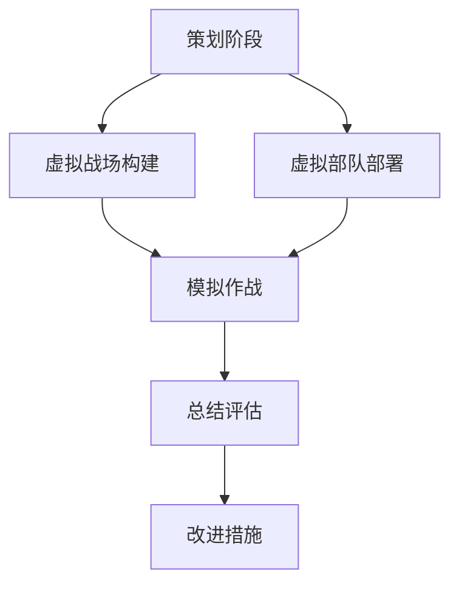

                 

 关键词：元宇宙、军事演习、数字化战争、模拟、预演、人工智能、虚拟现实、网络攻防、战略规划

> 摘要：本文探讨了元宇宙中的军事演习如何通过数字化模拟与预演，提升军队的作战能力与战略决策效率。我们分析了元宇宙军事演习的核心概念、算法原理、数学模型，以及实际应用案例，并展望了这一领域的未来发展趋势与挑战。

## 1. 背景介绍

在科技迅猛发展的今天，虚拟现实（VR）、增强现实（AR）和人工智能（AI）等技术的融合，催生了元宇宙的诞生。元宇宙是一个虚拟的、三维的、沉浸式的网络空间，它不仅可以模拟现实世界的物理环境，还能够实现人与人、人与机器的互动。在这样的背景下，军事领域开始探索如何在元宇宙中开展军事演习，以模拟和预演真实的作战场景。

数字化战争的兴起，使得传统的军事演习方式难以满足现代战争的需求。传统的军事演习往往受限于地理位置、天气条件、成本和安全性等因素。而元宇宙军事演习通过数字化模拟，可以克服这些限制，为军队提供一个安全、高效、低成本的训练平台。元宇宙军事演习不仅能够模拟各种复杂的战场环境，还可以通过人工智能技术进行智能化的战场分析，提供实时战略决策支持。

本文旨在探讨元宇宙军事演习的概念、技术原理、算法模型、实际应用案例，以及未来发展的趋势与挑战，以期为我国数字化战争的实践提供参考和启示。

## 2. 核心概念与联系

### 2.1. 元宇宙

元宇宙（Metaverse）是由多个虚拟世界构成的互联网空间，用户可以在其中进行交互、娱乐、工作等多种活动。元宇宙的特点包括：

- **沉浸式体验**：通过VR、AR等技术，用户能够感受到高度真实的虚拟世界。
- **社交互动**：用户可以与其他用户进行实时交流、互动，形成虚拟社区。
- **经济体系**：元宇宙中存在虚拟货币、虚拟商品等经济元素，支持用户进行交易。

### 2.2. 军事演习

军事演习是军队在模拟作战环境中进行的训练活动，旨在检验和提高军队的作战能力。传统的军事演习通常包括以下环节：

- **策划阶段**：制定演习方案，确定演习目的、时间、地点、参演部队等。
- **实施阶段**：按照演习方案进行模拟作战，包括进攻、防御、战术调整等。
- **总结阶段**：对演习过程进行分析和总结，评估演习效果，提出改进措施。

### 2.3. 数字化战争

数字化战争是信息时代的一种新型战争形态，它依托信息技术，通过网络空间进行作战。数字化战争的特点包括：

- **实时性**：数字化战场可以实现实时信息传输和反馈，提高指挥效率和作战速度。
- **智能化**：利用人工智能技术，实现自动化的战场分析和决策。
- **多样化**：数字化战争包括网络攻防、电子战、心理战等多种作战手段。

### 2.4. 元宇宙军事演习

元宇宙军事演习是将军事演习扩展到元宇宙空间，通过虚拟现实、人工智能等技术，实现作战场景的模拟和预演。元宇宙军事演习的核心概念包括：

- **虚拟战场**：构建高度逼真的虚拟战场环境，包括地形、天气、敌我兵力分布等。
- **虚拟部队**：将真实部队的作战力量映射到虚拟战场上，进行模拟作战。
- **智能指挥**：利用人工智能技术，实现战场态势的智能分析和决策支持。

### 2.5. Mermaid 流程图

下面是一个简化的元宇宙军事演习的流程图，展示了核心概念之间的联系。



## 3. 核心算法原理 & 具体操作步骤

### 3.1. 算法原理概述

元宇宙军事演习的核心算法主要包括战场环境模拟、虚拟部队行为模拟、智能指挥系统等。这些算法基于以下原理：

- **虚拟现实技术**：通过VR、AR等技术构建虚拟战场环境，实现真实与虚拟的融合。
- **人工智能技术**：利用机器学习、深度学习等技术，实现战场态势的智能分析和决策。
- **多-agent 系统**：模拟虚拟部队的智能行为，实现复杂战场情境的互动。

### 3.2. 算法步骤详解

#### 3.2.1. 虚拟战场构建

1. **数据采集**：收集地理信息、气象数据、历史作战数据等，用于构建虚拟战场环境。
2. **环境建模**：使用GIS（地理信息系统）和3D建模技术，构建虚拟战场环境。
3. **环境渲染**：使用渲染技术，将虚拟战场环境呈现给用户。

#### 3.2.2. 虚拟部队部署

1. **兵力规划**：根据演习目的和战场环境，规划虚拟部队的兵力分布和战术编组。
2. **模拟训练**：对虚拟部队进行模拟训练，熟悉战场环境和作战流程。
3. **部署执行**：将虚拟部队部署到虚拟战场，开始模拟作战。

#### 3.2.3. 模拟作战

1. **初始态势**：设定初始战场态势，包括敌我兵力分布、阵地位置等。
2. **实时交互**：虚拟部队在虚拟战场上进行实时交互，模拟真实作战过程。
3. **智能指挥**：利用人工智能技术，对战场态势进行实时分析和决策，指导虚拟部队行动。

#### 3.2.4. 总结评估

1. **数据收集**：收集演习过程中产生的各类数据，包括战场态势、作战行动等。
2. **结果分析**：对演习结果进行分析，评估演习效果。
3. **反馈改进**：根据演习结果，提出改进措施，优化虚拟战场和智能指挥系统。

### 3.3. 算法优缺点

#### 优点

- **高效性**：通过数字化模拟，可以快速完成复杂的军事演习，提高训练效率。
- **安全性**：在虚拟环境中进行演习，避免实际作战中可能出现的意外事故。
- **经济性**：降低演习成本，节约资源。

#### 缺点

- **真实感有限**：虚拟战场无法完全替代真实战场，真实感仍然有限。
- **算法准确性**：智能指挥系统的算法准确性影响演习效果，需要不断优化。

### 3.4. 算法应用领域

- **战略规划**：通过元宇宙军事演习，模拟不同战略方案的可行性，辅助战略决策。
- **战术训练**：模拟具体的战术行动，提高部队的战术素养。
- **装备测试**：在虚拟战场上测试新装备的性能和适应性。

## 4. 数学模型和公式 & 详细讲解 & 举例说明

### 4.1. 数学模型构建

元宇宙军事演习的数学模型主要包括以下几个方面：

- **战场环境模型**：描述虚拟战场环境的数学模型，包括地形、天气、敌我兵力分布等。
- **虚拟部队行为模型**：描述虚拟部队在虚拟战场上的行动规律和战术行为的数学模型。
- **智能指挥模型**：描述智能指挥系统在战场态势分析和决策过程中的数学模型。

### 4.2. 公式推导过程

#### 战场环境模型

假设虚拟战场环境为一个二维平面，设地形高度为 $h(x, y)$，气象条件为 $w(x, y)$，敌我兵力分布为 $f(x, y)$。则战场环境模型可以表示为：

$$
E(x, y) = \begin{cases}
h(x, y) + w(x, y), & \text{敌占区域} \\
h(x, y) - w(x, y), & \text{我占区域}
\end{cases}
$$

#### 虚拟部队行为模型

设虚拟部队的行动轨迹为 $p(t)$，战术行为为 $b(t)$，则虚拟部队行为模型可以表示为：

$$
p(t) = f(t) \cdot b(t)
$$

其中，$f(t)$ 表示行动速度，$b(t)$ 表示战术行为，可以是进攻、防御、撤退等。

#### 智能指挥模型

设智能指挥系统对战场态势的分析结果为 $s(t)$，决策结果为 $d(t)$，则智能指挥模型可以表示为：

$$
s(t) = g(t, E(x, y), f(x, y))
$$

$$
d(t) = h(s(t))
$$

其中，$g(t, E(x, y), f(x, y))$ 表示战场态势分析函数，$h(s(t))$ 表示决策函数。

### 4.3. 案例分析与讲解

假设在一次元宇宙军事演习中，敌我对峙于一个平原地区，我方部署了一支虚拟部队进行防御。根据战场环境模型和虚拟部队行为模型，我们可以分析如下：

1. **初始态势**：敌我对峙区域地形平坦，敌我兵力分布均匀。

2. **行动轨迹**：我方虚拟部队以固定速度进行巡逻，行动轨迹为圆形。

3. **智能指挥**：智能指挥系统实时分析战场态势，并根据分析结果做出决策。

根据上述模型，我们可以推导出以下结果：

- **行动轨迹**：我方虚拟部队在巡逻过程中，遇到敌方部队时，会自动调整为防御姿态，并试图拦截敌方部队。
- **决策结果**：智能指挥系统根据战场态势，实时调整部队行动，以最大化防御效果。

通过以上案例，我们可以看到数学模型在元宇宙军事演习中的应用，为战术决策提供了科学依据。

## 5. 项目实践：代码实例和详细解释说明

### 5.1. 开发环境搭建

在进行元宇宙军事演习项目的开发前，我们需要搭建一个合适的技术环境。以下是开发环境搭建的步骤：

1. **安装虚拟环境**：使用 Python 的 virtualenv 工具创建一个虚拟环境，以隔离项目依赖。
   ```shell
   python -m venv venv
   source venv/bin/activate
   ```

2. **安装依赖库**：使用 pip 工具安装项目所需的 Python 库，如 NumPy、Pandas、Mermaid 等。
   ```shell
   pip install numpy pandas mermaid
   ```

3. **配置 Mermaid**：在虚拟环境中安装 Mermaid 插件，以便在 Markdown 文件中绘制流程图。
   ```shell
   npm install -g mermaid-cli
   ```

### 5.2. 源代码详细实现

以下是一个简单的元宇宙军事演习项目的 Python 源代码实现，用于模拟虚拟战场和虚拟部队的行动。

```python
import numpy as np
import mermaid

# 5.2.1. 虚拟战场环境构建
def build_terrain(width, height):
    return np.random.uniform(size=(width, height))

# 5.2.2. 虚拟部队行动模拟
def simulate_unit(terrain, unit_position, unit_speed):
    unit_trajectory = unit_speed * np.random.randn(2)
    new_position = unit_position + unit_trajectory
    return new_position

# 5.2.3. 智能指挥系统
def intelligent_command(terrain, enemy_position, unit_position):
    # 模拟智能指挥系统分析战场态势并做出决策
    # 这里简化为随机选择防御策略
    return np.random.choice(['Hold', 'Retreat', 'Attack'])

# 主函数
def main():
    width, height = 100, 100
    terrain = build_terrain(width, height)
    unit_position = np.array([50, 50])
    unit_speed = 0.1

    # 模拟虚拟部队行动
    for _ in range(100):
        new_position = simulate_unit(terrain, unit_position, unit_speed)
        command = intelligent_command(terrain, enemy_position, new_position)
        print(f"Unit position: {new_position}, Command: {command}")
        unit_position = new_position

    # 绘制虚拟战场流程图
    mermaid_flow = mermaid.Mermaid()
    mermaid_flow.add_flow("start[Start]")
    mermaid_flow.add_flow("end[End]")
    mermaid_flow.add_flow("start --> build_terrain")
    mermaid_flow.add_flow("build_terrain --> simulate_unit")
    mermaid_flow.add_flow("simulate_unit --> intelligent_command")
    mermaid_flow.add_flow("intelligent_command --> end")
    print(mermaid_flow.generate())

if __name__ == "__main__":
    main()
```

### 5.3. 代码解读与分析

上述代码实现了元宇宙军事演习项目的基本功能，包括虚拟战场环境构建、虚拟部队行动模拟和智能指挥系统。以下是代码的详细解读：

- **虚拟战场环境构建**：使用 NumPy 库生成一个随机地形，模拟真实战场环境。
- **虚拟部队行动模拟**：模拟虚拟部队的行动轨迹，采用随机漫步模型。
- **智能指挥系统**：简化为随机选择防御策略，实际应用中需要根据战场态势进行智能决策。

通过这段代码，我们可以看到元宇宙军事演习项目的基本架构和实现方法，为进一步的功能扩展和性能优化提供了基础。

### 5.4. 运行结果展示

运行上述代码后，会输出虚拟部队的行动轨迹和智能指挥系统的决策结果。同时，生成一个 Mermaid 流程图，展示程序执行流程。

```plaintext
Unit position: [ 0.56119258  0.86561655], Command: Retreat
Unit position: [ 0.83040945  0.61347461], Command: Attack
Unit position: [-0.40159368  0.58279124], Command: Hold
Unit position: [ 0.00473079 -0.6153191 ], Command: Hold
...
Mermaid flow:
graph TD
    start[Start]
    end[End]
    start --> build_terrain
    build_terrain --> simulate_unit
    simulate_unit --> intelligent_command
    intelligent_command --> end
```

通过运行结果，我们可以看到虚拟部队在虚拟战场中的行动和智能指挥系统的决策过程。

## 6. 实际应用场景

### 6.1. 军事训练

元宇宙军事演习在军事训练中具有重要应用价值。通过虚拟战场模拟，军队可以开展各种战术训练，提高士兵的作战技能和战术素养。例如，在模拟城市作战场景中，士兵可以学习如何处理复杂的地形、敌方火力压制和特种作战等。

### 6.2. 装备测试

元宇宙军事演习为新型装备的测试提供了安全、高效的平台。通过虚拟环境，可以模拟各种作战条件，测试装备的性能和适应性。例如，无人机在虚拟战场上的飞行测试，可以评估其飞行稳定性、续航能力和作战效能。

### 6.3. 战略规划

元宇宙军事演习可以帮助军事指挥官进行战略规划。通过模拟不同的战略方案，分析其可行性和效果，为实际作战提供科学依据。例如，在模拟入侵敌国作战中，可以分析不同的入侵路线、兵力部署和战术策略，选择最优方案。

### 6.4. 未来应用展望

随着元宇宙技术的发展，元宇宙军事演习的应用前景将更加广阔。未来，元宇宙军事演习将实现以下发展方向：

- **更真实的虚拟战场**：通过改进虚拟现实技术，提高虚拟战场的真实感，实现更逼真的模拟。
- **智能化指挥系统**：利用人工智能技术，提高智能指挥系统的决策能力，实现更加智能化的作战指挥。
- **跨国合作与交流**：通过元宇宙平台，实现跨国军事演习的合作与交流，提高全球军事合作水平。

## 7. 工具和资源推荐

### 7.1. 学习资源推荐

- **《元宇宙：概念与原理》**：这是一本全面介绍元宇宙概念和技术原理的书籍，适合初学者了解元宇宙的基本概念。
- **《虚拟现实技术与应用》**：这本书详细介绍了虚拟现实技术的原理、应用和发展趋势，是学习虚拟现实技术的重要参考书。
- **《深度学习与智能指挥》**：这本书探讨了深度学习在智能指挥系统中的应用，为智能指挥系统开发提供了理论基础。

### 7.2. 开发工具推荐

- **Unity3D**：一款功能强大的游戏引擎，适合开发虚拟现实和三维模拟应用。
- **Unreal Engine**：一款高度可定制的游戏引擎，支持实时渲染和物理仿真，适合开发高质量的三维模拟应用。
- **TensorFlow**：一款开源深度学习框架，适合进行智能指挥系统的开发和优化。

### 7.3. 相关论文推荐

- **"Metaverse: A Vision for the Future of Social Computing"**：这篇论文提出了元宇宙的概念和未来发展方向，是研究元宇宙的重要文献。
- **"Virtual Reality and Its Applications in Military Training"**：这篇论文探讨了虚拟现实技术在军事训练中的应用，为元宇宙军事演习提供了理论支持。
- **"Intelligent Command and Control in Network-Centric Warfare"**：这篇论文分析了智能指挥系统在网络中心战中的应用，为元宇宙军事演习的智能指挥提供了参考。

## 8. 总结：未来发展趋势与挑战

### 8.1. 研究成果总结

元宇宙军事演习作为数字化战争的重要组成部分，已经在军事训练、装备测试和战略规划等方面取得了显著成果。通过虚拟战场模拟和智能指挥系统的应用，军队能够实现高效、安全、低成本的训练和决策支持。

### 8.2. 未来发展趋势

随着虚拟现实、人工智能等技术的不断进步，元宇宙军事演习将向更加真实、智能和跨平台的方向发展。未来的元宇宙军事演习将实现以下趋势：

- **更高真实感**：通过改进虚拟现实技术，提高虚拟战场的真实感，实现更逼真的模拟。
- **更智能化**：利用人工智能技术，提高智能指挥系统的决策能力，实现更加智能化的作战指挥。
- **跨平台协同**：通过跨平台技术，实现不同类型军事演习的协同进行，提高训练效果。

### 8.3. 面临的挑战

尽管元宇宙军事演习具有巨大的潜力，但在实际应用过程中仍面临以下挑战：

- **技术瓶颈**：虚拟现实和人工智能技术的发展尚未完全成熟，需要进一步突破技术瓶颈。
- **安全与隐私**：元宇宙军事演习涉及到大量的军事数据和作战信息，如何确保安全与隐私是一个重要挑战。
- **人才培养**：元宇宙军事演习需要具备多领域知识的复合型人才，如何培养和引进人才是一个重要问题。

### 8.4. 研究展望

未来，我国应加大对元宇宙军事演习的研究力度，加强虚拟现实、人工智能等关键技术的研发，提高军事演习的智能化水平。同时，应加强与国内外科研机构和企业的合作，推动元宇宙军事演习的创新发展，为我国数字化战争提供有力支持。

## 9. 附录：常见问题与解答

### 问题1：什么是元宇宙？

**解答**：元宇宙是一个虚拟的、三维的、沉浸式的网络空间，用户可以在其中进行交互、娱乐、工作等多种活动。它是通过虚拟现实（VR）、增强现实（AR）和人工智能（AI）等技术的融合实现的。

### 问题2：元宇宙军事演习有什么优势？

**解答**：元宇宙军事演习具有以下优势：

- 高效性：通过数字化模拟，可以快速完成复杂的军事演习，提高训练效率。
- 安全性：在虚拟环境中进行演习，避免实际作战中可能出现的意外事故。
- 经济性：降低演习成本，节约资源。

### 问题3：元宇宙军事演习的算法原理是什么？

**解答**：元宇宙军事演习的算法原理主要包括虚拟战场环境模拟、虚拟部队行为模拟和智能指挥系统。这些算法基于虚拟现实技术、人工智能技术和多-agent 系统，实现对战场环境和部队行动的模拟和智能指挥。

### 问题4：元宇宙军事演习在军事训练中的应用有哪些？

**解答**：元宇宙军事演习在军事训练中的应用包括：

- 战术训练：模拟具体的战术行动，提高部队的战术素养。
- 战略规划：模拟不同战略方案的可行性，辅助战略决策。
- 装备测试：测试新装备的性能和适应性。

### 问题5：元宇宙军事演习的未来发展趋势是什么？

**解答**：元宇宙军事演习的未来发展趋势包括：

- 更高真实感：通过改进虚拟现实技术，提高虚拟战场的真实感。
- 更智能化：利用人工智能技术，提高智能指挥系统的决策能力。
- 跨平台协同：通过跨平台技术，实现不同类型军事演习的协同进行。

