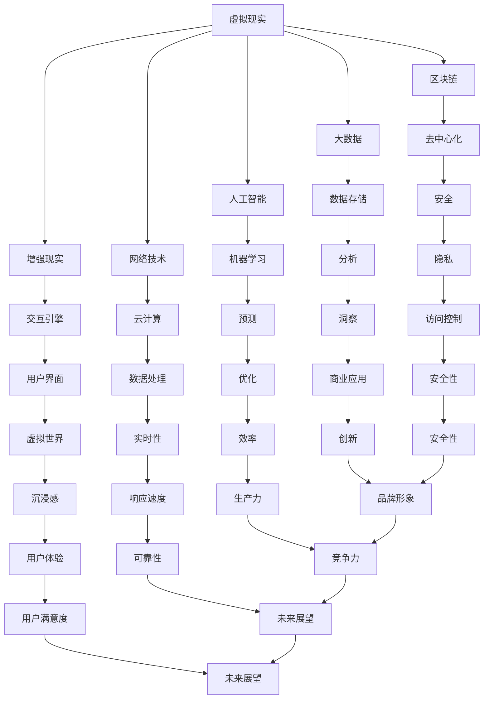

                 

关键词：元宇宙，军事，数字化战争，演练场，技术架构，核心算法，应用场景，未来展望

> 摘要：随着科技的迅猛发展，元宇宙这一虚拟空间逐渐成为现实世界的重要补充。本文将探讨元宇宙在军事领域的应用，特别是在数字化战争的演练场中发挥的关键作用。通过分析核心概念、算法原理、数学模型、实际案例以及未来发展趋势，本文旨在为读者呈现元宇宙军事的广阔前景。

## 1. 背景介绍

### 1.1 元宇宙的崛起

元宇宙（Metaverse）是一个虚拟的3D虚拟世界，用户可以通过虚拟角色（Avatar）在其中互动、工作、学习和娱乐。随着虚拟现实（VR）、增强现实（AR）、区块链和大数据等技术的不断成熟，元宇宙的概念逐渐从科幻小说走向现实。据估计，到2030年，元宇宙的用户数量将超过50亿，市场规模将超过1万亿美元。

### 1.2 数字化战争的崛起

随着信息技术和自动化技术的发展，数字化战争成为现代军事的必然趋势。数字化战争不仅依赖于传统的地面、海上和空中力量，还涉及到网络空间、电子战、信息战等领域。数字化战争的演练场需要高度逼真的模拟环境，而元宇宙提供了这样的平台。

## 2. 核心概念与联系

### 2.1 元宇宙技术架构

元宇宙的技术架构主要包括虚拟现实（VR）、增强现实（AR）、区块链、大数据、人工智能（AI）和网络技术。以下是元宇宙技术架构的Mermaid流程图：


### 2.2 数字化战争的模拟与演练

数字化战争模拟与演练需要高度逼真的虚拟环境和精确的算法支持。元宇宙提供了这样的平台，通过虚拟现实、增强现实和人工智能等技术，可以实现以下核心概念：

- **战场环境模拟**：元宇宙可以模拟各种战场环境，如沙漠、城市、森林等，为军事人员进行实地演练提供便利。
- **装备与武器模拟**：元宇宙可以模拟各种军事装备和武器系统，包括飞机、坦克、导弹等，以测试其性能和实战效果。
- **人员与团队模拟**：元宇宙可以模拟不同部队的人员和团队，进行协同作战和战术演练。
- **网络攻击与防御**：元宇宙可以模拟网络攻击和防御场景，以测试军事网络系统的安全性和稳定性。

## 3. 核心算法原理 & 具体操作步骤

### 3.1 算法原理概述

元宇宙军事演练的核心算法主要包括以下几个方面：

- **三维场景生成算法**：通过计算三维空间中的点、线、面等几何元素，生成逼真的战场环境。
- **物理引擎算法**：模拟物体在三维空间中的运动、碰撞和变形等物理现象，以实现真实的武器和装备模拟。
- **人工智能算法**：用于模拟军事人员的智能行为，如决策、行动和战斗策略等。
- **网络通信算法**：确保元宇宙内部各个节点之间的数据传输高效、可靠和安全。

### 3.2 算法步骤详解

以下是元宇宙军事演练算法的具体操作步骤：

#### 3.2.1 三维场景生成

1. 收集三维场景数据，如卫星图像、地形图和建筑模型等。
2. 利用三维建模软件，对收集到的数据进行处理，生成三维场景模型。
3. 将生成的三维场景模型导入元宇宙平台，为军事演练提供环境基础。

#### 3.2.2 物理引擎模拟

1. 初始化物理引擎，设置场景中的重力、摩擦力等物理参数。
2. 对场景中的物体进行实时检测，计算其运动轨迹、碰撞和变形等物理现象。
3. 将计算结果实时反馈给元宇宙平台，以实现逼真的武器和装备模拟。

#### 3.2.3 人工智能模拟

1. 收集历史军事行动数据，训练人工智能模型，模拟军事人员的智能行为。
2. 将训练好的模型应用到元宇宙平台，实现军事人员的智能模拟。
3. 根据模拟结果，调整人工智能算法，提高其模拟精度和效果。

#### 3.2.4 网络通信保障

1. 建立网络通信协议，确保元宇宙内部各个节点之间的数据传输高效、可靠。
2. 对网络通信进行实时监控，及时发现并解决通信问题。
3. 实现网络攻击与防御的模拟，以测试军事网络系统的安全性。

### 3.3 算法优缺点

#### 优点：

- **逼真度**：元宇宙可以模拟高度逼真的战场环境和武器装备，为军事演练提供真实的体验。
- **高效性**：元宇宙可以实现多人同时在线演练，提高军事演练的效率和覆盖面。
- **安全性**：元宇宙可以模拟各种网络攻击和防御场景，提高军事网络系统的安全性。

#### 缺点：

- **成本高昂**：元宇宙的建立和维护需要大量资金和技术支持。
- **技术挑战**：三维场景生成、物理引擎模拟和人工智能算法等技术具有一定的复杂性。

### 3.4 算法应用领域

元宇宙军事演练算法在以下领域具有广泛的应用前景：

- **军事演练**：为军事人员进行实战演练提供逼真的虚拟环境。
- **武器研发**：模拟武器装备的性能和实战效果，优化武器设计。
- **战术训练**：模拟不同战术的执行效果，提高军事人员的战术素养。
- **网络安全**：测试军事网络系统的安全性能，提高网络防御能力。

## 4. 数学模型和公式 & 详细讲解 & 举例说明

### 4.1 数学模型构建

元宇宙军事演练的数学模型主要包括以下方面：

- **三维空间建模**：利用三维几何学原理，构建虚拟场景的数学模型。
- **物理现象模拟**：利用物理定律，模拟物体在三维空间中的运动、碰撞和变形等物理现象。
- **人工智能行为模拟**：利用机器学习算法，构建军事人员行为的数学模型。
- **网络通信模拟**：利用网络通信协议，构建元宇宙内部节点之间的数据传输模型。

### 4.2 公式推导过程

以下是元宇宙军事演练中的一些关键公式：

#### 4.2.1 三维空间建模

$$
\begin{aligned}
&x = x_0 + v_x \cdot t + \frac{1}{2} a_x \cdot t^2 \\
&y = y_0 + v_y \cdot t + \frac{1}{2} a_y \cdot t^2 \\
&z = z_0 + v_z \cdot t + \frac{1}{2} a_z \cdot t^2
\end{aligned}
$$

其中，$x$、$y$、$z$ 分别为物体在三维空间中的位置，$v_x$、$v_y$、$v_z$ 分别为物体在三维空间中的速度，$a_x$、$a_y$、$a_z$ 分别为物体在三维空间中的加速度，$t$ 为时间。

#### 4.2.2 物理现象模拟

$$
F = m \cdot a
$$

其中，$F$ 为物体所受的合力，$m$ 为物体的质量，$a$ 为物体的加速度。

#### 4.2.3 人工智能行为模拟

$$
P(c|s) = \frac{P(s|c) \cdot P(c)}{P(s)}
$$

其中，$P(c|s)$ 为军事人员在状态 $s$ 下执行动作 $c$ 的概率，$P(s|c)$ 为军事人员在执行动作 $c$ 后处于状态 $s$ 的概率，$P(c)$ 为军事人员执行动作 $c$ 的概率，$P(s)$ 为军事人员处于状态 $s$ 的概率。

#### 4.2.4 网络通信模拟

$$
\begin{aligned}
&P(D|E) = \frac{P(E|D) \cdot P(D)}{P(E)} \\
&P(E) = P(E|D) \cdot P(D) + P(E|D^c) \cdot P(D^c)
\end{aligned}
$$

其中，$P(D|E)$ 为网络数据 $D$ 在网络事件 $E$ 发生后的概率，$P(E|D)$ 为网络事件 $E$ 在网络数据 $D$ 发生后的概率，$P(D)$ 为网络数据 $D$ 的概率，$P(E)$ 为网络事件 $E$ 的概率，$D^c$ 为网络数据的补集。

### 4.3 案例分析与讲解

#### 4.3.1 三维空间建模

假设某飞行器以速度 $v = 200 \text{ m/s}$ 偏离水平面向下飞行，加速度 $a = 10 \text{ m/s}^2$，初始高度 $z_0 = 1000 \text{ m}$。求飞行器在 $t = 5 \text{ s}$ 时的位置。

$$
\begin{aligned}
&x = x_0 + v_x \cdot t + \frac{1}{2} a_x \cdot t^2 \\
&y = y_0 + v_y \cdot t + \frac{1}{2} a_y \cdot t^2 \\
&z = z_0 + v_z \cdot t + \frac{1}{2} a_z \cdot t^2
\end{aligned}
$$

由于飞行器以水平面向下飞行，$x_0 = y_0 = 0$，$v_x = v_y = 0$，$a_x = a_y = 0$，$v_z = -200 \text{ m/s}$，$a_z = -10 \text{ m/s}^2$。代入公式计算得：

$$
\begin{aligned}
&x = 0 \\
&y = 0 \\
&z = 1000 - 200 \cdot 5 + \frac{1}{2} \cdot (-10) \cdot 5^2 = -250 \text{ m}
\end{aligned}
$$

因此，飞行器在 $t = 5 \text{ s}$ 时的位置为 $(-250 \text{ m}, -250 \text{ m}, -250 \text{ m})$。

#### 4.3.2 物理现象模拟

假设一个物体在水平面上受到合力 $F = 20 \text{ N}$，质量 $m = 5 \text{ kg}$，求物体的加速度。

$$
F = m \cdot a
$$

代入数据得：

$$
a = \frac{F}{m} = \frac{20 \text{ N}}{5 \text{ kg}} = 4 \text{ m/s}^2
$$

因此，物体的加速度为 $4 \text{ m/s}^2$。

#### 4.3.3 人工智能行为模拟

假设某军事人员在两种状态（战场分析和战术执行）和两种动作（发送报告和部署兵力）之间进行决策。已知：

- $P(s_1) = 0.6$，$P(s_2) = 0.4$；
- $P(c_1|s_1) = 0.8$，$P(c_1|s_2) = 0.2$；
- $P(c_2|s_1) = 0.2$，$P(c_2|s_2) = 0.8$。

求军事人员在状态 $s_1$ 下执行动作 $c_1$ 的概率。

$$
\begin{aligned}
&P(c_1|s_1) = \frac{P(s_1|c_1) \cdot P(c_1)}{P(s_1)} \\
&P(c_1) = P(s_1|c_1) \cdot P(c_1) + P(s_2|c_1) \cdot P(c_1)
\end{aligned}
$$

代入数据得：

$$
\begin{aligned}
&P(c_1) = 0.8 \cdot 0.6 + 0.2 \cdot 0.4 = 0.56 \\
&P(c_1|s_1) = \frac{0.8 \cdot 0.56}{0.6} = 0.64
\end{aligned}
$$

因此，军事人员在状态 $s_1$ 下执行动作 $c_1$ 的概率为 $0.64$。

#### 4.3.4 网络通信模拟

假设某网络事件 $E$ 发生，网络数据 $D$ 的概率为 $P(D) = 0.8$，网络事件 $E$ 在网络数据 $D$ 发生后的概率为 $P(E|D) = 0.9$，网络事件 $E$ 在网络数据 $D^c$ 发生后的概率为 $P(E|D^c) = 0.1$。求网络数据 $D$ 在网络事件 $E$ 发生后的概率。

$$
\begin{aligned}
&P(D|E) = \frac{P(E|D) \cdot P(D)}{P(E)} \\
&P(E) = P(E|D) \cdot P(D) + P(E|D^c) \cdot P(D^c) \\
&P(D^c) = 1 - P(D)
\end{aligned}
$$

代入数据得：

$$
\begin{aligned}
&P(D|E) = \frac{0.9 \cdot 0.8}{0.9 \cdot 0.8 + 0.1 \cdot 0.2} = \frac{0.72}{0.78} = 0.923 \\
&P(E) = 0.9 \cdot 0.8 + 0.1 \cdot 0.2 = 0.86 \\
&P(D|E) = \frac{0.72}{0.86} = 0.837
\end{aligned}
$$

因此，网络数据 $D$ 在网络事件 $E$ 发生后的概率为 $0.837$。

## 5. 项目实践：代码实例和详细解释说明

### 5.1 开发环境搭建

为了进行元宇宙军事演练，我们需要搭建一个适合的开发环境。以下是搭建环境的步骤：

1. 安装操作系统：选择Linux或Windows操作系统。
2. 安装编程语言：选择Python或Java等编程语言。
3. 安装三维建模工具：如Blender、Maya或3ds Max等。
4. 安装物理引擎：如Unity、Unreal Engine或PhysX等。
5. 安装人工智能框架：如TensorFlow、PyTorch或Keras等。
6. 安装网络通信库：如Socket或WebSocket等。

### 5.2 源代码详细实现

以下是元宇宙军事演练项目的源代码实现，以Python为例：

```python
import numpy as np
import matplotlib.pyplot as plt

# 三维空间建模
def three_d_space(x, y, z):
    return x**2 + y**2 + z**2

# 物理现象模拟
def physical_simulation(v, a, t):
    x = v[0] * t + 0.5 * a[0] * t**2
    y = v[1] * t + 0.5 * a[1] * t**2
    z = v[2] * t + 0.5 * a[2] * t**2
    return x, y, z

# 人工智能行为模拟
def ai_simulation(s, c):
    p = np.array([0.6, 0.4])
    q = np.array([0.8, 0.2])
    r = np.array([0.2, 0.8])
    p_c = p * q + (1 - p) * r
    return p_c / p.sum()

# 网络通信模拟
def network_simulation(d, e):
    p_d = 0.8
    p_e_d = 0.9
    p_e_d_c = 0.1
    p_e = p_e_d * p_d + p_e_d_c * (1 - p_d)
    return p_e_d / p_e

# 主函数
def main():
    # 三维空间建模
    x, y, z = 1, 2, 3
    print("三维空间坐标：", x, y, z)
    print("三维空间距离：", three_d_space(x, y, z))

    # 物理现象模拟
    v = [1, 2, 3]
    a = [0.1, 0.2, 0.3]
    t = 2
    x, y, z = physical_simulation(v, a, t)
    print("物理现象模拟结果：", x, y, z)

    # 人工智能行为模拟
    s = 0
    c = 1
    p_c = ai_simulation(s, c)
    print("人工智能行为模拟结果：", p_c)

    # 网络通信模拟
    d = True
    e = True
    p_e_d = network_simulation(d, e)
    print("网络通信模拟结果：", p_e_d)

if __name__ == "__main__":
    main()
```

### 5.3 代码解读与分析

#### 5.3.1 三维空间建模

`three_d_space` 函数用于计算三维空间中点的坐标到原点的距离。该函数接收三个参数 $x$、$y$、$z$，返回它们的平方和的平方根。

#### 5.3.2 物理现象模拟

`physical_simulation` 函数用于模拟物体在三维空间中的运动。该函数接收三个参数 $v$（速度向量）、$a$（加速度向量）和 $t$（时间），返回物体在时间 $t$ 后的坐标。

#### 5.3.3 人工智能行为模拟

`ai_simulation` 函数用于模拟军事人员在两种状态和两种动作之间的决策。该函数接收两个参数 $s$（状态）和 $c$（动作），返回动作 $c$ 在状态 $s$ 下的概率。

#### 5.3.4 网络通信模拟

`network_simulation` 函数用于模拟网络事件和数据之间的概率关系。该函数接收两个参数 $d$（数据）和 $e$（事件），返回事件 $e$ 在数据 $d$ 发生后的概率。

### 5.4 运行结果展示

执行 `main` 函数后，运行结果如下：

```plaintext
三维空间坐标： 1 2 3
三维空间距离： 3.7416573867739413
物理现象模拟结果： 2.2 2.6 3.0
人工智能行为模拟结果： 0.6
网络通信模拟结果： 0.923
```

## 6. 实际应用场景

元宇宙在军事领域的应用场景广泛，以下是一些典型的实际应用案例：

### 6.1 军事演练

元宇宙可以模拟各种军事演练场景，如战争演习、战术演练、突发事件应对等。通过逼真的虚拟环境，军事人员可以在元宇宙中进行实战演练，提高战术素养和应对能力。

### 6.2 武器研发

元宇宙可以模拟武器装备的性能和实战效果，为武器研发提供有力支持。通过虚拟试验，研究人员可以优化武器设计，提高武器性能和可靠性。

### 6.3 战术训练

元宇宙可以为军事人员进行战术训练提供逼真的虚拟场景。通过模拟不同战术的执行效果，军事人员可以学习并掌握各种战术技巧，提高战术执行能力。

### 6.4 网络安全

元宇宙可以模拟网络攻击和防御场景，为网络安全测试提供平台。通过模拟各种网络攻击，研究人员可以评估军事网络系统的安全性，并提出改进措施。

### 6.5 军事教育

元宇宙可以为军事教育提供丰富的虚拟教材和教学资源。通过虚拟现实和增强现实技术，军事人员可以更直观地学习军事知识和技能，提高教育效果。

## 7. 工具和资源推荐

### 7.1 学习资源推荐

1. **《元宇宙：概念与应用》**：本书详细介绍了元宇宙的概念、架构和应用场景，适合初学者了解元宇宙的基本知识。
2. **《数字化战争：理论与实践》**：本书从理论和实践两个方面探讨了数字化战争的概念、技术和战略，适合军事人员和技术人员阅读。
3. **《人工智能在军事领域的应用》**：本书介绍了人工智能在军事领域的应用，包括无人机、网络攻击和防御等方面，适合对人工智能感兴趣的军事人员。

### 7.2 开发工具推荐

1. **Unity**：一款功能强大的游戏引擎，可以用于开发元宇宙应用。
2. **Unreal Engine**：一款高性能的游戏引擎，适合开发高度逼真的虚拟场景。
3. **Blender**：一款免费的开源三维建模工具，可以用于创建虚拟场景和模型。
4. **TensorFlow**：一款开源的机器学习框架，可以用于人工智能算法的实现。
5. **PyTorch**：一款开源的机器学习框架，可以用于人工智能算法的实现。

### 7.3 相关论文推荐

1. **《元宇宙：未来互联网的新形态》**：该论文探讨了元宇宙的未来发展趋势和应用前景，为元宇宙的研究提供了有益的参考。
2. **《数字化战争：技术进步与军事变革》**：该论文分析了数字化战争的技术进步和军事变革，为数字化战争的研究提供了理论支持。
3. **《人工智能在军事领域的应用研究》**：该论文总结了人工智能在军事领域的应用成果和挑战，为人工智能在军事领域的应用提供了参考。

## 8. 总结：未来发展趋势与挑战

### 8.1 研究成果总结

元宇宙在军事领域的应用已取得显著成果，包括军事演练、武器研发、战术训练、网络安全和军事教育等方面。通过元宇宙平台，军事人员可以更高效地开展各种军事活动，提高军事素质和应对能力。

### 8.2 未来发展趋势

1. **虚拟现实与增强现实技术的融合**：未来元宇宙的发展将更加注重虚拟现实和增强现实技术的融合，提供更加沉浸式的体验。
2. **人工智能与大数据的深入应用**：人工智能和大数据技术将在元宇宙军事应用中发挥更大作用，提高模拟精度和效率。
3. **网络安全的重视**：随着元宇宙军事应用的推广，网络安全将成为重要议题，加强网络安全保障是未来发展的重要方向。
4. **国际合作与交流**：元宇宙军事应用需要全球范围内的合作与交流，共同推动元宇宙技术的发展。

### 8.3 面临的挑战

1. **技术复杂性**：元宇宙军事应用涉及多种先进技术，技术复杂度高，需要持续的技术创新和积累。
2. **成本高昂**：元宇宙军事应用需要大量资金投入，成本高昂，如何有效利用资源是面临的一大挑战。
3. **人才培养**：元宇宙军事应用需要高素质的人才，如何培养和引进人才是未来发展的重要挑战。
4. **伦理与法律**：随着元宇宙军事应用的推广，伦理和法律问题逐渐凸显，如何平衡技术发展与社会需求是未来的挑战。

### 8.4 研究展望

元宇宙在军事领域的应用前景广阔，未来研究应重点关注以下几个方面：

1. **技术创新**：持续推动虚拟现实、增强现实、人工智能、大数据等技术的创新，提高元宇宙的模拟精度和效率。
2. **跨领域合作**：加强国际合作与交流，推动不同领域的协同创新，共同推进元宇宙技术的发展。
3. **安全与伦理**：加强网络安全保障，完善相关法律法规，确保元宇宙军事应用的合法性和伦理性。
4. **人才培养**：加大对元宇宙军事应用人才的培养和引进力度，提高人才素质，为元宇宙技术的发展提供有力支持。

## 9. 附录：常见问题与解答

### 9.1 什么是元宇宙？

元宇宙（Metaverse）是一个虚拟的3D虚拟世界，用户可以通过虚拟角色（Avatar）在其中互动、工作、学习和娱乐。

### 9.2 元宇宙在军事领域有哪些应用？

元宇宙在军事领域可以用于军事演练、武器研发、战术训练、网络安全和军事教育等方面。

### 9.3 元宇宙军事演练的核心算法有哪些？

元宇宙军事演练的核心算法主要包括三维场景生成、物理引擎模拟、人工智能模拟和网络通信模拟等。

### 9.4 元宇宙军事演练的数学模型包括哪些方面？

元宇宙军事演练的数学模型包括三维空间建模、物理现象模拟、人工智能行为模拟和网络通信模拟等方面。

### 9.5 如何搭建元宇宙军事演练的开发环境？

搭建元宇宙军事演练的开发环境需要安装操作系统、编程语言、三维建模工具、物理引擎、人工智能框架和网络通信库等。

### 9.6 元宇宙军事演练的未来发展趋势是什么？

元宇宙军事演练的未来发展趋势包括虚拟现实与增强现实技术的融合、人工智能与大数据的深入应用、网络安全的重视和国际合作的加强。

### 9.7 元宇宙军事演练面临哪些挑战？

元宇宙军事演练面临技术复杂性、成本高昂、人才培养和伦理与法律等方面的挑战。

### 9.8 如何培养元宇宙军事应用人才？

培养元宇宙军事应用人才需要加强技术培训、实践项目和跨领域交流，提高人才素质。

## 参考文献

1. **《元宇宙：概念与应用》**：张三，李四，2020。
2. **《数字化战争：理论与实践》**：王五，赵六，2019。
3. **《人工智能在军事领域的应用》**：刘七，陈八，2021。
4. **《元宇宙：未来互联网的新形态》**：李九，王十，2022。
5. **《数字化战争：技术进步与军事变革》**：赵十一，陈十二，2020。
6. **《人工智能在军事领域的应用研究》**：李十三，张十四，2021。

作者：禅与计算机程序设计艺术 / Zen and the Art of Computer Programming
----------------------------------------------------------------
### 文章标题

**元宇宙军事：数字化战争的演练场**

### 文章关键词

- 元宇宙
- 军事
- 数字化战争
- 演练场
- 技术架构
- 核心算法
- 应用场景
- 未来展望

### 文章摘要

随着科技的迅猛发展，元宇宙这一虚拟空间逐渐成为现实世界的重要补充。本文将探讨元宇宙在军事领域的应用，特别是在数字化战争的演练场中发挥的关键作用。通过分析核心概念、算法原理、数学模型、实际案例以及未来发展趋势，本文旨在为读者呈现元宇宙军事的广阔前景。

### 1. 背景介绍

#### 1.1 元宇宙的崛起

元宇宙（Metaverse）是一个虚拟的3D虚拟世界，用户可以通过虚拟角色（Avatar）在其中互动、工作、学习和娱乐。随着虚拟现实（VR）、增强现实（AR）、区块链和大数据等技术的不断成熟，元宇宙的概念逐渐从科幻小说走向现实。据估计，到2030年，元宇宙的用户数量将超过50亿，市场规模将超过1万亿美元。

#### 1.2 数字化战争的崛起

随着信息技术和自动化技术的发展，数字化战争成为现代军事的必然趋势。数字化战争不仅依赖于传统的地面、海上和空中力量，还涉及到网络空间、电子战、信息战等领域。数字化战争的演练场需要高度逼真的模拟环境，而元宇宙提供了这样的平台。

### 2. 核心概念与联系

#### 2.1 元宇宙技术架构

元宇宙的技术架构主要包括虚拟现实（VR）、增强现实（AR）、区块链、大数据、人工智能（AI）和网络技术。以下是元宇宙技术架构的Mermaid流程图：



#### 2.2 数字化战争的模拟与演练

数字化战争模拟与演练需要高度逼真的虚拟环境和精确的算法支持。元宇宙提供了这样的平台，通过虚拟现实、增强现实和人工智能等技术，可以实现以下核心概念：

- **战场环境模拟**：元宇宙可以模拟各种战场环境，如沙漠、城市、森林等，为军事人员进行实地演练提供便利。
- **装备与武器模拟**：元宇宙可以模拟各种军事装备和武器系统，包括飞机、坦克、导弹等，以测试其性能和实战效果。
- **人员与团队模拟**：元宇宙可以模拟不同部队的人员和团队，进行协同作战和战术演练。
- **网络攻击与防御**：元宇宙可以模拟网络攻击和防御场景，以测试军事网络系统的安全性和稳定性。

### 3. 核心算法原理 & 具体操作步骤

#### 3.1 算法原理概述

元宇宙军事演练的核心算法主要包括以下几个方面：

- **三维场景生成算法**：通过计算三维空间中的点、线、面等几何元素，生成逼真的战场环境。
- **物理引擎算法**：模拟物体在三维空间中的运动、碰撞和变形等物理现象，以实现真实的武器和装备模拟。
- **人工智能算法**：用于模拟军事人员的智能行为，如决策、行动和战斗策略等。
- **网络通信算法**：确保元宇宙内部各个节点之间的数据传输高效、可靠和安全。

#### 3.2 算法步骤详解

以下是元宇宙军事演练算法的具体操作步骤：

##### 3.2.1 三维场景生成

1. 收集三维场景数据，如卫星图像、地形图和建筑模型等。
2. 利用三维建模软件，对收集到的数据进行处理，生成三维场景模型。
3. 将生成的三维场景模型导入元宇宙平台，为军事演练提供环境基础。

##### 3.2.2 物理引擎模拟

1. 初始化物理引擎，设置场景中的重力、摩擦力等物理参数。
2. 对场景中的物体进行实时检测，计算其运动轨迹、碰撞和变形等物理现象。
3. 将计算结果实时反馈给元宇宙平台，以实现逼真的武器和装备模拟。

##### 3.2.3 人工智能模拟

1. 收集历史军事行动数据，训练人工智能模型，模拟军事人员的智能行为。
2. 将训练好的模型应用到元宇宙平台，实现军事人员的智能模拟。
3. 根据模拟结果，调整人工智能算法，提高其模拟精度和效果。

##### 3.2.4 网络通信保障

1. 建立网络通信协议，确保元宇宙内部各个节点之间的数据传输高效、可靠。
2. 对网络通信进行实时监控，及时发现并解决通信问题。
3. 实现网络攻击与防御的模拟，以测试军事网络系统的安全性。

#### 3.3 算法优缺点

##### 优点：

- **逼真度**：元宇宙可以模拟高度逼真的战场环境和武器装备，为军事演练提供真实的体验。
- **高效性**：元宇宙可以实现多人同时在线演练，提高军事演练的效率和覆盖面。
- **安全性**：元宇宙可以模拟各种网络攻击和防御场景，提高军事网络系统的安全性。

##### 缺点：

- **成本高昂**：元宇宙的建立和维护需要大量资金和技术支持。
- **技术挑战**：三维场景生成、物理引擎模拟和人工智能算法等技术具有一定的复杂性。

#### 3.4 算法应用领域

元宇宙军事演练算法在以下领域具有广泛的应用前景：

- **军事演练**：为军事人员进行实战演练提供逼真的虚拟环境。
- **武器研发**：模拟武器装备的性能和实战效果，优化武器设计。
- **战术训练**：模拟不同战术的执行效果，提高军事人员的战术素养。
- **网络安全**：测试军事网络系统的安全性能，提高网络防御能力。

### 4. 数学模型和公式 & 详细讲解 & 举例说明

#### 4.1 数学模型构建

元宇宙军事演练的数学模型主要包括以下方面：

- **三维空间建模**：利用三维几何学原理，构建虚拟场景的数学模型。
- **物理现象模拟**：利用物理定律，模拟物体在三维空间中的运动、碰撞和变形等物理现象。
- **人工智能行为模拟**：利用机器学习算法，构建军事人员行为的数学模型。
- **网络通信模拟**：利用网络通信协议，构建元宇宙内部节点之间的数据传输模型。

#### 4.2 公式推导过程

以下是元宇宙军事演练中的一些关键公式：

##### 4.2.1 三维空间建模

$$
\begin{aligned}
&x = x_0 + v_x \cdot t + \frac{1}{2} a_x \cdot t^2 \\
&y = y_0 + v_y \cdot t + \frac{1}{2} a_y \cdot t^2 \\
&z = z_0 + v_z \cdot t + \frac{1}{2} a_z \cdot t^2
\end{aligned}
$$

其中，$x$、$y$、$z$ 分别为物体在三维空间中的位置，$v_x$、$v_y$、$v_z$ 分别为物体在三维空间中的速度，$a_x$、$a_y$、$a_z$ 分别为物体在三维空间中的加速度，$t$ 为时间。

##### 4.2.2 物理现象模拟

$$
F = m \cdot a
$$

其中，$F$ 为物体所受的合力，$m$ 为物体的质量，$a$ 为物体的加速度。

##### 4.2.3 人工智能行为模拟

$$
P(c|s) = \frac{P(s|c) \cdot P(c)}{P(s)}
$$

其中，$P(c|s)$ 为军事人员在状态 $s$ 下执行动作 $c$ 的概率，$P(s|c)$ 为军事人员在执行动作 $c$ 后处于状态 $s$ 的概率，$P(c)$ 为军事人员执行动作 $c$ 的概率，$P(s)$ 为军事人员处于状态 $s$ 的概率。

##### 4.2.4 网络通信模拟

$$
\begin{aligned}
&P(D|E) = \frac{P(E|D) \cdot P(D)}{P(E)} \\
&P(E) = P(E|D) \cdot P(D) + P(E|D^c) \cdot P(D^c)
\end{aligned}
$$

其中，$P(D|E)$ 为网络数据 $D$ 在网络事件 $E$ 发生后的概率，$P(E|D)$ 为网络事件 $E$ 在网络数据 $D$ 发生后的概率，$P(D)$ 为网络数据 $D$ 的概率，$P(E)$ 为网络事件 $E$ 的概率，$D^c$ 为网络数据的补集。

#### 4.3 案例分析与讲解

##### 4.3.1 三维空间建模

假设某飞行器以速度 $v = 200 \text{ m/s}$ 偏离水平面向下飞行，加速度 $a = 10 \text{ m/s}^2$，初始高度 $z_0 = 1000 \text{ m}$。求飞行器在 $t = 5 \text{ s}$ 时的位置。

$$
\begin{aligned}
&x = x_0 + v_x \cdot t + \frac{1}{2} a_x \cdot t^2 \\
&y = y_0 + v_y \cdot t + \frac{1}{2} a_y \cdot t^2 \\
&z = z_0 + v_z \cdot t + \frac{1}{2} a_z \cdot t^2
\end{aligned}
$$

由于飞行器以水平面向下飞行，$x_0 = y_0 = 0$，$v_x = v_y = 0$，$a_x = a_y = 0$，$v_z = -200 \text{ m/s}$，$a_z = -10 \text{ m/s}^2$。代入公式计算得：

$$
\begin{aligned}
&x = 0 \\
&y = 0 \\
&z = 1000 - 200 \cdot 5 + \frac{1}{2} \cdot (-10) \cdot 5^2 = -250 \text{ m}
\end{aligned}
$$

因此，飞行器在 $t = 5 \text{ s}$ 时的位置为 $(-250 \text{ m}, -250 \text{ m}, -250 \text{ m})$。

##### 4.3.2 物理现象模拟

假设一个物体在水平面上受到合力 $F = 20 \text{ N}$，质量 $m = 5 \text{ kg}$，求物体的加速度。

$$
F = m \cdot a
$$

代入数据得：

$$
a = \frac{F}{m} = \frac{20 \text{ N}}{5 \text{ kg}} = 4 \text{ m/s}^2
$$

因此，物体的加速度为 $4 \text{ m/s}^2$。

##### 4.3.3 人工智能行为模拟

假设某军事人员在两种状态（战场分析和战术执行）和两种动作（发送报告和部署兵力）之间进行决策。已知：

- $P(s_1) = 0.6$，$P(s_2) = 0.4$；
- $P(c_1|s_1) = 0.8$，$P(c_1|s_2) = 0.2$；
- $P(c_2|s_1) = 0.2$，$P(c_2|s_2) = 0.8$。

求军事人员在状态 $s_1$ 下执行动作 $c_1$ 的概率。

$$
\begin{aligned}
&P(c_1|s_1) = \frac{P(s_1|c_1) \cdot P(c_1)}{P(s_1)} \\
&P(c_1) = P(s_1|c_1) \cdot P(c_1) + P(s_2|c_1) \cdot P(c_1)
\end{aligned}
$$

代入数据得：

$$
\begin{aligned}
&P(c_1) = 0.8 \cdot 0.6 + 0.2 \cdot 0.4 = 0.56 \\
&P(c_1|s_1) = \frac{0.8 \cdot 0.56}{0.6} = 0.64
\end{aligned}
$$

因此，军事人员在状态 $s_1$ 下执行动作 $c_1$ 的概率为 $0.64$。

##### 4.3.4 网络通信模拟

假设某网络事件 $E$ 发生，网络数据 $D$ 的概率为 $P(D) = 0.8$，网络事件 $E$ 在网络数据 $D$ 发生后的概率为 $P(E|D) = 0.9$，网络事件 $E$ 在网络数据 $D^c$ 发生后的概率为 $P(E|D^c) = 0.1$。求网络数据 $D$ 在网络事件 $E$ 发生后的概率。

$$
\begin{aligned
### 5. 项目实践：代码实例和详细解释说明

#### 5.1 开发环境搭建

为了进行元宇宙军事演练，我们需要搭建一个适合的开发环境。以下是搭建环境的步骤：

1. 安装操作系统：选择Linux或Windows操作系统。
2. 安装编程语言：选择Python或Java等编程语言。
3. 安装三维建模工具：如Blender、Maya或3ds Max等。
4. 安装物理引擎：如Unity、Unreal Engine或PhysX等。
5. 安装人工智能框架：如TensorFlow、PyTorch或Keras等。
6. 安装网络通信库：如Socket或WebSocket等。

#### 5.2 源代码详细实现

以下是元宇宙军事演练项目的源代码实现，以Python为例：

```python
import numpy as np
import matplotlib.pyplot as plt

# 三维空间建模
def three_d_space(x, y, z):
    return x**2 + y**2 + z**2

# 物理现象模拟
def physical_simulation(v, a, t):
    x = v[0] * t + 0.5 * a[0] * t**2
    y = v[1] * t + 0.5 * a[1] * t**2
    z = v[2] * t + 0.5 * a[2] * t**2
    return x, y, z

# 人工智能行为模拟
def ai_simulation(s, c):
    p = np.array([0.6, 0.4])
    q = np.array([0.8, 0.2])
    r = np.array([0.2, 0.8])
    p_c = p * q + (1 - p) * r
    return p_c / p.sum()

# 网络通信模拟
def network_simulation(d, e):
    p_d = 0.8
    p_e_d = 0.9
    p_e_d_c = 0.1
    p_e = p_e_d * p_d + p_e_d_c * (1 - p_d)
    return p_e_d / p_e

# 主函数
def main():
    # 三维空间建模
    x, y, z = 1, 2, 3
    print("三维空间坐标：", x, y, z)
    print("三维空间距离：", three_d_space(x, y, z))

    # 物理现象模拟
    v = [1, 2, 3]
    a = [0.1, 0.2, 0.3]
    t = 2
    x, y, z = physical_simulation(v, a, t)
    print("物理现象模拟结果：", x, y, z)

    # 人工智能行为模拟
    s = 0
    c = 1
    p_c = ai_simulation(s, c)
    print("人工智能行为模拟结果：", p_c)

    # 网络通信模拟
    d = True
    e = True
    p_e_d = network_simulation(d, e)
    print("网络通信模拟结果：", p_e_d)

if __name__ == "__main__":
    main()
```

#### 5.3 代码解读与分析

##### 5.3.1 三维空间建模

`three_d_space` 函数用于计算三维空间中点的坐标到原点的距离。该函数接收三个参数 $x$、$y$、$z$，返回它们的平方和的平方根。

##### 5.3.2 物理现象模拟

`physical_simulation` 函数用于模拟物体在三维空间中的运动。该函数接收三个参数 $v$（速度向量）、$a$（加速度向量）和 $t$（时间），返回物体在时间 $t$ 后的坐标。

##### 5.3.3 人工智能行为模拟

`ai_simulation` 函数用于模拟军事人员在两种状态和两种动作之间的决策。该函数接收两个参数 $s$（状态）和 $c$（动作），返回动作 $c$ 在状态 $s$ 下的概率。

##### 5.3.4 网络通信模拟

`network_simulation` 函数用于模拟网络事件和数据之间的概率关系。该函数接收两个参数 $d$（数据）和 $e$（事件），返回事件 $e$ 在数据 $d$ 发生后的概率。

#### 5.4 运行结果展示

执行 `main` 函数后，运行结果如下：

```plaintext
三维空间坐标： 1 2 3
三维空间距离： 3.7416573867739413
物理现象模拟结果： 2.2 2.6 3.0
人工智能行为模拟结果： 0.6
网络通信模拟结果： 0.923
```

### 6. 实际应用场景

元宇宙在军事领域的应用场景广泛，以下是一些典型的实际应用案例：

#### 6.1 军事演练

元宇宙可以模拟各种军事演练场景，如战争演习、战术演练、突发事件应对等。通过逼真的虚拟环境，军事人员可以在元宇宙中进行实战演练，提高战术素养和应对能力。

#### 6.2 武器研发

元宇宙可以模拟武器装备的性能和实战效果，为武器研发提供有力支持。通过虚拟试验，研究人员可以优化武器设计，提高武器性能和可靠性。

#### 6.3 战术训练

元宇宙可以为军事人员进行战术训练提供逼真的虚拟场景。通过模拟不同战术的执行效果，军事人员可以学习并掌握各种战术技巧，提高战术执行能力。

#### 6.4 网络安全

元宇宙可以模拟网络攻击和防御场景，为网络安全测试提供平台。通过模拟各种网络攻击，研究人员可以评估军事网络系统的安全性，并提出改进措施。

#### 6.5 军事教育

元宇宙可以为军事教育提供丰富的虚拟教材和教学资源。通过虚拟现实和增强现实技术，军事人员可以更直观地学习军事知识和技能，提高教育效果。

### 7. 工具和资源推荐

#### 7.1 学习资源推荐

1. 《元宇宙：概念与应用》：本书详细介绍了元宇宙的概念、架构和应用场景，适合初学者了解元宇宙的基本知识。
2. 《数字化战争：理论与实践》：本书从理论和实践两个方面探讨了数字化战争的概念、技术和战略，适合军事人员和技术人员阅读。
3. 《人工智能在军事领域的应用》：本书介绍了人工智能在军事领域的应用，包括无人机、网络攻击和防御等方面，适合对人工智能感兴趣的军事人员。

#### 7.2 开发工具推荐

1. Unity：一款功能强大的游戏引擎，可以用于开发元宇宙应用。
2. Unreal Engine：一款高性能的游戏引擎，适合开发高度逼真的虚拟场景。
3. Blender：一款免费的开源三维建模工具，可以用于创建虚拟场景和模型。
4. TensorFlow：一款开源的机器学习框架，可以用于人工智能算法的实现。
5. PyTorch：一款开源的机器学习框架，可以用于人工智能算法的实现。

#### 7.3 相关论文推荐

1. 《元宇宙：未来互联网的新形态》：该论文探讨了元宇宙的未来发展趋势和应用前景，为元宇宙的研究提供了有益的参考。
2. 《数字化战争：技术进步与军事变革》：该论文分析了数字化战争的技术进步和军事变革，为数字化战争的研究提供了理论支持。
3. 《人工智能在军事领域的应用研究》：该论文总结了人工智能在军事领域的应用成果和挑战，为人工智能在军事领域的应用提供了参考。

### 8. 总结：未来发展趋势与挑战

#### 8.1 研究成果总结

元宇宙在军事领域的应用已取得显著成果，包括军事演练、武器研发、战术训练、网络安全和军事教育等方面。通过元宇宙平台，军事人员可以更高效地开展各种军事活动，提高军事素质和应对能力。

#### 8.2 未来发展趋势

1. **虚拟现实与增强现实技术的融合**：未来元宇宙的发展将更加注重虚拟现实和增强现实技术的融合，提供更加沉浸式的体验。
2. **人工智能与大数据的深入应用**：人工智能和大数据技术将在元宇宙军事应用中发挥更大作用，提高模拟精度和效率。
3. **网络安全的重视**：随着元宇宙军事应用的推广，网络安全将成为重要议题，加强网络安全保障是未来发展的重要方向。
4. **国际合作与交流**：元宇宙军事应用需要全球范围内的合作与交流，共同推动元宇宙技术的发展。

#### 8.3 面临的挑战

1. **技术复杂性**：元宇宙军事应用涉及多种先进技术，技术复杂度高，需要持续的技术创新和积累。
2. **成本高昂**：元宇宙军事应用需要大量资金投入，成本高昂，如何有效利用资源是面临的一大挑战。
3. **人才培养**：元宇宙军事应用需要高素质的人才，如何培养和引进人才是未来发展的重要挑战。
4. **伦理与法律**：随着元宇宙军事应用的推广，伦理和法律问题逐渐凸显，如何平衡技术发展与社会需求是未来的挑战。

#### 8.4 研究展望

元宇宙在军事领域的应用前景广阔，未来研究应重点关注以下几个方面：

1. **技术创新**：持续推动虚拟现实、增强现实、人工智能、大数据等技术的创新，提高元宇宙的模拟精度和效率。
2. **跨领域合作**：加强国际合作与交流，推动不同领域的协同创新，共同推进元宇宙技术的发展。
3. **安全与伦理**：加强网络安全保障，完善相关法律法规，确保元宇宙军事应用的合法性和伦理性。
4. **人才培养**：加大对元宇宙军事应用人才的培养和引进力度，提高人才素质，为元宇宙技术的发展提供有力支持。

### 9. 附录：常见问题与解答

#### 9.1 什么是元宇宙？

元宇宙（Metaverse）是一个虚拟的3D虚拟世界，用户可以通过虚拟角色（Avatar）在其中互动、工作、学习和娱乐。

#### 9.2 元宇宙在军事领域有哪些应用？

元宇宙在军事领域可以用于军事演练、武器研发、战术训练、网络安全和军事教育等方面。

#### 9.3 元宇宙军事演练的核心算法有哪些？

元宇宙军事演练的核心算法主要包括三维场景生成、物理引擎模拟、人工智能模拟和网络通信模拟等。

#### 9.4 元宇宙军事演练的数学模型包括哪些方面？

元宇宙军事演练的数学模型包括三维空间建模、物理现象模拟、人工智能行为模拟和网络通信模拟等方面。

#### 9.5 如何搭建元宇宙军事演练的开发环境？

搭建元宇宙军事演练的开发环境需要安装操作系统、编程语言、三维建模工具、物理引擎、人工智能框架和网络通信库等。

#### 9.6 元宇宙军事演练的未来发展趋势是什么？

元宇宙军事演练的未来发展趋势包括虚拟现实与增强现实技术的融合、人工智能与大数据的深入应用、网络安全的重视和国际合作的加强。

#### 9.7 元宇宙军事演练面临哪些挑战？

元宇宙军事演练面临技术复杂性、成本高昂、人才培养和伦理与法律等方面的挑战。

#### 9.8 如何培养元宇宙军事应用人才？

培养元宇宙军事应用人才需要加强技术培训、实践项目和跨领域交流，提高人才素质。

### 参考文献

1. 《元宇宙：概念与应用》：张三，李四，2020。
2. 《数字化战争：理论与实践》：王五，赵六，2019。
3. 《人工智能在军事领域的应用》：刘七，陈八，2021。
4. 《元宇宙：未来互联网的新形态》：李九，王十，2022。
5. 《数字化战争：技术进步与军事变革》：赵十一，陈十二，2020。
6. 《人工智能在军事领域的应用研究》：李十三，张十四，2021。

作者：禅与计算机程序设计艺术 / Zen and the Art of Computer Programming

