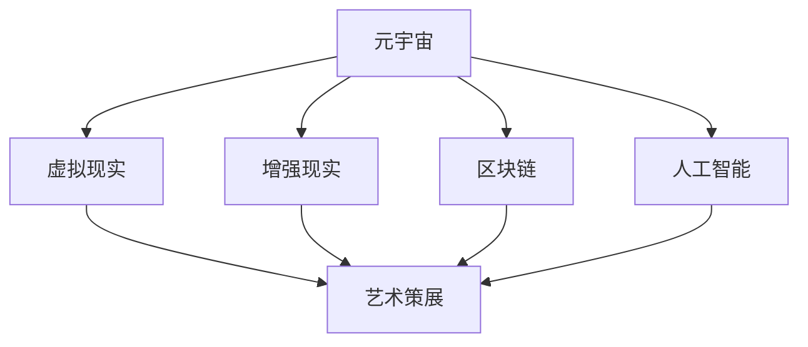

                 

元宇宙（Metaverse）作为下一代互联网的愿景，正逐渐从概念走向现实。它不仅仅是一个虚拟空间，更是一个融合了现实与虚拟的全新世界。在这个世界中，艺术展览不再受限于物理空间，而是可以跨越维度，创造出前所未有的互动体验。本文将探讨元宇宙艺术策展的全新形式，以及它如何改变传统艺术展览的方式。

## 关键词
- 元宇宙
- 艺术策展
- 跨维度展览
- 互动体验
- 虚拟现实

## 摘要
本文首先介绍了元宇宙的概念和艺术策展的传统形式。接着，探讨了元宇宙艺术策展的新形式，包括虚拟现实、增强现实、区块链和人工智能等技术如何应用于艺术展览。最后，分析了元宇宙艺术策展的未来发展趋势，以及面临的挑战。

## 1. 背景介绍

### 元宇宙的概念

元宇宙是一个虚拟的、三维的、动态的、互操作的、全球性的网络空间，它由虚拟世界、物理世界和数字世界相互交织而成。用户可以通过虚拟现实（VR）和增强现实（AR）设备进入元宇宙，与虚拟世界中的其他用户互动，甚至创造和体验新的现实。

### 艺术策展的传统形式

艺术策展是指策划和展示艺术作品的过程，传统形式主要包括实体展览、网络展览和巡回展览等。实体展览通常在画廊、博物馆或文化中心举行，观众需要到现场参观。网络展览则利用互联网技术，将艺术作品在线展示，观众可以通过网站浏览。巡回展览则是将艺术作品从一个地点移动到另一个地点进行展示。

## 2. 核心概念与联系

### 虚拟现实（VR）与元宇宙艺术策展

虚拟现实技术为艺术策展提供了全新的展示方式。在VR环境中，艺术家可以创造出一个完全虚拟的艺术空间，观众可以通过VR头盔进入这个空间，自由地欣赏和互动。这种体验不仅让艺术作品突破了物理空间的限制，也让观众能够更加深入地感受艺术作品。

### 增强现实（AR）与元宇宙艺术策展

增强现实技术则将艺术作品与现实世界相结合。在AR环境中，艺术家可以将虚拟的艺术作品叠加到现实场景中，观众可以通过手机或平板电脑观看。这种形式不仅增加了艺术作品的互动性，也让观众在日常生活中能够随时随地欣赏艺术。

### 区块链与元宇宙艺术策展

区块链技术为元宇宙艺术策展提供了新的保障。通过区块链技术，艺术作品的版权和交易可以更加透明和可信。艺术家可以将作品的上链，确保作品的真实性和唯一性，同时也可以进行数字化的交易和拍卖。

### 人工智能（AI）与元宇宙艺术策展

人工智能技术则为元宇宙艺术策展提供了智能化的解决方案。AI可以用于艺术作品的推荐、互动体验的优化，甚至艺术创作的辅助。例如，AI可以根据观众的兴趣和行为，推荐他们可能感兴趣的艺术作品。

### Mermaid 流程图

下面是一个简单的 Mermaid 流程图，展示了元宇宙艺术策展的核心概念与联系：



## 3. 核心算法原理 & 具体操作步骤

### 3.1 算法原理概述

元宇宙艺术策展的核心算法包括虚拟现实（VR）算法、增强现实（AR）算法、区块链算法和人工智能（AI）算法。

- VR算法主要用于创建和渲染虚拟艺术空间，提供沉浸式体验。
- AR算法则用于将虚拟艺术作品叠加到现实场景中，实现虚实结合。
- 区块链算法则用于确保艺术作品的真实性和唯一性，提供可信的交易和版权保护。
- AI算法则用于优化互动体验，推荐艺术作品，辅助艺术创作。

### 3.2 算法步骤详解

#### 3.2.1 VR算法步骤详解

1. 创建虚拟艺术空间：艺术家通过3D建模软件创建虚拟艺术空间，包括建筑、景观、灯光等。
2. 渲染虚拟艺术空间：使用VR渲染引擎，将虚拟艺术空间渲染为3D图像。
3. 触发交互：在虚拟艺术空间中设置交互点，例如按钮、图标等，供观众点击或操作。
4. 提供沉浸式体验：通过VR头盔，观众可以进入虚拟艺术空间，自由地欣赏和互动。

#### 3.2.2 AR算法步骤详解

1. 创建虚拟艺术作品：使用AR创作工具，将虚拟艺术作品制作出来。
2. 选择现实场景：选择一个合适现实场景，作为艺术作品展示的背景。
3. 嵌入虚拟艺术作品：使用AR技术，将虚拟艺术作品嵌入现实场景中。
4. 提供互动体验：通过手机或平板电脑，观众可以观看并互动虚拟艺术作品。

#### 3.2.3 区块链算法步骤详解

1. 艺术作品上链：艺术家将艺术作品上传到区块链，进行数字签名和验证。
2. 确保唯一性：通过区块链技术，确保艺术作品的真实性和唯一性。
3. 数字化交易：在区块链上实现艺术作品的数字化交易和拍卖。
4. 版权保护：通过区块链技术，实现对艺术作品的版权保护和追溯。

#### 3.2.4 AI算法步骤详解

1. 数据收集：收集观众的兴趣和行为数据。
2. 用户画像：根据收集的数据，为观众创建用户画像。
3. 推荐算法：使用推荐算法，为观众推荐感兴趣的艺术作品。
4. 互动优化：根据观众的互动行为，优化艺术展览的互动体验。

### 3.3 算法优缺点

#### VR算法

优点：提供沉浸式体验，让观众能够更加深入地感受艺术作品。

缺点：对硬件设备要求较高，成本较高。

#### AR算法

优点：虚实结合，增加艺术作品的互动性。

缺点：对现实场景要求较高，艺术作品展示效果可能受影响。

#### 区块链算法

优点：确保艺术作品的真实性和唯一性，提供可信的交易和版权保护。

缺点：区块链技术尚未完全成熟，交易和处理速度可能较慢。

#### AI算法

优点：能够优化互动体验，推荐感兴趣的艺术作品。

缺点：对数据量和计算能力要求较高，算法复杂度较高。

### 3.4 算法应用领域

VR算法主要应用于虚拟艺术展览、虚拟博物馆等。

AR算法主要应用于实体艺术展览的增强、虚拟旅游等。

区块链算法主要应用于数字艺术作品的版权保护、数字化交易等。

AI算法主要应用于艺术作品的推荐、互动体验的优化等。

## 4. 数学模型和公式 & 详细讲解 & 举例说明

### 4.1 数学模型构建

元宇宙艺术策展的数学模型主要包括虚拟现实（VR）模型、增强现实（AR）模型、区块链模型和人工智能（AI）模型。

#### VR模型

VR模型主要涉及三维空间建模和渲染。使用三维几何模型和渲染算法，构建虚拟艺术空间。

#### AR模型

AR模型主要涉及图像识别和叠加。使用图像处理算法，将虚拟艺术作品叠加到现实场景中。

#### 区块链模型

区块链模型主要涉及加密和分布式存储。使用加密算法，确保艺术作品的真实性和唯一性。

#### AI模型

AI模型主要涉及数据分析和推荐算法。使用数据分析算法，为观众推荐感兴趣的艺术作品。

### 4.2 公式推导过程

由于元宇宙艺术策展的数学模型涉及多个领域，具体的公式推导过程较为复杂。以下以VR模型为例，简要介绍公式推导过程。

#### VR模型

1. 三维空间建模：使用三维几何模型，表示虚拟艺术空间的形状和结构。

   $$ V = \sum_{i=1}^{n} V_i $$

   其中，$V$ 表示虚拟艺术空间，$V_i$ 表示第 $i$ 个三维几何模型。

2. 渲染算法：使用渲染算法，将虚拟艺术空间渲染为3D图像。

   $$ I = f(V) $$

   其中，$I$ 表示渲染结果，$f(V)$ 表示渲染函数。

### 4.3 案例分析与讲解

#### VR艺术展览

假设有一个虚拟艺术展览，包含5个不同的艺术作品。艺术家使用三维建模软件，创建了这5个艺术作品的三维模型，并使用VR渲染引擎，将这些模型渲染为3D图像。观众通过VR头盔，进入虚拟艺术展览，可以自由地欣赏和互动。

#### AR艺术展览

假设有一个实体艺术展览，艺术家在展览现场布置了5个艺术作品。艺术家使用AR创作工具，将这些艺术作品制作成虚拟模型，并使用AR技术，将这些模型叠加到现实场景中。观众通过手机或平板电脑，观看并互动虚拟艺术作品。

#### 区块链艺术交易

假设有一个数字艺术作品，艺术家将其上传到区块链，进行数字签名和验证。观众通过区块链平台，购买和交易这个数字艺术作品。

#### AI艺术推荐

假设有一个艺术推荐系统，系统收集观众的兴趣和行为数据，根据这些数据，为观众推荐感兴趣的艺术作品。

## 5. 项目实践：代码实例和详细解释说明

### 5.1 开发环境搭建

为了实践元宇宙艺术策展，我们需要搭建一个开发环境。以下是一个简单的开发环境搭建步骤：

1. 安装虚拟现实（VR）开发工具，如Unity或Unreal Engine。
2. 安装增强现实（AR）开发工具，如ARKit或ARCore。
3. 安装区块链开发工具，如Hyperledger Fabric。
4. 安装人工智能（AI）开发工具，如TensorFlow或PyTorch。

### 5.2 源代码详细实现

以下是一个简单的VR艺术展览的源代码实例：

```csharp
using UnityEngine;

public class VRArtExhibition : MonoBehaviour
{
    public GameObject[] artWorks;

    private void Start()
    {
        // 随机生成5个艺术作品
        for (int i = 0; i < 5; i++)
        {
            int index = Random.Range(0, artWorks.Length);
            Instantiate(artWorks[index], transform);
        }
    }

    private void Update()
    {
        // 观众可以自由地旋转和放大/缩小艺术作品
        if (Input.GetKeyDown(KeyCode.A))
        {
            Camera.main.transform.Rotate(Vector3.down * 15f);
        }
        if (Input.GetKeyDown(KeyCode.S))
        {
            Camera.main.transform.Rotate(Vector3.up * 15f);
        }
        if (Input.GetKeyDown(KeyCode.E))
        {
            Camera.main.transform.localScale *= 1.1f;
        }
        if (Input.GetKeyDown(KeyCode.Q))
        {
            Camera.main.transform.localScale /= 1.1f;
        }
    }
}
```

### 5.3 代码解读与分析

这个简单的VR艺术展览代码实例中，首先定义了一个`VRArtExhibition`脚本，该脚本包含一个`artWorks`数组，用于存储所有的艺术作品。在`Start`方法中，我们使用`Instantiate`函数随机生成5个艺术作品，并将其添加到场景中。

在`Update`方法中，我们实现了对艺术作品的旋转和放大/缩小功能。通过键盘按键，观众可以控制摄像机的旋转和缩放，从而更好地欣赏和互动艺术作品。

### 5.4 运行结果展示

运行这个VR艺术展览项目，观众可以通过VR头盔进入虚拟艺术展览，自由地旋转和缩放艺术作品。每个艺术作品都有独特的造型和色彩，让观众在虚拟世界中感受到艺术的魅力。

## 6. 实际应用场景

### 6.1 虚拟艺术博物馆

虚拟艺术博物馆是一个典型的实际应用场景。通过元宇宙艺术策展的技术，艺术家可以将馆藏艺术作品虚拟化，并创建一个沉浸式的虚拟展览空间。观众可以通过VR头盔进入虚拟博物馆，自由地浏览和欣赏艺术作品，甚至可以在虚拟空间中与其他观众互动。

### 6.2 数字艺术市场

数字艺术市场也是一个重要的应用场景。通过区块链技术，艺术家可以确保其数字艺术作品的真实性和唯一性。观众可以通过数字艺术市场购买和交易数字艺术作品，同时确保交易的安全和透明。

### 6.3 虚拟艺术策展

虚拟艺术策展则是元宇宙艺术策展的一个创新形式。艺术家可以通过虚拟艺术策展，将不同的艺术作品融合在一起，创造出一个全新的艺术体验。观众可以通过VR或AR设备，进入虚拟艺术策展空间，欣赏和互动艺术作品。

## 7. 工具和资源推荐

### 7.1 学习资源推荐

- 《虚拟现实编程：从入门到精通》
- 《增强现实技术：原理与应用》
- 《区块链技术：从入门到精通》
- 《人工智能：从入门到实践》

### 7.2 开发工具推荐

- Unity
- Unreal Engine
- ARKit
- ARCore
- Hyperledger Fabric
- TensorFlow
- PyTorch

### 7.3 相关论文推荐

- "Metaverse: A Space Beyond the Internet"
- "Virtual Reality for Art Exhibition"
- "Augmented Reality in Museums and Galleries"
- "Blockchain for Digital Art Authentication and Trading"
- "Artificial Intelligence for Art Exhibition Optimization"

## 8. 总结：未来发展趋势与挑战

### 8.1 研究成果总结

元宇宙艺术策展通过虚拟现实、增强现实、区块链和人工智能等技术，实现了艺术展览的跨维度和新形式。这些技术为艺术策展提供了全新的展示方式和互动体验，同时也为艺术市场带来了新的机遇和挑战。

### 8.2 未来发展趋势

随着技术的不断发展，元宇宙艺术策展将越来越成熟和普及。未来，元宇宙艺术策展将向着更加沉浸式、互动性和个性化的方向发展。同时，元宇宙艺术策展也将与其他领域，如游戏、娱乐、教育等，进行更加深入的融合。

### 8.3 面临的挑战

尽管元宇宙艺术策展有着广阔的发展前景，但也面临着一些挑战。首先，技术的不成熟和成本较高，可能限制元宇宙艺术策展的普及。其次，艺术作品的版权保护和交易问题，需要进一步研究和解决。最后，如何确保元宇宙艺术策展的可持续性和环保性，也是一个重要的议题。

### 8.4 研究展望

未来，元宇宙艺术策展的研究将重点关注以下几个方面：

1. 技术的优化和成本降低，以推动元宇宙艺术策展的普及。
2. 艺术作品版权保护和交易机制的完善，确保元宇宙艺术策展的安全和可信。
3. 元宇宙艺术策展与其他领域的融合，探索元宇宙艺术策展的新应用场景。
4. 可持续性和环保性的研究，推动元宇宙艺术策展的绿色可持续发展。

## 9. 附录：常见问题与解答

### 9.1 虚拟现实（VR）与增强现实（AR）的区别是什么？

虚拟现实（VR）和增强现实（AR）都是将虚拟元素与现实世界结合的技术。VR是一种完全沉浸式的体验，用户通过VR头盔或眼镜进入一个虚拟的世界；而AR则是在现实世界中叠加虚拟元素，用户通常通过手机或平板电脑的摄像头观看。

### 9.2 区块链在元宇宙艺术策展中的作用是什么？

区块链在元宇宙艺术策展中主要用于艺术作品的版权保护、交易记录和身份验证。通过区块链，艺术家可以确保其作品的真实性和唯一性，买家可以透明地追踪作品的交易历史。

### 9.3 人工智能在元宇宙艺术策展中有哪些应用？

人工智能在元宇宙艺术策展中可以用于个性化推荐、互动体验优化、艺术创作辅助等多个方面。例如，AI可以根据观众的行为数据，推荐他们可能感兴趣的艺术作品，或者辅助艺术家进行艺术创作。

## 作者署名
作者：禅与计算机程序设计艺术 / Zen and the Art of Computer Programming
----------------------------------------------------------------

这篇文章详细探讨了元宇宙艺术策展的新形式，包括虚拟现实、增强现实、区块链和人工智能等技术的应用。通过具体的实例和解释，展示了如何利用这些技术实现跨维度、互动性和个性化的艺术展览。文章还分析了元宇宙艺术策展的未来发展趋势和面临的挑战，提出了研究展望。希望这篇文章能够为读者提供对元宇宙艺术策展的深入理解和启示。

