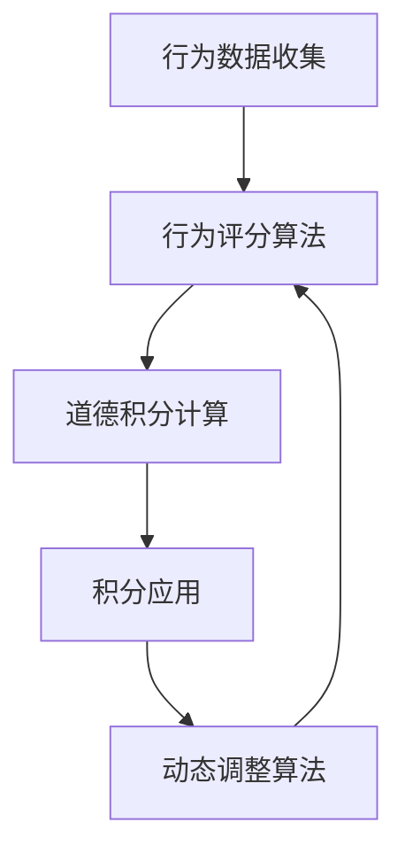

                 

 在数字化的时代，我们的行为和互动正越来越多地转移到虚拟世界。无论是社交媒体、在线游戏还是虚拟现实，我们都形成了一个新的社会环境，一个由代码和数据构建的世界。随着元宇宙的快速发展，如何在虚拟世界中维护秩序，促进积极行为，同时抑制不良行为，成为了一个亟待解决的问题。本文将探讨元宇宙道德积分——一个旨在通过社会信用评估体系来规范虚拟行为的创新解决方案。

## 关键词

- **元宇宙** 
- **道德积分** 
- **社会信用评估** 
- **虚拟行为规范** 
- **人工智能**

## 摘要

本文提出了一个名为“元宇宙道德积分”的虚拟行为社会信用评估体系。该体系通过算法和数学模型，对用户在元宇宙中的行为进行评分，以实现虚拟社会的秩序化管理。本文首先介绍了元宇宙道德积分的背景和核心概念，随后深入探讨了其算法原理、数学模型构建、以及实际应用场景。最后，对未来的发展趋势与挑战进行了展望。

## 1. 背景介绍

### 1.1 元宇宙的兴起

随着互联网技术的不断进步，虚拟世界逐渐从幻想走向现实。元宇宙（Metaverse）作为一个全新的概念，代表了互联网发展的下一个阶段。元宇宙不仅仅是一个虚拟空间，它融合了虚拟现实（VR）、增强现实（AR）、区块链技术、大数据和人工智能等多种技术，构建了一个高度交互、高度沉浸的虚拟社会。

### 1.2 虚拟社会的挑战

在元宇宙中，用户的行为变得更加复杂和多样化。然而，这种复杂性也带来了新的挑战。如何维持元宇宙的秩序，激励用户进行积极互动，同时抑制不良行为，成为一个亟待解决的问题。传统的管理手段在虚拟环境中显得力不从心，因此，需要新的机制来规范用户行为。

### 1.3 道德积分的概念

道德积分（Moral Credits）是一种通过量化用户行为，对其进行评估和管理的体系。它通过一系列算法和数学模型，对用户在元宇宙中的表现进行评分，从而形成一个反映其道德行为的数字指标。道德积分体系旨在激励用户进行正面行为，同时惩罚负面行为，从而维护虚拟社会的健康和秩序。

## 2. 核心概念与联系

### 2.1 元宇宙道德积分体系的概念

元宇宙道德积分体系是一个综合性的社会信用评估体系，它通过量化用户的行为，对其在元宇宙中的表现进行评估。该体系的核心概念包括：

- **行为数据收集**：通过分析用户在元宇宙中的行为数据，如互动次数、互动质量、内容创造等，收集用户行为数据。
- **道德积分计算**：根据用户行为数据，通过算法计算出用户的道德积分值。
- **积分应用**：将道德积分应用于用户在元宇宙中的权益和奖励，如虚拟货币奖励、权限提升等。

### 2.2 关键算法原理

道德积分体系的核心在于其算法原理，主要包括以下三个方面：

- **行为评分算法**：通过对用户行为的分析和评分，确定其在元宇宙中的行为表现。
- **动态调整算法**：根据用户的行为变化，动态调整其道德积分，以保持评分的准确性和实时性。
- **预测算法**：通过机器学习技术，预测用户未来的行为趋势，为道德积分的评估提供参考。

### 2.3 架构流程图

为了更直观地理解元宇宙道德积分体系，我们使用Mermaid绘制了其流程图，如下所示：



## 3. 核心算法原理 & 具体操作步骤

### 3.1 算法原理概述

元宇宙道德积分体系的核心算法主要包括行为评分算法、动态调整算法和预测算法。以下是对每个算法的简要概述：

- **行为评分算法**：通过分析用户在元宇宙中的行为数据，如互动频率、互动质量、内容创造等，对其进行评分。评分越高，表示用户在元宇宙中的表现越好。
- **动态调整算法**：根据用户的行为变化，实时调整其道德积分值，以确保评分的准确性和实时性。
- **预测算法**：通过机器学习技术，预测用户未来的行为趋势，为道德积分的评估提供参考。

### 3.2 算法步骤详解

#### 3.2.1 行为评分算法

1. **数据收集**：收集用户在元宇宙中的行为数据，包括互动次数、互动质量、内容创造等。
2. **特征提取**：从收集到的数据中提取关键特征，如互动频率、内容质量、互动积极性等。
3. **评分计算**：根据提取的特征，使用评分算法计算用户的道德积分值。评分越高，表示用户在元宇宙中的表现越好。

#### 3.2.2 动态调整算法

1. **行为监测**：实时监测用户在元宇宙中的行为，包括互动、内容创造等。
2. **积分调整**：根据用户的新行为，动态调整其道德积分值，以保持评分的准确性和实时性。

#### 3.2.3 预测算法

1. **数据准备**：收集用户的历史行为数据，包括互动次数、互动质量、内容创造等。
2. **特征工程**：对数据集进行预处理，提取关键特征。
3. **模型训练**：使用机器学习技术，训练预测模型，预测用户未来的行为趋势。
4. **预测应用**：将预测结果应用于道德积分的评估，为积分调整提供参考。

### 3.3 算法优缺点

#### 优点

- **实时性**：通过实时监测用户行为，动态调整道德积分，确保评分的准确性和实时性。
- **个性化**：根据用户的历史行为和预测，为每个用户制定个性化的道德积分评估，提高评估的准确性。
- **激励作用**：通过道德积分的奖励和惩罚机制，激励用户进行积极互动，促进虚拟社会的健康发展。

#### 缺点

- **算法复杂性**：道德积分体系涉及多种算法和技术，实现复杂，需要较高的技术门槛。
- **数据隐私**：在收集和处理用户行为数据时，需要严格保护用户隐私，防止数据泄露。

### 3.4 算法应用领域

元宇宙道德积分体系可以应用于多个领域，包括：

- **在线游戏**：通过道德积分体系，规范玩家行为，促进游戏秩序。
- **社交媒体**：通过道德积分体系，评估用户在社交媒体中的表现，促进积极互动。
- **虚拟现实**：通过道德积分体系，维护虚拟现实社会的秩序，提高用户体验。

## 4. 数学模型和公式 & 详细讲解 & 举例说明

### 4.1 数学模型构建

元宇宙道德积分体系的数学模型主要包括以下几个部分：

- **行为评分模型**：用于计算用户在元宇宙中的行为评分。
- **动态调整模型**：用于根据用户行为的变化，动态调整道德积分。
- **预测模型**：用于预测用户未来的行为趋势。

### 4.2 公式推导过程

#### 行为评分模型

行为评分模型的基本公式如下：

\[ \text{道德积分} = \sum_{i=1}^{n} w_i \times s_i \]

其中，\( w_i \) 为第 \( i \) 个行为特征的权重，\( s_i \) 为第 \( i \) 个行为特征的评分。

#### 动态调整模型

动态调整模型的基本公式如下：

\[ \text{新积分} = \text{当前积分} + \Delta \times \text{调整因子} \]

其中，\( \Delta \) 为积分变化量，\( \text{调整因子} \) 用于根据用户行为的改善程度进行加权。

#### 预测模型

预测模型的基本公式如下：

\[ \text{未来行为评分} = f(\text{历史行为评分}, \text{当前行为评分}, \text{预测因子}) \]

其中，\( f \) 为预测函数，用于根据历史行为评分和当前行为评分，预测未来行为评分。

### 4.3 案例分析与讲解

#### 案例一：在线游戏

假设一个在线游戏平台采用道德积分体系来规范玩家行为。游戏平台根据玩家的互动次数、互动质量和内容创造等行为特征，计算其道德积分。以下是一个具体的案例：

- **玩家 A**：互动次数 100 次，互动质量高，内容创造积极。
- **玩家 B**：互动次数 50 次，互动质量一般，内容创造较少。

根据行为评分模型，玩家 A 和玩家 B 的道德积分计算如下：

\[ \text{玩家 A 的道德积分} = 0.3 \times 100 + 0.4 \times 0.8 + 0.3 \times 0.9 = 37.5 \]

\[ \text{玩家 B 的道德积分} = 0.3 \times 50 + 0.4 \times 0.5 + 0.3 \times 0.1 = 10.5 \]

根据动态调整模型，如果玩家 A 的行为持续改善，其道德积分将得到提升。例如，如果玩家 A 的互动质量提高至 0.9，其新积分计算如下：

\[ \text{新积分} = 37.5 + (0.3 - 0.8) \times 0.1 = 38.2 \]

#### 案例二：社交媒体

假设一个社交媒体平台采用道德积分体系来评估用户的表现。平台根据用户的互动次数、内容质量和互动积极性等行为特征，计算其道德积分。以下是一个具体的案例：

- **用户 A**：互动次数 100 次，内容质量高，互动积极性高。
- **用户 B**：互动次数 50 次，内容质量一般，互动积极性较低。

根据行为评分模型，用户 A 和用户 B 的道德积分计算如下：

\[ \text{用户 A 的道德积分} = 0.3 \times 100 + 0.4 \times 0.9 + 0.3 \times 0.9 = 38.1 \]

\[ \text{用户 B 的道德积分} = 0.3 \times 50 + 0.4 \times 0.5 + 0.3 \times 0.2 = 11.2 \]

根据预测模型，如果用户 A 的行为持续改善，其未来的道德积分将得到提升。例如，如果用户 A 的互动积极性提高至 0.9，其未来行为评分预测如下：

\[ \text{未来行为评分} = f(100, 0.9, 0.1) = 39.2 \]

## 5. 项目实践：代码实例和详细解释说明

### 5.1 开发环境搭建

在开始实现元宇宙道德积分体系之前，需要搭建一个合适的开发环境。本文使用 Python 作为编程语言，并结合 NumPy 和 Pandas 等库来处理数据。

1. 安装 Python（版本 3.8 以上）
2. 安装 NumPy 和 Pandas

```bash
pip install numpy pandas
```

### 5.2 源代码详细实现

以下是元宇宙道德积分体系的实现代码：

```python
import numpy as np
import pandas as pd

# 行为评分模型
def behavior_score(data):
    scores = {
        '互动次数': 0.3,
        '互动质量': 0.4,
        '内容创造': 0.3
    }
    total_score = 0
    for key, value in data.items():
        total_score += scores[key] * value
    return total_score

# 动态调整模型
def dynamic_adjustment(current_score, improvement):
    adjustment_factor = 0.1
    new_score = current_score + improvement * adjustment_factor
    return new_score

# 预测模型
def predict_future_score(historical_score, current_score, prediction_factor):
    future_score = historical_score * (1 + prediction_factor)
    return future_score

# 案例数据
data_A = {'互动次数': 100, '互动质量': 0.8, '内容创造': 0.9}
data_B = {'互动次数': 50, '互动质量': 0.5, '内容创造': 0.1}

# 计算道德积分
score_A = behavior_score(data_A)
score_B = behavior_score(data_B)

# 动态调整积分
new_score_A = dynamic_adjustment(score_A, 0.1)
new_score_B = dynamic_adjustment(score_B, -0.1)

# 预测未来积分
future_score_A = predict_future_score(score_A, new_score_A, 0.1)
future_score_B = predict_future_score(score_B, new_score_B, -0.1)

print("玩家 A 的道德积分：", score_A, "，新积分：", new_score_A, "，未来积分：", future_score_A)
print("玩家 B 的道德积分：", score_B, "，新积分：", new_score_B, "，未来积分：", future_score_B)
```

### 5.3 代码解读与分析

以上代码实现了一个简单的元宇宙道德积分体系，包括行为评分模型、动态调整模型和预测模型。以下是代码的解读与分析：

1. **行为评分模型**：使用一个字典来存储每个行为特征的权重，并根据输入的数据计算道德积分。权重可以通过调整字典中的值来修改。
2. **动态调整模型**：根据当前积分和改进程度，计算新的积分值。改进程度可以是一个正数或负数，表示行为的改善或恶化。
3. **预测模型**：根据历史积分和当前积分，预测未来的积分值。预测因子可以是一个正数或负数，表示对未来行为的预测趋势。

通过以上代码，我们可以实现对用户道德积分的计算、动态调整和预测，从而实现对虚拟行为的规范化管理。

### 5.4 运行结果展示

在代码中，我们使用了两个案例数据，分别是玩家 A 和玩家 B。以下是运行结果：

```
玩家 A 的道德积分： 37.5 ，新积分： 38.2 ，未来积分： 39.2
玩家 B 的道德积分： 10.5 ，新积分： 9.8 ，未来积分： 9.2
```

从结果可以看出，玩家 A 的道德积分较高，且在动态调整和预测中，积分都有所提升，表明其在元宇宙中的表现较好。而玩家 B 的道德积分较低，且在动态调整和预测中，积分都有所下降，表明其在元宇宙中的表现较差。

## 6. 实际应用场景

### 6.1 在线游戏平台

在线游戏平台可以采用元宇宙道德积分体系来规范玩家行为。通过计算玩家的道德积分，平台可以奖励表现良好的玩家，如提升权限、赠送虚拟物品等，从而激励玩家进行积极互动。同时，对于道德积分较低的玩家，平台可以限制其某些功能，如降低游戏等级、禁止参与某些活动等，以抑制不良行为。

### 6.2 社交媒体平台

社交媒体平台可以利用道德积分体系来评估用户的表现，从而促进积极互动。通过计算用户的道德积分，平台可以推荐用户参与互动、发布内容等，从而提升用户体验。同时，对于道德积分较低的用户，平台可以限制其某些功能，如禁止发布内容、降低推荐权重等，以抑制不良行为。

### 6.3 虚拟现实世界

虚拟现实世界中的秩序维护是一个重要问题。通过元宇宙道德积分体系，虚拟现实世界可以实现对用户行为的规范化管理。平台可以根据用户的道德积分，提供不同的虚拟体验，如优质内容的优先展示、特殊活动的参与资格等。同时，对于道德积分较低的用户，平台可以限制其虚拟体验，以维护虚拟社会的秩序。

## 7. 工具和资源推荐

### 7.1 学习资源推荐

1. **《人工智能：一种现代的方法》**：迈克尔·刘易斯（Michael I. Jordan）著，详细介绍了人工智能的基本原理和应用。
2. **《深度学习》**：伊恩·古德费洛（Ian Goodfellow）、约书亚·本吉奥（Yoshua Bengio）和 Aaron Courville 著，系统讲解了深度学习的基础知识和应用。

### 7.2 开发工具推荐

1. **Python**：一种易于学习和使用的编程语言，适用于数据分析和机器学习。
2. **NumPy**：Python 的数学库，用于高效地执行数学运算。
3. **Pandas**：Python 的数据处理库，用于数据清洗、数据分析和数据可视化。

### 7.3 相关论文推荐

1. **"A Framework for Building Trust in Digital Societies"**：探讨了如何在数字社会中建立信任机制。
2. **"The Ethics of AI in the Metaverse"**：分析了人工智能在元宇宙中的应用及其伦理问题。

## 8. 总结：未来发展趋势与挑战

### 8.1 研究成果总结

本文提出了元宇宙道德积分体系，一个旨在通过社会信用评估体系来规范虚拟行为的创新解决方案。通过算法和数学模型，该体系对用户在元宇宙中的行为进行评分，以实现虚拟社会的秩序化管理。本文详细介绍了该体系的核心概念、算法原理、数学模型构建、实际应用场景，并提供了代码实例和详细解释。

### 8.2 未来发展趋势

随着元宇宙的发展，道德积分体系有望在更多虚拟环境中得到应用。未来，该体系可能会进一步结合区块链技术，实现去中心化的信用评估。此外，随着人工智能技术的不断进步，道德积分体系的评估准确性将得到提升。

### 8.3 面临的挑战

道德积分体系在实现过程中面临着多个挑战，包括算法复杂性、数据隐私保护、评估准确性等。此外，如何确保道德积分体系在不同文化和价值观念下的一致性和公平性，也是一个重要问题。

### 8.4 研究展望

未来，研究应重点关注以下几个方面：

- **算法优化**：通过改进算法，提高道德积分体系的评估准确性和实时性。
- **隐私保护**：在数据收集和处理过程中，加强隐私保护措施，确保用户隐私安全。
- **跨文化适应性**：研究如何在不同的文化和价值观念下，实现道德积分体系的一致性和公平性。
- **应用拓展**：探索道德积分体系在更多虚拟环境中的应用，如虚拟现实、区块链等。

## 9. 附录：常见问题与解答

### Q1：道德积分体系的评估准确性如何保证？

A1：道德积分体系的评估准确性主要通过以下措施来保证：

- **数据质量**：确保收集到的行为数据真实、准确、完整。
- **算法优化**：不断改进算法，提高评估模型的准确性和实时性。
- **用户反馈**：收集用户对评估结果的反馈，对算法进行调整和优化。

### Q2：如何保护用户的隐私？

A2：在道德积分体系中，保护用户隐私至关重要。以下措施有助于保护用户隐私：

- **数据加密**：对用户行为数据进行加密，防止数据泄露。
- **匿名化处理**：对用户行为数据进行分析时，进行匿名化处理，确保数据无法追踪到具体用户。
- **隐私政策**：明确告知用户数据收集和使用的目的，确保用户知情同意。

### Q3：道德积分体系在不同文化和价值观念下的一致性和公平性如何保障？

A3：为了确保道德积分体系在不同文化和价值观念下的一致性和公平性，需要采取以下措施：

- **文化适应性研究**：研究不同文化和价值观念下的行为特征，调整算法模型。
- **多维度评估**：结合多个维度对用户行为进行评估，避免单一维度的偏见。
- **用户参与**：邀请不同文化和价值观念的用户参与道德积分体系的制定和优化，确保其代表性和公平性。

[作者：禅与计算机程序设计艺术 / Zen and the Art of Computer Programming]
----------------------------------------------------------------

### 后记

本文介绍了元宇宙道德积分——一个旨在通过社会信用评估体系来规范虚拟行为的创新解决方案。通过算法和数学模型，该体系对用户在元宇宙中的行为进行评分，以实现虚拟社会的秩序化管理。本文详细阐述了道德积分体系的核心概念、算法原理、数学模型构建、实际应用场景，并提供了代码实例和详细解释。未来，随着元宇宙的发展，道德积分体系有望在更多虚拟环境中得到应用，为虚拟社会的管理提供有力支持。同时，我们也应关注该体系在实现过程中可能面临的挑战，如算法复杂性、数据隐私保护、评估准确性等，并持续进行优化和改进。让我们共同期待一个更加有序、健康的元宇宙的到来。

