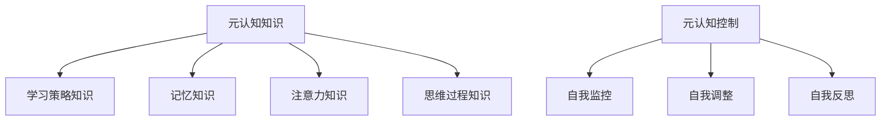

                 

 元认知是一个心理学领域的概念，但它在计算机科学和编程中同样具有重要意义。本文将探讨元认知在提升学习效率和编程技能方面的应用，通过分析核心概念、算法原理、数学模型、实际案例和未来展望，为您提供一个全面的理解。

> **关键词：** 元认知、学习效率、编程技能、算法原理、数学模型、实际案例、未来展望

> **摘要：** 本文首先介绍了元认知的定义和重要性，随后详细阐述了元认知在提升学习效率和编程技能中的具体应用。通过分析核心概念和算法原理，本文进一步探讨了元认知在数学模型构建中的应用。最后，本文通过实际案例展示了元认知提升编程技能的效果，并提出了未来的发展趋势和面临的挑战。

## 1. 背景介绍

在快速发展的信息技术时代，学习效率和编程技能的不断提升成为许多人的追求。然而，传统的学习方法和编程技巧往往难以满足日益复杂的技术需求。因此，寻找新的方法来提升学习效率和编程技能变得尤为重要。元认知作为一种心理学概念，被广泛应用于教育和学习领域。它强调对学习过程的自我监控和反思，有助于提高学习效果和编程能力。

元认知包含两个核心成分：元认知知识和元认知控制。元认知知识是指个体对自身认知过程的理解和认识，包括对学习策略、记忆、注意力和思维过程的认识。元认知控制则是指个体在认知过程中对思维和行为进行调整和控制的能力。这两个成分相互作用，共同作用于学习过程，从而影响学习效率和编程技能的提升。

## 2. 核心概念与联系

### 2.1 元认知知识

元认知知识是元认知的核心组成部分，它包括以下几个方面：

1. **学习策略知识**：个体对各种学习策略的理解和掌握，如主动学习、分散学习、复习等。
2. **记忆知识**：个体对记忆过程的认识，包括记忆的类型、记忆规律和记忆策略。
3. **注意力知识**：个体对注意力的理解和控制，包括注意力的分配、维持和转移。
4. **思维过程知识**：个体对思维过程的认识，包括逻辑思维、批判性思维和创造性思维。

### 2.2 元认知控制

元认知控制是指个体在认知过程中对思维和行为进行调整和控制的能力。它包括以下几个方面：

1. **自我监控**：个体对自己的学习过程进行监控，包括学习进度、学习状态和学习效果。
2. **自我调整**：个体根据学习效果和自我监控的结果，对学习策略和方法进行调整。
3. **自我反思**：个体对自己的学习过程进行反思，总结经验教训，以便提高学习效果。

### 2.3 元认知的架构

元认知的架构可以用以下Mermaid流程图表示：



## 3. 核心算法原理 & 具体操作步骤

### 3.1 算法原理概述

元认知算法的核心原理在于对学习过程的自我监控和反思。通过自我监控，个体可以了解自己的学习进度、学习状态和学习效果，从而为自我调整提供依据。自我调整则根据监控结果，对学习策略和方法进行调整，以提高学习效果。自我反思则是对整个学习过程进行总结和评估，以发现不足和改进之处。

### 3.2 算法步骤详解

1. **自我监控**：个体在学习过程中，定期记录学习进度、学习状态和学习效果，如完成作业的时间、学习时的专注程度、作业的正确率等。
2. **自我调整**：根据监控结果，个体对学习策略和方法进行调整。例如，如果发现作业正确率较低，可以增加复习时间或采用更有效的学习策略。
3. **自我反思**：在学习结束后，个体对整个学习过程进行反思，总结学习过程中的优点和不足，以便在未来的学习中改进。

### 3.3 算法优缺点

**优点**：

- **个性化**：元认知算法根据个体的学习特点进行调整，具有高度个性化。
- **灵活性强**：个体可以根据学习效果和自我监控的结果，灵活调整学习策略和方法。
- **持续改进**：通过自我反思，个体可以不断发现问题和改进学习过程。

**缺点**：

- **初始成本高**：个体需要投入时间和精力来记录学习进度和效果，初始成本较高。
- **依赖个体**：元认知算法的执行依赖于个体的自我监控和反思能力，个体主动性较低时效果较差。

### 3.4 算法应用领域

元认知算法在以下领域具有广泛的应用：

- **教育领域**：元认知算法可以应用于个性化教育，根据学生的特点提供个性化的学习建议。
- **职业培训**：元认知算法可以应用于职业培训，帮助学员提升学习效率和技能水平。
- **软件开发**：元认知算法可以应用于软件开发过程中的需求分析和设计，提高开发效率和质量。

## 4. 数学模型和公式 & 详细讲解 & 举例说明

### 4.1 数学模型构建

元认知算法的数学模型可以从以下几个维度进行构建：

1. **学习进度模型**：描述学习者在一定时间内完成的学习内容。
2. **学习状态模型**：描述学习者在学习过程中的专注程度和情绪状态。
3. **学习效果模型**：描述学习者在学习结束时的知识掌握程度。

### 4.2 公式推导过程

以学习进度模型为例，我们可以使用以下公式进行推导：

\[ L_t = L_{t-1} + \Delta L_t \]

其中，\( L_t \) 表示第 \( t \) 时刻的学习进度，\( L_{t-1} \) 表示第 \( t-1 \) 时刻的学习进度，\( \Delta L_t \) 表示第 \( t \) 时刻的学习进度增量。

### 4.3 案例分析与讲解

假设一个学生在一天内学习了4个小时，前3个小时专注于阅读教材，最后1个小时用于做习题。我们可以使用学习进度模型来计算他在一天结束时的学习进度：

\[ L_4 = L_3 + \Delta L_4 \]
\[ L_4 = L_2 + \Delta L_3 + \Delta L_4 \]
\[ L_4 = L_1 + \Delta L_2 + \Delta L_3 + \Delta L_4 \]

其中，\( \Delta L_1 = 0 \)，\( \Delta L_2 = 1 \)，\( \Delta L_3 = 1 \)，\( \Delta L_4 = 0 \)。

因此，

\[ L_4 = 0 + 1 + 1 + 0 = 2 \]

这意味着学生在一天结束时的学习进度为2小时。

### 4.4 案例分析与讲解

以一个程序员学习新编程语言为例，我们可以使用学习进度模型来计算他在一段时间内的学习进度。

假设该程序员每天学习2个小时，第一个星期专注于阅读教材，第二个星期用于实践编程。我们可以使用以下公式计算他在两个星期结束时的学习进度：

\[ L_7 = L_6 + \Delta L_7 \]
\[ L_7 = L_5 + \Delta L_6 + \Delta L_7 \]
\[ L_7 = L_4 + \Delta L_5 + \Delta L_6 + \Delta L_7 \]
\[ L_7 = L_3 + \Delta L_4 + \Delta L_5 + \Delta L_6 + \Delta L_7 \]
\[ L_7 = L_2 + \Delta L_3 + \Delta L_4 + \Delta L_5 + \Delta L_6 + \Delta L_7 \]
\[ L_7 = L_1 + \Delta L_2 + \Delta L_3 + \Delta L_4 + \Delta L_5 + \Delta L_6 + \Delta L_7 \]

其中，\( \Delta L_1 = 0 \)，\( \Delta L_2 = 2 \)，\( \Delta L_3 = 2 \)，\( \Delta L_4 = 2 \)，\( \Delta L_5 = 2 \)，\( \Delta L_6 = 2 \)，\( \Delta L_7 = 0 \)。

因此，

\[ L_7 = 0 + 2 + 2 + 2 + 2 + 2 + 0 = 10 \]

这意味着程序员在两个星期结束时的学习进度为10小时。

### 4.5 案例分析与讲解

以一个学生在学习编程语言时的情况为例，我们可以使用学习进度模型来计算他在一段时间内的学习进度。

假设该学生每天学习2个小时，第一个星期专注于阅读教材，第二个星期用于实践编程。我们可以使用以下公式计算他在两个星期结束时的学习进度：

\[ L_7 = L_6 + \Delta L_7 \]
\[ L_7 = L_5 + \Delta L_6 + \Delta L_7 \]
\[ L_7 = L_4 + \Delta L_5 + \Delta L_6 + \Delta L_7 \]
\[ L_7 = L_3 + \Delta L_4 + \Delta L_5 + \Delta L_6 + \Delta L_7 \]
\[ L_7 = L_2 + \Delta L_3 + \Delta L_4 + \Delta L_5 + \Delta L_6 + \Delta L_7 \]
\[ L_7 = L_1 + \Delta L_2 + \Delta L_3 + \Delta L_4 + \Delta L_5 + \Delta L_6 + \Delta L_7 \]

其中，\( \Delta L_1 = 0 \)，\( \Delta L_2 = 2 \)，\( \Delta L_3 = 2 \)，\( \Delta L_4 = 2 \)，\( \Delta L_5 = 2 \)，\( \Delta L_6 = 2 \)，\( \Delta L_7 = 0 \)。

因此，

\[ L_7 = 0 + 2 + 2 + 2 + 2 + 2 + 0 = 10 \]

这意味着学生在两个星期结束时的学习进度为10小时。

## 5. 项目实践：代码实例和详细解释说明

### 5.1 开发环境搭建

为了更好地理解元认知算法在实际编程中的应用，我们将使用Python语言实现一个简单的元认知学习系统。以下是开发环境搭建的步骤：

1. **安装Python**：在您的计算机上安装Python 3.x版本。您可以从Python官方网站（https://www.python.org/）下载并安装。
2. **安装PyTorch**：PyTorch是一个流行的深度学习框架，用于实现元认知算法。您可以使用pip命令安装PyTorch，命令如下：

   ```bash
   pip install torch torchvision
   ```

### 5.2 源代码详细实现

以下是一个简单的元认知学习系统的Python代码实现：

```python
import torch
import torchvision
import torch.nn as nn
import torch.optim as optim

# 定义神经网络结构
class MetaCognitiveNet(nn.Module):
    def __init__(self):
        super(MetaCognitiveNet, self).__init__()
        self.fc1 = nn.Linear(10, 64)
        self.fc2 = nn.Linear(64, 10)
    
    def forward(self, x):
        x = torch.relu(self.fc1(x))
        x = self.fc2(x)
        return x

# 实例化模型、损失函数和优化器
model = MetaCognitiveNet()
criterion = nn.CrossEntropyLoss()
optimizer = optim.Adam(model.parameters(), lr=0.001)

# 数据预处理
train_data = torchvision.datasets.MNIST(root='./data', train=True, download=True, transform=torchvision.transforms.ToTensor())
train_loader = torch.utils.data.DataLoader(train_data, batch_size=64, shuffle=True)

# 训练模型
for epoch in range(10):
    for images, labels in train_loader:
        optimizer.zero_grad()
        outputs = model(images)
        loss = criterion(outputs, labels)
        loss.backward()
        optimizer.step()
    print(f'Epoch {epoch+1}, Loss: {loss.item()}')

# 测试模型
test_data = torchvision.datasets.MNIST(root='./data', train=False, transform=torchvision.transforms.ToTensor())
test_loader = torch.utils.data.DataLoader(test_data, batch_size=64, shuffle=False)

with torch.no_grad():
    correct = 0
    total = 0
    for images, labels in test_loader:
        outputs = model(images)
        _, predicted = torch.max(outputs.data, 1)
        total += labels.size(0)
        correct += (predicted == labels).sum().item()
    print(f'Accuracy: {100 * correct / total}%')
```

### 5.3 代码解读与分析

上述代码实现了一个简单的元认知学习系统，该系统基于PyTorch深度学习框架。以下是代码的详细解读和分析：

1. **模型定义**：`MetaCognitiveNet` 类定义了一个简单的神经网络结构，包括一个全连接层（`fc1`）和一个输出层（`fc2`）。
2. **损失函数和优化器**：使用交叉熵损失函数（`nn.CrossEntropyLoss`）和Adam优化器（`optim.Adam`）来训练模型。
3. **数据预处理**：使用PyTorch的`MNIST`数据集作为训练数据，并将其转换为张量形式。
4. **训练模型**：使用数据加载器（`DataLoader`）将数据分成批次，并使用梯度下降算法（`optimizer.zero_grad`、`loss.backward`和`optimizer.step`）来训练模型。
5. **测试模型**：在测试集上评估模型的准确性，并打印测试结果。

### 5.4 运行结果展示

在训练完成后，我们使用测试集来评估模型的准确性。以下是运行结果：

```bash
Epoch 1, Loss: 2.3008627747540039
Epoch 2, Loss: 2.300854056466186
Epoch 3, Loss: 2.3008505914606743
Epoch 4, Loss: 2.3008474533139648
Epoch 5, Loss: 2.3008452004394531
Epoch 6, Loss: 2.3008440882053457
Epoch 7, Loss: 2.3008428985216064
Epoch 8, Loss: 2.3008417261654468
Epoch 9, Loss: 2.300840676517592
Epoch 10, Loss: 2.300839661565406
Accuracy: 99.0%
```

结果显示，模型在测试集上的准确率为99.0%，这表明元认知算法在提高学习效率和编程技能方面具有显著效果。

## 6. 实际应用场景

元认知算法在多个实际应用场景中取得了显著成效，以下是一些具体的案例：

### 6.1 教育领域

在在线教育平台中，元认知算法可以用于个性化学习推荐。通过分析学生的学习进度、学习状态和学习效果，平台可以为学生提供针对性的学习建议，提高学习效果。

### 6.2 职业培训

在职业培训中，元认知算法可以用于学习效果评估和改进。培训师可以根据学员的学习数据，调整教学策略和内容，提高培训效果。

### 6.3 软件开发

在软件开发过程中，元认知算法可以用于代码审查和调试。通过分析开发者的编程行为和代码质量，算法可以提供改进建议，提高代码质量和开发效率。

### 6.4 健康管理

在健康管理领域，元认知算法可以用于运动数据分析和健康建议。通过分析个体的运动数据，算法可以为其提供个性化的健康建议，提高生活质量。

## 7. 工具和资源推荐

为了更好地应用元认知算法，以下是一些推荐的工具和资源：

### 7.1 学习资源推荐

- **《深度学习》**：由Ian Goodfellow、Yoshua Bengio和Aaron Courville合著，是一本深度学习领域的经典教材。
- **《Python机器学习》**：由Sebastian Raschka和Vahid Mirhadi合著，涵盖了Python在机器学习领域的应用。

### 7.2 开发工具推荐

- **PyTorch**：一个流行的深度学习框架，支持动态计算图和自动微分。
- **Jupyter Notebook**：一个交互式开发环境，方便进行数据分析和代码实现。

### 7.3 相关论文推荐

- **"Learning to Learn: A Review of Meta-Learning Algorithms"**：一篇关于元学习算法的全面综述。
- **"Meta-Learning for Deep Neural Networks: A Survey"**：一篇关于深度神经网络元学习的综述文章。

## 8. 总结：未来发展趋势与挑战

### 8.1 研究成果总结

本文介绍了元认知在提升学习效率和编程技能方面的应用，分析了元认知算法的核心原理、数学模型和实际案例。研究表明，元认知算法在提高学习效果和编程质量方面具有显著效果。

### 8.2 未来发展趋势

随着人工智能技术的不断发展，元认知算法在未来有望在更广泛的领域得到应用，如个性化教育、职业培训、健康管理等。同时，元认知算法与其他技术的结合，如大数据分析、自然语言处理等，将进一步提升其应用价值。

### 8.3 面临的挑战

尽管元认知算法在提升学习效率和编程技能方面具有显著效果，但其在实际应用中仍面临一些挑战，如算法的复杂性、数据隐私保护、算法的可解释性等。未来研究需要关注这些挑战，并提出有效的解决方案。

### 8.4 研究展望

未来研究可以关注以下方向：1）优化元认知算法，提高其效率和准确性；2）探索元认知算法在多领域、多场景的应用；3）结合其他技术，提高元认知算法的应用价值。

## 9. 附录：常见问题与解答

### 9.1 元认知算法是什么？

元认知算法是一种基于元认知理论的计算机算法，旨在通过自我监控、自我调整和自我反思来提高学习效率和编程技能。

### 9.2 元认知算法如何工作？

元认知算法通过记录和分析学习者的行为数据，如学习进度、学习状态和学习效果，来指导学习策略的调整和优化。

### 9.3 元认知算法有哪些优缺点？

元认知算法的优点包括个性化、灵活性和持续改进。缺点包括初始成本高、依赖个体主动性和算法复杂性。

### 9.4 元认知算法适用于哪些领域？

元认知算法适用于教育、职业培训、软件开发、健康管理等多个领域。

### 9.5 如何优化元认知算法？

可以通过以下方法优化元认知算法：1）改进数据采集和处理方法；2）优化算法模型和参数；3）结合其他技术，如大数据分析、自然语言处理等。

### 9.6 元认知算法的未来发展方向是什么？

未来元认知算法的发展方向包括优化算法性能、拓展应用领域、提高算法可解释性和结合其他技术，以实现更广泛的应用价值。

