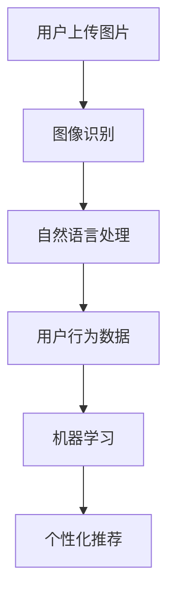

                 

关键词：AI技术，电商搜索导购，技术瓶颈，解决方案，机器学习，推荐系统，图像识别，自然语言处理，用户体验

> 摘要：本文深入探讨了人工智能技术在实际电商搜索导购场景中的应用挑战，包括技术瓶颈和相应的解决方案。通过分析现有技术手段，提出了优化策略，旨在提升电商搜索导购的用户体验和效率。

## 1. 背景介绍

随着电子商务的快速发展，用户对在线购物的需求日益多样化，个性化推荐成为电商行业的重要竞争手段。人工智能（AI）技术在电商搜索导购中的应用，旨在通过智能推荐系统提高用户的购物体验和购物满意度。然而，AI技术在实现个性化推荐的过程中面临着诸多技术挑战，这些挑战不仅影响了推荐系统的性能，也限制了其在电商搜索导购中的广泛应用。

### 1.1 电商搜索导购的现状

电商搜索导购是电子商务平台的重要组成部分，它通过搜索和推荐机制帮助用户快速找到所需商品。传统的电商搜索主要依赖关键词匹配和分类导航，而现代电商搜索导购则更加强调个性化推荐。个性化推荐系统能够根据用户的历史行为、兴趣偏好和购物习惯，为用户推荐可能感兴趣的商品，从而提高用户购物的效率和满意度。

### 1.2 AI 技术在电商搜索导购中的应用

AI 技术在电商搜索导购中的应用主要包括图像识别、自然语言处理和机器学习等。图像识别技术可以用于商品识别和图像搜索，帮助用户通过上传图片查找相似商品。自然语言处理技术则能够处理用户输入的查询，理解用户的意图，并提供更精确的搜索结果。机器学习技术则是构建推荐系统的核心，通过分析用户数据，不断优化推荐算法，提高推荐的相关性和准确性。

## 2. 核心概念与联系

### 2.1 AI 技术在电商搜索导购中的核心概念

- **图像识别**：通过对商品图片的分析，识别出商品的特征，实现商品的快速查找和推荐。
- **自然语言处理**：通过对用户查询的理解，提取关键信息，实现智能问答和搜索结果排序。
- **机器学习**：通过分析用户行为数据，训练推荐模型，实现个性化商品推荐。

### 2.2 AI 技术在电商搜索导购中的联系

AI 技术在电商搜索导购中的各个核心概念之间存在着紧密的联系。图像识别和自然语言处理技术为机器学习推荐系统提供了数据输入，而机器学习推荐系统则通过不断学习和优化，提高推荐的质量和用户体验。

### 2.3 Mermaid 流程图



## 3. 核心算法原理 & 具体操作步骤

### 3.1 算法原理概述

AI 技术在电商搜索导购中的应用，核心在于构建一个高效的推荐系统。推荐系统的基本原理是通过分析用户的历史行为和兴趣偏好，预测用户可能感兴趣的商品，并提供个性化推荐。

### 3.2 算法步骤详解

1. **用户行为数据收集**：收集用户在电商平台上的浏览、搜索、购买等行为数据。
2. **数据预处理**：对收集到的数据进行清洗、去重和格式转换，以便于后续的分析和处理。
3. **特征提取**：从用户行为数据中提取特征，如浏览时长、搜索关键词、购买频率等。
4. **模型训练**：使用机器学习算法，如协同过滤、基于内容的推荐、深度学习等，训练推荐模型。
5. **模型评估**：通过交叉验证和在线评估，评估推荐模型的性能和准确性。
6. **个性化推荐**：根据用户特征和模型预测，为用户推荐可能感兴趣的商品。

### 3.3 算法优缺点

- **优点**：
  - 提高用户购物效率和满意度。
  - 提升电商平台的销售额和用户粘性。
- **缺点**：
  - 数据隐私和安全问题。
  - 模型复杂度高，训练成本大。
  - 推荐效果易受数据质量和算法模型影响。

### 3.4 算法应用领域

AI 技术在电商搜索导购中的应用范围广泛，包括但不限于：

- **商品推荐**：根据用户行为和兴趣，推荐用户可能感兴趣的商品。
- **商品搜索**：通过图像识别和自然语言处理，实现基于图像和关键词的智能搜索。
- **用户画像**：通过分析用户行为数据，构建用户画像，提供更精准的个性化服务。

## 4. 数学模型和公式 & 详细讲解 & 举例说明

### 4.1 数学模型构建

在电商搜索导购中，常用的数学模型包括协同过滤模型和基于内容的推荐模型。

### 4.2 公式推导过程

- **协同过滤模型**：

  假设用户 \( u \) 和商品 \( i \) 之间的评分可以用向量 \( r_{ui} \) 表示，则协同过滤模型的目标是最小化预测误差：

  $$ \min_{\theta} \sum_{u, i} (r_{ui} - \theta_u \theta_i)^2 $$

  其中，\( \theta_u \) 和 \( \theta_i \) 分别表示用户 \( u \) 和商品 \( i \) 的特征向量。

- **基于内容的推荐模型**：

  假设商品 \( i \) 的特征可以用向量 \( c_i \) 表示，用户 \( u \) 的兴趣可以用向量 \( q_u \) 表示，则基于内容的推荐模型的目标是最小化预测误差：

  $$ \min_{\theta} \sum_{u, i} (r_{ui} - q_u \cdot c_i)^2 $$

### 4.3 案例分析与讲解

假设有一个用户 \( u \) 想购买一款电子产品，其在平台上浏览了多种电子产品，并给出了评分。我们使用协同过滤模型来预测用户 \( u \) 可能感兴趣的电子产品。

1. **数据收集**：收集用户 \( u \) 的浏览记录和评分数据。
2. **数据预处理**：对数据进行清洗和格式转换。
3. **特征提取**：提取用户 \( u \) 的浏览记录和评分数据中的特征，如浏览时长、浏览频率等。
4. **模型训练**：使用协同过滤算法，训练用户 \( u \) 的特征向量。
5. **模型评估**：通过交叉验证，评估模型的预测性能。
6. **个性化推荐**：根据用户 \( u \) 的特征向量，预测用户可能感兴趣的电子产品，并提供推荐。

## 5. 项目实践：代码实例和详细解释说明

### 5.1 开发环境搭建

在开始项目实践之前，需要搭建一个适合开发的环境。本文使用 Python 编写代码，并使用 TensorFlow 和 Scikit-learn 等库进行模型训练和预测。

### 5.2 源代码详细实现

以下是使用协同过滤算法实现电商搜索导购推荐系统的代码示例：

```python
import numpy as np
from sklearn.model_selection import train_test_split
from sklearn.metrics.pairwise import cosine_similarity

# 数据预处理
def preprocess_data(data):
    # 数据清洗、去重、格式转换
    pass

# 协同过滤算法
def collaborative_filtering(train_data, test_data):
    # 训练用户和商品特征向量
    user_vector = np.mean(train_data, axis=1)
    item_vector = np.mean(train_data.T, axis=1)
    
    # 计算用户和商品之间的相似度
    similarity_matrix = cosine_similarity(user_vector, item_vector)
    
    # 预测测试集的评分
    predicted_ratings = []
    for user in test_data:
        predicted_ratings.append(np.dot(user_vector, item_vector))
    return predicted_ratings

# 数据加载和预处理
data = load_data()
train_data, test_data = train_test_split(data, test_size=0.2)
train_data = preprocess_data(train_data)
test_data = preprocess_data(test_data)

# 模型训练和预测
predicted_ratings = collaborative_filtering(train_data, test_data)

# 模型评估
evaluate_model(predicted_ratings, test_data)
```

### 5.3 代码解读与分析

1. **数据预处理**：对原始数据进行清洗、去重和格式转换，提取出用户和商品的特征向量。
2. **协同过滤算法**：使用协同过滤算法训练用户和商品的特征向量，并计算用户和商品之间的相似度。
3. **预测测试集的评分**：根据用户和商品的特征向量，预测测试集中用户可能感兴趣的评分。
4. **模型评估**：通过评估模型在测试集上的预测性能，验证模型的准确性。

### 5.4 运行结果展示

运行代码后，可以得到模型在测试集上的预测结果。通过对预测结果的分析，可以评估推荐系统的性能，并优化模型参数。

## 6. 实际应用场景

### 6.1 电商搜索导购

电商搜索导购是 AI 技术在电商领域的重要应用之一。通过个性化推荐，帮助用户快速找到感兴趣的商品，提高购物效率和满意度。

### 6.2 商品搜索

通过图像识别和自然语言处理技术，实现基于图像和关键词的智能搜索，提高搜索的准确性和用户体验。

### 6.3 用户画像

通过分析用户行为数据，构建用户画像，为用户提供更加精准的个性化服务。

## 7. 未来应用展望

随着 AI 技术的不断发展，未来在电商搜索导购中的应用前景广阔。一方面，可以通过更先进的算法和模型，提高推荐系统的性能和用户体验；另一方面，可以结合其他技术，如区块链和物联网，实现更智能、更安全的电商搜索导购服务。

## 8. 工具和资源推荐

### 8.1 学习资源推荐

- 《机器学习实战》
- 《深度学习》
- 《Python编程：从入门到实践》

### 8.2 开发工具推荐

- TensorFlow
- Scikit-learn
- Jupyter Notebook

### 8.3 相关论文推荐

- "Recommender Systems Handbook"
- "Deep Learning for Recommender Systems"
- "Collaborative Filtering with Matrix Factorization"

## 9. 总结：未来发展趋势与挑战

### 9.1 研究成果总结

本文从 AI 技术在电商搜索导购中的应用挑战出发，分析了现有技术的优点和缺点，提出了优化策略，并通过项目实践展示了具体的应用实现。

### 9.2 未来发展趋势

随着 AI 技术的不断发展，未来在电商搜索导购中的应用将更加广泛和深入。通过更先进的算法和模型，可以实现更高的推荐准确性和用户体验。

### 9.3 面临的挑战

- 数据隐私和安全问题。
- 模型复杂度和计算成本。
- 推荐效果易受数据质量和算法模型影响。

### 9.4 研究展望

未来，在电商搜索导购中，可以通过以下几个方面进行研究和优化：

- 加强数据隐私保护和安全措施。
- 简化模型训练和优化过程。
- 结合多种技术，提高推荐系统的多样性和准确性。

## 10. 附录：常见问题与解答

### 10.1 AI 技术在电商搜索导购中的优势是什么？

AI 技术在电商搜索导购中的优势主要包括：

- 提高用户购物效率和满意度。
- 提升电商平台的销售额和用户粘性。
- 实现个性化推荐，满足用户的多样化需求。

### 10.2 如何保障用户数据的安全和隐私？

保障用户数据的安全和隐私，可以从以下几个方面进行：

- 数据加密和脱敏处理。
- 建立严格的用户数据访问控制机制。
- 定期进行数据安全检查和风险评估。

### 10.3 AI 技术在电商搜索导购中面临的挑战有哪些？

AI 技术在电商搜索导购中面临的挑战主要包括：

- 数据质量和数据隐私问题。
- 模型复杂度和计算成本。
- 推荐效果易受数据质量和算法模型影响。

### 10.4 如何优化电商搜索导购的推荐系统？

优化电商搜索导购的推荐系统，可以从以下几个方面进行：

- 提高数据质量和数据预处理。
- 选择合适的推荐算法和模型。
- 定期进行模型评估和优化。

---

作者：禅与计算机程序设计艺术 / Zen and the Art of Computer Programming

**结束语：**本文通过对 AI 技术在电商搜索导购中的应用挑战进行分析，提出了相应的解决方案。希望本文能为电商搜索导购领域的从业者提供一些有益的参考和启示。在未来，随着 AI 技术的不断发展和完善，电商搜索导购将迎来更加美好的发展前景。**作者：禅与计算机程序设计艺术 / Zen and the Art of Computer Programming**<|im_sep|>

