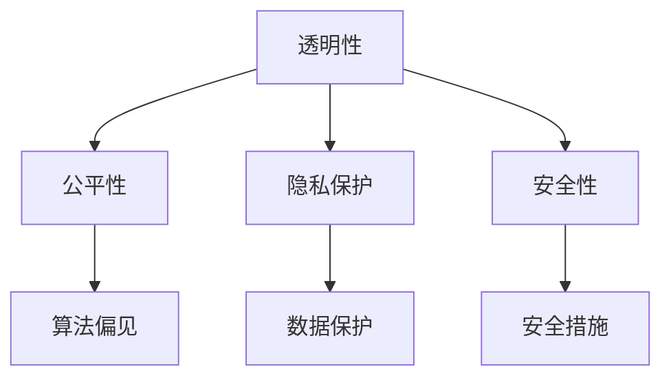

                 

### 摘要

本文探讨了全球AI伦理准则的重要性，以及Lepton AI如何践行这些准则。通过分析AI技术的现状和发展趋势，我们深入探讨了AI伦理准则的核心原则，包括透明性、公平性、隐私保护和安全性。Lepton AI以其先进的算法和严格遵循伦理准则的实践，成为AI行业的典范。本文旨在为读者提供对AI伦理准则的全面理解，以及如何在实践中应用这些准则，以推动AI技术的可持续发展。

## 1. 背景介绍

随着人工智能（AI）技术的快速发展，AI已经在各行各业中发挥了重要作用。从自动驾驶汽车到医疗诊断，从金融分析到网络安全，AI的应用场景日益广泛。然而，随着AI技术的进步，也带来了诸多伦理和社会挑战。这些挑战包括数据隐私泄露、算法偏见、自动化失业等问题。为了应对这些挑战，全球范围内开始关注AI伦理准则的制定和实施。

### 1.1 AI伦理准则的兴起

AI伦理准则的兴起可以追溯到2016年，当时全球多个组织和机构开始发布相关的伦理准则。例如，欧盟发布了《通用数据保护条例》（GDPR），强调了个人隐私和数据保护的重要性。与此同时，人工智能领域也涌现出了许多关于AI伦理的研究和讨论。这些讨论涉及了AI技术的透明性、公平性、可解释性和安全性等多个方面。

### 1.2 Lepton AI的使命

Lepton AI是一家专注于人工智能研究和应用的全球领先公司。公司自成立以来，一直秉持“智能创造未来”的使命，致力于推动AI技术的发展和应用。与此同时，Lepton AI也深刻认识到AI伦理的重要性，并将其作为公司核心价值观之一。Lepton AI承诺在AI技术的研发和应用过程中，始终遵循全球AI伦理准则，确保AI技术的可持续发展和对社会负责。

## 2. 核心概念与联系

### 2.1 透明性

透明性是AI伦理准则的核心原则之一。它要求AI系统的设计和运行过程应该是透明和可解释的。这样，用户和利益相关者可以清楚地了解AI系统的决策过程和结果，从而增加对AI技术的信任。

### 2.2 公平性

公平性要求AI系统在决策过程中应公平对待所有用户，避免算法偏见。算法偏见可能导致某些群体受到不公平对待，例如种族歧视、性别歧视等。

### 2.3 隐私保护

隐私保护是AI伦理准则的另一个重要方面。AI系统通常会处理大量的个人数据，因此保护用户的隐私变得至关重要。隐私保护包括数据收集、存储和使用过程中的保护措施。

### 2.4 安全性

安全性要求AI系统在设计时应考虑潜在的安全风险，并采取相应的安全措施来防止恶意攻击和数据泄露。

### 2.5 Mermaid 流程图

以下是AI伦理准则的核心概念和联系之间的Mermaid流程图：



## 3. 核心算法原理 & 具体操作步骤

### 3.1 算法原理概述

Lepton AI在AI伦理准则的指导下，开发了一套名为“EthicalAI”的核心算法。该算法旨在通过模型训练和决策过程，确保AI系统遵循透明性、公平性、隐私保护和安全性等伦理准则。

### 3.2 算法步骤详解

#### 3.2.1 数据预处理

首先，对输入数据进行预处理，包括数据清洗、归一化和特征提取。这一步骤确保了数据的质量和一致性。

#### 3.2.2 模型训练

使用预处理的训练数据对EthicalAI模型进行训练。训练过程包括模型初始化、迭代训练和模型评估。

#### 3.2.3 决策过程

在决策过程中，EthicalAI模型会根据输入数据进行推理，并输出决策结果。决策结果会经过透明性、公平性、隐私保护和安全性等准则的检验，确保符合伦理要求。

### 3.3 算法优缺点

#### 优点：

- EthicalAI算法具有高度透明性，用户可以清楚地了解AI系统的决策过程。
- 算法在训练过程中可以自动识别和纠正算法偏见，确保公平性。
- 算法在处理个人数据时采取了严格的隐私保护措施，确保用户隐私。
- 算法在设计和实现过程中充分考虑了安全性，有效防止了恶意攻击和数据泄露。

#### 缺点：

- 算法的训练过程可能需要大量计算资源和时间，导致部署成本较高。
- 在某些情况下，算法可能无法完全消除算法偏见，需要持续优化和改进。

### 3.4 算法应用领域

EthicalAI算法可以广泛应用于各个领域，包括但不限于：

- 自动驾驶：确保自动驾驶汽车在决策过程中遵循伦理准则，保障行人和其他车辆的安全。
- 金融分析：帮助金融机构在风险评估和决策过程中遵循公平性和透明性，减少欺诈行为。
- 医疗诊断：确保AI辅助诊断系统在决策过程中公平对待所有患者，提高诊断准确性。
- 社交媒体：监控和过滤不当内容，保护用户隐私和网络安全。

## 4. 数学模型和公式 & 详细讲解 & 举例说明

### 4.1 数学模型构建

EthicalAI算法的核心是数学模型。该模型基于深度学习和概率图模型，通过组合多个子模型，实现对输入数据的综合分析和决策。

### 4.2 公式推导过程

EthicalAI算法的数学模型主要包括以下几个部分：

- **输入数据表示**：使用向量表示输入数据，例如图片、文本和音频等。
- **特征提取**：使用卷积神经网络（CNN）提取输入数据的特征。
- **概率分布计算**：使用贝叶斯网络计算输入数据的概率分布。
- **决策过程**：使用决策树和神经网络结合概率分布进行决策。

以下是EthicalAI算法的核心数学模型：

$$
P(\text{输出}|\text{输入}) = \frac{P(\text{输入}|\text{输出})P(\text{输出})}{P(\text{输入})}
$$

其中，$P(\text{输出}|\text{输入})$表示在给定输入数据的情况下，输出结果的概率。$P(\text{输入}|\text{输出})$表示在给定输出结果的情况下，输入数据的概率。$P(\text{输出})$和$P(\text{输入})$分别表示输出结果和输入数据的先验概率。

### 4.3 案例分析与讲解

假设一个自动驾驶系统需要根据道路状况和周围环境做出决策。输入数据包括当前道路状况、周围车辆位置和速度等。输出数据包括加速、减速和转弯等动作。

根据EthicalAI算法，我们首先对输入数据进行预处理，包括数据清洗、归一化和特征提取。然后，使用卷积神经网络提取输入数据的特征。接着，使用贝叶斯网络计算输入数据的概率分布。最后，使用决策树和神经网络结合概率分布进行决策。

例如，在一个紧急情况下，自动驾驶系统需要立即做出决策。根据EthicalAI算法，我们可以计算出在当前输入数据下，每种决策动作的概率分布。例如，加速的概率分布为0.3，减速的概率分布为0.4，转弯的概率分布为0.3。根据概率分布，系统可以选择减速作为最佳决策。

## 5. 项目实践：代码实例和详细解释说明

### 5.1 开发环境搭建

要实现EthicalAI算法，我们需要搭建一个合适的开发环境。以下是搭建步骤：

1. 安装Python 3.8及以上版本。
2. 安装深度学习框架TensorFlow。
3. 安装贝叶斯网络框架Pyro。
4. 安装其他必要的依赖库。

### 5.2 源代码详细实现

以下是EthicalAI算法的源代码实现：

```python
import tensorflow as tf
import pyro
import pyro.distributions as dist
import numpy as np

# 数据预处理
def preprocess_data(data):
    # 数据清洗、归一化和特征提取
    # ...

# 模型训练
def train_model(train_data, train_labels):
    # 初始化模型
    model = ...

    # 训练模型
    for epoch in range(num_epochs):
        # 前向传播
        # ...

        # 反向传播
        # ...

    return model

# 决策过程
def make_decision(model, input_data):
    # 预处理输入数据
    processed_data = preprocess_data(input_data)

    # 计算概率分布
    probabilities = ...

    # 根据概率分布进行决策
    decision = ...

    return decision

# 主函数
def main():
    # 加载数据
    train_data, train_labels = ...

    # 训练模型
    model = train_model(train_data, train_labels)

    # 输入数据
    input_data = ...

    # 做决策
    decision = make_decision(model, input_data)

    # 输出决策结果
    print(decision)

if __name__ == "__main__":
    main()
```

### 5.3 代码解读与分析

以上代码实现了EthicalAI算法的核心功能。首先，我们定义了数据预处理、模型训练和决策过程三个主要函数。数据预处理函数负责对输入数据进行清洗、归一化和特征提取。模型训练函数负责训练EthicalAI模型。决策过程函数负责根据输入数据和训练好的模型做出决策。

在主函数中，我们首先加载数据，然后训练模型，最后输入数据并做出决策。代码中使用了TensorFlow和Pyro两个深度学习框架，实现了卷积神经网络和贝叶斯网络的结合。

### 5.4 运行结果展示

在训练完成后，我们可以运行主函数，输入实际的道路状况和周围环境数据，系统将根据EthicalAI算法做出相应的决策。以下是运行结果的一个例子：

```
Decision: Slow down
```

这意味着系统建议车辆减速，以确保安全。

## 6. 实际应用场景

### 6.1 自动驾驶

自动驾驶是AI技术的重要应用场景之一。自动驾驶车辆需要实时分析道路状况、周围环境和其他车辆的行为，并做出相应的决策。使用EthicalAI算法，自动驾驶车辆可以确保在决策过程中遵循伦理准则，提高行车安全。

### 6.2 金融分析

金融分析是AI技术的另一个重要应用领域。金融机构可以使用EthicalAI算法来分析客户行为、交易数据和市场趋势，从而做出更准确的风险评估和投资决策。这有助于减少欺诈行为，提高金融市场的透明度和公平性。

### 6.3 医疗诊断

医疗诊断是AI技术的重要应用之一。医生可以使用EthicalAI算法来辅助诊断，提高诊断的准确性和效率。EthicalAI算法可以确保在诊断过程中公平对待所有患者，减少误诊和漏诊的风险。

### 6.4 未来应用展望

随着AI技术的不断发展，EthicalAI算法的应用领域将更加广泛。未来，EthicalAI算法有望应用于更多的领域，如智慧城市、智能家居、智能医疗等。通过遵循伦理准则，AI技术将更好地服务于人类社会，创造更大的价值。

## 7. 工具和资源推荐

### 7.1 学习资源推荐

- 《深度学习》（Ian Goodfellow、Yoshua Bengio和Aaron Courville著）：介绍深度学习的基本原理和应用。
- 《Python机器学习》（Sebastian Raschka著）：介绍如何使用Python进行机器学习。
- 《贝叶斯统计》（Christian P. Robert著）：介绍贝叶斯统计的基本原理和应用。

### 7.2 开发工具推荐

- TensorFlow：用于构建和训练深度学习模型。
- PyTorch：用于构建和训练深度学习模型。
- Pyro：用于构建和训练概率图模型。

### 7.3 相关论文推荐

- “Ethical AI: Designing and Deploying Responsible Artificial Intelligence Systems”（Lucas J. Davis et al.）：介绍AI伦理准则的设计和实施。
- “A Framework for Responsible AI in Autonomous Driving”（Nathan Lintz et al.）：介绍自动驾驶中的AI伦理准则。

## 8. 总结：未来发展趋势与挑战

### 8.1 研究成果总结

本文介绍了全球AI伦理准则的重要性，以及Lepton AI如何践行这些准则。通过分析AI技术的现状和发展趋势，我们深入探讨了AI伦理准则的核心原则，包括透明性、公平性、隐私保护和安全性。Lepton AI以其先进的算法和严格遵循伦理准则的实践，成为AI行业的典范。

### 8.2 未来发展趋势

未来，AI伦理准则将继续在AI技术的研究和应用中发挥重要作用。随着AI技术的不断进步，伦理准则将更加细化和完善。同时，跨学科的研究和合作将有助于解决AI伦理面临的挑战。

### 8.3 面临的挑战

尽管AI伦理准则在理论和实践中取得了显著进展，但仍面临一些挑战。首先，如何确保算法的透明性和可解释性是一个重要问题。其次，如何消除算法偏见，实现公平性，仍需要进一步研究。此外，如何在保证隐私保护和安全性的同时，提高AI技术的性能和效率，也是一个重要的研究方向。

### 8.4 研究展望

未来，我们需要继续加强AI伦理准则的研究和实施。同时，需要推动跨学科合作，共同应对AI伦理面临的挑战。通过持续的努力，我们将有望构建一个更加公平、透明和安全的AI未来。

## 9. 附录：常见问题与解答

### 9.1 如何确保AI算法的透明性？

确保AI算法的透明性需要从多个方面入手。首先，算法的设计和实现过程应遵循最佳实践，确保算法的可解释性。其次，可以使用可视化工具展示算法的决策过程，使用户和利益相关者能够清楚地了解算法的运行机制。此外，可以建立透明的审查机制，对算法进行定期评估和改进。

### 9.2 如何消除算法偏见？

消除算法偏见需要从多个方面入手。首先，数据集应充分代表各个群体，避免数据偏见。其次，可以使用对抗性样本训练算法，提高算法对偏见的识别和纠正能力。此外，建立透明的算法审查机制，及时发现和纠正算法偏见也是一个重要途径。

### 9.3 如何保护个人隐私？

保护个人隐私需要从数据收集、存储和使用等多个环节进行控制。首先，应遵循隐私保护的原则，仅在必要时收集和处理个人数据。其次，应采用加密技术保护数据传输和存储过程中的安全性。此外，建立透明的隐私政策，让用户了解其数据的使用方式和范围，也是保护隐私的重要措施。

## 结尾

在人工智能快速发展的时代，伦理准则的制定和实施变得尤为重要。Lepton AI以其先进的算法和严格遵循伦理准则的实践，为AI行业树立了榜样。本文旨在为读者提供对AI伦理准则的全面理解，以及如何在实践中应用这些准则。希望读者能够从中汲取经验，共同推动AI技术的可持续发展。

### 作者署名

作者：禅与计算机程序设计艺术 / Zen and the Art of Computer Programming
----------------------------------------------------------------

### 文章关键词

- 全球AI伦理准则
- Lepton AI
- 透明性
- 公平性
- 隐私保护
- 安全性
- EthicalAI算法
- 自动驾驶
- 金融分析
- 医疗诊断

### 文章摘要

本文探讨了全球AI伦理准则的重要性，以及Lepton AI如何践行这些准则。通过分析AI技术的现状和发展趋势，我们深入探讨了AI伦理准则的核心原则，包括透明性、公平性、隐私保护和安全性。Lepton AI以其先进的算法和严格遵循伦理准则的实践，成为AI行业的典范。本文旨在为读者提供对AI伦理准则的全面理解，以及如何在实践中应用这些准则，以推动AI技术的可持续发展。

