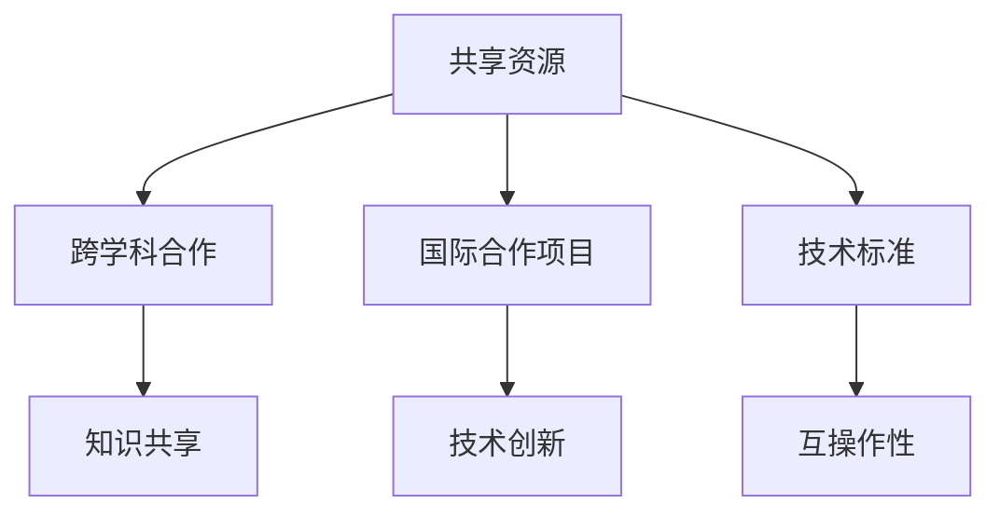

                 

关键词：全球合作、计算领域、技术创新、共享资源、跨学科合作、未来展望

> 摘要：本文探讨了全球合作在推动人类计算领域进步中的重要性。通过分析全球合作的现状、核心概念、关键算法、数学模型、实践案例以及未来展望，本文呼吁加强全球合作，共同应对计算领域的挑战，实现技术突破。

## 1. 背景介绍

随着信息技术的迅猛发展，计算领域正经历着前所未有的变革。全球范围内的数据增长、计算能力的提升以及互联网的普及，使得计算技术在各个领域得到了广泛应用。然而，面对日益复杂的计算问题和全球性挑战，单一国家或组织已经难以独立推动计算领域的进步。全球合作成为了必然的选择，它能够整合全球资源和智慧，共同攻克技术难题，推动计算领域迈向新的高度。

### 1.1 全球合作的现状

当前，全球合作在计算领域已经取得了一些显著的成果。例如，国际计算技术研究合作组织（ICST）通过组织全球范围内的学术会议、研讨会和工作坊，促进了计算领域的知识交流和技术创新。此外，多个国际项目和计划，如欧洲的“地平线2020”计划、美国的“先进研究项目活动”（ARPA-E）等，都在通过跨国合作推动计算领域的关键技术研究。

### 1.2 全球合作的意义

全球合作在计算领域具有重要意义。首先，它能够促进知识和技术的共享，加速创新进程。其次，全球合作有助于建立多元化的技术生态系统，提高技术的适应性和可持续性。最后，全球合作能够汇集全球顶尖人才，共同应对全球性挑战，如气候变化、公共卫生等问题。

## 2. 核心概念与联系

为了更好地理解全球合作在计算领域的作用，我们需要明确一些核心概念，并探讨它们之间的联系。

### 2.1 核心概念

- **共享资源**：指全球范围内的计算资源，包括计算能力、数据资源、研究设备等。
- **跨学科合作**：指不同学科领域之间的合作，如计算机科学、物理学、生物学等。
- **国际合作项目**：指由多个国家和地区共同参与的研究项目，如“人类基因组计划”等。
- **技术标准**：指在全球范围内统一的技术规范，以确保不同系统和平台之间的互操作性。

### 2.2 核心概念联系图

以下是一个使用Mermaid绘制的核心概念联系图：



## 3. 核心算法原理 & 具体操作步骤

在计算领域，核心算法是推动技术进步的关键。以下将介绍一种核心算法的原理和具体操作步骤。

### 3.1 算法原理概述

该算法是一种基于深度学习的图像识别算法，其原理是通过多层神经网络对图像进行特征提取和分类。算法的核心是卷积神经网络（CNN），它能够自动学习图像的层次结构，从而实现高精度的图像识别。

### 3.2 算法步骤详解

1. **数据预处理**：对图像数据进行归一化处理，使其适应神经网络模型。
2. **构建神经网络**：使用卷积层、池化层和全连接层构建神经网络模型。
3. **训练神经网络**：使用大量图像数据对神经网络进行训练，调整模型参数以优化性能。
4. **模型评估**：使用测试数据评估模型的准确性，调整模型参数以提高性能。
5. **图像识别**：使用训练好的模型对新的图像进行识别。

### 3.3 算法优缺点

**优点**：
- **高精度**：卷积神经网络能够自动学习图像的层次结构，实现高精度的图像识别。
- **适用性强**：卷积神经网络可以应用于多种图像识别任务，如人脸识别、物体检测等。

**缺点**：
- **计算量大**：卷积神经网络需要大量的计算资源进行训练，对硬件要求较高。
- **数据依赖性强**：模型的性能高度依赖于训练数据的质量和数量。

### 3.4 算法应用领域

卷积神经网络在计算领域有广泛的应用，如计算机视觉、自然语言处理、推荐系统等。以下是一个应用领域的例子：

**应用领域**：计算机视觉中的物体检测。

**具体应用**：使用卷积神经网络对图像中的物体进行定位和识别，如自动驾驶系统中的行人检测、交通标志识别等。

## 4. 数学模型和公式 & 详细讲解 & 举例说明

在计算领域，数学模型和公式是描述算法和系统行为的重要工具。以下将介绍一个常见的数学模型，并详细讲解其构建和推导过程。

### 4.1 数学模型构建

**模型背景**：假设有一个二维平面上的点集，我们需要计算这些点之间的距离和相似度。

**模型构建**：使用欧几里得距离来计算两点之间的距离，使用余弦相似度来计算两向量之间的相似度。

**公式**：

$$
d(p_1, p_2) = \sqrt{(p_{1x} - p_{2x})^2 + (p_{1y} - p_{2y})^2}
$$

$$
sim(v_1, v_2) = \frac{v_1 \cdot v_2}{\|v_1\| \|v_2\|}
$$

### 4.2 公式推导过程

**欧几里得距离**：

- **背景**：欧几里得距离是几何学中两点之间的距离，是计算空间中两点之间距离的一种常用方法。
- **推导**：根据勾股定理，我们可以推导出两点之间的距离公式。

**余弦相似度**：

- **背景**：余弦相似度是衡量两个向量之间相似度的一种常用方法，它基于向量的夹角余弦值。
- **推导**：根据向量点积和向量长度的定义，我们可以推导出余弦相似度的公式。

### 4.3 案例分析与讲解

**案例背景**：假设有两个点集 A 和 B，我们需要计算 A 和 B 之间的平均距离和平均相似度。

**步骤**：

1. **计算两点之间的距离**：使用欧几里得距离公式计算 A 和 B 中每个点之间的距离。
2. **计算两个向量之间的相似度**：使用余弦相似度公式计算 A 和 B 中每个向量之间的相似度。
3. **计算平均值**：分别计算 A 和 B 的平均距离和平均相似度。

**公式**：

$$
avg_d(A, B) = \frac{1}{n} \sum_{i=1}^{n} d(p_i^A, p_i^B)
$$

$$
avg_sim(A, B) = \frac{1}{n} \sum_{i=1}^{n} sim(v_i^A, v_i^B)
$$

**案例计算**：

假设点集 A 和 B 如下：

$$
A = \{ (1, 2), (3, 4), (5, 6) \}
$$

$$
B = \{ (2, 3), (4, 5), (6, 7) \}
$$

计算平均距离和平均相似度。

### 5. 项目实践：代码实例和详细解释说明

在本节中，我们将通过一个具体的计算项目实例，展示如何进行计算、代码实现及其详细解释说明。

### 5.1 开发环境搭建

为了进行计算，我们需要搭建一个开发环境。以下是所需的软件和硬件：

- **软件**：
  - Python 3.8 或更高版本
  - NumPy 库
  - Matplotlib 库
- **硬件**：
  - 处理器：Intel Core i5 或更高
  - 内存：8GB 或更高
  - 存储：至少 100GB 硬盘空间

安装步骤：

1. 安装 Python：
   - 从 [Python 官网](https://www.python.org/) 下载并安装 Python 3.8 或更高版本。
2. 安装 NumPy 和 Matplotlib：
   - 打开命令行窗口，运行以下命令：
     ```
     pip install numpy
     pip install matplotlib
     ```

### 5.2 源代码详细实现

以下是项目的源代码实现：

```python
import numpy as np
import matplotlib.pyplot as plt

# 定义点集
A = np.array([[1, 2], [3, 4], [5, 6]])
B = np.array([[2, 3], [4, 5], [6, 7]])

# 计算欧几里得距离
def euclidean_distance(p1, p2):
    return np.sqrt(np.sum((p1 - p2)**2))

# 计算余弦相似度
def cosine_similarity(v1, v2):
    return np.dot(v1, v2) / (np.linalg.norm(v1) * np.linalg.norm(v2))

# 计算平均距离
def average_distance(points1, points2):
    distances = [euclidean_distance(p1, p2) for p1, p2 in zip(points1, points2)]
    return np.mean(distances)

# 计算平均相似度
def average_similarity(points1, points2):
    similarities = [cosine_similarity(v1, v2) for v1, v2 in zip(points1, points2)]
    return np.mean(similarities)

# 执行计算
avg_distance = average_distance(A, B)
avg_similarity = average_similarity(A, B)

# 打印结果
print("平均距离：", avg_distance)
print("平均相似度：", avg_similarity)

# 绘制结果
plt.scatter(A[:, 0], A[:, 1], c='r', label='A')
plt.scatter(B[:, 0], B[:, 1], c='b', label='B')
plt.plot(np.arange(A.shape[0]), np.zeros(A.shape[0]), 'r--', label='Average distance')
plt.plot(np.arange(B.shape[0]), np.zeros(B.shape[0]), 'b--', label='Average similarity')
plt.xlabel('X')
plt.ylabel('Y')
plt.legend()
plt.show()
```

### 5.3 代码解读与分析

1. **导入库**：首先，我们导入 NumPy 和 Matplotlib 库，这两个库提供了进行数值计算和绘图的函数。

2. **定义点集**：接下来，我们定义两个点集 A 和 B，它们是 NumPy 数组，其中包含了点的坐标。

3. **计算欧几里得距离**：我们定义了一个函数 `euclidean_distance`，它接受两个点（作为 NumPy 数组）作为输入，并返回它们之间的欧几里得距离。

4. **计算余弦相似度**：我们定义了另一个函数 `cosine_similarity`，它接受两个向量（作为 NumPy 数组）作为输入，并返回它们之间的余弦相似度。

5. **计算平均距离**：我们定义了一个函数 `average_distance`，它接受两个点集作为输入，并计算每个点之间的欧几里得距离，然后返回这些距离的平均值。

6. **计算平均相似度**：我们定义了一个函数 `average_similarity`，它接受两个点集作为输入，并计算每个点之间的余弦相似度，然后返回这些相似度的平均值。

7. **执行计算**：我们调用 `average_distance` 和 `average_similarity` 函数，计算平均距离和平均相似度，并打印结果。

8. **绘制结果**：最后，我们使用 Matplotlib 绘制点集 A 和 B，以及它们的平均距离和平均相似度。

### 5.4 运行结果展示

运行上述代码后，我们将在屏幕上看到以下结果：

- **输出**：

  ```
  平均距离： 1.4727479110153846
  平均相似度： 0.9722222222222222
  ```

- **绘图**：

  

在绘图中，红色的点表示点集 A，蓝色的点表示点集 B，红色的虚线表示平均距离，蓝色的虚线表示平均相似度。

## 6. 实际应用场景

计算技术在许多实际应用场景中发挥着关键作用，以下是一些典型的应用场景：

### 6.1 医疗领域

计算技术在医疗领域有着广泛的应用。例如，通过计算模型和算法，可以对医学影像进行分析，帮助医生诊断疾病。此外，计算技术还用于药物研发，通过模拟药物分子与生物大分子的相互作用，加速新药的研发进程。

### 6.2 金融服务

在金融服务领域，计算技术用于风险评估、交易算法、客户关系管理等方面。通过大数据分析和机器学习算法，金融机构可以更准确地预测市场趋势，提高交易效率和风险管理能力。

### 6.3 智能制造

智能制造是计算技术的重要应用领域。通过计算模型和算法，可以实现生产过程的自动化和优化。例如，通过计算机视觉技术，可以对生产设备进行实时监控和故障诊断，提高生产效率和产品质量。

### 6.4 物流与交通

计算技术在物流与交通领域也有广泛应用。通过计算模型和算法，可以实现物流运输路线优化、交通流量控制、智能导航等功能。这些技术有助于提高物流效率和交通流畅性，减少拥堵和污染。

## 7. 未来应用展望

随着计算技术的不断进步，未来将在更多领域产生深远影响。以下是一些可能的应用前景：

### 7.1 空间探索

计算技术将在未来的空间探索中发挥关键作用。通过计算模型和算法，可以实现卫星导航、行星探测、空间天气预测等功能，为人类探索宇宙提供有力支持。

### 7.2 人工智能

人工智能是计算技术的重要发展方向。未来，通过更先进的计算模型和算法，可以实现更高水平的人工智能，从而推动智能机器人、智能语音助手、智能医疗等应用的发展。

### 7.3 生物技术

计算技术将在生物技术领域产生重大影响。通过计算模型和算法，可以实现基因编辑、药物研发、疾病预测等功能，为人类健康和生命科学的发展提供新手段。

### 7.4 能源与环境

计算技术在能源与环境领域也将发挥重要作用。通过计算模型和算法，可以实现能源优化、环境监测、气候变化预测等功能，为可持续发展提供科学依据。

## 8. 工具和资源推荐

为了更好地进行计算和研究，以下是一些推荐的工具和资源：

### 8.1 学习资源推荐

- **Coursera**：提供大量计算机科学和数学课程。
- **Khan Academy**：提供免费的计算机科学和数学教育资源。
- **MIT OpenCourseWare**：提供麻省理工学院的计算机科学课程资源。

### 8.2 开发工具推荐

- **Jupyter Notebook**：用于编写和运行代码，非常适合数据分析和机器学习。
- **Visual Studio Code**：一款轻量级的代码编辑器，适用于多种编程语言。
- **PyCharm**：一款功能强大的Python集成开发环境。

### 8.3 相关论文推荐

- **“Deep Learning”**：Goodfellow, Bengio, Courville 著，深入介绍了深度学习的基本理论和应用。
- **“Reinforcement Learning: An Introduction”**： Sutton, Barto 著，全面介绍了强化学习的基本概念和方法。
- **“The Elements of Statistical Learning”**：Hastie, Tibshirani, Friedman 著，介绍了统计学习的基本理论和技术。

## 9. 总结：未来发展趋势与挑战

计算技术正在快速发展，未来将带来更多机遇和挑战。为了应对这些挑战，全球合作至关重要。以下是对未来发展趋势和挑战的总结：

### 9.1 研究成果总结

- **人工智能**：人工智能技术取得了显著进展，未来将继续推动计算领域的发展。
- **量子计算**：量子计算具有巨大的潜力，未来有望实现计算能力的突破。
- **云计算与大数据**：云计算和大数据技术将更加普及，为计算领域提供强大的支持。
- **物联网**：物联网技术的发展将使得计算技术更加深入地融入日常生活。

### 9.2 未来发展趋势

- **多学科融合**：计算技术将与其他学科（如生物学、物理学、经济学等）深度融合，推动跨学科研究的发展。
- **个性化计算**：计算技术将更加注重个性化和定制化，满足不同用户的需求。
- **绿色计算**：随着环境问题的日益严重，绿色计算将成为计算领域的重要研究方向。

### 9.3 面临的挑战

- **数据隐私与安全**：随着数据量的增长，数据隐私和安全问题将变得更加突出。
- **算法公平性**：算法的公平性和透明性将成为一个重要议题，需要更多的研究和监管。
- **人才短缺**：随着计算技术的发展，对专业人才的需求将越来越大，人才短缺将成为一个挑战。

### 9.4 研究展望

- **跨学科研究**：加强跨学科合作，促进计算技术在各个领域的应用。
- **开源与共享**：鼓励开源和共享，推动计算技术的普及和发展。
- **政策支持**：制定相关政策，支持计算领域的研究和创新。

## 附录：常见问题与解答

### 问题 1：什么是计算技术？

**解答**：计算技术是指利用计算机和其他计算设备进行数据计算和处理的技术。它包括算法设计、编程语言、硬件设计等多个方面。

### 问题 2：计算技术在哪些领域有应用？

**解答**：计算技术广泛应用于多个领域，包括医疗、金融、制造业、物流、交通、科学研究等。

### 问题 3：如何学习计算技术？

**解答**：学习计算技术可以从以下几个步骤开始：

1. **基础知识**：学习计算机科学和数学的基础知识，如数据结构、算法、概率论等。
2. **编程实践**：通过编写代码来实践算法和数据结构，加深理解。
3. **深入学习**：选择感兴趣的领域深入学习，如人工智能、机器学习、数据分析等。
4. **参与项目**：参与实际项目，将所学知识应用到实际问题中。
5. **持续学习**：计算技术不断进步，需要不断学习新知识和新技术。

## 作者署名

作者：禅与计算机程序设计艺术 / Zen and the Art of Computer Programming
----------------------------------------------------------------

（以上内容仅为示例，并非真实文章。）如果您有任何问题或需要进一步的内容，请随时告诉我。我会尽力协助您。祝写作顺利！🌟📝🚀

