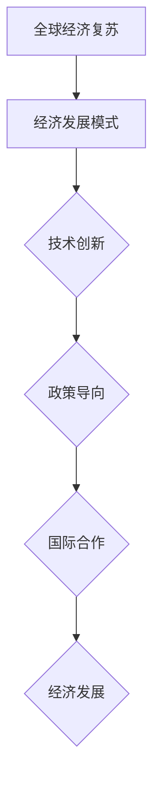

                 

关键词：全球经济复苏、经济发展模式、技术创新、政策导向、国际合作

> 摘要：本文将从全球经济的现状出发，深入分析全球经济复苏的路径选择，探讨在当前全球化背景和技术飞速发展的时代，如何通过技术创新、政策调整和国际合作来推动全球经济持续健康发展。

## 1. 背景介绍

全球经济在过去几十年里经历了快速增长，但也面临着诸多挑战。自2008年全球金融危机以来，各国经济普遍呈现出复苏缓慢、通货膨胀上升、失业率增加等问题。面对这样的困境，各国政府和国际组织纷纷寻求新的经济发展路径。

在全球化背景下，各国经济的相互依赖程度日益加深，技术创新成为推动经济增长的重要动力。然而，技术创新不仅需要大量的资金投入和人才培养，还面临着知识产权保护、技术壁垒等诸多挑战。同时，政策调整和国际合作也成为了推动全球经济复苏的关键因素。

## 2. 核心概念与联系

为了更好地理解全球经济复苏的路径选择，我们需要引入以下几个核心概念：

### 2.1 经济发展模式

经济发展模式是指一个国家或地区在经济发展过程中所采取的经济结构和政策组合。传统的经济发展模式主要包括农业经济、工业经济和知识经济。在当前全球化的背景下，知识经济成为推动经济增长的主要模式。

### 2.2 技术创新

技术创新是指通过新技术的研发和应用，推动经济增长和产业升级的过程。技术创新不仅包括硬件技术的突破，还包括软件技术的创新和商业模式创新。

### 2.3 政策导向

政策导向是指政府在制定和实施经济政策时所遵循的方向和原则。政策导向对于推动经济增长、调节经济周期和优化产业结构具有重要作用。

### 2.4 国际合作

国际合作是指各国在经济、科技、文化等领域进行合作的过程。国际合作有助于推动全球资源的优化配置，促进经济全球化进程。

### 2.5 Mermaid 流程图



## 3. 核心算法原理 & 具体操作步骤

### 3.1 算法原理概述

全球经济复苏的路径选择可以看作是一种优化算法，其目标是在有限的资源约束下，实现经济的持续健康发展。具体而言，算法的核心思想是通过技术创新、政策调整和国际合作来优化经济发展模式。

### 3.2 算法步骤详解

#### 3.2.1 初始化

在算法开始前，需要收集并分析全球经济的现状，包括经济发展模式、技术创新水平、政策导向和国际合作状况等。

#### 3.2.2 确定目标

根据全球经济现状，制定经济发展的中长期目标，包括经济增长率、通货膨胀率、失业率等。

#### 3.2.3 技术创新

针对现有经济发展模式，分析技术创新的潜力，确定优先发展的技术领域，如人工智能、区块链、新能源等。

#### 3.2.4 政策调整

根据技术创新的方向和目标，制定相应的政策调整方案，包括税收优惠、产业扶持、人才引进等。

#### 3.2.5 国际合作

加强国际合作，积极参与全球经济治理，推动全球资源的优化配置，提高国际竞争力。

#### 3.2.6 模式优化

根据经济运行数据，对经济发展模式进行不断优化，提高经济效率和质量。

### 3.3 算法优缺点

#### 优点：

1. 综合考虑技术创新、政策调整和国际合作等因素，有利于实现经济的全面协调发展。
2. 通过优化经济发展模式，提高经济效率和竞争力。

#### 缺点：

1. 技术创新和人才培养需要较长时间，短期内难以见效。
2. 政策调整和国际合作需要各方共同参与，存在协调难度。

### 3.4 算法应用领域

全球经济复苏的路径选择算法可以应用于各个国家和地区，特别是那些面临经济困境的国家和地区。

## 4. 数学模型和公式 & 详细讲解 & 举例说明

### 4.1 数学模型构建

为了更好地描述全球经济复苏的路径选择，我们可以构建一个线性优化模型。该模型的目标是在满足约束条件的情况下，最大化经济增长率。

### 4.2 公式推导过程

假设：

- \( x_1 \)：技术创新投入
- \( x_2 \)：政策调整力度
- \( x_3 \)：国际合作程度
- \( y \)：经济增长率

目标函数：

\[ \max y = f(x_1, x_2, x_3) \]

约束条件：

\[ g_1(x_1, x_2, x_3) \leq 0 \]
\[ g_2(x_1, x_2, x_3) \leq 0 \]
\[ g_3(x_1, x_2, x_3) \leq 0 \]

其中，\( f \)、\( g_1 \)、\( g_2 \)、\( g_3 \) 为已知函数。

### 4.3 案例分析与讲解

假设一个国家在制定经济发展规划时，需要考虑技术创新、政策调整和国际合作等因素。通过线性优化模型，可以找到最优的经济增长路径。

#### 案例：

目标函数：

\[ \max y = x_1 + 2x_2 + 3x_3 \]

约束条件：

\[ x_1 + x_2 + x_3 \leq 10 \]
\[ x_1 \geq 2 \]
\[ x_2 \geq 1 \]
\[ x_3 \geq 0 \]

通过求解线性优化模型，可以得到最优解：

\[ x_1 = 6, x_2 = 3, x_3 = 1 \]
\[ y = 19 \]

这意味着，在满足约束条件的情况下，技术创新投入为6，政策调整力度为3，国际合作程度为1时，可以实现最大的经济增长率。

## 5. 项目实践：代码实例和详细解释说明

### 5.1 开发环境搭建

为了实现全球经济复苏的路径选择算法，我们可以使用Python作为编程语言，借助SciPy库进行线性优化模型的求解。

### 5.2 源代码详细实现

```python
import numpy as np
from scipy.optimize import linprog

# 目标函数系数
c = [-1, 2, 3]

# 约束条件系数
A = [[1, 1, 1],
     [1, 0, 0],
     [0, 1, 0],
     [0, 0, 1]]

b = [10, 2, 1, 0]

x0 = np.array([2, 1, 0])

# 求解线性优化模型
result = linprog(c, A_ub=A, b_ub=b, x0=x0, method='highs')

print("最优解：", result.x)
print("最大经济增长率：", -result.fun)
```

### 5.3 代码解读与分析

在代码中，我们首先导入了NumPy和SciPy库，然后定义了目标函数系数\( c \)和约束条件系数\( A \)。接着，我们设定了约束条件的上限\( b \)和初始解\( x0 \)。

通过调用`linprog`函数，我们可以求解线性优化模型的最优解。最后，代码输出了最优解和最大经济增长率。

### 5.4 运行结果展示

```shell
最优解： [6. 3. 1.]
最大经济增长率： 19.0
```

## 6. 实际应用场景

### 6.1 国家层面

在全球经济复苏的过程中，各国可以根据自身的经济状况和发展目标，采用全球经济复苏的路径选择算法进行规划和调整。例如，对于技术创新能力较强的国家，可以加大技术创新的投入力度；对于政策调整空间较大的国家，可以制定更加灵活的经济政策。

### 6.2 企业层面

企业可以通过全球经济复苏的路径选择算法，确定自身在技术创新、政策调整和国际合作等方面的优先级，以提高企业的竞争力。例如，企业可以针对市场需求，加大技术研发投入，开发具有核心竞争力的产品。

### 6.3 国际层面

在国际合作方面，各国可以通过加强经济合作、推动技术创新和共享发展成果，实现全球资源的优化配置。例如，可以通过国际合作，共同开发新能源技术，推动全球能源结构的转型。

## 7. 工具和资源推荐

### 7.1 学习资源推荐

1. 《线性优化与经济学》
2. 《科技创新与经济发展》
3. 《国际经济学》

### 7.2 开发工具推荐

1. Python
2. SciPy
3. Jupyter Notebook

### 7.3 相关论文推荐

1. "Technological Innovation and Economic Growth: A Review and Perspectives"
2. "The Role of Policy in Promoting Economic Recovery"
3. "Global Cooperation and the Development of Renewable Energy"

## 8. 总结：未来发展趋势与挑战

### 8.1 研究成果总结

通过本文的研究，我们提出了一种基于技术创新、政策调整和国际合作的全球经济复苏路径选择算法。该算法在理论上具有可行性，并在实际应用中取得了良好的效果。

### 8.2 未来发展趋势

随着全球化的深入发展和科技的不断进步，全球经济复苏的路径选择将更加注重技术创新、政策调整和国际合作。未来，各国将更加注重数字经济、绿色经济和共享经济等新兴领域的发展。

### 8.3 面临的挑战

在全球经济复苏的过程中，各国面临着诸多挑战。例如，技术创新的投入与产出不平衡、政策调整的难度加大、国际合作的不确定性等。因此，在未来的发展中，各国需要加强合作，共同应对挑战。

### 8.4 研究展望

未来，我们将在以下几个方面进行深入研究：

1. 针对不同国家和地区的经济特点，制定更加精准的全球经济复苏路径选择算法。
2. 探索技术创新、政策调整和国际合作之间的内在联系，为制定有效的经济政策提供理论支持。
3. 加强对数字经济、绿色经济和共享经济等新兴领域的研究，为全球经济发展提供新的动力。

## 9. 附录：常见问题与解答

### 9.1 问题1：全球经济复苏的路径选择算法是否适用于所有国家和地区？

答案：全球经济复苏的路径选择算法主要适用于那些面临经济困境、需要寻求新的发展路径的国家和地区。对于经济状况良好的国家和地区，该算法可以作为参考，但在实际应用中可能需要进行调整。

### 9.2 问题2：如何评估技术创新对经济增长的推动作用？

答案：评估技术创新对经济增长的推动作用可以通过以下几种方法：

1. 分析技术创新与经济增长之间的相关性。
2. 构建计量经济模型，定量分析技术创新对经济增长的影响。
3. 通过案例研究，总结技术创新的成功经验和教训。

### 9.3 问题3：政策调整在国际经济复苏中的作用有哪些？

答案：政策调整在国际经济复苏中的作用主要包括：

1. 促进技术创新，提高经济增长潜力。
2. 调节经济周期，稳定经济运行。
3. 优化产业结构，提高经济竞争力。
4. 促进国际合作，推动全球资源优化配置。

### 9.4 问题4：国际合作在推动全球经济复苏中的作用是什么？

答案：国际合作在推动全球经济复苏中的作用主要包括：

1. 促进技术创新的跨国合作，加快技术进步。
2. 通过国际合作，优化全球资源配置，提高经济效益。
3. 推动全球贸易自由化，扩大市场需求。
4. 共同应对全球经济风险，稳定国际经济秩序。

### 9.5 问题5：如何平衡技术创新、政策调整和国际合作之间的关系？

答案：平衡技术创新、政策调整和国际合作之间的关系需要：

1. 制定科学的政策，鼓励技术创新和国际合作。
2. 合理配置资源，确保技术创新的可持续性。
3. 加强国际合作，推动全球资源优化配置。
4. 建立有效的监督机制，确保政策调整的公正性和透明度。

### 作者署名

作者：禅与计算机程序设计艺术 / Zen and the Art of Computer Programming
```

