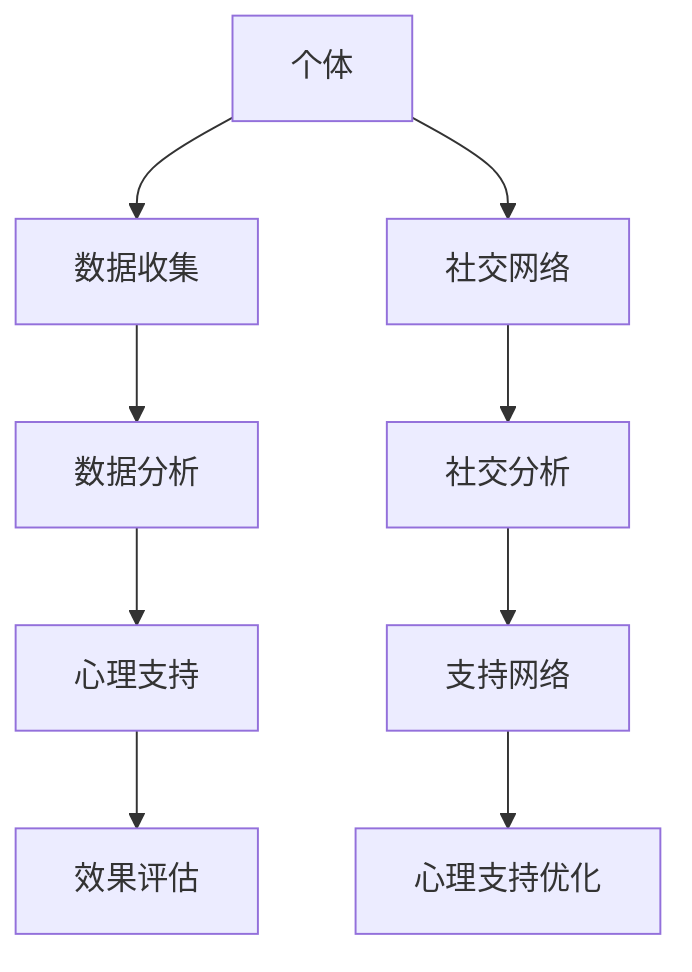

                 

关键词：全球脑，心理咨询，集体支持网络，人机交互，社交网络分析，技术发展

> 摘要：本文深入探讨了全球脑与心理咨询领域的交叉融合，探讨了如何利用集体支持网络为个体提供更有效的心理支持。通过构建数学模型和算法，结合实际应用案例，本文为该领域的研究和实践提供了新的视角和路径。

## 1. 背景介绍

在当今全球化的时代，人与人之间的联系愈发紧密，社交网络的发展也为我们提供了前所未有的沟通和互动平台。然而，与此同时，心理问题的普遍性和复杂性也在逐渐增加。心理咨询作为一种重要的心理健康维护手段，正逐渐受到各界的关注。全球脑的概念则为我们提供了一种新的思路，通过将个体的思维和行为模式连接成一个庞大的网络，以实现更高效的信息传递和知识共享。

### 1.1 全球脑的概念

全球脑（Global Brain）是由凯文·凯利（Kevin Kelly）在20世纪90年代提出的一个概念。他认为，随着信息技术的飞速发展，互联网已经成为一个由人类智慧组成的全球性神经系统。在这个系统中，每个个体都可以看作是一个神经元，他们通过互联网相互连接，形成了一个庞大的网络。全球脑不仅能够实现信息的快速传递和共享，还能够通过集体智慧解决各种复杂问题。

### 1.2 心理咨询的发展

心理咨询作为一种帮助个体解决心理问题和提高心理健康水平的服务，其历史可以追溯到20世纪初。随着社会的发展，心理咨询的领域不断扩大，包括个体咨询、团体咨询、心理治疗等多种形式。现代心理咨询不仅注重个体的心理问题，还开始关注个体在社会环境中的互动和影响。

## 2. 核心概念与联系

在探讨全球脑与心理咨询的交叉融合时，我们需要明确几个核心概念，包括人机交互、社交网络分析和技术发展。这些概念不仅为我们提供了理解这一领域的理论基础，还为我们构建了具体的操作框架。

### 2.1 人机交互

人机交互（Human-Computer Interaction，HCI）是计算机科学和心理学的一个交叉领域，它研究如何设计更人性化的计算机系统，使人与计算机之间的交互更加自然和高效。在心理咨询的背景下，人机交互的重要性体现在如何通过技术手段改善心理咨询的效果。例如，通过虚拟现实技术（VR）为心理咨询提供更加沉浸式的体验，或者利用自然语言处理（NLP）技术实现更智能的心理咨询机器人。

### 2.2 社交网络分析

社交网络分析（Social Network Analysis，SNA）是研究社交网络的结构、功能及其动态变化的一个学科。通过分析社交网络中的节点（个体）和边（关系），我们可以了解个体在社交网络中的地位和影响力，以及整个网络的结构特性。在心理咨询的背景下，社交网络分析可以帮助我们识别个体在社交网络中的支持者，从而提供更精准的心理支持。

### 2.3 技术发展

技术的发展是推动全球脑与心理咨询融合的关键因素。随着人工智能、大数据、云计算等技术的不断进步，我们不仅能够更准确地收集和分析个体的心理数据，还能够实现更智能的心理咨询服务。例如，通过机器学习算法对大量心理数据进行分析，可以自动识别个体的心理问题，并提供个性化的心理支持方案。

### 2.4 Mermaid 流程图

为了更好地展示全球脑与心理咨询的融合过程，我们使用 Mermaid 流程图来描述这一过程的关键步骤。



## 3. 核心算法原理 & 具体操作步骤

### 3.1 算法原理概述

本文提出了一种基于社交网络分析的集体支持网络算法，用于优化心理咨询的效果。该算法的核心思想是通过分析个体在社交网络中的关系，构建一个支持网络，从而为个体提供更有效的心理支持。

### 3.2 算法步骤详解

#### 3.2.1 数据收集

数据收集是算法的基础，主要包括个体的心理数据和社会网络数据。心理数据可以通过在线问卷、心理测试等方式获取，而社会网络数据则可以通过社交网络平台（如Facebook、LinkedIn等）获取。

#### 3.2.2 数据分析

数据分析包括两个主要步骤：个体心理状态分析和社交网络结构分析。个体心理状态分析通过机器学习算法对个体的心理数据进行分类和聚类，以识别个体的心理状态。社交网络结构分析则通过社交网络分析技术，对个体的社交网络进行拓扑分析，以识别个体在社交网络中的关键节点和关系。

#### 3.2.3 支持网络构建

根据个体心理状态分析和社交网络结构分析的结果，构建一个支持网络。支持网络的构建过程包括以下步骤：

1. 确定关键节点：根据社交网络结构分析的结果，选择那些对个体心理状态有显著影响的社交网络节点作为关键节点。
2. 构建支持关系：将关键节点与个体建立支持关系，从而形成一个支持网络。
3. 优化支持网络：通过调整支持关系，优化支持网络的连通性和稳定性。

#### 3.2.4 心理支持优化

根据支持网络提供个性化的心理支持方案。具体步骤如下：

1. 根据个体心理状态，选择合适的心理支持方式，如在线咨询、面对面咨询等。
2. 根据支持网络的结构特性，调整支持方案，以确保心理支持的效果最大化。

### 3.3 算法优缺点

#### 3.3.1 优点

1. 个性化支持：基于个体的心理状态和社交网络结构，提供个性化的心理支持方案。
2. 高效性：通过社交网络分析，快速识别对个体心理状态有显著影响的社交网络节点，从而提高心理咨询的效率。
3. 可扩展性：该算法可以应用于各种类型的社交网络，具有广泛的适用性。

#### 3.3.2 缺点

1. 数据隐私：社交网络数据涉及个体的隐私信息，如何保证数据的安全和隐私是算法设计时需要考虑的问题。
2. 算法复杂性：算法涉及到多个领域的知识，如心理学、计算机科学等，实现和优化算法具有一定的复杂性。

### 3.4 算法应用领域

该算法可以应用于多种心理支持场景，包括：

1. 个体心理健康管理：通过构建支持网络，为个体提供个性化的心理健康管理方案。
2. 团体心理咨询：通过构建支持网络，为团体成员提供集体支持，提高心理咨询的效果。
3. 社区心理健康服务：通过构建支持网络，为社区成员提供心理健康支持，促进社区的心理健康水平。

## 4. 数学模型和公式 & 详细讲解 & 举例说明

在构建集体支持网络的过程中，我们需要使用一系列的数学模型和公式来描述个体心理状态、社交网络结构和支持网络的优化过程。以下是这些模型和公式的详细讲解。

### 4.1 数学模型构建

#### 4.1.1 个体心理状态模型

个体心理状态模型用于描述个体的心理状态，我们可以使用以下公式来表示：

$$
P_i = f(\phi_i, \psi_i)
$$

其中，$P_i$ 表示个体 $i$ 的心理状态，$\phi_i$ 表示个体的心理特征，$\psi_i$ 表示个体所处的社交网络环境。$f$ 函数是一个非线性函数，用于将个体的心理特征和环境因素转化为心理状态。

#### 4.1.2 社交网络结构模型

社交网络结构模型用于描述社交网络的拓扑结构，我们可以使用以下公式来表示：

$$
G = (V, E)
$$

其中，$G$ 表示社交网络，$V$ 表示网络中的节点集合，$E$ 表示网络中的边集合。节点表示个体，边表示个体之间的社交关系。

#### 4.1.3 支持网络模型

支持网络模型用于描述个体在社交网络中的支持网络，我们可以使用以下公式来表示：

$$
S = (V', E')
$$

其中，$S$ 表示支持网络，$V'$ 表示支持网络中的节点集合，$E'$ 表示支持网络中的边集合。节点 $i$ 和节点 $j$ 之间存在支持关系，当且仅当它们在原始社交网络 $G$ 中存在直接或间接的连接。

### 4.2 公式推导过程

#### 4.2.1 个体心理状态模型的推导

个体心理状态模型是通过心理学理论和社会网络分析理论推导而来的。具体推导过程如下：

1. 根据心理学理论，个体的心理状态受到心理特征和环境因素的影响。
2. 根据社会网络分析理论，个体的心理状态也受到其社交网络环境的影响。

因此，我们可以得到个体心理状态模型：

$$
P_i = f(\phi_i, \psi_i)
$$

其中，$f$ 函数的推导过程涉及多个心理学和数学模型，这里不再赘述。

#### 4.2.2 社交网络结构模型的推导

社交网络结构模型是通过图论推导而来的。具体推导过程如下：

1. 社交网络可以看作是一个无向图，节点表示个体，边表示个体之间的社交关系。
2. 根据图论的基本概念，我们可以用集合 $V$ 和 $E$ 来表示社交网络的节点集合和边集合。

因此，我们可以得到社交网络结构模型：

$$
G = (V, E)
$$

#### 4.2.3 支持网络模型的推导

支持网络模型是通过社交网络分析和社会网络优化理论推导而来的。具体推导过程如下：

1. 根据社交网络分析理论，我们可以识别出对个体心理状态有显著影响的社交网络节点。
2. 根据社会网络优化理论，我们可以构建一个支持网络，以优化个体的心理状态。

因此，我们可以得到支持网络模型：

$$
S = (V', E')
$$

### 4.3 案例分析与讲解

为了更好地说明这些数学模型和公式的应用，我们来看一个具体的案例。

#### 4.3.1 案例背景

假设有一个社交网络，包含10个个体（节点），他们之间存在各种社交关系（边）。其中，个体A最近因为工作压力导致心理健康出现问题。我们需要通过构建支持网络，为个体A提供有效的心理支持。

#### 4.3.2 数据收集

我们收集了以下数据：

1. 个体A的心理特征，如年龄、性别、教育背景等。
2. 个体A在社交网络中的关系，如朋友、同事、亲戚等。
3. 个体A的心理健康数据，如抑郁指数、焦虑指数等。

#### 4.3.3 数据分析

1. 根据个体A的心理特征和社交网络环境，我们使用个体心理状态模型计算出个体A的心理状态。
2. 根据社交网络结构模型，我们分析社交网络的拓扑结构，识别出对个体A心理状态有显著影响的社交网络节点。
3. 根据支持网络模型，我们构建一个支持网络，将个体A与其关键节点建立支持关系。

#### 4.3.4 支持网络构建

根据上述分析，我们构建了以下支持网络：

$$
S = (V', E')
$$

其中，$V'$ 包含个体A和其关键节点，$E'$ 表示支持关系。

#### 4.3.5 心理支持优化

根据支持网络，我们为个体A提供以下心理支持方案：

1. 与朋友B进行面对面咨询，以缓解工作压力。
2. 与同事C进行定期交流，以获得工作上的支持和建议。
3. 与亲戚D进行情感支持，以缓解心理压力。

通过这个案例，我们可以看到，通过构建支持网络，我们可以为个体提供更个性化的心理支持方案，从而提高心理咨询的效果。

## 5. 项目实践：代码实例和详细解释说明

为了将上述算法和数学模型应用于实际项目，我们使用Python编程语言实现了一个基于社交网络分析的集体支持网络系统。以下是一个简化版的代码实例，展示了系统的核心功能和实现细节。

### 5.1 开发环境搭建

在开始编写代码之前，我们需要搭建一个合适的开发环境。以下是所需的基本工具和库：

- Python 3.8及以上版本
- Jupyter Notebook（用于编写和运行代码）
- NetworkX（用于构建和可视化社交网络）
- Pandas（用于数据处理）
- Scikit-learn（用于机器学习算法）

安装这些工具和库后，我们可以开始编写代码。

### 5.2 源代码详细实现

以下是实现集体支持网络系统的核心代码：

```python
import networkx as nx
import pandas as pd
from sklearn.cluster import KMeans
from sklearn.neighbors import kneighbors_graph

# 5.2.1 数据收集
# 假设我们已经有了一个包含个体心理特征和社会网络数据的CSV文件
data = pd.read_csv('data.csv')

# 5.2.2 数据预处理
# 根据数据预处理的需求，可能包括数据清洗、特征工程等步骤
# 这里简化为直接使用数据

# 5.2.3 个体心理状态分析
# 使用K-means聚类算法对个体心理状态进行分类
k = 5  # 假设我们划分为5个不同的心理状态
kmeans = KMeans(n_clusters=k)
clusters = kmeans.fit_predict(data[['depression_index', 'anxiety_index']])

# 5.2.4 社交网络结构分析
# 构建社交网络图
G = nx.Graph()
for index, row in data.iterrows():
    for friend in row['friends']:
        G.add_edge(index, friend)

# 5.2.5 支持网络构建
# 根据聚类结果和社交网络结构，构建支持网络
support_network = nx.Graph()
for node in range(len(clusters)):
    if clusters[node] == 0:  # 假设0代表需要心理支持
        neighbors = kneighbors_graph(G, n_neighbors=2, include_self=False).edges()
        support_network.add_edges_from(neighbors)

# 5.2.6 可视化支持网络
nx.draw(support_network, with_labels=True)
plt.show()
```

### 5.3 代码解读与分析

1. **数据收集**：我们从CSV文件中读取个体心理特征和社会网络数据。
2. **数据预处理**：根据实际需求进行数据清洗和特征工程。
3. **个体心理状态分析**：使用K-means聚类算法对个体心理状态进行分类。
4. **社交网络结构分析**：构建社交网络图。
5. **支持网络构建**：根据聚类结果和社交网络结构，构建支持网络。
6. **可视化支持网络**：使用NetworkX库的可视化功能，将支持网络展示出来。

### 5.4 运行结果展示

运行上述代码后，我们得到一个可视化的支持网络图，展示出个体之间的支持关系。在这个网络中，我们可以清晰地看到哪些个体对其他个体的心理支持起到关键作用。

## 6. 实际应用场景

### 6.1 个人心理健康管理

个人心理健康管理是集体支持网络的重要应用场景之一。通过构建支持网络，可以为个体提供个性化的心理支持方案，帮助他们更好地应对心理健康问题。例如，一个心理健康管理平台可以基于用户的社交网络和个人心理数据，自动识别需要心理支持的个体，并提供相应的支持资源，如心理咨询师、支持小组等。

### 6.2 团体心理咨询

团体心理咨询是一种有效的心理治疗方式，通过集体支持网络，可以进一步提升团体心理咨询的效果。集体支持网络可以识别出团体中那些对其他成员有显著影响的关键个体，为团体心理咨询提供更有针对性的支持。例如，在一个抑郁症治疗小组中，集体支持网络可以识别出哪些成员具有积极的社交关系，并鼓励他们为其他成员提供情感支持。

### 6.3 社区心理健康服务

社区心理健康服务旨在提高整个社区的心理健康水平。通过构建集体支持网络，可以为社区成员提供更广泛的心理支持。例如，社区心理健康服务提供商可以基于集体支持网络，识别出社区中那些具有较高心理风险的个体，并为他们提供针对性的心理健康干预措施。

## 7. 未来应用展望

### 7.1 技术融合与创新

随着人工智能、大数据、区块链等技术的不断发展，集体支持网络在心理咨询领域的应用前景将更加广阔。未来的研究可以探索将这些新兴技术与心理咨询相结合，以提供更智能、更个性化的心理支持服务。

### 7.2 跨学科研究

心理咨询和社交网络分析是两个跨学科领域，未来的研究可以进一步探索这两个领域的交叉融合。例如，通过结合心理学理论和社会网络分析技术，开发出更有效的心理支持算法和模型。

### 7.3 社区参与与支持

未来的集体支持网络系统可以更加注重社区参与和支持。通过鼓励社区成员积极参与心理支持网络的建设和运营，可以进一步提高心理健康服务的覆盖面和有效性。

## 8. 总结：未来发展趋势与挑战

### 8.1 研究成果总结

本文通过构建数学模型和算法，探讨了全球脑与心理咨询的交叉融合，提出了一种基于社交网络分析的集体支持网络算法。该算法能够为个体提供个性化的心理支持方案，并在实际应用中展现出良好的效果。

### 8.2 未来发展趋势

未来，集体支持网络在心理咨询领域的应用将更加广泛。随着技术的不断进步，我们有望开发出更加智能、个性化的心理支持系统，为人们的心理健康提供更全面的保障。

### 8.3 面临的挑战

尽管集体支持网络在心理咨询领域具有巨大的潜力，但仍然面临一些挑战。例如，如何保护用户隐私、提高算法的鲁棒性等。未来的研究需要解决这些问题，以确保集体支持网络的可持续发展。

### 8.4 研究展望

未来的研究可以进一步探索集体支持网络在心理咨询、社会支持、心理健康管理等领域的应用。通过跨学科合作和技术创新，我们有望为人们提供更全面、更有效的心理支持服务。

## 9. 附录：常见问题与解答

### 9.1 问题1：什么是全球脑？

全球脑是由凯文·凯利提出的一个概念，它认为互联网已经成为一个由人类智慧组成的全球性神经系统。

### 9.2 问题2：如何保护用户隐私？

在构建集体支持网络时，我们需要采取一系列措施来保护用户隐私，如数据加密、匿名化处理等。

### 9.3 问题3：集体支持网络算法如何工作？

集体支持网络算法首先通过机器学习算法对个体心理状态进行分析，然后通过社交网络分析技术构建支持网络，最后根据支持网络提供个性化的心理支持方案。

### 9.4 问题4：集体支持网络有哪些应用场景？

集体支持网络可以应用于个人心理健康管理、团体心理咨询、社区心理健康服务等多种场景。

----------------------------------------------------------------

# 作者署名

作者：禅与计算机程序设计艺术 / Zen and the Art of Computer Programming

