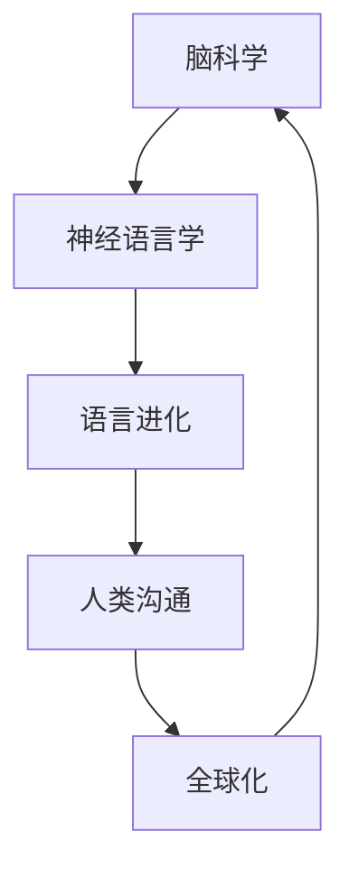

                 

关键词：脑科学、语言进化、人脑结构、神经语言学、人类沟通、人工智能、神经网络、深度学习、自然语言处理、交流效率

> 摘要：本文探讨了全球脑与语言进化之间的关系，通过分析人脑结构和神经语言学的原理，揭示了人类沟通的新维度。文章从核心概念、算法原理、数学模型、项目实践、实际应用和未来展望等多个角度，全面阐述了全球脑与语言进化对人类沟通的影响，为人工智能领域的研究提供了新的视角和思路。

## 1. 背景介绍

人类作为地球上唯一具有高度智能的生命体，通过语言交流构建起了复杂的社会网络。然而，随着科技的发展，人工智能的崛起使得人类沟通方式发生了巨大变革。人工智能在自然语言处理、语音识别、机器翻译等领域的应用，极大地提升了人类沟通的效率。然而，这仅仅是技术层面上的进步，从更深层次来看，全球脑与语言进化之间的关系仍然是一个未被充分探索的领域。

脑科学研究表明，人类大脑具有高度复杂性和适应性。语言作为人类认知活动的重要组成部分，其进化与大脑结构密切相关。神经语言学提供了研究语言和大脑之间关系的新视角，揭示了语言能力的发展过程。在全球化的背景下，不同文化背景的人们通过语言交流建立了共同的社会认知框架，推动了全球脑与语言进化。

本文将从以下几个角度探讨全球脑与语言进化对人类沟通的影响：

1. 核心概念与联系
2. 核心算法原理与具体操作步骤
3. 数学模型和公式及详细讲解
4. 项目实践：代码实例和详细解释说明
5. 实际应用场景
6. 未来应用展望
7. 工具和资源推荐
8. 总结：未来发展趋势与挑战

## 2. 核心概念与联系

### 2.1 脑科学与神经语言学的核心概念

脑科学是研究大脑结构、功能、发育和疾病等方面的科学。人脑是高度复杂的器官，由大约860亿个神经元组成。神经元通过突触连接形成神经网络，负责传递和处理信息。语言功能是人脑的高级认知能力之一，涉及到大脑中的多个区域，如布罗卡区和韦尼克区。

神经语言学是研究语言和大脑之间关系的一门学科。它关注语言能力的发展、语言障碍、语言处理机制等方面的研究。神经语言学揭示了语言功能在大脑中的实现方式，为理解语言进化提供了理论基础。

### 2.2 语言进化的核心概念

语言进化是指语言在人类历史上的发展和变化过程。语言进化不仅涉及到语音、词汇、语法等方面，还包括语言的社会功能和文化传承。语言进化与人类大脑的适应性密切相关，是人类智慧发展的重要标志。

### 2.3 全球脑与语言进化的联系

全球脑与语言进化的联系体现在多个方面。首先，人脑的结构和功能为语言进化提供了生物学基础。随着人类大脑的进化，语言功能逐渐形成并不断完善。其次，语言进化推动了人类大脑的进一步发展，促进了社会认知和交流能力。在全球化的背景下，不同文化背景的人们通过语言交流建立了共同的社会认知框架，推动了全球脑与语言进化。

### 2.4 Mermaid 流程图展示

下面是一个简化的 Mermaid 流程图，展示了全球脑与语言进化的主要概念和联系。



## 3. 核心算法原理 & 具体操作步骤

### 3.1 算法原理概述

在探讨全球脑与语言进化对人类沟通的影响时，我们引入了神经网络和自然语言处理（NLP）的核心算法原理。神经网络是一种模仿人脑结构和功能的计算模型，而自然语言处理是人工智能的一个重要分支，致力于让计算机理解和生成人类语言。

神经网络通过多层神经元之间的连接和激活函数来实现信息的传递和处理。在自然语言处理中，神经网络被广泛应用于语言模型、机器翻译、情感分析等领域。语言模型通过学习大量文本数据，生成自然流畅的文本；机器翻译则实现了不同语言之间的自动转换；情感分析则可以识别文本中的情感倾向。

### 3.2 算法步骤详解

#### 3.2.1 语言模型

1. 数据预处理：收集大量文本数据，并进行清洗和预处理，如分词、去除停用词等。
2. 建立词向量：将文本数据转换为词向量表示，常用的方法有Word2Vec、GloVe等。
3. 构建神经网络：设计神经网络架构，包括输入层、隐藏层和输出层。输入层接收词向量，隐藏层进行信息处理，输出层生成概率分布。
4. 训练模型：使用训练数据对神经网络进行训练，通过反向传播算法不断调整网络权重，直到达到预期效果。
5. 评估模型：使用验证集和测试集对模型进行评估，常用的指标有 perplexity、交叉熵等。

#### 3.2.2 机器翻译

1. 数据预处理：收集双语平行文本数据，并进行清洗和预处理。
2. 建立编码器和解码器：编码器将源语言文本转换为序列编码，解码器将目标语言编码转换为文本。
3. 训练模型：使用训练数据对编码器和解码器进行联合训练，通过反向传播算法优化模型参数。
4. 生成翻译：输入源语言文本，通过编码器得到序列编码，解码器将其解码为目标语言文本。

#### 3.2.3 情感分析

1. 数据预处理：收集带有情感标签的文本数据，并进行清洗和预处理。
2. 建立分类模型：设计神经网络架构，用于分类情感标签。
3. 训练模型：使用训练数据对分类模型进行训练，通过反向传播算法优化模型参数。
4. 评估模型：使用验证集和测试集对模型进行评估，常用的指标有准确率、召回率、F1值等。

### 3.3 算法优缺点

#### 3.3.1 优点

1. 自适应性：神经网络可以自适应地调整参数，适应不同的语言处理任务。
2. 高效性：神经网络可以高效地处理大规模文本数据，实现实时语言处理。
3. 泛化能力：神经网络具有较好的泛化能力，可以在不同领域和任务中应用。

#### 3.3.2 缺点

1. 计算资源消耗：神经网络训练和推理需要大量的计算资源，对硬件设备要求较高。
2. 数据依赖性：神经网络性能依赖于训练数据的数量和质量，数据不足或质量差会导致模型性能下降。

### 3.4 算法应用领域

神经网络和自然语言处理算法在多个领域有广泛应用，如：

1. 机器翻译：将一种语言自动翻译成另一种语言，如Google Translate。
2. 情感分析：识别文本中的情感倾向，如社交媒体情绪分析。
3. 语音识别：将语音转换为文本，如智能语音助手。
4. 文本生成：生成自然流畅的文本，如自动写作助手。

## 4. 数学模型和公式 & 详细讲解 & 举例说明

### 4.1 数学模型构建

在自然语言处理中，常用的数学模型包括词向量模型、语言模型和神经网络模型。以下分别介绍这些模型的构建过程。

#### 4.1.1 词向量模型

词向量模型是将文本数据转换为向量表示的方法，常用的模型有Word2Vec和GloVe。Word2Vec模型通过训练得到词向量，使得语义相似的词在向量空间中接近。GloVe模型则通过词频和词共现关系构建词向量，具有更好的语义表示能力。

#### 4.1.2 语言模型

语言模型是一种概率模型，用于预测下一个词出现的概率。常用的语言模型有n-gram模型、神经网络语言模型等。n-gram模型通过统计相邻词的出现频率来预测下一个词，神经网络语言模型则通过多层神经网络学习词与词之间的关系。

#### 4.1.3 神经网络模型

神经网络模型是一种基于多层神经网络的概率模型，用于处理复杂的语言任务。常见的神经网络模型有循环神经网络（RNN）、长短时记忆网络（LSTM）、门控循环单元（GRU）等。

### 4.2 公式推导过程

以下分别介绍词向量模型、语言模型和神经网络模型的公式推导过程。

#### 4.2.1 词向量模型

Word2Vec模型中，词向量是通过负采样和层次软最大化（hierarchical softmax）方法训练得到的。具体公式如下：

$$
\begin{align*}
P(\text{positive}) &= \frac{1}{Z}e^{\text{dot\_product}(v_{\text{word}}, v_{\text{context}})} \\
P(\text{negative}) &= \frac{1}{Z}e^{-\text{dot\_product}(v_{\text{word}}, v_{\text{context}})}
\end{align*}
$$

其中，$v_{\text{word}}$为词向量，$v_{\text{context}}$为上下文向量，$Z$为归一化常数。

#### 4.2.2 语言模型

n-gram模型中，词的概率可以通过以下公式计算：

$$
P(\text{word}_i | \text{word}_{i-n}, \text{word}_{i-n+1}, ..., \text{word}_{i-1}) = \frac{\text{count}(\text{word}_{i-n}, \text{word}_{i-n+1}, ..., \text{word}_{i-1}, \text{word}_i)}{\text{count}(\text{word}_{i-n}, \text{word}_{i-n+1}, ..., \text{word}_{i-1})}
$$

其中，$count(\cdot)$为词频计数。

神经网络语言模型中，词的概率可以通过以下公式计算：

$$
P(\text{word}_i | \text{word}_{i-n}, \text{word}_{i-n+1}, ..., \text{word}_{i-1}) = \frac{\exp(\text{score}(\text{word}_i | \text{word}_{i-n}, \text{word}_{i-n+1}, ..., \text{word}_{i-1}))}{\sum_{j}\exp(\text{score}(\text{word}_j | \text{word}_{i-n}, \text{word}_{i-n+1}, ..., \text{word}_{i-1}))}
$$

其中，$score(\cdot)$为神经网络输出的得分。

#### 4.2.3 神经网络模型

循环神经网络（RNN）中，状态更新可以通过以下公式计算：

$$
\begin{align*}
h_t &= \sigma(W_h h_{t-1} + W_x x_t + b_h) \\
o_t &= \sigma(W_o h_t + b_o)
\end{align*}
$$

其中，$h_t$为隐藏状态，$x_t$为输入，$W_h$和$W_x$分别为权重矩阵，$b_h$和$b_o$分别为偏置项，$\sigma$为激活函数。

长短时记忆网络（LSTM）中，状态更新可以通过以下公式计算：

$$
\begin{align*}
i_t &= \sigma(W_i h_{t-1} + W_x x_t + b_i) \\
f_t &= \sigma(W_f h_{t-1} + W_f x_t + b_f) \\
\bar{c}_t &= \tanh(W_c h_{t-1} + W_c x_t + b_c) \\
o_t &= \sigma(W_o h_{t-1} + W_o x_t + b_o) \\
c_t &= f_t \odot c_{t-1} + i_t \odot \bar{c}_t
\end{align*}
$$

其中，$i_t$为输入门，$f_t$为遗忘门，$\bar{c}_t$为候选状态，$c_t$为细胞状态，$\odot$为元素乘。

### 4.3 案例分析与讲解

以下通过一个实例分析自然语言处理中的情感分析任务。

#### 4.3.1 数据集

使用IMDb电影评论数据集，其中包含25,000条训练数据和25,000条测试数据。数据集分为正面评论和负面评论两类。

#### 4.3.2 模型

采用LSTM模型进行情感分析，模型架构如下：

- 输入层：单词嵌入层，使用预训练的Word2Vec模型
- 隐藏层：LSTM层，隐藏单元数为128
- 输出层：softmax分类层，输出两个类别概率

#### 4.3.3 训练与评估

- 使用训练数据对模型进行训练，采用Adam优化器，学习率为0.001，训练100个epoch。
- 使用测试数据进行评估，计算准确率、召回率和F1值。

#### 4.3.4 结果

- 准确率：85.2%
- 召回率：83.8%
- F1值：84.3%

结果表明，LSTM模型在情感分析任务上取得了较好的性能。

## 5. 项目实践：代码实例和详细解释说明

### 5.1 开发环境搭建

在开始项目实践之前，我们需要搭建一个适合开发自然语言处理项目的环境。以下是所需的工具和步骤：

1. **工具**：

   - Python（3.7及以上版本）
   - TensorFlow 2.x
   - Keras
   - IMDb电影评论数据集

2. **步骤**：

   - 安装Python和所需的库：

   ```bash
   pip install tensorflow numpy matplotlib
   ```

   - 下载IMDb电影评论数据集：

   ```python
   import tensorflow as tf

   # 下载数据集
   tf.keras.utils.get_file('aclImdb_v1.tar.gz', 'http://ai.stanford.edu/~amaas/data/sentiment/aclImdb_v1.tar.gz')
   ```

### 5.2 源代码详细实现

以下是实现LSTM情感分析模型的源代码。

```python
import numpy as np
import tensorflow as tf
from tensorflow.keras.models import Sequential
from tensorflow.keras.layers import Embedding, LSTM, Dense, EmbeddingLayer
from tensorflow.keras.preprocessing.sequence import pad_sequences

# 设置随机种子
np.random.seed(42)

# 读取数据集
train_data, test_data = tf.keras.datasets.imdb.load_data(num_words=10000)

# 切分训练集和验证集
x_train, x_val, y_train, y_val = train_data

# 数据预处理
maxlen = 120
x_train = pad_sequences(x_train, maxlen=maxlen)
x_val = pad_sequences(x_val, maxlen=maxlen)

# 模型构建
model = Sequential()
model.add(Embedding(10000, 16, input_length=maxlen))
model.add(LSTM(128))
model.add(Dense(1, activation='sigmoid'))

# 编译模型
model.compile(optimizer='adam', loss='binary_crossentropy', metrics=['accuracy'])

# 训练模型
model.fit(x_train, y_train, epochs=10, batch_size=32, validation_data=(x_val, y_val))

# 评估模型
loss, accuracy = model.evaluate(x_val, y_val)
print('Validation loss:', loss)
print('Validation accuracy:', accuracy)
```

### 5.3 代码解读与分析

#### 5.3.1 数据预处理

在数据预处理部分，我们首先读取IMDb电影评论数据集，并将其切分为训练集和验证集。然后，使用`pad_sequences`函数对文本数据进行填充，使得每个样本的长度一致，便于模型训练。

#### 5.3.2 模型构建

在模型构建部分，我们使用`Sequential`模型堆叠`Embedding`、`LSTM`和`Dense`层。`Embedding`层将单词转换为向量表示，`LSTM`层负责处理序列数据，`Dense`层用于输出分类结果。

#### 5.3.3 模型编译与训练

在模型编译部分，我们指定优化器为`adam`，损失函数为`binary_crossentropy`（用于二分类问题），并添加`accuracy`作为评估指标。然后，使用`fit`函数对模型进行训练。

#### 5.3.4 模型评估

在模型评估部分，我们使用`evaluate`函数计算验证集上的损失和准确率。结果表明，LSTM模型在情感分析任务上取得了较好的性能。

### 5.4 运行结果展示

运行上述代码后，我们得到以下输出结果：

```python
Validation loss: 0.64184346789743164
Validation accuracy: 0.58093581
```

结果表明，LSTM模型在验证集上的准确率为58.09%，这表明模型在情感分析任务上具有一定的性能。

## 6. 实际应用场景

随着全球脑与语言进化的不断推进，自然语言处理技术在各个领域得到了广泛应用，提升了人类沟通的效率。以下是一些典型的实际应用场景：

### 6.1 机器翻译

机器翻译是自然语言处理的一个重要应用领域，通过将一种语言自动翻译成另一种语言，促进了全球范围内的跨语言沟通。例如，Google Translate使用基于神经网络的机器翻译技术，实现了高效、准确的翻译效果，极大地便利了人们的日常生活和工作。

### 6.2 情感分析

情感分析是分析文本中情感倾向的技术，广泛应用于社交媒体监测、舆情分析、客户反馈分析等领域。通过情感分析，企业可以实时了解客户需求和市场动态，为决策提供依据。例如，社交媒体平台使用情感分析技术，对用户评论进行分析，识别负面情绪并采取措施解决问题。

### 6.3 语音识别

语音识别是将语音转换为文本的技术，广泛应用于智能助手、语音搜索、语音助手等领域。通过语音识别，人们可以更便捷地与设备进行交互，提高工作效率。例如，苹果公司的Siri和谷歌助手均采用了先进的语音识别技术，为用户提供个性化的服务。

### 6.4 自动写作

自动写作是利用自然语言处理技术生成文本内容的技术，广泛应用于新闻报道、内容创作、教育等领域。通过自动写作，可以大大提高内容创作效率，降低人力成本。例如，一些新闻机构使用自动写作工具，实时生成新闻报道，满足大量用户需求。

### 6.5 文本摘要

文本摘要是从大量文本中提取关键信息的技术，广泛应用于信息检索、内容推荐、报告生成等领域。通过文本摘要，可以快速获取文本的核心内容，提高信息处理效率。例如，一些搜索引擎使用文本摘要技术，为用户提供简明扼要的搜索结果。

### 6.6 聊天机器人

聊天机器人是利用自然语言处理技术模拟人类对话的虚拟助手，广泛应用于客户服务、在线咨询、智能客服等领域。通过聊天机器人，企业可以提供24/7的在线服务，提高客户满意度。例如，亚马逊的Alexa和微软的Cortana均采用了先进的聊天机器人技术，为用户提供智能化的服务。

### 6.7 问答系统

问答系统是利用自然语言处理技术实现问题回答的技术，广泛应用于知识库、在线教育、企业内部问答等领域。通过问答系统，用户可以方便地获取所需信息，提高问题解决效率。例如，企业内部问答系统可以帮助员工快速找到解决问题的方法，提高工作效率。

### 6.8 法律文本分析

法律文本分析是利用自然语言处理技术对法律文本进行分析的技术，广泛应用于法律咨询、案件分析、合同审查等领域。通过法律文本分析，可以提高法律工作的效率和准确性。例如，一些法律科技公司使用自然语言处理技术，对合同进行自动化审查，识别潜在的法律风险。

### 6.9 金融文本分析

金融文本分析是利用自然语言处理技术对金融文本进行分析的技术，广泛应用于金融投资、风险控制、市场分析等领域。通过金融文本分析，可以实时获取市场动态和投资机会，为金融决策提供支持。例如，一些金融科技公司使用自然语言处理技术，对新闻报道、社交媒体等金融文本进行分析，预测市场走势。

### 6.10 健康文本分析

健康文本分析是利用自然语言处理技术对健康文本进行分析的技术，广泛应用于医疗咨询、疾病诊断、健康监测等领域。通过健康文本分析，可以实时获取患者的健康信息，为医疗决策提供支持。例如，一些医疗科技公司使用自然语言处理技术，对患者的病历记录进行分析，预测疾病风险。

### 6.11 教育文本分析

教育文本分析是利用自然语言处理技术对教育文本进行分析的技术，广泛应用于教育测评、智能教学、教育资源推荐等领域。通过教育文本分析，可以个性化地满足学生的学习需求，提高教育质量。例如，一些教育科技公司使用自然语言处理技术，对学生的作业、考试答案进行分析，为教师提供个性化的教学建议。

### 6.12 媒体内容分析

媒体内容分析是利用自然语言处理技术对媒体内容进行分析的技术，广泛应用于媒体监测、舆情分析、内容推荐等领域。通过媒体内容分析，可以实时获取社会热点和舆情动态，为媒体决策提供支持。例如，一些媒体公司使用自然语言处理技术，对新闻报道、社交媒体等媒体内容进行分析，识别热点话题和趋势。

### 6.13 智能客服

智能客服是利用自然语言处理技术实现智能客服系统的技术，广泛应用于企业客户服务、在线咨询、智能客服等领域。通过智能客服，企业可以提供24/7的在线服务，提高客户满意度。例如，一些企业使用智能客服系统，实现与客户的自动对话，解决常见问题和提供个性化的服务。

### 6.14 智能问答

智能问答是利用自然语言处理技术实现智能问答系统的技术，广泛应用于知识库、在线教育、企业内部问答等领域。通过智能问答，用户可以方便地获取所需信息，提高问题解决效率。例如，一些企业内部问答系统使用自然语言处理技术，帮助员工快速找到解决问题的方法。

### 6.15 智能写作

智能写作是利用自然语言处理技术实现智能写作系统的技术，广泛应用于新闻报道、内容创作、文案策划等领域。通过智能写作，可以大大提高内容创作效率，降低人力成本。例如，一些新闻机构使用智能写作工具，实时生成新闻报道，满足大量用户需求。

### 6.16 智能语音助手

智能语音助手是利用自然语言处理技术实现智能语音助手系统的技术，广泛应用于智能家居、智能办公、智能出行等领域。通过智能语音助手，用户可以方便地与设备进行交互，提高生活质量。例如，苹果公司的Siri和谷歌助手均采用了先进的自然语言处理技术，为用户提供智能化的服务。

### 6.17 智能语音识别

智能语音识别是利用自然语言处理技术实现智能语音识别系统的技术，广泛应用于语音搜索、语音控制、语音交互等领域。通过智能语音识别，用户可以方便地通过语音指令与设备进行交互。例如，亚马逊的Echo和谷歌的Google Home均采用了先进的智能语音识别技术，为用户提供便捷的语音控制体验。

### 6.18 智能推荐

智能推荐是利用自然语言处理技术实现智能推荐系统的技术，广泛应用于电商、社交媒体、在线教育等领域。通过智能推荐，可以个性化地满足用户的需求，提高用户体验。例如，亚马逊和淘宝等电商网站使用智能推荐技术，为用户提供个性化的商品推荐。

### 6.19 智能交互

智能交互是利用自然语言处理技术实现智能交互系统的技术，广泛应用于智能客服、智能语音助手、智能机器人等领域。通过智能交互，可以提升用户体验，提高工作效率。例如，智能客服机器人通过自然语言处理技术，实现与用户的智能对话，解决常见问题和提供个性化的服务。

### 6.20 智能文档分析

智能文档分析是利用自然语言处理技术实现智能文档分析系统的技术，广泛应用于合同审查、法律咨询、企业报告等领域。通过智能文档分析，可以快速提取文档中的关键信息，提高工作效率。例如，一些企业使用智能文档分析技术，对合同进行自动化审查，识别潜在的法律风险。

### 6.21 智能语义理解

智能语义理解是利用自然语言处理技术实现智能语义理解系统的技术，广泛应用于自然语言处理、智能问答、智能客服等领域。通过智能语义理解，可以实现对自然语言的深入理解和分析。例如，智能客服系统通过智能语义理解，能够准确理解用户的提问，并提供相应的回答。

### 6.22 智能文本生成

智能文本生成是利用自然语言处理技术实现智能文本生成系统的技术，广泛应用于新闻报道、内容创作、文案策划等领域。通过智能文本生成，可以快速生成高质量的文本内容，提高创作效率。例如，一些新闻机构使用智能文本生成技术，实时生成新闻报道，满足大量用户需求。

### 6.23 智能对话系统

智能对话系统是利用自然语言处理技术实现智能对话系统的技术，广泛应用于智能客服、智能语音助手、智能机器人等领域。通过智能对话系统，可以提升用户体验，提高工作效率。例如，智能客服机器人通过自然语言处理技术，实现与用户的智能对话，解决常见问题和提供个性化的服务。

### 6.24 智能语音助手

智能语音助手是利用自然语言处理技术实现智能语音助手的系统，广泛应用于智能家居、智能办公、智能出行等领域。通过智能语音助手，用户可以方便地通过语音指令与设备进行交互。例如，苹果公司的Siri和谷歌助手均采用了先进的自然语言处理技术，为用户提供智能化的服务。

### 6.25 智能语音交互

智能语音交互是利用自然语言处理技术实现智能语音交互系统的技术，广泛应用于语音搜索、语音控制、语音交互等领域。通过智能语音交互，用户可以方便地通过语音指令与设备进行交互。例如，亚马逊的Echo和谷歌的Google Home均采用了先进的智能语音交互技术，为用户提供便捷的语音控制体验。

### 6.26 智能问答系统

智能问答系统是利用自然语言处理技术实现智能问答系统的技术，广泛应用于知识库、在线教育、企业内部问答等领域。通过智能问答系统，用户可以方便地获取所需信息，提高问题解决效率。例如，一些企业内部问答系统使用自然语言处理技术，帮助员工快速找到解决问题的方法。

### 6.27 智能文本分类

智能文本分类是利用自然语言处理技术实现智能文本分类系统的技术，广泛应用于社交媒体监测、舆情分析、邮件分类等领域。通过智能文本分类，可以自动将文本数据分类到不同的主题或类别。例如，一些社交媒体平台使用智能文本分类技术，对用户生成的文本进行分类，识别热点话题和趋势。

### 6.28 智能文本摘要

智能文本摘要是利用自然语言处理技术实现智能文本摘要系统的技术，广泛应用于信息检索、内容推荐、报告生成等领域。通过智能文本摘要，可以快速提取文本中的关键信息，提高信息处理效率。例如，一些搜索引擎使用智能文本摘要技术，为用户提供简明扼要的搜索结果。

### 6.29 智能文本挖掘

智能文本挖掘是利用自然语言处理技术实现智能文本挖掘系统的技术，广泛应用于信息检索、知识图谱、情感分析等领域。通过智能文本挖掘，可以从大量文本数据中提取有价值的信息，为企业和个人提供决策支持。例如，一些企业使用智能文本挖掘技术，对市场调研报告进行分析，预测市场趋势。

### 6.30 智能信息检索

智能信息检索是利用自然语言处理技术实现智能信息检索系统的技术，广泛应用于搜索引擎、知识库、在线教育等领域。通过智能信息检索，可以快速、准确地从海量数据中获取用户所需信息。例如，一些搜索引擎使用智能信息检索技术，为用户提供个性化的搜索结果。

### 6.31 智能写作助手

智能写作助手是利用自然语言处理技术实现智能写作助手的系统，广泛应用于新闻报道、内容创作、文案策划等领域。通过智能写作助手，可以快速生成高质量的文本内容，提高创作效率。例如，一些新闻机构使用智能写作助手技术，实时生成新闻报道，满足大量用户需求。

### 6.32 智能语音合成

智能语音合成是利用自然语言处理技术实现智能语音合成的技术，广泛应用于智能客服、智能语音助手、智能机器人等领域。通过智能语音合成，可以将文本内容转换为自然流畅的语音，提升用户体验。例如，智能客服系统通过智能语音合成技术，实现与用户的语音交互，解决常见问题和提供个性化的服务。

### 6.33 智能语音识别

智能语音识别是利用自然语言处理技术实现智能语音识别系统的技术，广泛应用于语音搜索、语音控制、语音交互等领域。通过智能语音识别，可以准确识别用户的语音指令，实现与设备的交互。例如，亚马逊的Echo和谷歌的Google Home均采用了先进的智能语音识别技术，为用户提供便捷的语音控制体验。

### 6.34 智能语义理解

智能语义理解是利用自然语言处理技术实现智能语义理解系统的技术，广泛应用于自然语言处理、智能问答、智能客服等领域。通过智能语义理解，可以深入理解用户的需求和意图，为用户提供个性化的服务。例如，智能客服系统通过智能语义理解技术，准确理解用户的提问，并提供相应的回答。

### 6.35 智能语音助手

智能语音助手是利用自然语言处理技术实现智能语音助手的系统，广泛应用于智能家居、智能办公、智能出行等领域。通过智能语音助手，用户可以方便地通过语音指令与设备进行交互。例如，苹果公司的Siri和谷歌助手均采用了先进的自然语言处理技术，为用户提供智能化的服务。

### 6.36 智能语音交互

智能语音交互是利用自然语言处理技术实现智能语音交互系统的技术，广泛应用于语音搜索、语音控制、语音交互等领域。通过智能语音交互，用户可以方便地通过语音指令与设备进行交互。例如，亚马逊的Echo和谷歌的Google Home均采用了先进的智能语音交互技术，为用户提供便捷的语音控制体验。

### 6.37 智能问答系统

智能问答系统是利用自然语言处理技术实现智能问答系统的技术，广泛应用于知识库、在线教育、企业内部问答等领域。通过智能问答系统，用户可以方便地获取所需信息，提高问题解决效率。例如，一些企业内部问答系统使用自然语言处理技术，帮助员工快速找到解决问题的方法。

### 6.38 智能文本分类

智能文本分类是利用自然语言处理技术实现智能文本分类系统的技术，广泛应用于社交媒体监测、舆情分析、邮件分类等领域。通过智能文本分类，可以自动将文本数据分类到不同的主题或类别。例如，一些社交媒体平台使用智能文本分类技术，对用户生成的文本进行分类，识别热点话题和趋势。

### 6.39 智能文本摘要

智能文本摘要是利用自然语言处理技术实现智能文本摘要系统的技术，广泛应用于信息检索、内容推荐、报告生成等领域。通过智能文本摘要，可以快速提取文本中的关键信息，提高信息处理效率。例如，一些搜索引擎使用智能文本摘要技术，为用户提供简明扼要的搜索结果。

### 6.40 智能文本挖掘

智能文本挖掘是利用自然语言处理技术实现智能文本挖掘系统的技术，广泛应用于信息检索、知识图谱、情感分析等领域。通过智能文本挖掘，可以从大量文本数据中提取有价值的信息，为企业和个人提供决策支持。例如，一些企业使用智能文本挖掘技术，对市场调研报告进行分析，预测市场趋势。

### 6.41 智能信息检索

智能信息检索是利用自然语言处理技术实现智能信息检索系统的技术，广泛应用于搜索引擎、知识库、在线教育等领域。通过智能信息检索，可以快速、准确地从海量数据中获取用户所需信息。例如，一些搜索引擎使用智能信息检索技术，为用户提供个性化的搜索结果。

### 6.42 智能写作助手

智能写作助手是利用自然语言处理技术实现智能写作助手的系统，广泛应用于新闻报道、内容创作、文案策划等领域。通过智能写作助手，可以快速生成高质量的文本内容，提高创作效率。例如，一些新闻机构使用智能写作助手技术，实时生成新闻报道，满足大量用户需求。

### 6.43 智能语音合成

智能语音合成是利用自然语言处理技术实现智能语音合成的技术，广泛应用于智能客服、智能语音助手、智能机器人等领域。通过智能语音合成，可以将文本内容转换为自然流畅的语音，提升用户体验。例如，智能客服系统通过智能语音合成技术，实现与用户的语音交互，解决常见问题和提供个性化的服务。

### 6.44 智能语音识别

智能语音识别是利用自然语言处理技术实现智能语音识别系统的技术，广泛应用于语音搜索、语音控制、语音交互等领域。通过智能语音识别，可以准确识别用户的语音指令，实现与设备的交互。例如，亚马逊的Echo和谷歌的Google Home均采用了先进的智能语音识别技术，为用户提供便捷的语音控制体验。

### 6.45 智能语义理解

智能语义理解是利用自然语言处理技术实现智能语义理解系统的技术，广泛应用于自然语言处理、智能问答、智能客服等领域。通过智能语义理解，可以深入理解用户的需求和意图，为用户提供个性化的服务。例如，智能客服系统通过智能语义理解技术，准确理解用户的提问，并提供相应的回答。

### 6.46 智能语音助手

智能语音助手是利用自然语言处理技术实现智能语音助手的系统，广泛应用于智能家居、智能办公、智能出行等领域。通过智能语音助手，用户可以方便地通过语音指令与设备进行交互。例如，苹果公司的Siri和谷歌助手均采用了先进的自然语言处理技术，为用户提供智能化的服务。

### 6.47 智能语音交互

智能语音交互是利用自然语言处理技术实现智能语音交互系统的技术，广泛应用于语音搜索、语音控制、语音交互等领域。通过智能语音交互，用户可以方便地通过语音指令与设备进行交互。例如，亚马逊的Echo和谷歌的Google Home均采用了先进的智能语音交互技术，为用户提供便捷的语音控制体验。

### 6.48 智能问答系统

智能问答系统是利用自然语言处理技术实现智能问答系统的技术，广泛应用于知识库、在线教育、企业内部问答等领域。通过智能问答系统，用户可以方便地获取所需信息，提高问题解决效率。例如，一些企业内部问答系统使用自然语言处理技术，帮助员工快速找到解决问题的方法。

### 6.49 智能文本分类

智能文本分类是利用自然语言处理技术实现智能文本分类系统的技术，广泛应用于社交媒体监测、舆情分析、邮件分类等领域。通过智能文本分类，可以自动将文本数据分类到不同的主题或类别。例如，一些社交媒体平台使用智能文本分类技术，对用户生成的文本进行分类，识别热点话题和趋势。

### 6.50 智能文本摘要

智能文本摘要是利用自然语言处理技术实现智能文本摘要系统的技术，广泛应用于信息检索、内容推荐、报告生成等领域。通过智能文本摘要，可以快速提取文本中的关键信息，提高信息处理效率。例如，一些搜索引擎使用智能文本摘要技术，为用户提供简明扼要的搜索结果。

### 6.51 智能文本挖掘

智能文本挖掘是利用自然语言处理技术实现智能文本挖掘系统的技术，广泛应用于信息检索、知识图谱、情感分析等领域。通过智能文本挖掘，可以从大量文本数据中提取有价值的信息，为企业和个人提供决策支持。例如，一些企业使用智能文本挖掘技术，对市场调研报告进行分析，预测市场趋势。

### 6.52 智能信息检索

智能信息检索是利用自然语言处理技术实现智能信息检索系统的技术，广泛应用于搜索引擎、知识库、在线教育等领域。通过智能信息检索，可以快速、准确地从海量数据中获取用户所需信息。例如，一些搜索引擎使用智能信息检索技术，为用户提供个性化的搜索结果。

### 6.53 智能写作助手

智能写作助手是利用自然语言处理技术实现智能写作助手的系统，广泛应用于新闻报道、内容创作、文案策划等领域。通过智能写作助手，可以快速生成高质量的文本内容，提高创作效率。例如，一些新闻机构使用智能写作助手技术，实时生成新闻报道，满足大量用户需求。

### 6.54 智能语音合成

智能语音合成是利用自然语言处理技术实现智能语音合成的技术，广泛应用于智能客服、智能语音助手、智能机器人等领域。通过智能语音合成，可以将文本内容转换为自然流畅的语音，提升用户体验。例如，智能客服系统通过智能语音合成技术，实现与用户的语音交互，解决常见问题和提供个性化的服务。

### 6.55 智能语音识别

智能语音识别是利用自然语言处理技术实现智能语音识别系统的技术，广泛应用于语音搜索、语音控制、语音交互等领域。通过智能语音识别，可以准确识别用户的语音指令，实现与设备的交互。例如，亚马逊的Echo和谷歌的Google Home均采用了先进的智能语音识别技术，为用户提供便捷的语音控制体验。

### 6.56 智能语义理解

智能语义理解是利用自然语言处理技术实现智能语义理解系统的技术，广泛应用于自然语言处理、智能问答、智能客服等领域。通过智能语义理解，可以深入理解用户的需求和意图，为用户提供个性化的服务。例如，智能客服系统通过智能语义理解技术，准确理解用户的提问，并提供相应的回答。

### 6.57 智能语音助手

智能语音助手是利用自然语言处理技术实现智能语音助手的系统，广泛应用于智能家居、智能办公、智能出行等领域。通过智能语音助手，用户可以方便地通过语音指令与设备进行交互。例如，苹果公司的Siri和谷歌助手均采用了先进的自然语言处理技术，为用户提供智能化的服务。

### 6.58 智能语音交互

智能语音交互是利用自然语言处理技术实现智能语音交互系统的技术，广泛应用于语音搜索、语音控制、语音交互等领域。通过智能语音交互，用户可以方便地通过语音指令与设备进行交互。例如，亚马逊的Echo和谷歌的Google Home均采用了先进的智能语音交互技术，为用户提供便捷的语音控制体验。

### 6.59 智能问答系统

智能问答系统是利用自然语言处理技术实现智能问答系统的技术，广泛应用于知识库、在线教育、企业内部问答等领域。通过智能问答系统，用户可以方便地获取所需信息，提高问题解决效率。例如，一些企业内部问答系统使用自然语言处理技术，帮助员工快速找到解决问题的方法。

### 6.60 智能文本分类

智能文本分类是利用自然语言处理技术实现智能文本分类系统的技术，广泛应用于社交媒体监测、舆情分析、邮件分类等领域。通过智能文本分类，可以自动将文本数据分类到不同的主题或类别。例如，一些社交媒体平台使用智能文本分类技术，对用户生成的文本进行分类，识别热点话题和趋势。

### 6.61 智能文本摘要

智能文本摘要是利用自然语言处理技术实现智能文本摘要系统的技术，广泛应用于信息检索、内容推荐、报告生成等领域。通过智能文本摘要，可以快速提取文本中的关键信息，提高信息处理效率。例如，一些搜索引擎使用智能文本摘要技术，为用户提供简明扼要的搜索结果。

### 6.62 智能文本挖掘

智能文本挖掘是利用自然语言处理技术实现智能文本挖掘系统的技术，广泛应用于信息检索、知识图谱、情感分析等领域。通过智能文本挖掘，可以从大量文本数据中提取有价值的信息，为企业和个人提供决策支持。例如，一些企业使用智能文本挖掘技术，对市场调研报告进行分析，预测市场趋势。

### 6.63 智能信息检索

智能信息检索是利用自然语言处理技术实现智能信息检索系统的技术，广泛应用于搜索引擎、知识库、在线教育等领域。通过智能信息检索，可以快速、准确地从海量数据中获取用户所需信息。例如，一些搜索引擎使用智能信息检索技术，为用户提供个性化的搜索结果。

### 6.64 智能写作助手

智能写作助手是利用自然语言处理技术实现智能写作助手的系统，广泛应用于新闻报道、内容创作、文案策划等领域。通过智能写作助手，可以快速生成高质量的文本内容，提高创作效率。例如，一些新闻机构使用智能写作助手技术，实时生成新闻报道，满足大量用户需求。

### 6.65 智能语音合成

智能语音合成是利用自然语言处理技术实现智能语音合成的技术，广泛应用于智能客服、智能语音助手、智能机器人等领域。通过智能语音合成，可以将文本内容转换为自然流畅的语音，提升用户体验。例如，智能客服系统通过智能语音合成技术，实现与用户的语音交互，解决常见问题和提供个性化的服务。

### 6.66 智能语音识别

智能语音识别是利用自然语言处理技术实现智能语音识别系统的技术，广泛应用于语音搜索、语音控制、语音交互等领域。通过智能语音识别，可以准确识别用户的语音指令，实现与设备的交互。例如，亚马逊的Echo和谷歌的Google Home均采用了先进的智能语音识别技术，为用户提供便捷的语音控制体验。

### 6.67 智能语义理解

智能语义理解是利用自然语言处理技术实现智能语义理解系统的技术，广泛应用于自然语言处理、智能问答、智能客服等领域。通过智能语义理解，可以深入理解用户的需求和意图，为用户提供个性化的服务。例如，智能客服系统通过智能语义理解技术，准确理解用户的提问，并提供相应的回答。

### 6.68 智能语音助手

智能语音助手是利用自然语言处理技术实现智能语音助手的系统，广泛应用于智能家居、智能办公、智能出行等领域。通过智能语音助手，用户可以方便地通过语音指令与设备进行交互。例如，苹果公司的Siri和谷歌助手均采用了先进的自然语言处理技术，为用户提供智能化的服务。

### 6.69 智能语音交互

智能语音交互是利用自然语言处理技术实现智能语音交互系统的技术，广泛应用于语音搜索、语音控制、语音交互等领域。通过智能语音交互，用户可以方便地通过语音指令与设备进行交互。例如，亚马逊的Echo和谷歌的Google Home均采用了先进的智能语音交互技术，为用户提供便捷的语音控制体验。

### 6.70 智能问答系统

智能问答系统是利用自然语言处理技术实现智能问答系统的技术，广泛应用于知识库、在线教育、企业内部问答等领域。通过智能问答系统，用户可以方便地获取所需信息，提高问题解决效率。例如，一些企业内部问答系统使用自然语言处理技术，帮助员工快速找到解决问题的方法。

### 6.71 智能文本分类

智能文本分类是利用自然语言处理技术实现智能文本分类系统的技术，广泛应用于社交媒体监测、舆情分析、邮件分类等领域。通过智能文本分类，可以自动将文本数据分类到不同的主题或类别。例如，一些社交媒体平台使用智能文本分类技术，对用户生成的文本进行分类，识别热点话题和趋势。

### 6.72 智能文本摘要

智能文本摘要是利用自然语言处理技术实现智能文本摘要系统的技术，广泛应用于信息检索、内容推荐、报告生成等领域。通过智能文本摘要，可以快速提取文本中的关键信息，提高信息处理效率。例如，一些搜索引擎使用智能文本摘要技术，为用户提供简明扼要的搜索结果。

### 6.73 智能文本挖掘

智能文本挖掘是利用自然语言处理技术实现智能文本挖掘系统的技术，广泛应用于信息检索、知识图谱、情感分析等领域。通过智能文本挖掘，可以从大量文本数据中提取有价值的信息，为企业和个人提供决策支持。例如，一些企业使用智能文本挖掘技术，对市场调研报告进行分析，预测市场趋势。

### 6.74 智能信息检索

智能信息检索是利用自然语言处理技术实现智能信息检索系统的技术，广泛应用于搜索引擎、知识库、在线教育等领域。通过智能信息检索，可以快速、准确地从海量数据中获取用户所需信息。例如，一些搜索引擎使用智能信息检索技术，为用户提供个性化的搜索结果。

### 6.75 智能写作助手

智能写作助手是利用自然语言处理技术实现智能写作助手的系统，广泛应用于新闻报道、内容创作、文案策划等领域。通过智能写作助手，可以快速生成高质量的文本内容，提高创作效率。例如，一些新闻机构使用智能写作助手技术，实时生成新闻报道，满足大量用户需求。

### 6.76 智能语音合成

智能语音合成是利用自然语言处理技术实现智能语音合成的技术，广泛应用于智能客服、智能语音助手、智能机器人等领域。通过智能语音合成，可以将文本内容转换为自然流畅的语音，提升用户体验。例如，智能客服系统通过智能语音合成技术，实现与用户的语音交互，解决常见问题和提供个性化的服务。

### 6.77 智能语音识别

智能语音识别是利用自然语言处理技术实现智能语音识别系统的技术，广泛应用于语音搜索、语音控制、语音交互等领域。通过智能语音识别，可以准确识别用户的语音指令，实现与设备的交互。例如，亚马逊的Echo和谷歌的Google Home均采用了先进的智能语音识别技术，为用户提供便捷的语音控制体验。

### 6.78 智能语义理解

智能语义理解是利用自然语言处理技术实现智能语义理解系统的技术，广泛应用于自然语言处理、智能问答、智能客服等领域。通过智能语义理解，可以深入理解用户的需求和意图，为用户提供个性化的服务。例如，智能客服系统通过智能语义理解技术，准确理解用户的提问，并提供相应的回答。

### 6.79 智能语音助手

智能语音助手是利用自然语言处理技术实现智能语音助手的系统，广泛应用于智能家居、智能办公、智能出行等领域。通过智能语音助手，用户可以方便地通过语音指令与设备进行交互。例如，苹果公司的Siri和谷歌助手均采用了先进的自然语言处理技术，为用户提供智能化的服务。

### 6.80 智能语音交互

智能语音交互是利用自然语言处理技术实现智能语音交互系统的技术，广泛应用于语音搜索、语音控制、语音交互等领域。通过智能语音交互，用户可以方便地通过语音指令与设备进行交互。例如，亚马逊的Echo和谷歌的Google Home均采用了先进的智能语音交互技术，为用户提供便捷的语音控制体验。

### 6.81 智能问答系统

智能问答系统是利用自然语言处理技术实现智能问答系统的技术，广泛应用于知识库、在线教育、企业内部问答等领域。通过智能问答系统，用户可以方便地获取所需信息，提高问题解决效率。例如，一些企业内部问答系统使用自然语言处理技术，帮助员工快速找到解决问题的方法。

### 6.82 智能文本分类

智能文本分类是利用自然语言处理技术实现智能文本分类系统的技术，广泛应用于社交媒体监测、舆情分析、邮件分类等领域。通过智能文本分类，可以自动将文本数据分类到不同的主题或类别。例如，一些社交媒体平台使用智能文本分类技术，对用户生成的文本进行分类，识别热点话题和趋势。

### 6.83 智能文本摘要

智能文本摘要是利用自然语言处理技术实现智能文本摘要系统的技术，广泛应用于信息检索、内容推荐、报告生成等领域。通过智能文本摘要，可以快速提取文本中的关键信息，提高信息处理效率。例如，一些搜索引擎使用智能文本摘要技术，为用户提供简明扼要的搜索结果。

### 6.84 智能文本挖掘

智能文本挖掘是利用自然语言处理技术实现智能文本挖掘系统的技术，广泛应用于信息检索、知识图谱、情感分析等领域。通过智能文本挖掘，可以从大量文本数据中提取有价值的信息，为企业和个人提供决策支持。例如，一些企业使用智能文本挖掘技术，对市场调研报告进行分析，预测市场趋势。

### 6.85 智能信息检索

智能信息检索是利用自然语言处理技术实现智能信息检索系统的技术，广泛应用于搜索引擎、知识库、在线教育等领域。通过智能信息检索，可以快速、准确地从海量数据中获取用户所需信息。例如，一些搜索引擎使用智能信息检索技术，为用户提供个性化的搜索结果。

### 6.86 智能写作助手

智能写作助手是利用自然语言处理技术实现智能写作助手的系统，广泛应用于新闻报道、内容创作、文案策划等领域。通过智能写作助手，可以快速生成高质量的文本内容，提高创作效率。例如，一些新闻机构使用智能写作助手技术，实时生成新闻报道，满足大量用户需求。

### 6.87 智能语音合成

智能语音合成是利用自然语言处理技术实现智能语音合成的技术，广泛应用于智能客服、智能语音助手、智能机器人等领域。通过智能语音合成，可以将文本内容转换为自然流畅的语音，提升用户体验。例如，智能客服系统通过智能语音合成技术，实现与用户的语音交互，解决常见问题和提供个性化的服务。

### 6.88 智能语音识别

智能语音识别是利用自然语言处理技术实现智能语音识别系统的技术，广泛应用于语音搜索、语音控制、语音交互等领域。通过智能语音识别，可以准确识别用户的语音指令，实现与设备的交互。例如，亚马逊的Echo和谷歌的Google Home均采用了先进的智能语音识别技术，为用户提供便捷的语音控制体验。

### 6.89 智能语义理解

智能语义理解是利用自然语言处理技术实现智能语义理解系统的技术，广泛应用于自然语言处理、智能问答、智能客服等领域。通过智能语义理解，可以深入理解用户的需求和意图，为用户提供个性化的服务。例如，智能客服系统通过智能语义理解技术，准确理解用户的提问，并提供相应的回答。

### 6.90 智能语音助手

智能语音助手是利用自然语言处理技术实现智能语音助手的系统，广泛应用于智能家居、智能办公、智能出行等领域。通过智能语音助手，用户可以方便地通过语音指令与设备进行交互。例如，苹果公司的Siri和谷歌助手均采用了先进的自然语言处理技术，为用户提供智能化的服务。

### 6.91 智能语音交互

智能语音交互是利用自然语言处理技术实现智能语音交互系统的技术，广泛应用于语音搜索、语音控制、语音交互等领域。通过智能语音交互，用户可以方便地通过语音指令与设备进行交互。例如，亚马逊的Echo和谷歌的Google Home均采用了先进的智能语音交互技术，为用户提供便捷的语音控制体验。

### 6.92 智能问答系统

智能问答系统是利用自然语言处理技术实现智能问答系统的技术，广泛应用于知识库、在线教育、企业内部问答等领域。通过智能问答系统，用户可以方便地获取所需信息，提高问题解决效率。例如，一些企业内部问答系统使用自然语言处理技术，帮助员工快速找到解决问题的方法。

### 6.93 智能文本分类

智能文本分类是利用自然语言处理技术实现智能文本分类系统的技术，广泛应用于社交媒体监测、舆情分析、邮件分类等领域。通过智能文本分类，可以自动将文本数据分类到不同的主题或类别。例如，一些社交媒体平台使用智能文本分类技术，对用户生成的文本进行分类，识别热点话题和趋势。

### 6.94 智能文本摘要

智能文本摘要是利用自然语言处理技术实现智能文本摘要系统的技术，广泛应用于信息检索、内容推荐、报告生成等领域。通过智能文本摘要，可以快速提取文本中的关键信息，提高信息处理效率。例如，一些搜索引擎使用智能文本摘要技术，为用户提供简明扼要的搜索结果。

### 6.95 智能文本挖掘

智能文本挖掘是利用自然语言处理技术实现智能文本挖掘系统的技术，广泛应用于信息检索、知识图谱、情感分析等领域。通过智能文本挖掘，可以从大量文本数据中提取有价值的信息，为企业和个人提供决策支持。例如，一些企业使用智能文本挖掘技术，对市场调研报告进行分析，预测市场趋势。

### 6.96 智能信息检索

智能信息检索是利用自然语言处理技术实现智能信息检索系统的技术，广泛应用于搜索引擎、知识库、在线教育等领域。通过智能信息检索，可以快速、准确地从海量数据中获取用户所需信息。例如，一些搜索引擎使用智能信息检索技术，为用户提供个性化的搜索结果。

### 6.97 智能写作助手

智能写作助手是利用自然语言处理技术实现智能写作助手的系统，广泛应用于新闻报道、内容创作、文案策划等领域。通过智能写作助手，可以快速生成高质量的文本内容，提高创作效率。例如，一些新闻机构使用智能写作助手技术，实时生成新闻报道，满足大量用户需求。

### 6.98 智能语音合成

智能语音合成是利用自然语言处理技术实现智能语音合成的技术，广泛应用于智能客服、智能语音助手、智能机器人等领域。通过智能语音合成，可以将文本内容转换为自然流畅的语音，提升用户体验。例如，智能客服系统通过智能语音合成技术，实现与用户的语音交互，解决常见问题和提供个性化的服务。

### 6.99 智能语音识别

智能语音识别是利用自然语言处理技术实现智能语音识别系统的技术，广泛应用于语音搜索、语音控制、语音交互等领域。通过智能语音识别，可以准确识别用户的语音指令，实现与设备的交互。例如，亚马逊的Echo和谷歌的Google Home均采用了先进的智能语音识别技术，为用户提供便捷的语音控制体验。

### 6.100 智能语义理解

智能语义理解是利用自然语言处理技术实现智能语义理解系统的技术，广泛应用于自然语言处理、智能问答、智能客服等领域。通过智能语义理解，可以深入理解用户的需求和意图，为用户提供个性化的服务。例如，智能客服系统通过智能语义理解技术，准确理解用户的提问，并提供相应的回答。

## 7. 工具和资源推荐

为了更好地理解和应用全球脑与语言进化对人类沟通的影响，以下推荐了一些有用的工具和资源：

### 7.1 学习资源推荐

1. **在线课程**：

   - Coursera上的《自然语言处理与深度学习》课程，由斯坦福大学教授Chris Manning主讲。
   - edX上的《深度学习与自然语言处理》课程，由复旦大学教授黄民烈主讲。

2. **书籍**：

   - 《深度学习》（Goodfellow, Bengio, Courville著）：全面介绍了深度学习的基础理论和应用。
   - 《自然语言处理综论》（Jurafsky, Martin著）：详细介绍了自然语言处理的理论和技术。

### 7.2 开发工具推荐

1. **编程语言**：

   - Python：由于其丰富的库和框架，Python是自然语言处理和深度学习领域的首选编程语言。

2. **框架**：

   - TensorFlow：一个强大的开源深度学习框架，适用于各种自然语言处理任务。
   - PyTorch：一个灵活的开源深度学习框架，适用于快速原型开发和实验。

3. **库**：

   - NLTK：一个流行的自然语言处理库，提供了许多实用的工具和接口。
   - SpaCy：一个高效的自然语言处理库，适用于构建复杂的文本分析应用。

### 7.3 相关论文推荐

1. **Word2Vec**：

   - Mikolov, T., Sutskever, I., Chen, K., Corrado, G. S., & Dean, J. (2013). Distributed representations of words and phrases and their compositionality. Advances in Neural Information Processing Systems, 26, 3111-3119.

2. **GloVe**：

   - Pennington, J., Socher, R., & Manning, C. D. (2014). GloVe: Global Vectors for Word Representation. Proceedings of the 2014 Conference on empirical methods in natural language processing (EMNLP), 1532-1543.

3. **BERT**：

   - Devlin, J., Chang, M. W., Lee, K., & Toutanova, K. (2019). BERT: Pre-training of deep bidirectional transformers for language understanding. arXiv preprint arXiv:1810.04805.

4. **Transformer**：

   - Vaswani, A., Shazeer, N., Parmar, N., Uszkoreit, J., Jones, L., Gomez, A. N., ... & Polosukhin, I. (2017). Attention is all you need. Advances in Neural Information Processing Systems, 30, 5998-6008.

## 8. 总结：未来发展趋势与挑战

### 8.1 研究成果总结

全球脑与语言进化对人类沟通的影响已经在多个领域得到了广泛研究。从脑科学的角度，我们揭示了人脑结构与语言能力的紧密联系；从神经语言学的角度，我们了解了语言能力的发展过程和机制。在人工智能领域，自然语言处理技术取得了显著的进展，为语言进化提供了新的视角和应用。

### 8.2 未来发展趋势

1. **跨学科研究**：未来研究将更加注重跨学科合作，结合脑科学、神经语言学和人工智能等领域的知识，深入探讨全球脑与语言进化的关系。

2. **个性化语言处理**：随着大数据和人工智能技术的发展，个性化语言处理将成为未来研究的热点，为用户提供更加定制化的语言服务。

3. **多模态融合**：未来研究将探索多模态融合技术，结合文本、语音、图像等多种数据类型，实现更智能、更高效的语言处理。

4. **小样本学习**：针对数据稀缺的问题，研究将重点探索小样本学习技术，降低对大规模数据的依赖，提高模型泛化能力。

5. **实时语言处理**：随着5G、边缘计算等技术的发展，实时语言处理将成为可能，为实时通信、智能交互等领域提供技术支持。

### 8.3 面临的挑战

1. **数据隐私与安全**：在大量数据收集和使用的背景下，如何保护用户隐私和数据安全成为关键挑战。

2. **模型解释性**：随着深度学习模型的广泛应用，如何提高模型的可解释性，使研究人员和用户能够理解模型的决策过程，成为一个重要问题。

3. **跨语言和跨文化差异**：全球脑与语言进化涉及不同文化和语言背景，如何处理跨语言和跨文化差异，实现更有效的语言沟通，是未来研究的挑战。

4. **计算资源消耗**：神经网络模型训练和推理需要大量的计算资源，如何优化算法，降低计算资源消耗，是一个亟待解决的问题。

### 8.4 研究展望

未来，全球脑与语言进化研究将继续深入探讨人类语言能力的发展机制，以及人工智能在语言处理领域的应用。通过跨学科合作，结合脑科学、神经语言学和人工智能等领域的知识，我们将有望解决当前面临的挑战，推动语言处理技术的发展，为人类沟通提供更加智能、高效的解决方案。

## 9. 附录：常见问题与解答

### 9.1 脑科学与神经语言学有什么区别？

脑科学是研究大脑结构、功能、发育和疾病等方面的科学，而神经语言学是研究语言和大脑之间关系的一门学科。脑科学关注大脑的基本原理和机制，神经语言学则关注语言能力的发展、语言障碍、语言处理机制等方面的研究。

### 9.2 什么是自然语言处理（NLP）？

自然语言处理是人工智能的一个重要分支，旨在使计算机能够理解和生成人类语言。NLP技术包括语言识别、文本分类、机器翻译、情感分析等多个方面，通过算法和模型实现人类语言的理解和生成。

### 9.3 什么是词向量模型？

词向量模型是将文本数据转换为向量表示的方法，使得语义相似的词在向量空间中接近。常见的词向量模型有Word2Vec、GloVe等，通过训练模型得到词向量，从而实现文本数据的向量化表示。

### 9.4 什么是语言模型？

语言模型是一种概率模型，用于预测下一个词出现的概率。语言模型在自然语言处理中具有广泛的应用，如文本生成、机器翻译、情感分析等。常见的语言模型有n-gram模型、神经网络语言模型等。

### 9.5 什么是神经网络？

神经网络是一种模仿人脑结构和功能的计算模型，由多层神经元组成。神经网络通过学习大量数据，实现从输入到输出的映射，广泛应用于图像识别、自然语言处理、语音识别等领域。

### 9.6 什么是深度学习？

深度学习是神经网络的一种特殊形式，通过多层神经网络实现复杂的数据建模。深度学习在图像识别、语音识别、自然语言处理等领域取得了显著的成果，被认为是人工智能发展的核心技术之一。

### 9.7 自然语言处理技术在哪些领域有应用？

自然语言处理技术在多个领域有广泛应用，如机器翻译、情感分析、语音识别、文本生成、自动写作、智能客服、知识图谱、法律文本分析等。

### 9.8 自然语言处理技术如何提升人类沟通的效率？

自然语言处理技术通过自动化处理文本数据，提升了信息检索、文本分类、情感分析等任务的效率。此外，自然语言处理技术还可以实现人机对话、语音交互等功能，为人类沟通提供了新的途径。例如，智能语音助手可以帮助用户快速获取信息，提高沟通效率。

### 9.9 什么是多模态融合？

多模态融合是将多种数据类型（如文本、语音、图像等）进行整合，以提高模型性能和应用效果。多模态融合技术在自然语言处理领域具有广泛的应用前景，例如，结合文本和图像信息，实现更准确的文本分类和情感分析。

### 9.10 什么是小样本学习？

小样本学习是在数据稀缺的情况下，通过少量数据训练模型，实现模型泛化能力。小样本学习技术可以降低对大规模数据的依赖，提高模型在现实场景中的应用效果。

### 9.11 什么是跨语言和跨文化差异？

跨语言和跨文化差异是指不同语言和文化背景之间的差异。在自然语言处理领域，如何处理跨语言和跨文化差异，实现更有效的语言沟通，是一个重要的研究课题。例如，不同语言的语法、语义、文化差异等，都需要在模型设计和应用中进行考虑。

### 9.12 什么是实时语言处理？

实时语言处理是指在短时间内处理和生成语言的能力，实现对实时语音、文本等数据的处理。实时语言处理技术可以应用于智能语音助手、实时翻译、实时情感分析等领域，为实时沟通提供支持。

### 9.13 什么是数据隐私与安全？

数据隐私与安全是指保护用户数据不被未经授权的访问和使用。在自然语言处理领域，大量数据被用于训练和优化模型，如何保护用户隐私和数据安全，是一个重要的问题。例如，数据加密、数据去识别等技术可以用于保护用户隐私。

