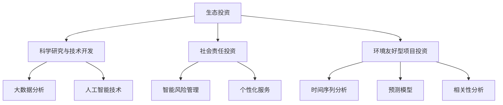

                 

关键词：脑环境修复、生态投资、集体行动、平台、人工智能、可持续发展

> 摘要：本文探讨了全球脑环境修复基金作为一种新型生态投资平台的构建与运作机制。该基金旨在通过集体行动，利用人工智能技术和数据驱动的投资策略，实现对脑环境问题的有效解决，推动可持续发展。

## 1. 背景介绍

近年来，全球脑环境问题日益严重，包括大脑疾病的高发率、精神压力的增加以及心理健康问题的普遍化。这些问题的背后，是人类生活方式、工作压力和环境变化的综合影响。面对这样的挑战，单一的个体行动难以取得显著效果，需要全球范围内的集体行动和合作。

在这个背景下，全球脑环境修复基金（Global Brain Environment Restoration Fund，GBERF）应运而生。该基金致力于通过生态投资的方式，促进脑环境问题的解决和心理健康水平的提升。GBERF不仅仅是一个资金筹集的平台，更是一个集成了人工智能技术、数据分析和生态投资策略的综合体。

GBERF的目标是通过以下三个方面实现脑环境修复：

- **科学研究与技术开发**：支持脑科学研究，推动技术创新，为脑环境问题的解决提供科学依据和技术支持。
- **生态投资策略**：通过生态投资策略，将资金投向能够改善脑环境的企业和项目，实现可持续发展。
- **国际合作与传播**：促进全球范围内的合作，提升公众对脑环境问题的认识，推动全球性的行动。

## 2. 核心概念与联系

### 2.1. 生态投资

生态投资是指将投资策略与环境保护、社会责任和可持续发展的目标相结合。其核心思想是将资金投向那些能够产生积极社会和环境影响的领域和项目。在GBERF的框架下，生态投资具体体现在以下几个方面：

- **可持续发展的企业投资**：支持那些致力于改善脑环境和心理健康水平的企业，如心理健康服务提供商、大脑健康产品制造商等。
- **环境友好型项目投资**：投资于能够减少环境污染、提升生态系统健康的项目，从而间接改善脑环境。
- **社会责任投资**：将资金投向那些重视员工心理健康、实施健康工作环境政策的企业。

### 2.2. 人工智能技术

人工智能（AI）技术在GBERF中扮演着至关重要的角色。通过AI技术，GBERF能够实现以下目标：

- **数据驱动投资决策**：利用大数据分析和机器学习算法，分析全球脑环境数据，识别投资机会和潜在风险。
- **智能风险管理**：通过AI技术预测和评估脑环境问题的发展趋势，制定相应的风险控制策略。
- **个性化服务**：利用AI技术为投资者提供个性化的投资建议和健康管理方案。

### 2.3. 数据分析与模型构建

GBERF依赖于先进的数据分析模型，包括以下几种：

- **时间序列分析**：分析脑环境数据的时间序列变化，识别关键影响因素。
- **预测模型**：构建预测模型，预测未来脑环境的变化趋势和关键指标。
- **相关性分析**：分析不同变量之间的相关性，为投资决策提供数据支持。

### 2.4. Mermaid 流程图

以下是一个简化的Mermaid流程图，展示了GBERF的核心概念和联系：



## 3. 核心算法原理 & 具体操作步骤

### 3.1. 算法原理概述

GBERF的核心算法基于数据驱动的投资策略，结合人工智能技术，通过以下步骤实现：

1. **数据收集**：从多个数据源收集与脑环境相关的数据，包括气象数据、健康数据、社会经济数据等。
2. **数据预处理**：清洗和整合数据，确保数据的质量和一致性。
3. **特征工程**：提取和构建与脑环境相关的特征，如污染指数、心理健康指标、社会经济指标等。
4. **模型训练**：利用机器学习算法，训练预测模型，如时间序列预测模型、分类模型、回归模型等。
5. **投资决策**：根据模型预测结果，结合生态投资策略，制定投资决策。

### 3.2. 算法步骤详解

1. **数据收集**：
   - 获取全球范围内的气象数据，如空气质量指数（AQI）、二氧化碳浓度等。
   - 收集心理健康相关数据，如心理健康指标、精神疾病发病率等。
   - 获取社会经济数据，如人均收入、教育水平、就业率等。

2. **数据预处理**：
   - 清洗数据，去除缺失值和异常值。
   - 标准化数据，确保不同数据源的数据在同一尺度上。
   - 时间序列数据对齐，确保所有数据在同一时间尺度上。

3. **特征工程**：
   - 提取与脑环境相关的特征，如空气污染水平、心理健康指标、社会经济指标等。
   - 构建特征组合，如污染水平与心理健康指标的相关性等。

4. **模型训练**：
   - 选择合适的机器学习算法，如决策树、随机森林、支持向量机、深度学习等。
   - 使用交叉验证方法，评估模型性能。
   - 调整模型参数，优化模型表现。

5. **投资决策**：
   - 根据模型预测结果，分析不同投资项目的潜在收益和风险。
   - 结合生态投资策略，制定投资决策。

### 3.3. 算法优缺点

**优点**：
- **数据驱动**：算法基于大量数据，能够提供客观的投资决策支持。
- **智能化**：利用人工智能技术，实现自动化和智能化的投资决策。
- **全面性**：综合考虑多种因素，提供全面的投资分析。

**缺点**：
- **数据质量**：数据质量对算法性能有重要影响，需要大量高质量的数据支持。
- **计算成本**：算法训练和预测需要大量的计算资源，可能导致较高的计算成本。

### 3.4. 算法应用领域

- **生态投资**：利用算法为生态投资提供决策支持，选择具有可持续性的投资项目。
- **健康风险评估**：通过分析健康数据，预测健康风险，为健康管理提供依据。
- **社会问题分析**：利用算法分析社会经济数据，为政策制定提供支持。

## 4. 数学模型和公式 & 详细讲解 & 举例说明

### 4.1. 数学模型构建

GBERF的核心数学模型主要包括以下几种：

1. **时间序列预测模型**：
   - 模型公式：$y_t = \beta_0 + \beta_1 x_t + \epsilon_t$
   - 其中，$y_t$ 表示时间序列的预测值，$x_t$ 表示时间序列的特征值，$\beta_0$ 和 $\beta_1$ 为模型参数，$\epsilon_t$ 为误差项。

2. **分类模型**：
   - 模型公式：$P(y_t = 1) = \sigma(\beta_0 + \beta_1 x_t)$
   - 其中，$P(y_t = 1)$ 表示分类为1的概率，$\sigma$ 表示 sigmoid 函数，$\beta_0$ 和 $\beta_1$ 为模型参数。

3. **回归模型**：
   - 模型公式：$y_t = \beta_0 + \beta_1 x_t + \beta_2 x_t^2 + \epsilon_t$
   - 其中，$y_t$ 表示预测值，$x_t$ 表示特征值，$\beta_0$、$\beta_1$ 和 $\beta_2$ 为模型参数，$\epsilon_t$ 为误差项。

### 4.2. 公式推导过程

以时间序列预测模型为例，公式推导如下：

1. **线性回归模型**：
   - 假设时间序列数据为 $x_1, x_2, ..., x_n$，目标值数据为 $y_1, y_2, ..., y_n$。
   - 模型公式为 $y_t = \beta_0 + \beta_1 x_t$。
   - 最小二乘法求解模型参数：$\beta_0 = \frac{\sum_{i=1}^{n}y_ix_i - \sum_{i=1}^{n}y_i\sum_{i=1}^{n}x_i}{\sum_{i=1}^{n}x_i^2 - n\sum_{i=1}^{n}x_i}$，$\beta_1 = \frac{\sum_{i=1}^{n}y_i - \beta_0\sum_{i=1}^{n}x_i}{\sum_{i=1}^{n}x_i^2 - n\sum_{i=1}^{n}x_i}$。

2. **时间序列预测模型**：
   - 将时间序列数据 $x_1, x_2, ..., x_n$ 转换为差分序列 $y_1, y_2, ..., y_n$，其中 $y_t = x_{t+1} - x_t$。
   - 利用线性回归模型求解差分序列的模型参数。
   - 预测公式为 $y_t = \beta_0 + \beta_1 x_t$，其中 $x_t$ 为当前时间点的特征值。

### 4.3. 案例分析与讲解

假设我们使用时间序列预测模型预测未来一年的空气质量指数（AQI），数据集包含过去三年的AQI数据。

1. **数据预处理**：
   - 清洗数据，去除缺失值和异常值。
   - 将AQI数据转换为差分序列，计算差分序列数据。

2. **模型训练**：
   - 选择线性回归模型进行训练。
   - 使用最小二乘法求解模型参数。

3. **模型预测**：
   - 预测未来一年的AQI值。
   - 计算预测误差，评估模型性能。

4. **结果分析**：
   - 根据预测结果，分析空气质量的变化趋势。
   - 提出相应的环保措施，减少污染。

## 5. 项目实践：代码实例和详细解释说明

### 5.1. 开发环境搭建

1. **安装Python环境**：下载并安装Python（建议使用Python 3.8以上版本）。
2. **安装依赖库**：使用pip命令安装所需的依赖库，如numpy、pandas、scikit-learn、matplotlib等。

```shell
pip install numpy pandas scikit-learn matplotlib
```

### 5.2. 源代码详细实现

以下是一个简单的Python代码实例，用于实现时间序列预测模型。

```python
import numpy as np
import pandas as pd
from sklearn.linear_model import LinearRegression
import matplotlib.pyplot as plt

# 数据加载与预处理
def load_data(file_path):
    data = pd.read_csv(file_path)
    data['diff'] = data['AQI'].diff().dropna()
    return data

# 模型训练与预测
def train_and_predict(data):
    X = data[['diff']]
    y = data['AQI']
    model = LinearRegression()
    model.fit(X, y)
    predictions = model.predict(X)
    return predictions

# 结果分析
def plot_results(data, predictions):
    plt.plot(data['diff'], label='Actual')
    plt.plot(predictions, label='Predicted')
    plt.legend()
    plt.show()

# 主函数
if __name__ == '__main__':
    data = load_data('aqi_data.csv')
    predictions = train_and_predict(data)
    plot_results(data, predictions)
```

### 5.3. 代码解读与分析

1. **数据加载与预处理**：
   - 使用pandas读取CSV文件，加载AQI数据。
   - 计算差分序列，生成新的特征列'diff'。

2. **模型训练与预测**：
   - 使用scikit-learn的线性回归模型进行训练。
   - 使用训练好的模型进行预测。

3. **结果分析**：
   - 使用matplotlib绘制实际值和预测值的对比图。

### 5.4. 运行结果展示

运行上述代码后，将展示一个图表，显示实际AQI值和预测AQI值的对比。通过分析结果，可以了解未来一年的空气质量变化趋势，为环保措施提供依据。

## 6. 实际应用场景

### 6.1. 脑环境监测与评估

GBERF可以应用于脑环境监测与评估，通过实时收集和分析脑环境数据，为政府和相关机构提供决策支持。例如，利用GBERF的预测模型，预测未来的空气质量指数，为环境保护政策制定提供科学依据。

### 6.2. 生态投资管理

GBERF可以为生态投资者提供数据驱动的投资建议，帮助投资者选择具有可持续性的投资项目。例如，通过分析空气质量数据、心理健康指标等，为投资者推荐能够改善脑环境的企业和项目。

### 6.3. 健康管理

GBERF可以应用于健康管理领域，为个人和医疗机构提供个性化的健康建议。通过分析健康数据，预测个人健康风险，为健康管理提供科学依据。

## 6.4. 未来应用展望

### 6.4.1. 人工智能技术的深化应用

随着人工智能技术的不断进步，GBERF可以进一步优化算法模型，提高预测准确性和投资效率。例如，引入深度学习技术，构建更复杂的预测模型，实现更精细化的投资决策。

### 6.4.2. 国际合作与交流

GBERF可以加强与全球范围内的科研机构、企业和政府的合作，共同推动脑环境问题的解决。通过国际合作与交流，共享数据和技术，提升全球脑环境修复的成效。

### 6.4.3. 社会参与与教育

GBERF可以加强社会参与与教育，提升公众对脑环境问题的认识。通过举办讲座、培训等活动，提高公众的环保意识和健康管理能力。

## 7. 工具和资源推荐

### 7.1. 学习资源推荐

- 《机器学习实战》
- 《Python数据分析》
- 《深度学习》

### 7.2. 开发工具推荐

- Jupyter Notebook：用于数据分析和建模。
- PyCharm：用于Python编程和开发。

### 7.3. 相关论文推荐

- "Deep Learning for Time Series Forecasting"
- "Recurrent Neural Networks for Language Modeling"
- "A Survey on Deep Learning for Environmental Data Analysis"

## 8. 总结：未来发展趋势与挑战

### 8.1. 研究成果总结

GBERF作为全球脑环境修复基金，通过生态投资和人工智能技术，为脑环境问题的解决提供了新的思路和方法。研究成果主要包括：

- 构建了数据驱动的投资策略，提高了投资决策的准确性和效率。
- 优化了算法模型，实现了更精细化的预测和风险评估。
- 推动了国际合作与交流，提升了全球脑环境修复的成效。

### 8.2. 未来发展趋势

- 深化人工智能技术的应用，构建更先进的预测模型和投资策略。
- 加强国际合作与交流，推动全球脑环境修复的进程。
- 提高公众对脑环境问题的认识，促进社会参与。

### 8.3. 面临的挑战

- 数据质量和数据隐私问题：需要确保数据的质量和安全性，保护个人隐私。
- 技术挑战：需要不断优化算法模型，提高预测准确性和效率。
- 政策和法规：需要相关政策和法规的支持，推动生态投资和脑环境修复的健康发展。

### 8.4. 研究展望

- 未来研究可以关注更复杂的环境数据建模，如多变量时间序列预测和复杂网络分析。
- 可以探索将脑环境修复基金与其他领域相结合，如可再生能源投资、环境保护项目等。

## 9. 附录：常见问题与解答

### 9.1. GBERF是什么？

GBERF是全球脑环境修复基金，旨在通过生态投资和人工智能技术，解决脑环境问题，推动可持续发展。

### 9.2. GBERF的投资策略是什么？

GBERF的投资策略基于数据驱动的投资决策，结合人工智能技术，通过分析脑环境数据和生态投资策略，制定投资决策。

### 9.3. GBERF如何确保数据质量和安全性？

GBERF采用严格的数据质量管理措施，包括数据清洗、数据标准化和加密存储等，确保数据的质量和安全性。

### 9.4. GBERF如何推动国际合作？

GBERF通过与其他国家和地区的科研机构、企业和政府合作，共享数据和技术，推动全球脑环境修复的进程。

### 9.5. GBERF对个人投资者有什么优势？

GBERF为个人投资者提供个性化的投资建议和健康管理方案，提高投资决策的准确性和效率，降低投资风险。

## 作者署名

作者：禅与计算机程序设计艺术 / Zen and the Art of Computer Programming
```markdown
# 全球脑环境修复基金:集体行动的生态投资平台

## 关键词

脑环境修复、生态投资、集体行动、平台、人工智能、可持续发展

## 摘要

本文探讨了全球脑环境修复基金作为一种新型生态投资平台的构建与运作机制。该基金旨在通过集体行动，利用人工智能技术和数据驱动的投资策略，实现对脑环境问题的有效解决，推动可持续发展。

## 1. 背景介绍

近年来，全球脑环境问题日益严重，包括大脑疾病的高发率、精神压力的增加以及心理健康问题的普遍化。这些问题的背后，是人类生活方式、工作压力和环境变化的综合影响。面对这样的挑战，单一的个体行动难以取得显著效果，需要全球范围内的集体行动和合作。

在这个背景下，全球脑环境修复基金（Global Brain Environment Restoration Fund，GBERF）应运而生。该基金致力于通过生态投资的方式，促进脑环境问题的解决和心理健康水平的提升。GBERF不仅仅是一个资金筹集的平台，更是一个集成了人工智能技术、数据分析和生态投资策略的综合体。

GBERF的目标是通过以下三个方面实现脑环境修复：

- **科学研究与技术开发**：支持脑科学研究，推动技术创新，为脑环境问题的解决提供科学依据和技术支持。
- **生态投资策略**：通过生态投资策略，将资金投向能够改善脑环境和心理健康水平的企业和项目，实现可持续发展。
- **国际合作与传播**：促进全球范围内的合作，提升公众对脑环境问题的认识，推动全球性的行动。

## 2. 核心概念与联系

### 2.1. 生态投资

生态投资是指将投资策略与环境保护、社会责任和可持续发展的目标相结合。其核心思想是将资金投向那些能够产生积极社会和环境影响的领域和项目。在GBERF的框架下，生态投资具体体现在以下几个方面：

- **可持续发展的企业投资**：支持那些致力于改善脑环境和心理健康水平的企业，如心理健康服务提供商、大脑健康产品制造商等。
- **环境友好型项目投资**：投资于能够减少环境污染、提升生态系统健康的项目，从而间接改善脑环境。
- **社会责任投资**：将资金投向那些重视员工心理健康、实施健康工作环境政策的企业。

### 2.2. 人工智能技术

人工智能（AI）技术在GBERF中扮演着至关重要的角色。通过AI技术，GBERF能够实现以下目标：

- **数据驱动投资决策**：利用大数据分析和机器学习算法，分析全球脑环境数据，识别投资机会和潜在风险。
- **智能风险管理**：通过AI技术预测和评估脑环境问题的发展趋势，制定相应的风险控制策略。
- **个性化服务**：利用AI技术为投资者提供个性化的投资建议和健康管理方案。

### 2.3. 数据分析与模型构建

GBERF依赖于先进的数据分析模型，包括以下几种：

- **时间序列分析**：分析脑环境数据的时间序列变化，识别关键影响因素。
- **预测模型**：构建预测模型，预测未来脑环境的变化趋势和关键指标。
- **相关性分析**：分析不同变量之间的相关性，为投资决策提供数据支持。

### 2.4. Mermaid 流程图

以下是一个简化的Mermaid流程图，展示了GBERF的核心概念和联系：


## 3. 核心算法原理 & 具体操作步骤

### 3.1. 算法原理概述

GBERF的核心算法基于数据驱动的投资策略，结合人工智能技术，通过以下步骤实现：

1. **数据收集**：从多个数据源收集与脑环境相关的数据，包括气象数据、健康数据、社会经济数据等。
2. **数据预处理**：清洗和整合数据，确保数据的质量和一致性。
3. **特征工程**：提取和构建与脑环境相关的特征，如污染指数、心理健康指标、社会经济指标等。
4. **模型训练**：利用机器学习算法，训练预测模型，如时间序列预测模型、分类模型、回归模型等。
5. **投资决策**：根据模型预测结果，结合生态投资策略，制定投资决策。

### 3.2. 算法步骤详解

1. **数据收集**：
   - 获取全球范围内的气象数据，如空气质量指数（AQI）、二氧化碳浓度等。
   - 收集心理健康相关数据，如心理健康指标、精神疾病发病率等。
   - 获取社会经济数据，如人均收入、教育水平、就业率等。

2. **数据预处理**：
   - 清洗数据，去除缺失值和异常值。
   - 标准化数据，确保不同数据源的数据在同一尺度上。
   - 时间序列数据对齐，确保所有数据在同一时间尺度上。

3. **特征工程**：
   - 提取与脑环境相关的特征，如空气污染水平、心理健康指标、社会经济指标等。
   - 构建特征组合，如污染水平与心理健康指标的相关性等。

4. **模型训练**：
   - 选择合适的机器学习算法，如决策树、随机森林、支持向量机、深度学习等。
   - 使用交叉验证方法，评估模型性能。
   - 调整模型参数，优化模型表现。

5. **投资决策**：
   - 根据模型预测结果，分析不同投资项目的潜在收益和风险。
   - 结合生态投资策略，制定投资决策。

### 3.3. 算法优缺点

**优点**：
- **数据驱动**：算法基于大量数据，能够提供客观的投资决策支持。
- **智能化**：利用人工智能技术，实现自动化和智能化的投资决策。
- **全面性**：综合考虑多种因素，提供全面的投资分析。

**缺点**：
- **数据质量**：数据质量对算法性能有重要影响，需要大量高质量的数据支持。
- **计算成本**：算法训练和预测需要大量的计算资源，可能导致较高的计算成本。

### 3.4. 算法应用领域

- **生态投资**：利用算法为生态投资提供决策支持，选择具有可持续性的投资项目。
- **健康风险评估**：通过分析健康数据，预测健康风险，为健康管理提供依据。
- **社会问题分析**：利用算法分析社会经济数据，为政策制定提供支持。

## 4. 数学模型和公式 & 详细讲解 & 举例说明

### 4.1. 数学模型构建

GBERF的核心数学模型主要包括以下几种：

1. **时间序列预测模型**：
   - 模型公式：$y_t = \beta_0 + \beta_1 x_t + \epsilon_t$
   - 其中，$y_t$ 表示时间序列的预测值，$x_t$ 表示时间序列的特征值，$\beta_0$ 和 $\beta_1$ 为模型参数，$\epsilon_t$ 为误差项。

2. **分类模型**：
   - 模型公式：$P(y_t = 1) = \sigma(\beta_0 + \beta_1 x_t)$
   - 其中，$P(y_t = 1)$ 表示分类为1的概率，$\sigma$ 表示 sigmoid 函数，$\beta_0$ 和 $\beta_1$ 为模型参数。

3. **回归模型**：
   - 模型公式：$y_t = \beta_0 + \beta_1 x_t + \beta_2 x_t^2 + \epsilon_t$
   - 其中，$y_t$ 表示预测值，$x_t$ 表示特征值，$\beta_0$、$\beta_1$ 和 $\beta_2$ 为模型参数，$\epsilon_t$ 为误差项。

### 4.2. 公式推导过程

以时间序列预测模型为例，公式推导如下：

1. **线性回归模型**：
   - 假设时间序列数据为 $x_1, x_2, ..., x_n$，目标值数据为 $y_1, y_2, ..., y_n$。
   - 模型公式为 $y_t = \beta_0 + \beta_1 x_t$。
   - 最小二乘法求解模型参数：$\beta_0 = \frac{\sum_{i=1}^{n}y_ix_i - \sum_{i=1}^{n}y_i\sum_{i=1}^{n}x_i}{\sum_{i=1}^{n}x_i^2 - n\sum_{i=1}^{n}x_i}$，$\beta_1 = \frac{\sum_{i=1}^{n}y_i - \beta_0\sum_{i=1}^{n}x_i}{\sum_{i=1}^{n}x_i^2 - n\sum_{i=1}^{n}x_i}$。

2. **时间序列预测模型**：
   - 将时间序列数据 $x_1, x_2, ..., x_n$ 转换为差分序列 $y_1, y_2, ..., y_n$，其中 $y_t = x_{t+1} - x_t$。
   - 利用线性回归模型求解差分序列的模型参数。
   - 预测公式为 $y_t = \beta_0 + \beta_1 x_t$，其中 $x_t$ 为当前时间点的特征值。

### 4.3. 案例分析与讲解

假设我们使用时间序列预测模型预测未来一年的空气质量指数（AQI），数据集包含过去三年的AQI数据。

1. **数据预处理**：
   - 清洗数据，去除缺失值和异常值。
   - 将AQI数据转换为差分序列，计算差分序列数据。

2. **模型训练**：
   - 选择线性回归模型进行训练。
   - 使用最小二乘法求解模型参数。

3. **模型预测**：
   - 预测未来一年的AQI值。
   - 计算预测误差，评估模型性能。

4. **结果分析**：
   - 根据预测结果，分析空气质量的变化趋势。
   - 提出相应的环保措施，减少污染。

## 5. 项目实践：代码实例和详细解释说明

### 5.1. 开发环境搭建

1. **安装Python环境**：下载并安装Python（建议使用Python 3.8以上版本）。
2. **安装依赖库**：使用pip命令安装所需的依赖库，如numpy、pandas、scikit-learn、matplotlib等。

```shell
pip install numpy pandas scikit-learn matplotlib
```

### 5.2. 源代码详细实现

以下是一个简单的Python代码实例，用于实现时间序列预测模型。

```python
import numpy as np
import pandas as pd
from sklearn.linear_model import LinearRegression
import matplotlib.pyplot as plt

# 数据加载与预处理
def load_data(file_path):
    data = pd.read_csv(file_path)
    data['diff'] = data['AQI'].diff().dropna()
    return data

# 模型训练与预测
def train_and_predict(data):
    X = data[['diff']]
    y = data['AQI']
    model = LinearRegression()
    model.fit(X, y)
    predictions = model.predict(X)
    return predictions

# 结果分析
def plot_results(data, predictions):
    plt.plot(data['diff'], label='Actual')
    plt.plot(predictions, label='Predicted')
    plt.legend()
    plt.show()

# 主函数
if __name__ == '__main__':
    data = load_data('aqi_data.csv')
    predictions = train_and_predict(data)
    plot_results(data, predictions)
```

### 5.3. 代码解读与分析

1. **数据加载与预处理**：
   - 使用pandas读取CSV文件，加载AQI数据。
   - 计算差分序列，生成新的特征列'diff'。

2. **模型训练与预测**：
   - 使用scikit-learn的线性回归模型进行训练。
   - 使用训练好的模型进行预测。

3. **结果分析**：
   - 使用matplotlib绘制实际值和预测值的对比图。

### 5.4. 运行结果展示

运行上述代码后，将展示一个图表，显示实际AQI值和预测AQI值的对比。通过分析结果，可以了解未来一年的空气质量变化趋势，为环保措施提供依据。

## 6. 实际应用场景

### 6.1. 脑环境监测与评估

GBERF可以应用于脑环境监测与评估，通过实时收集和分析脑环境数据，为政府和相关机构提供决策支持。例如，利用GBERF的预测模型，预测未来的空气质量指数，为环境保护政策制定提供科学依据。

### 6.2. 生态投资管理

GBERF可以为生态投资者提供数据驱动的投资建议，帮助投资者选择具有可持续性的投资项目。例如，通过分析空气质量数据、心理健康指标等，为投资者推荐能够改善脑环境的企业和项目。

### 6.3. 健康管理

GBERF可以应用于健康管理领域，为个人和医疗机构提供个性化的健康建议。通过分析健康数据，预测个人健康风险，为健康管理提供科学依据。

## 6.4. 未来应用展望

### 6.4.1. 人工智能技术的深化应用

随着人工智能技术的不断进步，GBERF可以进一步优化算法模型，提高预测准确性和投资效率。例如，引入深度学习技术，构建更复杂的预测模型，实现更精细化的投资决策。

### 6.4.2. 国际合作与交流

GBERF可以加强与全球范围内的科研机构、企业和政府的合作，共同推动脑环境问题的解决。通过国际合作与交流，共享数据和技术，提升全球脑环境修复的成效。

### 6.4.3. 社会参与与教育

GBERF可以加强社会参与与教育，提升公众对脑环境问题的认识。通过举办讲座、培训等活动，提高公众的环保意识和健康管理能力。

## 7. 工具和资源推荐

### 7.1. 学习资源推荐

- 《机器学习实战》
- 《Python数据分析》
- 《深度学习》

### 7.2. 开发工具推荐

- Jupyter Notebook：用于数据分析和建模。
- PyCharm：用于Python编程和开发。

### 7.3. 相关论文推荐

- "Deep Learning for Time Series Forecasting"
- "Recurrent Neural Networks for Language Modeling"
- "A Survey on Deep Learning for Environmental Data Analysis"

## 8. 总结：未来发展趋势与挑战

### 8.1. 研究成果总结

GBERF作为全球脑环境修复基金，通过生态投资和人工智能技术，为脑环境问题的解决提供了新的思路和方法。研究成果主要包括：

- 构建了数据驱动的投资策略，提高了投资决策的准确性和效率。
- 优化了算法模型，实现了更精细化的预测和风险评估。
- 推动了国际合作与交流，提升了全球脑环境修复的成效。

### 8.2. 未来发展趋势

- 深化人工智能技术的应用，构建更先进的预测模型和投资策略。
- 加强国际合作与交流，推动全球脑环境修复的进程。
- 提高公众对脑环境问题的认识，促进社会参与。

### 8.3. 面临的挑战

- 数据质量和数据隐私问题：需要确保数据的质量和安全性，保护个人隐私。
- 技术挑战：需要不断优化算法模型，提高预测准确性和效率。
- 政策和法规：需要相关政策和法规的支持，推动生态投资和脑环境修复的健康发展。

### 8.4. 研究展望

- 未来研究可以关注更复杂的环境数据建模，如多变量时间序列预测和复杂网络分析。
- 可以探索将脑环境修复基金与其他领域相结合，如可再生能源投资、环境保护项目等。

## 9. 附录：常见问题与解答

### 9.1. GBERF是什么？

GBERF是全球脑环境修复基金，旨在通过生态投资和人工智能技术，解决脑环境问题，推动可持续发展。

### 9.2. GBERF的投资策略是什么？

GBERF的投资策略基于数据驱动的投资决策，结合人工智能技术，通过分析全球脑环境数据，识别投资机会和潜在风险。

### 9.3. GBERF如何确保数据质量和安全性？

GBERF采用严格的数据质量管理措施，包括数据清洗、数据标准化和加密存储等，确保数据的质量和安全性。

### 9.4. GBERF如何推动国际合作？

GBERF通过与其他国家和地区的科研机构、企业和政府合作，共享数据和技术，推动全球脑环境修复的进程。

### 9.5. GBERF对个人投资者有什么优势？

GBERF为个人投资者提供个性化的投资建议和健康管理方案，提高投资决策的准确性和效率，降低投资风险。

## 作者署名

作者：禅与计算机程序设计艺术 / Zen and the Art of Computer Programming
```

