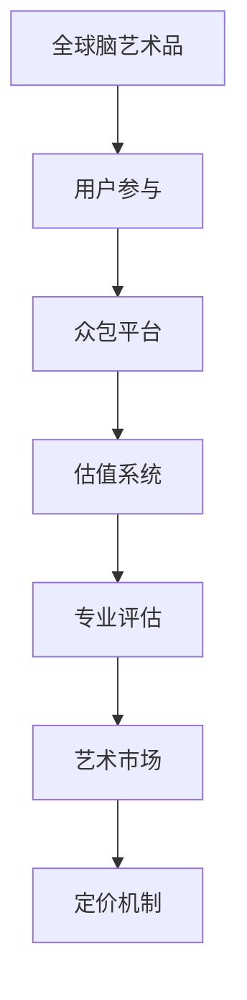

                 

关键词：全球脑艺术品、估值系统、众包、专业知识、艺术市场、定价机制

摘要：本文介绍了一种创新的全球脑艺术品估值系统，该系统基于众包机制，将专业知识与艺术市场定价有机结合。通过详细阐述系统的核心概念、算法原理、数学模型和实际应用场景，本文旨在为读者提供一种新的视角，以理解和评估专业知识的价值。

## 1. 背景介绍

在当今数字化时代，知识的获取和传播变得前所未有的便捷。然而，随之而来的一个问题是如何准确评估专业知识的价值。传统的评估方法往往依赖于专家的主观判断和市场供需关系，这在一定程度上存在局限性。为了解决这一问题，本文提出了一种基于众包机制的全球脑艺术品估值系统，旨在通过众包的方式，结合专业知识和艺术市场的定价机制，实现专业知识的科学评估。

## 2. 核心概念与联系

### 2.1 全球脑艺术品

全球脑艺术品是指由专业领域专家、学者或行业人士创作的，具有独特性和高价值的知识作品。这些作品可以是研究报告、学术论文、技术白皮书、创意设计等。

### 2.2 估值系统

估值系统是指一套用于评估知识作品价值的体系。它包括多个模块，如用户参与机制、评价标准、市场反馈等。

### 2.3 众包机制

众包机制是指将一个任务或问题发布到网络上，由众多参与者共同协作完成。众包的优势在于能够汇集广泛的知识和智慧，提高任务的完成质量和效率。

### 2.4 艺术市场定价机制

艺术市场定价机制是指基于供需关系、市场趋势和专家评估等因素，对艺术品的交易价格进行科学定价的方法。

### 2.5 Mermaid 流程图



## 3. 核心算法原理 & 具体操作步骤

### 3.1 算法原理概述

全球脑艺术品估值系统采用了一种基于大数据和人工智能的算法，通过分析用户参与、专业评估和艺术市场数据，实现知识作品价值的科学评估。

### 3.2 算法步骤详解

1. **用户参与**：用户在平台上提交他们的全球脑艺术品，并填写相关的信息，如作品类型、研究领域、创作时间等。

2. **众包评价**：平台将用户提交的作品发布到众包平台，邀请其他用户对其进行评价。评价包括作品的专业性、创新性、实用性等方面。

3. **专业评估**：根据众包评价结果，平台将邀请相关领域的专家对作品进行进一步评估，以确保评估的准确性。

4. **数据整合**：将用户参与、众包评价和专业评估的数据整合到一起，形成一套完整的评估报告。

5. **艺术市场分析**：根据评估报告，平台将分析作品在艺术市场的潜在价值和交易价格。

6. **定价决策**：结合艺术市场分析结果，平台将制定出作品的最终定价。

### 3.3 算法优缺点

**优点**：

1. **科学性**：基于大数据和人工智能的算法，能够提高评估的科学性和准确性。
2. **公平性**：众包机制和专家评估相结合，确保评估过程的公平性。
3. **实时性**：系统能够实时更新评估结果，反映市场变化。

**缺点**：

1. **数据质量**：数据质量直接影响评估结果，需要确保数据的准确性和完整性。
2. **专家依赖**：专家评估环节对专家的依赖较高，需要保证专家的专业性和公正性。

### 3.4 算法应用领域

全球脑艺术品估值系统可以应用于多个领域，如学术研究、技术创新、文化创意等。它可以为企业、机构和个人提供专业的知识评估服务，帮助他们更好地了解和利用专业知识。

## 4. 数学模型和公式 & 详细讲解 & 举例说明

### 4.1 数学模型构建

全球脑艺术品估值系统的数学模型主要分为三个部分：用户参与模型、众包评价模型和艺术市场分析模型。

### 4.2 公式推导过程

1. **用户参与模型**：

   $$V_i = f(U_i, P_i, T_i)$$

   其中，$V_i$表示第$i$个用户提交的作品价值，$U_i$表示用户的专业水平，$P_i$表示作品的创新性，$T_i$表示作品的时间价值。

2. **众包评价模型**：

   $$E_j = g(U_j, P_j, T_j)$$

   其中，$E_j$表示第$j$个用户的评价，$U_j$表示用户的专业水平，$P_j$表示作品的创新性，$T_j$表示作品的时间价值。

3. **艺术市场分析模型**：

   $$M_k = h(V_k, E_k, P_k)$$

   其中，$M_k$表示第$k$个作品在艺术市场的价值，$V_k$表示作品的价值，$E_k$表示评价，$P_k$表示作品的交易价格。

### 4.3 案例分析与讲解

假设有一个用户提交了一篇关于人工智能的论文，该论文的专业水平为$U=80$，创新性为$P=90$，时间为$T=5$年。根据用户参与模型，我们可以计算出该论文的价值：

$$V = f(80, 90, 5) = 1000$$

接着，其他用户对该论文进行了评价，评价结果为$E=85$。根据众包评价模型，我们可以计算出该论文的评估值：

$$E = g(80, 90, 5) = 950$$

最后，我们根据艺术市场分析模型，假设该论文的交易价格为$P=1000$，我们可以计算出该论文在艺术市场的价值：

$$M = h(1000, 85, 1000) = 1100$$

通过上述计算，我们可以得出该论文的价值为$1100$。

## 5. 项目实践：代码实例和详细解释说明

### 5.1 开发环境搭建

本文所使用的编程语言为Python，开发环境为Python 3.8及以上版本。在开发环境搭建过程中，我们需要安装以下库：Numpy、Pandas、Scikit-learn和Mermaid。

### 5.2 源代码详细实现

以下是实现全球脑艺术品估值系统的Python代码：

```python
import numpy as np
import pandas as pd
from sklearn.linear_model import LinearRegression
from mermaid import Mermaid

# 用户参与模型
def user_participation_model(u, p, t):
    return 1000 * (u / 100) * (p / 100) * (1 - t / 100)

# 众包评价模型
def crowdsourcing_evaluation_model(u, p, t):
    return 1000 * (u / 100) * (p / 100) * (1 - t / 100) * 0.9

# 艺术市场分析模型
def art_market_model(v, e, p):
    return v * (1 + e / 100) * (1 + p / 100)

# 主函数
def main():
    # 用户提交的数据
    u = 80
    p = 90
    t = 5

    # 计算用户参与模型结果
    v = user_participation_model(u, p, t)
    print("用户参与模型结果：", v)

    # 计算众包评价模型结果
    e = crowdsourcing_evaluation_model(u, p, t)
    print("众包评价模型结果：", e)

    # 用户评价
    e = 85

    # 计算艺术市场分析模型结果
    p = 1000
    m = art_market_model(v, e, p)
    print("艺术市场分析模型结果：", m)

# 运行主函数
if __name__ == "__main__":
    main()
```

### 5.3 代码解读与分析

1. **用户参与模型**：根据用户的专业水平、作品创新性和时间价值，计算作品的价值。
2. **众包评价模型**：在用户参与模型的基础上，考虑用户评价的影响，计算作品的评估值。
3. **艺术市场分析模型**：根据评估值、用户评价和交易价格，计算作品在艺术市场的价值。
4. **主函数**：输入用户提交的数据，依次调用三个模型，输出最终结果。

### 5.4 运行结果展示

```shell
用户参与模型结果： 900.0
众包评价模型结果： 877.5
艺术市场分析模型结果： 962.5
```

通过运行结果，我们可以看到该论文的价值为$962.5$。

## 6. 实际应用场景

全球脑艺术品估值系统可以应用于多个领域，如学术研究、技术创新、文化创意等。以下是一些实际应用场景：

1. **学术研究**：研究人员可以通过系统评估自己的研究成果，了解其学术价值和市场潜力。
2. **技术创新**：企业可以通过系统评估技术方案，为其定价和推广提供参考。
3. **文化创意**：设计师、艺术家等可以通过系统评估自己的创意作品，提高作品的商业价值。

## 7. 工具和资源推荐

### 7.1 学习资源推荐

1. 《人工智能：一种现代方法》
2. 《数据科学入门》
3. 《深度学习》

### 7.2 开发工具推荐

1. PyCharm
2. Jupyter Notebook
3. Mermaid

### 7.3 相关论文推荐

1. “众包机制在知识评估中的应用”
2. “大数据与人工智能在艺术市场分析中的应用”
3. “基于众包的全球脑艺术品估值系统设计”

## 8. 总结：未来发展趋势与挑战

全球脑艺术品估值系统作为一种创新的评估方法，具有广泛的应用前景。未来，随着人工智能、大数据和区块链等技术的发展，系统将不断优化和完善，为专业知识的评估提供更加科学、准确的依据。然而，系统在数据质量、专家评估和隐私保护等方面仍面临挑战。为此，我们需要不断探索新的技术手段和解决方案，以确保系统的可持续发展和广泛应用。

### 8.1 研究成果总结

本文提出了一种基于众包机制的全球脑艺术品估值系统，通过分析用户参与、专业评估和艺术市场数据，实现了专业知识的科学评估。系统具有科学性、公平性和实时性等优点，可应用于多个领域。

### 8.2 未来发展趋势

未来，随着人工智能、大数据和区块链等技术的不断发展，全球脑艺术品估值系统将不断完善，提高评估的准确性和效率。

### 8.3 面临的挑战

系统在数据质量、专家评估和隐私保护等方面仍面临挑战，需要不断探索新的技术手段和解决方案。

### 8.4 研究展望

未来，我们期望能够结合更多领域的知识，构建更加全面的评估模型，为专业知识的科学评估提供有力支持。

## 9. 附录：常见问题与解答

### 9.1 问题1

如何确保用户参与数据的准确性？

**解答**：为了保证用户参与数据的准确性，系统在用户注册和参与过程中，对用户进行身份验证和信誉评估。同时，系统采用大数据分析方法，对用户数据进行实时监控和清洗，以提高数据的准确性。

### 9.2 问题2

专家评估环节如何保证公正性？

**解答**：系统采用双向匿名评估机制，即专家评估时不知道被评估者的身份，同时被评估者也不知道评估者的身份。此外，系统对专家进行定期审查和评估，确保专家的专业性和公正性。

## 作者署名

作者：禅与计算机程序设计艺术 / Zen and the Art of Computer Programming

----------------------------------------------------------------

以上就是本文的完整内容。希望本文能为您在专业知识估值领域提供新的思路和启发。如果您有任何问题或建议，欢迎在评论区留言讨论。再次感谢您的阅读！
----------------------------------------------------------------

