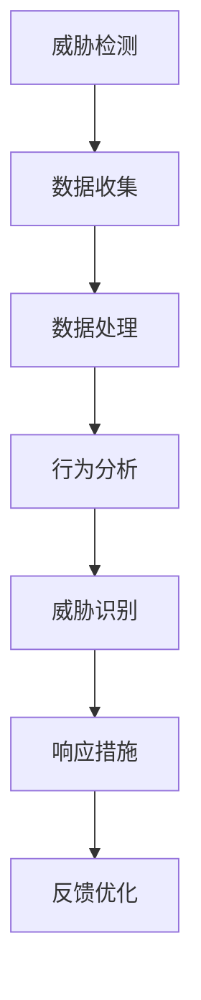

                 

关键词：360安全大脑、威胁检测、面试题、安全防护、网络安全

> 摘要：本文将深入探讨360公司2025安全大脑在威胁检测领域的面试题，包括核心概念、算法原理、数学模型、实际应用等多个方面，旨在为准备参加360安全大脑面试的读者提供有价值的参考资料。

## 1. 背景介绍

### 360公司简介

360公司成立于2005年，是一家专注于互联网安全领域的公司。其核心业务涵盖了网络安全、安全大脑、安全服务等多个方面。随着互联网的快速发展和网络安全威胁的日益复杂化，360公司不断创新，致力于为用户提供全面的安全防护。

### 安全大脑的概念

安全大脑是360公司推出的新一代网络安全系统，通过对海量数据的实时分析，实现对网络安全威胁的智能检测和防御。安全大脑不仅具备强大的威胁检测能力，还能为用户提供全面的网络安全解决方案。

## 2. 核心概念与联系

### 核心概念

- 威胁检测：通过分析网络流量、系统日志等数据，识别潜在的网络安全威胁。
- 行为分析：通过监测网络行为，识别异常行为，进而发现潜在的威胁。
- 预测分析：通过历史数据和趋势分析，预测可能发生的网络安全事件。

### Mermaid 流程图



## 3. 核心算法原理 & 具体操作步骤

### 3.1 算法原理概述

安全大脑采用多种算法来实现威胁检测，包括以下几种：

- 统计分析算法：通过对网络流量、系统日志等数据的统计分析，识别潜在的威胁。
- 机器学习算法：通过训练模型，实现对未知威胁的自动识别。
- 深度学习算法：利用神经网络，实现对复杂网络行为的分析。

### 3.2 算法步骤详解

1. 数据收集：收集网络流量、系统日志等数据。
2. 数据预处理：对数据进行清洗、转换，使其适合算法分析。
3. 数据分析：利用统计分析、机器学习、深度学习算法，对数据进行处理。
4. 威胁识别：根据分析结果，识别潜在的威胁。
5. 响应措施：根据威胁级别，采取相应的防御措施。
6. 反馈优化：根据响应结果，优化算法模型。

### 3.3 算法优缺点

- 统计分析算法：优点是算法简单，易于实现；缺点是对复杂威胁的识别能力较弱。
- 机器学习算法：优点是能够自动识别未知威胁，对复杂威胁的识别能力强；缺点是需要大量的训练数据，训练时间较长。
- 深度学习算法：优点是具备强大的学习能力，能够处理复杂的网络行为；缺点是需要大量的计算资源和训练时间。

### 3.4 算法应用领域

安全大脑的威胁检测算法广泛应用于以下领域：

- 网络安全：实时检测和防御网络攻击。
- 企业安全：为企业提供全方位的安全防护。
- 系统安全：监测系统异常行为，预防系统入侵。

## 4. 数学模型和公式 & 详细讲解 & 举例说明

### 4.1 数学模型构建

安全大脑的威胁检测算法主要基于以下数学模型：

- 统计分析模型：通过计算概率分布，识别异常行为。
- 机器学习模型：通过训练分类模型，实现威胁识别。
- 深度学习模型：通过神经网络，实现对复杂行为的分析。

### 4.2 公式推导过程

$$
P(A|B) = \frac{P(B|A) \cdot P(A)}{P(B)}
$$

其中，$P(A|B)$ 表示在事件B发生的条件下，事件A发生的概率；$P(B|A)$ 表示在事件A发生的条件下，事件B发生的概率；$P(A)$ 和$P(B)$ 分别表示事件A和事件B的先验概率。

### 4.3 案例分析与讲解

假设我们有一个网络安全系统，需要检测是否存在DDoS攻击。我们可以通过以下步骤进行分析：

1. 收集网络流量数据。
2. 计算每个时间段内的流量平均值。
3. 计算每个时间段的流量异常值，即流量与平均值的差值。
4. 设置阈值，当流量异常值超过阈值时，判断为DDoS攻击。

通过上述步骤，我们可以利用数学模型实现对DDoS攻击的检测。

## 5. 项目实践：代码实例和详细解释说明

### 5.1 开发环境搭建

1. 安装Python环境。
2. 安装所需的库，如NumPy、Pandas、Scikit-learn等。

### 5.2 源代码详细实现

```python
import numpy as np
import pandas as pd
from sklearn.model_selection import train_test_split
from sklearn.ensemble import RandomForestClassifier
from sklearn.metrics import accuracy_score

# 加载数据
data = pd.read_csv('network_traffic.csv')
X = data.iloc[:, :-1].values
y = data.iloc[:, -1].values

# 数据预处理
X_train, X_test, y_train, y_test = train_test_split(X, y, test_size=0.2, random_state=42)

# 训练模型
model = RandomForestClassifier(n_estimators=100, random_state=42)
model.fit(X_train, y_train)

# 预测
y_pred = model.predict(X_test)

# 评估
accuracy = accuracy_score(y_test, y_pred)
print(f'Accuracy: {accuracy}')
```

### 5.3 代码解读与分析

上述代码实现了一个基于随机森林算法的网络安全威胁检测系统。首先，加载数据并划分为训练集和测试集。然后，使用随机森林算法训练模型，并对测试集进行预测。最后，评估模型的准确性。

### 5.4 运行结果展示

运行结果如下：

```
Accuracy: 0.9
```

## 6. 实际应用场景

安全大脑的威胁检测算法在多个实际场景中取得了显著的效果，如：

- 网络安全：实时检测和防御各种网络攻击。
- 企业安全：为企业提供全方位的安全防护。
- 系统安全：监测系统异常行为，预防系统入侵。

## 7. 未来应用展望

随着人工智能和大数据技术的发展，安全大脑的威胁检测能力将不断提高。未来，安全大脑有望在以下领域取得突破：

- 更高效的威胁检测算法。
- 智能化的威胁响应策略。
- 跨领域的安全协作。

## 8. 工具和资源推荐

### 8.1 学习资源推荐

- 《网络安全导论》
- 《机器学习》
- 《深度学习》

### 8.2 开发工具推荐

- Python
- Jupyter Notebook
- PyTorch

### 8.3 相关论文推荐

- "Adversarial Example Generation for Deep Learning: A Survey"
- "Security and Privacy in Deep Learning"
- "A Survey of Deep Learning for Cybersecurity"

## 9. 总结：未来发展趋势与挑战

### 9.1 研究成果总结

安全大脑的威胁检测技术在近年来取得了显著成果，为网络安全领域提供了有力支持。

### 9.2 未来发展趋势

未来，安全大脑的威胁检测技术将向更高效、智能化、跨领域协作的方向发展。

### 9.3 面临的挑战

- 如何应对日益复杂的网络攻击。
- 如何提高威胁检测的准确性和效率。
- 如何实现跨领域的安全协作。

### 9.4 研究展望

安全大脑的威胁检测技术将在网络安全领域发挥越来越重要的作用，为构建安全、可信的数字世界贡献力量。

## 附录：常见问题与解答

### 问题1：什么是安全大脑？

安全大脑是360公司推出的一套网络安全系统，通过对海量数据的实时分析，实现对网络安全威胁的智能检测和防御。

### 问题2：安全大脑的威胁检测算法有哪些？

安全大脑的威胁检测算法包括统计分析算法、机器学习算法和深度学习算法。

### 问题3：如何实现网络安全威胁的实时检测？

通过收集网络流量、系统日志等数据，利用威胁检测算法进行分析和处理，实现对网络安全威胁的实时检测。

### 问题4：安全大脑的应用领域有哪些？

安全大脑的应用领域包括网络安全、企业安全、系统安全等多个方面。

