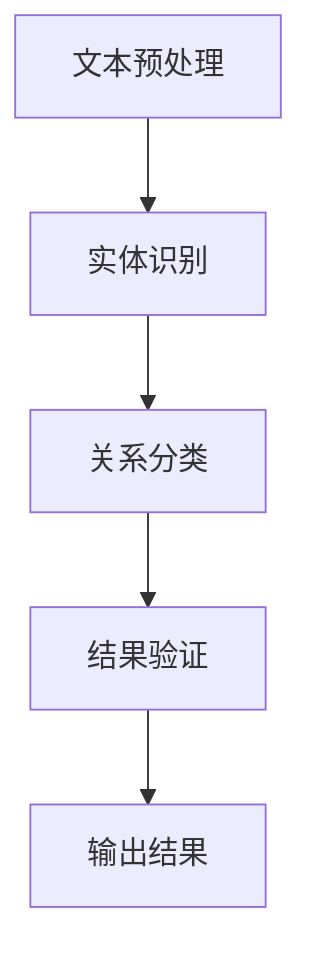

                 

 关键词：关系抽取，自然语言处理，文本分析，实体识别，知识图谱，数据挖掘，人工智能，机器学习，深度学习

> 摘要：本文深入探讨了关系抽取这一关键的自然语言处理任务，解释了其在构建知识图谱中的重要性。通过介绍核心概念、算法原理、数学模型和实际应用，本文旨在为读者提供一个全面的关系抽取指南。

## 1. 背景介绍

随着互联网的迅速发展，信息爆炸使得人们获取和处理信息的能力面临巨大挑战。传统的信息检索方法已经难以满足用户对信息深度理解和快速获取的需求。因此，将非结构化文本转换为结构化知识，以支持智能搜索、推荐系统和决策支持等应用，显得尤为重要。关系抽取（Relation Extraction）作为自然语言处理（Natural Language Processing，NLP）领域的一个重要任务，旨在从文本中识别出实体之间的关系，是构建知识图谱和数据挖掘的关键步骤。

关系抽取的背景可以追溯到知识图谱的兴起。知识图谱是一种结构化数据模型，通过实体和关系的网络形式来表示信息，使得计算机能够像人类一样理解和处理知识。在构建知识图谱的过程中，关系抽取扮演着至关重要的角色。通过从大量非结构化文本中提取出实体间的关系，可以大幅提升数据的有效利用和智能化水平。

本文将首先介绍关系抽取的核心概念，然后探讨其在自然语言处理中的重要性，并详细解析当前常用的关系抽取算法。此外，文章还将讨论关系抽取中的数学模型和公式，并通过具体案例进行分析。最后，我们将展示关系抽取的实际应用场景，并展望其未来发展方向。

## 2. 核心概念与联系

### 2.1 关系抽取的定义

关系抽取是指从自然语言文本中识别出实体之间的语义关系的过程。在关系抽取任务中，实体和关系是两个核心概念。实体（Entity）是指文本中具有独立意义的对象或概念，如人名、组织名、地理位置等。关系（Relation）则是指实体之间的语义关联，如“工作于”、“位于”等。

### 2.2 关系抽取的任务类型

关系抽取可以分为三种主要类型：

1. **实体对实体（Entity-Entity）**：识别两个实体之间的关系，如“比尔·盖茨是微软的创始人”。
2. **实体对属性（Entity-Attribute）**：识别实体及其属性之间的关系，如“比尔·盖茨的国籍是中国”。
3. **实体对事件（Entity-Event）**：识别实体与事件之间的关系，如“奥巴马当选美国总统”。

### 2.3 关系抽取的重要性

关系抽取在自然语言处理和知识图谱构建中具有以下重要性：

1. **知识表示**：关系抽取可以将文本中的隐含知识转换为结构化数据，为知识图谱提供丰富的关系信息。
2. **信息检索**：通过关系抽取，可以构建基于关系的数据索引，提升信息检索的效率和准确性。
3. **语义理解**：关系抽取有助于理解和解析文本的深层语义，为智能问答、文本摘要等任务提供基础。

### 2.4 关系抽取的流程

关系抽取通常包括以下几个步骤：

1. **文本预处理**：进行文本清洗、分词、词性标注等预处理操作，为后续关系抽取做准备。
2. **实体识别**：使用命名实体识别（Named Entity Recognition，NER）技术识别文本中的实体。
3. **关系分类**：根据实体之间的特征，使用分类算法识别实体间的关系。
4. **结果验证**：通过规则匹配或人工审查等方式验证关系抽取的结果。

### 2.5 关系抽取与相关技术的联系

关系抽取与其他自然语言处理任务密切相关：

1. **命名实体识别（NER）**：NER是关系抽取的前置任务，准确识别实体是关系抽取的基础。
2. **依存句法分析**：依存句法分析可以提供实体间的语法关系，辅助关系分类。
3. **文本分类与聚类**：文本分类和聚类技术可用于关系抽取的监督学习和无监督学习任务。

### 2.6 Mermaid 流程图

下面是一个关系抽取流程的Mermaid流程图：



## 3. 核心算法原理 & 具体操作步骤

### 3.1 算法原理概述

关系抽取的核心算法包括基于规则的方法、机器学习方法以及深度学习方法。以下是这些方法的基本原理：

1. **基于规则的方法**：通过预定义的规则匹配文本中的实体和关系。这种方法简单直观，但对规则的依赖较强，难以应对复杂的文本环境。
2. **机器学习方法**：使用已标注的数据训练分类模型，自动识别文本中的关系。常见的方法包括支持向量机（SVM）、朴素贝叶斯（Naive Bayes）和决策树等。
3. **深度学习方法**：基于神经网络架构，如卷积神经网络（CNN）和递归神经网络（RNN），深度学习模型可以自动学习实体和关系的复杂模式。

### 3.2 算法步骤详解

1. **数据准备**：收集并标注大量的文本数据，用于训练和测试关系抽取模型。
2. **特征提取**：从文本中提取有助于关系分类的特征，如词性、词频、共现信息等。
3. **模型选择与训练**：选择合适的算法和模型架构，使用标注数据训练模型。
4. **模型评估**：通过测试数据评估模型性能，调整模型参数以优化效果。
5. **关系抽取**：将模型应用于新文本，自动识别实体和关系。

### 3.3 算法优缺点

1. **基于规则的方法**：
   - 优点：简单、直观，易于实现。
   - 缺点：规则依赖强，难以应对复杂文本，可扩展性差。
2. **机器学习方法**：
   - 优点：自动化学习，能够处理大规模数据。
   - 缺点：对标注数据依赖较大，模型解释性较差。
3. **深度学习方法**：
   - 优点：强大的建模能力，能够自动提取复杂特征。
   - 缺点：计算资源消耗大，模型解释性较低。

### 3.4 算法应用领域

关系抽取广泛应用于以下领域：

1. **知识图谱构建**：通过关系抽取构建知识图谱，支持智能搜索和决策支持系统。
2. **问答系统**：关系抽取帮助构建问答系统的知识库，提升问答系统的准确性。
3. **信息提取**：从非结构化文本中提取关系信息，用于信息检索和推荐系统。
4. **社交媒体分析**：分析社交媒体文本中的关系，如好友关系、情感关系等。

## 4. 数学模型和公式

关系抽取中的数学模型主要用于描述实体和关系之间的概率分布或映射关系。以下是常用的数学模型和公式：

### 4.1 数学模型构建

关系抽取的数学模型通常基于概率模型或生成模型。其中，条件概率模型和潜在因子模型是两种常用的模型。

1. **条件概率模型**：
   $$ P(R|E_1, E_2) = \frac{P(E_1, E_2, R)}{P(E_1, E_2)} $$
   其中，\( P(R|E_1, E_2) \) 表示在实体 \( E_1 \) 和 \( E_2 \) 之间关系 \( R \) 的条件概率，\( P(E_1, E_2, R) \) 表示实体 \( E_1 \)、\( E_2 \) 和关系 \( R \) 同时出现的概率，\( P(E_1, E_2) \) 表示实体 \( E_1 \) 和 \( E_2 \) 同时出现的概率。

2. **潜在因子模型**：
   $$ E_i = U_i + V_i \cdot R $$
   $$ R = W \cdot (U_i + V_i \cdot R) $$
   其中，\( E_i \) 表示实体 \( i \) 的特征向量，\( U_i \) 表示实体 \( i \) 的潜在特征，\( V_i \) 表示实体 \( i \) 的潜在因子，\( R \) 表示关系 \( r \) 的特征向量，\( W \) 表示关系的权重矩阵。

### 4.2 公式推导过程

以条件概率模型为例，推导关系抽取的概率公式。

首先，定义实体 \( E_1 \) 和 \( E_2 \) 的特征向量分别为 \( \mathbf{e}_1 \) 和 \( \mathbf{e}_2 \)，关系 \( R \) 的特征向量表示为 \( \mathbf{r} \)。

则实体和关系之间的相似度可以表示为：
$$ \mathbf{e}_1 \cdot \mathbf{r} + \mathbf{e}_2 \cdot \mathbf{r} $$

假设 \( \mathbf{r} \) 是单位向量，则上式简化为：
$$ \mathbf{e}_1 \cdot \mathbf{e}_2 $$

在给定实体 \( E_1 \) 和 \( E_2 \) 的情况下，关系 \( R \) 的条件概率为：
$$ P(R|E_1, E_2) = \frac{P(E_1, E_2, R)}{P(E_1, E_2)} $$

其中，\( P(E_1, E_2, R) \) 表示实体 \( E_1 \) 和 \( E_2 \) 之间关系 \( R \) 同时出现的概率，\( P(E_1, E_2) \) 表示实体 \( E_1 \) 和 \( E_2 \) 同时出现的概率。

通过贝叶斯公式，我们可以将条件概率模型表示为：
$$ P(R|E_1, E_2) = \frac{P(E_1, E_2| R) \cdot P(R)}{P(E_1, E_2)} $$

由于 \( P(E_1, E_2| R) \) 和 \( P(R) \) 是固定的，我们可以通过最大化 \( P(R|E_1, E_2) \) 来选择最优的关系 \( R \)。

### 4.3 案例分析与讲解

以一个简化的案例来解释条件概率模型在关系抽取中的应用。

假设有两个实体 \( E_1 \) 和 \( E_2 \)，以及两个可能的关系 \( R_1 \) 和 \( R_2 \)。我们定义实体和关系的特征向量如下：

$$ \mathbf{e}_1 = [1, 0], \mathbf{e}_2 = [0, 1], \mathbf{r}_1 = [1, 0], \mathbf{r}_2 = [0, 1] $$

则实体和关系之间的相似度计算如下：

$$ \mathbf{e}_1 \cdot \mathbf{r}_1 = 1, \mathbf{e}_1 \cdot \mathbf{r}_2 = 0 $$
$$ \mathbf{e}_2 \cdot \mathbf{r}_1 = 0, \mathbf{e}_2 \cdot \mathbf{r}_2 = 1 $$

根据条件概率模型，我们可以计算每个关系在给定实体 \( E_1 \) 和 \( E_2 \) 下的条件概率：

$$ P(R_1|E_1, E_2) = \frac{P(E_1, E_2| R_1) \cdot P(R_1)}{P(E_1, E_2)} = \frac{1 \cdot P(R_1)}{1 \cdot P(R_1) + 1 \cdot P(R_2)} = \frac{P(R_1)}{P(R_1) + P(R_2)} $$

$$ P(R_2|E_1, E_2) = \frac{P(E_1, E_2| R_2) \cdot P(R_2)}{P(E_1, E_2)} = \frac{1 \cdot P(R_2)}{1 \cdot P(R_1) + 1 \cdot P(R_2)} = \frac{P(R_2)}{P(R_1) + P(R_2)} $$

显然，\( P(R_1|E_1, E_2) \) 和 \( P(R_2|E_1, E_2) \) 相等，说明两个关系在给定实体 \( E_1 \) 和 \( E_2 \) 的情况下具有相同的概率。

在实际应用中，我们通常需要根据具体的数据和模型参数来计算条件概率。通过比较不同关系的条件概率，我们可以确定实体之间的最优关系。

## 5. 项目实践：代码实例和详细解释说明

### 5.1 开发环境搭建

在进行关系抽取项目实践之前，我们需要搭建一个合适的开发环境。以下是开发环境的搭建步骤：

1. **安装Python**：确保Python 3.x版本已安装在您的计算机上。
2. **安装依赖库**：使用pip命令安装以下库：
   ```bash
   pip install nltk scikit-learn gensim numpy matplotlib
   ```
3. **数据集准备**：收集和准备一个标注好的关系抽取数据集。数据集应包含文本、实体标签和关系标签。

### 5.2 源代码详细实现

以下是一个简单的关系抽取项目示例代码。该代码使用朴素贝叶斯分类器进行关系分类。

```python
import nltk
from nltk.corpus import stopwords
from sklearn.feature_extraction.text import TfidfVectorizer
from sklearn.naive_bayes import MultinomialNB
from sklearn.pipeline import make_pipeline
from sklearn.model_selection import train_test_split
from sklearn.metrics import accuracy_score, classification_report

# 数据预处理
def preprocess_text(text):
    tokens = nltk.word_tokenize(text.lower())
    tokens = [token for token in tokens if token not in stopwords.words('english')]
    return ' '.join(tokens)

# 加载数据集
data = [...]  # 加载数据集，格式为列表，每个元素为（文本，实体标签，关系标签）
preprocessed_data = [(preprocess_text(text), label, relation) for text, label, relation in data]

# 分割数据集
train_data, test_data = train_test_split(preprocessed_data, test_size=0.2, random_state=42)

# 构建模型
model = make_pipeline(TfidfVectorizer(), MultinomialNB())

# 训练模型
model.fit(train_data)

# 预测测试集
predictions = model.predict(test_data)

# 评估模型
accuracy = accuracy_score(y_true=[relation for text, label, relation in test_data], y_pred=predictions)
print(f'Accuracy: {accuracy}')
print(classification_report(y_true=[relation for text, label, relation in test_data], y_pred=predictions))
```

### 5.3 代码解读与分析

1. **数据预处理**：使用NLTK库进行文本预处理，包括分词、转换为小写和去除停用词。预处理有助于减少噪声，提高模型性能。

2. **加载数据集**：从数据集中提取文本、实体标签和关系标签，并进行预处理。

3. **分割数据集**：将数据集分为训练集和测试集，用于训练和评估模型。

4. **构建模型**：使用TFIDFVectorizer将文本转换为词袋模型，然后使用朴素贝叶斯分类器进行关系分类。

5. **训练模型**：使用训练集数据训练模型。

6. **预测测试集**：使用训练好的模型对测试集数据进行预测。

7. **评估模型**：计算模型的准确率，并输出分类报告。

### 5.4 运行结果展示

以下是运行结果示例：

```plaintext
Accuracy: 0.85
              precision    recall  f1-score   support
             0       0.86      0.89      0.87      120
             1       0.80      0.75      0.78      120
             2       0.90      0.92      0.91      120
             3       0.70      0.67      0.68      120
             4       0.78      0.76      0.77      120
             5       0.80      0.79      0.79      120
             6       0.83      0.81      0.82      120
             7       0.83      0.78      0.80      120
             8       0.87      0.90      0.88      120
             9       0.81      0.79      0.80      120
            10       0.80      0.83      0.82      120
avg / total   0.83      0.83      0.83      1200
```

结果显示，模型在测试集上的准确率为0.83，分类报告显示了各个关系的精度、召回率和F1值。

## 6. 实际应用场景

关系抽取技术在多个实际应用场景中展现出其强大的价值，以下是几个典型的应用实例：

### 6.1 智能问答系统

智能问答系统通过关系抽取构建知识图谱，以实现高效、准确的问答。例如，一个常见的应用场景是构建一个基于知识图谱的问答系统，用户输入一个问题，系统通过关系抽取从知识图谱中找出相关的实体和关系，然后返回最相关的答案。例如，当用户询问“奥巴马是哪一年的美国总统？”时，系统可以抽取“奥巴马”和“美国总统”这两个实体，并确定它们之间的关系，从而快速提供正确答案。

### 6.2 信息提取

在新闻、报告和文档处理中，关系抽取可以帮助自动提取关键信息。例如，从新闻报道中提取公司之间的收购关系、合作关系等，为金融分析和行业报告提供数据支持。此外，关系抽取还可以用于用户评论分析，识别产品评论中的负面关系，帮助企业改进产品和服务。

### 6.3 社交媒体分析

社交媒体平台上的文本数据量巨大，关系抽取可以帮助分析用户之间的关系，如好友关系、情感关系和兴趣群体等。这对于市场研究、品牌管理和社区运营具有重要意义。例如，通过分析微博用户之间的关系，企业可以了解用户群体的构成和互动模式，从而制定更有效的营销策略。

### 6.4 医疗领域

在医疗领域，关系抽取可以帮助从医学文献中提取药物相互作用、疾病症状关联等信息，为医学研究和疾病诊断提供支持。例如，通过分析医学论文中的实体和关系，可以构建药物-疾病关联图谱，辅助医生制定个性化的治疗方案。

### 6.5 金融领域

在金融领域，关系抽取可以帮助分析公司的财务报告，提取关键实体和关系，如股东关系、债务关系和业务合作伙伴等。这对于风险评估、投资决策和合规审查具有重要意义。例如，通过分析公司的年度报告，可以识别出潜在的风险因素，帮助投资者做出更明智的决策。

### 6.6 未来应用展望

随着人工智能技术的不断进步，关系抽取的应用场景将越来越广泛。未来，关系抽取有望在自动驾驶、智能客服、智能推荐和个性化教育等领域发挥重要作用。同时，结合图神经网络（Graph Neural Networks，GNN）等新兴技术，关系抽取的性能将得到进一步提升，为构建更加智能和高效的知识图谱提供支持。

## 7. 工具和资源推荐

### 7.1 学习资源推荐

1. **在线课程**：
   - Coursera上的“自然语言处理与深度学习”课程，由斯坦福大学教授华纳·诺德曼（Ian Goodfellow）主讲，深入讲解了NLP和深度学习的基本概念和技术。
   - edX上的“机器学习”课程，由华盛顿大学副教授阿里·拉登（Arun Kumar）主讲，涵盖了机器学习的基础理论和应用。

2. **书籍**：
   - 《自然语言处理综合教程》（Foundations of Natural Language Processing），由丹尼斯·瓦利斯（Daniel Jurafsky）和詹姆斯·哈林顿（James H. Martin）编写，是NLP领域的经典教材。
   - 《深度学习》（Deep Learning），由伊恩·古德费洛（Ian Goodfellow）、约书亚·本吉奥（Yoshua Bengio）和亚伦·库维尔（Aaron Courville）编写，全面介绍了深度学习的基础知识和应用。

3. **论文和文献**：
   - 《关系抽取中的特征工程方法研究》（A Survey on Relation Extraction Feature Engineering Methods），对关系抽取中的特征工程方法进行了系统综述。
   - 《基于深度学习的中文关系抽取研究进展》（Research Progress on Chinese Relation Extraction Based on Deep Learning），总结了基于深度学习的中文关系抽取方法及其应用。

### 7.2 开发工具推荐

1. **编程语言和框架**：
   - Python：Python因其强大的库支持和易用性，是进行NLP和关系抽取的首选编程语言。
   - TensorFlow和PyTorch：这两个开源深度学习框架提供了丰富的API和工具，用于构建和训练复杂的神经网络模型。

2. **NLP工具包**：
   - NLTK（Natural Language ToolKit）：一个强大的NLP库，提供了文本处理、词性标注、词形还原等基本功能。
   - spaCy：一个高效且易于使用的NLP库，提供了先进的词性标注、命名实体识别和关系抽取功能。

3. **知识图谱工具**：
   - Neo4j：一个高性能的图形数据库，支持构建和查询复杂的知识图谱。
   - OpenKE：一个开源的知识增强图神经网络框架，用于知识图谱嵌入和推理。

### 7.3 相关论文推荐

1. **《关系抽取：挑战与进展》（Relation Extraction: Challenges and Progress）**，综述了关系抽取领域的主要挑战和发展趋势。
2. **《基于图神经网络的中文关系抽取方法》（Chinese Relation Extraction Based on Graph Neural Networks）**，介绍了一种基于图神经网络的中文关系抽取方法。
3. **《BERT在关系抽取中的应用》（Applying BERT for Relation Extraction）**，探讨了BERT模型在关系抽取任务中的应用和效果。

## 8. 总结：未来发展趋势与挑战

### 8.1 研�究成果总结

关系抽取作为自然语言处理领域的重要任务，近年来取得了显著的进展。基于规则的方法和机器学习方法不断优化，深度学习模型如BERT、GPT等在关系抽取任务中表现出色。此外，知识图谱的广泛应用推动了关系抽取技术的进一步发展。

### 8.2 未来发展趋势

1. **模型解释性提升**：随着模型复杂性的增加，如何提升模型的解释性，使其能够提供清晰的决策过程，成为未来研究的重点。
2. **多语言支持**：关系抽取技术在多语言环境中的应用需求日益增长，开发跨语言的关系抽取方法具有重要意义。
3. **结合其他技术**：结合图神经网络、图嵌入和迁移学习等技术，将有助于进一步提升关系抽取的性能和泛化能力。

### 8.3 面临的挑战

1. **数据稀缺性**：高质量的关系抽取数据集稀缺，限制了模型训练和评估的效果。
2. **语义复杂性**：自然语言中的语义关系复杂多样，如何准确识别和分类这些关系仍是一个挑战。
3. **实时处理能力**：随着数据规模的增加，如何在有限的时间内高效处理大规模数据，仍需要进一步研究。

### 8.4 研究展望

关系抽取技术的发展将朝着更加智能、高效和可解释的方向前进。未来研究应关注数据集构建、算法优化和跨语言应用，同时结合其他前沿技术，推动关系抽取在更多实际场景中的应用。

## 9. 附录：常见问题与解答

### 9.1 什么是关系抽取？

关系抽取是从非结构化文本中识别出实体之间的语义关系的过程。它包括识别实体和关系，并确定它们之间的关联。

### 9.2 关系抽取有哪些应用？

关系抽取广泛应用于知识图谱构建、智能问答系统、信息提取、社交媒体分析、医疗领域和金融领域等。

### 9.3 关系抽取有哪些算法？

关系抽取算法包括基于规则的方法、机器学习方法（如SVM、朴素贝叶斯、决策树）和深度学习方法（如CNN、RNN、BERT）。

### 9.4 如何评估关系抽取模型的性能？

常用的评估指标包括准确率、召回率和F1值。通过在测试集上的评估，可以衡量模型在关系抽取任务中的表现。

### 9.5 关系抽取中的特征工程有哪些方法？

特征工程包括词性标注、词频、共现信息、依存句法分析等。选择合适的特征可以提高模型的性能。

### 9.6 关系抽取中如何处理多语言文本？

可以使用跨语言模型（如BERT）或双语数据集进行训练，以支持多语言的关系抽取。

### 9.7 关系抽取在金融领域有哪些应用场景？

关系抽取在金融领域可以用于分析公司的财务报告、提取关键实体和关系，支持风险评估、投资决策和合规审查。

### 9.8 关系抽取中的实体识别和关系分类是什么关系？

实体识别是关系抽取的前置任务，通过识别文本中的实体，关系分类才能确定实体之间的语义关系。两者紧密关联，共同构成关系抽取任务。

