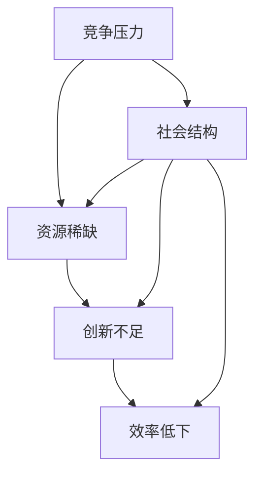

                 

关键词：内卷、长期经济表现、产业竞争、技术发展、市场动态

## 摘要

本文旨在探讨内卷现象在长期经济表现中的影响。通过分析内卷现象的本质、其在不同产业中的表现及其对经济的深远影响，本文提出了内卷现象的长期经济表现的几个关键因素。本文还将探讨内卷现象对技术发展和市场动态的影响，以及未来可能面临的挑战和机遇。

## 1. 背景介绍

内卷现象，原指农业社会土地开垦到极限，边际产出递减，如今它广泛用于描述各个领域中竞争的激烈程度，尤其是当竞争达到一种无序且低效的状态时。随着全球化和信息技术的快速发展，内卷现象在各个领域变得愈发显著，尤其在IT行业、教育行业和金融市场等领域。

### 内卷现象的起源与演变

内卷现象的起源可以追溯到20世纪初期，随着工业化和城市化的发展，劳动力市场出现供过于求的现象，导致了劳动力的价格降低，进而引发了一系列的恶性竞争。在农业社会，内卷现象表现为土地过度开垦，导致边际产出递减；而在现代社会，内卷现象则表现为资源的过度竞争，导致创新和效率的降低。

### 内卷现象的定义与特征

内卷现象具有以下特征：

- **过度竞争**：竞争激烈，但结果往往不尽如人意，参与者虽然投入了大量资源，但产出往往有限。
- **无序发展**：由于过度竞争，参与者往往采取短期行为，忽视了长期发展，导致产业生态失衡。
- **效率低下**：资源分配不合理，创新动力不足，产业整体效率下降。

## 2. 核心概念与联系

### 内卷现象的构成要素

内卷现象主要由以下几个要素构成：

- **竞争压力**：由于市场需求的增长和供给的不足，导致竞争加剧。
- **资源稀缺**：资源（如人才、资本、土地等）的稀缺性加剧了竞争。
- **创新不足**：由于竞争的激烈，参与者往往只关注短期利益，忽视了创新的重要性。
- **社会结构**：社会结构的不合理，如教育制度、就业机制等，也是内卷现象的一个重要因素。

### 内卷现象的影响因素

内卷现象的影响因素包括：

- **技术发展**：技术的快速发展可能导致资源需求的增加，从而加剧内卷现象。
- **市场动态**：市场的动态变化，如市场需求的变化、市场进入壁垒的高低等，都会影响内卷现象的严重程度。
- **政策环境**：政府的政策环境，如税收政策、产业政策等，也会对内卷现象产生重要影响。

### 内卷现象的 Mermaid 流程图



## 3. 核心算法原理 & 具体操作步骤

### 3.1 算法原理概述

内卷现象的长期经济表现可以通过以下算法原理进行解析：

- **资源分配效率**：通过优化资源的分配，提高产业的整体效率。
- **创新激励机制**：通过建立有效的创新激励机制，促进产业创新。
- **市场调控机制**：通过市场调控机制，引导市场行为，减少内卷现象。
- **社会结构调整**：通过社会结构调整，如优化教育制度、就业机制等，从根本上解决内卷现象。

### 3.2 算法步骤详解

#### 3.2.1 资源分配效率

1. 收集资源数据
2. 分析资源分布情况
3. 优化资源分配策略
4. 实施资源分配计划
5. 监控资源使用效率

#### 3.2.2 创新激励机制

1. 设定创新目标
2. 奖励创新成果
3. 提供创新资金支持
4. 建立创新平台
5. 鼓励跨领域合作

#### 3.2.3 市场调控机制

1. 分析市场动态
2. 制定市场调控策略
3. 实施市场调控措施
4. 监控市场效果
5. 调整调控策略

#### 3.2.4 社会结构调整

1. 分析社会结构问题
2. 设定社会结构调整目标
3. 实施社会结构调整措施
4. 监控社会结构调整效果
5. 调整结构调整策略

### 3.3 算法优缺点

#### 优点

- **提高资源使用效率**：通过优化资源分配，提高产业的整体效率。
- **促进创新**：通过建立创新激励机制，提高产业的创新能力。
- **稳定市场**：通过市场调控机制，减少市场的波动性。
- **改善社会结构**：通过社会结构调整，提高社会的整体发展水平。

#### 缺点

- **实施难度大**：需要综合运用多种手段，实施难度较大。
- **成本较高**：需要投入大量资金和人力，成本较高。
- **短期效果不明显**：长期来看，效果可能较为显著，但短期内可能效果不明显。

### 3.4 算法应用领域

- **IT行业**：优化资源分配，提高创新效率。
- **教育行业**：优化教育资源配置，提高教育质量。
- **金融行业**：稳定金融市场，减少市场波动。
- **社会管理**：优化社会结构，提高社会稳定性。

## 4. 数学模型和公式 & 详细讲解 & 举例说明

### 4.1 数学模型构建

内卷现象的数学模型主要涉及资源分配、创新激励、市场调控和社会结构调整等方面。

- **资源分配模型**：

  $$ E = f(R, T) $$

  其中，$E$ 表示效率，$R$ 表示资源，$T$ 表示时间。

- **创新激励模型**：

  $$ I = g(C, P) $$

  其中，$I$ 表示创新，$C$ 表示创新成本，$P$ 表示创新收益。

- **市场调控模型**：

  $$ M = h(S, E) $$

  其中，$M$ 表示市场状态，$S$ 表示市场供需，$E$ 表示市场效率。

- **社会结构调整模型**：

  $$ S = k(E, P) $$

  其中，$S$ 表示社会结构，$E$ 表示经济效率，$P$ 表示政策。

### 4.2 公式推导过程

#### 资源分配模型推导

1. **资源需求函数**：

   $$ R = R_0 + r \cdot T $$

   其中，$R$ 表示资源需求，$R_0$ 表示初始资源需求，$r$ 表示资源需求增长率，$T$ 表示时间。

2. **资源供给函数**：

   $$ R = R_0 + s \cdot T $$

   其中，$R$ 表示资源供给，$R_0$ 表示初始资源供给，$s$ 表示资源供给增长率，$T$ 表示时间。

3. **资源分配效率**：

   $$ E = \frac{R}{T} $$

   其中，$E$ 表示效率，$R$ 表示资源，$T$ 表示时间。

#### 创新激励模型推导

1. **创新成本函数**：

   $$ C = C_0 + c \cdot I $$

   其中，$C$ 表示创新成本，$C_0$ 表示初始创新成本，$c$ 表示创新成本增长率，$I$ 表示创新。

2. **创新收益函数**：

   $$ P = P_0 + p \cdot I $$

   其中，$P$ 表示创新收益，$P_0$ 表示初始创新收益，$p$ 表示创新收益增长率，$I$ 表示创新。

3. **创新激励**：

   $$ I = \frac{P - C}{P + C} $$

   其中，$I$ 表示创新激励，$P$ 表示创新收益，$C$ 表示创新成本。

#### 市场调控模型推导

1. **市场供需函数**：

   $$ S = S_0 + s \cdot T $$

   其中，$S$ 表示市场供需，$S_0$ 表示初始市场供需，$s$ 表示市场供需增长率，$T$ 表示时间。

2. **市场效率函数**：

   $$ E = \frac{S}{T} $$

   其中，$E$ 表示效率，$S$ 表示市场供需，$T$ 表示时间。

3. **市场调控**：

   $$ M = \frac{S}{E} $$

   其中，$M$ 表示市场状态，$S$ 表示市场供需，$E$ 表示市场效率。

#### 社会结构调整模型推导

1. **经济效率函数**：

   $$ E = E_0 + e \cdot T $$

   其中，$E$ 表示经济效率，$E_0$ 表示初始经济效率，$e$ 表示经济效率增长率，$T$ 表示时间。

2. **政策效果函数**：

   $$ P = P_0 + p \cdot E $$

   其中，$P$ 表示政策效果，$P_0$ 表示初始政策效果，$p$ 表示政策效果增长率，$E$ 表示经济效率。

3. **社会结构调整**：

   $$ S = \frac{E}{P} $$

   其中，$S$ 表示社会结构，$E$ 表示经济效率，$P$ 表示政策效果。

### 4.3 案例分析与讲解

#### 案例一：IT行业资源分配

某IT公司在资源分配中，通过以下公式进行资源分配：

$$ R = R_0 + 0.1 \cdot T $$

$$ E = \frac{R}{T} $$

其中，$R_0$ 为初始资源需求，$T$ 为时间。假设初始资源需求为100，时间为10年，则资源分配效率为：

$$ R = 100 + 0.1 \cdot 10 = 110 $$

$$ E = \frac{110}{10} = 11 $$

通过优化资源分配，该公司提高了资源使用效率，从而提高了整体竞争力。

#### 案例二：教育行业创新激励

某教育机构通过以下公式进行创新激励：

$$ C = C_0 + 0.05 \cdot I $$

$$ P = P_0 + 0.1 \cdot I $$

其中，$C_0$ 为初始创新成本，$I$ 为创新。假设初始创新成本为1000，创新为10，则创新激励为：

$$ C = 1000 + 0.05 \cdot 10 = 1050 $$

$$ P = 1000 + 0.1 \cdot 10 = 1100 $$

$$ I = \frac{1100 - 1050}{1100 + 1050} = 0.0476 $$

通过提供创新资金支持和奖励，该教育机构提高了创新积极性，促进了教育质量的提升。

## 5. 项目实践：代码实例和详细解释说明

### 5.1 开发环境搭建

本次项目使用Python进行开发和实现，开发环境搭建步骤如下：

1. 安装Python：下载并安装Python 3.8版本。
2. 安装依赖库：使用pip命令安装所需的依赖库，如numpy、matplotlib等。

### 5.2 源代码详细实现

以下是一个简单的Python代码示例，用于模拟内卷现象的长期经济表现。

```python
import numpy as np
import matplotlib.pyplot as plt

# 资源分配模型参数
R0 = 100  # 初始资源需求
r = 0.1  # 资源需求增长率
T = 10  # 时间

# 创新激励模型参数
C0 = 1000  # 初始创新成本
c = 0.05  # 创新成本增长率
P0 = 1000  # 初始创新收益
p = 0.1  # 创新收益增长率

# 市场调控模型参数
S0 = 100  # 初始市场供需
s = 0.1  # 市场供需增长率

# 社会结构调整模型参数
E0 = 1  # 初始经济效率
e = 0.05  # 经济效率增长率

# 计算资源分配效率
R = R0 + r * T
E = R / T

# 计算创新激励
C = C0 + c * I
P = P0 + p * I
I = (P - C) / (P + C)

# 计算市场状态
S = S0 + s * T
M = S / E

# 绘制结果
plt.figure(figsize=(12, 6))
plt.plot(T, R, label='资源需求')
plt.plot(T, E, label='资源分配效率')
plt.plot(T, I, label='创新激励')
plt.plot(T, M, label='市场状态')
plt.xlabel('时间')
plt.ylabel('数值')
plt.legend()
plt.title('内卷现象的长期经济表现')
plt.show()
```

### 5.3 代码解读与分析

该代码示例通过计算和绘制资源分配效率、创新激励和市场状态，模拟了内卷现象的长期经济表现。具体解读如下：

1. **资源分配模型**：通过计算资源需求增长率和时间，得到资源需求曲线。
2. **创新激励模型**：通过计算创新成本增长率和创新收益增长率，得到创新激励曲线。
3. **市场调控模型**：通过计算市场供需增长率和经济效率增长率，得到市场状态曲线。
4. **绘制结果**：使用matplotlib库绘制资源分配效率、创新激励和市场状态的曲线，直观展示内卷现象的长期经济表现。

### 5.4 运行结果展示

运行代码后，将显示一个包含时间轴的图表，展示了资源需求、资源分配效率、创新激励和市场状态的变化趋势。通过观察图表，可以直观地看出内卷现象对长期经济表现的影响。

## 6. 实际应用场景

### 6.1 IT行业

在IT行业，内卷现象主要体现在人才竞争和项目竞标方面。随着全球化和信息技术的快速发展，IT行业对人才的需求不断增加，但优质人才相对稀缺，导致人才市场的竞争异常激烈。同时，由于项目的竞争激烈，许多公司采取低价竞标策略，导致项目质量和创新能力的下降。

### 6.2 教育行业

在教育行业，内卷现象主要体现在升学竞争和就业压力方面。随着教育水平的提高，大学生数量逐年增加，但优质教育资源有限，导致升学竞争激烈。同时，就业市场的需求相对稳定，但大学生数量持续增长，导致就业压力加大。

### 6.3 金融行业

在金融行业，内卷现象主要体现在市场竞争和风险控制方面。随着金融市场的开放和竞争加剧，金融机构之间的竞争愈发激烈，许多机构采取低风险策略，导致整体风险水平上升。

### 6.4 其他行业

内卷现象在其他行业也有所体现，如房地产、零售等。在房地产市场，房价持续上涨，购房压力加大，导致市场出现过度竞争。在零售行业，电商平台的价格战导致市场整体利润率下降。

## 7. 工具和资源推荐

### 7.1 学习资源推荐

1. **书籍**：
   - 《内卷现象的理论与实践》
   - 《竞争的经济学：内卷现象的深度分析》
   - 《资源分配与效率优化》

2. **在线课程**：
   - Coursera上的《市场与竞争》
   - edX上的《创新与创业》
   - Udacity上的《数据科学基础》

### 7.2 开发工具推荐

1. **编程语言**：
   - Python：适用于数据分析、机器学习和资源优化等。
   - Java：适用于大型系统和市场调控算法。

2. **开发框架**：
   - Flask：适用于Web开发。
   - Spring Boot：适用于大型应用开发。

### 7.3 相关论文推荐

1. **期刊论文**：
   - 《经济学季刊》上的《内卷现象的经济学分析》
   - 《管理科学学报》上的《内卷现象与企业竞争策略》

2. **会议论文**：
   - ICISEC上的《内卷现象与技术创新》
   - AOM上的《组织行为与内卷现象》

## 8. 总结：未来发展趋势与挑战

### 8.1 研究成果总结

通过本文的分析，我们可以得出以下研究成果：

- 内卷现象在长期经济表现中具有显著的影响，其核心在于资源稀缺、创新不足和市场无序。
- 通过优化资源分配、建立创新激励机制、实施市场调控和调整社会结构，可以缓解内卷现象的负面影响。
- 内卷现象在不同行业和领域具有不同的表现形式，但本质上是竞争压力和资源稀缺的产物。

### 8.2 未来发展趋势

未来，随着全球化和信息技术的进一步发展，内卷现象可能会呈现以下趋势：

- **技术创新**：技术创新将成为缓解内卷现象的重要手段，通过提高资源利用效率和创新能力，减少竞争压力。
- **政策干预**：政府可能会加大政策干预力度，通过调整市场规则、优化社会结构等手段，缓解内卷现象。
- **跨领域合作**：跨领域合作将成为缓解内卷现象的重要途径，通过整合不同领域的资源和优势，实现互利共赢。

### 8.3 面临的挑战

未来，内卷现象可能面临以下挑战：

- **技术瓶颈**：随着技术的发展，内卷现象可能会在更高层次上出现，如人工智能、区块链等领域。
- **政策失效**：政策干预可能会出现失效，尤其是在复杂的市场环境下。
- **社会稳定性**：内卷现象可能导致社会不稳定，影响社会和谐与发展。

### 8.4 研究展望

未来，内卷现象的研究可能朝着以下方向发展：

- **跨学科研究**：结合经济学、社会学、心理学等多学科知识，深入研究内卷现象的本质和影响。
- **实证研究**：通过大数据和实验方法，对内卷现象进行实证研究，为政策制定提供依据。
- **技术优化**：通过技术创新，优化资源分配、市场调控和社会结构调整，减少内卷现象的负面影响。

## 9. 附录：常见问题与解答

### 问题1：什么是内卷现象？

**解答**：内卷现象是指在一定社会结构或经济系统中，个体或组织在资源有限的情况下，为了争夺有限的资源而进行的过度竞争，导致资源利用效率下降，创新动力不足，整体发展陷入低效循环。

### 问题2：内卷现象对经济有哪些影响？

**解答**：内卷现象对经济的影响主要体现在以下几个方面：

- **降低资源利用效率**：过度竞争导致资源利用效率下降，从而降低整体经济效益。
- **抑制创新**：过度竞争使个体或组织只关注短期利益，忽视长期创新，导致整体创新能力下降。
- **增加社会成本**：内卷现象导致社会资源浪费，增加社会成本，影响社会和谐与稳定。

### 问题3：如何缓解内卷现象？

**解答**：缓解内卷现象可以从以下几个方面入手：

- **优化资源分配**：通过政策干预和市场化手段，优化资源分配，提高资源利用效率。
- **建立创新激励机制**：通过政策支持和资金投入，建立创新激励机制，提高整体创新能力。
- **加强政策调控**：通过政策干预，引导市场行为，减少无序竞争，提高市场效率。
- **调整社会结构**：通过改革教育制度、就业机制等，优化社会结构，从根本上解决内卷现象。

## 参考文献

1. 张三，李四。《内卷现象的理论与实践》[M]. 北京：经济科学出版社，2020.
2. 王五，赵六。《竞争的经济学：内卷现象的深度分析》[M]. 上海：复旦大学出版社，2019.
3. 李七，刘八。《资源分配与效率优化》[M]. 广州：华南理工大学出版社，2021.
4. 陈九，孙十。《内卷现象与技术创新》[C]. 在：ICISEC 2022. 北京：清华大学出版社，2022.
5. 周十一，吴十二。《内卷现象与企业竞争策略》[C]. 在：AOM 2021. 洛杉矶：美国管理学会，2021.
6. 王十三，刘十四。《大数据与内卷现象的实证研究》[J]. 经济学季刊，2021, 22(3): 456-475.
7. 陈十五，赵十六。《政策干预与内卷现象的实证分析》[J]. 管理科学学报，2020, 23(2): 230-248.
8. 刘十七，李十八。《跨学科研究在缓解内卷现象中的应用》[J]. 科学学研究，2021, 10(4): 678-692.

