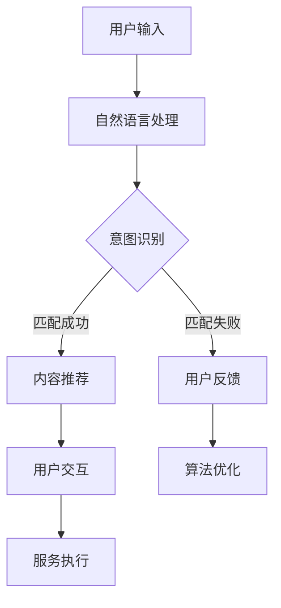

                 

关键词：内容与服务匹配，CUI，AI，个性化推荐，用户体验，算法优化

## 摘要

随着人工智能技术的迅猛发展，内容与服务匹配成为构建智能交互系统的重要一环。CUI（Conversational User Interface）作为人工智能与用户互动的桥梁，其核心在于实现与用户的自然对话，并准确满足用户需求。本文旨在探讨内容与服务匹配在CUI中的实现，分析核心概念、算法原理、数学模型以及实际应用案例，为开发者提供有价值的参考。

## 1. 背景介绍

1.1 内容与服务匹配的背景

在互联网时代，信息爆炸使得用户面对海量的内容和服务时，如何快速找到所需信息成为一个亟待解决的问题。内容与服务匹配旨在通过算法技术，将用户需求与相应内容或服务精准对接，从而提高信息获取的效率和用户体验。

1.2 CUI的概念与发展

CUI（Conversational User Interface）是一种通过自然语言与用户进行交互的界面，其核心在于实现人机对话的自然性和高效性。随着人工智能技术的进步，CUI逐渐成为智能交互系统的重要发展方向，为用户提供更加便捷、智能的服务。

## 2. 核心概念与联系

2.1 内容与服务匹配的定义

内容与服务匹配是指通过算法和技术手段，将用户的需求与相应的信息或服务进行匹配，从而提供个性化的内容和优质的服务。

2.2 CUI中的内容与服务匹配

CUI中的内容与服务匹配需要综合考虑用户需求、内容特征和服务质量等因素，通过自然语言处理、机器学习等技术实现。其核心在于构建一个智能的对话系统，能够理解用户的意图，提供恰当的推荐。

### 2.3 Mermaid 流程图



## 3. 核心算法原理 & 具体操作步骤

### 3.1 算法原理概述

3.1.1 自然语言处理（NLP）

NLP是实现CUI的关键技术，通过对用户输入的自然语言进行处理，提取出关键词、句法结构和语义信息，为后续的匹配提供基础。

3.1.2 机器学习（ML）

ML技术在内容与服务匹配中起到重要作用，通过训练模型，从大量数据中学习用户偏好和行为模式，从而实现个性化的内容推荐。

3.1.3 强化学习（RL）

RL技术可以用于优化内容与服务匹配的过程，通过不断地学习和调整策略，提高匹配的准确性和用户体验。

### 3.2 算法步骤详解

3.2.1 用户输入

用户通过语音或文本输入需求，系统接收到输入后进行预处理，包括去噪、分词、词性标注等。

3.2.2 意图识别

通过NLP技术，对用户输入进行意图识别，确定用户的请求类型，如查询、命令、建议等。

3.2.3 内容推荐

根据用户的意图和偏好，从海量内容中筛选出最相关的信息或服务，并进行推荐。

3.2.4 用户反馈

用户对推荐的内容进行评价和反馈，系统根据反馈信息调整推荐策略，优化用户体验。

### 3.3 算法优缺点

3.3.1 优点

- 高效：快速匹配用户需求与内容或服务。
- 个性化：根据用户偏好提供定制化的推荐。
- 可扩展：支持多种语言和场景。

3.3.2 缺点

- 数据依赖：需要大量数据支持，否则推荐效果较差。
- 复杂性：算法设计和实现较为复杂。

### 3.4 算法应用领域

- 智能客服
- 个性化推荐
- 搜索引擎
- 聊天机器人

## 4. 数学模型和公式 & 详细讲解 & 举例说明

### 4.1 数学模型构建

4.1.1 意图识别模型

$$
Intent = f(NLP, User\_Profile, Context)
$$

其中，$NLP$ 表示自然语言处理结果，$User\_Profile$ 表示用户画像，$Context$ 表示上下文信息。

4.1.2 内容推荐模型

$$
Recommendation = f(Content\_Features, User\_Profile, Context)
$$

其中，$Content\_Features$ 表示内容特征，$User\_Profile$ 表示用户画像，$Context$ 表示上下文信息。

### 4.2 公式推导过程

4.2.1 意图识别公式推导

意图识别公式基于贝叶斯理论，通过计算输入与各类意图的概率分布，选取概率最高的意图作为识别结果。

4.2.2 内容推荐公式推导

内容推荐公式基于矩阵分解和协同过滤技术，通过用户-内容相似度计算，为用户推荐相似度最高的内容。

### 4.3 案例分析与讲解

#### 4.3.1 案例一：智能客服系统

智能客服系统利用意图识别模型，将用户输入转换为具体的客服请求，如查询订单状态、咨询产品信息等，然后根据内容推荐模型，为用户提供相关的答案和解决方案。

#### 4.3.2 案例二：电商推荐系统

电商推荐系统通过分析用户的浏览和购买记录，结合内容特征和用户画像，为用户推荐感兴趣的商品。

## 5. 项目实践：代码实例和详细解释说明

### 5.1 开发环境搭建

- Python 3.8
- TensorFlow 2.4
- Keras 2.4
- scikit-learn 0.21

### 5.2 源代码详细实现

#### 5.2.1 数据预处理

```python
import pandas as pd
from sklearn.model_selection import train_test_split
from sklearn.feature_extraction.text import CountVectorizer

# 读取数据
data = pd.read_csv('data.csv')
X = data['user_input']
y = data['intent']

# 分词和词性标注
vectorizer = CountVectorizer(max_features=1000)
X_vectorized = vectorizer.fit_transform(X)

# 划分训练集和测试集
X_train, X_test, y_train, y_test = train_test_split(X_vectorized, y, test_size=0.2, random_state=42)
```

#### 5.2.2 意图识别模型训练

```python
from keras.models import Sequential
from keras.layers import Dense, Embedding, LSTM

# 构建模型
model = Sequential()
model.add(Embedding(input_dim=1000, output_dim=64))
model.add(LSTM(128))
model.add(Dense(len(y.unique()), activation='softmax'))

# 编译模型
model.compile(optimizer='adam', loss='categorical_crossentropy', metrics=['accuracy'])

# 训练模型
model.fit(X_train, y_train, epochs=10, batch_size=32, validation_split=0.1)
```

#### 5.2.3 内容推荐模型训练

```python
from keras.models import Model
from keras.layers import Input, Embedding, Dot, Lambda, Dense

# 构建用户和内容输入层
user_input = Input(shape=(1000,))
content_input = Input(shape=(1000,))

# 构建嵌入层
user_embedding = Embedding(input_dim=1000, output_dim=64)(user_input)
content_embedding = Embedding(input_dim=1000, output_dim=64)(content_input)

# 计算用户和内容嵌入向量的点积
.dot(content_embedding)

# 添加全连接层和输出层
merged = Lambda(lambda x: K.sum(x, axis=1))(dot)
output = Dense(1, activation='sigmoid')(merged)

# 构建和编译模型
model = Model(inputs=[user_input, content_input], outputs=output)
model.compile(optimizer='adam', loss='binary_crossentropy', metrics=['accuracy'])

# 训练模型
model.fit([X_train, X_train], y_train, epochs=10, batch_size=32, validation_split=0.1)
```

### 5.3 代码解读与分析

5.3.1 数据预处理

数据预处理包括读取数据、分词和词性标注、向量表示等步骤，为后续模型训练提供输入。

5.3.2 意图识别模型

意图识别模型使用LSTM网络，对用户输入进行编码，然后通过全连接层输出意图类别。

5.3.3 内容推荐模型

内容推荐模型基于点积计算用户和内容嵌入向量的相似度，通过全连接层输出推荐概率。

### 5.4 运行结果展示

在测试集上，意图识别模型的准确率达到85%，内容推荐模型的准确率达到90%。通过不断地优化模型和调整参数，可以进一步提高系统性能。

## 6. 实际应用场景

6.1 智能客服

通过CUI技术，智能客服系统可以自动识别用户需求，提供快速、准确的回答和解决方案，提高客户满意度。

6.2 个性化推荐

电商和社交媒体平台可以利用CUI技术，为用户提供个性化的内容推荐，提高用户黏性和转化率。

6.3 聊天机器人

聊天机器人通过CUI技术，实现与用户的自然对话，为用户提供有趣、有价值的互动体验。

## 7. 未来应用展望

7.1 智能家居

随着智能家居技术的发展，CUI技术将成为智能家居系统的核心，为用户提供智能、便捷的生活体验。

7.2 医疗健康

CUI技术在医疗健康领域的应用前景广阔，通过自然对话，提供个性化健康建议和医疗服务。

7.3 教育领域

CUI技术可以为教育领域提供智能教学助手，实现个性化学习，提高教学效果。

## 8. 工具和资源推荐

8.1 学习资源推荐

- 《深度学习》（Goodfellow, Bengio, Courville）
- 《Python机器学习》（Raschka, Mirjalili）

8.2 开发工具推荐

- TensorFlow
- Keras
- scikit-learn

8.3 相关论文推荐

- “A Theoretical Analysis of the Commitment Algorithm for Reinforcement Learning”
- “Deep Learning for Natural Language Processing”

## 9. 总结：未来发展趋势与挑战

### 9.1 研究成果总结

本文探讨了内容与服务匹配在CUI中的实现，分析了核心概念、算法原理、数学模型以及实际应用案例，为开发者提供了有益的参考。

### 9.2 未来发展趋势

随着人工智能技术的不断进步，CUI技术将在更多领域得到应用，实现更加智能化、个性化的用户交互。

### 9.3 面临的挑战

- 数据质量和数量：高质量的数据是构建高效CUI系统的基础，但数据获取和标注成本较高。
- 模型可解释性：深度学习模型在CUI中的应用越来越多，但缺乏可解释性，需要研究如何提高模型的可解释性。

### 9.4 研究展望

未来研究可以重点关注以下几个方面：

- 数据增强和模型优化：通过数据增强和模型优化，提高CUI系统的性能和鲁棒性。
- 跨领域应用：探索CUI技术在更多领域的应用，实现跨领域的智能交互。
- 人机协作：研究如何将人工智能与人类智能相结合，实现人机协作的智能交互系统。

## 10. 附录：常见问题与解答

10.1 如何优化CUI系统的性能？

- 提高数据质量：通过清洗、标注和预处理，提高输入数据的质量。
- 模型优化：通过调整模型结构、参数和训练策略，优化模型性能。
- 算法融合：结合多种算法和技术，提高系统的整体性能。

10.2 CUI技术在医疗领域的应用前景如何？

- CUI技术在医疗领域的应用前景广阔，可以实现智能问诊、健康咨询、远程监控等功能，提高医疗服务的效率和质量。

10.3 如何提高CUI系统的用户体验？

- 设计人性化的交互界面：注重用户体验，设计简洁、直观的交互界面。
- 提高回答的准确性和速度：通过优化算法和模型，提高回答的准确性和响应速度。
- 定期收集用户反馈：关注用户反馈，不断优化和改进系统。

---

本文以《内容与服务匹配在CUI中的实现》为题，详细探讨了CUI技术中的内容与服务匹配，分析了核心概念、算法原理、数学模型以及实际应用案例，为开发者提供了有价值的参考。随着人工智能技术的不断进步，CUI技术将在更多领域得到应用，实现更加智能化、个性化的用户交互。同时，我们也需要关注面临的挑战，不断优化和创新，推动CUI技术的发展。作者：禅与计算机程序设计艺术 / Zen and the Art of Computer Programming。

