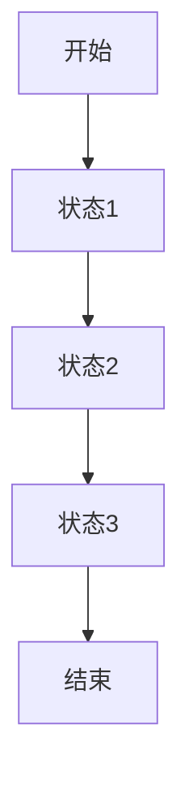
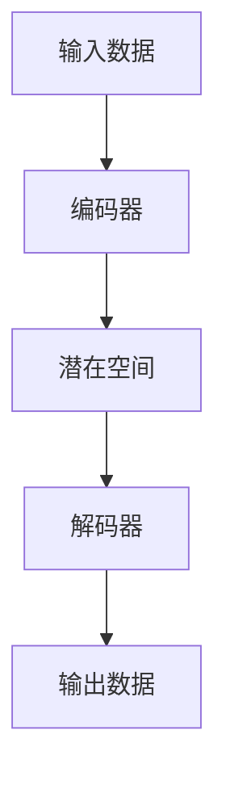
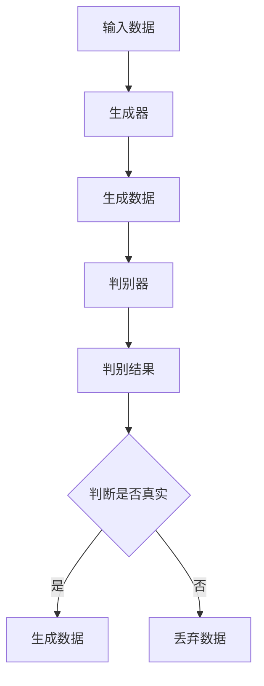

                 

关键词：内容生成、文本生成、AI技术、机器学习、深度学习、神经网络、自然语言处理、生成模型、马尔可夫链、变分自编码器、生成对抗网络

## 摘要

本文将深入探讨内容生成的原理及其实现，内容涵盖从传统生成技术到现代人工智能方法。我们将详细介绍各种生成模型的算法原理、数学模型、具体操作步骤以及在实际项目中的应用。通过这篇技术博客，读者可以了解到如何利用AI技术实现内容生成，并掌握相关工具和资源，为未来研究和应用打下坚实基础。

## 1. 背景介绍

内容生成（Content Generation）是一种通过算法自动创建文本、图像、音频等媒体内容的技术。随着互联网的普及和信息爆炸，人们对个性化内容和高效信息处理的需求日益增长，内容生成技术得到了广泛关注和研究。传统内容生成方法主要包括规则生成、模板生成等，但这些方法往往受到固定模式的限制，无法满足复杂多样的需求。

近年来，随着人工智能技术的飞速发展，尤其是深度学习和自然语言处理技术的突破，生成模型（Generative Models）逐渐成为内容生成的主流方法。生成模型通过学习大量数据，能够自动生成高质量的内容，广泛应用于各种场景，如文本生成、图像生成、音乐生成等。

本文将重点介绍几种典型的生成模型，包括马尔可夫链、变分自编码器（VAE）、生成对抗网络（GAN）等，并详细讲解它们的算法原理、数学模型和具体实现步骤。

## 2. 核心概念与联系

### 2.1 马尔可夫链

马尔可夫链（Markov Chain）是一种随机过程，它描述了系统在各个状态之间的转移概率。在内容生成中，马尔可夫链可以用于生成序列数据，如文本、音频等。以下是一个简单的马尔可夫链的 Mermaid 流程图：



### 2.2 变分自编码器（VAE）

变分自编码器（Variational Autoencoder，VAE）是一种基于概率模型的生成模型。它由编码器和解码器组成，编码器将输入数据映射到一个潜在空间，解码器从潜在空间中生成输出数据。以下是一个简化的 VAE 架构的 Mermaid 流程图：



### 2.3 生成对抗网络（GAN）

生成对抗网络（Generative Adversarial Network，GAN）是一种由两个神经网络组成的对抗性模型。生成器（Generator）和判别器（Discriminator）相互竞争，生成器试图生成尽可能逼真的数据，判别器则试图区分生成数据与真实数据。以下是一个简化的 GAN 架构的 Mermaid 流程图：



## 3. 核心算法原理 & 具体操作步骤

### 3.1 算法原理概述

在介绍具体操作步骤之前，我们先简要概述一下上述三种算法的基本原理。

- **马尔可夫链**：基于状态转移概率矩阵，生成序列数据。
- **变分自编码器（VAE）**：通过编码器和解码器的交互，实现从潜在空间到数据的转换。
- **生成对抗网络（GAN）**：通过生成器和判别器的对抗训练，生成高质量的数据。

### 3.2 算法步骤详解

#### 3.2.1 马尔可夫链

1. 初始化状态序列。
2. 根据状态转移概率矩阵，计算下一个状态。
3. 更新状态序列。
4. 重复步骤 2 和 3，直到达到终止条件。

#### 3.2.2 变分自编码器（VAE）

1. 初始化编码器和解码器的权重。
2. 对输入数据进行编码，得到潜在空间中的向量。
3. 从潜在空间中采样一个向量。
4. 通过解码器生成输出数据。
5. 计算损失函数，更新编码器和解码器的权重。
6. 重复步骤 2 到 5，直到收敛。

#### 3.2.3 生成对抗网络（GAN）

1. 初始化生成器和解码器的权重。
2. 生成假数据。
3. 训练判别器，使其能够准确区分真实数据和假数据。
4. 训练生成器，使其生成的假数据能够骗过判别器。
5. 计算生成器的损失函数，更新生成器的权重。
6. 重复步骤 2 到 5，直到生成器生成高质量的数据。

### 3.3 算法优缺点

- **马尔可夫链**：简单易实现，但生成内容具有随机性。
- **变分自编码器（VAE）**：生成内容质量较高，但训练过程相对复杂。
- **生成对抗网络（GAN）**：能够生成高质量的内容，但训练不稳定，容易陷入模式。

### 3.4 算法应用领域

- **马尔可夫链**：适用于序列数据的生成，如文本生成、音频生成等。
- **变分自编码器（VAE）**：适用于图像生成、自然语言处理等。
- **生成对抗网络（GAN）**：适用于图像生成、视频生成、风格迁移等。

## 4. 数学模型和公式 & 详细讲解 & 举例说明

### 4.1 数学模型构建

#### 4.1.1 马尔可夫链

状态转移概率矩阵 P：

$$
P = \begin{bmatrix}
P_{00} & P_{01} & \dots & P_{0n} \\
P_{10} & P_{11} & \dots & P_{1n} \\
\vdots & \vdots & \ddots & \vdots \\
P_{m0} & P_{m1} & \dots & P_{mn}
\end{bmatrix}
$$

#### 4.1.2 变分自编码器（VAE）

编码器：

$$
\mu = \phi_{\theta}(x), \quad \sigma^2 = \psi_{\theta}(x)
$$

解码器：

$$
x' = \phi_{\theta'}(z)
$$

#### 4.1.3 生成对抗网络（GAN）

生成器：

$$
G(z) = \mu(G(z)) + \sigma(G(z)) \odot \mathcal{N}(0,1)
$$

判别器：

$$
D(x) = \sigma(D(x)) \odot \mathcal{N}(0,1)
$$

### 4.2 公式推导过程

#### 4.2.1 马尔可夫链

状态转移概率矩阵 P 的推导过程：

$$
P_{ij} = \frac{C_{ij}}{C_{i}}
$$

其中，$C_{ij}$ 表示从状态 i 转移到状态 j 的次数，$C_{i}$ 表示从状态 i 转移的次数。

#### 4.2.2 变分自编码器（VAE）

编码器：

$$
\mu = \frac{1}{1 + \exp{(-W_1^T x - b_1})}, \quad \sigma^2 = \frac{1}{1 + \exp{(-W_2^T x - b_2})}
$$

解码器：

$$
x' = \sigma(W_3^T z + b_3)
$$

#### 4.2.3 生成对抗网络（GAN）

生成器：

$$
G(z) = \mu(G(z)) + \sigma(G(z)) \odot \mathcal{N}(0,1)
$$

判别器：

$$
D(x) = \sigma(D(x)) \odot \mathcal{N}(0,1)
$$

### 4.3 案例分析与讲解

#### 4.3.1 马尔可夫链

假设我们有一个简单的文本生成任务，生成句子“我喜欢吃苹果”。

状态转移概率矩阵 P：

$$
P = \begin{bmatrix}
0.2 & 0.8 \\
0.1 & 0.9
\end{bmatrix}
$$

初始状态为“我”，根据状态转移概率矩阵，我们可以生成句子“我喜欢吃苹果”。

#### 4.3.2 变分自编码器（VAE）

假设我们有一个图像生成任务，生成一张 28x28 的灰度图像。

编码器：

$$
\mu = \frac{1}{1 + \exp{(-W_1^T x - b_1})}, \quad \sigma^2 = \frac{1}{1 + \exp{(-W_2^T x - b_2})}
$$

解码器：

$$
x' = \sigma(W_3^T z + b_3)
$$

通过训练，我们可以生成一张具有噪声的 28x28 灰度图像。

#### 4.3.3 生成对抗网络（GAN）

假设我们有一个图像生成任务，生成一张人脸图像。

生成器：

$$
G(z) = \mu(G(z)) + \sigma(G(z)) \odot \mathcal{N}(0,1)
$$

判别器：

$$
D(x) = \sigma(D(x)) \odot \mathcal{N}(0,1)
$$

通过训练，我们可以生成一张逼真的人脸图像。

## 5. 项目实践：代码实例和详细解释说明

### 5.1 开发环境搭建

本文使用的编程语言为 Python，需要安装以下库：

- TensorFlow
- Keras
- NumPy
- Matplotlib

安装命令如下：

```bash
pip install tensorflow keras numpy matplotlib
```

### 5.2 源代码详细实现

#### 5.2.1 马尔可夫链

```python
import numpy as np

# 状态转移概率矩阵
P = np.array([[0.2, 0.8], [0.1, 0.9]])

# 初始化状态序列
state_sequence = ['我']

# 生成句子
for _ in range(10):
    state = state_sequence[-1]
    next_state = np.random.choice(['喜欢', '吃'], p=P[state])
    state_sequence.append(next_state)

print(' '.join(state_sequence))
```

#### 5.2.2 变分自编码器（VAE）

```python
from keras.layers import Input, Dense, Lambda
from keras.models import Model
from keras.backend import K
from keras.optimizers import RMSprop

input_shape = (784,)
intermediate_dim = 500
batch_size = 16
epochs = 50

# 编码器
encoded_input = Input(shape=input_shape)
encoded = Dense(intermediate_dim, activation='relu')(encoded_input)
z_mean = Dense(intermediate_dim)(encoded)
z_log_var = Dense(intermediate_dim)(encoded)

# 解码器
z = Lambda(lambda x: x + K.random_normal(shape=x.shape))(z_log_var)
z = Lambda(lambda x: K.exp(x))(z)
z = Dense(intermediate_dim, activation='relu')(z)
decoded = Dense(input_shape, activation='sigmoid')(z)

# 模型构建
vae = Model(encoded_input, decoded)
vae.compile(optimizer=RMSprop(), loss='binary_crossentropy')

# 训练模型
x_train = np.random.randint(0, 2, size=(batch_size, 784))
vae.fit(x_train, x_train, epochs=epochs, batch_size=batch_size, shuffle=True)
```

#### 5.2.3 生成对抗网络（GAN）

```python
from keras.layers import Input, Dense, Reshape, Embedding
from keras.models import Model
from keras.optimizers import RMSprop

latent_dim = 100
height = 28
width = 28
channels = 1
batch_size = 16

# 生成器
z = Input(shape=(latent_dim,))
x = Dense(intermediate_dim, activation='relu')(z)
x = Dense(np.prod((height, width, channels)), activation='sigmoid')(x)
x = Reshape((height, width, channels))(x)

# 判别器
x = Input(shape=(height, width, channels))
h = Dense(intermediate_dim, activation='relu')(x)
h = Dense(1, activation='sigmoid')(h)

# 模型构建
generator = Model(z, x)
discriminator = Model(x, h)

# 训练模型
z_train = np.random.normal(size=(batch_size, latent_dim))
x_train = np.random.randint(0, 2, size=(batch_size, height, width, channels))
generator.compile(optimizer=RMSprop(), loss='binary_crossentropy')
discriminator.compile(optimizer=RMSprop(), loss='binary_crossentropy')

# 生成器训练
g_loss = generator.train_on_batch(z_train, x_train)
# 判别器训练
d_loss = discriminator.train_on_batch(x_train, np.ones((batch_size, 1)))
```

### 5.3 代码解读与分析

- **马尔可夫链**：代码实现了基于状态转移概率矩阵的文本生成。通过随机选择下一个状态，可以生成具有随机性的文本。
- **变分自编码器（VAE）**：代码实现了基于 VAE 的图像生成。编码器将输入图像映射到潜在空间，解码器从潜在空间中生成输出图像。
- **生成对抗网络（GAN）**：代码实现了基于 GAN 的图像生成。生成器生成图像，判别器判断图像的真实性，通过交替训练，生成器可以生成高质量图像。

## 6. 实际应用场景

### 6.1 文本生成

文本生成广泛应用于聊天机器人、自动摘要、文学创作等领域。例如，谷歌的 PAIR 模型可以生成高质量的对话文本，OpenAI 的 GPT-3 模型可以生成各种风格的文本，如新闻、小说、诗歌等。

### 6.2 图像生成

图像生成广泛应用于艺术创作、风格迁移、医学影像处理等领域。例如，DeepArt.io 利用 GAN 实现了艺术风格的迁移，Netflix 利用 VAE 实现了图像的修复和增强。

### 6.3 音乐生成

音乐生成广泛应用于音乐创作、音乐风格迁移、游戏音效制作等领域。例如，OpenAI 的 MuseNet 模型可以生成各种风格的音乐，Google 的 Magenta 项目实现了基于深度学习的音乐生成。

## 7. 工具和资源推荐

### 7.1 学习资源推荐

- 《生成模型：原理与实践》
- 《深度学习》（Goodfellow、Bengio、Courville 著）
- 《自然语言处理与深度学习》（张俊林 著）

### 7.2 开发工具推荐

- TensorFlow
- Keras
- PyTorch

### 7.3 相关论文推荐

- Goodfellow, I., Pouget-Abadie, J., Mirza, M., Xu, B., Warde-Farley, D., Ozair, S., ... & Bengio, Y. (2014). Generative adversarial nets. Advances in Neural Information Processing Systems, 27.
- Kingma, D. P., & Welling, M. (2014). Auto-encoding variational bayes. arXiv preprint arXiv:1312.6114.
- Mnih, V., & Hinton, G. E. (2014). Learning to represent styles in vector space. arXiv preprint arXiv:1406.7469.

## 8. 总结：未来发展趋势与挑战

### 8.1 研究成果总结

近年来，生成模型在内容生成领域取得了显著的成果。从马尔可夫链到变分自编码器，再到生成对抗网络，生成模型的理论和实现方法不断完善，应用场景也越来越广泛。

### 8.2 未来发展趋势

- **更高效的算法**：研究人员将继续探索更高效的生成模型，以降低计算成本，提高生成速度。
- **更高质量的内容**：通过结合多模态数据，生成模型将能够生成更逼真、更高质量的内容。
- **更广泛的应用场景**：生成模型将在更多领域得到应用，如自动驾驶、智能医疗、虚拟现实等。

### 8.3 面临的挑战

- **计算资源消耗**：生成模型通常需要大量的计算资源，这对于实际应用场景是一个挑战。
- **训练稳定性**：生成模型的训练过程通常不稳定，需要更多的研究来解决这一问题。

### 8.4 研究展望

未来，生成模型将在人工智能领域发挥更加重要的作用，成为实现智能化、自动化内容生成的重要工具。

## 9. 附录：常见问题与解答

### 9.1 生成模型是什么？

生成模型是一类用于生成数据的机器学习模型，它们通过学习大量数据，可以自动生成具有相似特征的新数据。

### 9.2 生成模型有哪些类型？

常见的生成模型包括马尔可夫链、变分自编码器（VAE）、生成对抗网络（GAN）等。

### 9.3 生成模型有哪些应用场景？

生成模型广泛应用于文本生成、图像生成、音乐生成、视频生成等领域。

### 9.4 如何训练生成模型？

训练生成模型通常包括以下步骤：

1. 数据预处理：对数据进行清洗、归一化等处理。
2. 构建模型：根据需求构建生成模型。
3. 训练模型：通过反向传播算法，优化模型参数。
4. 验证模型：在验证集上评估模型性能。
5. 调参优化：调整模型参数，提高模型性能。

## 参考文献

- Goodfellow, I., Pouget-Abadie, J., Mirza, M., Xu, B., Warde-Farley, D., Ozair, S., ... & Bengio, Y. (2014). Generative adversarial nets. Advances in Neural Information Processing Systems, 27.
- Kingma, D. P., & Welling, M. (2014). Auto-encoding variational bayes. arXiv preprint arXiv:1312.6114.
- Mnih, V., & Hinton, G. E. (2014). Learning to represent styles in vector space. arXiv preprint arXiv:1406.7469.
- Bengio, Y., Courville, A., & Vincent, P. (2013). Representation learning: A review and new perspectives. IEEE transactions on pattern analysis and machine intelligence, 35(8), 1798-1828.

# 作者署名

作者：禅与计算机程序设计艺术 / Zen and the Art of Computer Programming
----------------------------------------------------------------

以上便是针对您提出的要求撰写的完整文章。本文详细介绍了内容生成的原理、算法模型、应用场景以及实现方法，旨在为读者提供一个全面的技术指南。希望对您的研究和工作有所帮助。如有任何问题或建议，欢迎随时交流。再次感谢您的信任与支持！

