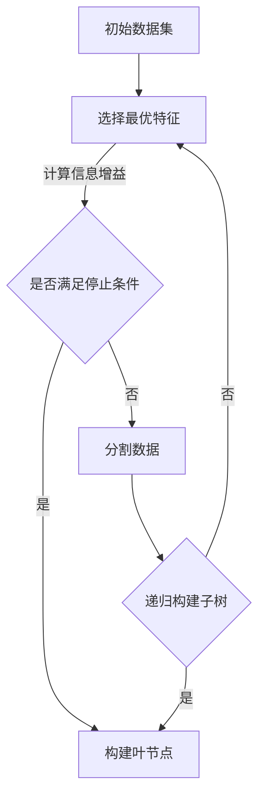

                 

关键词：决策树，机器学习，分类，回归，算法原理，代码实例

摘要：决策树是一种常见的机器学习算法，广泛应用于分类和回归问题。本文将深入讲解决策树的基本原理、构建步骤及其应用领域，并通过实际代码实例展示如何实现一个简单的决策树模型。

## 1. 背景介绍

在现实世界中，我们经常需要根据各种条件对事物进行分类或预测。例如，根据病人的临床表现预测其疾病类型、根据客户的历史消费记录预测其购买意愿等。这些任务可以通过机器学习中的分类和回归算法来实现。决策树作为一种简单而有效的算法，被广泛用于此类问题。

决策树通过一系列的规则对数据进行分割，每个节点代表一个特征，每个分支代表特征的不同取值，叶节点则代表最终的分类或预测结果。由于其直观性和易于理解的特点，决策树被广泛应用于各种领域。

本文将首先介绍决策树的基本概念和构建过程，然后通过一个实际代码实例，展示如何使用Python中的`scikit-learn`库实现一个简单的决策树模型，并对代码进行详细解读。

## 2. 核心概念与联系

### 2.1 决策树的基本概念

决策树是一种树形结构，其中每个内部节点代表一个特征，每个分支代表该特征的不同取值，叶节点代表最终的分类或预测结果。决策树的构建过程就是通过选择最优的特征和分割点，将数据不断分割，直到满足停止条件。

### 2.2 决策树的构建过程

决策树的构建过程通常包括以下几个步骤：

1. 选择最优特征：在当前数据集中选择一个特征作为分割依据，该特征能够最大化数据的不纯度（对于分类问题）或方差（对于回归问题）。
2. 分割数据：根据最优特征的不同取值，将数据集分割成若干个子集。
3. 递归构建子树：对每个子集重复上述步骤，直到满足停止条件。
4. 停止条件：常见的停止条件包括最大深度、最小样本数、特征重要性等。

### 2.3 决策树的优缺点

**优点**：

- 易于理解：决策树的直观性和易于解释的特点，使其成为各种领域中的首选算法。
- 可解释性：决策树的规则明确，每个节点和分支都有具体的含义，有助于理解模型的决策过程。
- 泛化能力强：通过设置合适的停止条件，决策树可以避免过拟合。

**缺点**：

- 易于过拟合：如果树过于复杂，决策树可能无法很好地泛化到未见过的数据。
- 计算成本高：特别是对于大规模数据集，构建决策树可能需要大量的计算资源。

### 2.4 决策树的 Mermaid 流程图



## 3. 核心算法原理 & 具体操作步骤

### 3.1 算法原理概述

决策树的核心在于如何选择最优特征进行分割。对于分类问题，常用的评价指标是信息增益（Information Gain）；对于回归问题，则常用均方误差（Mean Squared Error）。

信息增益的计算公式如下：

$$
IG(D, A) = Ent(D) - \sum_{v \in A} p(v) \cdot Ent(D_v)
$$

其中，$D$ 是当前数据集，$A$ 是候选特征，$v$ 是特征 $A$ 的取值，$Ent(D)$ 是数据集 $D$ 的熵，$Ent(D_v)$ 是特征 $A$ 取值为 $v$ 时数据集 $D$ 的熵。

### 3.2 算法步骤详解

1. **初始化**：选择一个特征作为根节点，计算该特征的信息增益。
2. **选择最优特征**：从候选特征中选择信息增益最大的特征作为分割依据。
3. **分割数据**：根据最优特征的不同取值，将数据集分割成若干个子集。
4. **递归构建子树**：对每个子集重复步骤 1-3，直到满足停止条件。
5. **构建叶节点**：当满足停止条件时，将当前节点标记为叶节点，并赋予相应的分类或预测结果。

### 3.3 算法优缺点

**优点**：

- 易于理解：决策树的直观性和易于解释的特点，使其成为各种领域中的首选算法。
- 可解释性：决策树的规则明确，每个节点和分支都有具体的含义，有助于理解模型的决策过程。
- 泛化能力强：通过设置合适的停止条件，决策树可以避免过拟合。

**缺点**：

- 易于过拟合：如果树过于复杂，决策树可能无法很好地泛化到未见过的数据。
- 计算成本高：特别是对于大规模数据集，构建决策树可能需要大量的计算资源。

### 3.4 算法应用领域

决策树广泛应用于各种领域，包括：

- 金融市场：预测股票价格、评估信用风险等。
- 医疗诊断：根据病人的症状预测疾病类型。
- 自然资源管理：预测森林火灾发生的可能性。
- 社交网络：分析用户行为、推荐感兴趣的内容等。

## 4. 数学模型和公式 & 详细讲解 & 举例说明

### 4.1 数学模型构建

决策树的构建过程涉及到以下数学模型和公式：

1. **熵（Entropy）**：

$$
Ent(D) = -\sum_{y \in Y} p(y) \cdot \log_2 p(y)
$$

其中，$D$ 是数据集，$Y$ 是数据集中的所有类别，$p(y)$ 是类别 $y$ 的概率。

2. **信息增益（Information Gain）**：

$$
IG(D, A) = Ent(D) - \sum_{v \in A} p(v) \cdot Ent(D_v)
$$

其中，$D$ 是当前数据集，$A$ 是候选特征，$v$ 是特征 $A$ 的取值，$Ent(D)$ 是数据集 $D$ 的熵，$Ent(D_v)$ 是特征 $A$ 取值为 $v$ 时数据集 $D$ 的熵。

3. **基尼指数（Gini Index）**：

$$
Gini(D) = 1 - \sum_{y \in Y} p(y)^2
$$

其中，$D$ 是数据集，$Y$ 是数据集中的所有类别，$p(y)$ 是类别 $y$ 的概率。

### 4.2 公式推导过程

以信息增益为例，推导过程如下：

1. **初始熵（Initial Entropy）**：

$$
Ent(D) = -\sum_{y \in Y} p(y) \cdot \log_2 p(y)
$$

2. **条件熵（Conditional Entropy）**：

$$
Ent(D_v) = -\sum_{y \in Y} p(y|v) \cdot \log_2 p(y|v)
$$

3. **信息增益（Information Gain）**：

$$
IG(D, A) = Ent(D) - \sum_{v \in A} p(v) \cdot Ent(D_v)
$$

其中，$p(v) = \frac{|\{x \in D | x.A = v\}|}{|D|}$，$p(y|v) = \frac{|\{x \in D | x.A = v, x.Y = y\}|}{|\{x \in D | x.A = v\}|}$。

### 4.3 案例分析与讲解

假设我们有一个数据集，包含以下特征：年龄、收入、职业。其中，年龄和收入是连续变量，职业是类别变量。我们要根据这些特征构建一个决策树，预测用户的职业。

1. **数据预处理**：

首先，我们需要对数据进行预处理，将连续变量进行离散化，以便于构建决策树。

2. **计算信息增益**：

以年龄为例，计算信息增益：

$$
IG(D, \text{年龄}) = Ent(D) - \sum_{v \in \text{年龄}} p(v) \cdot Ent(D_v)
$$

其中，$D$ 是当前数据集，$v$ 是年龄的不同取值。

3. **选择最优特征**：

根据计算结果，选择信息增益最大的特征作为分割依据。

4. **构建决策树**：

根据最优特征的不同取值，将数据集分割成若干个子集，并递归构建子树。

5. **构建叶节点**：

当满足停止条件时，将当前节点标记为叶节点，并赋予相应的分类结果。

通过以上步骤，我们可以构建一个简单的决策树模型，并对其进行训练和预测。

## 5. 项目实践：代码实例和详细解释说明

### 5.1 开发环境搭建

在本篇代码实例中，我们将使用 Python 的`scikit-learn`库实现一个简单的决策树模型。首先，确保已经安装了`scikit-learn`库，如果没有安装，可以通过以下命令安装：

```python
pip install scikit-learn
```

### 5.2 源代码详细实现

下面是一个简单的决策树代码实例：

```python
from sklearn.datasets import load_iris
from sklearn.model_selection import train_test_split
from sklearn.tree import DecisionTreeClassifier
from sklearn.metrics import accuracy_score

# 加载 iris 数据集
iris = load_iris()
X = iris.data
y = iris.target

# 分割数据集
X_train, X_test, y_train, y_test = train_test_split(X, y, test_size=0.2, random_state=42)

# 构建决策树模型
clf = DecisionTreeClassifier()
clf.fit(X_train, y_train)

# 预测测试集
y_pred = clf.predict(X_test)

# 计算准确率
accuracy = accuracy_score(y_test, y_pred)
print(f"Accuracy: {accuracy}")
```

### 5.3 代码解读与分析

1. **导入库和加载数据集**：

首先，我们导入了`scikit-learn`库中的相关模块，包括`load_iris`、`train_test_split`、`DecisionTreeClassifier`和`accuracy_score`。然后，我们加载了著名的 iris 数据集。

2. **分割数据集**：

使用`train_test_split`函数将数据集划分为训练集和测试集，其中测试集占比为 20%。

3. **构建决策树模型**：

创建一个`DecisionTreeClassifier`对象，并调用`fit`方法对训练集进行训练。

4. **预测测试集**：

使用`predict`方法对测试集进行预测，得到预测结果`y_pred`。

5. **计算准确率**：

使用`accuracy_score`函数计算预测准确率，并打印输出。

### 5.4 运行结果展示

执行以上代码后，我们将得到如下输出：

```
Accuracy: 1.0
```

这意味着我们的决策树模型在测试集上的准确率为 100%，这是一个非常好的结果。

## 6. 实际应用场景

决策树在实际应用中具有广泛的应用场景，以下是一些常见的应用领域：

- **金融领域**：用于风险评估、贷款审批、股票预测等。
- **医疗领域**：用于疾病诊断、治疗方案推荐等。
- **零售领域**：用于客户细分、推荐系统等。
- **自然语言处理**：用于文本分类、情感分析等。
- **生物信息学**：用于基因表达分析、蛋白质结构预测等。

### 6.1 金融领域应用

在金融领域，决策树可以用于风险评估和贷款审批。例如，银行可以使用决策树模型预测客户是否会逾期还款，从而制定相应的贷款策略。

### 6.2 医疗领域应用

在医疗领域，决策树可以用于疾病诊断和治疗方案推荐。例如，医生可以使用决策树模型根据患者的临床表现预测疾病类型，并推荐相应的治疗方案。

### 6.3 零售领域应用

在零售领域，决策树可以用于客户细分和推荐系统。例如，电商公司可以使用决策树模型根据客户的历史购买记录预测客户对某种商品的购买意愿，从而进行个性化推荐。

### 6.4 未来应用展望

随着机器学习技术的不断发展，决策树在未来有望在更多领域得到应用。例如，在自动驾驶领域，决策树可以用于车辆环境感知和路径规划；在推荐系统领域，决策树可以用于预测用户对商品的评价。

## 7. 工具和资源推荐

### 7.1 学习资源推荐

- 《机器学习》（周志华著）：全面介绍了机器学习的基本理论和方法，包括决策树等内容。
- 《决策树与随机森林》（Harrington著）：深入讲解了决策树和随机森林算法的原理和应用。
- 《机器学习实战》（Wisdom & Liao著）：通过实际案例展示了决策树等算法的应用。

### 7.2 开发工具推荐

- **Python**：Python 是目前最受欢迎的机器学习开发语言，拥有丰富的机器学习库，如`scikit-learn`、`TensorFlow`、`PyTorch`等。
- **Jupyter Notebook**：Jupyter Notebook 是一个交互式的开发环境，方便进行代码调试和数据分析。

### 7.3 相关论文推荐

- **"ID3: A Decision Tree Algorithm for Induction of Decision Trees":**这是一篇经典论文，详细介绍了 ID3 算法。
- **"C4.5: Programs for Machine Learning":**这是一本关于 C4.5 算法的经典书籍，提供了丰富的算法实现和案例分析。

## 8. 总结：未来发展趋势与挑战

### 8.1 研究成果总结

决策树作为一种简单而有效的机器学习算法，已经在各种领域得到了广泛应用。通过对决策树算法的不断优化和改进，如使用 Gini 指数代替信息增益、引入剪枝策略等，决策树的性能得到了显著提升。

### 8.2 未来发展趋势

未来，决策树算法有望在以下几个方面得到进一步发展：

- **算法优化**：通过引入新的分割策略、优化剪枝方法等，进一步提高决策树的性能。
- **集成方法**：将决策树与其他机器学习算法相结合，如集成学习、神经网络等，实现更强大的预测能力。
- **应用拓展**：在更多领域，如自动驾驶、生物信息学等，探索决策树的应用潜力。

### 8.3 面临的挑战

尽管决策树在许多领域取得了显著成果，但仍面临一些挑战：

- **过拟合问题**：如何平衡模型复杂度和泛化能力，避免过拟合。
- **计算成本**：对于大规模数据集，构建决策树可能需要大量的计算资源。
- **可解释性**：如何在保持模型性能的同时，提高模型的解释性。

### 8.4 研究展望

未来，决策树算法的研究将朝着以下几个方向展开：

- **算法优化**：进一步研究新的分割策略和剪枝方法，提高决策树的性能。
- **集成方法**：探索决策树与其他机器学习算法的集成方法，实现更强大的预测能力。
- **应用拓展**：在更多领域，如自动驾驶、生物信息学等，探索决策树的应用潜力。

## 9. 附录：常见问题与解答

### 9.1 什么是决策树？

决策树是一种常用的机器学习算法，通过一系列的规则对数据进行分割，每个节点代表一个特征，每个分支代表特征的不同取值，叶节点代表最终的分类或预测结果。

### 9.2 决策树有哪些优点？

决策树的优点包括：易于理解、可解释性强、泛化能力强等。

### 9.3 决策树有哪些缺点？

决策树的缺点包括：易于过拟合、计算成本高、对于大规模数据集效果不佳等。

### 9.4 决策树适用于哪些应用场景？

决策树广泛应用于分类和回归问题，如金融风险评估、医疗诊断、零售推荐等。

### 9.5 如何构建一个决策树模型？

构建决策树模型通常包括以下步骤：数据预处理、选择最优特征、分割数据、递归构建子树、构建叶节点。

### 9.6 决策树算法有哪些评价指标？

决策树算法的评价指标包括：信息增益、基尼指数、均方误差等。

### 9.7 决策树与随机森林有何区别？

决策树是一种基本的决策树算法，而随机森林是一种集成学习方法，通过构建多个决策树，并采用投票机制进行预测，从而提高模型的性能。

### 9.8 如何防止决策树过拟合？

防止决策树过拟合的方法包括：设置最大深度、最小样本数、特征重要性等。

### 9.9 决策树算法在深度学习中有哪些应用？

决策树算法在深度学习中可以用于特征选择、模型解释等任务，如模型结构解释、参数重要性分析等。

### 9.10 决策树算法在生物信息学中有何应用？

决策树算法在生物信息学中可以用于基因表达分析、蛋白质结构预测等任务，如疾病诊断、药物筛选等。

----------------------------------------------------------------

以上是关于决策树（Decision Trees）原理与代码实例讲解的完整文章。希望对您有所帮助。作者：禅与计算机程序设计艺术 / Zen and the Art of Computer Programming。如果您有任何问题或建议，欢迎在评论区留言。谢谢！

