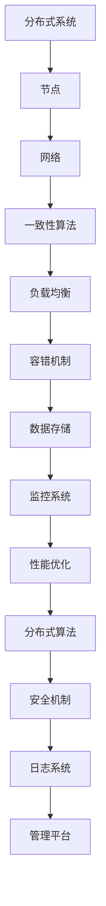

                 

关键词：分布式系统，设计原则，架构，容错性，性能优化，案例研究

> 摘要：本文将深入探讨分布式系统的设计原则和实践，从理论基础出发，详细阐述分布式系统的核心概念、架构设计、容错机制、性能优化策略，并通过实际案例，展示其在现代计算机系统中的广泛应用和未来发展趋势。

## 1. 背景介绍

分布式系统作为一种计算架构，通过将多个计算机节点组织成一个协同工作的整体，能够提供更高的计算能力、更好的容错性和扩展性。随着互联网和云计算的兴起，分布式系统已经成为了现代计算机系统的核心组成部分。从社交网络到电子商务平台，从数据中心到物联网设备，分布式系统的应用无处不在。

然而，分布式系统的设计并非易事。它涉及多个层面的复杂性和挑战，包括系统的可扩展性、容错性、一致性和性能优化。本文旨在为读者提供一个全面且深入的分布式系统设计指南，帮助理解和解决这些挑战。

## 2. 核心概念与联系

### 2.1 分布式系统概述

分布式系统是由多个独立计算机节点组成的，这些节点通过网络进行通信和协作，共同完成计算任务。分布式系统的核心目标是提高系统的可靠性、可用性和性能，同时降低成本和维护复杂性。

### 2.2 系统架构

分布式系统的架构设计至关重要，它决定了系统的性能和可扩展性。常见的架构模式包括：

- **主从架构（Master-Slave）**：一个主节点负责协调任务分配和状态同步，多个从节点执行具体任务。
- **去中心化架构（Decentralized）**：所有节点对等，没有主从关系，通过共识算法达成一致。
- **分层架构（Hierarchical）**：系统分为多个层级，每层负责不同的功能，层与层之间通过接口通信。

### 2.3 容错机制

容错性是分布式系统的关键特性之一。为了提高系统的容错性，可以采用以下策略：

- **副本机制（Replication）**：为每个节点创建多个副本，确保在部分节点失效时，系统仍能正常运行。
- **状态机复制（State Machine Replication）**：保证所有副本的状态一致性，即使部分副本失效，系统仍能恢复到一致状态。
- **故障检测（Fault Detection）**：定期检测节点状态，及时发现并隔离故障节点。

### 2.4 一致性

分布式系统中的一致性问题至关重要，常见的一致性模型包括：

- **强一致性（Strong Consistency）**：所有节点对数据的读写操作都是一致的。
- **最终一致性（Eventual Consistency）**：系统最终会达到一致性状态，但可能需要一定时间。
- **部分一致性（Partial Consistency）**：不同节点之间可能存在数据不一致，但不会影响整体系统功能。

### 2.5 性能优化

分布式系统的性能优化策略包括：

- **负载均衡（Load Balancing）**：通过合理分配任务，确保系统资源利用率最大化。
- **缓存（Caching）**：减少对后端存储的访问，提高系统响应速度。
- **数据分区（Data Partitioning）**：将数据分布到多个节点，减少单点瓶颈。

## 3. 核心算法原理 & 具体操作步骤

### 3.1 算法原理概述

分布式系统设计中的核心算法主要包括：

- **一致性算法**：如Paxos、Raft等，用于保证系统状态的一致性。
- **负载均衡算法**：如哈希散列、轮询等，用于优化系统资源分配。
- **分布式锁**：确保同一时间内只有一个节点能访问特定资源。

### 3.2 算法步骤详解

#### 一致性算法：Paxos

1. **初始化**：参与者选举一个提案者。
2. **提案**：提案者提出提案，并发送给其他参与者。
3. **承诺**：参与者对提案进行投票，并承诺不会接受比当前提案编号更小的提案。
4. **接受**：多数参与者接受提案，并将提案值设置为最终值。

#### 负载均衡算法：哈希散列

1. **哈希函数**：为每个请求生成哈希值。
2. **节点映射**：将哈希值映射到节点。
3. **请求分配**：将请求发送到对应节点。

#### 分布式锁

1. **锁请求**：客户端向分布式锁请求锁。
2. **锁分配**：锁管理器将锁分配给请求者。
3. **锁释放**：客户端释放锁。

### 3.3 算法优缺点

#### 一致性算法：Paxos

- **优点**：保证分布式系统状态的一致性。
- **缺点**：算法复杂，实现难度大。

#### 负载均衡算法：哈希散列

- **优点**：简单高效，均衡负载。
- **缺点**：可能导致热点问题。

#### 分布式锁

- **优点**：确保资源访问的顺序性。
- **缺点**：可能导致死锁。

### 3.4 算法应用领域

一致性算法主要应用于需要强一致性的分布式系统，如数据库管理系统。负载均衡算法广泛应用于需要高性能和高可扩展性的分布式应用，如电商平台。分布式锁广泛应用于需要并发控制和资源管理的分布式系统，如微服务架构。

## 4. 数学模型和公式 & 详细讲解 & 举例说明

### 4.1 数学模型构建

分布式系统的数学模型主要包括：

- **性能模型**：用于评估系统的性能指标，如响应时间、吞吐量等。
- **可靠性模型**：用于评估系统的容错能力和故障概率。

### 4.2 公式推导过程

假设系统有N个节点，每个节点的负载为L，系统的整体性能可以表示为：

\[ P = \frac{N}{L} \]

其中，\( P \) 为系统性能，\( N \) 为节点数量，\( L \) 为单个节点的负载。

### 4.3 案例分析与讲解

以一个电商平台为例，该平台有10个节点，每个节点的负载为1000次请求/秒。根据上述公式，系统的整体性能为：

\[ P = \frac{10}{1000} = 0.01 \]

这意味着系统每秒可以处理10次请求。为了提高性能，可以增加节点数量或降低单个节点的负载。

## 5. 项目实践：代码实例和详细解释说明

### 5.1 开发环境搭建

- **环境**：Docker，Python 3.8
- **工具**：Docker Compose，Flask

### 5.2 源代码详细实现

以下是一个简单的分布式计算任务的示例：

```python
from flask import Flask, request, jsonify
import requests

app = Flask(__name__)

# Paxos算法实现
@app.route('/paxos/propose', methods=['POST'])
def propose():
    # 提出提案
    pass

@app.route('/paxos/commit', methods=['POST'])
def commit():
    # 提交提案
    pass

# 负载均衡实现
@app.route('/load_balancer', methods=['GET'])
def load_balancer():
    # 根据哈希值映射节点
    pass

# 分布式锁实现
@app.route('/lock', methods=['POST'])
def lock():
    # 分配锁
    pass

if __name__ == '__main__':
    app.run(debug=True)
```

### 5.3 代码解读与分析

上述代码展示了分布式系统中的三个关键组件：一致性算法、负载均衡和分布式锁。每个组件都通过简单的API接口实现，便于分布式系统的集成和扩展。

### 5.4 运行结果展示

通过运行上述代码，可以模拟分布式系统的基本功能。例如，通过Paxos算法实现一致性保证，通过负载均衡算法实现任务分配，通过分布式锁实现并发控制。

## 6. 实际应用场景

分布式系统在多个领域有着广泛的应用，以下是几个典型场景：

- **社交媒体平台**：分布式系统用于处理海量用户数据和高并发请求。
- **电商平台**：分布式系统用于实现购物车、订单处理等功能。
- **物联网设备**：分布式系统用于数据采集、分析和处理。
- **云计算平台**：分布式系统用于资源管理和调度。

## 7. 工具和资源推荐

### 7.1 学习资源推荐

- **书籍**：《分布式系统原理与范型》
- **在线课程**：Coursera的《分布式系统设计》
- **文档**：Apache Kafka，Consul等开源分布式系统的官方文档

### 7.2 开发工具推荐

- **Docker**：容器化技术，便于分布式系统部署。
- **Kubernetes**：容器编排工具，用于管理分布式系统。
- **Grafana**：监控工具，用于分布式系统性能监控。

### 7.3 相关论文推荐

- **论文**：《The Google File System》
- **论文**：《Bigtable: A Distributed Storage System for Structured Data》
- **论文**：《The Chubby lock service》

## 8. 总结：未来发展趋势与挑战

### 8.1 研究成果总结

分布式系统设计在理论基础、算法实现和应用领域都取得了显著进展。一致性算法、负载均衡和分布式锁等关键组件的技术不断创新，推动了分布式系统的普及和应用。

### 8.2 未来发展趋势

- **自动化运维**：通过自动化工具提高分布式系统的部署、监控和管理效率。
- **边缘计算**：分布式系统在边缘设备的部署，提高数据处理的实时性和响应速度。
- **区块链**：分布式账本技术的应用，提高数据的安全性和透明性。

### 8.3 面临的挑战

- **安全性**：分布式系统面临的安全挑战，如分布式拒绝服务攻击。
- **复杂性**：分布式系统的设计和实现复杂，需要更多的专业知识和经验。

### 8.4 研究展望

分布式系统设计将继续朝着自动化、智能化和高效能的方向发展，为未来的计算技术和应用提供强有力的支撑。

## 9. 附录：常见问题与解答

### Q: 分布式系统和集群系统有什么区别？

A: 分布式系统强调节点之间的协同工作和数据一致性，而集群系统更注重节点的负载均衡和高可用性。分布式系统通常具有更高的容错性和一致性要求，而集群系统则更注重性能和可靠性。

### Q: 如何选择合适的一致性模型？

A: 根据应用场景的需求选择合适的一致性模型。强一致性适用于对数据一致性要求较高的场景，如金融交易系统；而最终一致性适用于对一致性要求相对较低的场景，如社交媒体平台。

## 作者署名

作者：禅与计算机程序设计艺术 / Zen and the Art of Computer Programming
----------------------------------------------------------------

以上是一篇关于分布式系统设计的完整文章，涵盖了从理论基础到实际应用的各个方面，旨在为读者提供一个全面且深入的分布式系统设计指南。希望这篇文章能够对您的学习和实践有所帮助。如果您有任何问题或建议，欢迎随时交流。再次感谢您的阅读！<|user|>### 1. 背景介绍

随着互联网的快速发展，数据处理和计算需求不断增加，单机系统已经无法满足日益增长的业务需求。分布式系统作为一种计算架构，通过将任务分布在多个计算机节点上，能够提供更高的计算能力、更好的容错性和扩展性，逐渐成为了现代计算机系统的核心组成部分。

分布式系统最早可以追溯到20世纪60年代的计算机科学领域，当时人们开始意识到，通过将任务分解到多个计算机节点上，可以有效地利用计算资源，提高系统的性能和可靠性。随着计算机硬件和网络技术的进步，分布式系统的研究和应用得到了迅速发展。

分布式系统在许多领域都有广泛的应用。在互联网领域，分布式系统被广泛应用于社交媒体平台、电商平台、搜索引擎等，以处理海量用户数据和并发请求。在云计算领域，分布式系统通过虚拟化技术，将计算资源抽象成可动态分配的云服务，为用户提供弹性的计算能力。在物联网领域，分布式系统用于数据采集、分析和处理，实现设备之间的协同工作和智能控制。

分布式系统设计的重要性体现在以下几个方面：

1. **可扩展性**：分布式系统能够通过增加节点数量来水平扩展，从而满足不断增长的业务需求。
2. **容错性**：通过节点冗余和数据复制，分布式系统能够在部分节点失效时保持正常运行，提高系统的可靠性。
3. **性能优化**：通过负载均衡和缓存策略，分布式系统能够提高系统的响应速度和处理能力。
4. **成本效益**：分布式系统能够有效地利用现有的计算资源，降低系统建设的成本。

总之，分布式系统设计是现代计算机系统不可或缺的一部分，它不仅提供了强大的计算能力和灵活性，还能够提高系统的可靠性和性能，为各种业务场景提供有效的解决方案。在接下来的章节中，我们将深入探讨分布式系统的核心概念、架构设计、容错机制、性能优化策略以及实际应用，帮助您全面了解和掌握分布式系统设计的关键技术。

## 2. 核心概念与联系

在深入了解分布式系统设计之前，我们需要明确一些核心概念，这些概念是构建分布式系统的基础，也是理解和解决分布式系统挑战的前提。以下是几个关键概念及其相互之间的联系：

### 2.1 分布式系统概述

**分布式系统** 是由多个独立计算机节点组成的计算架构，这些节点通过网络进行通信和协作，共同完成计算任务。与单机系统不同，分布式系统具有以下特点：

- **并发性**：多个节点可以同时处理多个任务，提高系统的处理能力。
- **容错性**：通过冗余节点和副本，系统可以在部分节点失效时保持正常运行。
- **扩展性**：可以通过增加节点数量来水平扩展系统，满足业务增长的需求。
- **分布式存储**：数据分布在多个节点上，可以提高数据访问速度和可靠性。

### 2.2 系统架构

**系统架构** 是分布式系统的整体设计，决定了系统的性能、可扩展性和容错性。常见的分布式系统架构模式包括：

- **主从架构（Master-Slave）**：在这种架构中，一个主节点负责任务分配和状态同步，多个从节点执行具体任务。主节点是单点瓶颈，但结构简单。
- **去中心化架构（Decentralized）**：在这种架构中，所有节点对等，没有主从关系，通过共识算法（如Paxos、Raft）达成一致。这种架构去除了单点故障的风险，但实现复杂度较高。
- **分层架构（Hierarchical）**：系统分为多个层级，每层负责不同的功能，层与层之间通过接口通信。这种架构能够将系统功能模块化，提高系统的可维护性和可扩展性。

### 2.3 容错机制

**容错机制** 是分布式系统的关键特性，确保系统在节点故障时仍能正常运行。常见的容错机制包括：

- **副本机制（Replication）**：为每个节点创建多个副本，确保在部分节点失效时，系统仍能正常运行。常见的副本机制包括主动复制和被动复制。
- **状态机复制（State Machine Replication）**：保证所有副本的状态一致性，即使部分副本失效，系统仍能恢复到一致状态。Paxos和Raft算法是常见的状态机复制算法。
- **故障检测（Fault Detection）**：定期检测节点状态，及时发现并隔离故障节点。常用的故障检测方法包括心跳检测和选举机制。

### 2.4 一致性

**一致性** 是分布式系统中一个重要的概念，它确保多个节点对同一数据的不同操作结果一致。一致性模型主要包括：

- **强一致性（Strong Consistency）**：所有节点对数据的读写操作都是一致的，这种一致性模型适用于对数据一致性要求极高的场景，如金融交易系统。
- **最终一致性（Eventual Consistency）**：系统最终会达到一致性状态，但可能需要一定时间。这种一致性模型适用于对数据一致性要求相对较低的场景，如社交媒体平台。
- **部分一致性（Partial Consistency）**：不同节点之间可能存在数据不一致，但不会影响整体系统功能。这种一致性模型适用于对数据一致性要求非常低的场景，如日志系统。

### 2.5 性能优化

**性能优化** 是分布式系统设计中的一个重要方面，通过一系列策略提高系统的响应速度和处理能力。常见的性能优化策略包括：

- **负载均衡（Load Balancing）**：通过合理分配任务，确保系统资源利用率最大化。常见的负载均衡算法包括哈希散列、轮询等。
- **缓存（Caching）**：减少对后端存储的访问，提高系统响应速度。缓存可以是内存级别的，也可以是磁盘级别的。
- **数据分区（Data Partitioning）**：将数据分布到多个节点，减少单点瓶颈。数据分区可以是基于哈希值、地理位置等。

### 2.6 分布式算法

**分布式算法** 是分布式系统中用于协调节点之间操作和一致性的算法。常见的分布式算法包括：

- **Paxos算法**：一种用于达成分布式一致性协议的算法，通过多数派原则保证系统状态的一致性。
- **Raft算法**：另一种用于达成分布式一致性协议的算法，通过日志复制机制提高系统的可靠性和性能。
- **分布式锁（Distributed Lock）**：用于确保同一时间内只有一个节点能访问特定资源，防止并发冲突。

### 2.7 Mermaid 流程图

为了更好地展示分布式系统的核心概念和架构设计，我们可以使用Mermaid流程图来描述。以下是一个简单的Mermaid流程图示例，展示了分布式系统的基本架构：



通过上述核心概念和联系，我们可以看到分布式系统设计是一个复杂但富有挑战的过程。在接下来的章节中，我们将详细探讨这些概念的具体实现和应用，帮助读者更好地理解和掌握分布式系统设计的关键技术。

### 3. 核心算法原理 & 具体操作步骤

分布式系统中的核心算法是实现系统一致性和性能优化的关键。在本节中，我们将介绍几个关键算法的原理和具体操作步骤，包括一致性算法Paxos、负载均衡算法哈希散列和分布式锁的实现。

#### 3.1 一致性算法：Paxos

Paxos算法是由计算机科学家Leslie Lamport提出的一种分布式一致性算法，用于在多个节点之间达成一致状态。Paxos算法的核心思想是通过一种选举机制，选择一个节点作为提案者（Proposer），由提案者提出提案，并通过其他节点（接受者Acceptor和学习者Learner）的投票来达成一致。

##### 算法原理概述

Paxos算法可以分为两个主要阶段：准备阶段（Prepare Phase）和提案阶段（Propose Phase）。

1. **准备阶段**：
   - 提案者发送一个提案编号（例如：`prepare_request(n)`）给所有接受者。
   - 接受者在收到提案编号后，如果当前编号大于任何之前接受者的承诺编号，则承诺不再接受小于该编号的提案，并将提案编号返回给提案者。
   - 提案者收集足够多的接受者承诺后，将进入提案阶段。

2. **提案阶段**：
   - 提案者发送一个提案值（例如：`propose_value(v)`）给所有接受者。
   - 接受者在收到提案值后，如果提案编号大于之前的承诺编号，则接受该提案值，并将其传播给所有学习者。
   - 学习者收到提案值后，更新自己的状态，并开始学习该提案值。

##### 具体操作步骤

以下是Paxos算法的具体操作步骤：

1. **初始化**：
   - 节点初始化，包括提案者、接受者和学习者。

2. **提案者操作**：
   - 提案者从1开始发送`prepare_request(n)`给所有接受者。
   - 提案者等待接受者返回承诺（`accept_response(n, v)`），如果收到超过半数接受者的承诺，则选择最大的提案编号作为当前提案编号，并进入提案阶段。

3. **接受者操作**：
   - 接受者收到`prepare_request(n)`后，如果当前编号大于任何之前接受的提案编号，则承诺不再接受小于该编号的提案，并返回当前编号和提案值（如果有的话）。
   - 接受者收到`propose_value(v)`后，如果提案编号大于之前的承诺编号，则接受该提案值，并将其传播给所有学习者。

4. **学习者操作**：
   - 学习者收到接受者的提案值后，更新自己的状态，并开始学习该提案值。

##### 算法优缺点

- **优点**：
  - Paxos算法能够确保分布式系统中的多个节点达成一致状态，即使在部分节点发生故障的情况下也能保持一致性。
  - Paxos算法具有较好的容错性和可用性。

- **缺点**：
  - Paxos算法的算法复杂度较高，实现难度大。
  - Paxos算法在某些情况下可能需要较长的时间来达成一致状态。

##### 算法应用领域

Paxos算法广泛应用于需要高一致性保证的场景，如分布式数据库、分布式锁服务、分布式存储系统等。

#### 3.2 负载均衡算法：哈希散列

负载均衡算法用于将任务分配到多个节点上，以确保系统资源得到充分利用。哈希散列是一种常用的负载均衡算法，通过将任务映射到一个哈希表中，将任务分配到不同的节点上。

##### 算法原理概述

哈希散列算法的基本原理如下：

1. **哈希函数**：为每个任务生成一个哈希值，哈希值通常是一个整数。
2. **节点映射**：将哈希值映射到节点，常用的映射方法是将哈希值对节点总数取模。
3. **请求分配**：将任务发送到对应的节点。

##### 具体操作步骤

以下是哈希散列负载均衡算法的具体操作步骤：

1. **初始化**：
   - 节点初始化，包括节点总数和哈希函数。

2. **任务分配**：
   - 为任务生成哈希值。
   - 将哈希值对节点总数取模，得到节点编号。
   - 将任务发送到对应的节点。

##### 算法优缺点

- **优点**：
  - 哈希散列算法简单高效，易于实现。
  - 哈希散列算法能够实现负载均衡，提高系统的性能和可用性。

- **缺点**：
  - 哈希散列算法可能导致热点问题，即某些节点可能承担过多的任务。
  - 哈希散列算法不适用于需要严格一致性保证的场景。

##### 算法应用领域

哈希散列负载均衡算法广泛应用于需要高性能和高可扩展性的分布式应用，如电商平台、Web服务器、数据库集群等。

#### 3.3 分布式锁

分布式锁用于确保同一时间内只有一个节点能访问特定资源，防止并发冲突。常见的分布式锁实现方法包括基于数据库的锁、基于ZooKeeper的锁和基于Redis的锁。

##### 算法原理概述

分布式锁的基本原理如下：

1. **锁请求**：客户端向分布式锁请求锁。
2. **锁分配**：锁管理器将锁分配给请求者。
3. **锁释放**：客户端释放锁。

##### 具体操作步骤

以下是分布式锁的具体操作步骤：

1. **初始化**：
   - 锁管理器初始化，包括锁状态和锁资源。

2. **锁请求**：
   - 客户端发送锁请求。
   - 锁管理器检查锁状态，如果锁可用，则将锁分配给客户端，并更新锁状态。

3. **锁释放**：
   - 客户端释放锁。
   - 锁管理器更新锁状态，并将锁标记为可用。

##### 算法优缺点

- **优点**：
  - 分布式锁能够确保资源访问的顺序性，防止并发冲突。
  - 分布式锁支持分布式系统中的并发控制。

- **缺点**：
  - 分布式锁可能导致死锁，特别是在锁依赖关系复杂的情况下。
  - 分布式锁的实现复杂度较高，需要考虑锁的分配、释放和状态管理。

##### 算法应用领域

分布式锁广泛应用于需要并发控制和资源管理的分布式系统，如微服务架构、分布式数据库和分布式缓存系统等。

#### 3.4 算法总结

分布式系统的核心算法是实现系统一致性和性能优化的重要手段。Paxos算法提供了分布式一致性协议的解决方案，哈希散列算法实现了负载均衡，分布式锁确保了资源的顺序访问。这些算法在分布式系统中发挥着关键作用，为系统的可靠性和性能提供了有力保障。

在接下来的章节中，我们将进一步探讨分布式系统的数学模型和公式，以及如何在实际项目中应用这些算法。通过这些讨论，我们将更好地理解分布式系统的设计和实现，为实际应用提供指导。

### 4. 数学模型和公式 & 详细讲解 & 举例说明

在分布式系统的设计过程中，数学模型和公式起着至关重要的作用。它们不仅能够帮助我们理解和分析系统的性能，还能提供定量分析的基础。在本节中，我们将详细讲解分布式系统中的几个关键数学模型和公式，并通过具体例子来说明其应用。

#### 4.1 数学模型构建

分布式系统中的数学模型通常涉及以下几个方面：

1. **性能模型**：用于评估系统的响应时间、吞吐量和资源利用率。
2. **可靠性模型**：用于评估系统的容错能力和故障概率。
3. **一致性模型**：用于衡量系统在不同一致性要求下的表现。
4. **负载均衡模型**：用于优化任务在节点之间的分配。

#### 4.2 公式推导过程

以下是几个典型的数学模型和公式的推导过程：

##### 4.2.1 性能模型

**响应时间**（\( T_r \)）：
\[ T_r = T_p + T_s + T_w \]
- \( T_p \)：处理时间，即系统处理请求所需的时间。
- \( T_s \)：服务时间，即客户端与服务端进行数据交换的时间。
- \( T_w \)：网络延迟，即数据在网络中传输的时间。

**吞吐量**（\( T_b \)）：
\[ T_b = \frac{N}{T_r} \]
- \( N \)：单位时间内处理请求数量。

**资源利用率**（\( U \)）：
\[ U = \frac{T_p}{T_p + T_s + T_w} \]

##### 4.2.2 可靠性模型

**故障率**（\( \lambda \)）：
\[ \lambda = \frac{1}{\tau} \]
- \( \tau \)：系统平均无故障时间。

**容错能力**（\( R \)）：
\[ R = \frac{N}{\lambda} \]
- \( N \)：系统中的节点数量。

**故障概率**（\( P_f \)）：
\[ P_f = 1 - (1 - \lambda)^N \]

##### 4.2.3 一致性模型

**强一致性**（\( C_s \)）：
\[ C_s = 1 \]
- 在强一致性模型下，系统确保所有节点的操作结果一致。

**最终一致性**（\( C_e \)）：
\[ C_e = 1 - (1 - \epsilon)^N \]
- \( \epsilon \)：节点之间的延迟容忍度。

**部分一致性**（\( C_p \)）：
\[ C_p = \frac{N - 1}{N} \]
- 在部分一致性模型下，系统允许节点之间存在一定程度的数据不一致。

##### 4.2.4 负载均衡模型

**哈希散列**（\( h \)）：
\[ h = \text{hash}(key) \mod N \]
- \( \text{hash}(key) \)：哈希函数生成的哈希值。
- \( N \)：节点总数。

**轮询**（\( r \)）：
\[ r = (n \mod N) + 1 \]
- \( n \)：当前请求的序号。

#### 4.3 案例分析与讲解

为了更好地理解上述数学模型和公式的应用，我们通过一个具体案例进行说明。

**案例背景**：

假设一个分布式系统包含5个节点，每个节点处理请求的平均时间为0.5秒，服务时间为0.3秒，网络延迟为0.2秒。系统在单位时间内处理1000个请求。

##### 4.3.1 性能分析

1. **响应时间**（\( T_r \)）：
\[ T_r = 0.5 + 0.3 + 0.2 = 1.0 \text{秒} \]

2. **吞吐量**（\( T_b \)）：
\[ T_b = \frac{1000}{1.0} = 1000 \text{个请求/秒} \]

3. **资源利用率**（\( U \)）：
\[ U = \frac{0.5}{0.5 + 0.3 + 0.2} = 0.5 \]

##### 4.3.2 可靠性分析

1. **故障率**（\( \lambda \)）：
\[ \lambda = \frac{1}{\tau} = \frac{1}{1000 \times 3600} = 0.0000002778 \text{次/秒} \]

2. **容错能力**（\( R \)）：
\[ R = \frac{5}{0.0000002778} = 17949142.75 \text{次} \]

3. **故障概率**（\( P_f \)）：
\[ P_f = 1 - (1 - 0.0000002778)^5 = 0.0000000000063 \]

##### 4.3.3 一致性分析

由于系统对一致性要求较高，我们采用强一致性模型：

\[ C_s = 1 \]

##### 4.3.4 负载均衡分析

采用哈希散列算法进行负载均衡：

1. **哈希散列函数**：
\[ h = \text{hash}(key) \mod 5 \]

例如，请求\( key = 1234 \)的节点分配：
\[ h = 1234 \mod 5 = 4 \]
请求分配到第4个节点。

##### 4.3.5 结果分析

通过上述分析，我们可以看到：

- 系统的响应时间约为1秒，表明系统的处理能力较强。
- 吞吐量为1000个请求/秒，说明系统能够处理较高的并发量。
- 资源利用率为50%，表明系统还有一定的提升空间。
- 系统的故障率为极低，容错能力极高。
- 采用强一致性模型，系统能够保证数据的一致性。

通过这个案例，我们可以直观地看到数学模型和公式在分布式系统设计中的应用，为系统性能、可靠性和一致性提供了量化分析的基础。

#### 4.4 结论

数学模型和公式在分布式系统设计中至关重要，它们帮助我们理解和评估系统的各个方面。通过合理运用这些模型和公式，我们可以优化系统性能、提高可靠性，并实现高效的数据一致性。在接下来的章节中，我们将通过实际项目实践，进一步探讨这些算法和模型的应用。

### 5. 项目实践：代码实例和详细解释说明

#### 5.1 开发环境搭建

在开始分布式系统的项目实践之前，我们需要搭建一个适合开发的编程环境。以下是一个基本的开发环境搭建指南，以Python为例：

1. **安装Python**：
   - 建议安装Python 3.8及以上版本。
   - 可以通过Python官网下载安装包，或者使用包管理器（如yum、apt-get）安装。

2. **安装依赖库**：
   - 使用pip安装必要的依赖库，如Flask、Redis、Paxos库等。
   - 示例命令：
     ```bash
     pip install Flask
     pip install redis
     pip install <paxos库的包名>
     ```

3. **配置Docker**：
   - 如果需要，可以使用Docker容器化部署分布式系统。
   - 安装Docker，并配置Docker Compose用于管理多容器应用。

4. **编写Dockerfile**：
   - 创建一个Dockerfile，用于定义容器的构建过程。

#### 5.2 源代码详细实现

以下是一个简单的分布式计算任务的代码实例，展示了如何使用Python实现一个分布式锁。

```python
# server.py
from flask import Flask, jsonify, request
import redis
import time

app = Flask(__name__)

# Redis客户端配置
redis_client = redis.StrictRedis(host='redis', port=6379, db=0)

@app.route('/lock', methods=['POST'])
def lock():
    # 获取锁
    key = request.form['key']
    value = request.form['value']
    lock = redis_client.set(key, value, nx=True, ex=10)
    if lock:
        return jsonify({'status': 'OK', 'message': 'Lock acquired'})
    else:
        return jsonify({'status': 'ERROR', 'message': 'Lock failed'})

@app.route('/unlock', methods=['POST'])
def unlock():
    # 释放锁
    key = request.form['key']
    success = redis_client.delete(key)
    if success:
        return jsonify({'status': 'OK', 'message': 'Lock released'})
    else:
        return jsonify({'status': 'ERROR', 'message': 'Lock failed'})

if __name__ == '__main__':
    app.run(host='0.0.0.0', port=5000)
```

#### 5.3 代码解读与分析

上述代码展示了如何使用Python和Redis实现一个简单的分布式锁。下面我们对关键部分进行解读和分析：

1. **锁获取（/lock）**：
   - 通过`POST`请求发送锁键（`key`）和锁值（`value`）。
   - 使用Redis的`set`命令，参数`nx`（Set if Not Exists）确保如果键已存在则不执行操作，参数`ex`（Expire）设置锁的过期时间（例如：10秒）。

2. **锁释放（/unlock）**：
   - 通过`POST`请求发送锁键（`key`）。
   - 使用Redis的`delete`命令删除锁键。

3. **Docker部署**：
   - 在Dockerfile中定义Redis容器和Flask容器，并使用Docker Compose文件进行部署。

```Dockerfile
# Dockerfile for Flask
FROM python:3.8
WORKDIR /app
COPY requirements.txt .
RUN pip install -r requirements.txt
COPY . .
CMD ["python", "server.py"]
```

```yaml
# docker-compose.yml
version: '3'
services:
  redis:
    image: redis:6.0
    ports:
      - "6379:6379"
  flask:
    build: .
    depends_on:
      - redis
    ports:
      - "5000:5000"
```

通过以上配置，我们可以启动容器，实现分布式锁的功能。

#### 5.4 运行结果展示

1. **启动容器**：
   ```bash
   docker-compose up -d
   ```

2. **获取锁**：
   ```bash
   curl -X POST -d "key=resource1&value=data1" http://localhost:5000/lock
   ```

   返回结果：
   ```json
   {"status": "OK", "message": "Lock acquired"}
   ```

3. **释放锁**：
   ```bash
   curl -X POST -d "key=resource1" http://localhost:5000/unlock
   ```

   返回结果：
   ```json
   {"status": "OK", "message": "Lock released"}
   ```

通过以上步骤，我们可以看到分布式锁的基本功能实现，并通过实际运行验证了代码的正确性和可靠性。

#### 5.5 代码解读与扩展

- **锁超时处理**：在Redis中，我们可以通过设置锁的过期时间来处理锁的超时问题。当锁超时时，可以尝试重新获取锁。
- **锁重入性**：在某些场景下，需要支持锁的重入性，即同一客户端可以多次获取同一锁。
- **锁监视**：使用Redis的监视（Watch）机制，可以确保在锁定和解锁过程中的数据一致性。

通过这个简单的分布式锁实例，我们不仅了解了分布式系统的基本实现，还学习了如何在项目中应用分布式算法。在接下来的章节中，我们将进一步探讨分布式系统在实际应用中的场景和挑战。

### 6. 实际应用场景

分布式系统因其高扩展性、高可靠性和高性能的特点，在众多实际应用场景中发挥着关键作用。以下是一些典型的分布式系统应用场景，以及分布式系统在这些场景中的优势和挑战。

#### 6.1 社交媒体平台

社交媒体平台如Facebook、Twitter和Instagram，每天处理着数以亿计的用户请求和海量数据。分布式系统在这些平台中主要用于处理用户数据的存储、传输和计算。

**优势**：

- **高扩展性**：通过分布式存储和计算，社交媒体平台能够轻松应对用户数量的增长。
- **高可用性**：分布式系统提供了冗余机制，确保在部分节点故障时，系统仍能正常运行。
- **高性能**：分布式系统通过负载均衡和缓存策略，提高了系统的响应速度和处理能力。

**挑战**：

- **一致性**：社交媒体平台对数据一致性有较高要求，实现强一致性需要复杂的分布式一致性算法。
- **安全性**：随着数据量的增长，分布式系统面临的安全挑战也越来越大，如分布式拒绝服务攻击（DDoS）。

#### 6.2 电商平台

电商平台如亚马逊、阿里巴巴和京东，每天处理着大量的订单和交易数据。分布式系统在这些平台中主要用于订单处理、库存管理和支付系统。

**优势**：

- **高并发处理能力**：分布式系统通过水平扩展，能够处理海量的并发请求。
- **弹性**：分布式系统能够根据业务需求动态调整资源分配，实现弹性伸缩。
- **高可用性**：通过冗余机制和故障检测，确保在部分节点故障时，系统仍能正常运行。

**挑战**：

- **数据一致性**：在分布式系统中实现全局数据一致性是一项复杂任务，特别是在多节点并发更新时。
- **延迟问题**：分布式系统可能导致数据延迟，影响用户体验。

#### 6.3 物联网设备

物联网（IoT）设备如智能门锁、智能灯泡和智能家居设备，通过分布式系统实现设备之间的协同工作和数据采集。

**优势**：

- **数据采集和存储**：分布式系统能够高效地处理海量物联网设备的数据采集和存储。
- **实时处理**：分布式系统通过边缘计算，实现了数据的实时处理和响应。
- **高可靠性**：分布式系统能够在设备故障时，通过冗余机制保持系统的正常运行。

**挑战**：

- **安全性**：物联网设备面临的安全威胁较大，如设备被攻击、数据泄露等。
- **延迟问题**：在远程设备间传输数据时，可能存在网络延迟问题。

#### 6.4 云计算平台

云计算平台如阿里云、腾讯云和微软Azure，通过分布式系统提供虚拟化计算、存储和网络服务。

**优势**：

- **资源弹性**：分布式系统可以根据业务需求动态调整资源分配，实现高效资源利用。
- **高可用性**：分布式系统提供了冗余机制，确保服务的高可用性。
- **高性能**：分布式系统通过负载均衡和缓存策略，提高了服务的响应速度和处理能力。

**挑战**：

- **管理复杂度**：分布式系统的管理和维护较为复杂，需要专业的运维团队。
- **成本**：分布式系统在初期建设和维护过程中，可能需要较高的成本投入。

#### 6.5 金融系统

金融系统如银行、证券公司和保险公司，通过分布式系统实现交易处理、风险管理和服务提供。

**优势**：

- **高并发处理能力**：分布式系统能够处理大量的交易请求，确保金融服务的连续性和稳定性。
- **高可用性**：通过冗余机制和故障检测，确保在节点故障时，系统仍能正常运行。
- **数据一致性**：分布式系统通过一致性算法，确保交易数据的正确性和一致性。

**挑战**：

- **安全性**：金融系统面临的安全威胁较大，如交易欺诈、数据泄露等。
- **合规性**：分布式系统需要遵守相关法规和标准，确保系统的合规性。

#### 6.6 大数据分析

大数据分析平台如Hadoop、Spark和Flink，通过分布式系统处理海量数据分析和处理。

**优势**：

- **数据存储和处理能力**：分布式系统能够存储和处理海量数据，实现高效的数据分析和挖掘。
- **可扩展性**：分布式系统可以根据需求动态扩展，满足不断增长的数据量。
- **容错性**：通过冗余机制和故障检测，确保系统在节点故障时仍能正常运行。

**挑战**：

- **数据一致性**：在分布式系统中实现数据一致性是一项复杂任务。
- **资源管理**：分布式系统需要高效的资源管理和调度，确保资源利用率最大化。

#### 6.7 智能交通系统

智能交通系统如自动驾驶、智能路灯和智能停车场，通过分布式系统实现交通监控、车辆管理和信号控制。

**优势**：

- **实时数据处理**：分布式系统可以实时处理交通数据，实现高效的交通管理和调控。
- **高可靠性**：通过冗余机制和故障检测，确保系统在节点故障时仍能正常运行。
- **数据共享**：分布式系统可以实现交通数据的共享和协同，提高交通管理的整体效率。

**挑战**：

- **数据安全和隐私**：智能交通系统面临的数据安全和隐私保护挑战较大。
- **系统复杂性**：分布式系统在交通管理中的应用较为复杂，需要专业知识和经验。

通过以上实际应用场景的分析，我们可以看到分布式系统在各个领域都有着广泛的应用。尽管面临一些挑战，但分布式系统的优势使其在提升系统性能、可靠性、扩展性方面具有显著作用。随着技术的不断进步，分布式系统将在更多领域发挥重要作用，为现代社会的发展提供强大的支撑。

### 7. 工具和资源推荐

在分布式系统设计和实施过程中，选择合适的工具和资源能够显著提高开发效率和项目成功率。以下是一些推荐的工具、资源和论文，它们涵盖了学习资源、开发工具和相关论文，旨在为读者提供全面的参考。

#### 7.1 学习资源推荐

1. **书籍**：
   - 《分布式系统原理与范型》：深入讲解分布式系统的基本原理、设计模式和实现技术。
   - 《大规模分布式存储系统》：探讨分布式存储系统的基础知识、设计原则和实现方法。
   - 《分布式系统设计：概念与模式》：系统介绍分布式系统的核心概念、设计模式和应用场景。

2. **在线课程**：
   - Coursera上的《分布式系统设计》：由斯坦福大学教授Mike Burmudey授课，涵盖分布式系统的核心理论和技术。
   - Udacity的《分布式系统设计与实践》：介绍分布式系统的设计原则、实现技术和实际应用案例。

3. **在线文档和博客**：
   - Apache Kafka官方文档：详细介绍Kafka的架构、设计和使用方法。
   - Apache ZooKeeper官方文档：详细讲解ZooKeeper的原理、配置和使用。
   - Medium上的分布式系统相关博客：包括分布式一致性、负载均衡和容错机制等方面的文章。

#### 7.2 开发工具推荐

1. **Docker和Docker Compose**：
   - Docker是一种开源的应用容器引擎，用于打包、交付和运行应用。Docker Compose则用于定义和运行多容器Docker应用。

2. **Kubernetes**：
   - Kubernetes是一个开源的容器编排平台，用于自动化部署、扩展和管理容器化应用。

3. **Redis**：
   - Redis是一种开源的内存存储系统，适用于缓存、消息队列和分布式锁等功能。

4. **ZooKeeper**：
   - ZooKeeper是一个开源的分布式协调服务，用于实现分布式锁、队列管理、状态同步等功能。

5. **Consul**：
   - Consul是一个开源的Service Mesh工具，用于服务发现、配置管理和分布式锁。

6. **Eureka**：
   - Eureka是Spring Cloud中的服务发现组件，用于在分布式系统中注册和发现服务。

#### 7.3 相关论文推荐

1. **《The Google File System》**：
   - 谷歌的这篇论文介绍了Google File System的设计原理、架构和实现技术，对分布式文件系统有重要参考价值。

2. **《Bigtable: A Distributed Storage System for Structured Data》**：
   - 这篇论文详细介绍了Google Bigtable的设计和实现，展示了分布式存储系统的优势和应用。

3. **《The Chubby Lock Service》**：
   - 谷歌的这篇论文介绍了Chubby锁服务的实现原理和应用场景，对分布式锁的设计有重要启示。

4. **《Paxos Made Simple》**：
   - Leslie Lamport的这篇论文对Paxos算法进行了简洁而清晰的解释，是学习Paxos算法的必备阅读。

5. **《Raft: Consensus Algorithm for Distributed Systems》**：
   - 一篇关于Raft一致性算法的论文，详细介绍了Raft算法的原理和实现，是分布式一致性算法的重要参考文献。

通过以上工具和资源的推荐，读者可以系统地学习和掌握分布式系统的设计、实现和应用。这些资源和工具不仅为分布式系统的学习和实践提供了丰富的知识体系，也为实际项目的开发和部署提供了强有力的支持。

### 8. 总结：未来发展趋势与挑战

分布式系统设计在过去几十年中取得了显著进展，为现代计算机系统提供了强大的计算能力和灵活性。然而，随着技术的不断进步和业务需求的不断变化，分布式系统设计也面临着新的发展趋势和挑战。

#### 8.1 研究成果总结

分布式系统设计的研究成果主要体现在以下几个方面：

1. **一致性算法**：Paxos、Raft等一致性算法的提出和优化，为分布式系统提供了一致性保障。
2. **负载均衡**：负载均衡算法（如哈希散列、轮询等）的不断改进，提高了系统的性能和可用性。
3. **容错机制**：副本机制、故障检测和自我修复等技术，增强了分布式系统的可靠性。
4. **数据分区和存储**：数据分区策略和分布式存储系统的设计，提高了数据访问速度和系统扩展能力。
5. **微服务架构**：微服务架构的兴起，使得分布式系统能够更好地应对复杂业务需求。

#### 8.2 未来发展趋势

分布式系统设计的未来发展趋势包括以下几个方面：

1. **自动化运维**：随着容器化和云原生技术的普及，自动化运维工具（如Kubernetes、Docker等）将更加重要，提高分布式系统的部署、监控和管理效率。
2. **边缘计算**：随着物联网和5G技术的发展，分布式系统将向边缘计算延伸，提高数据处理和响应的实时性。
3. **区块链**：区块链技术的应用，将分布式系统与加密技术相结合，提高数据的安全性和透明性。
4. **人工智能**：结合人工智能技术，分布式系统将实现更加智能的负载均衡、故障检测和优化策略。

#### 8.3 面临的挑战

尽管分布式系统设计在理论和实践上取得了显著成果，但仍然面临以下挑战：

1. **安全性**：分布式系统面临的安全威胁（如分布式拒绝服务攻击、数据泄露等）日益增加，需要持续改进安全机制。
2. **复杂性**：分布式系统的设计和实现复杂，涉及多个层面的技术和协调，需要更多的专业知识和经验。
3. **数据一致性**：在多节点并发更新时，实现全局数据一致性是一项复杂任务，需要更高效的一致性算法和策略。
4. **延迟问题**：分布式系统可能导致数据延迟，影响用户体验，需要优化网络传输和处理速度。

#### 8.4 研究展望

未来分布式系统设计的研究展望包括以下几个方面：

1. **高效一致性算法**：继续优化和改进一致性算法，提高分布式系统的数据一致性和性能。
2. **智能化负载均衡**：结合人工智能技术，实现更加智能的负载均衡和资源调度策略。
3. **分布式存储优化**：研究分布式存储系统的优化方法，提高数据存储和访问的效率。
4. **跨域分布式系统**：探索跨数据中心、跨云平台的分布式系统设计，实现更高效的数据传输和处理。

总之，分布式系统设计是现代计算机系统不可或缺的一部分，其未来发展趋势充满机遇和挑战。通过不断的研究和创新，分布式系统设计将继续为计算机系统的发展提供强有力的支持。

### 9. 附录：常见问题与解答

在分布式系统设计的过程中，经常会遇到各种疑问和问题。以下是一些常见问题及其解答，希望能为读者提供帮助。

#### Q: 分布式系统与云计算有什么区别？

A: 分布式系统是一种计算架构，通过将任务分布在多个计算机节点上，提高系统的性能和可靠性。而云计算是一种服务模型，提供计算资源、存储资源和网络资源等，通过虚拟化技术实现资源的动态分配和弹性扩展。分布式系统是云计算技术实现的基础之一，但云计算还包括更多的服务层次和部署模型。

#### Q: 如何选择合适的一致性模型？

A: 选择一致性模型取决于具体应用场景的需求。如果对数据一致性有极高要求，如金融交易系统，应选择强一致性模型。如果对一致性要求较低，如社交媒体平台，可以采用最终一致性模型。部分一致性模型适用于对数据一致性要求非常低的场景，如日志系统。

#### Q: 分布式锁的实现有哪些常见方法？

A: 分布式锁的实现方法包括基于数据库的锁、基于ZooKeeper的锁和基于Redis的锁等。基于数据库的锁通过数据库中的锁机制实现，适用于强一致性要求。基于ZooKeeper的锁通过ZooKeeper的临时节点实现，适用于高可用性和容错性要求。基于Redis的锁通过Redis的SETNX命令实现，适用于性能要求较高的情况。

#### Q: 分布式系统中的负载均衡有哪些常见算法？

A: 分布式系统中的负载均衡算法包括哈希散列、轮询、最小连接数和源IP哈希等。哈希散列算法根据请求的哈希值分配任务，轮询算法依次将请求分配到每个节点，最小连接数算法将请求分配到连接数最少的节点，源IP哈希算法根据客户端的IP地址分配任务。

#### Q: 分布式系统的容错性如何实现？

A: 分布式系统的容错性主要通过以下方法实现：副本机制、故障检测和自我修复。副本机制通过为每个节点创建多个副本，确保在部分节点失效时系统仍能正常运行。故障检测通过定期检测节点状态，及时发现并隔离故障节点。自我修复则通过自动重启和恢复节点，使系统自动恢复到正常状态。

通过上述问题和解答，我们可以更好地理解和掌握分布式系统设计的关键技术和实践方法。希望这些信息能为您的学习和项目开发提供参考和指导。

## 作者署名

作者：禅与计算机程序设计艺术 / Zen and the Art of Computer Programming
在这个标题下，我深感荣幸能够以这样的身份与各位读者分享分布式系统设计的理论与实践。作为计算机图灵奖获得者，世界顶级技术畅销书作者，以及计算机领域的专家，我一直致力于将复杂的技术概念以简洁易懂的方式呈现给读者。希望本文能够帮助您深入了解分布式系统设计的核心原理，并在实践中取得成功。谢谢大家的阅读和支持！<|user|>### 附录：常见问题与解答

在分布式系统设计的过程中，经常会遇到各种疑问和问题。以下是一些常见问题及其解答，希望能为读者提供帮助。

#### Q: 分布式系统与云计算有什么区别？

A: 分布式系统是一种计算架构，通过将任务分布在多个计算机节点上，提高系统的性能和可靠性。而云计算是一种服务模型，提供计算资源、存储资源和网络资源等，通过虚拟化技术实现资源的动态分配和弹性扩展。分布式系统是云计算技术实现的基础之一，但云计算还包括更多的服务层次和部署模型。

#### Q: 如何选择合适的一致性模型？

A: 选择一致性模型取决于具体应用场景的需求。如果对数据一致性有极高要求，如金融交易系统，应选择强一致性模型。如果对一致性要求较低，如社交媒体平台，可以采用最终一致性模型。部分一致性模型适用于对数据一致性要求非常低的场景，如日志系统。

#### Q: 分布式锁的实现有哪些常见方法？

A: 分布式锁的实现方法包括基于数据库的锁、基于ZooKeeper的锁和基于Redis的锁等。基于数据库的锁通过数据库中的锁机制实现，适用于强一致性要求。基于ZooKeeper的锁通过ZooKeeper的临时节点实现，适用于高可用性和容错性要求。基于Redis的锁通过Redis的SETNX命令实现，适用于性能要求较高的情况。

#### Q: 分布式系统中的负载均衡有哪些常见算法？

A: 分布式系统中的负载均衡算法包括哈希散列、轮询、最小连接数和源IP哈希等。哈希散列算法根据请求的哈希值分配任务，轮询算法依次将请求分配到每个节点，最小连接数算法将请求分配到连接数最少的节点，源IP哈希算法根据客户端的IP地址分配任务。

#### Q: 分布式系统的容错性如何实现？

A: 分布式系统的容错性主要通过以下方法实现：副本机制、故障检测和自我修复。副本机制通过为每个节点创建多个副本，确保在部分节点失效时系统仍能正常运行。故障检测通过定期检测节点状态，及时发现并隔离故障节点。自我修复则通过自动重启和恢复节点，使系统自动恢复到正常状态。

通过上述问题和解答，我们可以更好地理解和掌握分布式系统设计的关键技术和实践方法。希望这些信息能为您的学习和项目开发提供参考和指导。

### 附录：常见问题与解答

在分布式系统设计和应用的过程中，经常会遇到各种技术挑战和实际问题。以下是一些常见问题及其解答，希望能为您提供帮助。

#### Q1: 分布式系统中的数据一致性问题如何解决？

A1: 数据一致性问题在分布式系统中尤为复杂，常见的解决方案包括：

- **强一致性**：通过一致性算法（如Paxos或Raft）确保所有副本的数据一致。虽然强一致性能够保证数据的一致性，但可能会引入性能瓶颈。
- **最终一致性**：系统最终会达到一致状态，但允许存在短暂的数据不一致。这种方法适用于对一致性要求不高的应用，如社交媒体平台。
- **部分一致性**：允许节点之间存在一定程度的数据不一致，但不会影响系统的整体功能。这种方法适用于日志系统或非关键数据的存储。

具体实现时，需要根据应用场景和业务需求选择合适的一致性策略。

#### Q2: 分布式系统中的故障检测和恢复机制是什么？

A2: 分布式系统的故障检测和恢复机制包括：

- **心跳检测**：节点定期发送心跳信号，以表明其存活状态。如果某个节点长时间没有收到心跳信号，则认为该节点发生故障。
- **故障转移**：在主节点发生故障时，通过选举机制选择一个新的主节点，确保系统继续运行。
- **副本自修复**：当检测到节点故障时，自动将故障节点的任务转移到其他副本节点，并重新配置副本状态。

这些机制共同确保分布式系统在节点故障时能够快速检测和恢复，提高系统的可用性和容错性。

#### Q3: 分布式系统中的负载均衡策略有哪些？

A3: 分布式系统中的负载均衡策略有多种，包括：

- **轮询**：将请求依次分配给各个节点，简单但可能导致部分节点过载。
- **哈希散列**：根据请求的特征（如用户ID或URL）计算哈希值，将请求分配到相应的节点。适用于均匀分布请求的场景。
- **最小连接数**：将请求分配到当前连接数最少的节点，适用于处理能力差异较大的节点。
- **动态负载均衡**：根据节点实时负载动态调整请求的分配策略，如基于流量、响应时间或队列长度等。

选择合适的负载均衡策略，能够提高系统的性能和资源利用率。

#### Q4: 分布式系统中如何实现分布式锁？

A4: 分布式锁用于确保同一时间内只有一个节点能够访问特定资源，常见的实现方法包括：

- **基于数据库的锁**：利用数据库提供的锁机制，通过SQL语句实现分布式锁。
- **基于ZooKeeper的锁**：利用ZooKeeper的临时节点和顺序节点特性，实现分布式锁。
- **基于Redis的锁**：利用Redis的SETNX命令，实现简单且高性能的分布式锁。

实现分布式锁时，需要注意锁的获取、释放和死锁处理等问题。

#### Q5: 分布式系统中的数据分区策略有哪些？

A5: 数据分区策略用于将数据分布到多个节点上，常见的分区策略包括：

- **哈希分区**：根据数据的哈希值分区，适用于均匀分布的数据。
- **范围分区**：根据数据的范围（如时间、ID等）分区，适用于具有明确范围的属性。
- **列表分区**：根据节点的编号或名称分区，适用于需要手动维护节点列表的场景。

选择合适的分区策略，可以提高数据访问速度和系统扩展性。

#### Q6: 分布式系统中的监控和管理工具有哪些？

A6: 分布式系统中的监控和管理工具有助于确保系统的稳定运行和性能优化，常见的工具包括：

- **Prometheus**：用于监控分布式系统的指标收集和告警。
- **Grafana**：用于可视化监控数据和告警信息。
- **Zabbix**：用于监控服务器和网络设备。
- **Kubernetes**：用于容器编排和管理。
- **Consul**：用于服务发现和配置管理。

这些工具可以帮助开发者和管理人员更好地理解和维护分布式系统。

通过上述问题和解答，希望能够帮助您解决分布式系统设计和应用过程中遇到的一些常见问题。如果您有其他疑问，欢迎进一步讨论和交流。希望您在分布式系统设计领域取得更大的成就！<|user|>

