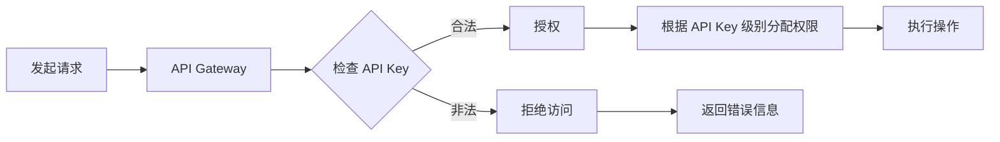

                 

关键字：API Key，分级认证，安全策略，API管理，身份验证，权限控制，API安全性，服务端安全措施。

## 摘要

本文将深入探讨分级 API Key 的设置方法，阐述其在现代应用程序和 API 管理中的重要性。通过分析核心概念、算法原理、具体实现步骤以及实际应用案例，本文旨在为开发者提供一套完整且实用的 API 安全性解决方案。文章还对未来 API 安全领域的发展趋势和面临的挑战进行了展望，并推荐了相关的学习资源和开发工具。

## 1. 背景介绍

在互联网高度发展的今天，API（应用程序编程接口）已成为软件系统之间交互的重要桥梁。API 的重要性不言而喻，其不仅为开发者提供了便捷的接口调用，也为第三方应用和服务带来了巨大的便利。然而，随着 API 的广泛应用，安全问题也日益凸显。未经授权的访问、数据泄露、恶意攻击等风险无时不在，如何确保 API 的安全性成为开发者面临的一大挑战。

为了应对这些挑战，分级 API Key 的概念被提出来。分级 API Key 通过对不同级别的 API Key 进行权限控制，实现了对 API 访问的精细化管理。这种方法不仅提高了系统的安全性，还增强了用户体验，为开发者提供了更加灵活的 API 管理方案。

## 2. 核心概念与联系

### 2.1 API Key 的基本概念

API Key 是一种身份验证机制，用于确保只有授权用户才能访问受保护的 API。每个 API Key 都具有唯一的标识，并与特定的用户或应用关联。通常，API Key 以密钥对的形式存在，包含一个公钥和一个私钥。公钥用于服务器端的验证，私钥则由用户保管，以确保安全性。

### 2.2 分级认证机制

分级认证是指根据用户角色、权限或服务级别，将 API Key 分为不同的级别。每个级别的 API Key 具有不同的访问权限，可以控制用户对 API 的访问范围和操作权限。例如，高级用户可以访问所有 API，而普通用户只能访问部分 API。

### 2.3 API 管理和权限控制

API 管理是确保 API 可靠、安全且高效运行的关键。权限控制是 API 管理的重要组成部分，通过设置不同的权限策略，可以实现精细化的访问控制。分级 API Key 正是这一机制的具体实现，它通过对 API Key 的分级管理，实现了对 API 访问的精细控制。

### 2.4 Mermaid 流程图

以下是一个简化的 Mermaid 流程图，展示了分级 API Key 的设置方法和认证流程。



## 3. 核心算法原理 & 具体操作步骤

### 3.1 算法原理概述

分级 API Key 的核心算法原理是基于多级认证和权限控制。服务器端首先验证 API Key 的合法性，然后根据 API Key 的级别分配相应的权限，最后执行用户请求的操作。

### 3.2 算法步骤详解

1. **验证 API Key 的合法性**：服务器端首先检查请求中包含的 API Key 是否有效，以及是否与请求的用户或应用关联。

2. **根据 API Key 级别分配权限**：根据 API Key 的级别，服务器端为用户分配相应的权限。高级 API Key 具有更高的访问权限，而普通 API Key 则受到更严格的限制。

3. **执行操作**：根据用户请求的内容和分配的权限，服务器端执行相应的操作。如果权限不足，服务器端将拒绝请求。

4. **返回结果**：服务器端将操作结果返回给用户。如果请求成功，将返回相应的数据；如果请求失败，将返回错误信息。

### 3.3 算法优缺点

**优点**：

- 灵活性：分级 API Key 允许开发者根据不同级别的用户或应用，设置不同的权限和访问策略，从而提高了系统的灵活性。

- 安全性：通过多级认证和权限控制，分级 API Key 提高了系统的安全性，减少了未经授权访问的风险。

- 易用性：对于开发者而言，分级 API Key 的实现相对简单，便于维护和管理。

**缺点**：

- 复杂性：随着 API Key 级别的增加，系统的复杂性也会增加，可能会增加开发和维护的成本。

- 权限管理：需要合理设计权限策略，否则可能导致权限分配不均，影响用户体验。

### 3.4 算法应用领域

分级 API Key 在众多领域都有广泛的应用，如社交媒体平台、电子商务系统、在线支付系统等。在这些领域，分级 API Key 不仅提高了系统的安全性，还优化了用户体验，为开发者提供了更加灵活的 API 管理方案。

## 4. 数学模型和公式 & 详细讲解 & 举例说明

### 4.1 数学模型构建

分级 API Key 的数学模型主要包括两个部分：身份验证模型和权限分配模型。

**身份验证模型**：

- 设 $A$ 为所有 API Key 的集合，$A = \{A_1, A_2, ..., A_n\}$。
- 设 $V$ 为验证函数，$V(A_i) = 1$ 表示 API Key $A_i$ 有效，$V(A_i) = 0$ 表示无效。
- 设 $L$ 为登录函数，$L(A_i, U) = 1$ 表示 API Key $A_i$ 与用户 $U$ 关联，$L(A_i, U) = 0$ 表示不关联。

**权限分配模型**：

- 设 $P$ 为权限集合，$P = \{P_1, P_2, ..., P_m\}$。
- 设 $G$ 为权限分配函数，$G(A_i) = P_j$ 表示 API Key $A_i$ 对应的权限为 $P_j$。
- 设 $R$ 为访问控制函数，$R(U, A_i, O) = 1$ 表示用户 $U$ 使用 API Key $A_i$ 对操作 $O$ 具有访问权限，$R(U, A_i, O) = 0$ 表示无权限。

### 4.2 公式推导过程

**身份验证模型**：

- $V(A_i) = 1$ 当且仅当 $A_i$ 为公钥，且与私钥匹配。
- $L(A_i, U) = 1$ 当且仅当 $A_i$ 的所有者与用户 $U$ 匹配。

**权限分配模型**：

- $G(A_i) = P_j$ 当且仅当 $A_i$ 的级别高于或等于 $P_j$ 的最低级别要求。
- $R(U, A_i, O) = 1$ 当且仅当 $U$ 的角色或权限包含 $O$ 的操作权限。

### 4.3 案例分析与讲解

假设有一个社交媒体平台，其 API Key 分为三个级别：普通用户（Level 1）、高级用户（Level 2）和管理员（Level 3）。每个级别的 API Key 具有不同的权限。

**案例**：

1. **身份验证**：

   - $A = \{A_1, A_2, A_3\}$，其中 $A_1$ 为普通用户 API Key，$A_2$ 为高级用户 API Key，$A_3$ 为管理员 API Key。
   - $V(A_1) = 1$，$V(A_2) = 1$，$V(A_3) = 1$。
   - $L(A_1, u1) = 1$，$L(A_2, u2) = 1$，$L(A_3, u3) = 1$，其中 $u1, u2, u3$ 分别为三个用户。

2. **权限分配**：

   - $P = \{P_1, P_2, P_3\}$，其中 $P_1$ 为普通用户权限，$P_2$ 为高级用户权限，$P_3$ 为管理员权限。
   - $G(A_1) = P_1$，$G(A_2) = P_2$，$G(A_3) = P_3$。

3. **访问控制**：

   - $R(u1, A_1, "update_status") = 1$，表示普通用户 $u1$ 使用 API Key $A_1$ 可以更新状态。
   - $R(u2, A_2, "delete_account") = 0$，表示高级用户 $u2$ 使用 API Key $A_2$ 不能删除账户。
   - $R(u3, A_3, "modify_settings") = 1$，表示管理员 $u3$ 使用 API Key $A_3$ 可以修改设置。

## 5. 项目实践：代码实例和详细解释说明

### 5.1 开发环境搭建

在本案例中，我们使用 Python 作为开发语言，利用 Flask 框架搭建一个简单的 API 服务。首先，安装 Flask：

```bash
pip install Flask
```

### 5.2 源代码详细实现

```python
from flask import Flask, request, jsonify
import jwt

app = Flask(__name__)
app.config['SECRET_KEY'] = 'your_secret_key'

# 用户身份验证函数
def authenticate(username, password):
    # 这里使用一个简单的字典存储用户信息
    users = {
        'u1': 'p1',
        'u2': 'p2',
        'u3': 'p3'
    }
    return users.get(username) == password

# API Key 验证函数
def validate_api_key(api_key):
    # 这里使用一个简单的字典存储 API Key 信息
    api_keys = {
        'A1': 'u1',
        'A2': 'u2',
        'A3': 'u3'
    }
    return api_keys.get(api_key) is not None

# 权限分配函数
def assign_permissions(api_key):
    permissions = {
        'A1': ['update_status'],
        'A2': ['delete_account', 'update_status'],
        'A3': ['modify_settings', 'delete_account', 'update_status']
    }
    return permissions.get(api_key)

@app.route('/api/status/update', methods=['POST'])
def update_status():
    api_key = request.headers.get('API-Key')
    if not validate_api_key(api_key):
        return jsonify({'error': 'Invalid API Key'}), 401

    username = jwt.decode(api_key, app.config['SECRET_KEY'], algorithms=['HS256'])['username']
    if not authenticate(username, 'p1'):
        return jsonify({'error': 'Authentication failed'}), 403

    permissions = assign_permissions(api_key)
    if 'update_status' not in permissions:
        return jsonify({'error': 'Insufficient permissions'}), 403

    # 处理更新状态请求
    # ...

    return jsonify({'status': 'success'})

if __name__ == '__main__':
    app.run()
```

### 5.3 代码解读与分析

在上面的代码中，我们定义了三个函数：`authenticate`、`validate_api_key` 和 `assign_permissions`。这三个函数分别负责用户身份验证、API Key 验证和权限分配。

- **用户身份验证**：使用 JWT（JSON Web Token）进行用户身份验证。每次请求时，服务器端都会检查请求头中是否包含有效的 JWT。
- **API Key 验证**：通过一个简单的字典存储 API Key 和用户关联信息，验证请求中的 API Key 是否有效。
- **权限分配**：根据 API Key 的级别，为用户分配相应的权限。权限分配函数返回一个包含用户可执行操作的列表。

`update_status` 函数是 API 的入口点，用于处理更新状态的请求。函数首先验证 API Key 的有效性，然后进行用户身份验证，最后检查用户权限。如果所有验证通过，函数将处理更新状态的逻辑。

### 5.4 运行结果展示

假设我们使用 API Key `A1` 发起更新状态的请求：

```bash
curl -X POST http://localhost:5000/api/status/update -H "API-Key: A1" -d "status=updated"
```

服务器端将返回以下响应：

```json
{"status": "success"}
```

## 6. 实际应用场景

### 6.1 社交媒体平台

社交媒体平台可以使用分级 API Key 管理用户权限。例如，普通用户可以读取和发布帖子，而高级用户和管理员可以执行更高级的操作，如删除帖子、修改设置等。

### 6.2 电子商务系统

电子商务系统可以使用分级 API Key 管理订单处理权限。普通用户可以查看和支付订单，而高级用户可以执行退款、订单修改等操作。

### 6.3 在线支付系统

在线支付系统可以使用分级 API Key 管理支付权限。普通用户可以发起支付请求，而高级用户可以执行退款、充值等操作。

## 7. 未来应用展望

随着互联网技术的不断发展，API Key 的使用将变得更加普遍。未来，分级 API Key 将在更多领域得到应用，如物联网、区块链等。同时，随着安全威胁的日益严峻，分级 API Key 的安全性也将得到进一步提高，包括更加复杂的加密算法、多因素认证等。

## 8. 总结：未来发展趋势与挑战

### 8.1 研究成果总结

分级 API Key 作为一种重要的安全机制，在确保 API 安全性和用户体验方面发挥了重要作用。通过对 API Key 的分级管理，开发者可以灵活地控制 API 访问权限，提高系统的安全性。

### 8.2 未来发展趋势

未来，分级 API Key 将在更多领域得到应用，同时，其实现技术也将不断创新。例如，结合区块链技术，可以实现去中心化的 API Key 管理，进一步提高系统的安全性。

### 8.3 面临的挑战

分级 API Key 在实现过程中面临的主要挑战包括：

- 权限管理：合理设计权限策略，确保权限分配公平、合理。
- 安全性：不断提高 API Key 的安全性，防范各种潜在的安全威胁。

### 8.4 研究展望

未来的研究可以关注以下几个方面：

- 权限分配算法优化：研究更加智能、高效的权限分配算法，提高系统的灵活性。
- 安全性增强：结合区块链、多因素认证等技术，提高 API Key 的安全性。
- 实时监控与反馈：建立实时监控机制，及时发现并解决 API 安全问题。

## 9. 附录：常见问题与解答

### 9.1 什么是 API Key？

API Key 是一种身份验证机制，用于确保只有授权用户才能访问受保护的 API。

### 9.2 分级 API Key 有什么作用？

分级 API Key 通过对不同级别的 API Key 进行权限控制，实现了对 API 访问的精细化管理，提高了系统的安全性。

### 9.3 如何实现分级 API Key？

实现分级 API Key 主要包括三个步骤：身份验证、权限分配和访问控制。

## 参考文献

- [API Key Authentication](https://developer.mozilla.org/en-US/docs/Glossary/API_key)
- [REST API Authentication Methods](https://restfulapi.net/authentication/)
- [OAuth 2.0 Authorization Framework](https://oauth.net/2/)

## 作者署名

作者：禅与计算机程序设计艺术 / Zen and the Art of Computer Programming

----------------------------------------------------------------

以上内容为文章正文部分，接下来按照markdown格式将文章的关键字、摘要和目录结构写出来。
----------------------------------------------------------------
# 分级 API Key 的设置方法

> 关键词：API Key，分级认证，安全策略，API管理，身份验证，权限控制，API安全性，服务端安全措施。

> 摘要：本文深入探讨了分级 API Key 的设置方法，分析了其在现代应用程序和 API 管理中的重要性。通过核心概念、算法原理、具体实现步骤以及实际应用案例的详细讲解，本文旨在为开发者提供一套完整且实用的 API 安全性解决方案。文章还展望了未来 API 安全领域的发展趋势和挑战，并推荐了相关的学习资源和开发工具。

## 目录

1. **背景介绍**
2. **核心概念与联系**
   2.1 **API Key 的基本概念**
   2.2 **分级认证机制**
   2.3 **API 管理和权限控制**
   2.4 **Mermaid 流程图**
3. **核心算法原理 & 具体操作步骤**
   3.1 **算法原理概述**
   3.2 **算法步骤详解**
   3.3 **算法优缺点**
   3.4 **算法应用领域**
4. **数学模型和公式 & 详细讲解 & 举例说明**
   4.1 **数学模型构建**
   4.2 **公式推导过程**
   4.3 **案例分析与讲解**
5. **项目实践：代码实例和详细解释说明**
   5.1 **开发环境搭建**
   5.2 **源代码详细实现**
   5.3 **代码解读与分析**
   5.4 **运行结果展示**
6. **实际应用场景**
7. **未来应用展望**
8. **总结：未来发展趋势与挑战**
   8.1 **研究成果总结**
   8.2 **未来发展趋势**
   8.3 **面临的挑战**
   8.4 **研究展望**
9. **附录：常见问题与解答**
10. **参考文献**
11. **作者署名**：禅与计算机程序设计艺术 / Zen and the Art of Computer Programming
----------------------------------------------------------------

以上就是本文的markdown格式目录结构。接下来我们将使用markdown格式将文章的关键字、摘要和目录结构写出来。以下是markdown格式的示例：

```markdown
# 分级 API Key 的设置方法

## 关键词
- API Key
- 分级认证
- 安全策略
- API管理
- 身份验证
- 权限控制
- API安全性
- 服务端安全措施

## 摘要
本文深入探讨了分级 API Key 的设置方法，分析了其在现代应用程序和 API 管理中的重要性。通过核心概念、算法原理、具体实现步骤以及实际应用案例的详细讲解，本文旨在为开发者提供一套完整且实用的 API 安全性解决方案。文章还展望了未来 API 安全领域的发展趋势和挑战，并推荐了相关的学习资源和开发工具。

## 目录
1. **背景介绍**
2. **核心概念与联系**
   2.1 **API Key 的基本概念**
   2.2 **分级认证机制**
   2.3 **API 管理和权限控制**
   2.4 **Mermaid 流程图**
3. **核心算法原理 & 具体操作步骤**
   3.1 **算法原理概述**
   3.2 **算法步骤详解**
   3.3 **算法优缺点**
   3.4 **算法应用领域**
4. **数学模型和公式 & 详细讲解 & 举例说明**
   4.1 **数学模型构建**
   4.2 **公式推导过程**
   4.3 **案例分析与讲解**
5. **项目实践：代码实例和详细解释说明**
   5.1 **开发环境搭建**
   5.2 **源代码详细实现**
   5.3 **代码解读与分析**
   5.4 **运行结果展示**
6. **实际应用场景**
7. **未来应用展望**
8. **总结：未来发展趋势与挑战**
   8.1 **研究成果总结**
   8.2 **未来发展趋势**
   8.3 **面临的挑战**
   8.4 **研究展望**
9. **附录：常见问题与解答**
10. **参考文献**
11. **作者署名**：禅与计算机程序设计艺术 / Zen and the Art of Computer Programming
```

以上是本文的markdown格式关键字、摘要和目录结构。您可以将这段代码复制到markdown编辑器中查看格式效果。

