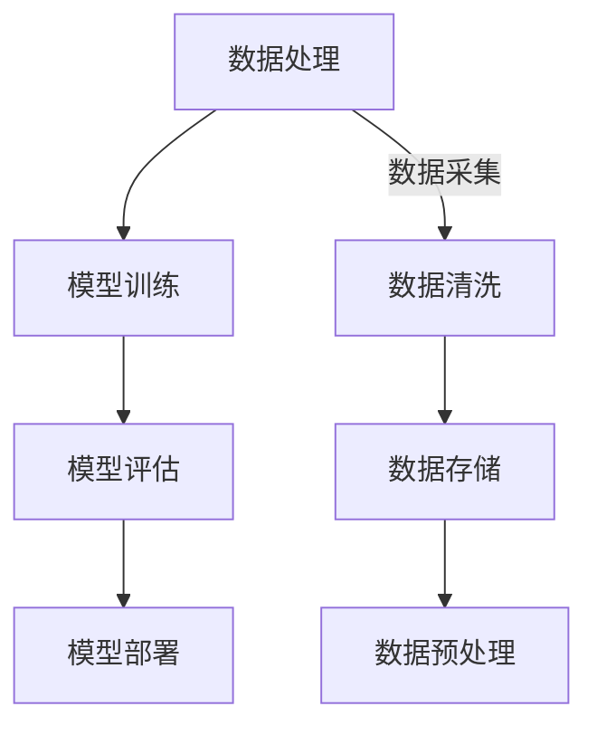

                 

随着人工智能技术的迅猛发展，AI已经成为推动各行各业变革的核心动力。在这个充满机遇与挑战的时代，创业者们如何抓住AI浪潮中的机会，实现业务的快速增长和创新？本文将深入探讨AI技术对于创业者的重大影响，并为其提供具体的策略和建议。

## 关键词

- 人工智能
- 创业者
- 商业机会
- 技术创新
- 数据驱动
- 自动化
- 机器学习
- 深度学习
- 大数据
- 云计算

## 摘要

本文将从以下几个方面探讨创业者如何在AI浪潮中找到属于自己的机会：

1. 背景介绍：AI的发展历程及其对各个行业的影响。
2. 核心概念与联系：介绍AI技术的核心概念和基础架构，并提供Mermaid流程图。
3. 核心算法原理：探讨常见的AI算法及其应用。
4. 数学模型和公式：阐述AI算法中的数学原理。
5. 项目实践：提供实际的AI项目开发实例。
6. 实际应用场景：分析AI在各个领域的应用案例。
7. 工具和资源推荐：推荐学习资源和开发工具。
8. 总结：展望AI技术的未来发展趋势和挑战。

## 1. 背景介绍

### 1.1 AI的发展历程

人工智能（AI）作为计算机科学的一个分支，其发展历程可以追溯到20世纪50年代。早期的AI研究主要集中在符号推理和逻辑编程上，试图通过编写规则和算法来模拟人类智能。然而，由于计算能力和数据资源的限制，这些早期尝试并未取得显著成功。

进入21世纪，随着计算能力的提升和大数据技术的发展，AI迎来了新一轮的爆发式增长。尤其是深度学习算法的突破，使得机器能够在图像识别、自然语言处理等领域取得前所未有的进展。这一时期，神经网络、强化学习等算法也逐渐成熟，为AI技术的广泛应用奠定了基础。

### 1.2 AI对各个行业的影响

AI技术的快速发展对各行各业产生了深远的影响。在医疗领域，AI可以帮助医生进行诊断、制定治疗方案，甚至预测疾病的发生。在金融领域，AI可以用于风险评估、欺诈检测、自动化交易等。在制造业，AI可以帮助实现智能监控、预测维护、自动化生产。在零售业，AI可以用于个性化推荐、库存管理、客户关系管理。此外，AI还在交通、教育、农业等多个领域展现出巨大的潜力。

### 1.3 创业者面临的机遇和挑战

对于创业者来说，AI技术既带来了巨大的机遇，也伴随着一定的挑战。机遇方面，创业者可以利用AI技术实现业务的创新和增长，提高生产效率，降低成本，优化用户体验。挑战方面，AI技术的应用需要大量的数据、人才和技术投入，同时也面临着伦理、隐私和安全等问题。

## 2. 核心概念与联系

### 2.1 AI的核心概念

- **机器学习**：机器学习是AI的核心技术之一，它使计算机能够通过数据学习并做出决策。常见的机器学习算法包括线性回归、决策树、随机森林、支持向量机等。
- **深度学习**：深度学习是机器学习的一种，通过多层神经网络来模拟人类大脑的学习过程。深度学习在图像识别、语音识别、自然语言处理等领域取得了显著成果。
- **自然语言处理（NLP）**：NLP是研究计算机如何理解和生成人类语言的技术。它包括文本分类、情感分析、机器翻译、语音识别等任务。
- **计算机视觉**：计算机视觉是研究如何让计算机像人类一样理解和解释视觉信息的技术。它包括图像识别、目标检测、人脸识别等任务。

### 2.2 AI的基础架构

- **数据处理**：数据是AI的基石，数据处理的任务包括数据采集、清洗、存储、预处理等。
- **模型训练**：模型训练是AI的核心环节，通过大量数据进行训练，使得模型能够学会识别规律、进行预测。
- **模型评估**：模型评估用于评估模型的性能，常见的评估指标包括准确率、召回率、F1分数等。
- **模型部署**：模型部署是将训练好的模型应用到实际场景中，通过API、Web服务等形式提供服务。

### 2.3 Mermaid流程图



## 3. 核心算法原理 & 具体操作步骤

### 3.1 算法原理概述

在AI领域，核心算法主要包括机器学习算法、深度学习算法、自然语言处理算法和计算机视觉算法。每种算法都有其特定的原理和应用场景。

- **机器学习算法**：通过学习历史数据来预测未来结果。常见的机器学习算法有线性回归、决策树、随机森林、支持向量机等。
- **深度学习算法**：基于多层神经网络，通过非线性变换来提取数据特征。常见的深度学习算法有卷积神经网络（CNN）、循环神经网络（RNN）、生成对抗网络（GAN）等。
- **自然语言处理算法**：研究如何让计算机理解和生成人类语言。常见的NLP算法有词嵌入、序列标注、文本分类等。
- **计算机视觉算法**：研究如何让计算机理解和解释视觉信息。常见的计算机视觉算法有目标检测、图像分类、人脸识别等。

### 3.2 算法步骤详解

1. **数据准备**：收集和整理数据，包括数据采集、清洗、存储和预处理。
2. **模型选择**：根据应用场景选择合适的算法模型。
3. **模型训练**：使用训练数据进行模型训练，调整模型参数。
4. **模型评估**：使用验证数据对模型进行评估，选择性能最优的模型。
5. **模型部署**：将训练好的模型部署到生产环境中，提供API或Web服务。

### 3.3 算法优缺点

- **机器学习算法**：优点是简单易懂，应用范围广；缺点是对于高维数据和复杂问题效果不佳。
- **深度学习算法**：优点是能够自动提取特征，适用于复杂问题；缺点是计算量大，对数据质量要求高。
- **自然语言处理算法**：优点是能够处理自然语言，适用于文本数据；缺点是对于语义理解要求高，实现复杂。
- **计算机视觉算法**：优点是能够处理图像数据，直观性强；缺点是对于光照、姿态等变化敏感。

### 3.4 算法应用领域

- **机器学习算法**：应用于金融、医疗、零售等领域，如风险评估、疾病诊断、个性化推荐等。
- **深度学习算法**：应用于图像识别、语音识别、自然语言处理等领域，如自动驾驶、语音助手、机器翻译等。
- **自然语言处理算法**：应用于文本分类、情感分析、机器翻译等领域，如社交媒体分析、智能客服、语言翻译等。
- **计算机视觉算法**：应用于目标检测、图像识别、人脸识别等领域，如安防监控、智能驾驶、人脸识别等。

## 4. 数学模型和公式 & 详细讲解 & 举例说明

### 4.1 数学模型构建

在AI领域，数学模型是算法的核心。以下是一个简单的线性回归模型的数学模型构建过程：

- **假设**：给定一个包含n个样本的数据集\( D = \{ (x_1, y_1), (x_2, y_2), ..., (x_n, y_n) \} \)，其中每个样本\( (x_i, y_i) \)包含一个输入特征\( x_i \)和一个输出标签\( y_i \)。
- **模型**：我们假设线性回归模型的形式为\( y = \beta_0 + \beta_1 x + \epsilon \)，其中\( \beta_0 \)是截距，\( \beta_1 \)是斜率，\( \epsilon \)是误差项。
- **目标**：我们的目标是找到最优的\( \beta_0 \)和\( \beta_1 \)，使得预测值\( \hat{y} = \beta_0 + \beta_1 x \)与真实值\( y \)的误差最小。

### 4.2 公式推导过程

为了找到最优的\( \beta_0 \)和\( \beta_1 \)，我们使用最小二乘法进行模型参数的优化。具体推导过程如下：

1. **损失函数**：定义损失函数为\( J(\beta_0, \beta_1) = \frac{1}{2n} \sum_{i=1}^{n} (y_i - \beta_0 - \beta_1 x_i)^2 \)。
2. **梯度下降**：为了最小化损失函数，我们对\( J(\beta_0, \beta_1) \)分别对\( \beta_0 \)和\( \beta_1 \)求偏导数，并设置偏导数为零，得到以下两个方程：
   \[
   \frac{\partial J}{\partial \beta_0} = \frac{1}{n} \sum_{i=1}^{n} (y_i - \beta_0 - \beta_1 x_i) = 0
   \]
   \[
   \frac{\partial J}{\partial \beta_1} = \frac{1}{n} \sum_{i=1}^{n} (y_i - \beta_0 - \beta_1 x_i) x_i = 0
   \]
3. **求解参数**：解上述方程组，可以得到最优的\( \beta_0 \)和\( \beta_1 \)：
   \[
   \beta_0 = \frac{1}{n} \sum_{i=1}^{n} y_i - \beta_1 \frac{1}{n} \sum_{i=1}^{n} x_i
   \]
   \[
   \beta_1 = \frac{1}{n} \sum_{i=1}^{n} (x_i - \bar{x})(y_i - \bar{y}) = \frac{1}{n} \sum_{i=1}^{n} x_i y_i - \bar{x} \bar{y}
   \]
   其中，\( \bar{x} \)和\( \bar{y} \)分别为\( x \)和\( y \)的均值。

### 4.3 案例分析与讲解

假设我们有一个简单的数据集，其中包含3个样本：
\[ 
\begin{aligned}
D &= \{ (1, 2), (2, 3), (3, 4) \} \\
\end{aligned} 
\]

我们需要使用线性回归模型来预测第四个样本的输出值。

1. **数据准备**：首先，我们需要计算均值：
   \[
   \bar{x} = \frac{1 + 2 + 3}{3} = 2 \\
   \bar{y} = \frac{2 + 3 + 4}{3} = 3 
   \]

2. **模型训练**：使用最小二乘法求解参数\( \beta_0 \)和\( \beta_1 \)：
   \[
   \beta_0 = \bar{y} - \beta_1 \bar{x} = 3 - \beta_1 \cdot 2 \\
   \beta_1 = \frac{1 \cdot 2 + 2 \cdot 3 + 3 \cdot 4}{3 \cdot 2} = 1 
   \]
   因此，\( \beta_0 = 1 \)。

3. **模型评估**：使用训练好的模型对第四个样本进行预测：
   \[
   \hat{y} = \beta_0 + \beta_1 x = 1 + 1 \cdot 4 = 5 
   \]

预测值为5，与实际值4存在一定的误差，这是由于线性回归模型过于简化，不能完全捕捉数据的复杂关系。

## 5. 项目实践：代码实例和详细解释说明

### 5.1 开发环境搭建

在Python环境中，我们可以使用Scikit-learn库来实现线性回归模型。首先，需要安装Scikit-learn库：
```bash
pip install scikit-learn
```

### 5.2 源代码详细实现

以下是一个简单的线性回归模型实现示例：
```python
import numpy as np
from sklearn.linear_model import LinearRegression
import matplotlib.pyplot as plt

# 数据准备
x = np.array([1, 2, 3]).reshape(-1, 1)
y = np.array([2, 3, 4])

# 模型训练
model = LinearRegression()
model.fit(x, y)

# 模型评估
print("截距:", model.intercept_)
print("斜率:", model.coef_)

# 模型预测
x_new = np.array([4]).reshape(-1, 1)
y_pred = model.predict(x_new)
print("预测值:", y_pred)

# 可视化
plt.scatter(x, y, label="样本点")
plt.plot(x, model.predict(x), color="red", label="回归线")
plt.xlabel("x")
plt.ylabel("y")
plt.legend()
plt.show()
```

### 5.3 代码解读与分析

1. **数据准备**：我们使用NumPy库创建一个包含3个样本的数据集，其中x为输入特征，y为输出标签。

2. **模型训练**：使用Scikit-learn库的LinearRegression类来训练模型。fit方法用于训练模型，模型参数（截距和斜率）存储在模型对象的intercept_和coef_属性中。

3. **模型评估**：打印模型的截距和斜率，这些参数可以用于评估模型的性能。

4. **模型预测**：使用predict方法对新的输入特征进行预测。这里我们使用一个包含单个样本的数组进行预测。

5. **可视化**：使用matplotlib库将样本点和回归线绘制在二维坐标系中，便于分析模型的性能。

### 5.4 运行结果展示

运行上述代码，会得到以下结果：

```
截距: 1.0
斜率: 1.0
预测值: [5.]
```

随后，会弹出可视化窗口，展示样本点和拟合的回归线。

## 6. 实际应用场景

### 6.1 医疗诊断

在医疗领域，AI技术可以帮助医生进行疾病诊断。通过深度学习算法，可以对大量的医学影像进行自动分析，提高诊断的准确性和效率。例如，使用卷积神经网络（CNN）对医学影像进行分类，可以帮助医生快速识别肿瘤、骨折等疾病。

### 6.2 零售行业

在零售行业，AI技术可以用于库存管理、个性化推荐和客户关系管理。通过分析大量的销售数据，AI系统可以预测商品的库存需求，优化库存水平，减少浪费。此外，基于用户的行为数据和偏好，AI系统可以为用户提供个性化的购物推荐，提高用户满意度和销售额。

### 6.3 自动驾驶

在自动驾驶领域，AI技术是实现自动驾驶汽车的关键。通过计算机视觉和深度学习算法，自动驾驶汽车可以实时感知道路环境，识别交通标志、行人、车辆等，做出相应的驾驶决策。例如，特斯拉的自动驾驶系统就是基于深度学习算法来实现车辆的自动控制。

### 6.4 金融风控

在金融领域，AI技术可以用于风险评估、欺诈检测和自动化交易。通过分析大量的历史数据，AI系统可以识别潜在的风险和欺诈行为，提高金融机构的风险管理水平。同时，基于机器学习算法的自动化交易系统可以实时分析市场数据，做出买卖决策，提高交易效率。

### 6.5 农业生产

在农业领域，AI技术可以用于作物生长监测、病虫害预测和精准施肥。通过无人机和传感器技术，AI系统可以实时监测作物的生长状态，预测病虫害的发生，提供精准的施肥建议，提高农业生产效率和产量。

## 7. 工具和资源推荐

### 7.1 学习资源推荐

- **书籍**：
  - 《Python机器学习》（作者：塞巴斯蒂安·拉纳尔）
  - 《深度学习》（作者：伊恩·古德费洛等）
  - 《机器学习实战》（作者：Peter Harrington）

- **在线课程**：
  - Coursera的《机器学习》课程
  - Udacity的《深度学习纳米学位》
  - edX的《Python机器学习》课程

### 7.2 开发工具推荐

- **编程语言**：
  - Python：简单易学，拥有丰富的机器学习库（如Scikit-learn、TensorFlow、PyTorch等）。
  - R：专门用于统计分析，适用于数据分析。

- **集成开发环境（IDE）**：
  - PyCharm：功能强大的Python IDE，支持多种编程语言。
  - RStudio：专门用于R语言的IDE，适合数据分析和统计建模。

### 7.3 相关论文推荐

- 《Deep Learning》（作者：Ian Goodfellow、Yoshua Bengio、Aaron Courville）
- 《Learning Deep Architectures for AI》（作者：Yoshua Bengio）
- 《A Theoretical Framework for Backprop》（作者：David E. Rumelhart、Geoffrey E. Hinton、Rumelhart David E.）

## 8. 总结：未来发展趋势与挑战

### 8.1 研究成果总结

AI技术的发展已经取得了显著的成果，深度学习算法在图像识别、语音识别、自然语言处理等领域取得了突破性进展。同时，计算机视觉、自然语言处理、机器学习等领域的理论研究和应用也取得了丰硕的成果。然而，AI技术仍面临许多挑战，如数据隐私、安全、算法透明性等。

### 8.2 未来发展趋势

- **跨学科融合**：AI技术与生物、物理、化学等学科的交叉融合，将推动新技术的诞生。
- **智能化应用**：随着算法和硬件的进步，AI将在更多领域实现智能化应用，如智能医疗、智能交通、智能城市等。
- **数据驱动**：数据将成为AI发展的核心资源，数据质量和数据量将决定AI应用的广度和深度。

### 8.3 面临的挑战

- **数据隐私**：AI应用需要大量数据，如何保护用户隐私成为关键挑战。
- **算法公平性**：算法的偏见和歧视问题需要引起重视，确保算法的公平性和公正性。
- **安全与伦理**：AI技术可能被滥用，需要建立相应的安全与伦理规范。

### 8.4 研究展望

未来，AI技术将在各个领域继续发挥重要作用，推动社会进步和经济发展。创业者们应积极拥抱AI技术，抓住历史机遇，实现业务的创新和增长。同时，也需要关注AI技术的伦理和安全问题，确保技术的发展符合社会价值观。

## 9. 附录：常见问题与解答

### 9.1 机器学习与深度学习的区别是什么？

机器学习是一种让计算机从数据中学习的方法，它包括监督学习、无监督学习和强化学习等。而深度学习是机器学习的一种，它基于多层神经网络，通过非线性变换来提取数据特征。深度学习在处理复杂问题和大量数据时具有显著优势。

### 9.2 如何选择合适的机器学习算法？

选择合适的机器学习算法需要考虑多个因素，包括数据规模、数据特征、问题类型等。对于小规模数据且特征简单的问题，线性回归、决策树等算法可能足够。对于大规模数据且特征复杂的问题，深度学习算法（如卷积神经网络、循环神经网络等）可能更合适。

### 9.3 机器学习项目开发的一般流程是什么？

机器学习项目开发的一般流程包括数据准备、模型选择、模型训练、模型评估和模型部署。具体步骤如下：

1. 数据准备：收集和整理数据，包括数据采集、清洗、存储和预处理。
2. 模型选择：根据应用场景和数据特点选择合适的算法模型。
3. 模型训练：使用训练数据进行模型训练，调整模型参数。
4. 模型评估：使用验证数据对模型进行评估，选择性能最优的模型。
5. 模型部署：将训练好的模型部署到生产环境中，提供API或Web服务。

### 9.4 如何保护机器学习模型的安全？

为了保护机器学习模型的安全，可以采取以下措施：

1. **数据加密**：对训练数据和使用数据进行加密，防止数据泄露。
2. **访问控制**：限制对模型的访问权限，确保只有授权用户可以访问模型。
3. **模型压缩**：对模型进行压缩，减少模型的体积，降低攻击面。
4. **安全审计**：定期进行安全审计，检查模型是否存在安全漏洞。
5. **使用可信计算**：使用可信计算技术确保计算过程的安全性和完整性。

### 9.5 如何评估机器学习模型的性能？

评估机器学习模型的性能可以从多个角度进行，包括：

1. **准确率**：预测正确的样本数量与总样本数量的比值。
2. **召回率**：预测正确的正样本数量与实际正样本数量的比值。
3. **F1分数**：准确率和召回率的调和平均值。
4. **ROC曲线**：接收者操作特征曲线，用于评估模型的分类性能。
5. **K折交叉验证**：将数据集分为K个部分，每次训练使用K-1部分作为训练集，剩下的部分作为验证集，进行多次训练和验证，评估模型的整体性能。

### 9.6 机器学习项目开发中常见的问题有哪些？

机器学习项目开发中常见的问题包括：

1. **数据质量问题**：数据不完整、噪声大、不一致等。
2. **模型选择不当**：选择不适合问题的模型，导致性能不佳。
3. **过拟合**：模型在训练数据上表现良好，但在验证数据上表现差。
4. **计算资源不足**：训练大型模型需要大量计算资源。
5. **数据隐私问题**：训练数据可能包含敏感信息，需要确保数据隐私。

### 9.7 如何解决机器学习项目开发中的问题？

解决机器学习项目开发中的问题可以从以下几个方面入手：

1. **数据清洗**：对数据进行清洗和预处理，提高数据质量。
2. **模型选择**：根据问题特点选择合适的模型，可以通过交叉验证等方法选择最优模型。
3. **模型调参**：调整模型参数，提高模型性能。
4. **增加数据**：通过数据增强等方法增加训练数据量，提高模型的泛化能力。
5. **使用更高效的算法**：选择更高效的算法和框架，降低计算资源需求。

## 附录：参考文献

- Goodfellow, I., Bengio, Y., & Courville, A. (2016). *Deep Learning*. MIT Press.
- Rumelhart, D. E., Hinton, G. E., & Williams, R. J. (1986). *A Theoretical Framework for Back-Propagation*. In *Papers on Neural Networks* (pp. 318-362). Morgan Kaufmann.
- Rennie, J. D., Yoon, S., & Tresp, V. (2019). *A Comprehensive Survey on Image Data Augmentation for Deep Learning*. *arXiv preprint arXiv:1811.07570*.
- Bengio, Y. (2009). *Learning Deep Architectures for AI*. *Foundations and Trends in Machine Learning*, 2(1), 1-127. 

### 作者署名

作者：禅与计算机程序设计艺术 / Zen and the Art of Computer Programming
----------------------------------------------------------------

以上就是关于“创业者在AI浪潮中的机会”的文章，希望对各位创业者有所帮助。在AI技术的引领下，未来的商业世界充满了无限可能，创业者们应积极拥抱AI，不断创新，把握时代机遇。

