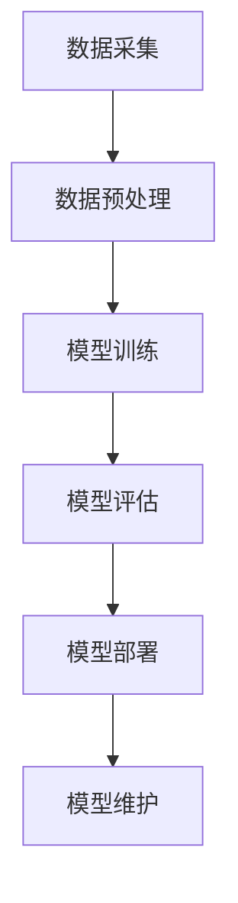

                 

在人工智能领域，大模型技术正成为新的风口，吸引了众多创业者的目光。本文将深入探讨大模型技术的基本概念、原理及其在创业中的实际应用，帮助创业者把握这一变革性机遇。

## 文章关键词

- 大模型技术
- AI产业变革
- 创业者
- 技术创新
- 应用实践

## 文章摘要

本文旨在揭示大模型技术在AI产业中的重要作用，分析其对创业者带来的机遇和挑战。通过梳理大模型技术的基本概念、发展历程、核心算法以及在实际应用中的表现，为创业者提供全面的指导和借鉴。

## 1. 背景介绍

人工智能（AI）的发展，正在经历一个前所未有的变革期。随着计算能力的提升、大数据的积累和算法的优化，AI技术正逐渐从理论研究走向实际应用。其中，大模型技术作为AI领域的重要突破，正引领着产业变革的浪潮。

大模型技术是指通过训练大规模神经网络，使其在特定任务上达到人类水平甚至超越人类水平的能力。这类模型具有强大的表征能力和泛化能力，能够在各种复杂场景中发挥作用。例如，在图像识别、自然语言处理、语音识别等领域，大模型技术已经展现出了卓越的性能。

创业者在抓住AI产业变革机遇的过程中，大模型技术的应用显得尤为重要。一方面，大模型技术可以为创业者提供强大的工具，助力其在技术领域脱颖而出；另一方面，大模型技术的应用场景广泛，为创业者提供了丰富的市场机会。因此，如何有效地布局大模型技术，成为创业者亟待解决的问题。

## 2. 核心概念与联系

### 2.1 大模型技术的基本概念

大模型技术是指通过训练大规模神经网络，使其在特定任务上达到人类水平甚至超越人类水平的能力。这类模型通常包含数十亿甚至数万亿个参数，其训练过程需要海量数据和强大的计算资源。大模型技术的主要目标是提高模型在复杂任务上的表现，使其能够处理更加复杂和多变的数据。

### 2.2 大模型技术的联系

大模型技术与多个AI领域的重要概念密切相关，包括：

- **深度学习**：大模型技术是基于深度学习的一种实现，深度学习通过多层神经网络结构，对数据进行多层次的特征提取和变换，从而实现高度复杂的任务。
- **大数据**：大模型技术的训练和应用需要依赖海量数据，大数据为模型提供了丰富的训练资源，有助于提升模型的性能和泛化能力。
- **计算资源**：大模型技术的训练和推理需要大量的计算资源，尤其是高性能计算（HPC）和云计算技术的支持，以确保模型训练和应用的效率。

### 2.3 大模型技术的架构

为了更好地理解大模型技术的架构，我们可以使用Mermaid流程图进行描述：



- **数据采集**：收集用于训练模型的数据，这些数据可以来自公开数据集、企业内部数据或者第三方数据提供商。
- **数据预处理**：对采集到的数据进行清洗、归一化等处理，以消除数据噪声和异常值，提高模型训练的效果。
- **模型训练**：使用大规模神经网络对预处理后的数据进行训练，训练过程中需要不断调整模型参数，以优化模型性能。
- **模型评估**：通过测试集对训练好的模型进行评估，以判断模型是否达到预期效果，并为进一步优化提供依据。
- **模型部署**：将训练好的模型部署到实际应用场景中，如API接口、嵌入式设备等，以实现具体的功能。
- **模型维护**：对部署后的模型进行监控、调整和更新，以应对数据分布变化和应用场景的变迁。

通过上述流程，创业者可以更好地理解和应用大模型技术，为创业项目提供强有力的技术支持。

## 3. 核心算法原理 & 具体操作步骤

### 3.1 算法原理概述

大模型技术的基础是深度学习，特别是神经网络。神经网络通过模拟人脑神经元之间的连接和交互，实现对数据的处理和预测。在大模型技术中，神经网络被扩展到大规模，通过增加层数、节点数和参数量，提高模型的表征能力和泛化能力。

深度学习的核心算法包括：

- **前向传播**：将输入数据通过神经网络逐层传递，计算出每个节点的输出。
- **反向传播**：根据输出误差，反向更新每个节点的权重和偏置，以优化模型参数。
- **激活函数**：引入非线性变换，使得神经网络能够拟合复杂的函数。

### 3.2 算法步骤详解

- **数据预处理**：清洗数据，进行归一化、标准化等处理，以消除数据分布差异。
- **网络结构设计**：设计神经网络的结构，包括层数、节点数和连接方式。
- **初始化参数**：初始化网络参数，通常采用随机初始化。
- **前向传播**：将输入数据通过神经网络进行计算，得到每个节点的输出。
- **计算损失**：计算输出结果与真实结果的误差，常用的损失函数有均方误差、交叉熵等。
- **反向传播**：根据损失函数，反向计算每个节点的误差，更新网络参数。
- **模型评估**：使用测试集对模型进行评估，判断模型性能。
- **模型优化**：根据评估结果，对模型进行调整和优化，如调整学习率、增加训练轮次等。
- **模型部署**：将训练好的模型部署到实际应用场景中。

### 3.3 算法优缺点

**优点**：

- **强大的表征能力**：大模型技术通过多层神经网络结构，能够提取高度抽象的特征，处理复杂任务。
- **高泛化能力**：通过海量数据和大规模训练，大模型技术能够适应各种不同的数据分布和应用场景。
- **自适应性强**：大模型技术可以根据不同的任务需求，灵活调整模型结构、参数和学习策略。

**缺点**：

- **计算资源需求大**：大模型技术需要大量的计算资源，特别是训练过程中，计算成本较高。
- **数据依赖性高**：大模型技术的性能高度依赖于数据质量和数量，数据不足或质量差可能导致模型效果不佳。
- **解释性差**：深度学习模型尤其是大模型，其内部机制复杂，难以解释，这给模型的应用和推广带来了一定的挑战。

### 3.4 算法应用领域

大模型技术已经广泛应用于多个领域，包括：

- **计算机视觉**：如图像识别、目标检测、人脸识别等。
- **自然语言处理**：如文本分类、机器翻译、语音识别等。
- **推荐系统**：如个性化推荐、商品推荐等。
- **金融风控**：如信用评分、风险控制等。
- **医疗健康**：如疾病预测、诊断辅助等。

## 4. 数学模型和公式 & 详细讲解 & 举例说明

### 4.1 数学模型构建

大模型技术的核心是深度学习，深度学习通常包括以下几个数学模型：

- **线性模型**：用于拟合线性关系，如线性回归、线性分类等。
- **多层感知机（MLP）**：用于构建多层神经网络，如前向传播、反向传播等。
- **卷积神经网络（CNN）**：用于图像处理，如卷积层、池化层、全连接层等。
- **循环神经网络（RNN）**：用于序列处理，如隐状态、梯度消失等。

### 4.2 公式推导过程

以下是一个简单的多层感知机（MLP）的推导过程：

- **输入层到隐藏层**：

  $$ z^{(l)} = \sum_{j} w^{(l)}_{ij} x^{(l)} + b^{(l)} $$
  
  $$ a^{(l)} = \sigma(z^{(l)}) $$
  
  其中，$x^{(l)}$ 为输入特征，$w^{(l)}_{ij}$ 为权重，$b^{(l)}$ 为偏置，$\sigma$ 为激活函数，$a^{(l)}$ 为激活值。

- **隐藏层到输出层**：

  $$ z^{(L)} = \sum_{j} w^{(L)}_{ij} a^{(L-1)} + b^{(L)} $$
  
  $$ \hat{y} = \sigma(z^{(L)}) $$
  
  其中，$\hat{y}$ 为输出预测，$L$ 为网络层数。

- **损失函数**：

  $$ J = \frac{1}{m} \sum_{i=1}^{m} \sum_{k=1}^{K} (-y^{(i)}_k \log(\hat{y}_k^{(i)}) + (1 - y^{(i)}_k) \log(1 - \hat{y}_k^{(i)})) $$
  
  其中，$m$ 为样本数量，$K$ 为类别数量，$y^{(i)}_k$ 为真实标签，$\hat{y}_k^{(i)}$ 为预测概率。

### 4.3 案例分析与讲解

以下是一个简单的例子，假设我们有一个二分类问题，数据集包含100个样本，每个样本有10个特征，我们需要使用MLP进行分类。

- **数据预处理**：

  对数据进行归一化处理，使得每个特征的范围在0到1之间。

- **网络结构设计**：

  输入层：10个节点，代表10个特征。
  隐藏层：5个节点，使用ReLU作为激活函数。
  输出层：2个节点，使用Sigmoid作为激活函数，表示两个类别的概率。

- **训练过程**：

  使用随机梯度下降（SGD）算法进行训练，学习率为0.01，训练轮次为1000次。

  - 初始化权重和偏置。
  - 对每个样本，进行前向传播，计算输出。
  - 计算损失函数。
  - 对每个样本，进行反向传播，更新权重和偏置。
  - 每隔一定轮次，使用测试集进行模型评估，调整学习率。

- **模型评估**：

  使用测试集进行模型评估，计算准确率、召回率等指标。

## 5. 项目实践：代码实例和详细解释说明

### 5.1 开发环境搭建

- 硬件环境：配备高性能GPU的计算机。
- 软件环境：Python 3.8及以上版本，TensorFlow 2.5及以上版本。

### 5.2 源代码详细实现

以下是一个简单的MLP实现，用于二分类问题：

```python
import tensorflow as tf
from tensorflow.keras.models import Sequential
from tensorflow.keras.layers import Dense, Activation

# 数据预处理
# (此处省略具体实现代码)

# 网络结构设计
model = Sequential([
    Dense(5, input_shape=(10,), activation='relu'),
    Dense(2, activation='sigmoid')
])

# 模型编译
model.compile(optimizer='adam', loss='binary_crossentropy', metrics=['accuracy'])

# 模型训练
model.fit(x_train, y_train, epochs=1000, batch_size=32, validation_data=(x_test, y_test))

# 模型评估
model.evaluate(x_test, y_test)
```

### 5.3 代码解读与分析

- **数据预处理**：对数据进行归一化处理，使得每个特征的范围在0到1之间。

- **网络结构设计**：使用Sequential模型堆叠Dense层，分别表示输入层、隐藏层和输出层。

- **模型编译**：选择优化器、损失函数和评价指标。

- **模型训练**：使用fit方法进行训练，设置训练轮次、批量大小和验证数据。

- **模型评估**：使用evaluate方法进行模型评估，输出准确率等指标。

### 5.4 运行结果展示

```python
# 运行模型
model.run(x_test)

# 输出预测结果
predictions = model.predict(x_test)
```

## 6. 实际应用场景

### 6.1 应用领域

大模型技术在各个领域都有广泛的应用，以下列举几个典型领域：

- **计算机视觉**：如图像识别、目标检测、人脸识别等。
- **自然语言处理**：如文本分类、机器翻译、语音识别等。
- **推荐系统**：如个性化推荐、商品推荐等。
- **金融风控**：如信用评分、风险控制等。
- **医疗健康**：如疾病预测、诊断辅助等。

### 6.2 应用案例

以下是一些典型应用案例：

- **计算机视觉**：OpenCV和TensorFlow的结合，实现了人脸识别、目标检测等功能。
- **自然语言处理**：BERT模型在文本分类和机器翻译中的应用。
- **推荐系统**：基于深度学习的大规模推荐系统，如淘宝、京东等电商平台。
- **金融风控**：利用深度学习进行信用评分和风险控制，提高了金融机构的风险管理水平。
- **医疗健康**：利用深度学习进行疾病预测和诊断辅助，如癌症检测、糖尿病预测等。

### 6.3 未来应用展望

随着大模型技术的不断发展，未来其在各个领域中的应用将更加广泛和深入。以下是一些未来应用展望：

- **智能城市**：利用大模型技术实现智能交通、智能安防等功能。
- **智能医疗**：利用大模型技术实现精准医疗、个性化治疗等。
- **智能制造**：利用大模型技术实现智能检测、智能控制等。
- **智慧农业**：利用大模型技术实现智能种植、智能养殖等。

## 7. 工具和资源推荐

### 7.1 学习资源推荐

- **书籍**：
  - 《深度学习》（Ian Goodfellow、Yoshua Bengio、Aaron Courville 著）
  - 《神经网络与深度学习》（邱锡鹏 著）
- **在线课程**：
  - Coursera上的《深度学习》课程（由吴恩达教授讲授）
  - Udacity的《深度学习纳米学位》课程

### 7.2 开发工具推荐

- **框架**：
  - TensorFlow
  - PyTorch
  - Keras
- **平台**：
  - Google Colab
  - AWS DeepRacer
  - Microsoft Azure AI

### 7.3 相关论文推荐

- **经典论文**：
  - “A Learning Algorithm for Continually Running Fully Recurrent Neural Networks” by Martin Hertz and Andrew Bunnow
  - “Learning representations for visual recognition with deep convolutional nets” by Alex Krizhevsky, Ilya Sutskever, and Geoffrey Hinton
- **最新论文**：
  - “BERT: Pre-training of Deep Bidirectional Transformers for Language Understanding” by Jacob Devlin, Ming-Wei Chang, Kenton Lee, and Kristina Toutanova
  - “GPT-3: Language Models are Few-Shot Learners” by Tom B. Brown, Benjamin Mann, Nick Ryder, Melanie Subbiah, Jared Kaplan, Prafulla Dhariwal, Arvind Neelakantan, Pranav Shyam, Girish Sastry, Amanda Askell, Sandhini Agarwal, Ariel Herbert-Voss, Gretchen Krueger, Tom Henighan, Rewon Child, Aditya Ramesh, Daniel M. Ziegler, Jeffrey Wu, Clemens Winter, Christopher Hesse, Mark Chen, Eric Sigler, Mateusz Litwin, Scott Gray, Benjamin Chess, Jack Clark, Christopher Berner, Sam McCandlish, Alec Radford, Ilya Sutskever, and Dario Amodei

## 8. 总结：未来发展趋势与挑战

### 8.1 研究成果总结

大模型技术在近年来取得了显著的研究成果，包括：

- **模型性能的提升**：通过大规模训练和优化，大模型在多个领域达到了人类水平甚至超越人类水平。
- **应用领域的拓展**：大模型技术从计算机视觉、自然语言处理扩展到推荐系统、金融风控、医疗健康等领域。
- **工具和框架的成熟**：TensorFlow、PyTorch、Keras等框架的成熟，为开发者提供了便捷的工具和平台。

### 8.2 未来发展趋势

大模型技术的未来发展趋势包括：

- **模型规模的继续扩大**：随着计算资源和数据量的增加，模型规模将继续扩大，以实现更高的性能。
- **多模态数据处理**：大模型技术将逐渐应用于多种数据模态的处理，如文本、图像、音频等。
- **增强现实与虚拟现实**：大模型技术在增强现实和虚拟现实中的应用，将进一步提升用户体验。

### 8.3 面临的挑战

大模型技术在未来发展中仍面临以下挑战：

- **计算资源需求**：大模型技术需要大量的计算资源，特别是在训练阶段，这对硬件设施提出了更高的要求。
- **数据隐私和安全**：大模型技术的应用涉及大量的数据，如何保护数据隐私和安全是一个重要问题。
- **算法透明性和可解释性**：大模型技术的内部机制复杂，如何提高算法的透明性和可解释性，是一个亟待解决的问题。

### 8.4 研究展望

针对上述挑战，未来的研究方向包括：

- **高效算法设计**：研究更高效的算法和优化方法，以降低计算资源需求。
- **数据隐私保护**：研究数据隐私保护和安全传输的方法，以保护用户数据。
- **算法可解释性**：研究算法的可解释性方法，提高算法的透明度和可理解性。

## 9. 附录：常见问题与解答

### 9.1 问题1：大模型技术需要多少计算资源？

**解答**：大模型技术的计算资源需求取决于模型规模、训练数据量和训练目标。通常情况下，大规模模型训练需要高性能GPU或TPU，以及大规模分布式计算集群。例如，训练一个大规模的Transformer模型可能需要数千个GPU和数个月的时间。

### 9.2 问题2：大模型技术的数据隐私和安全如何保障？

**解答**：保障大模型技术的数据隐私和安全可以从以下几个方面入手：

- **数据加密**：对数据进行加密处理，确保数据在传输和存储过程中不被窃取。
- **访问控制**：实施严格的访问控制策略，确保只有授权用户才能访问数据。
- **数据去识别化**：对数据进行去识别化处理，如去除姓名、地址等敏感信息，降低隐私泄露风险。
- **数据安全审计**：定期进行数据安全审计，及时发现和处理潜在的安全问题。

### 9.3 问题3：如何提高大模型算法的可解释性？

**解答**：提高大模型算法的可解释性可以从以下几个方面进行：

- **模型分解**：将复杂的模型分解为多个简单模块，每个模块具有明确的解释和功能。
- **可视化分析**：使用可视化工具，将模型内部的计算过程和结果进行可视化展示。
- **注意力机制**：利用注意力机制，突出模型在处理数据时的关注点。
- **规则提取**：从训练好的模型中提取规则和决策路径，以便于理解和解释。

---

作者：禅与计算机程序设计艺术 / Zen and the Art of Computer Programming

感谢您的阅读，希望本文对您在AI领域的发展有所帮助。如果您有任何问题或建议，欢迎在评论区留言。期待与您共同探讨AI领域的未来发展。

