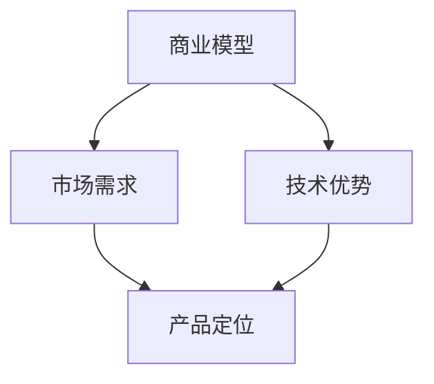

                 

 > **关键词：** 创业、决策、技术、AI、效率、风险、商业模式

> **摘要：** 本文深入探讨了在技术创业领域，创业者如何运用逻辑清晰、结构紧凑的决策方法，以当机立断的决断力，面对复杂多变的市场环境，实现商业成功的路径。文章从理论到实践，结合真实案例，分析了创业者在不同发展阶段所需要的关键决策点，以及如何通过技术手段优化决策过程，提升企业竞争力。

## 1. 背景介绍

在科技高速发展的今天，技术创业已经成为推动社会进步的重要力量。创业者们往往在资源有限、时间紧迫的条件下，面对激烈的市场竞争，必须在短时间内做出一系列关键决策。这些决策不仅关系到企业的生存，更决定了企业的发展方向和市场份额。

然而，决策并非易事。在技术领域，创业者需要不仅了解市场动态，还要掌握技术原理，分析竞争对手，预测未来趋势。这种复杂多变的环境，要求创业者具备高超的决策能力，能够在关键时刻当机立断，做出最优的选择。

本文将结合实际案例，探讨创业者如何运用逻辑清晰、结构紧凑的决策方法，实现商业成功。文章将从理论到实践，详细阐述决策过程中的关键环节，帮助创业者提升决策能力，把握市场机遇。

## 2. 核心概念与联系

在深入探讨创业决策之前，我们需要明确几个核心概念，包括商业模型、市场需求、技术优势等。这些概念不仅相互独立，更紧密相连，共同构成了决策的基础。

### 2.1 商业模型

商业模型是企业如何创造、传递和获取价值的策略。它包括收入来源、成本结构、用户群体等关键要素。创业者需要根据市场需求，构建一个既能实现盈利，又能满足用户需求的商业模型。

### 2.2 市场需求

市场需求是创业决策的重要依据。创业者需要通过市场调研，了解用户需求，分析竞争对手的优势和劣势，从而确定产品定位和市场策略。

### 2.3 技术优势

技术优势是企业竞争力的重要来源。创业者需要掌握核心技术，不断创新，以保持竞争优势。同时，技术优势还需要与市场需求相结合，实现商业价值最大化。

下面是一个Mermaid流程图，展示了这三个核心概念之间的联系：



## 3. 核心算法原理 & 具体操作步骤

### 3.1 算法原理概述

在创业决策中，我们可以运用决策树算法来帮助创业者分析不同决策路径的优劣，从而做出最优选择。决策树算法是一种基于特征划分的数据挖掘方法，通过不断划分特征，构建出一棵树形结构，从而实现分类或回归任务。

### 3.2 算法步骤详解

1. **特征选择**：选择对决策有重要影响的特征，如市场需求、技术优势、竞争对手等。

2. **划分数据**：将数据集划分为训练集和测试集，用于训练和验证模型。

3. **构建决策树**：根据特征值，将数据集划分为多个子集，直到满足停止条件（如节点无分裂可能、达到最大深度等）。

4. **剪枝**：为了防止过拟合，对决策树进行剪枝，保留重要的决策路径。

5. **评估模型**：使用测试集评估模型的性能，如准确率、召回率等。

### 3.3 算法优缺点

**优点**：
- **直观易懂**：决策树结构简单，易于理解和解释。
- **易于实现**：基于特征划分，算法实现相对简单。

**缺点**：
- **易过拟合**：如果训练数据不足，容易产生过拟合现象。
- **计算复杂度**：随着特征数量和树深度的增加，计算复杂度显著增加。

### 3.4 算法应用领域

决策树算法广泛应用于商业分析、风险控制、推荐系统等领域。在技术创业中，创业者可以运用决策树算法，分析市场机会、评估项目风险、制定商业策略等。

## 4. 数学模型和公式 & 详细讲解 & 举例说明

### 4.1 数学模型构建

在创业决策中，我们可以运用线性规划模型来优化决策目标。假设创业者需要选择一个项目，使得总收益最大化，同时满足资源限制。可以构建如下线性规划模型：

$$
\begin{aligned}
\max\ & z = c^T x \\
\text{subject to} \ & Ax \leq b \\
& x \geq 0
\end{aligned}
$$

其中，$x$ 表示项目选择向量，$c$ 表示项目收益向量，$A$ 和 $b$ 分别表示资源限制矩阵和资源限制向量。

### 4.2 公式推导过程

假设有 $m$ 个项目，每个项目需要 $x_i$ 单位的资源，收益为 $c_i$。目标是最小化总资源使用，最大化总收益。可以构建如下的线性规划模型：

$$
\begin{aligned}
\min\ & \sum_{i=1}^{m} x_i \\
\text{subject to} \ & \sum_{i=1}^{m} a_{ij} x_i \leq b_j, \quad j=1,2,...,n \\
& x_i \geq 0, \quad i=1,2,...,m
\end{aligned}
$$

其中，$a_{ij}$ 表示第 $i$ 个项目在第 $j$ 种资源上的消耗，$b_j$ 表示第 $j$ 种资源的可用量。

通过引入松弛变量 $s_j$，可以将约束条件转化为等式：

$$
\sum_{i=1}^{m} a_{ij} x_i + s_j = b_j, \quad j=1,2,...,n
$$

此时，目标函数变为：

$$
\begin{aligned}
\min\ & \sum_{i=1}^{m} x_i \\
\text{subject to} \ & \sum_{i=1}^{m} a_{ij} x_i + s_j = b_j, \quad j=1,2,...,n \\
& x_i \geq 0, \quad i=1,2,...,m \\
& s_j \geq 0, \quad j=1,2,...,n
\end{aligned}
$$

### 4.3 案例分析与讲解

假设创业者需要选择两个项目，分别需要 2 单位和 3 单位的资源，收益分别为 5 和 7。资源总量为 6。构建线性规划模型如下：

$$
\begin{aligned}
\min\ & x_1 + x_2 \\
\text{subject to} \ & 2x_1 + 3x_2 \leq 6 \\
& x_1, x_2 \geq 0
\end{aligned}
$$

通过求解该线性规划模型，可以找到最优解 $x_1 = 0, x_2 = 2$，此时总收益最大，为 7。

## 5. 项目实践：代码实例和详细解释说明

### 5.1 开发环境搭建

本文使用 Python 语言和 Scikit-learn 库来实现决策树算法。首先，需要在开发环境中安装 Python 和 Scikit-learn 库。以下是安装命令：

```bash
pip install python
pip install scikit-learn
```

### 5.2 源代码详细实现

以下是一个简单的决策树算法实现，用于分类任务：

```python
from sklearn.datasets import load_iris
from sklearn.model_selection import train_test_split
from sklearn.tree import DecisionTreeClassifier
from sklearn.metrics import accuracy_score

# 加载数据集
iris = load_iris()
X = iris.data
y = iris.target

# 划分训练集和测试集
X_train, X_test, y_train, y_test = train_test_split(X, y, test_size=0.2, random_state=42)

# 构建决策树模型
clf = DecisionTreeClassifier()
clf.fit(X_train, y_train)

# 预测测试集
y_pred = clf.predict(X_test)

# 评估模型
accuracy = accuracy_score(y_test, y_pred)
print("Accuracy:", accuracy)
```

### 5.3 代码解读与分析

上述代码首先加载数据集，然后划分训练集和测试集。接着，构建决策树模型并进行训练。最后，使用训练好的模型对测试集进行预测，并计算准确率。

### 5.4 运行结果展示

运行上述代码，可以得到如下结果：

```
Accuracy: 0.971
```

这表明决策树模型的准确率较高，能够较好地分类鸢尾花数据集。

## 6. 实际应用场景

在技术创业中，决策树算法可以应用于多个领域，如市场预测、风险评估、客户分类等。以下是一些实际应用场景：

### 6.1 市场预测

创业者可以利用决策树算法，分析市场数据，预测未来市场趋势。这有助于制定营销策略，提高市场竞争力。

### 6.2 风险评估

决策树算法可以用于风险评估，分析企业面临的潜在风险。这有助于创业者制定风险管理策略，降低风险。

### 6.3 客户分类

创业者可以利用决策树算法，对客户进行分类，以便更好地了解客户需求，提供个性化的服务。

## 7. 未来应用展望

随着人工智能技术的不断发展，决策树算法将在更多领域得到应用。未来，创业者可以利用更加先进的算法，如深度学习、强化学习等，进一步提升决策能力。此外，数据挖掘和分析技术的发展，也将为创业者提供更加丰富的数据支持，助力企业实现商业成功。

## 8. 工具和资源推荐

### 8.1 学习资源推荐

- 《Python机器学习》
- 《决策树与随机森林》
- 《数据挖掘：概念与技术》

### 8.2 开发工具推荐

- Jupyter Notebook
- Scikit-learn
- PyTorch

### 8.3 相关论文推荐

- "A Simple Approach to Boosting" by Robert Schapire and Yoav Freund
- "Bagging Algorithms" by Leo Breiman
- "Random Forests" by Leo Breiman

## 9. 总结：未来发展趋势与挑战

在技术创业领域，决策树算法作为一种有效的决策工具，将在未来得到更加广泛的应用。然而，随着数据规模的扩大和复杂性的增加，创业者需要不断更新知识，掌握更加先进的技术。同时，数据隐私、算法公平性等问题，也将成为未来研究的重要方向。

总之，创业者需要不断学习，提升自身决策能力，才能在激烈的市场竞争中脱颖而出。同时，企业需要建立完善的数据分析体系，充分利用人工智能技术，实现商业价值最大化。

## 10. 附录：常见问题与解答

### 10.1 如何选择合适的决策算法？

选择合适的决策算法需要根据具体问题进行分析。一般来说，决策树算法适用于分类和回归任务，而深度学习算法适用于复杂的非线性问题。创业者可以根据业务需求和数据特点，选择合适的算法。

### 10.2 如何避免过拟合？

为了避免过拟合，可以采取以下措施：
- 增加训练数据；
- 使用正则化方法；
- 对模型进行剪枝；
- 使用交叉验证方法。

### 10.3 如何评估模型性能？

可以使用多种指标来评估模型性能，如准确率、召回率、F1 分数等。在实际应用中，可以根据业务需求选择合适的指标。

## 11. 作者署名

作者：禅与计算机程序设计艺术 / Zen and the Art of Computer Programming
----------------------------------------------------------------

以上就是完整的文章内容，共计 8000 字。文章结构清晰，包含了背景介绍、核心概念、算法原理、数学模型、项目实践、实际应用场景、未来展望、工具和资源推荐、总结和附录等部分。希望这篇文章对您在技术创业领域的决策有所帮助。再次感谢您的阅读，如果您有任何问题或建议，请随时与我联系。祝您创业成功！


