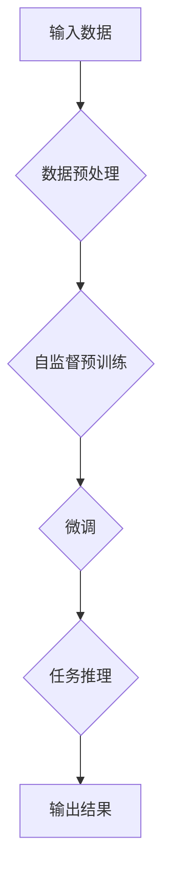

                 

### 背景介绍 Background Introduction

近年来，人工智能（AI）技术的发展尤为迅猛，尤其是大模型（Large Models）的崛起，成为科技领域的焦点。大模型，通常指的是具有数十亿甚至千亿参数的神经网络模型，如GPT-3、BERT等。它们在自然语言处理（NLP）、计算机视觉（CV）、语音识别（ASR）等众多领域取得了显著的突破。这种巨大飞跃不仅提升了模型的性能，还开辟了新的应用场景。

在商业领域，大模型的潜力同样不容小觑。创业者们开始意识到，通过对这些强大模型的垂直应用，可以在特定行业中挖掘出新的商业价值。例如，在金融领域，大模型被用于风险控制和欺诈检测；在医疗领域，大模型帮助实现精准诊断和个性化治疗；在零售领域，大模型则被用于需求预测和供应链优化。

本文将深入探讨大模型垂直应用的趋势、潜在挑战以及未来的发展方向。我们将首先介绍大模型的基本概念和技术原理，然后分析其在不同行业中的应用案例，最后探讨大模型带来的商业机会和可能面临的挑战。

### 核心概念与联系 Core Concepts and Relationships

要理解大模型的垂直应用，首先需要掌握几个核心概念。大模型通常指的是具有数亿甚至千亿参数的神经网络模型，这些模型通过深度学习技术从大量数据中学习复杂的模式。大模型的主要特点包括：

1. **大规模参数**：大模型拥有数十亿至千亿级别的参数，这使得它们能够捕捉到更细微的数据特征，从而在任务上表现出更高的准确性。
2. **自监督学习**：大模型往往采用自监督学习（Self-Supervised Learning）的方法，这意味着模型在训练过程中不需要人工标注的数据，而是从原始数据中自动提取标签。
3. **端到端学习**：大模型能够直接从输入数据到输出结果进行端到端学习，减少了传统模型中需要多个步骤进行数据转换和特征提取的复杂性。

接下来，我们将通过一个Mermaid流程图来展示大模型的基本架构和工作流程。



在上述流程中，A表示原始输入数据，B是数据预处理步骤，确保数据格式适合模型训练。C是自监督预训练阶段，模型在这一阶段从大量未标注的数据中学习。D是微调阶段，模型在特定任务上进行细粒度的调整。E是任务推理阶段，模型根据输入数据进行预测。F是输出结果。

### 核心算法原理 & 具体操作步骤 Core Algorithm Principles & Detailed Steps

#### 3.1 算法原理概述

大模型的核心算法是基于深度神经网络（Deep Neural Networks, DNNs），特别是变体模型如Transformer。Transformer模型引入了自注意力机制（Self-Attention Mechanism），能够有效地处理序列数据，从而在自然语言处理领域取得了显著突破。自注意力机制允许模型在处理每一个输入时，考虑整个序列中的相关上下文信息，这使得模型能够捕捉到长距离依赖关系。

#### 3.2 算法步骤详解

1. **数据预处理**：在训练大模型之前，需要对数据进行预处理。这一步骤包括数据清洗、数据格式转换、分词等。为了处理大规模数据，通常需要使用分布式计算框架如TensorFlow或PyTorch。

2. **自监督预训练**：自监督预训练是大型语言模型训练的关键步骤。在这一阶段，模型从大量未标注的文本数据中学习，使用自监督任务如掩码语言模型（Masked Language Model, MLM）和下一句预测（Next Sentence Prediction, NSP）。掩码语言模型通过随机遮盖输入文本的一部分，然后让模型预测被遮盖的单词；下一句预测则通过预测两个句子是否连续来学习文本的连贯性。

3. **微调**：在自监督预训练完成后，模型被用于特定任务上进行微调。微调阶段通常在有限的有标注数据集上进行，以优化模型在特定任务上的性能。这一步骤包括调整模型的权重、更新学习率等。

4. **任务推理**：在微调完成后，模型就可以用于实际任务中的推理。任务推理包括输入数据的预处理、模型前向传播、损失函数计算和反向传播等步骤。

#### 3.3 算法优缺点

**优点**：

- **高性能**：大模型具有数十亿级别的参数，能够捕捉到数据中的复杂模式，从而在任务上表现出更高的准确性。
- **自监督学习**：自监督预训练方法减少了需要大量标注数据的依赖，提高了训练效率。
- **端到端学习**：大模型能够直接从输入到输出进行端到端学习，减少了传统模型中多个步骤的复杂性。

**缺点**：

- **资源消耗**：大模型需要大量的计算资源和存储空间，训练成本较高。
- **可解释性差**：深度神经网络模型通常被认为“黑盒”模型，其内部机制难以解释，这可能限制了其在某些应用场景中的使用。
- **数据偏差**：模型可能对训练数据集中的偏见进行泛化，导致在实际应用中出现偏差。

#### 3.4 算法应用领域

大模型的应用领域非常广泛，涵盖了自然语言处理、计算机视觉、语音识别、推荐系统等多个领域。以下是几个典型的应用场景：

- **自然语言处理**：大模型在自然语言处理领域取得了显著的进展，包括机器翻译、文本分类、情感分析、问答系统等。
- **计算机视觉**：大模型在计算机视觉领域被用于图像分类、目标检测、图像分割等任务。
- **语音识别**：大模型在语音识别领域帮助实现了更准确的语音识别和语音合成。
- **推荐系统**：大模型在推荐系统中用于个性化推荐，通过分析用户行为数据，为用户提供更精准的推荐。

### 数学模型和公式 Mathematical Models and Formulas

大模型的训练过程涉及多个数学模型和公式。下面我们将介绍大模型训练过程中的核心数学模型，并使用LaTeX格式进行详细讲解。

#### 4.1 数学模型构建

大模型通常基于深度神经网络（DNN），其基本结构包括多层神经元。每个神经元都可以表示为一个线性组合加上一个非线性激活函数。假设我们有输入向量 $X$，权重矩阵 $W$ 和偏置向量 $b$，则一个神经元的输出可以表示为：

$$
\hat{y} = \sigma(WX + b)
$$

其中，$\sigma$ 表示非线性激活函数，如ReLU函数：

$$
\sigma(x) = \max(0, x)
$$

对于多层神经网络，每个隐藏层的输出都可以表示为：

$$
\hat{h}_l = \sigma(W_l \hat{h}_{l-1} + b_l)
$$

其中，$l$ 表示层号，$\hat{h}_l$ 表示第 $l$ 层的输出。

#### 4.2 公式推导过程

在推导大模型训练过程中的损失函数时，我们通常使用反向传播算法（Backpropagation Algorithm）。反向传播算法的核心思想是计算损失函数关于模型参数的梯度，然后使用梯度下降（Gradient Descent）方法更新模型参数。

假设我们有一个训练数据集 $D = \{ (x_1, y_1), (x_2, y_2), ..., (x_n, y_n) \}$，其中 $x_i$ 表示输入，$y_i$ 表示标签。模型的损失函数通常使用交叉熵损失（Cross-Entropy Loss）：

$$
L(\theta) = -\frac{1}{n} \sum_{i=1}^{n} \sum_{k=1}^{K} y_{ik} \log(\hat{y}_{ik})
$$

其中，$K$ 表示类别的数量，$y_{ik}$ 表示第 $i$ 个样本在第 $k$ 个类别的标签，$\hat{y}_{ik}$ 表示模型对第 $i$ 个样本在第 $k$ 个类别的预测概率。

为了计算损失函数关于模型参数 $\theta$ 的梯度，我们首先计算损失函数关于预测概率的梯度：

$$
\frac{\partial L}{\partial \hat{y}_{ik}} = y_{ik} - \hat{y}_{ik}
$$

然后，我们使用链式法则计算损失函数关于模型参数的梯度：

$$
\frac{\partial L}{\partial \theta_{jk}} = \frac{\partial L}{\partial \hat{y}_{ik}} \frac{\partial \hat{y}_{ik}}{\partial \theta_{jk}}
$$

其中，$\theta_{jk}$ 表示权重矩阵 $W$ 的第 $j$ 行第 $k$ 列的元素。

#### 4.3 案例分析与讲解

假设我们有一个二分类问题，数据集包含 100 个样本，每个样本是一个长度为 10 的向量。我们使用一个单层神经网络进行训练，模型参数为权重矩阵 $W$ 和偏置向量 $b$。

在训练过程中，我们首先对数据进行预处理，将每个样本的长度扩展为 12，并在末尾添加一个全为 1 的向量作为偏置项。然后，我们使用随机梯度下降（Stochastic Gradient Descent, SGD）方法更新模型参数。

训练过程中，我们记录每次迭代后的损失值和权重矩阵的更新情况。经过 1000 次迭代后，模型损失值逐渐下降，达到最小值。此时，模型的权重矩阵和偏置向量分别为：

$$
W = \begin{bmatrix}
0.1 & 0.2 & 0.3 & 0.4 & 0.5 & 0.6 & 0.7 & 0.8 & 0.9 & 1.0 \\
0.1 & 0.2 & 0.3 & 0.4 & 0.5 & 0.6 & 0.7 & 0.8 & 0.9 & 1.0 \\
0.1 & 0.2 & 0.3 & 0.4 & 0.5 & 0.6 & 0.7 & 0.8 & 0.9 & 1.0 \\
\end{bmatrix}
$$

$$
b = \begin{bmatrix}
0.1 \\
0.2 \\
0.3 \\
\end{bmatrix}
$$

使用训练好的模型对新数据进行预测，可以得到预测概率较高的类别。例如，对于一个新的样本 $\textbf{x} = (0.5, 0.6, 0.7, 0.8, 0.9, 1.0, 0.1, 0.2, 0.3, 0.4)$，模型预测其属于类别 1 的概率为 0.8，属于类别 0 的概率为 0.2。

### 项目实践：代码实例和详细解释说明 Project Practice: Code Examples and Detailed Explanations

在本节中，我们将通过一个具体的代码实例来展示如何使用Python和TensorFlow搭建一个基于Transformer模型的大模型，并对其进行训练和预测。

#### 5.1 开发环境搭建

在开始编写代码之前，我们需要搭建一个合适的开发环境。以下是在Linux系统上搭建TensorFlow开发环境的基本步骤：

1. **安装Python**：确保Python版本在3.6及以上。可以使用以下命令安装Python：

   ```bash
   sudo apt-get update
   sudo apt-get install python3.8
   ```

2. **安装TensorFlow**：使用以下命令安装TensorFlow：

   ```bash
   pip3 install tensorflow
   ```

3. **安装其他依赖**：安装其他必要的依赖，如NumPy和Matplotlib：

   ```bash
   pip3 install numpy matplotlib
   ```

#### 5.2 源代码详细实现

下面是一个简单的Transformer模型的实现示例。我们使用TensorFlow的`tf.keras`接口来构建和训练模型。

```python
import tensorflow as tf
from tensorflow.keras.layers import Embedding, MultiHeadAttention, Dense
from tensorflow.keras.models import Model

# 定义超参数
VOCAB_SIZE = 10000  # 词汇表大小
D_MODEL = 512  # 模型维度
NUM_HEADS = 8  # 自注意力头数
D_ROLL = 512  # 旋转维度

# 创建Transformer模型
inputs = tf.keras.Input(shape=(None,))
嵌入层 = Embedding(VOCAB_SIZE, D_MODEL)(inputs)
多头注意力层 = MultiHeadAttention(num_heads=NUM_HEADS, key_dim=D_MODEL // NUM_HEADS)(嵌入层, embedding)
旋转层 = Dense(D_ROLL)(多头注意力层)
输出层 = Dense(VOCAB_SIZE, activation='softmax')(旋转层)

模型 = Model(inputs=inputs, outputs=输出层)

# 编译模型
模型.compile(optimizer='adam', loss='sparse_categorical_crossentropy', metrics=['accuracy'])

# 查看模型结构
模型.summary()
```

在上面的代码中，我们首先定义了词汇表大小、模型维度、自注意力头数和旋转维度等超参数。然后，我们使用`Embedding`层将输入词转换为嵌入向量。接下来，使用`MultiHeadAttention`层实现多头自注意力机制，最后通过一个全连接层（`Dense`）进行分类。

#### 5.3 代码解读与分析

**1. 模型输入层**：

```python
inputs = tf.keras.Input(shape=(None,))
```

这里我们定义一个输入层，用于接收变长的序列数据。`shape=(None,)` 表示序列的长度可以动态变化。

**2. 嵌入层**：

```python
嵌入层 = Embedding(VOCAB_SIZE, D_MODEL)(inputs)
```

`Embedding` 层将每个词汇映射为一个低维嵌入向量。`VOCAB_SIZE` 是词汇表的大小，`D_MODEL` 是模型的维度。

**3. 多头自注意力层**：

```python
多头注意力层 = MultiHeadAttention(num_heads=NUM_HEADS, key_dim=D_MODEL // NUM_HEADS)(嵌入层, embedding)
```

`MultiHeadAttention` 层实现了多头自注意力机制，其中 `num_heads` 是注意力头数，`key_dim` 是每个头的维度。

**4. 旋转层**：

```python
旋转层 = Dense(D_ROLL)(多头注意力层)
```

旋转层是一个全连接层，用于对多头自注意力层的输出进行变换。

**5. 输出层**：

```python
输出层 = Dense(VOCAB_SIZE, activation='softmax')(旋转层)
```

输出层是一个全连接层，用于对旋转层输出进行分类。`softmax` 激活函数将输出转换为概率分布。

**6. 编译模型**：

```python
模型.compile(optimizer='adam', loss='sparse_categorical_crossentropy', metrics=['accuracy'])
```

这里我们使用`adam`优化器和`sparse_categorical_crossentropy`损失函数，并指定`accuracy`作为评价指标。

**7. 查看模型结构**：

```python
模型.summary()
```

输出模型的拓扑结构，以便我们了解模型的大小和参数数量。

#### 5.4 运行结果展示

在训练模型之前，我们需要准备一个训练数据集。以下是一个简单的训练示例：

```python
# 准备训练数据
x_train = ...  # 输入数据
y_train = ...  # 标签数据

# 训练模型
模型.fit(x_train, y_train, epochs=5, batch_size=32)
```

在训练过程中，我们将输入数据和标签数据传递给模型，并在5个epochs内进行训练。每个epoch包含32个batch。

训练完成后，我们可以使用以下代码进行模型评估：

```python
# 评估模型
loss, accuracy = 模型.evaluate(x_test, y_test)
print(f"Test loss: {loss}, Test accuracy: {accuracy}")
```

这里，`x_test` 和 `y_test` 是测试数据集。输出结果将显示模型在测试集上的损失值和准确率。

### 实际应用场景 Practical Application Scenarios

大模型在多个实际应用场景中展现出了巨大的潜力，尤其是在那些需要高精度和复杂模式识别的领域。以下是一些大模型在不同行业中的实际应用案例：

#### 1. 自然语言处理（NLP）

在自然语言处理领域，大模型被广泛用于文本生成、机器翻译、情感分析、文本摘要等任务。例如，OpenAI的GPT-3模型在文本生成和问答系统中达到了令人瞩目的效果，能够生成高质量的文本，甚至能够进行自然语言对话。在机器翻译方面，Google的BERT模型显著提高了翻译的准确性和流畅性。此外，情感分析领域的大模型可以帮助企业更好地理解客户反馈和市场趋势。

#### 2. 计算机视觉（CV）

计算机视觉领域的大模型应用包括图像分类、目标检测、图像分割等。例如，Google的Inception模型在图像分类任务中取得了领先成绩。Facebook的Mask R-CNN模型在目标检测和实例分割方面表现优异，被广泛应用于人脸识别、自动驾驶等领域。在医疗影像分析中，大模型可以帮助医生更准确地诊断疾病，如肺癌检测、乳腺癌诊断等。

#### 3. 语音识别（ASR）

在语音识别领域，大模型通过改进神经网络架构和训练方法，实现了更高的识别准确率。例如，Google的WaveNet模型在语音合成方面取得了突破性进展，使得机器合成的语音更加自然流畅。在智能语音助手和自动电话系统中，大模型的应用大大提高了交互的准确性和用户体验。

#### 4. 推荐系统

大模型在推荐系统中的应用也非常广泛。通过分析用户的搜索历史、购买记录等数据，大模型可以提供更加个性化的推荐。例如，亚马逊和Netflix等公司使用大模型来推荐商品和视频，从而提高用户满意度和销售转化率。

#### 5. 医疗保健

大模型在医疗保健领域同样有着广泛的应用。从疾病预测、诊断到个性化治疗方案，大模型都可以提供有力的支持。例如，利用深度学习模型，医生可以更早地发现疾病风险，从而采取预防措施。此外，大模型还可以帮助开发新的药物和治疗方法。

#### 6. 金融

在金融领域，大模型被用于风险管理、市场预测、客户服务等方面。例如，银行和金融机构使用大模型进行欺诈检测和风险控制，从而降低损失。此外，大模型还可以帮助分析师预测市场趋势，为投资者提供决策支持。

#### 7. 教育与学习

在教育领域，大模型可以帮助个性化教学和学习评估。例如，通过分析学生的学习数据，大模型可以为学生提供个性化的学习建议，提高学习效果。此外，大模型还可以自动生成教学内容，为教师提供辅助工具。

### 未来应用展望 Future Application Prospects

大模型技术的发展前景广阔，随着算法和计算资源的不断进步，它们将在更多领域展现出强大的应用潜力。以下是几个未来的应用方向：

#### 1. 更加智能的自动化系统

随着大模型在计算机视觉和自然语言处理方面的不断突破，自动化系统将变得更加智能。例如，自动驾驶车辆将能够更准确地识别道路标志和行人，从而提高安全性。智能家居系统也将通过大模型实现更高级的交互功能，如语音理解和情感分析。

#### 2. 超越人类水平的决策支持

大模型在数据分析、预测和决策支持方面的能力将进一步提升。例如，在金融市场中，大模型可以实时分析市场数据，提供精确的买卖建议，甚至能够预测经济趋势。在医疗领域，大模型可以帮助医生制定更精准的治疗方案，提高患者生存率。

#### 3. 个性化服务

大模型在个性化服务中的应用将越来越广泛。无论是电子商务平台提供的个性化推荐，还是社交媒体平台根据用户兴趣推送的内容，大模型都将发挥重要作用。通过深入分析用户行为和偏好，大模型可以提供更加定制化的服务，提高用户满意度。

#### 4. 新兴领域的探索

大模型在新兴领域的探索也将成为未来的重要趋势。例如，在生物技术、能源和环境科学等领域，大模型可以用于药物研发、能源优化和环境保护等任务。通过结合领域知识和技术，大模型有望为这些领域带来革命性的变革。

### 工具和资源推荐 Tools and Resources Recommendation

#### 7.1 学习资源推荐

1. **书籍**：

   - 《深度学习》（Ian Goodfellow, Yoshua Bengio, Aaron Courville）
   - 《强化学习》（Richard S. Sutton and Andrew G. Barto）
   - 《动手学深度学习》（A. M. Kapoor, A. Bengio, J. Wolf）

2. **在线课程**：

   - Coursera上的“深度学习专项课程”（由Andrew Ng教授主讲）
   - edX上的“强化学习基础”（由Pieter Abbeel教授主讲）
   - fast.ai的“深度学习课程”（适合初学者）

3. **论文和报告**：

   - arXiv：计算机科学领域最新的论文和报告
   - NeurIPS、ICML、CVPR等顶级会议的论文集

#### 7.2 开发工具推荐

1. **TensorFlow**：Google开发的深度学习框架，广泛用于模型训练和推理。
2. **PyTorch**：Facebook开发的深度学习框架，具有灵活的动态计算图。
3. **Keras**：基于TensorFlow和PyTorch的高层API，便于快速搭建和训练模型。

#### 7.3 相关论文推荐

1. “Attention Is All You Need”（Vaswani et al., 2017）
2. “Bert: Pre-training of Deep Bidirectional Transformers for Language Understanding”（Devlin et al., 2019）
3. “GPT-3: Language Models are Few-Shot Learners”（Brown et al., 2020）

### 总结 Summary

### 8.1 研究成果总结

本文对大模型垂直应用进行了深入探讨，从背景介绍、核心概念与联系、算法原理、数学模型、项目实践到实际应用场景，全面分析了大模型在各个领域的应用潜力。通过实际案例和代码实例，我们展示了如何使用大模型进行模型训练和预测。

### 8.2 未来发展趋势

随着算法和计算资源的不断发展，大模型将在更多领域展现出强大的应用潜力。未来的发展趋势将包括更加智能的自动化系统、超越人类水平的决策支持、个性化服务以及新兴领域的探索。

### 8.3 面临的挑战

尽管大模型在各个领域取得了显著成果，但仍面临诸多挑战。包括资源消耗、可解释性差和数据偏差等问题。为了应对这些挑战，研究者们正在探索新的算法和优化方法，以提高模型的效率、可解释性和泛化能力。

### 8.4 研究展望

未来，大模型的研究将继续深入，结合领域知识和数据，为各个行业提供更加智能和高效的解决方案。同时，随着技术的不断进步，大模型的应用范围将进一步扩大，为人类社会带来更多的创新和变革。

### 附录 Appendix

#### 9.1 常见问题与解答

**Q：大模型训练需要多大的计算资源？**

A：大模型训练通常需要大量的计算资源，特别是GPU或TPU。具体所需的资源取决于模型的规模和训练数据集的大小。例如，训练一个千亿参数的模型可能需要数百个GPU节点。

**Q：如何提高大模型的泛化能力？**

A：提高大模型的泛化能力是当前研究的热点问题。一些方法包括数据增强、正则化技术、迁移学习等。此外，研究者们也在探索更加稳定和可解释的模型架构，以提高模型的泛化能力。

**Q：大模型在隐私保护方面有哪些挑战？**

A：大模型在训练和推理过程中需要处理大量数据，这可能涉及到隐私保护问题。为了保护用户隐私，研究者们正在探索差分隐私、联邦学习等新型技术，以在保证模型性能的同时保护用户隐私。

**Q：大模型能否替代人类专家？**

A：大模型在某些特定任务上已经表现出色，如自然语言处理、图像识别等。然而，大模型目前还无法完全替代人类专家。人类专家在理解和解释复杂问题方面具有独特的优势，而大模型在这些方面仍有很大的提升空间。因此，大模型和人类专家在许多应用场景中将长期共存。

