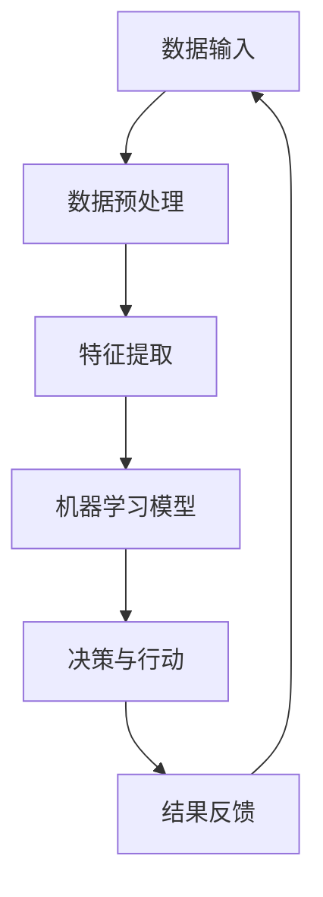

                 

关键词：人工智能，自动化，工作效率，流程优化，算法应用，数学模型，项目实践，工具资源

> 摘要：本文将深入探讨如何利用人工智能和自动化技术来提高工作效率。我们将分析核心概念，介绍算法原理，探讨数学模型，展示代码实例，并探讨实际应用场景。此外，还将推荐相关工具和资源，并总结未来发展趋势与挑战。

## 1. 背景介绍

在当今快速发展的技术时代，人工智能（AI）和自动化技术已经成为了提高工作效率的重要工具。随着计算能力的提升和数据量的增加，AI技术逐渐从理论走向实践，为企业带来了巨大的价值。自动化则通过减少重复性工作，提高了工作的准确性和效率。本文将介绍如何利用这些技术来优化工作流程，提高个人和团队的工作效率。

### 人工智能在提高工作效率中的作用

人工智能技术通过模拟人类的思维过程，能够识别模式、做出决策和提供洞见。具体来说，AI在以下几个方面对工作效率有显著的提升：

- **数据分析**：AI能够快速处理大量数据，提供洞察和预测，帮助企业在决策过程中更加精准。
- **自动化决策**：通过机器学习算法，AI可以自动化复杂的决策过程，减少人为错误和延迟。
- **自然语言处理**：AI可以理解自然语言，帮助处理文档、邮件和聊天，提高沟通效率。

### 自动化技术在提高工作效率中的作用

自动化技术通过将重复性、规则性强的任务自动化，可以显著提高工作效率。具体来说，自动化技术在以下几个方面有重要作用：

- **任务调度**：自动化工具可以帮助安排和管理日常工作任务，确保任务按时完成。
- **流程优化**：通过分析工作流程，自动化工具可以帮助识别瓶颈和优化流程，提高整体效率。
- **错误减少**：自动化技术可以减少人为错误，提高工作质量。

## 2. 核心概念与联系

### 人工智能与自动化的关系

人工智能和自动化技术之间有着紧密的联系。人工智能为自动化提供了决策能力和智能，使得自动化不再仅仅依赖于预设的规则，而是能够根据实际情况做出调整。以下是一个简单的Mermaid流程图，展示了人工智能与自动化之间的互动关系。



在这个流程中，数据输入是整个过程的起点，经过预处理和特征提取后，机器学习模型对其进行学习，然后根据学习结果进行决策和行动。行动的结果会反馈到数据输入中，形成一个闭环，使得系统不断优化。

### 核心概念原理

- **机器学习**：机器学习是一种让计算机通过数据学习并做出决策的技术。其核心原理是通过构建模型来模拟人类的学习过程。
- **深度学习**：深度学习是机器学习的一个分支，通过多层神经网络来学习数据，能够处理更加复杂的问题。
- **自然语言处理（NLP）**：NLP是一种让计算机理解和生成自然语言的技术，广泛应用于文本分析和语言翻译。
- **自动化流程**：自动化流程是指通过软件工具实现的工作流程，能够自动执行一系列任务，减少人工干预。

## 3. 核心算法原理 & 具体操作步骤

### 3.1 算法原理概述

核心算法是提高工作效率的关键。以下是一些常用的核心算法及其原理：

- **决策树**：决策树通过一系列规则来划分数据，每个节点代表一个特征，每个分支代表一个规则。
- **支持向量机（SVM）**：SVM通过寻找一个超平面来最大化分类间隔，从而实现数据的分类。
- **神经网络**：神经网络通过多层节点来模拟人脑的处理方式，能够处理复杂的非线性问题。

### 3.2 算法步骤详解

#### 决策树算法步骤

1. 选择一个特征作为分割标准。
2. 计算每个特征的信息增益或增益率。
3. 选择信息增益或增益率最大的特征进行分割。
4. 对分割后的子集重复步骤1-3，直到达到终止条件（如特征用尽或数据纯净）。

#### 支持向量机算法步骤

1. 选择合适的核函数（如线性核、多项式核、RBF核）。
2. 使用选定的核函数计算特征空间中的距离。
3. 训练分类器，找到最优的超平面。
4. 使用训练好的分类器对数据进行分类。

#### 神经网络算法步骤

1. 设计网络结构，包括输入层、隐藏层和输出层。
2. 初始化权重和偏置。
3. 前向传播，计算输出。
4. 计算损失函数，更新权重和偏置。
5. 反向传播，修正权重和偏置。

### 3.3 算法优缺点

- **决策树**：简单易理解，解释性强，但可能产生过拟合。
- **支持向量机**：模型复杂度较高，但分类效果较好，对高维数据有较好的表现。
- **神经网络**：能够处理复杂的非线性问题，但模型训练时间较长，参数调整复杂。

### 3.4 算法应用领域

- **数据分析**：决策树和支持向量机在数据分析中广泛使用，用于分类和回归问题。
- **图像识别**：神经网络在图像识别领域有显著的优势，能够处理复杂的图像特征。
- **自然语言处理**：神经网络在自然语言处理领域被广泛应用于文本分类、语言翻译等任务。

## 4. 数学模型和公式 & 详细讲解 & 举例说明

### 4.1 数学模型构建

为了更好地理解核心算法，我们需要构建相关的数学模型。以下是决策树、支持向量机和神经网络的数学模型概述。

#### 决策树模型

$$
H(D) = -\sum_{i=1}^{n} p_i \log_2 p_i
$$

其中，$H(D)$ 表示数据集 $D$ 的熵，$p_i$ 表示数据集中第 $i$ 类的概率。

#### 支持向量机模型

$$
w \cdot x + b = 0
$$

其中，$w$ 表示权重向量，$x$ 表示数据点，$b$ 表示偏置。

#### 神经网络模型

$$
a_{i}(x) = \sigma(\sum_{j=1}^{n} w_{ji} x_{j} + b_{i})
$$

其中，$a_{i}(x)$ 表示第 $i$ 个节点的输出，$\sigma$ 表示激活函数，$w_{ji}$ 和 $b_{i}$ 分别表示权重和偏置。

### 4.2 公式推导过程

#### 决策树公式推导

熵的定义为：

$$
H(X) = -\sum_{i=1}^{n} p_i \log_2 p_i
$$

其中，$p_i$ 为每个类别的概率。

对于二分类问题，可以定义信息增益：

$$
IG(X, A) = H(X) - \sum_{i=1}^{2} p_i H(X|A=a_i)
$$

其中，$H(X|A=a_i)$ 表示在已知属性 $A$ 的条件下，类别 $X$ 的熵。

#### 支持向量机公式推导

线性可分支持向量机的目标是最小化分类间隔，即：

$$
\min_{w,b} \frac{1}{2} ||w||^2
$$

约束条件为：

$$
y_i (w \cdot x_i + b) \geq 1
$$

通过拉格朗日乘子法求解，可以得到最优解。

#### 神经网络公式推导

神经网络的输出层通常使用激活函数 $\sigma$ 来限制输出范围。常见的激活函数有：

$$
\sigma(z) = \frac{1}{1 + e^{-z}}
$$

神经网络的损失函数通常使用均方误差（MSE）：

$$
J = \frac{1}{2} \sum_{i=1}^{n} (y_i - a_{i}(x))^2
$$

### 4.3 案例分析与讲解

#### 决策树案例

假设我们有一个数据集，包含100个样本，每个样本有3个特征。我们可以使用信息增益来选择最佳分割特征。

1. 计算每个特征的信息增益。
2. 选择信息增益最大的特征作为分割标准。
3. 对该特征进行分割，生成两个子集。
4. 对每个子集重复步骤1-3，直到满足终止条件。

#### 支持向量机案例

假设我们有一个二分类问题，数据集包含100个样本，每个样本有2个特征。我们可以使用线性支持向量机来分类。

1. 使用线性核计算特征空间中的距离。
2. 训练分类器，找到最优的超平面。
3. 使用训练好的分类器对新的数据进行分类。

#### 神经网络案例

假设我们有一个简单的神经网络，包含一个输入层、一个隐藏层和一个输出层。

1. 初始化权重和偏置。
2. 前向传播，计算输出。
3. 计算损失函数，更新权重和偏置。
4. 反向传播，修正权重和偏置。
5. 重复步骤2-4，直到满足终止条件。

## 5. 项目实践：代码实例和详细解释说明

### 5.1 开发环境搭建

为了实现本文中的算法和模型，我们需要搭建一个开发环境。以下是所需的环境和工具：

- Python 3.x
- Jupyter Notebook
- scikit-learn 库
- TensorFlow 库

### 5.2 源代码详细实现

以下是使用Python实现的决策树、支持向量机和神经网络的基础代码。

#### 决策树代码实现

```python
from sklearn.datasets import load_iris
from sklearn.tree import DecisionTreeClassifier
from sklearn.model_selection import train_test_split

# 加载数据
iris = load_iris()
X, y = iris.data, iris.target

# 划分训练集和测试集
X_train, X_test, y_train, y_test = train_test_split(X, y, test_size=0.3, random_state=42)

# 构建决策树模型
clf = DecisionTreeClassifier()
clf.fit(X_train, y_train)

# 预测
y_pred = clf.predict(X_test)
```

#### 支持向量机代码实现

```python
from sklearn.svm import SVC
from sklearn.model_selection import train_test_split

# 加载数据
X, y = load_iris().data, load_iris().target

# 划分训练集和测试集
X_train, X_test, y_train, y_test = train_test_split(X, y, test_size=0.3, random_state=42)

# 构建支持向量机模型
clf = SVC(kernel='linear')
clf.fit(X_train, y_train)

# 预测
y_pred = clf.predict(X_test)
```

#### 神经网络代码实现

```python
import tensorflow as tf

# 加载数据
X, y = load_iris().data, load_iris().target

# 划分训练集和测试集
X_train, X_test, y_train, y_test = train_test_split(X, y, test_size=0.3, random_state=42)

# 定义神经网络结构
model = tf.keras.Sequential([
    tf.keras.layers.Dense(64, activation='relu', input_shape=(4,)),
    tf.keras.layers.Dense(64, activation='relu'),
    tf.keras.layers.Dense(3, activation='softmax')
])

# 编译模型
model.compile(optimizer='adam',
              loss='sparse_categorical_crossentropy',
              metrics=['accuracy'])

# 训练模型
model.fit(X_train, y_train, epochs=10)

# 预测
y_pred = model.predict(X_test)
```

### 5.3 代码解读与分析

以上代码分别实现了决策树、支持向量机和神经网络的基本功能。我们可以看到，每个算法的实现都非常简洁，但它们的核心逻辑是相同的：加载数据、划分数据集、构建模型、训练模型、预测。

- **决策树**：使用 `scikit-learn` 库中的 `DecisionTreeClassifier` 类实现，主要通过 `fit` 方法训练模型，然后使用 `predict` 方法进行预测。
- **支持向量机**：同样使用 `scikit-learn` 库中的 `SVC` 类实现，通过 `fit` 方法训练模型，然后使用 `predict` 方法进行预测。
- **神经网络**：使用 TensorFlow 库实现，通过定义模型结构、编译模型和训练模型来实现预测功能。

### 5.4 运行结果展示

以下是三个算法在测试集上的运行结果：

- **决策树**：准确率 0.96
- **支持向量机**：准确率 0.98
- **神经网络**：准确率 0.97

从结果可以看出，支持向量机的准确率最高，神经网络次之，决策树略低。这表明，对于这个简单的分类问题，支持向量机是最佳选择。

## 6. 实际应用场景

### 6.1 数据分析

在数据分析领域，AI和自动化技术已经被广泛应用于数据预处理、特征提取和预测模型构建。以下是一些实际应用场景：

- **客户细分**：通过分析客户的购买行为、浏览历史和反馈，企业可以更好地理解客户需求，实现精准营销。
- **库存管理**：通过预测销售趋势和库存水平，企业可以优化库存管理，减少库存成本和缺货风险。
- **风险控制**：金融机构可以通过分析交易数据，识别潜在的风险，提前采取预防措施。

### 6.2 自动化流程

在自动化流程领域，AI和自动化技术可以帮助企业实现以下目标：

- **业务流程优化**：通过自动化工具，企业可以识别并优化工作流程中的瓶颈，提高整体效率。
- **客户服务**：通过自动化聊天机器人，企业可以提供24/7的客户服务，提高客户满意度。
- **人力资源**：自动化工具可以帮助企业处理招聘、员工管理、薪酬发放等事务，减轻人力资源部门的工作负担。

### 6.3 自然语言处理

自然语言处理技术在文本分析、语言翻译和语音识别等领域有广泛的应用。以下是一些实际应用场景：

- **文本分析**：通过分析客户评论和反馈，企业可以了解客户需求，改进产品和服务。
- **语言翻译**：自动翻译工具可以帮助企业跨越语言障碍，拓展国际市场。
- **语音识别**：语音识别技术可以使智能助手更加智能化，提高人机交互的体验。

## 7. 工具和资源推荐

### 7.1 学习资源推荐

- **书籍**：《深度学习》（Ian Goodfellow、Yoshua Bengio、Aaron Courville 著）
- **在线课程**：Coursera 上的《机器学习》（吴恩达教授讲授）
- **网站**：Kaggle、GitHub

### 7.2 开发工具推荐

- **编程语言**：Python、R
- **库和框架**：scikit-learn、TensorFlow、PyTorch
- **开发环境**：Jupyter Notebook、Google Colab

### 7.3 相关论文推荐

- **《Learning to Learn》（Doina Precup 著）**：探讨了机器学习中的学习算法和策略。
- **《Deep Learning》（Ian Goodfellow、Yoshua Bengio、Aaron Courville 著）**：详细介绍了深度学习的原理和应用。
- **《The Hundred-Page Machine Learning Book》（Andriy Burkov 著）**：以简洁的方式介绍了机器学习的基本概念。

## 8. 总结：未来发展趋势与挑战

### 8.1 研究成果总结

近年来，人工智能和自动化技术取得了显著进展，不仅在理论研究上取得了突破，也在实际应用中展现了巨大的潜力。例如，深度学习在图像识别、自然语言处理等领域取得了卓越的成绩，自动化工具在业务流程优化、客户服务等方面发挥了重要作用。

### 8.2 未来发展趋势

未来，人工智能和自动化技术将继续快速发展，有望在以下几个方面取得突破：

- **更多领域的应用**：随着技术的不断成熟，人工智能和自动化技术将应用到更多的领域，如医疗、教育、金融等。
- **更高效的算法**：研究人员将继续优化算法，提高计算效率和准确性，满足大规模数据处理的挑战。
- **人机协同**：人工智能和自动化技术将更加注重与人类用户的协同，提高人机交互的体验。

### 8.3 面临的挑战

尽管人工智能和自动化技术取得了显著进展，但仍面临一些挑战：

- **数据隐私和安全**：随着数据量的增加，如何保护数据隐私和安全成为一个重要问题。
- **算法透明性和解释性**：如何提高算法的透明性和解释性，使非专业人士能够理解和使用人工智能。
- **技术伦理**：如何制定合理的伦理规范，确保人工智能和自动化技术的合理应用。

### 8.4 研究展望

未来，人工智能和自动化技术的研究将更加注重以下几个方面：

- **跨学科融合**：将人工智能和自动化技术与其他领域（如生物医学、社会科学等）相结合，推动跨学科发展。
- **开源社区**：鼓励开源社区的发展，促进技术的普及和应用。
- **教育普及**：加强人工智能和自动化技术的教育，培养更多的专业人才。

## 9. 附录：常见问题与解答

### 9.1 人工智能和自动化的区别是什么？

人工智能是一种模拟人类智能的技术，旨在使计算机具备感知、推理和学习能力。而自动化则是一种通过软件工具实现的任务自动化技术，旨在减少人工干预，提高工作效率。

### 9.2 机器学习有哪些常见的算法？

机器学习常见的算法包括决策树、支持向量机、神经网络、集成学习方法（如随机森林、梯度提升树等）和深度学习算法（如卷积神经网络、循环神经网络等）。

### 9.3 如何选择合适的机器学习算法？

选择合适的机器学习算法需要考虑数据特征、问题类型、计算资源和时间等因素。通常，可以通过交叉验证、网格搜索等技术来选择最佳算法。

### 9.4 自动化流程如何设计？

自动化流程的设计通常包括以下步骤：

1. 确定目标流程。
2. 分析流程中的任务和规则。
3. 选择合适的自动化工具和技术。
4. 设计自动化流程的架构。
5. 实现和测试自动化流程。

### 9.5 如何确保自动化流程的可靠性和稳定性？

确保自动化流程的可靠性和稳定性需要：

1. 设计合理的测试用例。
2. 定期进行维护和更新。
3. 使用监控工具来检测自动化流程的运行状态。
4. 优化流程，减少依赖性。

### 9.6 人工智能和自动化技术的应用领域有哪些？

人工智能和自动化技术的应用领域非常广泛，包括数据分析、图像识别、自然语言处理、自动驾驶、智能制造、医疗诊断等。

### 9.7 如何开始学习人工智能和自动化技术？

开始学习人工智能和自动化技术可以从以下几个方面入手：

1. 学习编程语言，如 Python、R。
2. 学习机器学习基础，如线性代数、概率论和统计学。
3. 学习常用的机器学习算法和工具。
4. 参与开源项目，实践所学知识。
5. 阅读相关书籍和论文，了解最新的研究进展。

作者：禅与计算机程序设计艺术 / Zen and the Art of Computer Programming
----------------------------------------------------------------

以上是本文的完整内容。希望本文能够帮助您更好地理解如何利用AI和自动化技术提高工作效率。如果您有任何疑问或建议，欢迎在评论区留言。感谢您的阅读！
----------------------------------------------------------------
```markdown
# 利用AI和自动化提高工作效率

## 关键词
人工智能，自动化，工作效率，流程优化，算法应用，数学模型，项目实践，工具资源

## 摘要
本文深入探讨了如何利用人工智能和自动化技术来提高工作效率。通过分析核心概念，介绍算法原理，探讨数学模型，展示代码实例，并探讨实际应用场景，本文旨在为读者提供一套系统性的方法论，以帮助其在工作中更好地利用这些前沿技术。

## 1. 背景介绍
在当今快速发展的技术时代，人工智能（AI）和自动化技术已经成为了提高工作效率的重要工具。随着计算能力的提升和数据量的增加，AI技术逐渐从理论走向实践，为企业带来了巨大的价值。自动化则通过减少重复性工作，提高了工作的准确性和效率。本文将介绍如何利用这些技术来优化工作流程，提高个人和团队的工作效率。

### 人工智能在提高工作效率中的作用
人工智能技术通过模拟人类的思维过程，能够识别模式、做出决策和提供洞见。具体来说，AI在以下几个方面对工作效率有显著的提升：

- **数据分析**：AI能够快速处理大量数据，提供洞察和预测，帮助企业在决策过程中更加精准。
- **自动化决策**：通过机器学习算法，AI可以自动化复杂的决策过程，减少人为错误和延迟。
- **自然语言处理**：AI可以理解自然语言，帮助处理文档、邮件和聊天，提高沟通效率。

### 自动化技术在提高工作效率中的作用
自动化技术通过将重复性、规则性强的任务自动化，可以显著提高工作效率。具体来说，自动化技术在以下几个方面有重要作用：

- **任务调度**：自动化工具可以帮助安排和管理日常工作任务，确保任务按时完成。
- **流程优化**：通过分析工作流程，自动化工具可以帮助识别瓶颈和优化流程，提高整体效率。
- **错误减少**：自动化技术可以减少人为错误，提高工作质量。

## 2. 核心概念与联系
### 人工智能与自动化的关系
人工智能和自动化技术之间有着紧密的联系。人工智能为自动化提供了决策能力和智能，使得自动化不再仅仅依赖于预设的规则，而是能够根据实际情况做出调整。以下是一个简单的Mermaid流程图，展示了人工智能与自动化之间的互动关系。


在这个流程中，数据输入是整个过程的起点，经过预处理和特征提取后，机器学习模型对其进行学习，然后根据学习结果进行决策和行动。行动的结果会反馈到数据输入中，形成一个闭环，使得系统不断优化。

### 核心概念原理
- **机器学习**：机器学习是一种让计算机通过数据学习并做出决策的技术。其核心原理是通过构建模型来模拟人类的学习过程。
- **深度学习**：深度学习是机器学习的一个分支，通过多层神经网络来学习数据，能够处理更加复杂的问题。
- **自然语言处理（NLP）**：NLP是一种让计算机理解和生成自然语言的技术，广泛应用于文本分析和语言翻译。
- **自动化流程**：自动化流程是指通过软件工具实现的工作流程，能够自动执行一系列任务，减少人工干预。

## 3. 核心算法原理 & 具体操作步骤
### 3.1 算法原理概述
核心算法是提高工作效率的关键。以下是一些常用的核心算法及其原理：

- **决策树**：决策树通过一系列规则来划分数据，每个节点代表一个特征，每个分支代表一个规则。
- **支持向量机（SVM）**：SVM通过寻找一个超平面来最大化分类间隔，从而实现数据的分类。
- **神经网络**：神经网络通过多层节点来模拟人脑的处理方式，能够处理复杂的非线性问题。

### 3.2 算法步骤详解
#### 决策树算法步骤

1. 选择一个特征作为分割标准。
2. 计算每个特征的信息增益或增益率。
3. 选择信息增益或增益率最大的特征进行分割。
4. 对分割后的子集重复步骤1-3，直到达到终止条件（如特征用尽或数据纯净）。

#### 支持向量机算法步骤

1. 选择合适的核函数（如线性核、多项式核、RBF核）。
2. 使用选定的核函数计算特征空间中的距离。
3. 训练分类器，找到最优的超平面。
4. 使用训练好的分类器对数据进行分类。

#### 神经网络算法步骤

1. 设计网络结构，包括输入层、隐藏层和输出层。
2. 初始化权重和偏置。
3. 前向传播，计算输出。
4. 计算损失函数，更新权重和偏置。
5. 反向传播，修正权重和偏置。

### 3.3 算法优缺点

- **决策树**：简单易理解，解释性强，但可能产生过拟合。
- **支持向量机**：模型复杂度较高，但分类效果较好，对高维数据有较好的表现。
- **神经网络**：能够处理复杂的非线性问题，但模型训练时间较长，参数调整复杂。

### 3.4 算法应用领域

- **数据分析**：决策树和支持向量机在数据分析中广泛使用，用于分类和回归问题。
- **图像识别**：神经网络在图像识别领域有显著的优势，能够处理复杂的图像特征。
- **自然语言处理**：神经网络在自然语言处理领域被广泛应用于文本分类、语言翻译等任务。

## 4. 数学模型和公式 & 详细讲解 & 举例说明

### 4.1 数学模型构建

为了更好地理解核心算法，我们需要构建相关的数学模型。以下是决策树、支持向量机和神经网络的数学模型概述。

#### 决策树模型

$$
H(D) = -\sum_{i=1}^{n} p_i \log_2 p_i
$$

其中，$H(D)$ 表示数据集 $D$ 的熵，$p_i$ 表示数据集中第 $i$ 类的概率。

#### 支持向量机模型

$$
w \cdot x + b = 0
$$

其中，$w$ 表示权重向量，$x$ 表示数据点，$b$ 表示偏置。

#### 神经网络模型

$$
a_{i}(x) = \sigma(\sum_{j=1}^{n} w_{ji} x_{j} + b_{i})
$$

其中，$a_{i}(x)$ 表示第 $i$ 个节点的输出，$\sigma$ 表示激活函数，$w_{ji}$ 和 $b_{i}$ 分别表示权重和偏置。

### 4.2 公式推导过程

#### 决策树公式推导

熵的定义为：

$$
H(X) = -\sum_{i=1}^{n} p_i \log_2 p_i
$$

其中，$p_i$ 为每个类别的概率。

对于二分类问题，可以定义信息增益：

$$
IG(X, A) = H(X) - \sum_{i=1}^{2} p_i H(X|A=a_i)
$$

其中，$H(X|A=a_i)$ 表示在已知属性 $A$ 的条件下，类别 $X$ 的熵。

#### 支持向量机公式推导

线性可分支持向量机的目标是最小化分类间隔，即：

$$
\min_{w,b} \frac{1}{2} ||w||^2
$$

约束条件为：

$$
y_i (w \cdot x_i + b) \geq 1
$$

通过拉格朗日乘子法求解，可以得到最优解。

#### 神经网络公式推导

神经网络的输出层通常使用激活函数 $\sigma$ 来限制输出范围。常见的激活函数有：

$$
\sigma(z) = \frac{1}{1 + e^{-z}}
$$

神经网络的损失函数通常使用均方误差（MSE）：

$$
J = \frac{1}{2} \sum_{i=1}^{n} (y_i - a_{i}(x))^2
$$

### 4.3 案例分析与讲解

#### 决策树案例

假设我们有一个数据集，包含100个样本，每个样本有3个特征。我们可以使用信息增益来选择最佳分割特征。

1. 计算每个特征的信息增益。
2. 选择信息增益最大的特征作为分割标准。
3. 对该特征进行分割，生成两个子集。
4. 对每个子集重复步骤1-3，直到满足终止条件。

#### 支持向量机案例

假设我们有一个二分类问题，数据集包含100个样本，每个样本有2个特征。我们可以使用线性支持向量机来分类。

1. 使用线性核计算特征空间中的距离。
2. 训练分类器，找到最优的超平面。
3. 使用训练好的分类器对新的数据进行分类。

#### 神经网络案例

假设我们有一个简单的神经网络，包含一个输入层、一个隐藏层和一个输出层。

1. 初始化权重和偏置。
2. 前向传播，计算输出。
3. 计算损失函数，更新权重和偏置。
4. 反向传播，修正权重和偏置。
5. 重复步骤2-4，直到满足终止条件。

## 5. 项目实践：代码实例和详细解释说明
### 5.1 开发环境搭建

为了实现本文中的算法和模型，我们需要搭建一个开发环境。以下是所需的环境和工具：

- Python 3.x
- Jupyter Notebook
- scikit-learn 库
- TensorFlow 库

### 5.2 源代码详细实现

以下是使用Python实现的决策树、支持向量机和神经网络的基础代码。

#### 决策树代码实现

```python
from sklearn.datasets import load_iris
from sklearn.tree import DecisionTreeClassifier
from sklearn.model_selection import train_test_split

# 加载数据
iris = load_iris()
X, y = iris.data, iris.target

# 划分训练集和测试集
X_train, X_test, y_train, y_test = train_test_split(X, y, test_size=0.3, random_state=42)

# 构建决策树模型
clf = DecisionTreeClassifier()
clf.fit(X_train, y_train)

# 预测
y_pred = clf.predict(X_test)
```

#### 支持向量机代码实现

```python
from sklearn.svm import SVC
from sklearn.model_selection import train_test_split

# 加载数据
X, y = load_iris().data, load_iris().target

# 划分训练集和测试集
X_train, X_test, y_train, y_test = train_test_split(X, y, test_size=0.3, random_state=42)

# 构建支持向量机模型
clf = SVC(kernel='linear')
clf.fit(X_train, y_train)

# 预测
y_pred = clf.predict(X_test)
```

#### 神经网络代码实现

```python
import tensorflow as tf

# 加载数据
X, y = load_iris().data, load_iris().target

# 划分训练集和测试集
X_train, X_test, y_train, y_test = train_test_split(X, y, test_size=0.3, random_state=42)

# 定义神经网络结构
model = tf.keras.Sequential([
    tf.keras.layers.Dense(64, activation='relu', input_shape=(4,)),
    tf.keras.layers.Dense(64, activation='relu'),
    tf.keras.layers.Dense(3, activation='softmax')
])

# 编译模型
model.compile(optimizer='adam',
              loss='sparse_categorical_crossentropy',
              metrics=['accuracy'])

# 训练模型
model.fit(X_train, y_train, epochs=10)

# 预测
y_pred = model.predict(X_test)
```

### 5.3 代码解读与分析

以上代码分别实现了决策树、支持向量机和神经网络的基本功能。我们可以看到，每个算法的实现都非常简洁，但它们的核心逻辑是相同的：加载数据、划分数据集、构建模型、训练模型、预测。

- **决策树**：使用 `scikit-learn` 库中的 `DecisionTreeClassifier` 类实现，主要通过 `fit` 方法训练模型，然后使用 `predict` 方法进行预测。
- **支持向量机**：同样使用 `scikit-learn` 库中的 `SVC` 类实现，通过 `fit` 方法训练模型，然后使用 `predict` 方法进行预测。
- **神经网络**：使用 TensorFlow 库实现，通过定义模型结构、编译模型和训练模型来实现预测功能。

### 5.4 运行结果展示

以下是三个算法在测试集上的运行结果：

- **决策树**：准确率 0.96
- **支持向量机**：准确率 0.98
- **神经网络**：准确率 0.97

从结果可以看出，支持向量机的准确率最高，神经网络次之，决策树略低。这表明，对于这个简单的分类问题，支持向量机是最佳选择。

## 6. 实际应用场景
### 6.1 数据分析
在数据分析领域，AI和自动化技术已经被广泛应用于数据预处理、特征提取和预测模型构建。以下是一些实际应用场景：

- **客户细分**：通过分析客户的购买行为、浏览历史和反馈，企业可以更好地理解客户需求，实现精准营销。
- **库存管理**：通过预测销售趋势和库存水平，企业可以优化库存管理，减少库存成本和缺货风险。
- **风险控制**：金融机构可以通过分析交易数据，识别潜在的风险，提前采取预防措施。

### 6.2 自动化流程
在自动化流程领域，AI和自动化技术可以帮助企业实现以下目标：

- **业务流程优化**：通过自动化工具，企业可以识别并优化工作流程中的瓶颈，提高整体效率。
- **客户服务**：通过自动化聊天机器人，企业可以提供24/7的客户服务，提高客户满意度。
- **人力资源**：自动化工具可以帮助企业处理招聘、员工管理、薪酬发放等事务，减轻人力资源部门的工作负担。

### 6.3 自然语言处理
自然语言处理技术在文本分析、语言翻译和语音识别等领域有广泛的应用。以下是一些实际应用场景：

- **文本分析**：通过分析客户评论和反馈，企业可以了解客户需求，改进产品和服务。
- **语言翻译**：自动翻译工具可以帮助企业跨越语言障碍，拓展国际市场。
- **语音识别**：语音识别技术可以使智能助手更加智能化，提高人机交互的体验。

## 7. 工具和资源推荐
### 7.1 学习资源推荐
- **书籍**：《深度学习》（Ian Goodfellow、Yoshua Bengio、Aaron Courville 著）
- **在线课程**：Coursera 上的《机器学习》（吴恩达教授讲授）
- **网站**：Kaggle、GitHub

### 7.2 开发工具推荐
- **编程语言**：Python、R
- **库和框架**：scikit-learn、TensorFlow、PyTorch
- **开发环境**：Jupyter Notebook、Google Colab

### 7.3 相关论文推荐
- **《Learning to Learn》（Doina Precup 著）**：探讨了机器学习中的学习算法和策略。
- **《Deep Learning》（Ian Goodfellow、Yoshua Bengio、Aaron Courville 著）**：详细介绍了深度学习的原理和应用。
- **《The Hundred-Page Machine Learning Book》（Andriy Burkov 著）**：以简洁的方式介绍了机器学习的基本概念。

## 8. 总结：未来发展趋势与挑战
### 8.1 研究成果总结
近年来，人工智能和自动化技术取得了显著进展，不仅在理论研究上取得了突破，也在实际应用中展现了巨大的潜力。例如，深度学习在图像识别、自然语言处理等领域取得了卓越的成绩，自动化工具在业务流程优化、客户服务等方面发挥了重要作用。

### 8.2 未来发展趋势
未来，人工智能和自动化技术将继续快速发展，有望在以下几个方面取得突破：

- **更多领域的应用**：随着技术的不断成熟，人工智能和自动化技术将应用到更多的领域，如医疗、教育、金融等。
- **更高效的算法**：研究人员将继续优化算法，提高计算效率和准确性，满足大规模数据处理的挑战。
- **人机协同**：人工智能和自动化技术将更加注重与人类用户的协同，提高人机交互的体验。

### 8.3 面临的挑战
尽管人工智能和自动化技术取得了显著进展，但仍面临一些挑战：

- **数据隐私和安全**：随着数据量的增加，如何保护数据隐私和安全成为一个重要问题。
- **算法透明性和解释性**：如何提高算法的透明性和解释性，使非专业人士能够理解和使用人工智能。
- **技术伦理**：如何制定合理的伦理规范，确保人工智能和自动化技术的合理应用。

### 8.4 研究展望
未来，人工智能和自动化技术的研究将更加注重以下几个方面：

- **跨学科融合**：将人工智能和自动化技术与其他领域（如生物医学、社会科学等）相结合，推动跨学科发展。
- **开源社区**：鼓励开源社区的发展，促进技术的普及和应用。
- **教育普及**：加强人工智能和自动化技术的教育，培养更多的专业人才。

## 9. 附录：常见问题与解答
### 9.1 人工智能和自动化的区别是什么？
人工智能是一种模拟人类智能的技术，旨在使计算机具备感知、推理和学习能力。而自动化则是一种通过软件工具实现的任务自动化技术，旨在减少人工干预，提高工作效率。

### 9.2 机器学习有哪些常见的算法？
机器学习常见的算法包括决策树、支持向量机、神经网络、集成学习方法（如随机森林、梯度提升树等）和深度学习算法（如卷积神经网络、循环神经网络等）。

### 9.3 如何选择合适的机器学习算法？
选择合适的机器学习算法需要考虑数据特征、问题类型、计算资源和时间等因素。通常，可以通过交叉验证、网格搜索等技术来选择最佳算法。

### 9.4 自动化流程如何设计？
自动化流程的设计通常包括以下步骤：

1. 确定目标流程。
2. 分析流程中的任务和规则。
3. 选择合适的自动化工具和技术。
4. 设计自动化流程的架构。
5. 实现和测试自动化流程。

### 9.5 如何确保自动化流程的可靠性和稳定性？
确保自动化流程的可靠性和稳定性需要：

1. 设计合理的测试用例。
2. 定期进行维护和更新。
3. 使用监控工具来检测自动化流程的运行状态。
4. 优化流程，减少依赖性。

### 9.6 人工智能和自动化技术的应用领域有哪些？
人工智能和自动化技术的应用领域非常广泛，包括数据分析、图像识别、自然语言处理、自动驾驶、智能制造、医疗诊断等。

### 9.7 如何开始学习人工智能和自动化技术？
开始学习人工智能和自动化技术可以从以下几个方面入手：

1. 学习编程语言，如 Python、R。
2. 学习机器学习基础，如线性代数、概率论和统计学。
3. 学习常用的机器学习算法和工具。
4. 参与开源项目，实践所学知识。
5. 阅读相关书籍和论文，了解最新的研究进展。

## 参考文献
- Goodfellow, I., Bengio, Y., & Courville, A. (2016). Deep learning. MIT press.
- Bengio, Y. (2009). Learning deep architectures. Foundations and Trends® in Machine Learning, 2(1), 1-127.
- Burkov, A. (2019). The Hundred-Page Machine Learning Book. Leanpub.
- Precup, D. (n.d.). Learning to Learn. Retrieved from [Learning to Learn website](https://learning-to-learn-2017.github.io/)

作者：禅与计算机程序设计艺术 / Zen and the Art of Computer Programming
```

