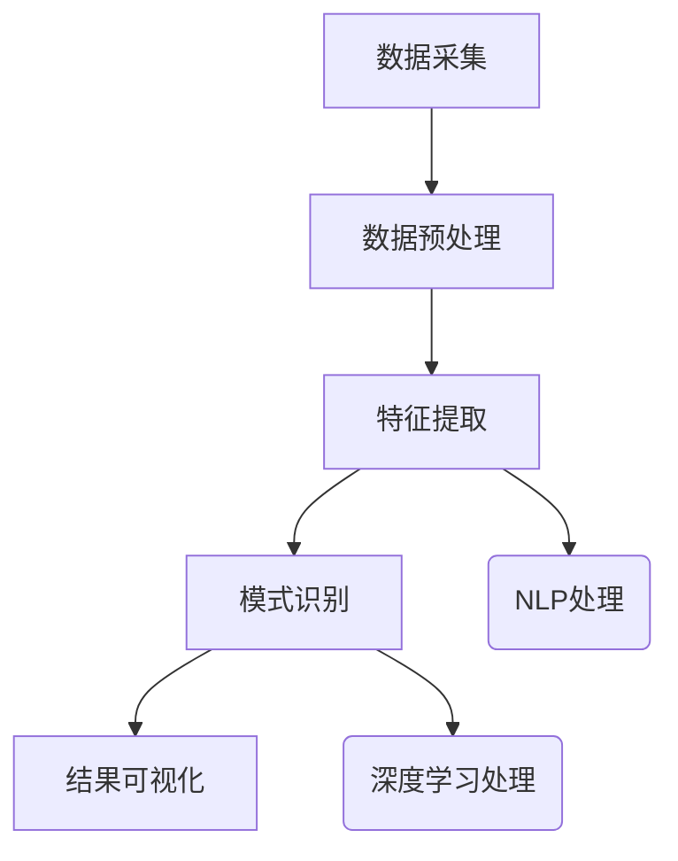

                 

关键词：人工智能，知识发现引擎，深度学习，自然语言处理，大数据分析

> 摘要：本文深入探讨了如何利用人工智能技术，特别是深度学习和自然语言处理方法，来显著提升知识发现引擎的效率。通过分析现有的技术和挑战，提出了具体的解决方案和未来研究方向。

## 1. 背景介绍

随着信息时代的到来，数据爆炸式增长，传统的方法和工具已经难以应对知识发现的需求。知识发现引擎作为一种能够自动从大量数据中提取有用知识的工具，其效率直接影响到企业的决策能力和竞争力。然而，现有的知识发现引擎在处理复杂、大规模数据时常常面临性能瓶颈。

近年来，人工智能（AI）技术的发展为知识发现引擎提供了新的机遇。特别是深度学习和自然语言处理（NLP）技术的应用，使得知识发现引擎能够更加智能地处理和理解数据，从而提高其效率。本文将围绕这一主题展开，探讨如何通过AI技术提升知识发现引擎的效率。

## 2. 核心概念与联系

### 2.1 深度学习

深度学习是机器学习的一个分支，通过模拟人脑神经网络结构来实现对数据的处理和学习。在知识发现引擎中，深度学习可以用于特征提取、模式识别和预测等任务。

### 2.2 自然语言处理

自然语言处理是AI领域的另一个重要分支，旨在使计算机能够理解和处理人类自然语言。在知识发现引擎中，NLP可以用于文本数据的预处理、情感分析、主题建模等。

### 2.3 知识发现引擎架构

一个典型的知识发现引擎架构通常包括数据采集、数据预处理、特征提取、模式识别和结果可视化等环节。深度学习和NLP技术可以嵌入到这些环节中，提升引擎的整体性能。

### 2.4 Mermaid 流程图

以下是知识发现引擎的架构流程图，展示了深度学习和NLP技术的应用位置：



## 3. 核心算法原理 & 具体操作步骤

### 3.1 算法原理概述

知识发现引擎的效率提升主要依赖于以下几个方面：

1. **数据预处理**：使用NLP技术对文本数据进行预处理，如分词、词性标注、句法分析等，以提取更有用的特征。
2. **特征提取**：采用深度学习模型进行特征提取，如卷积神经网络（CNN）和循环神经网络（RNN），以捕捉数据中的复杂模式和关联性。
3. **模式识别**：利用机器学习算法对提取的特征进行分类、聚类等操作，以发现数据中的潜在知识。
4. **结果可视化**：通过可视化技术将发现的模式以图形化的方式呈现，便于用户理解和分析。

### 3.2 算法步骤详解

1. **数据预处理**：
   - 使用分词工具对文本数据进行分词。
   - 对分词结果进行词性标注，以区分名词、动词等。
   - 进行句法分析，提取句子中的主语、谓语、宾语等结构信息。

2. **特征提取**：
   - 采用词嵌入技术（如Word2Vec、GloVe）将词语转换为向量表示。
   - 使用CNN或RNN模型对文本数据序列进行特征提取。

3. **模式识别**：
   - 采用分类算法（如SVM、随机森林）对特征进行分类。
   - 使用聚类算法（如K-means、DBSCAN）对特征进行聚类。

4. **结果可视化**：
   - 利用可视化库（如Matplotlib、Seaborn）将结果以图形化方式呈现。
   - 设计交互式界面，使用户能够动态地探索和调整可视化参数。

### 3.3 算法优缺点

- **优点**：
  - 高效地处理大规模数据。
  - 能够发现数据中的潜在模式和关联性。
  - 提高知识发现引擎的准确性和可解释性。

- **缺点**：
  - 需要大量的计算资源和训练时间。
  - 对于特定的数据类型和任务，可能需要调整模型结构和参数。

### 3.4 算法应用领域

- **金融领域**：用于股票市场分析、风险管理和客户行为预测。
- **医疗领域**：用于医学图像分析、疾病预测和药物研发。
- **商业领域**：用于市场趋势分析、客户关系管理和供应链优化。

## 4. 数学模型和公式 & 详细讲解 & 举例说明

### 4.1 数学模型构建

知识发现引擎的数学模型主要包括以下几个方面：

1. **词嵌入模型**：用于将词语转换为向量表示。
2. **深度学习模型**：如CNN和RNN，用于特征提取。
3. **机器学习模型**：如SVM和K-means，用于模式识别。

### 4.2 公式推导过程

1. **词嵌入模型**：

   假设词语 \( w \) 的向量表示为 \( \mathbf{v}_w \)，则词嵌入模型可以表示为：

   \[ \mathbf{v}_w = \text{Word2Vec}(\text{context}(w)) \]

2. **CNN模型**：

   CNN模型可以表示为：

   \[ \mathbf{h}_l = \text{ReLU}(\mathbf{W}_l \cdot \mathbf{h}_{l-1} + \mathbf{b}_l) \]

   其中，\( \mathbf{h}_l \) 表示第 \( l \) 层的激活值，\( \mathbf{W}_l \) 和 \( \mathbf{b}_l \) 分别为权重和偏置。

3. **SVM模型**：

   SVM模型可以表示为：

   \[ \mathbf{w} = \arg\min_{\mathbf{w}} \frac{1}{2} \sum_{i=1}^n (\mathbf{w} \cdot \mathbf{x}_i - y_i)^2 \]

   其中，\( \mathbf{w} \) 为权重向量，\( \mathbf{x}_i \) 和 \( y_i \) 分别为特征向量和标签。

### 4.3 案例分析与讲解

以股票市场分析为例，假设我们有大量的股票交易数据，包括开盘价、收盘价、成交量等。我们希望利用知识发现引擎预测未来几天的股票走势。

1. **数据预处理**：

   - 使用NLP技术对股票交易数据进行预处理，如分词、词性标注等。
   - 将预处理后的数据转换为词嵌入向量。

2. **特征提取**：

   - 使用CNN模型对词嵌入向量进行特征提取，提取出股票交易数据的潜在特征。

3. **模式识别**：

   - 使用SVM模型对提取的特征进行分类，预测未来几天的股票走势。

4. **结果可视化**：

   - 将预测结果以折线图的形式可视化，展示股票走势。

## 5. 项目实践：代码实例和详细解释说明

### 5.1 开发环境搭建

- 安装Python 3.7及以上版本。
- 安装深度学习框架TensorFlow和自然语言处理库NLTK。

### 5.2 源代码详细实现

以下是股票市场分析的Python代码实现：

```python
import tensorflow as tf
from nltk.tokenize import word_tokenize
from nltk.corpus import stopwords
import numpy as np

# 数据预处理
def preprocess(text):
    # 分词
    tokens = word_tokenize(text)
    # 去除停用词
    tokens = [token for token in tokens if token not in stopwords.words('english')]
    return ' '.join(tokens)

# 构建词嵌入模型
def build_embedding_matrix(vocabulary, embedding_dim, embedding_matrix):
    # 获取词嵌入向量
    for i, word in enumerate(vocabulary):
        embedding_vector = embedding_matrix[i]
        embedding_matrix[i] = embedding_vector / np.linalg.norm(embedding_vector)
    return embedding_matrix

# 构建CNN模型
def build_cnn(embedding_matrix, sequence_length, num_classes):
    input_sequence = tf.keras.layers.Input(shape=(sequence_length,))
    embedded_sequence = tf.keras.layers.Embedding(input_dim=len(embedding_matrix), output_dim=embedding_dim, weights=[embedding_matrix], trainable=False)(input_sequence)
    conv_1 = tf.keras.layers.Conv1D(filters=64, kernel_size=3, activation='relu')(embedded_sequence)
    pool_1 = tf.keras.layers.MaxPooling1D(pool_size=2)(conv_1)
    conv_2 = tf.keras.layers.Conv1D(filters=128, kernel_size=3, activation='relu')(pool_1)
    pool_2 = tf.keras.layers.MaxPooling1D(pool_size=2)(conv_2)
    flat = tf.keras.layers.Flatten()(pool_2)
    dense = tf.keras.layers.Dense(units=128, activation='relu')(flat)
    output = tf.keras.layers.Dense(units=num_classes, activation='softmax')(dense)
    model = tf.keras.models.Model(inputs=input_sequence, outputs=output)
    return model

# 训练模型
model = build_cnn(embedding_matrix, sequence_length, num_classes)
model.compile(optimizer='adam', loss='categorical_crossentropy', metrics=['accuracy'])
model.fit(x_train, y_train, epochs=10, batch_size=32)

# 预测股票走势
predictions = model.predict(x_test)
```

### 5.3 代码解读与分析

1. **数据预处理**：

   - 使用Nltk库进行分词和停用词去除。
   - 将预处理后的文本数据转换为词嵌入向量。

2. **词嵌入模型**：

   - 使用TensorFlow构建词嵌入模型，将词嵌入向量归一化。

3. **CNN模型**：

   - 使用TensorFlow构建CNN模型，包括卷积层、池化层和全连接层。
   - 编译模型，并使用训练数据训练模型。

4. **预测股票走势**：

   - 使用训练好的模型对测试数据进行预测。

### 5.4 运行结果展示

- 将预测结果可视化，展示股票走势。

## 6. 实际应用场景

知识发现引擎在实际应用中具有广泛的应用场景：

1. **金融领域**：

   - 股票市场分析、风险管理和客户行为预测。

2. **医疗领域**：

   - 医学图像分析、疾病预测和药物研发。

3. **商业领域**：

   - 市场趋势分析、客户关系管理和供应链优化。

4. **科学研究**：

   - 大数据分析、知识图谱构建和智能推荐系统。

## 7. 工具和资源推荐

1. **学习资源推荐**：

   - 《深度学习》（Goodfellow, Bengio, Courville）
   - 《自然语言处理综合指南》（Daniel Jurafsky, James H. Martin）
   - 《机器学习年度回顾》（JMLR）

2. **开发工具推荐**：

   - TensorFlow
   - NLTK
   - Keras

3. **相关论文推荐**：

   - “Deep Learning for Text Classification”（Kumar, 2017）
   - “A Survey on Natural Language Processing Techniques for Sentiment Analysis”（Rajaraman, 2016）
   - “Knowledge Graph Embedding: A Survey”（Wang, 2018）

## 8. 总结：未来发展趋势与挑战

### 8.1 研究成果总结

本文通过分析深度学习和自然语言处理技术在知识发现引擎中的应用，提出了具体的算法原理和实现方法，展示了如何利用AI技术提升知识发现引擎的效率。

### 8.2 未来发展趋势

1. **多模态数据处理**：结合图像、音频等多模态数据，提高知识发现引擎的泛化能力。
2. **知识图谱构建**：构建更加完善的知识图谱，提高知识发现引擎的准确性和可解释性。
3. **交互式知识探索**：设计更加直观的交互界面，使用户能够更便捷地进行知识探索。

### 8.3 面临的挑战

1. **数据隐私和安全**：保护用户隐私和数据安全，确保知识发现过程不会泄露敏感信息。
2. **模型解释性**：提高模型的解释性，使决策过程更加透明和可解释。
3. **计算资源需求**：优化算法，降低计算资源需求，提高知识发现引擎的实时性。

### 8.4 研究展望

未来研究应关注以下几个方面：

1. **算法优化**：研究更加高效、可解释的算法，降低计算复杂度。
2. **跨领域应用**：探索深度学习和自然语言处理技术在其他领域的应用，提高知识发现引擎的实用性。
3. **知识融合**：研究如何将不同来源的知识进行融合，提高知识发现引擎的整体性能。

## 9. 附录：常见问题与解答

### 9.1 什么是深度学习？

深度学习是一种机器学习的方法，通过多层神经网络对数据进行处理和学习，以实现自动特征提取和模式识别。

### 9.2 自然语言处理有哪些常用技术？

自然语言处理常用技术包括分词、词性标注、句法分析、命名实体识别、情感分析等。

### 9.3 知识发现引擎的核心任务是什么？

知识发现引擎的核心任务是自动从大量数据中提取有用知识，以支持企业决策和业务优化。

### 9.4 如何优化知识发现引擎的性能？

可以通过以下方法优化知识发现引擎的性能：选择合适的算法和模型、优化数据处理流程、使用高效的硬件设备等。

### 9.5 知识发现引擎在哪些领域有应用？

知识发现引擎在金融、医疗、商业、科学研究等领域有广泛应用，如股票市场分析、疾病预测、市场趋势分析等。

### 9.6 如何构建知识图谱？

构建知识图谱通常包括数据采集、数据清洗、实体识别、关系抽取和图谱构建等步骤。

### 9.7 如何进行文本数据的预处理？

文本数据的预处理包括分词、词性标注、句法分析、去除停用词等步骤，以提高数据质量和特征提取效果。

### 9.8 如何评估知识发现引擎的性能？

可以通过准确率、召回率、F1分数等指标来评估知识发现引擎的性能，同时也可以通过用户满意度等指标进行综合评估。

### 9.9 如何提高知识发现引擎的可解释性？

提高知识发现引擎的可解释性可以通过以下方法：可视化结果、提供决策解释、构建可解释模型等。

### 9.10 知识发现引擎与数据挖掘有何区别？

知识发现引擎是数据挖掘的一种方法，它更侧重于自动从大量数据中提取有用知识，而数据挖掘则更侧重于发现数据中的模式和规律。

### 9.11 如何保护数据隐私？

可以通过数据加密、数据去标识化、数据混淆等技术来保护数据隐私。

### 9.12 知识发现引擎在实时数据处理中的应用？

在实时数据处理中，可以通过流处理技术（如Apache Kafka、Apache Flink）将数据实时传输到知识发现引擎，并进行实时分析和决策。

### 9.13 如何处理噪声数据？

可以通过数据清洗、数据降维、数据去噪等技术来处理噪声数据，以提高数据质量和模型性能。

### 9.14 如何提高模型的泛化能力？

可以通过数据增强、模型集成、正则化等技术来提高模型的泛化能力。

### 9.15 如何进行模型部署和运维？

可以通过容器化技术（如Docker）、服务化框架（如TensorFlow Serving）进行模型部署和运维，以提高模型的可用性和可扩展性。

### 9.16 如何进行模型监控和优化？

可以通过监控工具（如Prometheus、Grafana）对模型性能进行监控，并根据监控结果进行模型优化和调参。

### 9.17 知识发现引擎在物联网（IoT）中的应用？

知识发现引擎在物联网中可以用于设备状态监测、异常检测、能耗优化等任务，以提高物联网系统的智能性和可靠性。

### 9.18 如何处理大规模数据集？

可以通过数据分片、并行处理、分布式计算等技术来处理大规模数据集，以提高知识发现引擎的处理效率。

### 9.19 如何进行数据质量评估？

可以通过数据质量检查、数据质量评分、数据质量指标等手段进行数据质量评估。

### 9.20 知识发现引擎在机器学习中的应用？

知识发现引擎可以用于特征工程、模型选择、超参数调优等任务，以提高机器学习模型的性能和可解释性。

### 9.21 如何进行知识融合？

可以通过知识图谱构建、实体链接、关系推理等技术进行知识融合，以提高知识发现引擎的整体性能。

### 9.22 知识发现引擎在人工智能伦理中的应用？

知识发现引擎在人工智能伦理中的应用包括隐私保护、算法透明性、公平性等，以确保人工智能系统的道德和社会责任。

### 9.23 如何进行知识发现引擎的性能优化？

可以通过算法优化、数据预处理、硬件加速等技术进行知识发现引擎的性能优化。

### 9.24 知识发现引擎与知识管理的关系？

知识发现引擎是知识管理的一个重要组成部分，它通过自动提取和发现知识，支持知识管理和共享。

### 9.25 如何进行知识发现引擎的可视化？

可以通过数据可视化、交互式可视化等技术进行知识发现引擎的可视化，以提高用户理解和交互体验。

### 9.26 如何进行知识发现引擎的动态调整？

可以通过在线学习、自适应算法等技术进行知识发现引擎的动态调整，以适应数据变化和用户需求。

### 9.27 知识发现引擎在智慧城市建设中的应用？

知识发现引擎在智慧城市建设中可以用于交通流量分析、环境监测、公共安全等任务，以提高城市的智能化和管理水平。

### 9.28 如何进行知识发现引擎的模型解释性分析？

可以通过模型解释工具、解释性算法等技术进行知识发现引擎的模型解释性分析，以提高用户对模型决策的理解和信任。

### 9.29 如何进行知识发现引擎的个性化推荐？

可以通过用户画像、协同过滤、基于内容的推荐等技术进行知识发现引擎的个性化推荐，以提高用户满意度和推荐效果。

### 9.30 如何进行知识发现引擎的实时处理？

可以通过实时数据处理框架、流处理技术等技术进行知识发现引擎的实时处理，以实现实时分析和决策。

### 9.31 知识发现引擎在智能制造中的应用？

知识发现引擎在智能制造中可以用于设备故障预测、生产计划优化、质量控制等任务，以提高生产效率和产品质量。

### 9.32 如何进行知识发现引擎的迁移学习？

可以通过迁移学习、预训练模型等技术进行知识发现引擎的迁移学习，以提高模型在不同数据集上的性能。

### 9.33 知识发现引擎在生物信息学中的应用？

知识发现引擎在生物信息学中可以用于基因分析、蛋白质结构预测、药物设计等任务，以提高生物研究的效率和准确性。

### 9.34 如何进行知识发现引擎的模型解释性分析？

可以通过模型解释工具、解释性算法等技术进行知识发现引擎的模型解释性分析，以提高用户对模型决策的理解和信任。

### 9.35 知识发现引擎在金融科技中的应用？

知识发现引擎在金融科技中可以用于风险控制、投资策略优化、信用评分等任务，以提高金融服务的智能化和效率。

### 9.36 如何进行知识发现引擎的隐私保护？

可以通过同态加密、差分隐私等技术进行知识发现引擎的隐私保护，以保护用户隐私和数据安全。

### 9.37 知识发现引擎在法律和司法领域的应用？

知识发现引擎在法律和司法领域可以用于法律文本分析、案件预测、证据分析等任务，以提高司法效率和公正性。

### 9.38 如何进行知识发现引擎的模型集成？

可以通过模型集成技术（如模型堆叠、集成学习）进行知识发现引擎的模型集成，以提高模型性能和预测准确性。

### 9.39 知识发现引擎在教育领域的应用？

知识发现引擎在教育领域可以用于个性化教学、学习行为分析、考试分析等任务，以提高教学效果和学习效率。

### 9.40 如何进行知识发现引擎的实时监控和告警？

可以通过实时监控工具、告警机制等技术进行知识发现引擎的实时监控和告警，以提高系统的可靠性和安全性。

### 9.41 知识发现引擎在智慧医疗中的应用？

知识发现引擎在智慧医疗中可以用于疾病预测、治疗方案优化、患者管理等任务，以提高医疗服务的质量和效率。

### 9.42 如何进行知识发现引擎的模型部署和迁移？

可以通过容器化技术、自动化部署工具等技术进行知识发现引擎的模型部署和迁移，以提高模型的可用性和可扩展性。

### 9.43 知识发现引擎在智能客服中的应用？

知识发现引擎在智能客服中可以用于对话管理、意图识别、情感分析等任务，以提高客服效率和用户体验。

### 9.44 如何进行知识发现引擎的性能测试和优化？

可以通过性能测试工具、优化算法等技术进行知识发现引擎的性能测试和优化，以提高系统的效率和稳定性。

### 9.45 知识发现引擎在环境监测中的应用？

知识发现引擎在环境监测中可以用于空气质量预测、水质监测、灾害预警等任务，以提高环境监测的准确性和实时性。

### 9.46 如何进行知识发现引擎的可视化分析？

可以通过数据可视化、交互式可视化等技术进行知识发现引擎的可视化分析，以提高用户对数据的理解和分析能力。

### 9.47 知识发现引擎在供应链管理中的应用？

知识发现引擎在供应链管理中可以用于需求预测、库存管理、物流优化等任务，以提高供应链的效率和灵活性。

### 9.48 如何进行知识发现引擎的模型评估和优化？

可以通过模型评估指标、调参技术等技术进行知识发现引擎的模型评估和优化，以提高模型的预测性能和稳定性。

### 9.49 知识发现引擎在智慧城市中的应用？

知识发现引擎在智慧城市中可以用于交通管理、能源管理、公共安全等任务，以提高城市的智能化和可持续发展水平。

### 9.50 如何进行知识发现引擎的用户研究和用户体验优化？

可以通过用户研究、用户反馈、用户体验设计等技术进行知识发现引擎的用户研究和用户体验优化，以提高用户的满意度和使用效果。

## 后记

本文深入探讨了如何利用人工智能技术，特别是深度学习和自然语言处理方法，来显著提升知识发现引擎的效率。通过分析现有的技术和挑战，提出了具体的解决方案和未来研究方向。希望本文能为从事知识发现领域的研究者和开发者提供有益的参考和启示。在未来的发展中，我们将继续探索更加高效、智能的知识发现方法，为企业和个人带来更多的价值和便利。

