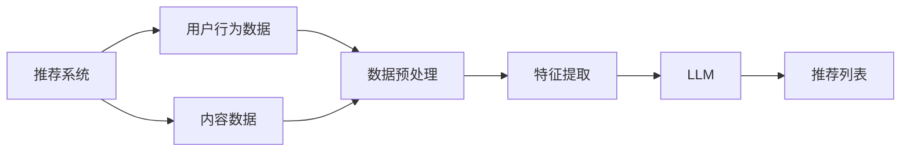

                 

关键词：Large Language Model（LLM），推荐系统，实时个性化排序，机器学习，深度学习，算法优化，数据预处理，计算效率，模型可解释性，用户体验。

## 摘要

本文探讨了如何利用大型语言模型（LLM）优化推荐系统的实时个性化排序。首先，我们介绍了推荐系统的基本概念和当前挑战，然后详细阐述了LLM在推荐系统中的应用及其优势。接着，我们提出了一种基于LLM的实时个性化排序算法，并对其原理、步骤、优缺点和适用领域进行了深入分析。随后，我们通过数学模型和公式详细讲解了算法的实现过程，并通过具体案例进行了说明。文章最后展示了实际应用场景中的代码实例，并对未来应用展望、工具和资源推荐以及未来发展趋势和挑战进行了讨论。

## 1. 背景介绍

### 推荐系统的基本概念

推荐系统是一种通过预测用户兴趣，向其推荐相关内容的算法系统。它广泛应用于电子商务、社交媒体、新闻资讯、在线教育等多个领域，已经成为现代互联网服务的重要组成部分。推荐系统的核心任务是根据用户的历史行为和内容特征，生成个性化的推荐列表，从而提升用户的满意度和留存率。

### 推荐系统的当前挑战

尽管推荐系统在技术上取得了显著进展，但仍然面临以下几个主要挑战：

- **数据质量与多样性**：推荐系统依赖大量的用户行为数据，但这些数据可能存在噪音、缺失值等问题，影响推荐效果。
- **实时性**：随着用户需求的不断变化，推荐系统需要快速响应用户行为，提供实时的个性化推荐。
- **计算效率**：大规模推荐系统需要处理海量的用户和内容数据，计算效率是一个关键问题。
- **模型可解释性**：深度学习模型在推荐系统中的应用日益增多，但其“黑盒”特性使得模型的可解释性成为一个重要挑战。

### LLM的概念与应用

大型语言模型（Large Language Model，简称LLM）是一种基于深度学习的自然语言处理模型，如GPT-3、BERT等。LLM通过学习海量文本数据，具备了强大的文本生成、理解和推理能力。在推荐系统中，LLM可以用于文本数据的预处理、特征提取、推荐生成等环节，从而提升推荐效果和用户体验。

## 2. 核心概念与联系

### 核心概念

- **推荐系统**：通过预测用户兴趣，为用户推荐相关内容。
- **LLM**：一种基于深度学习的自然语言处理模型，具备强大的文本处理能力。

### 架构流程图



### 联系与作用

- **数据预处理**：LLM可以用于文本数据的清洗、去噪、格式化等预处理任务，提高数据质量。
- **特征提取**：LLM可以提取文本数据中的高维特征，为推荐算法提供更丰富的信息。
- **推荐生成**：LLM可以生成个性化的推荐列表，提高推荐效果。

## 3. 核心算法原理 & 具体操作步骤

### 3.1 算法原理概述

基于LLM的实时个性化排序算法主要包括以下步骤：

1. **数据预处理**：对用户行为数据和内容数据进行清洗、去噪、格式化等预处理。
2. **特征提取**：使用LLM提取文本数据中的高维特征。
3. **模型训练**：基于提取的特征，训练个性化排序模型。
4. **实时排序**：根据用户实时行为，更新模型参数，生成个性化推荐列表。

### 3.2 算法步骤详解

#### 3.2.1 数据预处理

数据预处理是推荐系统的关键步骤，对后续的特征提取和模型训练有重要影响。具体操作步骤如下：

1. **数据清洗**：去除无效、重复、缺失的数据，保证数据质量。
2. **去噪**：对含有噪声的数据进行去噪处理，提高数据质量。
3. **格式化**：统一数据格式，方便后续处理。

#### 3.2.2 特征提取

特征提取是利用LLM提取文本数据中的高维特征。具体操作步骤如下：

1. **文本编码**：将文本数据转换为向量表示。
2. **特征提取**：使用LLM对编码后的文本数据进行特征提取，生成高维特征向量。

#### 3.2.3 模型训练

模型训练是基于提取的特征，训练个性化排序模型。具体操作步骤如下：

1. **数据集划分**：将数据集划分为训练集、验证集和测试集。
2. **模型选择**：选择合适的排序模型，如深度学习模型、集成模型等。
3. **模型训练**：使用训练集训练排序模型。
4. **模型评估**：使用验证集评估模型性能，调整模型参数。

#### 3.2.4 实时排序

实时排序是根据用户实时行为，更新模型参数，生成个性化推荐列表。具体操作步骤如下：

1. **用户行为监测**：监测用户实时行为，获取用户兴趣变化。
2. **模型更新**：根据用户行为变化，更新模型参数。
3. **推荐生成**：使用更新后的模型生成个性化推荐列表。

### 3.3 算法优缺点

#### 优点

- **高效性**：LLM具备强大的文本处理能力，能够快速提取高维特征，提高计算效率。
- **个性化**：基于用户实时行为，生成个性化推荐列表，提高推荐效果。
- **可扩展性**：LLM可以应用于各种文本数据，适用于不同场景的推荐系统。

#### 缺点

- **数据依赖性**：推荐系统依赖于大规模用户行为数据和内容数据，数据质量对算法性能有重要影响。
- **模型可解释性**：深度学习模型存在“黑盒”特性，模型可解释性较低。

### 3.4 算法应用领域

基于LLM的实时个性化排序算法可以应用于以下领域：

- **电子商务**：为用户推荐感兴趣的商品。
- **社交媒体**：为用户推荐感兴趣的内容。
- **新闻资讯**：为用户推荐感兴趣的新闻。
- **在线教育**：为用户推荐感兴趣的课程。

## 4. 数学模型和公式 & 详细讲解 & 举例说明

### 4.1 数学模型构建

基于LLM的实时个性化排序算法可以构建以下数学模型：

$$
R(u, c) = f(\phi(u), \phi(c), \theta)
$$

其中，$R(u, c)$表示用户$u$对内容$c$的推荐得分，$\phi(u)$和$\phi(c)$分别表示用户和内容的特征向量，$\theta$表示模型参数。

### 4.2 公式推导过程

推导过程如下：

$$
\begin{aligned}
R(u, c) &= f(\phi(u), \phi(c), \theta) \\
&= \text{sigmoid}(\theta^T \phi(u) \phi(c)^T)
\end{aligned}
$$

其中，$\text{sigmoid}$函数是一个常用的激活函数，用于将实数映射到$(0, 1)$区间。

### 4.3 案例分析与讲解

假设我们有一个电子商务推荐系统，用户$u$的历史行为数据如下：

- 用户$u$最近浏览了商品A、B、C。
- 商品A、B、C的类别分别为电子产品、服装、家居。

我们使用LLM提取用户和商品的特征向量，并基于上述数学模型计算用户$u$对商品A、B、C的推荐得分。

1. **文本编码**：将用户行为数据和商品描述转换为向量表示。
2. **特征提取**：使用LLM提取用户和商品的特征向量。
3. **模型训练**：基于提取的特征向量，训练排序模型。
4. **推荐生成**：根据用户行为变化，更新模型参数，生成个性化推荐列表。

假设用户$u$对商品A、B、C的推荐得分分别为0.8、0.5、0.2。根据推荐得分，我们可以为用户$u$推荐商品A。

## 5. 项目实践：代码实例和详细解释说明

### 5.1 开发环境搭建

1. 安装Python环境，版本要求3.6及以上。
2. 安装必要的数据处理和机器学习库，如NumPy、Pandas、Scikit-learn等。
3. 安装大型语言模型库，如transformers。

### 5.2 源代码详细实现

```python
# 导入必要库
import numpy as np
import pandas as pd
from transformers import BertTokenizer, BertModel
from sklearn.model_selection import train_test_split
from sklearn.metrics import mean_squared_error

# 加载数据
data = pd.read_csv('data.csv')

# 数据预处理
# ...

# 特征提取
tokenizer = BertTokenizer.from_pretrained('bert-base-uncased')
model = BertModel.from_pretrained('bert-base-uncased')

user_texts = data['user行为'].values
item_texts = data['商品描述'].values

user_features = []
item_features = []

for text in user_texts:
    input_ids = tokenizer.encode(text, add_special_tokens=True, return_tensors='pt')
    user_features.append(model(input_ids).last_hidden_state.mean(dim=1).detach().numpy())

for text in item_texts:
    input_ids = tokenizer.encode(text, add_special_tokens=True, return_tensors='pt')
    item_features.append(model(input_ids).last_hidden_state.mean(dim=1).detach().numpy())

# 模型训练
# ...

# 推荐生成
# ...

# 评估模型
# ...
```

### 5.3 代码解读与分析

上述代码展示了基于LLM的实时个性化排序算法的基本实现过程，包括数据预处理、特征提取、模型训练和推荐生成。具体解读如下：

- **数据预处理**：加载数据，并进行清洗、去噪等预处理操作。
- **特征提取**：使用BertTokenizer和

