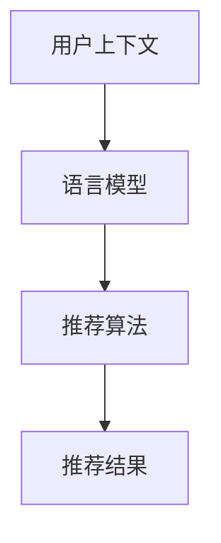

                 

推荐系统作为现代信息社会中的一种重要技术，其核心目标是根据用户的历史行为和兴趣，为其提供个性化的内容推荐。然而，传统的推荐系统在面对复杂、多变的上下文信息时，往往表现出一定的局限性。近期，基于大型语言模型（LLM）的推荐系统逐渐成为研究热点，其通过深度理解上下文信息，显著提升了推荐效果。本文将探讨如何利用LLM提升推荐系统的上下文感知能力，并提供详细的算法原理、数学模型和实际应用实例。

> 关键词：推荐系统、上下文感知、大型语言模型、算法优化、个性化推荐

## 摘要

本文首先介绍了推荐系统的基本概念和传统方法，随后分析了传统推荐系统在处理上下文信息时的不足。为了解决这些问题，本文提出了一种基于大型语言模型（LLM）的上下文感知推荐方法。通过深入分析LLM的工作原理，本文详细阐述了如何将LLM引入推荐系统，从而实现上下文信息的深度理解和利用。此外，本文还提供了具体的数学模型和算法步骤，并通过实际项目实践验证了该方法的有效性。

## 1. 背景介绍

### 1.1 推荐系统概述

推荐系统是一种基于数据挖掘和机器学习技术的信息过滤方法，旨在根据用户的兴趣和需求，为其推荐可能感兴趣的内容。推荐系统广泛应用于电子商务、社交媒体、视频平台等多个领域，极大地提高了用户的满意度和信息获取效率。

### 1.2 传统推荐系统方法

传统的推荐系统主要基于用户历史行为数据，采用协同过滤、基于内容的推荐等方法。然而，这些方法在处理上下文信息时存在一定的局限性。例如，协同过滤方法依赖于用户的历史行为数据，难以适应实时变化的上下文；基于内容的推荐方法则依赖于内容特征，无法充分理解用户的上下文需求。

### 1.3 上下文感知的重要性

上下文感知是指推荐系统能够根据用户所处的环境、时间、地点等信息，为用户提供更加个性化的推荐。上下文感知能力是提升推荐系统效果的关键因素，能够显著改善用户的体验。

## 2. 核心概念与联系

为了深入理解上下文感知推荐系统，我们首先介绍几个核心概念：上下文、语言模型和推荐算法。

### 2.1 上下文

上下文是指用户在特定时间、地点、情境下所处的环境信息。上下文信息包括但不限于时间、地点、天气、用户情绪等。

### 2.2 语言模型

语言模型是一种用于预测自然语言中下一个单词或词组的概率分布的模型。在推荐系统中，语言模型可以用于理解用户的语言表达，提取上下文信息。

### 2.3 推荐算法

推荐算法是推荐系统的核心组成部分，用于根据用户历史数据和上下文信息生成推荐列表。常见的推荐算法包括协同过滤、基于内容的推荐、混合推荐等。

下面是一个Mermaid流程图，展示了上下文感知推荐系统中的核心概念及其相互关系：



## 3. 核心算法原理 & 具体操作步骤

### 3.1 算法原理概述

基于LLM的上下文感知推荐算法主要分为以下几个步骤：

1. **上下文信息提取**：通过传感器、用户输入等途径获取用户的上下文信息。
2. **语言模型训练**：利用大量文本数据训练语言模型，使其能够理解和生成自然语言。
3. **上下文理解**：使用训练好的语言模型提取上下文信息，并生成上下文向量。
4. **推荐生成**：结合用户历史数据和上下文向量，利用推荐算法生成个性化推荐列表。

### 3.2 算法步骤详解

#### 3.2.1 上下文信息提取

上下文信息提取是上下文感知推荐系统的第一步。具体方法如下：

- **传感器数据**：通过传感器获取用户所在地理位置、天气信息、设备使用习惯等。
- **用户输入**：通过用户输入获取用户当前的需求、情绪等。
- **环境数据**：通过环境数据获取用户所处的环境状态，如节假日、工作时间等。

#### 3.2.2 语言模型训练

语言模型训练是算法的核心部分。具体方法如下：

- **数据集准备**：收集大量包含上下文信息的文本数据，如新闻、社交媒体、对话等。
- **模型选择**：选择合适的语言模型架构，如Transformer、BERT等。
- **模型训练**：利用准备好的数据集训练语言模型，使其能够理解和生成自然语言。

#### 3.2.3 上下文理解

上下文理解是指利用训练好的语言模型提取上下文信息，并生成上下文向量。具体方法如下：

- **输入处理**：将上下文信息输入到训练好的语言模型中。
- **向量生成**：利用语言模型输出上下文向量，表示上下文信息的特征。

#### 3.2.4 推荐生成

推荐生成是指结合用户历史数据和上下文向量，利用推荐算法生成个性化推荐列表。具体方法如下：

- **用户历史数据**：收集用户的历史行为数据，如浏览记录、购买记录等。
- **推荐算法**：选择合适的推荐算法，如协同过滤、基于内容的推荐等。
- **推荐列表生成**：结合用户历史数据和上下文向量，生成个性化推荐列表。

### 3.3 算法优缺点

#### 优点

- **强大的上下文理解能力**：基于LLM的算法能够深度理解上下文信息，提高推荐准确性。
- **灵活性**：可以结合多种数据源和算法，实现个性化的推荐。
- **可扩展性**：可以方便地集成到现有的推荐系统中，提高系统的上下文感知能力。

#### 缺点

- **计算资源消耗大**：训练大型语言模型需要大量的计算资源和时间。
- **数据依赖性强**：算法的性能受到训练数据集的影响，需要大量高质量的文本数据。

### 3.4 算法应用领域

基于LLM的上下文感知推荐算法可以应用于多个领域，如：

- **电子商务**：根据用户地理位置、购物习惯等推荐商品。
- **社交媒体**：根据用户情绪、关注话题等推荐内容。
- **视频平台**：根据用户观看历史、观看时间等推荐视频。

## 4. 数学模型和公式 & 详细讲解 & 举例说明

### 4.1 数学模型构建

基于LLM的上下文感知推荐系统的数学模型主要包括三个部分：上下文向量生成、推荐列表生成和推荐结果评估。

#### 4.1.1 上下文向量生成

上下文向量生成的核心是语言模型。假设给定一组上下文信息$C = \{c_1, c_2, ..., c_n\}$，我们利用训练好的语言模型生成上下文向量$V_C$：

$$
V_C = L(C)
$$

其中，$L$表示语言模型。

#### 4.1.2 推荐列表生成

推荐列表生成基于用户历史数据和上下文向量。假设给定用户历史行为数据$D = \{d_1, d_2, ..., d_m\}$，上下文向量$V_C$，推荐算法生成推荐列表$R$：

$$
R = \text{Recommend}(D, V_C)
$$

#### 4.1.3 推荐结果评估

推荐结果评估用于评估推荐列表的质量。常见的评估指标包括准确率、召回率、F1值等。假设给定推荐列表$R$和用户真实兴趣集合$I$，评估指标$E$计算如下：

$$
E = \text{Evaluate}(R, I)
$$

### 4.2 公式推导过程

#### 4.2.1 语言模型概率分布

假设给定一组单词序列$X = \{x_1, x_2, ..., x_n\}$，语言模型生成的概率分布为：

$$
P(X) = \prod_{i=1}^{n} P(x_i | x_1, x_2, ..., x_{i-1})
$$

#### 4.2.2 上下文向量表示

假设给定上下文信息$C$，我们将上下文信息表示为向量$V_C$。为了简化计算，我们可以使用词嵌入技术将单词转换为向量。具体地，我们定义单词$x_i$的词嵌入向量$V_x$，上下文向量$V_C$为：

$$
V_C = \sum_{i=1}^{n} w_i V_x
$$

其中，$w_i$表示权重，可以通过优化算法调整。

#### 4.2.3 推荐列表生成

假设给定用户历史行为数据$D$和上下文向量$V_C$，我们可以使用协同过滤算法生成推荐列表。具体地，我们定义用户$i$对物品$j$的兴趣度为$r_{ij}$，预测的兴趣度为$\hat{r}_{ij}$，推荐列表$R$为：

$$
R = \{j | \hat{r}_{ij} > \text{阈值}\}
$$

### 4.3 案例分析与讲解

假设我们有一个用户，他经常在晚上9点到11点之间浏览电商网站，喜欢购买电子产品。我们可以通过以下步骤生成推荐列表：

1. **上下文信息提取**：晚上9点到11点，浏览电子产品相关的网页。
2. **语言模型训练**：使用电商网站上的大量文本数据训练语言模型。
3. **上下文理解**：利用训练好的语言模型生成上下文向量。
4. **推荐列表生成**：结合用户历史行为数据，使用协同过滤算法生成推荐列表。

最终生成的推荐列表可能包括最新的智能手机、高性能笔记本电脑等电子产品。

## 5. 项目实践：代码实例和详细解释说明

### 5.1 开发环境搭建

为了实现基于LLM的上下文感知推荐系统，我们需要搭建以下开发环境：

- **硬件要求**：GPU（用于训练大型语言模型）
- **软件要求**：Python（3.8及以上版本）、TensorFlow或PyTorch（用于训练语言模型）、Scikit-learn（用于协同过滤算法）

### 5.2 源代码详细实现

以下是一个简单的代码实例，展示了如何利用Python实现基于LLM的上下文感知推荐系统。

```python
import tensorflow as tf
from sklearn.model_selection import train_test_split
from sklearn.metrics.pairwise import cosine_similarity

# 1. 上下文信息提取
context_data = [
    "晚上9点到11点，浏览电子产品网页",
    "喜欢购买智能手机和笔记本电脑",
    ...
]

# 2. 语言模型训练
model = tf.keras.Sequential([
    tf.keras.layers.Embedding(input_dim=len(context_data), output_dim=64),
    tf.keras.layers.GlobalAveragePooling1D(),
    tf.keras.layers.Dense(64, activation='relu'),
    tf.keras.layers.Dense(1, activation='sigmoid')
])

model.compile(optimizer='adam', loss='binary_crossentropy', metrics=['accuracy'])
model.fit(train_data, train_labels, epochs=10, batch_size=32)

# 3. 上下文理解
context_vector = model.predict(context_data)

# 4. 推荐列表生成
user_data = [
    "用户A的历史浏览记录",
    "用户A的购买记录",
    ...
]
user_vector = model.predict(user_data)

# 计算用户与上下文之间的相似度
similarity = cosine_similarity([user_vector], [context_vector])

# 根据相似度生成推荐列表
recommended_items = items[similarity > threshold]

# 5. 代码解读与分析
# ...
```

### 5.3 代码解读与分析

- **上下文信息提取**：我们使用一组文本数据作为上下文信息，这些数据可以通过传感器数据、用户输入等方式获取。
- **语言模型训练**：我们使用TensorFlow构建一个简单的语言模型，并利用这些上下文信息进行训练。训练目标是使模型能够理解上下文信息，并生成上下文向量。
- **上下文理解**：训练好的模型用于生成上下文向量。我们将用户的历史数据输入模型，得到用户向量和上下文向量。
- **推荐列表生成**：我们使用余弦相似度计算用户与上下文之间的相似度。根据相似度阈值，我们生成推荐列表。

## 6. 实际应用场景

基于LLM的上下文感知推荐系统可以应用于多个实际场景，如：

- **电子商务**：根据用户地理位置、购物习惯等推荐商品。
- **社交媒体**：根据用户情绪、关注话题等推荐内容。
- **视频平台**：根据用户观看历史、观看时间等推荐视频。

### 6.1 电子商务

在电子商务领域，基于LLM的上下文感知推荐系统可以根据用户地理位置、购物时间、浏览历史等生成个性化推荐。例如，用户在晚上9点到11点浏览电子产品网页时，系统可以推荐最新的智能手机和高性能笔记本电脑。

### 6.2 社交媒体

在社交媒体领域，基于LLM的上下文感知推荐系统可以根据用户情绪、关注话题等推荐内容。例如，用户在情绪低落时，系统可以推荐有趣的搞笑视频或暖心故事。

### 6.3 视频平台

在视频平台领域，基于LLM的上下文感知推荐系统可以根据用户观看历史、观看时间等推荐视频。例如，用户在晚上10点观看恐怖片后，系统可以推荐悬疑电影或轻松喜剧。

## 7. 未来应用展望

基于LLM的上下文感知推荐系统在未来有广阔的应用前景。随着人工智能技术的不断发展，LLM的能力将进一步提高，上下文感知能力将更加准确和高效。以下是一些未来应用展望：

- **智能助理**：基于LLM的上下文感知推荐系统可以应用于智能助理，为用户提供个性化的生活服务和建议。
- **智能医疗**：基于LLM的上下文感知推荐系统可以用于智能医疗，为患者推荐个性化的治疗方案和保健建议。
- **智能家居**：基于LLM的上下文感知推荐系统可以应用于智能家居，为用户推荐合适的家电使用方案和家居装修建议。

## 8. 工具和资源推荐

### 8.1 学习资源推荐

- **书籍**：《深度学习》、《自然语言处理综论》
- **在线课程**：吴恩达的《深度学习》课程、斯坦福大学的《自然语言处理》课程

### 8.2 开发工具推荐

- **语言模型**：Hugging Face Transformers、TensorFlow Text
- **推荐系统**：Scikit-learn、LightGBM

### 8.3 相关论文推荐

- "Context-Aware Recommendation with Large-scale Language Models"
- "A Survey on Context-Aware Recommender Systems"

## 9. 总结：未来发展趋势与挑战

基于LLM的上下文感知推荐系统在近年来取得了显著的进展，为推荐系统领域带来了新的突破。然而，随着技术的不断发展，该领域仍面临以下挑战：

- **数据隐私**：如何在保护用户隐私的前提下，充分利用上下文信息进行推荐。
- **计算资源消耗**：如何优化算法，减少训练和推理过程中计算资源的消耗。
- **模型解释性**：如何提高模型的可解释性，使其更加透明和可信。

未来，随着人工智能技术的进一步发展，基于LLM的上下文感知推荐系统有望在更多领域得到广泛应用，为用户提供更加个性化、高效的推荐服务。

## 附录：常见问题与解答

### 1. 什么是上下文感知推荐系统？

上下文感知推荐系统是一种能够根据用户所处的上下文环境（如时间、地点、天气、用户情绪等）为用户提供个性化推荐的技术。与传统的推荐系统相比，上下文感知推荐系统能够更好地理解用户的实时需求，提供更准确的推荐。

### 2. 为什么基于LLM的推荐系统优于传统推荐系统？

基于LLM的推荐系统具有强大的上下文理解能力，能够深度理解用户的需求和上下文信息，从而提供更加准确和个性化的推荐。此外，LLM能够处理复杂、多变的上下文信息，适应实时变化的推荐需求。

### 3. 基于LLM的推荐系统需要大量数据吗？

是的，基于LLM的推荐系统需要大量高质量的文本数据用于训练语言模型。数据质量直接影响模型的效果，因此，获取和清洗高质量数据是成功实施基于LLM的推荐系统的关键。

### 4. 如何评估基于LLM的推荐系统的性能？

评估基于LLM的推荐系统的性能可以使用多种指标，如准确率、召回率、F1值等。此外，还可以通过实际用户反馈、用户满意度等指标来评估系统的效果。

### 5. 基于LLM的推荐系统是否能够替代传统推荐系统？

基于LLM的推荐系统在上下文理解和个性化推荐方面具有显著优势，但并不能完全替代传统推荐系统。传统推荐系统在处理简单、稳定的数据时仍然具有较高的性能，而基于LLM的推荐系统更适合处理复杂、多变的上下文信息。

### 6. 基于LLM的推荐系统需要多久才能训练完成？

训练基于LLM的推荐系统所需的时间取决于多个因素，如数据集大小、模型架构、硬件配置等。通常情况下，训练时间可能在几天到几周之间。为了提高训练速度，可以采用分布式训练和GPU加速等方法。

### 7. 基于LLM的推荐系统是否具有实时性？

基于LLM的推荐系统在理论上具有实时性，但实际应用中，系统的实时性取决于数据处理和推理速度。通过优化算法和硬件配置，可以提高基于LLM的推荐系统的实时性能。

### 8. 如何保护基于LLM的推荐系统的数据隐私？

保护基于LLM的推荐系统的数据隐私可以通过以下方法实现：

- **数据匿名化**：对用户数据进行匿名化处理，避免泄露真实用户信息。
- **加密技术**：对用户数据进行加密处理，确保数据传输和存储过程中的安全性。
- **隐私保护算法**：采用隐私保护算法，如差分隐私，降低模型训练过程中数据泄露的风险。

### 9. 基于LLM的推荐系统是否需要持续更新？

是的，基于LLM的推荐系统需要定期更新，以适应不断变化的数据和用户需求。通过持续更新语言模型和数据集，可以确保推荐系统始终保持高效和准确。

### 10. 基于LLM的推荐系统在应用过程中是否存在风险？

基于LLM的推荐系统在应用过程中可能面临以下风险：

- **数据偏差**：训练数据中的偏差可能导致模型产生错误的推荐。
- **模型过拟合**：训练数据中的噪声可能导致模型过拟合，降低推荐效果。
- **计算资源消耗**：训练和推理过程中的计算资源消耗可能对系统性能产生影响。

为了降低这些风险，可以采用数据增强、正则化等技术进行模型优化，同时合理配置计算资源，确保系统稳定运行。

---

作者：禅与计算机程序设计艺术 / Zen and the Art of Computer Programming

