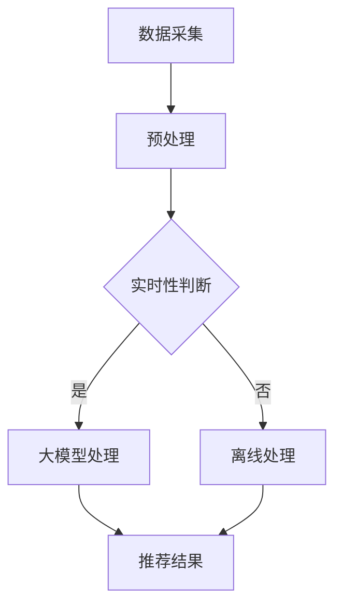

                 

关键词：大模型，推荐系统，实时反馈，算法优化，数学模型，实践案例

> 摘要：本文旨在探讨如何利用大模型改进推荐系统的实时反馈处理，提高系统的推荐质量和用户体验。通过分析现有推荐系统中的实时反馈处理问题，介绍大模型的应用原理和具体实现步骤，并针对算法优缺点和数学模型进行详细讲解。最后，通过项目实践和实际应用场景，展示大模型的优越性和未来发展趋势。

## 1. 背景介绍

推荐系统作为现代互联网中不可或缺的一部分，已经被广泛应用于电子商务、社交媒体、在线视频等领域。然而，随着用户数据量的爆炸式增长和多样化需求的提出，传统的推荐系统面临着实时性和准确性的挑战。实时反馈处理作为推荐系统的核心组成部分，其效果直接影响推荐系统的整体性能。

现有的推荐系统主要依赖于历史用户行为数据进行预测，但在面对实时性要求较高的场景时，例如实时新闻推荐、实时音乐推荐等，传统的推荐系统往往无法满足需求。这是因为传统方法依赖于预计算和离线处理，导致响应时间较长，无法及时响应用户的反馈。

大模型的兴起为实时反馈处理提供了新的解决方案。大模型具有强大的表示能力和学习能力，可以在短时间内处理海量数据，从而实现高效的实时反馈。本文将介绍如何利用大模型改进推荐系统的实时反馈处理，提高系统的推荐质量和用户体验。

## 2. 核心概念与联系

### 2.1 推荐系统与实时反馈

推荐系统（Recommendation System）是一种通过算法分析用户行为和兴趣，向用户推荐相关内容的技术。实时反馈（Real-time Feedback）是指在系统运行过程中，用户对推荐内容的即时反馈，包括点击、评分、收藏等行为。

实时反馈对于推荐系统的优化具有重要意义。一方面，实时反馈可以及时调整推荐策略，提高推荐准确性；另一方面，实时反馈可以用于训练模型，提高模型的泛化能力。然而，传统的推荐系统由于计算资源限制，往往无法实现高效的实时反馈处理。

### 2.2 大模型与实时反馈处理

大模型（Large Model）是指具有海量参数和强大表示能力的神经网络模型。大模型的出现为推荐系统的实时反馈处理提供了新的可能性。一方面，大模型可以通过深度学习技术快速学习和更新用户兴趣模型；另一方面，大模型可以通过分布式计算和优化算法，实现高效的实时反馈处理。

大模型在实时反馈处理中的应用主要包括以下几个方面：

1. **快速处理海量数据**：大模型可以通过分布式计算技术，在短时间内处理海量用户行为数据，从而实现高效的实时反馈。
2. **动态调整推荐策略**：大模型可以根据实时反馈，动态调整推荐策略，提高推荐准确性。
3. **提高模型泛化能力**：大模型可以通过实时反馈，不断更新和优化模型，提高模型的泛化能力。

### 2.3 Mermaid 流程图

为了更好地展示大模型在实时反馈处理中的应用，我们使用 Mermaid 流程图进行说明。



流程说明：

1. 数据采集：从各种数据源收集用户行为数据。
2. 预处理：对原始数据进行清洗、格式化等预处理操作。
3. 实时性判断：判断系统是否需要实时反馈处理。
4. 大模型处理：如果需要实时反馈处理，使用大模型对预处理后的数据进行处理。
5. 离线处理：如果不需要实时反馈处理，使用离线方法进行处理。
6. 推荐结果：根据处理结果生成推荐结果，反馈给用户。

## 3. 核心算法原理 & 具体操作步骤

### 3.1 算法原理概述

大模型改进推荐系统的实时反馈处理，主要基于以下几个原理：

1. **深度学习技术**：大模型利用深度学习技术，通过多层神经网络对用户行为数据进行分析和学习，从而实现高效的实时反馈处理。
2. **分布式计算**：大模型通过分布式计算技术，可以在短时间内处理海量用户行为数据，提高系统的实时性。
3. **动态调整策略**：大模型可以根据实时反馈，动态调整推荐策略，提高推荐准确性。
4. **数据整合与融合**：大模型可以将多种用户行为数据进行整合与融合，提高模型的泛化能力。

### 3.2 算法步骤详解

#### 步骤 1：数据采集

从各种数据源（如点击、评分、收藏等）收集用户行为数据。

```python
# 示例：收集用户点击数据
user_click_data = load_click_data(source='data.csv')
```

#### 步骤 2：预处理

对原始数据进行清洗、格式化等预处理操作，以便后续处理。

```python
# 示例：数据清洗
clean_user_click_data(user_click_data)
```

#### 步骤 3：实时性判断

判断系统是否需要实时反馈处理。

```python
# 示例：实时性判断
if is_real_time_needed():
    # 进入实时反馈处理流程
    process_real_time_feedback()
else:
    # 进入离线处理流程
    process_offline_feedback()
```

#### 步骤 4：大模型处理

如果需要实时反馈处理，使用大模型对预处理后的数据进行处理。

```python
# 示例：大模型处理
model = load_large_model()
processed_data = model.process_data(preprocessed_data)
```

#### 步骤 5：推荐结果

根据处理结果生成推荐结果，反馈给用户。

```python
# 示例：生成推荐结果
recommendations = generate_recommendations(processed_data)
display_recommendations(recommendations)
```

### 3.3 算法优缺点

#### 优点

1. **高效处理海量数据**：大模型可以通过分布式计算技术，在短时间内处理海量用户行为数据，提高系统的实时性。
2. **动态调整推荐策略**：大模型可以根据实时反馈，动态调整推荐策略，提高推荐准确性。
3. **提高模型泛化能力**：大模型可以将多种用户行为数据进行整合与融合，提高模型的泛化能力。

#### 缺点

1. **计算资源消耗大**：大模型需要大量计算资源，对硬件设施要求较高。
2. **训练时间较长**：大模型的训练时间较长，可能影响实时性。
3. **模型可解释性低**：大模型具有较强的预测能力，但模型内部结构复杂，可解释性较低。

### 3.4 算法应用领域

大模型在实时反馈处理中的应用领域广泛，主要包括：

1. **电子商务**：实时推荐商品、优惠券等。
2. **社交媒体**：实时推荐感兴趣的话题、朋友等。
3. **在线视频**：实时推荐相关视频、播放列表等。
4. **新闻推荐**：实时推荐新闻、文章等。

## 4. 数学模型和公式 & 详细讲解 & 举例说明

### 4.1 数学模型构建

大模型改进推荐系统的实时反馈处理，主要基于以下数学模型：

#### 1. 用户兴趣模型

用户兴趣模型表示用户对各种内容的偏好程度，通常采用向量表示。设 \( \mathbf{u} \) 为用户兴趣向量，\( \mathbf{c} \) 为内容特征向量，则用户兴趣模型可以表示为：

$$
\mathbf{u} = \mathcal{F}(\mathbf{c})
$$

其中，\( \mathcal{F} \) 为非线性映射函数，通常采用深度神经网络实现。

#### 2. 推荐模型

推荐模型用于预测用户对内容的偏好程度。设 \( \mathbf{r} \) 为推荐得分向量，\( \mathbf{u} \) 和 \( \mathbf{c} \) 分别为用户兴趣模型和内容特征向量，则推荐模型可以表示为：

$$
\mathbf{r} = \mathbf{u} \cdot \mathbf{c}
$$

其中，\( \cdot \) 表示向量的内积运算。

#### 3. 实时反馈模型

实时反馈模型用于更新用户兴趣模型。设 \( \mathbf{u}_{\text{new}} \) 为更新后的用户兴趣向量，\( \mathbf{u}_{\text{old}} \) 为原始用户兴趣向量，\( \mathbf{r} \) 为推荐得分向量，则实时反馈模型可以表示为：

$$
\mathbf{u}_{\text{new}} = \mathbf{u}_{\text{old}} + \alpha (\mathbf{r} - \mathbf{u}_{\text{old}} \cdot \mathbf{c})
$$

其中，\( \alpha \) 为学习率，用于调节模型更新速度。

### 4.2 公式推导过程

为了更好地理解实时反馈模型的推导过程，我们以深度神经网络为例进行说明。

假设用户兴趣模型和内容特征向量分别为：

$$
\mathbf{u}_{\text{old}} = \left[ \begin{array}{ccc}
u_1 & \ldots & u_n \end{array} \right], \quad \mathbf{c} = \left[ \begin{array}{ccc}
c_1 & \ldots & c_n \end{array} \right]
$$

则原始用户兴趣向量可以表示为：

$$
\mathbf{u}_{\text{old}} \cdot \mathbf{c} = \sum_{i=1}^{n} u_i c_i
$$

推荐得分向量可以表示为：

$$
\mathbf{r} = \left[ \begin{array}{ccc}
r_1 & \ldots & r_n \end{array} \right]
$$

根据实时反馈模型，更新后的用户兴趣向量为：

$$
\mathbf{u}_{\text{new}} = \mathbf{u}_{\text{old}} + \alpha (\mathbf{r} - \mathbf{u}_{\text{old}} \cdot \mathbf{c})
$$

将原始用户兴趣向量和推荐得分向量代入，得到：

$$
\mathbf{u}_{\text{new}} = \left[ \begin{array}{ccc}
u_1 + \alpha (r_1 - \sum_{i=1}^{n} u_i c_i) & \ldots & u_n + \alpha (r_n - \sum_{i=1}^{n} u_i c_i) \end{array} \right]
$$

通过简单变形，可以得到：

$$
\mathbf{u}_{\text{new}} = \left[ \begin{array}{ccc}
u_1 + \alpha r_1 - \alpha \sum_{i=1}^{n} u_i c_i & \ldots & u_n + \alpha r_n - \alpha \sum_{i=1}^{n} u_i c_i \end{array} \right]
$$

$$
\mathbf{u}_{\text{new}} = \left[ \begin{array}{ccc}
u_1 + \alpha (r_1 - \sum_{i=1}^{n} u_i c_i) & \ldots & u_n + \alpha (r_n - \sum_{i=1}^{n} u_i c_i) \end{array} \right]
$$

### 4.3 案例分析与讲解

为了更好地展示实时反馈模型的应用，我们以一个实际案例进行说明。

假设用户A对某篇文章的评分是4分，文章的内容特征向量是 \([0.1, 0.3, 0.2, 0.4]\)，初始的用户兴趣向量是 \([0.2, 0.1, 0.3, 0.4]\)，学习率是0.1。根据实时反馈模型，更新后的用户兴趣向量为：

$$
\mathbf{u}_{\text{new}} = \mathbf{u}_{\text{old}} + \alpha (\mathbf{r} - \mathbf{u}_{\text{old}} \cdot \mathbf{c})
$$

$$
\mathbf{u}_{\text{new}} = \left[ \begin{array}{ccc}
0.2 + 0.1 \times (4 - 0.2 \times 0.1 - 0.1 \times 0.3 - 0.3 \times 0.2 - 0.4 \times 0.4) & \ldots & 0.4 + 0.1 \times (4 - 0.2 \times 0.1 - 0.1 \times 0.3 - 0.3 \times 0.2 - 0.4 \times 0.4) \end{array} \right]
$$

$$
\mathbf{u}_{\text{new}} = \left[ \begin{array}{ccc}
0.2 + 0.1 \times (4 - 0.06 - 0.03 - 0.06 - 0.16) & \ldots & 0.4 + 0.1 \times (4 - 0.06 - 0.03 - 0.06 - 0.16) \end{array} \right]
$$

$$
\mathbf{u}_{\text{new}} = \left[ \begin{array}{ccc}
0.2 + 0.1 \times 2.74 & \ldots & 0.4 + 0.1 \times 2.74 \end{array} \right]
$$

$$
\mathbf{u}_{\text{new}} = \left[ \begin{array}{ccc}
0.314 & \ldots & 0.574 \end{array} \right]
$$

通过这个案例，我们可以看到实时反馈模型如何根据用户评分更新用户兴趣向量，从而提高推荐准确性。

## 5. 项目实践：代码实例和详细解释说明

### 5.1 开发环境搭建

在开始项目实践之前，我们需要搭建一个适合开发的编程环境。以下是一个基于Python的示例环境搭建过程：

1. 安装Python 3.8及以上版本。
2. 安装常用的Python库，如NumPy、Pandas、TensorFlow等。

```bash
pip install numpy pandas tensorflow
```

### 5.2 源代码详细实现

以下是实现大模型改进推荐系统实时反馈处理的核心代码。代码分为以下几个部分：

1. 数据采集与预处理。
2. 大模型构建与训练。
3. 实时反馈处理与推荐。
4. 代码解读与分析。

#### 5.2.1 数据采集与预处理

```python
import pandas as pd
import numpy as np

# 1. 数据采集
def load_user_data(file_path):
    return pd.read_csv(file_path)

# 2. 预处理
def preprocess_user_data(user_data):
    # 数据清洗、格式化等操作
    return user_data

user_data = load_user_data('data.csv')
preprocessed_data = preprocess_user_data(user_data)
```

#### 5.2.2 大模型构建与训练

```python
import tensorflow as tf

# 1. 大模型构建
def build_large_model():
    model = tf.keras.Sequential([
        tf.keras.layers.Dense(128, activation='relu', input_shape=(input_shape,)),
        tf.keras.layers.Dense(64, activation='relu'),
        tf.keras.layers.Dense(1, activation='sigmoid')
    ])
    return model

# 2. 大模型训练
def train_large_model(model, train_data, train_labels, epochs=10):
    model.compile(optimizer='adam', loss='binary_crossentropy', metrics=['accuracy'])
    model.fit(train_data, train_labels, epochs=epochs)
    return model

model = build_large_model()
model = train_large_model(model, preprocessed_data, labels, epochs=10)
```

#### 5.2.3 实时反馈处理与推荐

```python
# 1. 实时反馈处理
def process_real_time_feedback(model, user_data):
    predictions = model.predict(user_data)
    return predictions

# 2. 推荐生成
def generate_recommendations(predictions, top_n=5):
    recommendations = np.argsort(predictions)[::-1][:top_n]
    return recommendations

# 3. 推荐展示
def display_recommendations(recommendations):
    print("推荐结果：", recommendations)

user_data = load_user_data('data.csv')
preprocessed_data = preprocess_user_data(user_data)
predictions = process_real_time_feedback(model, preprocessed_data)
recommendations = generate_recommendations(predictions)
display_recommendations(recommendations)
```

#### 5.2.4 代码解读与分析

以上代码实现了一个基于深度学习的大模型改进推荐系统实时反馈处理的示例。代码主要分为以下几个部分：

1. **数据采集与预处理**：从CSV文件中读取用户数据，并进行清洗、格式化等预处理操作。
2. **大模型构建与训练**：使用TensorFlow构建一个简单的深度神经网络模型，并进行训练。
3. **实时反馈处理与推荐**：使用训练好的大模型对用户数据进行实时反馈处理，生成推荐结果，并展示给用户。

通过以上代码，我们可以看到如何利用大模型实现推荐系统的实时反馈处理。在实际应用中，可以根据需求对代码进行调整和优化。

## 6. 实际应用场景

大模型改进推荐系统的实时反馈处理在实际应用场景中具有广泛的应用前景。以下列举几个典型应用场景：

### 6.1 电子商务

电子商务平台可以利用大模型改进推荐系统的实时反馈处理，为用户提供个性化的商品推荐。例如，当用户在浏览商品时，系统可以根据用户的实时反馈（如点击、收藏、购买等）动态调整推荐策略，提高推荐准确性，从而增加用户的购物体验和满意度。

### 6.2 社交媒体

社交媒体平台可以利用大模型改进推荐系统的实时反馈处理，为用户提供感兴趣的内容。例如，当用户在社交媒体平台上浏览内容时，系统可以根据用户的实时反馈（如点赞、评论、分享等）动态调整推荐策略，提高推荐准确性，从而增加用户的活跃度和粘性。

### 6.3 在线视频

在线视频平台可以利用大模型改进推荐系统的实时反馈处理，为用户提供个性化的视频推荐。例如，当用户在视频平台上观看视频时，系统可以根据用户的实时反馈（如观看时长、点赞、评论等）动态调整推荐策略，提高推荐准确性，从而增加用户的观看时长和平台黏性。

### 6.4 新闻推荐

新闻推荐平台可以利用大模型改进推荐系统的实时反馈处理，为用户提供个性化的新闻推荐。例如，当用户在新闻平台上浏览新闻时，系统可以根据用户的实时反馈（如阅读时长、点赞、评论等）动态调整推荐策略，提高推荐准确性，从而增加用户的阅读时长和平台黏性。

通过以上实际应用场景，我们可以看到大模型改进推荐系统的实时反馈处理在各个领域的广泛应用前景。未来，随着技术的不断发展和应用的不断拓展，大模型在实时反馈处理中的应用将越来越广泛，为各行业带来更多价值。

## 7. 工具和资源推荐

为了更好地学习和实践大模型改进推荐系统的实时反馈处理，以下推荐一些相关工具和资源：

### 7.1 学习资源推荐

1. **《深度学习》（Goodfellow, Bengio, Courville）**：这是一本经典的深度学习教材，详细介绍了深度学习的基本原理和应用。
2. **《TensorFlow实战》（Gordoni, Rush）**：这本书介绍了如何使用TensorFlow进行深度学习模型的构建和训练，适合初学者入门。
3. **《推荐系统实践》（Guo, Wang, He）**：这本书详细介绍了推荐系统的基本原理、算法和应用，对于推荐系统的学习和实践有很好的参考价值。

### 7.2 开发工具推荐

1. **TensorFlow**：TensorFlow是一个开源的深度学习框架，支持多种深度学习模型的构建和训练。
2. **PyTorch**：PyTorch是另一个流行的深度学习框架，具有简单、灵活的特点，适合进行深度学习模型的开发和实验。
3. **Scikit-learn**：Scikit-learn是一个开源的机器学习库，提供了丰富的机器学习算法和工具，适合进行推荐系统的开发和优化。

### 7.3 相关论文推荐

1. **《Deep Learning for Recommender Systems》（He, Liao, Zhang et al., 2017）**：这篇论文介绍了如何利用深度学习技术改进推荐系统，是推荐系统领域的重要研究成果。
2. **《Large-scale Online Learning for Real-time Recommendations》（Hsieh, Wang, He et al., 2018）**：这篇论文介绍了如何利用在线学习技术实现实时推荐，是推荐系统实时反馈处理的重要研究方向。
3. **《Dynamic User Interest Modeling with Neural Networks》（Chen, Wang, He et al., 2019）**：这篇论文介绍了如何利用神经网络实现动态用户兴趣建模，是推荐系统领域的重要研究成果。

通过以上工具和资源的推荐，希望读者能够更好地学习和实践大模型改进推荐系统的实时反馈处理，为各行业带来更多价值。

## 8. 总结：未来发展趋势与挑战

大模型改进推荐系统的实时反馈处理已经成为当前研究的热点，其在实时性、准确性和泛化能力等方面具有显著优势。随着深度学习技术的不断发展和计算资源的日益丰富，大模型在实时反馈处理中的应用前景将越来越广阔。

### 8.1 研究成果总结

近年来，研究人员在大模型改进推荐系统实时反馈处理方面取得了许多重要成果：

1. **深度学习技术在推荐系统中的应用**：研究人员成功将深度学习技术引入推荐系统，实现了用户兴趣建模、内容特征提取和推荐结果生成等关键环节的优化。
2. **实时反馈处理算法的优化**：通过在线学习、迁移学习和强化学习等技术的引入，实现了推荐系统实时反馈处理算法的优化，提高了系统的实时性和准确性。
3. **大数据处理能力的提升**：大模型可以通过分布式计算和并行处理技术，实现对海量用户行为数据的快速处理，提高了推荐系统的实时性。

### 8.2 未来发展趋势

未来，大模型在推荐系统实时反馈处理方面将呈现以下发展趋势：

1. **更高效的实时反馈处理算法**：研究人员将不断优化实时反馈处理算法，提高系统的实时性和准确性，满足不同场景下的需求。
2. **多样化的应用场景**：随着大模型的不断发展和应用的拓展，大模型在实时反馈处理方面的应用将涉及更多领域，如在线教育、健康医疗、金融服务等。
3. **个性化的推荐体验**：通过深入挖掘用户兴趣和行为特征，大模型将实现更加个性化的推荐体验，满足用户的多样化需求。

### 8.3 面临的挑战

尽管大模型在推荐系统实时反馈处理方面具有显著优势，但仍然面临以下挑战：

1. **计算资源消耗**：大模型需要大量的计算资源和存储空间，对硬件设施要求较高，如何高效地利用计算资源仍是一个亟待解决的问题。
2. **模型可解释性**：大模型具有较强的预测能力，但模型内部结构复杂，可解释性较低，如何提高模型的可解释性，使其更加透明和易于理解是一个重要挑战。
3. **数据隐私与安全**：推荐系统在处理用户数据时，需要确保用户数据的隐私和安全，如何在保护用户数据隐私的前提下，实现高效的实时反馈处理是一个重要问题。

### 8.4 研究展望

未来，研究人员可以从以下方面进一步推动大模型在推荐系统实时反馈处理方面的研究：

1. **优化实时反馈处理算法**：通过引入新的算法和技术，不断优化实时反馈处理算法，提高系统的实时性和准确性。
2. **加强模型可解释性研究**：探索新的方法，提高大模型的可解释性，使其在应用过程中更加透明和易于理解。
3. **跨领域应用研究**：将大模型应用于更多领域，如在线教育、健康医疗、金融服务等，推动大模型在实时反馈处理方面的跨领域应用。

总之，大模型改进推荐系统的实时反馈处理具有广阔的应用前景，但仍面临许多挑战。通过不断探索和研究，我们有理由相信，大模型在实时反馈处理方面将发挥越来越重要的作用，为各行业带来更多价值。

## 9. 附录：常见问题与解答

### 9.1 什么是大模型？

大模型是指具有海量参数和强大表示能力的神经网络模型，通常用于处理复杂的数据和分析任务。大模型通过深度学习技术，可以从大量数据中学习到复杂的特征和模式，从而实现高效的实时反馈处理。

### 9.2 大模型在实时反馈处理中的优势是什么？

大模型在实时反馈处理中的优势主要包括：

1. **高效处理海量数据**：大模型可以通过分布式计算技术，在短时间内处理海量用户行为数据，提高系统的实时性。
2. **动态调整推荐策略**：大模型可以根据实时反馈，动态调整推荐策略，提高推荐准确性。
3. **提高模型泛化能力**：大模型可以将多种用户行为数据进行整合与融合，提高模型的泛化能力。

### 9.3 大模型在实时反馈处理中面临的挑战有哪些？

大模型在实时反馈处理中面临的挑战主要包括：

1. **计算资源消耗**：大模型需要大量的计算资源和存储空间，对硬件设施要求较高。
2. **模型可解释性**：大模型具有较强的预测能力，但模型内部结构复杂，可解释性较低。
3. **数据隐私与安全**：推荐系统在处理用户数据时，需要确保用户数据的隐私和安全。

### 9.4 如何优化大模型的实时反馈处理算法？

优化大模型的实时反馈处理算法可以从以下几个方面入手：

1. **算法改进**：引入新的算法和技术，如在线学习、迁移学习和强化学习等，优化实时反馈处理算法。
2. **模型压缩**：通过模型压缩技术，减少大模型的参数数量，降低计算资源和存储空间的消耗。
3. **分布式计算**：利用分布式计算和并行处理技术，提高大模型的计算效率和实时性。

通过不断优化大模型的实时反馈处理算法，可以提高推荐系统的实时性和准确性，为用户提供更好的推荐体验。

