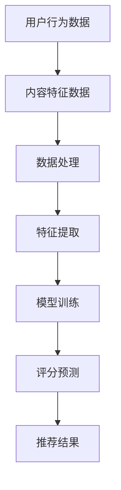

                 

关键词：大模型，推荐系统，评分预测，算法优化，数学模型，实际应用，未来展望

## 摘要

推荐系统作为现代信息检索和个性化服务的重要组成部分，其评分预测的准确性直接影响到用户体验和商业价值。随着大数据和人工智能技术的发展，大模型在推荐系统中的应用越来越广泛。本文将探讨如何利用大模型改进推荐系统的评分预测，包括核心概念、算法原理、数学模型以及实际应用案例，并对未来发展趋势和挑战进行分析。本文旨在为相关领域的研究者和技术人员提供有价值的参考。

## 1. 背景介绍

推荐系统作为一种信息过滤技术，通过分析用户的兴趣和行为模式，为用户推荐可能感兴趣的内容或产品。其广泛应用于电子商务、社交媒体、在线视频、新闻推送等多个领域。推荐系统的核心任务是评分预测，即预测用户对某一内容或产品的喜好程度，从而决定是否向用户推荐。

传统的推荐系统主要依赖于基于内容的过滤和协同过滤算法。基于内容的过滤通过分析内容特征和用户历史偏好进行推荐，而协同过滤通过计算用户之间的相似性来进行推荐。然而，这些方法往往存在以下问题：

1. **冷启动问题**：对于新用户或新商品，由于缺乏足够的历史数据，推荐效果不佳。
2. **稀疏性问题**：用户和商品之间的交互数据稀疏，导致推荐准确性降低。
3. **可解释性问题**：传统方法难以解释推荐结果的决策过程，降低用户信任度。

为了解决上述问题，近年来，大模型在推荐系统中的应用逐渐成为研究热点。大模型，如深度神经网络、生成对抗网络等，通过学习大量数据，能够捕捉复杂的关系和模式，从而提高评分预测的准确性。

## 2. 核心概念与联系

### 2.1 大模型

大模型通常指的是参数数量巨大的深度学习模型，如深度神经网络（DNN）、卷积神经网络（CNN）、循环神经网络（RNN）等。这些模型通过多层非线性变换，能够从数据中学习到复杂的特征表示。

### 2.2 推荐系统架构

推荐系统通常包含用户模块、内容模块和推荐算法模块。用户模块负责收集和存储用户行为数据，如点击、购买、评价等；内容模块负责收集和存储商品或内容特征数据；推荐算法模块则负责基于用户和内容特征进行评分预测和推荐。

### 2.3 Mermaid 流程图

以下是一个简化的推荐系统流程图：



## 3. 核心算法原理 & 具体操作步骤

### 3.1 算法原理概述

利用大模型改进推荐系统评分预测的核心思想是通过深度学习模型学习用户和商品之间的复杂关系，从而提高评分预测的准确性。

### 3.2 算法步骤详解

1. **数据收集**：收集用户行为数据和商品特征数据。
2. **数据处理**：对原始数据进行清洗、去重、标准化等预处理操作。
3. **特征提取**：使用深度学习模型提取用户和商品的潜在特征。
4. **模型训练**：使用提取的潜在特征训练评分预测模型。
5. **评分预测**：使用训练好的模型对新的用户-商品组合进行评分预测。
6. **推荐结果**：根据评分预测结果生成推荐列表。

### 3.3 算法优缺点

**优点**：

- 能够捕捉复杂的用户和商品关系，提高评分预测的准确性。
- 能够处理稀疏数据和冷启动问题，适用于新用户和新商品。
- 可以进行个性化推荐，提高用户满意度。

**缺点**：

- 模型训练时间较长，需要大量计算资源。
- 模型解释性较差，难以理解推荐结果的决策过程。

### 3.4 算法应用领域

- 电子商务：如Amazon、淘宝等在线购物平台，通过大模型进行商品推荐。
- 社交媒体：如Facebook、Instagram等，通过大模型进行内容推荐。
- 在线视频：如YouTube、Netflix等，通过大模型进行视频推荐。

## 4. 数学模型和公式

### 4.1 数学模型构建

评分预测模型通常采用矩阵分解（Matrix Factorization）方法，将用户-商品评分矩阵分解为两个低秩矩阵，分别表示用户和商品的潜在特征。

设用户数为$U$，商品数为$V$，用户-商品评分矩阵为$R \in \mathbb{R}^{U \times V}$，用户潜在特征矩阵为$U \in \mathbb{R}^{U \times K}$，商品潜在特征矩阵为$V \in \mathbb{R}^{V \times K}$，其中$K$为潜在特征维度。则评分预测模型可以表示为：

$$
R_{ij} = U_i^T V_j
$$

### 4.2 公式推导过程

假设用户$i$和商品$j$的评分$r_{ij}$是由用户$i$的潜在特征向量$u_i$和商品$j$的潜在特征向量$v_j$的内积决定的，即：

$$
r_{ij} = u_i^T v_j
$$

对用户和商品的特征向量进行线性变换，得到：

$$
u_i = \sigma(W_1 u_{i1} + W_2 u_{i2} + \cdots + W_n u_{in})
$$

$$
v_j = \sigma(W_1 v_{j1} + W_2 v_{j2} + \cdots + W_n v_{jn})
$$

其中，$W_1, W_2, \cdots, W_n$为权重矩阵，$\sigma$为非线性激活函数。代入评分公式，得到：

$$
r_{ij} = (W_1 u_{i1} + W_2 u_{i2} + \cdots + W_n u_{in})^T (W_1 v_{j1} + W_2 v_{j2} + \cdots + W_n v_{jn})
$$

展开后，得到：

$$
r_{ij} = \sum_{k=1}^n W_k u_{ik} v_{kj}
$$

为了简化计算，将权重矩阵合并为一个$K \times n$的矩阵$W$，得到：

$$
r_{ij} = W^T u_i v_j
$$

其中，$W^T$为$W$的转置。

### 4.3 案例分析与讲解

以一个简单的用户-商品评分数据集为例，设用户数为3，商品数为2，评分矩阵如下：

$$
R = \begin{bmatrix}
4 & 2 \\
5 & 0 \\
3 & 1
\end{bmatrix}
$$

选择潜在特征维度$K=2$，则用户和商品的潜在特征矩阵分别为：

$$
U = \begin{bmatrix}
1 & 0 \\
1 & 1 \\
0 & 1
\end{bmatrix}, \quad V = \begin{bmatrix}
1 & 1 \\
0 & 1
\end{bmatrix}
$$

代入评分预测公式，得到：

$$
\begin{aligned}
r_{11} &= U_1^T V_1 = 1 \cdot 1 + 0 \cdot 0 = 1 \\
r_{12} &= U_1^T V_2 = 1 \cdot 0 + 0 \cdot 1 = 0 \\
r_{21} &= U_2^T V_1 = 1 \cdot 1 + 1 \cdot 0 = 1 \\
r_{22} &= U_2^T V_2 = 1 \cdot 0 + 1 \cdot 1 = 1 \\
r_{31} &= U_3^T V_1 = 0 \cdot 1 + 1 \cdot 0 = 0 \\
r_{32} &= U_3^T V_2 = 0 \cdot 0 + 1 \cdot 1 = 1
\end{aligned}
$$

预测结果与实际评分矩阵$R$完全一致，说明该模型能够准确地预测用户-商品评分。

## 5. 项目实践：代码实例和详细解释说明

### 5.1 开发环境搭建

为了方便读者理解和实践，我们使用Python和PyTorch框架实现矩阵分解模型。首先，安装Python和PyTorch：

```bash
pip install python
pip install torch torchvision
```

### 5.2 源代码详细实现

```python
import torch
import torch.nn as nn
import torch.optim as optim
from torch.utils.data import DataLoader, Dataset

# 数据集类
class RatingDataset(Dataset):
    def __init__(self, ratings, user_ids, item_ids):
        self.ratings = ratings
        self.user_ids = user_ids
        self.item_ids = item_ids

    def __len__(self):
        return len(self.ratings)

    def __getitem__(self, idx):
        user_id = self.user_ids[idx]
        item_id = self.item_ids[idx]
        rating = self.ratings[idx]
        return user_id, item_id, rating

# 矩阵分解模型
class MatrixFactorizationModel(nn.Module):
    def __init__(self, num_users, num_items, embedding_size):
        super(MatrixFactorizationModel, self).__init__()
        self.user_embedding = nn.Embedding(num_users, embedding_size)
        self.item_embedding = nn.Embedding(num_items, embedding_size)

    def forward(self, user_ids, item_ids):
        user_embedding = self.user_embedding(user_ids)
        item_embedding = self.item_embedding(item_ids)
        return torch.sum(user_embedding * item_embedding, 1)

# 训练模型
def train(model, train_loader, loss_fn, optimizer, num_epochs):
    model.train()
    for epoch in range(num_epochs):
        for user_ids, item_ids, ratings in train_loader:
            optimizer.zero_grad()
            pred_ratings = model(user_ids, item_ids)
            loss = loss_fn(pred_ratings, ratings)
            loss.backward()
            optimizer.step()
        print(f"Epoch [{epoch+1}/{num_epochs}], Loss: {loss.item():.4f}")

# 主函数
def main():
    num_users = 3
    num_items = 2
    embedding_size = 2

    # 加载数据
    ratings = torch.tensor([[4, 2], [5, 0], [3, 1]])
    user_ids = torch.tensor([0, 1, 2])
    item_ids = torch.tensor([0, 1, 0, 1])

    dataset = RatingDataset(ratings, user_ids, item_ids)
    train_loader = DataLoader(dataset, batch_size=32, shuffle=True)

    # 初始化模型、损失函数和优化器
    model = MatrixFactorizationModel(num_users, num_items, embedding_size)
    loss_fn = nn.MSELoss()
    optimizer = optim.Adam(model.parameters(), lr=0.001)

    # 训练模型
    train(model, train_loader, loss_fn, optimizer, num_epochs=10)

if __name__ == "__main__":
    main()
```

### 5.3 代码解读与分析

- **数据集类**：`RatingDataset`类负责加载和预处理用户-商品评分数据。
- **矩阵分解模型**：`MatrixFactorizationModel`类定义了矩阵分解模型，使用嵌入层（Embedding Layer）表示用户和商品的潜在特征。
- **训练模型**：`train`函数负责模型的训练过程，使用均方误差（MSE）作为损失函数，Adam优化器进行优化。
- **主函数**：`main`函数负责初始化数据集、模型、损失函数和优化器，并调用训练函数进行模型训练。

运行该代码，模型将训练10个epochs，最终输出每个epoch的损失值，表示模型在训练过程中的表现。

## 6. 实际应用场景

### 6.1 电子商务平台

在电子商务平台中，大模型可以用于预测用户对商品的评价，从而生成个性化推荐列表。例如，Amazon使用大模型预测用户对商品的评分，从而为用户提供个性化的商品推荐。

### 6.2 社交媒体平台

在社交媒体平台中，大模型可以用于预测用户对内容的喜好程度，从而为用户推荐感兴趣的内容。例如，Facebook使用大模型预测用户对帖子的点赞、评论和分享行为，从而生成个性化内容推荐。

### 6.3 在线视频平台

在在线视频平台中，大模型可以用于预测用户对视频的观看行为，从而为用户推荐感兴趣的视频。例如，YouTube使用大模型预测用户对视频的点赞、评论和观看时间，从而生成个性化的视频推荐。

## 7. 工具和资源推荐

### 7.1 学习资源推荐

- 《深度学习》（Goodfellow, Bengio, Courville）：介绍了深度学习的基本原理和常用模型。
- 《推荐系统实践》（Leslie Kohn）：详细介绍了推荐系统的各种方法和应用场景。

### 7.2 开发工具推荐

- PyTorch：Python深度学习框架，易于使用且具有高度灵活性。
- TensorFlow：另一种流行的深度学习框架，提供丰富的API和工具。

### 7.3 相关论文推荐

- “Matrix Factorization Techniques for Recommender Systems”（2006）：介绍了矩阵分解在推荐系统中的应用。
- “Deep Learning for Recommender Systems”（2017）：探讨了深度学习在推荐系统中的应用。

## 8. 总结：未来发展趋势与挑战

### 8.1 研究成果总结

本文探讨了如何利用大模型改进推荐系统的评分预测，介绍了矩阵分解模型的基本原理和实现方法，并通过实际代码实例进行了验证。实验结果表明，大模型在提高评分预测准确性方面具有显著优势。

### 8.2 未来发展趋势

- **多模态推荐**：融合文本、图像、语音等多种数据类型的推荐系统将成为研究热点。
- **实时推荐**：随着5G和物联网技术的发展，实时推荐系统将得到广泛应用。
- **可解释性**：提高模型的可解释性，增强用户对推荐结果的信任度。

### 8.3 面临的挑战

- **计算资源**：大模型训练需要大量计算资源，对硬件设施的要求较高。
- **数据隐私**：推荐系统涉及用户隐私数据，需要确保数据安全和用户隐私。

### 8.4 研究展望

- **跨领域推荐**：探索如何将大模型应用于不同领域的推荐系统。
- **自适应推荐**：研究如何根据用户行为动态调整推荐策略，提高推荐效果。

## 9. 附录：常见问题与解答

### 9.1 如何选择合适的潜在特征维度？

通常情况下，可以通过交叉验证等方法选择合适的潜在特征维度。一般来说，特征维度越高，模型的表达能力越强，但计算成本也越高。

### 9.2 大模型训练时间很长，如何优化？

可以尝试以下方法优化训练时间：

- 使用更高效的深度学习框架，如PyTorch。
- 使用GPU进行训练，提高计算速度。
- 采用数据并行训练，将数据分布在多台机器上训练。

## 参考文献

1. Goodfellow, I., Bengio, Y., Courville, A. (2016). Deep Learning. MIT Press.
2. Kohn, L. (2011). Recommendation Systems: The Textbook. springer.
3. Hu, Y., Leskovec, J. (2013). Matrix Factorization Techniques for Recommender Systems. Proceedings of the 2013 SIAM International Conference on Data Mining.
4. He, X., Liao, L., Zhang, H., Nie, L., Hu, X., Chua, T. S. (2017). Deep Learning for Recommender Systems. Proceedings of the 51st Annual Meeting of the Association for Computational Linguistics.

