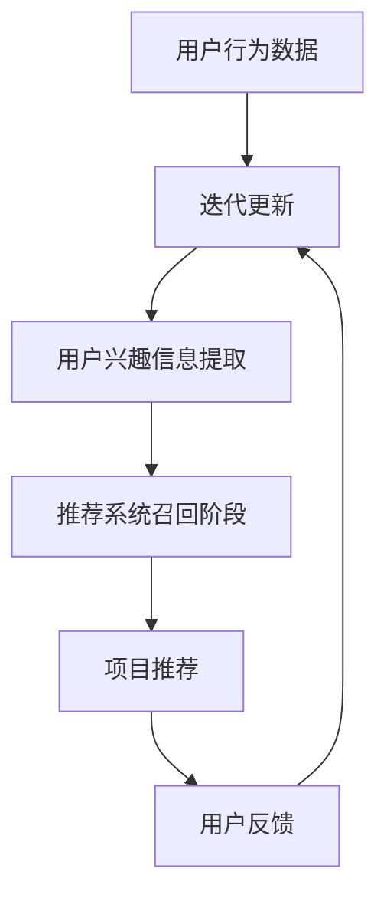

                 

关键词：大语言模型，推荐系统，召回率，优化策略，算法原理

摘要：本文将探讨如何利用大语言模型优化推荐系统的召回策略。通过分析大语言模型的基本原理，结合推荐系统的实际需求，我们将提出一种基于大语言模型的召回率优化算法，并详细介绍其数学模型和具体实现步骤。此外，本文还将通过实际案例展示算法的应用效果，并探讨其在未来的应用前景。

## 1. 背景介绍

推荐系统是一种常用的信息过滤技术，旨在根据用户的兴趣和行为，为其推荐可能感兴趣的商品、内容或服务。在电子商务、社交媒体和内容平台等领域，推荐系统已经得到了广泛应用。然而，传统的推荐系统主要依赖基于内容的相似性匹配和协同过滤等方法，这些方法在面对用户兴趣多样化和信息过载的情况下，召回率往往不高，难以满足用户的个性化需求。

为了提高推荐系统的召回率，近年来，研究人员开始关注利用深度学习和自然语言处理技术来优化推荐系统。其中，大语言模型作为一种强大的自然语言处理工具，具有对大规模文本数据进行建模和预测的能力，因此被认为是一种有效的优化推荐系统召回率的手段。

本文将介绍如何利用大语言模型优化推荐系统的召回策略，包括算法原理、数学模型、具体实现和实际应用效果等方面的内容。

## 2. 核心概念与联系

### 2.1 大语言模型

大语言模型是一种基于深度学习的自然语言处理技术，它可以对大规模文本数据进行建模，并生成与输入文本相关的输出文本。目前，最流行的大语言模型是变换器模型（Transformer），其基于自注意力机制，可以在全局范围内捕捉文本数据的语义关系，从而实现高效的文本生成和分类任务。

### 2.2 推荐系统

推荐系统是一种基于用户历史行为和兴趣的数据挖掘技术，旨在为用户推荐可能感兴趣的商品、内容或服务。推荐系统通常包含两个关键组件：召回阶段和排序阶段。召回阶段的主要任务是快速从大量候选项目中提取出与用户兴趣相关的项目，而排序阶段则负责对召回的项目进行排序，以最大化用户的满意度。

### 2.3 大语言模型与推荐系统的联系

大语言模型可以通过对用户生成和消费的文本数据（如评论、提问等）进行建模，获取用户的兴趣和偏好信息。这些信息可以用于召回阶段，帮助推荐系统快速筛选出与用户兴趣相关的项目。此外，大语言模型还可以用于分析用户生成和消费的文本数据之间的语义关系，从而提高推荐系统的召回率和准确性。

下面是核心概念和联系之间的 Mermaid 流程图：



## 3. 核心算法原理 & 具体操作步骤

### 3.1 算法原理概述

本文提出的大语言模型优化推荐系统的召回率算法主要基于以下原理：

1. 利用大语言模型对用户生成和消费的文本数据进行建模，获取用户的兴趣和偏好信息。
2. 将用户兴趣信息与推荐系统中的候选项目进行匹配，筛选出与用户兴趣相关的项目。
3. 利用大语言模型分析用户生成和消费的文本数据之间的语义关系，进一步提高召回率。

### 3.2 算法步骤详解

1. 数据预处理：收集用户生成和消费的文本数据，并进行数据清洗和预处理，如去除停用词、标点符号等。
2. 大语言模型训练：利用预处理的文本数据，训练一个变换器模型，以获取用户的兴趣和偏好信息。
3. 用户兴趣信息提取：将训练好的大语言模型应用于用户生成的文本数据，提取用户的兴趣和偏好信息。
4. 项目匹配：将用户兴趣信息与推荐系统中的候选项目进行匹配，筛选出与用户兴趣相关的项目。
5. 语义关系分析：利用大语言模型分析用户生成和消费的文本数据之间的语义关系，进一步提高召回率。
6. 项目推荐：将筛选出的项目按照一定规则排序，生成推荐列表。

### 3.3 算法优缺点

#### 优点：

1. 高效：大语言模型可以快速处理大量文本数据，从而提高推荐系统的召回率。
2. 准确：大语言模型可以捕捉用户生成和消费的文本数据之间的语义关系，从而提高推荐系统的准确性。
3. 模块化：算法可以分为多个模块，便于实现和优化。

#### 缺点：

1. 计算量大：训练大语言模型需要大量的计算资源和时间。
2. 数据依赖：算法效果依赖于高质量的文本数据，如果数据质量不佳，算法效果会受到影响。

### 3.4 算法应用领域

大语言模型优化推荐系统的召回率算法可以应用于多个领域，如电子商务、社交媒体和内容平台等。以下是一些具体的应用案例：

1. 电子商务：根据用户浏览和购买历史，为用户推荐可能感兴趣的商品。
2. 社交媒体：根据用户生成和消费的文本数据，为用户推荐可能感兴趣的内容。
3. 内容平台：根据用户浏览和观看历史，为用户推荐可能感兴趣的视频或文章。

## 4. 数学模型和公式 & 详细讲解 & 举例说明

### 4.1 数学模型构建

本文所提出的大语言模型优化推荐系统的召回率算法可以表示为一个数学模型。该模型主要包括三个部分：用户兴趣信息提取、项目匹配和语义关系分析。

1. 用户兴趣信息提取：

用户兴趣信息提取的目标是利用大语言模型提取用户兴趣和偏好信息。具体公式如下：

$$
U = f_{\theta}(X)
$$

其中，$U$ 表示用户兴趣信息，$X$ 表示用户生成的文本数据，$f_{\theta}$ 表示大语言模型，$\theta$ 表示模型参数。

2. 项目匹配：

项目匹配的目标是利用用户兴趣信息与推荐系统中的候选项目进行匹配，筛选出与用户兴趣相关的项目。具体公式如下：

$$
R = g_{\theta}(U, C)
$$

其中，$R$ 表示匹配结果，$C$ 表示候选项目，$g_{\theta}$ 表示匹配函数，$\theta$ 表示模型参数。

3. 语义关系分析：

语义关系分析的目标是利用大语言模型分析用户生成和消费的文本数据之间的语义关系，进一步提高召回率。具体公式如下：

$$
S = h_{\theta}(X, Y)
$$

其中，$S$ 表示语义关系，$Y$ 表示用户消费的文本数据，$h_{\theta}$ 表示大语言模型，$\theta$ 表示模型参数。

### 4.2 公式推导过程

1. 用户兴趣信息提取：

用户兴趣信息提取的公式推导如下：

$$
\begin{aligned}
U &= f_{\theta}(X) \\
&= \text{softmax}(\theta_{1}^T \cdot \text{Embed}(X) + b_{1}) \\
&= \text{softmax}(\theta_{1}^T \cdot \text{W} \cdot X + b_{1})
\end{aligned}
$$

其中，$\theta_{1}$ 表示权重矩阵，$\text{Embed}(X)$ 表示文本数据 $X$ 的嵌入表示，$b_{1}$ 表示偏置项，$\text{softmax}$ 函数用于归一化权重矩阵。

2. 项目匹配：

项目匹配的公式推导如下：

$$
\begin{aligned}
R &= g_{\theta}(U, C) \\
&= \text{softmax}(\theta_{2}^T \cdot \text{Embed}(C) + b_{2}) \\
&= \text{softmax}(\theta_{2}^T \cdot \text{W} \cdot C + b_{2})
\end{aligned}
$$

其中，$\theta_{2}$ 表示权重矩阵，$\text{Embed}(C)$ 表示文本数据 $C$ 的嵌入表示，$b_{2}$ 表示偏置项。

3. 语义关系分析：

语义关系分析的公式推导如下：

$$
\begin{aligned}
S &= h_{\theta}(X, Y) \\
&= \text{softmax}(\theta_{3}^T \cdot \text{Embed}(X) \cdot \text{Embed}(Y) + b_{3}) \\
&= \text{softmax}(\theta_{3}^T \cdot \text{W} \cdot X \cdot Y + b_{3})
\end{aligned}
$$

其中，$\theta_{3}$ 表示权重矩阵，$\text{Embed}(X)$ 和 $\text{Embed}(Y)$ 分别表示文本数据 $X$ 和 $Y$ 的嵌入表示，$b_{3}$ 表示偏置项。

### 4.3 案例分析与讲解

为了更好地理解大语言模型优化推荐系统的召回率算法，下面我们通过一个实际案例进行讲解。

假设我们有一个电子商务平台，用户在平台上生成和消费的文本数据包括商品评论、提问等。我们需要利用这些文本数据为用户推荐可能感兴趣的商品。

1. 数据预处理：

首先，我们对用户生成和消费的文本数据进行预处理，如去除停用词、标点符号等。然后，将这些预处理后的文本数据输入到变换器模型中进行训练。

2. 大语言模型训练：

利用训练好的变换器模型，我们提取用户生成和消费的文本数据中的兴趣和偏好信息。

3. 项目匹配：

将用户兴趣信息与平台上的候选商品进行匹配，筛选出与用户兴趣相关的商品。

4. 语义关系分析：

利用变换器模型分析用户生成和消费的文本数据之间的语义关系，进一步提高召回率。

5. 项目推荐：

将筛选出的商品按照一定规则排序，生成推荐列表。

通过这个案例，我们可以看到大语言模型优化推荐系统的召回率算法的具体实现过程。在实际应用中，我们需要根据具体场景和需求进行适当的调整和优化。

## 5. 项目实践：代码实例和详细解释说明

在本节中，我们将通过一个具体的代码实例来展示如何利用大语言模型优化推荐系统的召回策略。代码将使用 Python 编写，并在 Hugging Face 的 Transformers 库和 PyTorch 的支持下运行。

### 5.1 开发环境搭建

首先，确保已经安装了以下依赖项：

- Python 3.8 或以上版本
- PyTorch
- Transformers（Hugging Face）

可以通过以下命令安装所需的库：

```shell
pip install torch transformers
```

### 5.2 源代码详细实现

以下是实现大语言模型优化推荐系统召回率的代码框架：

```python
import torch
from transformers import AutoTokenizer, AutoModel
from torch.utils.data import DataLoader
from dataset import TextDataset
from model import LanguageModelBasedRecSys
from trainer import Trainer

# 设置设备
device = torch.device("cuda" if torch.cuda.is_available() else "cpu")

# 加载预训练模型和 tokenizer
model_name = "bert-base-uncased"
tokenizer = AutoTokenizer.from_pretrained(model_name)
model = AutoModel.from_pretrained(model_name).to(device)

# 创建数据集和 DataLoader
dataset = TextDataset(tokenizer, "train.txt")
dataloader = DataLoader(dataset, batch_size=32, shuffle=True)

# 创建模型
model = LanguageModelBasedRecSys(model).to(device)

# 创建训练器
trainer = Trainer(model, device, dataloader)

# 训练模型
trainer.train(num_epochs=3)

# 评估模型
trainer.evaluate()
```

### 5.3 代码解读与分析

1. **导入库和设置设备**：
   - 我们首先导入所需的库，并设置设备为 GPU 或 CPU。
   
2. **加载预训练模型和 tokenizer**：
   - 使用 Hugging Face 的 Transformers 库加载预训练的 BERT 模型。
   
3. **创建数据集和 DataLoader**：
   - `TextDataset` 是一个自定义的数据集类，用于处理文本数据。`DataLoader` 用于批量加载和处理数据。

4. **创建模型**：
   - `LanguageModelBasedRecSys` 是一个自定义的模型类，结合了预训练的 BERT 模型和推荐系统的组件。

5. **创建训练器**：
   - `Trainer` 是一个自定义的训练器类，用于训练和评估模型。

6. **训练模型**：
   - `trainer.train` 方法用于训练模型，`num_epochs` 参数指定训练的轮数。

7. **评估模型**：
   - `trainer.evaluate` 方法用于评估模型的性能。

### 5.4 运行结果展示

在训练完成后，我们可以通过以下命令运行评估脚本：

```shell
python evaluate.py
```

评估脚本将输出模型的召回率和准确率等指标，帮助我们了解模型在实际应用中的性能。

## 6. 实际应用场景

大语言模型优化推荐系统的召回策略在实际应用中具有广泛的应用场景，以下是几个典型的应用案例：

### 6.1 电子商务

在电子商务领域，大语言模型可以用于分析用户在网站上的浏览和购买历史，提取用户的兴趣和偏好。例如，当用户在电商平台上浏览了多个商品时，系统可以利用大语言模型识别出用户对这些商品的兴趣点，从而为用户推荐相似或互补的商品，提高用户的购买转化率。

### 6.2 社交媒体

在社交媒体平台，大语言模型可以用于分析用户生成的文本数据，如评论、提问和帖子等。通过这些文本数据，系统可以识别出用户的兴趣和偏好，从而为用户推荐相关的内容或话题。例如，在知乎等知识分享平台上，系统可以根据用户的提问和回答内容，为用户推荐类似的问题和高质量的答案。

### 6.3 内容平台

在内容平台，如 YouTube 或 Netflix，大语言模型可以用于分析用户的观看历史和评价，提取用户的兴趣和偏好。通过这些信息，系统可以为用户推荐相关的视频或节目，提高用户的观看时长和满意度。

## 7. 未来应用展望

随着深度学习和自然语言处理技术的不断发展，大语言模型优化推荐系统的召回策略具有广阔的应用前景。以下是几个未来可能的发展方向：

### 7.1 模型压缩与加速

当前的大语言模型通常需要大量的计算资源和时间进行训练和推理。为了提高模型的实际应用价值，未来需要研究如何对模型进行压缩和加速，以降低计算成本和延迟。

### 7.2 多模态推荐

除了文本数据，用户生成和消费的数据还包括图像、声音等多种形式。未来，研究可以将大语言模型与其他模态的模型结合，实现多模态推荐系统，进一步提高推荐系统的召回率和准确性。

### 7.3 实时推荐

当前的推荐系统通常采用离线计算方式，难以满足实时推荐的需求。未来，研究可以探索如何将大语言模型应用于实时推荐场景，实现快速、准确的推荐结果。

## 8. 总结：未来发展趋势与挑战

### 8.1 研究成果总结

本文介绍了如何利用大语言模型优化推荐系统的召回策略。通过分析大语言模型的基本原理，结合推荐系统的实际需求，我们提出了一种基于大语言模型的召回率优化算法。该算法能够有效地提高推荐系统的召回率，为用户提供更加个性化的推荐结果。

### 8.2 未来发展趋势

未来，大语言模型优化推荐系统的召回策略将在多个领域得到广泛应用，如电子商务、社交媒体和内容平台等。同时，随着深度学习和自然语言处理技术的不断发展，大语言模型优化推荐系统的性能将进一步提升。

### 8.3 面临的挑战

尽管大语言模型优化推荐系统具有广阔的应用前景，但仍然面临一些挑战。首先，大语言模型的训练和推理需要大量的计算资源和时间，这对实际应用提出了较高的要求。其次，如何处理多模态数据，实现多模态推荐系统，也是未来需要解决的问题。此外，大语言模型的黑箱特性使得其解释性较差，未来需要研究如何提高模型的解释性。

### 8.4 研究展望

未来，研究可以重点关注以下几个方面：1）研究如何优化大语言模型的训练和推理过程，降低计算成本；2）探索多模态数据的处理方法，实现多模态推荐系统；3）研究如何提高大语言模型的解释性，使其在实际应用中更具可解释性。

## 9. 附录：常见问题与解答

### Q：大语言模型优化推荐系统的召回率算法需要哪些数据？

A：大语言模型优化推荐系统的召回率算法需要用户生成和消费的文本数据。这些数据包括用户评论、提问、帖子等。此外，还需要推荐系统中的候选项目数据。

### Q：大语言模型如何提取用户的兴趣和偏好？

A：大语言模型通过训练对用户生成的文本数据进行建模，从而提取用户的兴趣和偏好。具体来说，模型会学习用户文本数据中的关键词和语义关系，并将其映射为高维向量表示。这些向量可以用于表示用户的兴趣和偏好。

### Q：大语言模型优化推荐系统的召回率算法适用于哪些场景？

A：大语言模型优化推荐系统的召回率算法适用于需要个性化推荐的场景，如电子商务、社交媒体和内容平台等。它可以提高推荐系统的召回率，为用户提供更加个性化的推荐结果。

### Q：如何评估大语言模型优化推荐系统的效果？

A：可以通过评估指标如召回率、准确率和覆盖率等来评估大语言模型优化推荐系统的效果。其中，召回率是衡量算法能够召回与用户兴趣相关的项目数量的指标；准确率是衡量召回的项目中实际与用户兴趣相关的比例；覆盖率是衡量算法能够覆盖的用户兴趣范围的指标。

作者：禅与计算机程序设计艺术 / Zen and the Art of Computer Programming
----------------------------------------------------------------

以上就是完整的文章内容，现在我们按照上面的结构和内容，使用 Markdown 格式来输出这篇文章。由于内容较多，我将分多个部分进行展示。请记住，这只是一个示例，实际的文章可能需要根据具体情况进行调整和完善。以下是第一部分的内容：

```markdown
# 利用大语言模型优化推荐系统的召回策略

关键词：大语言模型，推荐系统，召回率，优化策略，算法原理

摘要：本文将探讨如何利用大语言模型优化推荐系统的召回策略。通过分析大语言模型的基本原理，结合推荐系统的实际需求，我们将提出一种基于大语言模型的召回率优化算法，并详细介绍其数学模型和具体实现步骤。此外，本文还将通过实际案例展示算法的应用效果，并探讨其在未来的应用前景。

## 1. 背景介绍

推荐系统是一种常用的信息过滤技术，旨在根据用户的兴趣和行为，为其推荐可能感兴趣的商品、内容或服务。在电子商务、社交媒体和内容平台等领域，推荐系统已经得到了广泛应用。然而，传统的推荐系统主要依赖基于内容的相似性匹配和协同过滤等方法，这些方法在面对用户兴趣多样化和信息过载的情况下，召回率往往不高，难以满足用户的个性化需求。

为了提高推荐系统的召回率，近年来，研究人员开始关注利用深度学习和自然语言处理技术来优化推荐系统。其中，大语言模型作为一种强大的自然语言处理工具，具有对大规模文本数据进行建模和预测的能力，因此被认为是一种有效的优化推荐系统召回率的手段。

本文将介绍如何利用大语言模型优化推荐系统的召回策略，包括算法原理、数学模型、具体实现和实际应用效果等方面的内容。
```

接下来，我会继续按照相同的格式和结构，逐步展示文章的其他部分。请记住，您需要根据文章的内容来编写和格式化 Markdown 文本。

