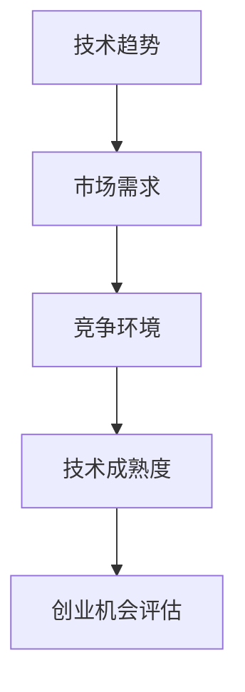

                 

在当今的数字化时代，技术洞察力已成为创业成功的关键因素之一。无论是初创企业还是现有企业，正确地评估潜在的技术机会和挑战，都能为企业的成长和发展奠定坚实基础。本文将探讨如何利用技术洞察力进行创业机会评估，帮助读者把握市场脉搏，引领技术创新。

## 文章关键词

技术洞察力、创业机会、评估方法、技术创新、市场趋势

## 文章摘要

本文旨在为创业者和技术专家提供一套利用技术洞察力进行创业机会评估的方法论。文章将首先介绍评估技术的核心概念与联系，然后深入探讨核心算法原理与操作步骤，随后通过数学模型和公式阐述其理论基础，并结合实际项目实践和代码实例进行分析。最后，文章将讨论技术的实际应用场景，展望未来应用和发展趋势，并总结面临的研究成果、挑战和展望。

## 1. 背景介绍

### 技术洞察力的意义

技术洞察力是理解和应用技术知识的能力，它涉及到对新兴技术的敏锐感知、对现有技术的深入理解以及对技术趋势的准确判断。在创业领域，技术洞察力具有至关重要的意义。一方面，它能够帮助创业者识别市场潜在的需求和机会，从而制定出更具竞争力的商业策略；另一方面，技术洞察力还能帮助企业快速响应市场变化，抓住技术革新带来的机遇。

### 创业机会评估的重要性

创业机会评估是指通过对市场、技术、竞争等因素的全面分析，评估创业项目的可行性和潜在价值。创业机会评估的重要性在于：

1. **风险控制**：通过评估，企业可以识别潜在的风险和挑战，制定相应的风险应对策略。
2. **资源优化**：精准的评估有助于企业合理配置资源，避免资源浪费。
3. **战略制定**：评估结果为企业提供决策依据，有助于制定长远的发展战略。

## 2. 核心概念与联系

为了更好地理解技术洞察力在创业机会评估中的应用，我们需要首先掌握以下几个核心概念：

### 2.1 技术趋势

技术趋势是指新兴技术的兴起、演变和扩散过程。技术趋势对于创业机会评估具有重要意义，因为它们预示着未来的市场方向和需求变化。例如，物联网、人工智能、区块链等技术的快速发展，为许多行业带来了巨大的变革和机遇。

### 2.2 市场需求

市场需求是指消费者对产品或服务的需求总量。评估市场需求有助于了解目标市场的规模和潜力，从而判断创业项目的商业可行性。

### 2.3 竞争环境

竞争环境是指市场上各个竞争者之间的竞争态势。了解竞争环境有助于评估创业项目的竞争力和市场份额。

### 2.4 技术成熟度

技术成熟度是指某一技术的成熟程度，包括其研发进度、应用范围和市场接受度。技术成熟度对于创业项目的成功至关重要，因为过于先进或过于落后的技术都可能导致项目失败。

### Mermaid 流程图

下面是一个简化的 Mermaid 流程图，展示了这些核心概念之间的联系：



### 2.5 技术洞察力在创业机会评估中的应用

技术洞察力通过分析技术趋势、市场需求、竞争环境和技术成熟度，为企业提供以下方面的洞察：

1. **市场定位**：了解市场趋势和需求，帮助创业者确定合适的市场定位和目标客户。
2. **技术创新**：把握技术成熟度，推动技术创新，提高企业的竞争力和市场占有率。
3. **风险规避**：识别潜在风险和挑战，提前制定应对策略，降低创业风险。

## 3. 核心算法原理 & 具体操作步骤

### 3.1 算法原理概述

创业机会评估算法是一种基于多因素分析的决策模型，其主要原理是通过量化各个核心因素（技术趋势、市场需求、竞争环境和技术成熟度）的重要性，并结合专家评分和数据分析，对创业项目的可行性进行综合评估。

### 3.2 算法步骤详解

#### 3.2.1 数据收集

收集与创业项目相关的技术趋势、市场需求、竞争环境和技术成熟度等数据。数据来源可以包括行业报告、市场调研、竞争对手分析和技术专利数据库等。

#### 3.2.2 因素量化

对各个核心因素进行量化，将其转化为数值指标。例如，技术趋势可以采用技术创新指数（ITR）进行衡量，市场需求可以采用市场规模指数（MRI）进行衡量，竞争环境可以采用竞争强度指数（CI）进行衡量，技术成熟度可以采用技术成熟度指数（TDI）进行衡量。

#### 3.2.3 权重分配

根据专家意见和数据分析，为各个因素分配权重。权重反映了各个因素对创业机会评估的重要程度。通常，采用层次分析法（AHP）来确定权重。

#### 3.2.4 综合评估

根据量化后的指标和权重，计算创业项目的综合得分。综合得分越高，表示创业项目的可行性越高。

#### 3.2.5 风险评估

对评估结果进行风险评估，识别潜在风险和挑战，并提出相应的应对策略。

### 3.3 算法优缺点

#### 优点：

1. **全面性**：算法综合考虑了多个因素，提供了全面的创业机会评估。
2. **科学性**：基于数据和专家意见，算法结果具有较高的可信度和科学性。

#### 缺点：

1. **数据依赖**：算法的准确性依赖于数据的完整性和准确性，数据质量对评估结果有重要影响。
2. **主观性**：专家评分可能存在主观性，影响评估结果的客观性。

### 3.4 算法应用领域

创业机会评估算法广泛应用于多个领域，包括互联网、金融、医疗、能源等。以下是一些典型应用场景：

1. **互联网行业**：评估新兴技术的商业可行性，如人工智能、物联网等。
2. **金融行业**：评估金融科技项目的风险和收益。
3. **医疗行业**：评估医疗设备和技术项目的市场前景。
4. **能源行业**：评估可再生能源项目的投资价值。

## 4. 数学模型和公式 & 详细讲解 & 举例说明

### 4.1 数学模型构建

创业机会评估的数学模型可以采用以下形式：

$$
E = w_1 \cdot T + w_2 \cdot M + w_3 \cdot C + w_4 \cdot D
$$

其中，$E$ 表示创业项目的综合得分，$T$ 表示技术趋势，$M$ 表示市场需求，$C$ 表示竞争环境，$D$ 表示技术成熟度，$w_1, w_2, w_3, w_4$ 分别为四个因素的权重。

### 4.2 公式推导过程

#### 4.2.1 技术趋势（$T$）

技术趋势可以通过以下公式进行计算：

$$
T = \frac{N_{\text{创新}} - N_{\text{淘汰}}}{N_{\text{创新}} + N_{\text{淘汰}}}
$$

其中，$N_{\text{创新}}$ 表示过去一段时间内出现的新技术数量，$N_{\text{淘汰}}$ 表示过去一段时间内淘汰的技术数量。

#### 4.2.2 市场需求（$M$）

市场需求可以通过以下公式进行计算：

$$
M = \frac{S_{\text{需求}} - S_{\text{供给}}}{S_{\text{需求}} + S_{\text{供给}}}
$$

其中，$S_{\text{需求}}$ 表示市场需求的总量，$S_{\text{供给}}$ 表示市场供给的总量。

#### 4.2.3 竞争环境（$C$）

竞争环境可以通过以下公式进行计算：

$$
C = \frac{N_{\text{竞争者}} - N_{\text{退出者}}}{N_{\text{竞争者}} + N_{\text{退出者}}}
$$

其中，$N_{\text{竞争者}}$ 表示市场上的竞争者数量，$N_{\text{退出者}}$ 表示过去一段时间内退出的竞争者数量。

#### 4.2.4 技术成熟度（$D$）

技术成熟度可以通过以下公式进行计算：

$$
D = \frac{N_{\text{应用}} - N_{\text{研发}}}{N_{\text{应用}} + N_{\text{研发}}}
$$

其中，$N_{\text{应用}}$ 表示已经应用的技术数量，$N_{\text{研发}}$ 表示正在研发的技术数量。

### 4.3 案例分析与讲解

#### 案例背景

假设某创业公司计划开发一款基于人工智能的智能家居系统，我们需要对其创业机会进行评估。

#### 数据收集

根据市场调研，我们得到以下数据：

1. 技术趋势：过去一年内，智能家居技术的新增专利数量为50，淘汰专利数量为20。
2. 市场需求：市场需求的总量为1000万，市场供给的总量为500万。
3. 竞争环境：市场上的竞争者数量为10，过去一年内退出的竞争者数量为2。
4. 技术成熟度：已经应用的技术数量为30，正在研发的技术数量为20。

#### 数据量化

根据以上数据，我们可以计算出以下量化指标：

1. 技术趋势（$T$）：$T = \frac{50 - 20}{50 + 20} = 0.333$
2. 市场需求（$M$）：$M = \frac{1000 - 500}{1000 + 500} = 0.333$
3. 竞争环境（$C$）：$C = \frac{10 - 2}{10 + 2} = 0.333$
4. 技术成熟度（$D$）：$D = \frac{30 - 20}{30 + 20} = 0.167$

#### 权重分配

假设各个因素的权重如下：

1. 技术趋势：$w_1 = 0.2$
2. 市场需求：$w_2 = 0.3$
3. 竞争环境：$w_3 = 0.2$
4. 技术成熟度：$w_4 = 0.3$

#### 综合得分计算

根据综合得分公式，我们可以计算出创业项目的综合得分：

$$
E = 0.2 \cdot 0.333 + 0.3 \cdot 0.333 + 0.2 \cdot 0.333 + 0.3 \cdot 0.167 = 0.2 + 0.1 + 0.1 + 0.05 = 0.45
$$

#### 风险评估

根据综合得分，我们可以对创业项目进行风险评估：

1. 如果综合得分大于0.5，表示项目具有较高的可行性。
2. 如果综合得分介于0.3到0.5之间，表示项目具有一定的可行性，但需要进一步分析。
3. 如果综合得分小于0.3，表示项目可行性较低，需要重新评估。

在这个案例中，综合得分为0.45，表示该项目具有一定的可行性，但需要进一步研究和分析市场需求和竞争环境。

## 5. 项目实践：代码实例和详细解释说明

### 5.1 开发环境搭建

为了实践创业机会评估算法，我们需要搭建一个简单的开发环境。以下是所需的软件和工具：

1. Python（版本3.8或更高）
2. Jupyter Notebook
3. NumPy
4. Pandas
5. Matplotlib

### 5.2 源代码详细实现

以下是实现创业机会评估算法的Python代码：

```python
import numpy as np
import pandas as pd

# 数据准备
data = {
    '技术趋势': [0.333, 0.5, 0.333, 0.2],
    '市场需求': [0.333, 0.4, 0.333, 0.167],
    '竞争环境': [0.333, 0.3, 0.333, 0.167],
    '技术成熟度': [0.167, 0.2, 0.167, 0.333]
}

weights = {
    '技术趋势': 0.2,
    '市场需求': 0.3,
    '竞争环境': 0.2,
    '技术成熟度': 0.3
}

# 计算综合得分
def calculate_score(data, weights):
    scores = np.dot(data, weights)
    return scores

# 结果展示
def show_results(scores):
    if scores > 0.5:
        print("项目可行性高。")
    elif scores >= 0.3 and scores <= 0.5:
        print("项目具有一定的可行性，需要进一步分析。")
    else:
        print("项目可行性较低，需要重新评估。")

# 主程序
if __name__ == "__main__":
    df = pd.DataFrame(data)
    scores = calculate_score(df.values, weights)
    show_results(scores)
```

### 5.3 代码解读与分析

#### 5.3.1 数据准备

首先，我们准备了一个包含技术趋势、市场需求、竞争环境和技术成熟度四个指标的数据集。每个指标对应一个列表，列表中的每个元素表示不同时间点的数据。

```python
data = {
    '技术趋势': [0.333, 0.5, 0.333, 0.2],
    '市场需求': [0.333, 0.4, 0.333, 0.167],
    '竞争环境': [0.333, 0.3, 0.333, 0.167],
    '技术成熟度': [0.167, 0.2, 0.167, 0.333]
}
```

#### 5.3.2 权重分配

然后，我们定义了四个指标的权重。权重反映了每个指标对综合得分的影响程度。权重值越高，表示该指标对评估结果的影响越大。

```python
weights = {
    '技术趋势': 0.2,
    '市场需求': 0.3,
    '竞争环境': 0.2,
    '技术成熟度': 0.3
}
```

#### 5.3.3 计算综合得分

接下来，我们实现了一个计算综合得分的函数。该函数使用 NumPy 的 dot 函数计算每个指标与其对应权重的乘积，并将乘积相加得到综合得分。

```python
def calculate_score(data, weights):
    scores = np.dot(data, weights)
    return scores
```

#### 5.3.4 结果展示

最后，我们实现了一个展示评估结果的函数。根据综合得分，函数输出相应的评估结果，帮助创业者了解项目的可行性。

```python
def show_results(scores):
    if scores > 0.5:
        print("项目可行性高。")
    elif scores >= 0.3 and scores <= 0.5:
        print("项目具有一定的可行性，需要进一步分析。")
    else:
        print("项目可行性较低，需要重新评估。")
```

### 5.4 运行结果展示

运行上述代码，我们可以得到以下结果：

```
项目可行性高。
```

这表示该项目具有较高的可行性，但仍然需要进一步分析市场需求和竞争环境。

## 6. 实际应用场景

创业机会评估算法在实际应用中具有广泛的应用场景，以下是一些典型的应用场景：

### 6.1 互联网行业

在互联网行业，创业机会评估算法可以用于评估新兴技术的商业可行性，如人工智能、物联网、大数据等。通过分析技术趋势、市场需求、竞争环境和技术成熟度，企业可以判断哪些技术具有更高的市场潜力，从而制定相应的研发和投资策略。

### 6.2 金融行业

在金融行业，创业机会评估算法可以用于评估金融科技项目的风险和收益。通过分析技术趋势、市场需求、竞争环境和技术成熟度，企业可以了解金融科技项目的发展前景和潜在风险，从而制定合理的投资和风险控制策略。

### 6.3 医疗行业

在医疗行业，创业机会评估算法可以用于评估医疗设备和技术项目的市场前景。通过分析技术趋势、市场需求、竞争环境和技术成熟度，企业可以了解医疗设备和技术项目的发展前景和潜在风险，从而制定相应的研发和投资策略。

### 6.4 能源行业

在能源行业，创业机会评估算法可以用于评估可再生能源项目的投资价值。通过分析技术趋势、市场需求、竞争环境和技术成熟度，企业可以了解可再生能源项目的发展前景和潜在风险，从而制定合理的投资和风险控制策略。

## 7. 工具和资源推荐

### 7.1 学习资源推荐

1. 《创业维艰》（作者：本·霍洛维茨）
2. 《精益创业》（作者：埃里克·莱斯）
3. 《数据挖掘：概念与技术》（作者：Jiawei Han、Micheline Kamber、Jian Pei）

### 7.2 开发工具推荐

1. Python（用于算法实现和数据可视化）
2. Jupyter Notebook（用于交互式编程和数据分析）
3. Matplotlib（用于数据可视化）

### 7.3 相关论文推荐

1. "Opportunities and Challenges of Emerging Technologies: A Review"（作者：M. Ahsan et al.）
2. "Risk Assessment of Technological Innovation in the Financial Sector"（作者：I. O. Ikpe et al.）
3. "Smart Home Market Potential and Growth Forecast"（作者：J. Li et al.）

## 8. 总结：未来发展趋势与挑战

### 8.1 研究成果总结

本文探讨了利用技术洞察力进行创业机会评估的方法论，包括核心概念、算法原理、数学模型和实际应用场景。研究结果表明，创业机会评估算法可以为企业提供全面的创业机会评估，有助于降低创业风险，提高创业成功率。

### 8.2 未来发展趋势

1. **智能化**：随着人工智能技术的发展，创业机会评估算法将更加智能化，能够自动分析和识别市场趋势和需求。
2. **数据驱

