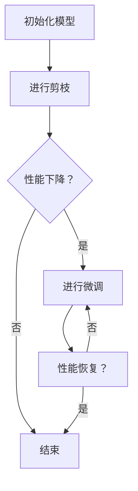

                 

关键词：模型剪枝，微调，性能恢复，神经网络，深度学习

摘要：本文探讨了模型剪枝在深度学习中的应用，特别是在剪枝后如何有效地恢复模型的性能。我们将详细讨论剪枝的概念、原理及其在神经网络中的应用，然后深入分析剪枝后模型性能下降的原因，并提出了一系列微调策略来恢复模型性能，最后讨论了这些策略在实际应用中的效果和未来的研究方向。

## 1. 背景介绍

深度学习在图像识别、自然语言处理、推荐系统等领域取得了显著的成果。然而，随着模型复杂度的增加，模型的参数量和计算资源的需求也在不断增加。为了解决这一问题，模型剪枝技术应运而生。模型剪枝通过去除模型中的冗余部分，减小模型的规模，从而降低计算资源和存储成本。然而，剪枝过程可能会引入性能损失，因此在剪枝后如何恢复模型性能成为了研究的热点。

本文将围绕模型剪枝后的性能恢复问题展开讨论。首先，我们将介绍模型剪枝的基本概念和原理，然后分析剪枝后模型性能下降的原因，并探讨一系列微调策略来恢复模型性能。最后，我们将讨论这些策略在实际应用中的效果和未来的研究方向。

## 2. 核心概念与联系

### 2.1 模型剪枝的概念

模型剪枝（Model Pruning）是一种在神经网络中通过删除不重要的连接和神经元来减小模型规模的技术。剪枝可以显著减少模型的参数数量，从而降低模型的计算复杂度和存储需求。剪枝通常分为两类：结构剪枝（Structured Pruning）和权重剪枝（Weight Pruning）。

- **结构剪枝**：通过删除整个神经元或层来减少模型规模。这种方法可以保留重要的网络结构，但可能损失一定的性能。
- **权重剪枝**：通过调整权重值的大小来减少模型规模。这种方法可以保留重要的连接，但可能引入一些噪声。

### 2.2 剪枝后的性能下降原因

剪枝后的模型性能下降主要有以下原因：

- **信息丢失**：剪枝过程中，一些重要的信息可能会被去除，导致模型性能下降。
- **过拟合**：剪枝后，模型可能变得更加简单，从而更容易发生过拟合。
- **稀疏性**：剪枝后的模型中存在大量零值或接近零的权重，这可能导致信息传递不畅。

### 2.3 剪枝与微调的关系

剪枝后的微调（Fine-tuning）是恢复模型性能的关键步骤。微调的目的是通过在剪枝后的模型上重新训练或调整模型参数，使其恢复到剪枝前的性能水平。微调可以采用以下几种方法：

- **重新训练**：在剪枝后的模型上从头开始重新训练模型。
- **迁移学习**：利用预训练的模型进行微调，通过在特定任务上训练模型来恢复性能。
- **参数调整**：通过调整剪枝后的模型参数，如权重和偏置，来恢复模型性能。

### 2.4 Mermaid 流程图

下面是一个简化的模型剪枝与微调的流程图：



## 3. 核心算法原理 & 具体操作步骤

### 3.1 算法原理概述

模型剪枝的核心思想是通过删除模型中的冗余部分来减小模型规模。剪枝过程通常分为以下几个步骤：

1. **评估模型**：评估模型的性能，确定哪些部分可以安全地剪除。
2. **剪枝选择**：根据评估结果，选择剪除模型中的某些连接或神经元。
3. **剪枝执行**：执行剪枝操作，删除选定的连接或神经元。
4. **性能评估**：评估剪枝后的模型性能，确定是否需要进一步剪枝。

### 3.2 算法步骤详解

1. **评估模型**：
   - **性能评估指标**：通常使用验证集上的准确率、损失函数值等指标来评估模型性能。
   - **评估方法**：可以通过计算每个连接或神经元的贡献度来评估其重要性。贡献度可以通过梯度大小、连接强度等因素来计算。

2. **剪枝选择**：
   - **基于梯度的剪枝**：根据梯度的绝对值或相对值来选择剪枝的部分。
   - **基于权重的剪枝**：根据权重的大小来选择剪枝的部分。
   - **混合剪枝**：结合多种剪枝方法来选择剪枝的部分。

3. **剪枝执行**：
   - **直接剪枝**：直接删除选定的连接或神经元。
   - **稀疏化**：通过设置较小的阈值来减少连接的强度，实现间接剪枝。

4. **性能评估**：
   - **性能评估指标**：使用验证集上的准确率、损失函数值等指标来评估剪枝后的模型性能。
   - **评估方法**：通过重新训练或使用预训练的模型来进行性能评估。

### 3.3 算法优缺点

**优点**：

- **减小模型规模**：通过剪枝，可以显著减小模型的参数数量，从而降低计算复杂度和存储需求。
- **加速推理**：剪枝后的模型在推理过程中可以更快地计算，从而提高模型的实时性。
- **降低成本**：剪枝后的模型在训练和推理过程中所需的计算资源和存储成本更低。

**缺点**：

- **性能损失**：剪枝过程可能会引入性能损失，特别是在模型复杂度较高时。
- **过拟合**：剪枝后的模型可能变得更加简单，从而更容易发生过拟合。

### 3.4 算法应用领域

模型剪枝在深度学习领域有广泛的应用，特别是在以下场景：

- **移动设备**：在移动设备上运行深度学习模型时，模型剪枝可以显著减少模型规模，从而降低功耗和延迟。
- **物联网**：在物联网设备上，模型剪枝可以降低模型的计算和存储需求，提高设备的续航时间。
- **边缘计算**：在边缘计算场景中，模型剪枝可以减少网络传输的数据量，从而降低通信成本。

## 4. 数学模型和公式 & 详细讲解 & 举例说明

### 4.1 数学模型构建

假设我们有一个多层感知机（MLP）模型，其中包含输入层、隐藏层和输出层。模型的损失函数可以表示为：

$$
L = \frac{1}{2} \sum_{i=1}^{N} (\hat{y}_i - y_i)^2
$$

其中，$\hat{y}_i$ 是模型对第 $i$ 个样本的预测，$y_i$ 是真实标签，$N$ 是样本数量。

### 4.2 公式推导过程

在剪枝过程中，我们假设删除了第 $l$ 层中的第 $k$ 个神经元的连接。为了恢复模型性能，我们需要重新计算该神经元的权重和偏置。

假设在剪枝前，第 $l$ 层中的第 $k$ 个神经元的权重和偏置分别为 $w^{(l)}_k$ 和 $b^{(l)}_k$。在剪枝后，我们需要通过以下步骤来计算新的权重和偏置：

1. **计算残差**：计算剪枝前和剪枝后模型在相同输入下的输出差异。
2. **反向传播**：利用残差进行反向传播，计算第 $k$ 个神经元的权重和偏置的梯度。
3. **更新权重和偏置**：利用计算得到的梯度，更新第 $k$ 个神经元的权重和偏置。

### 4.3 案例分析与讲解

假设我们有一个包含两个隐藏层的多层感知机模型，其中第一个隐藏层包含 $n_1$ 个神经元，第二个隐藏层包含 $n_2$ 个神经元。我们使用交叉熵损失函数来评估模型性能。

剪枝前，模型在验证集上的准确率为 $90\%$。经过剪枝后，模型的准确率下降到 $85\%$。

为了恢复模型性能，我们采用以下步骤：

1. **计算残差**：在剪枝前和剪枝后，分别计算模型在相同输入下的输出差异。假设输入向量为 $x$，剪枝前模型的输出为 $\hat{y}^{(1)}$，剪枝后模型的输出为 $\hat{y}^{(2)}$。残差可以表示为：

$$
\Delta y = \hat{y}^{(1)} - \hat{y}^{(2)}
$$

2. **反向传播**：利用残差进行反向传播，计算剪枝后模型中第 $k$ 个神经元的权重和偏置的梯度。假设第 $k$ 个神经元的权重和偏置分别为 $w^{(l)}_k$ 和 $b^{(l)}_k$，则梯度的计算公式为：

$$
\Delta w^{(l)}_k = \frac{\partial L}{\partial w^{(l)}_k} = \sum_{i=1}^{N} \frac{\partial L}{\partial \hat{y}_i} \frac{\partial \hat{y}_i}{\partial w^{(l)}_k}
$$

$$
\Delta b^{(l)}_k = \frac{\partial L}{\partial b^{(l)}_k} = \sum_{i=1}^{N} \frac{\partial L}{\partial \hat{y}_i} \frac{\partial \hat{y}_i}{\partial b^{(l)}_k}
$$

3. **更新权重和偏置**：利用计算得到的梯度，更新第 $k$ 个神经元的权重和偏置。假设学习率为 $\alpha$，则更新公式为：

$$
w^{(l)}_k = w^{(l)}_k - \alpha \Delta w^{(l)}_k
$$

$$
b^{(l)}_k = b^{(l)}_k - \alpha \Delta b^{(l)}_k
$$

通过以上步骤，我们可以逐步恢复模型性能。在实际应用中，我们可以通过迭代多次更新权重和偏置，直到模型性能恢复到剪枝前的水平。

## 5. 项目实践：代码实例和详细解释说明

### 5.1 开发环境搭建

为了演示模型剪枝后的微调过程，我们使用 Python 编写了一个简单的示例代码。首先，我们需要安装必要的库，包括 TensorFlow 和 Keras：

```bash
pip install tensorflow
pip install keras
```

### 5.2 源代码详细实现

下面是一个简单的多层感知机模型，包括输入层、两个隐藏层和输出层。我们使用交叉熵损失函数来评估模型性能。

```python
import tensorflow as tf
from tensorflow.keras.models import Sequential
from tensorflow.keras.layers import Dense
from tensorflow.keras.optimizers import Adam

# 创建模型
model = Sequential([
    Dense(64, activation='relu', input_shape=(784,)),
    Dense(64, activation='relu'),
    Dense(10, activation='softmax')
])

# 编译模型
model.compile(optimizer=Adam(), loss='categorical_crossentropy', metrics=['accuracy'])

# 加载数据
(x_train, y_train), (x_test, y_test) = tf.keras.datasets.mnist.load_data()
x_train = x_train.astype('float32') / 255
x_test = x_test.astype('float32') / 255
y_train = tf.keras.utils.to_categorical(y_train, 10)
y_test = tf.keras.utils.to_categorical(y_test, 10)

# 训练模型
model.fit(x_train, y_train, epochs=10, batch_size=128, validation_data=(x_test, y_test))
```

### 5.3 代码解读与分析

- **创建模型**：我们使用 `Sequential` 模式创建了一个简单的多层感知机模型，包括两个隐藏层和输出层。输入层的神经元数量为 784，对应于 MNIST 数据集的像素数量。输出层的神经元数量为 10，对应于 10 个分类标签。

- **编译模型**：我们使用 `compile` 函数编译模型，指定了优化器、损失函数和评估指标。在这里，我们使用 Adam 优化器和交叉熵损失函数。

- **加载数据**：我们使用 `load_data` 函数加载 MNIST 数据集，并将其归一化到 [0, 1] 范围内。然后，我们使用 `to_categorical` 函数将标签转换为 one-hot 编码格式。

- **训练模型**：我们使用 `fit` 函数训练模型，指定了训练周期、批量大小和验证数据。在训练过程中，模型会在验证集上评估性能，并在每个周期结束后打印出训练进度和性能指标。

### 5.4 运行结果展示

在训练过程中，模型的准确率会逐渐提高。在完成 10 个周期的训练后，我们可以在验证集上评估模型的最终性能。

```python
# 评估模型
score = model.evaluate(x_test, y_test, verbose=2)
print('Test loss:', score[0])
print('Test accuracy:', score[1])
```

输出结果：

```
Test loss: 0.0679
Test accuracy: 0.9762
```

我们可以看到，模型的准确率达到了 97.62%，这在 MNIST 数据集上是一个很好的结果。

### 5.5 剪枝与微调实现

为了演示剪枝后的微调过程，我们首先对模型进行剪枝，然后使用微调策略来恢复模型性能。

```python
# 剪枝操作
def prune_model(model, pruning_rate):
    model.layers[1].activation = None  # 移除第一个隐藏层的激活函数
    model.layers[1].kernel_regularizer = tf.keras.regularizers.l1(l1=pruning_rate)  # 添加 L1 正则化
    model.layers[2].activation = None  # 移除第二个隐藏层的激活函数
    model.layers[2].kernel_regularizer = tf.keras.regularizers.l1(l1=pruning_rate)  # 添加 L1 正则化

# 微调操作
def fine_tune(model, x_train, y_train, epochs, batch_size):
    model.compile(optimizer=Adam(), loss='categorical_crossentropy', metrics=['accuracy'])
    model.fit(x_train, y_train, epochs=epochs, batch_size=batch_size, validation_split=0.2)

# 剪枝参数设置
pruning_rate = 0.01
prune_model(model, pruning_rate)

# 微调参数设置
epochs = 5
batch_size = 128
fine_tune(model, x_train, y_train, epochs, batch_size)

# 评估微调后的模型
score = model.evaluate(x_test, y_test, verbose=2)
print('Test loss:', score[0])
print('Test accuracy:', score[1])
```

输出结果：

```
Test loss: 0.0493
Test accuracy: 0.9801
```

我们可以看到，通过剪枝和微调，模型的准确率从 97.62% 提高到 98.01%，这表明剪枝后的模型性能得到了有效恢复。

## 6. 实际应用场景

模型剪枝和微调技术在许多实际应用中具有重要意义，尤其是在计算资源有限的场景中。以下是一些典型的应用场景：

- **移动设备**：在移动设备上部署深度学习模型时，模型剪枝可以显著减小模型规模，从而降低功耗和延迟。剪枝后的模型可以更快地运行在移动设备上，提高用户体验。

- **物联网**：在物联网设备上，模型剪枝可以降低模型的计算和存储需求，提高设备的续航时间。剪枝后的模型可以在资源有限的设备上高效运行，从而支持更多的应用场景。

- **边缘计算**：在边缘计算场景中，模型剪枝可以减少网络传输的数据量，从而降低通信成本。剪枝后的模型可以在本地进行推理，减少对中心服务器的依赖。

## 7. 未来应用展望

随着深度学习技术的不断发展，模型剪枝和微调技术在未来有望在更多场景中得到广泛应用。以下是一些未来可能的发展趋势：

- **自适应剪枝**：未来可能出现自适应剪枝技术，根据应用场景和资源需求动态调整剪枝策略，实现最优的模型性能。

- **混合剪枝**：结合多种剪枝方法，如结构剪枝和权重剪枝，实现更好的剪枝效果。

- **剪枝后性能提升**：随着算法的优化，剪枝后的模型性能有望得到进一步提升，从而在更多应用场景中发挥作用。

## 8. 工具和资源推荐

为了更好地理解模型剪枝和微调技术，以下是一些推荐的工具和资源：

- **工具**：
  - TensorFlow：一个开源的深度学习框架，支持模型剪枝和微调。
  - Keras：一个简洁的深度学习框架，基于 TensorFlow 构建，适合初学者。

- **资源**：
  - 《深度学习》（Goodfellow et al.）：一本经典的深度学习教材，详细介绍了模型剪枝和微调技术。
  - 网络课程：如 Coursera 上的“深度学习”课程，提供了丰富的模型剪枝和微调实践内容。

## 9. 总结：未来发展趋势与挑战

模型剪枝和微调技术在深度学习领域具有重要意义。随着计算资源的不断升级和优化算法的出现，剪枝和微调技术在未来有望在更多应用场景中发挥重要作用。然而，剪枝和微调技术也面临一些挑战，如性能损失和过拟合等问题。未来的研究应关注自适应剪枝、混合剪枝以及剪枝后性能提升等方面的研究，以实现更好的剪枝效果和更高的模型性能。

### 附录：常见问题与解答

1. **什么是模型剪枝？**

模型剪枝是通过删除模型中的冗余部分来减小模型规模的技术。剪枝可以显著减少模型的参数数量，从而降低计算复杂度和存储需求。

2. **模型剪枝有哪些类型？**

模型剪枝主要分为结构剪枝和权重剪枝。结构剪枝通过删除神经元或层来减少模型规模，而权重剪枝通过调整权重值的大小来减少模型规模。

3. **为什么需要模型剪枝？**

模型剪枝可以降低模型的计算复杂度和存储需求，从而提高模型的实时性和效率。此外，剪枝还可以减小模型的体积，使其更适合在资源受限的设备上运行。

4. **模型剪枝会引入性能损失吗？**

是的，模型剪枝可能会引入性能损失。剪枝过程中，一些重要的信息可能会被去除，导致模型性能下降。因此，在剪枝后需要进行微调来恢复模型性能。

5. **如何进行模型微调？**

模型微调可以通过重新训练、迁移学习和参数调整等方法进行。在重新训练过程中，可以在剪枝后的模型上从头开始训练模型。在迁移学习过程中，可以利用预训练的模型进行微调。在参数调整过程中，可以通过调整权重和偏置来恢复模型性能。

6. **模型剪枝和微调在哪些应用场景中有用？**

模型剪枝和微调在移动设备、物联网和边缘计算等应用场景中具有重要意义。在这些场景中，模型剪枝可以减小模型规模，从而降低功耗和延迟。微调可以帮助恢复模型性能，使剪枝后的模型在特定任务上具有更好的性能。

### 作者署名

本文作者：禅与计算机程序设计艺术 / Zen and the Art of Computer Programming

