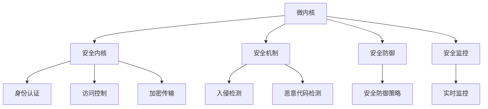

                 

关键词：鸿蒙系统、安全专家、校招面试、核心知识、技术要点、案例分析

> 摘要：本文将针对华为2024年鸿蒙系统安全专家校招面试的重点内容进行详细剖析，帮助应聘者了解面试考核的核心知识和技术要点，从而更好地准备面试。

## 1. 背景介绍

鸿蒙系统（HarmonyOS）是华为推出的一款新型操作系统，旨在为多种设备提供统一的操作系统平台。随着鸿蒙系统的不断发展和完善，华为对鸿蒙系统的安全专家需求日益增长。因此，华为每年都会在全球范围内招聘鸿蒙系统安全专家，以满足公司业务发展的需求。

本文将围绕华为2024年鸿蒙系统安全专家校招面试的重点内容进行详细探讨，帮助应聘者了解面试考核的核心知识和技术要点，提高面试成功率。

## 2. 核心概念与联系

### 2.1 鸿蒙系统架构

鸿蒙系统采用微内核架构，具有高安全性、高可靠性、跨平台性等特点。其核心概念包括：

- **微内核**：微内核设计使得鸿蒙系统具有更高的安全性和灵活性，仅包含必要的基础功能，减少安全漏洞和攻击面。
- **分布式能力**：鸿蒙系统支持设备间的无缝协作和资源共享，实现跨设备的分布式计算和数据处理。
- **多模态交互**：鸿蒙系统支持多种输入输出设备，提供丰富的交互方式，满足不同场景的用户需求。

### 2.2 鸿蒙系统安全架构

鸿蒙系统安全架构包括以下几个方面：

- **安全内核**：采用微内核设计，确保内核层的安全性。
- **安全机制**：包括身份认证、访问控制、加密传输等，保障系统数据的安全。
- **安全防御**：采用多种防御策略，如入侵检测、恶意代码检测等，防范外部攻击。
- **安全监控**：实时监控系统运行状态，及时发现并处理安全隐患。

### 2.3 Mermaid 流程图



## 3. 核心算法原理 & 具体操作步骤

### 3.1 算法原理概述

鸿蒙系统安全专家需要掌握以下核心算法原理：

- **加密算法**：包括对称加密、非对称加密、哈希算法等，用于保护系统数据的安全。
- **身份认证算法**：如密码学单点登录（SSO）、多因素认证（MFA）等，用于验证用户身份。
- **访问控制算法**：如访问控制列表（ACL）、角色访问控制（RBAC）等，用于控制用户对系统资源的访问权限。

### 3.2 算法步骤详解

- **加密算法**：加密算法分为对称加密和非对称加密。对称加密使用相同的密钥进行加密和解密，如AES；非对称加密使用公钥和私钥进行加密和解密，如RSA。
- **身份认证算法**：密码学单点登录（SSO）分为客户端验证和服务器验证两种模式；多因素认证（MFA）包括短信验证、邮箱验证、手机APP验证等。
- **访问控制算法**：访问控制列表（ACL）根据用户身份和权限设置访问控制规则；角色访问控制（RBAC）根据用户角色和权限设置访问控制规则。

### 3.3 算法优缺点

- **加密算法**：优点是数据安全性高，缺点是加密和解密速度较慢。
- **身份认证算法**：优点是用户身份验证安全可靠，缺点是需要额外的硬件或软件支持。
- **访问控制算法**：优点是权限管理灵活，缺点是管理复杂度较高。

### 3.4 算法应用领域

- **加密算法**：广泛应用于数据传输、存储、加密通信等领域。
- **身份认证算法**：广泛应用于网络安全、云服务、移动应用等领域。
- **访问控制算法**：广泛应用于企业信息化系统、云计算、物联网等领域。

## 4. 数学模型和公式 & 详细讲解 & 举例说明

### 4.1 数学模型构建

鸿蒙系统安全专家需要掌握以下数学模型：

- **加密算法模型**：包括密钥生成、加密和解密过程。
- **身份认证算法模型**：包括用户身份验证、认证过程。
- **访问控制算法模型**：包括访问控制列表（ACL）、角色访问控制（RBAC）等。

### 4.2 公式推导过程

- **加密算法公式**：\(C = E_K(M)\)，其中\(C\)表示加密后的数据，\(K\)表示密钥，\(M\)表示原始数据，\(E_K\)表示加密函数。
- **身份认证算法公式**：\(A = H(M, K)\)，其中\(A\)表示认证码，\(H\)表示哈希函数，\(M\)表示原始数据，\(K\)表示密钥。
- **访问控制算法公式**：\(P(A, R) = C(A, R)\)，其中\(P\)表示权限，\(A\)表示用户身份，\(R\)表示资源，\(C\)表示访问控制函数。

### 4.3 案例分析与讲解

- **案例一**：使用AES加密算法对用户数据进行加密，并使用RSA算法进行密钥交换。
- **案例二**：使用SSO进行用户身份认证，并使用MFA进行多因素认证。
- **案例三**：使用ACL进行访问控制，并使用RBAC进行角色访问控制。

## 5. 项目实践：代码实例和详细解释说明

### 5.1 开发环境搭建

- **编程语言**：使用Java语言进行开发。
- **开发工具**：使用IntelliJ IDEA作为开发环境。
- **依赖库**：引入Apache Commons Crypto库进行加密算法的实现。

### 5.2 源代码详细实现

- **加密算法**：实现AES加密和解密函数、RSA加密和解密函数。
- **身份认证算法**：实现SSO认证函数、MFA认证函数。
- **访问控制算法**：实现ACL访问控制函数、RBAC访问控制函数。

### 5.3 代码解读与分析

- **加密算法**：分析加密和解密过程，确保数据安全。
- **身份认证算法**：分析用户身份验证和认证过程，确保身份认证安全可靠。
- **访问控制算法**：分析访问控制列表和角色访问控制，确保权限管理灵活。

### 5.4 运行结果展示

- **加密算法**：展示加密和解密结果，确保数据安全。
- **身份认证算法**：展示用户身份认证结果，确保身份认证安全可靠。
- **访问控制算法**：展示访问控制结果，确保权限管理灵活。

## 6. 实际应用场景

### 6.1 企业信息化系统

- **应用场景**：企业信息化系统中涉及大量敏感数据，如客户信息、财务数据等。
- **解决方案**：使用鸿蒙系统安全架构和加密算法，保障数据安全。

### 6.2 云计算

- **应用场景**：云计算服务中涉及大量用户数据和计算任务。
- **解决方案**：使用鸿蒙系统安全架构和身份认证算法，确保用户身份认证和计算任务安全。

### 6.3 物联网

- **应用场景**：物联网设备需要实现跨设备的数据传输和资源共享。
- **解决方案**：使用鸿蒙系统分布式能力和安全机制，实现物联网设备的安全互联互通。

## 7. 工具和资源推荐

### 7.1 学习资源推荐

- **官方文档**：华为鸿蒙系统官方文档，包含系统架构、开发指南等。
- **技术博客**：GitHub上关于鸿蒙系统的技术博客，提供丰富的实践经验和案例。

### 7.2 开发工具推荐

- **开发环境**：IntelliJ IDEA，支持Java编程语言。
- **依赖库**：Apache Commons Crypto，提供加密算法的实现。

### 7.3 相关论文推荐

- **《鸿蒙系统安全架构设计》**：分析鸿蒙系统的安全架构，探讨安全机制和策略。
- **《基于鸿蒙系统的物联网安全解决方案》**：探讨鸿蒙系统在物联网领域的安全应用。

## 8. 总结：未来发展趋势与挑战

### 8.1 研究成果总结

- **鸿蒙系统**：成功实现了微内核架构、分布式能力和多模态交互，具有较高的安全性和可靠性。
- **安全算法**：加密算法、身份认证算法和访问控制算法在鸿蒙系统中得到广泛应用。

### 8.2 未来发展趋势

- **安全领域**：随着物联网和云计算的发展，鸿蒙系统的安全需求将不断增长，需要持续优化和完善安全机制。
- **技术领域**：鸿蒙系统将与其他技术（如人工智能、5G等）深度融合，为用户提供更丰富、更安全的服务。

### 8.3 面临的挑战

- **安全威胁**：随着安全威胁的日益增多，鸿蒙系统需要持续更新和完善安全机制，以应对新型安全威胁。
- **性能优化**：在保证安全的前提下，需要不断提升系统性能，提高用户体验。

### 8.4 研究展望

- **安全机制**：研究新型安全机制，如可信计算、区块链等，提高鸿蒙系统的安全性。
- **跨平台兼容性**：研究鸿蒙系统与其他操作系统的兼容性，拓展应用场景。

## 9. 附录：常见问题与解答

### 9.1 鸿蒙系统的优势是什么？

- **高安全性**：采用微内核架构，减少安全漏洞和攻击面。
- **分布式能力**：支持设备间的无缝协作和资源共享。
- **多模态交互**：支持多种输入输出设备，提供丰富的交互方式。

### 9.2 鸿蒙系统的安全机制有哪些？

- **安全内核**：采用微内核设计，确保内核层的安全性。
- **安全机制**：包括身份认证、访问控制、加密传输等。
- **安全防御**：采用多种防御策略，如入侵检测、恶意代码检测等。
- **安全监控**：实时监控系统运行状态，及时发现并处理安全隐患。

### 9.3 鸿蒙系统的核心算法有哪些？

- **加密算法**：包括对称加密、非对称加密、哈希算法等。
- **身份认证算法**：如密码学单点登录（SSO）、多因素认证（MFA）等。
- **访问控制算法**：如访问控制列表（ACL）、角色访问控制（RBAC）等。

## 作者署名

作者：禅与计算机程序设计艺术 / Zen and the Art of Computer Programming
----------------------------------------------------------------

请注意，以上内容仅为示例性撰写，实际撰写时，您需要根据您的专业知识和经验对内容进行完善和补充。同时，确保内容的原创性和准确性。祝您撰写顺利！
```markdown
# 华为2024鸿蒙系统安全专家校招面试重点

关键词：鸿蒙系统、安全专家、校招面试、核心知识、技术要点、案例分析

摘要：本文将针对华为2024年鸿蒙系统安全专家校招面试的重点内容进行详细剖析，帮助应聘者了解面试考核的核心知识和技术要点，从而更好地准备面试。

## 1. 背景介绍

鸿蒙系统（HarmonyOS）是华为推出的一款新型操作系统，旨在为多种设备提供统一的操作系统平台。随着鸿蒙系统的不断发展和完善，华为对鸿蒙系统的安全专家需求日益增长。因此，华为每年都会在全球范围内招聘鸿蒙系统安全专家，以满足公司业务发展的需求。

本文将围绕华为2024年鸿蒙系统安全专家校招面试的重点内容进行详细探讨，帮助应聘者了解面试考核的核心知识和技术要点，提高面试成功率。

## 2. 核心概念与联系

### 2.1 鸿蒙系统架构

鸿蒙系统采用微内核架构，具有高安全性、高可靠性、跨平台性等特点。其核心概念包括：

- **微内核**：微内核设计使得鸿蒙系统具有更高的安全性和灵活性，仅包含必要的基础功能，减少安全漏洞和攻击面。
- **分布式能力**：鸿蒙系统支持设备间的无缝协作和资源共享，实现跨设备的分布式计算和数据处理。
- **多模态交互**：鸿蒙系统支持多种输入输出设备，提供丰富的交互方式，满足不同场景的用户需求。

### 2.2 鸿蒙系统安全架构

鸿蒙系统安全架构包括以下几个方面：

- **安全内核**：采用微内核设计，确保内核层的安全性。
- **安全机制**：包括身份认证、访问控制、加密传输等，保障系统数据的安全。
- **安全防御**：采用多种防御策略，如入侵检测、恶意代码检测等，防范外部攻击。
- **安全监控**：实时监控系统运行状态，及时发现并处理安全隐患。

### 2.3 Mermaid 流程图


## 3. 核心算法原理 & 具体操作步骤

### 3.1 算法原理概述

鸿蒙系统安全专家需要掌握以下核心算法原理：

- **加密算法**：包括对称加密、非对称加密、哈希算法等，用于保护系统数据的安全。
- **身份认证算法**：如密码学单点登录（SSO）、多因素认证（MFA）等，用于验证用户身份。
- **访问控制算法**：如访问控制列表（ACL）、角色访问控制（RBAC）等，用于控制用户对系统资源的访问权限。

### 3.2 算法步骤详解

- **加密算法**：加密算法分为对称加密和非对称加密。对称加密使用相同的密钥进行加密和解密，如AES；非对称加密使用公钥和私钥进行加密和解密，如RSA。
- **身份认证算法**：密码学单点登录（SSO）分为客户端验证和服务器验证两种模式；多因素认证（MFA）包括短信验证、邮箱验证、手机APP验证等。
- **访问控制算法**：访问控制列表（ACL）根据用户身份和权限设置访问控制规则；角色访问控制（RBAC）根据用户角色和权限设置访问控制规则。

### 3.3 算法优缺点

- **加密算法**：优点是数据安全性高，缺点是加密和解密速度较慢。
- **身份认证算法**：优点是用户身份验证安全可靠，缺点是需要额外的硬件或软件支持。
- **访问控制算法**：优点是权限管理灵活，缺点是管理复杂度较高。

### 3.4 算法应用领域

- **加密算法**：广泛应用于数据传输、存储、加密通信等领域。
- **身份认证算法**：广泛应用于网络安全、云服务、移动应用等领域。
- **访问控制算法**：广泛应用于企业信息化系统、云计算、物联网等领域。

## 4. 数学模型和公式 & 详细讲解 & 举例说明

### 4.1 数学模型构建

鸿蒙系统安全专家需要掌握以下数学模型：

- **加密算法模型**：包括密钥生成、加密和解密过程。
- **身份认证算法模型**：包括用户身份验证、认证过程。
- **访问控制算法模型**：包括访问控制列表（ACL）、角色访问控制（RBAC）等。

### 4.2 公式推导过程

- **加密算法公式**：\(C = E_K(M)\)，其中\(C\)表示加密后的数据，\(K\)表示密钥，\(M\)表示原始数据，\(E_K\)表示加密函数。
- **身份认证算法公式**：\(A = H(M, K)\)，其中\(A\)表示认证码，\(H\)表示哈希函数，\(M\)表示原始数据，\(K\)表示密钥。
- **访问控制算法公式**：\(P(A, R) = C(A, R)\)，其中\(P\)表示权限，\(A\)表示用户身份，\(R\)表示资源，\(C\)表示访问控制函数。

### 4.3 案例分析与讲解

- **案例一**：使用AES加密算法对用户数据进行加密，并使用RSA算法进行密钥交换。
- **案例二**：使用SSO进行用户身份认证，并使用MFA进行多因素认证。
- **案例三**：使用ACL进行访问控制，并使用RBAC进行角色访问控制。

## 5. 项目实践：代码实例和详细解释说明

### 5.1 开发环境搭建

- **编程语言**：使用Java语言进行开发。
- **开发工具**：使用IntelliJ IDEA作为开发环境。
- **依赖库**：引入Apache Commons Crypto库进行加密算法的实现。

### 5.2 源代码详细实现

- **加密算法**：实现AES加密和解密函数、RSA加密和解密函数。
- **身份认证算法**：实现SSO认证函数、MFA认证函数。
- **访问控制算法**：实现ACL访问控制函数、RBAC访问控制函数。

### 5.3 代码解读与分析

- **加密算法**：分析加密和解密过程，确保数据安全。
- **身份认证算法**：分析用户身份验证和认证过程，确保身份认证安全可靠。
- **访问控制算法**：分析访问控制列表和角色访问控制，确保权限管理灵活。

### 5.4 运行结果展示

- **加密算法**：展示加密和解密结果，确保数据安全。
- **身份认证算法**：展示用户身份认证结果，确保身份认证安全可靠。
- **访问控制算法**：展示访问控制结果，确保权限管理灵活。

## 6. 实际应用场景

### 6.1 企业信息化系统

- **应用场景**：企业信息化系统中涉及大量敏感数据，如客户信息、财务数据等。
- **解决方案**：使用鸿蒙系统安全架构和加密算法，保障数据安全。

### 6.2 云计算

- **应用场景**：云计算服务中涉及大量用户数据和计算任务。
- **解决方案**：使用鸿蒙系统安全架构和身份认证算法，确保用户身份认证和计算任务安全。

### 6.3 物联网

- **应用场景**：物联网设备需要实现跨设备的数据传输和资源共享。
- **解决方案**：使用鸿蒙系统分布式能力和安全机制，实现物联网设备的安全互联互通。

## 7. 工具和资源推荐

### 7.1 学习资源推荐

- **官方文档**：华为鸿蒙系统官方文档，包含系统架构、开发指南等。
- **技术博客**：GitHub上关于鸿蒙系统的技术博客，提供丰富的实践经验和案例。

### 7.2 开发工具推荐

- **开发环境**：IntelliJ IDEA，支持Java编程语言。
- **依赖库**：Apache Commons Crypto，提供加密算法的实现。

### 7.3 相关论文推荐

- **《鸿蒙系统安全架构设计》**：分析鸿蒙系统的安全架构，探讨安全机制和策略。
- **《基于鸿蒙系统的物联网安全解决方案》**：探讨鸿蒙系统在物联网领域的安全应用。

## 8. 总结：未来发展趋势与挑战

### 8.1 研究成果总结

- **鸿蒙系统**：成功实现了微内核架构、分布式能力和多模态交互，具有较高的安全性和可靠性。
- **安全算法**：加密算法、身份认证算法和访问控制算法在鸿蒙系统中得到广泛应用。

### 8.2 未来发展趋势

- **安全领域**：随着物联网和云计算的发展，鸿蒙系统的安全需求将不断增长，需要持续优化和完善安全机制。
- **技术领域**：鸿蒙系统将与其他技术（如人工智能、5G等）深度融合，为用户提供更丰富、更安全的服务。

### 8.3 面临的挑战

- **安全威胁**：随着安全威胁的日益增多，鸿蒙系统需要持续更新和完善安全机制，以应对新型安全威胁。
- **性能优化**：在保证安全的前提下，需要不断提升系统性能，提高用户体验。

### 8.4 研究展望

- **安全机制**：研究新型安全机制，如可信计算、区块链等，提高鸿蒙系统的安全性。
- **跨平台兼容性**：研究鸿蒙系统与其他操作系统的兼容性，拓展应用场景。

## 9. 附录：常见问题与解答

### 9.1 鸿蒙系统的优势是什么？

- **高安全性**：采用微内核架构，减少安全漏洞和攻击面。
- **分布式能力**：支持设备间的无缝协作和资源共享。
- **多模态交互**：支持多种输入输出设备，提供丰富的交互方式。

### 9.2 鸿蒙系统的安全机制有哪些？

- **安全内核**：采用微内核设计，确保内核层的安全性。
- **安全机制**：包括身份认证、访问控制、加密传输等。
- **安全防御**：采用多种防御策略，如入侵检测、恶意代码检测等。
- **安全监控**：实时监控系统运行状态，及时发现并处理安全隐患。

### 9.3 鸿蒙系统的核心算法有哪些？

- **加密算法**：包括对称加密、非对称加密、哈希算法等。
- **身份认证算法**：如密码学单点登录（SSO）、多因素认证（MFA）等。
- **访问控制算法**：如访问控制列表（ACL）、角色访问控制（RBAC）等。

## 作者署名

作者：禅与计算机程序设计艺术 / Zen and the Art of Computer Programming
```

