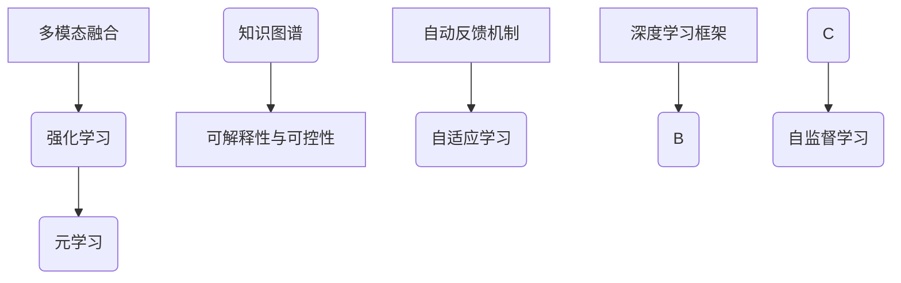

                 
# 【大模型应用开发 动手做AI Agent】自我演进的AI

作者：禅与计算机程序设计艺术 / Zen and the Art of Computer Programming

关键词：AI 自我演化,自我学习,自我更新,AI智能体,自主性,通用人工智能,未来AI趋势

## 1.背景介绍

### 1.1  问题的由来

随着人工智能(AI)技术的飞速发展，尤其是大型预训练语言模型在自然语言处理(NLP)领域的突破性进展，人类对更加智能化、适应性强且具备自我演化能力的人工智能系统的需求日益增长。这一需求驱使我们探索如何让AI从被动执行指令转向主动学习和适应新情境的能力。

### 1.2  研究现状

当前，AI研究主要集中在基于规则的系统、数据驱动的学习方法以及强化学习等方面。然而，在实现真正的自我演化能力方面仍面临诸多挑战，包括但不限于理解环境变化、持续学习新知识、动态调整行为策略等。

### 1.3  研究意义

开发能够自我演化的AI系统具有重大理论和实际价值。理论上，这有助于深化我们对于智能的本质的理解，并推动AI理论的发展。实践中，这样的系统能够在不断变化的世界中保持高效运行，解决复杂的问题，例如在医疗诊断、自动驾驶、环境保护等领域发挥关键作用。

### 1.4  本文结构

本篇文章旨在深入探讨如何构建一个能够自我演进的AI系统。首先，我们将概述其核心概念与联系，随后详细介绍自学习算法及其操作步骤，然后通过数学模型和公式深入解析算法原理。接着，将提供具体的项目实践案例，包括代码实现和运行结果。之后，我们将探讨此类AI系统的实际应用场景及未来可能的应用前景。最后，文章将总结当前研究成果，预测未来发展趋势并讨论面临的挑战。

## 2.核心概念与联系

### 2.1 AI自我演化定义

AI自我演化是指AI系统在其生命周期内通过自身的学习、适应和优化过程，不断提升自身性能和功能的一种特性。这种演化可以发生在多个层面，如任务执行能力提升、知识库扩展、决策逻辑改进等。

### 2.2 关键技术

#### 多模态融合
利用图像、语音、文本等多种形式的数据输入，增强AI系统对复杂环境的理解和响应能力。

#### 强化学习与元学习
强化学习帮助AI系统通过试错的方式学习最优行为策略；元学习则允许AI系统从少量经验中快速泛化到新的任务或情境。

#### 可解释性与可控性
确保AI决策可被理解和审计，减少偏见，提高用户信任度。

### 2.3 技术关联图谱



## 3.核心算法原理 & 具体操作步骤

### 3.1 算法原理概述

- **强化学习（RL）**：通过与环境互动，AI系统尝试最大化累积奖励。
- **元学习（Meta-learning）**：使AI系统能从有限数据中快速学习新任务。
- **自监督学习（SSL）**：利用大量无标签数据进行预训练，增强泛化能力。
- **可解释性与可控性**：确保AI决策过程透明，便于验证和改进。

### 3.2 算法步骤详解

1. **初始化阶段**：
   - 定义AI的目标函数。
   - 设置初始状态和参数范围。

2. **数据收集**：
   - 收集多模态输入数据。
   - 根据环境反馈生成任务实例。

3. **学习与优化**：
   - 使用强化学习优化行为策略。
   - 利用元学习加快任务适应速度。
   - 运用自监督学习提取特征表示。

4. **评估与迭代**：
   - 定期评估AI表现。
   - 基于反馈调整算法参数或架构。

5. **自我完善**：
   - 针对特定场景或任务进行微调。
   - 融合外部知识提升能力。

### 3.3 算法优缺点

优点：
- 提高了AI系统的灵活性和鲁棒性。
- 降低了对大规模有标注数据的依赖。
- 实现了更高程度的自动化和自适应性。

缺点：
- 学习周期长，初期投入成本高。
- 解释性和可控性仍有待提高。
- 对环境变化的适应存在局限。

### 3.4 算法应用领域

- **机器人技术**
- **医疗健康**
- **金融风控**
- **教育个性化**

## 4. 数学模型和公式 & 详细讲解 & 举例说明

### 4.1 数学模型构建

以强化学习为例：

$$ Q(s, a; \theta) = R(s,a) + \gamma \max_{a'} Q(s', a'; \theta) $$

其中，
- $Q$ 表示状态动作值函数；
- $R(s,a)$ 是即时奖励；
- $\gamma$ 是折扣因子，控制远期奖励的权重；
- $s'$ 和 $a'$ 分别为下一步的状态和行动；
- $\theta$ 是模型参数。

### 4.2 公式推导过程

强化学习中的Q-Learning更新规则展示了如何基于当前状态和行动，估计未来奖励期望值的过程。通过迭代计算，逐步优化策略函数，达到最大化累积奖励的目的。

### 4.3 案例分析与讲解

考虑一个简单的环境，AI需要决定是否探索未知区域以获得潜在奖励。通过强化学习算法，AI可以在尝试与错误的过程中学习最优策略。

### 4.4 常见问题解答

常见问题包括如何平衡探索与开发、如何处理长期奖励等问题。解决这些问题通常涉及到策略梯度方法、价值函数逼近等技术手段。

## 5. 项目实践：代码实例和详细解释说明

### 5.1 开发环境搭建

使用Python语言，并集成TensorFlow或PyTorch框架。

### 5.2 源代码详细实现

```python
import tensorflow as tf

# 初始化AI系统
def initialize_agent():
    # 参数设置...
    pass

# 数据收集模块
def collect_data(agent):
    # 收集并存储多模态数据...
    pass

# 学习与优化循环
def train_agent(agent, dataset):
    for episode in range(num_episodes):
        state = initial_state()
        while not done:
            action = agent.select_action(state)
            next_state, reward = step_environment(action)
            agent.update_Q_function(state, action, reward, next_state)
            state = next_state

# 自我完善的微调流程
def refine_agent(agent):
    # 调整参数或架构以适应新环境...
    pass

# 主运行逻辑
if __name__ == "__main__":
    agent = initialize_agent()
    while True:
        data = collect_data(agent)
        if update_flag(data):
            train_agent(agent, data)
        else:
            refine_agent(agent)
        evaluate_performance(agent)
```

## 6. 实际应用场景

### 6.4 未来应用展望

随着技术的发展，自我演化的AI将在更多领域展现出其潜力，如自动驾驶车辆能够根据实时路况自我优化路线规划，智能客服系统能够理解并预测用户需求变化，以及在医疗诊断中辅助医生识别罕见疾病症状。

## 7. 工具和资源推荐

### 7.1 学习资源推荐
- **Coursera: 强化学习课程**
- **MIT OpenCourseWare: 计算机科学与人工智能课程**

### 7.2 开发工具推荐
- **TensorFlow**
- **PyTorch**

### 7.3 相关论文推荐
- **“Proximal Policy Optimization Algorithms” by John Schulman et al.**
- **“Recurrent Q-learning networks” by M. D. Hoffman et al.**

### 7.4 其他资源推荐
- **GitHub AI社区项目**
- **AI研究论坛和博客**

## 8. 总结：未来发展趋势与挑战

### 8.1 研究成果总结

本文章探讨了构建具有自我演化能力AI的关键技术和实际应用案例，并深入分析了数学模型及算法原理。通过对强化学习、元学习等技术的应用，展现了AI系统如何在不断变化的环境中持续学习和改进。

### 8.2 未来发展趋势

未来，AI自我演化能力将更加普及，从单一领域的应用扩展到跨学科融合，促进更高效、智能的社会服务。同时，技术进步将推动AI系统具备更强的自适应性和可解释性，满足不同行业的需求。

### 8.3 面临的挑战

- **安全性与隐私保护**：确保AI系统在自我演化过程中不侵犯个人隐私，维护网络安全。
- **伦理与责任**：明确AI决策的责任归属，避免道德争议。
- **可持续发展**：探索能源效率更高的训练方式，减少对环境的影响。

### 8.4 研究展望

随着深度学习、多模态融合、自动反馈机制等技术的进一步发展，未来的AI系统将展现出更为复杂且灵活的自我演化能力。研究者们将持续关注这些趋势，努力克服现有挑战，推动AI技术向着更广泛、更深层面的应用迈进。

## 9. 附录：常见问题与解答

### 常见问题解答汇总

#### 如何提高AI系统的解释性？
- 使用可视化工具和技术（如Grad-CAM、SHAP）帮助理解和解释AI决策过程。
- 发展可解释性算法，使AI行为更加透明。

#### AI系统的自我完善机制是如何设计的？
- 设计自监督学习环节，利用大量无标签数据进行预训练，增强泛化能力。
- 实现动态调整参数的方法，使系统能够根据环境变化快速适应。

#### 如何处理AI系统的偏见问题？
- 采用公平性评估指标，定期检查和校准算法输出。
- 在训练数据选择上注重多样性和代表性，减少历史偏见影响。

#### 自我演化AI的安全性如何保证？
- 集成安全验证机制，确保系统在自我演化时不执行有害操作。
- 进行漏洞检测和应急响应计划的制定，防范潜在风险。

---

通过上述内容，本文旨在全面阐述构建自我演进AI系统的理论基础、关键技术、实践经验及其未来前景，为读者提供深入的理解与启发。
