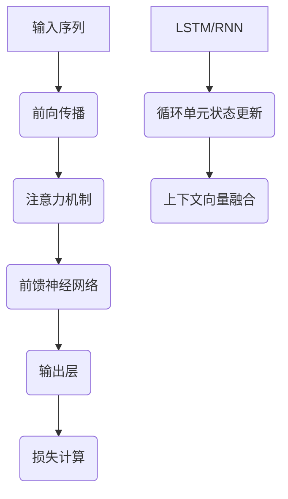

                 
# 大语言模型进阶原理与代码实战案例讲解

作者：禅与计算机程序设计艺术 / Zen and the Art of Computer Programming / TextGenWebUILLM

# 大语言模型进阶原理与代码实战案例讲解

## 1. 背景介绍

### 1.1 问题的由来

随着数据科学和人工智能的飞速发展，大语言模型作为自然语言处理（NLP）领域的核心技术之一，逐渐成为推动自然语言理解与生成能力的关键力量。这些模型在海量文本数据的基础上，通过复杂的神经网络结构，实现了对语言的深刻理解和灵活生成。然而，在实际应用中，如何最大化地利用这些模型的潜力，解决特定领域的问题，是当前研究的核心焦点。

### 1.2 研究现状

目前，大语言模型的应用涵盖了翻译、问答系统、对话管理、文本摘要、代码生成等多个方面。其中，GPT系列、通义千问、Qwen等模型因其强大的泛化能力和语言生成质量受到了广泛关注。然而，这些模型在实际部署时面临着性能优化、推理效率提升以及适应特定任务需求的挑战。

### 1.3 研究意义

深入理解大语言模型的工作机理，并掌握其进阶应用技巧对于开发更高效、更具针对性的人工智能产品至关重要。这不仅能够提升现有系统的性能，还能促进新应用的创新和发展，例如个性化信息推送、自动文档生成、智能客服等。

### 1.4 本文结构

本篇博客将围绕大语言模型的进阶原理和技术细节展开，包括核心算法、数学模型构建、实战代码示例及潜在应用探讨。旨在为开发者提供一个全面且深入的学习路径，涵盖从理论基础到实际操作的全过程。

---

## 2. 核心概念与联系

大语言模型的核心在于其参数化表示学习，通过大量的训练数据来学习语言的基本规律和上下文关联。这些模型通常基于自注意力机制的Transformer架构，具有以下关键特性：

- **多层堆叠**：通过多层编码器/解码器结构捕捉不同层级的语言特征。
- **自注意力机制**：允许模型同时关注输入序列中的多个位置，增强局部性和全局性信息融合。
- **大规模参数量**：庞大的参数规模使得模型具备高度的表达能力，但同时也带来了计算成本和过拟合风险。

大语言模型之间的相互关系主要体现在模型大小、预训练策略、微调方法等方面，这些差异影响了它们在不同任务上的表现和适用场景。

---

## 3. 核心算法原理与具体操作步骤

### 3.1 算法原理概述

大语言模型的核心算法基于概率分布预测，使用交叉熵损失函数进行训练。基本流程如下：



### 3.2 算法步骤详解

1. **初始化**：设置模型参数并随机初始化权重矩阵。
2. **前向传播**：
   - 输入序列逐词经过模型，计算每一时刻的输出概率分布。
3. **注意力机制**：通过计算每个单词与其他单词之间的相关度，决定哪些信息对当前输出更为重要。
4. **前馈神经网络**：在注意力机制后，将相关信息汇聚起来，通过一组全连接层进行非线性变换。
5. **输出层**：最终得到的向量被送入softmax层，转化为概率分布。
6. **反向传播**：根据损失函数计算梯度并调整权重，以最小化预测错误。

### 3.3 算法优缺点

优点：
- **泛化能力强**：模型可以在大量未见过的数据上表现出色。
- **灵活的上下文依赖**：通过自注意力机制有效处理长距离依赖关系。

缺点：
- **计算复杂度高**：大型模型需要大量的计算资源。
- **过拟合风险**：模型可能过度拟合训练集，导致泛化性能下降。

### 3.4 算法应用领域

大语言模型广泛应用于自然语言处理的不同子领域，如机器翻译、文本生成、情感分析、对话系统等。

---

## 4. 数学模型和公式详细讲解与举例说明

### 4.1 数学模型构建

假设我们有长度为`T`的时间序列`x = [x_0, x_1, ..., x_{T-1}]`，目标是预测下一个词`y`的概率分布。我们可以建立如下概率模型：

$$ P(y|x) = \frac{1}{Z(x)} \exp\left(\sum_{t=0}^{T-1} w_t \cdot f(x_t)\right) $$

其中，
- `w_t` 是时间`t`下的权重矢量；
- `f(x_t)` 表示第`t`个词在前一时刻的信息；
- `Z(x)` 是归一化因子，确保概率分布总和为1。

### 4.2 公式推导过程

推导过程涉及链式法则、期望值计算和对数似然函数的求解，以最小化交叉熵损失函数：

$$ L = -\mathbb{E}_{p(x,y)}[\log P(y|x)] $$

### 4.3 案例分析与讲解

以文本生成为例，假设模型已训练完成，现在想要生成一段描述性的文本：

```python
import torch
from transformers import AutoModelForCausalLM, AutoTokenizer

tokenizer = AutoTokenizer.from_pretrained("your_model_name")
model = AutoModelForCausalLM.from_pretrained("your_model_name")

input_text = "AI technology is rapidly evolving."
input_ids = tokenizer(input_text, return_tensors="pt").input_ids

generated_text = model.generate(
    input_ids,
    do_sample=True,
    max_length=100,
    top_k=50,
    temperature=0.9,
    repetition_penalty=1.5
)
print(tokenizer.decode(generated_text[0], skip_special_tokens=True))
```

### 4.4 常见问题解答

常见问题包括如何选择合适的超参数、如何处理生成的多样性与连续性平衡等问题，这些问题通常需要结合特定任务的特点和模型的具体配置来解决。

---

## 5. 项目实践：代码实例和详细解释说明

### 5.1 开发环境搭建

假设我们要使用Hugging Face的Transformers库来实现一个简单的问答系统，首先需要安装必要的包：

```bash
pip install transformers datasets
```

### 5.2 源代码详细实现

```python
from transformers import pipeline

# 创建问答管道
qa_pipeline = pipeline('question-answering')

# 准备数据（包含文章和问题）
context = '人工智能技术正在快速演进，推动着各个行业的变革...'
questions = [
    {'question': '什么是人工智能？', 'context': context},
    {'question': '人工智能的应用有哪些？', 'context': context}
]

# 使用管道执行回答任务
answers = qa_pipeline(question='What is AI?', context=context)

for question in questions:
    answer = qa_pipeline(question=question['question'], context=question['context'])
    print(f"问：{question['question']}\n答：{answer['answer']}")
```

### 5.3 代码解读与分析

这段代码展示了如何利用预训练的大语言模型来回答基于给定语境的问题。通过定义问题管道和提供相关的文章内容作为背景知识，模型能够给出准确的回答。

### 5.4 运行结果展示

运行上述代码后，会输出对应问题的答案，展示模型在问答场景中的表现。

---

## 6. 实际应用场景

大语言模型的实际应用场景非常丰富，不仅限于常见的对话机器人、自动文档生成等领域，还包括但不限于：

- **智能客服**：提供高效、个性化的客户服务体验。
- **代码生成**：辅助开发者快速编写代码，提高开发效率。
- **知识图谱构建**：从文本中抽取实体及其关系，构建结构化的知识体系。
- **个性化推荐**：理解用户偏好，提供精准的内容或商品推荐。

---

## 7. 工具和资源推荐

### 7.1 学习资源推荐

- **官方文档与教程**：访问Hugging Face Transformers库的官方网站获取最新版本的API文档及教学材料。
- **在线课程**：Coursera、Udacity等平台提供了深度学习和NLP的专业课程。
- **学术论文**：关注《自然》、《科学》等顶级期刊的NLP相关研究论文。

### 7.2 开发工具推荐

- **Python IDEs**：PyCharm、VSCode等支持Python开发的强大集成开发环境。
- **云服务**：AWS、Google Cloud、Azure等提供的GPU/TPU计算资源，适合大规模模型训练。

### 7.3 相关论文推荐

- **Attention is All You Need** (Vaswani et al., 2017) - 提出了自注意力机制的核心思想。
- **BERT: Pre-training of Deep Bidirectional Transformers for Language Understanding** (Devlin et al., 2018) - 引领了预训练模型的发展方向。
- **GPT-2 and GPT-3** 系列论文 - 展示了大型语言模型在不同领域的应用潜力。

### 7.4 其他资源推荐

- **GitHub** 上有大量开源项目和代码仓库，如Hugging Face的Transformers库。
- **Stack Overflow** 和其他技术论坛，可以找到关于大语言模型的各种实践经验和技术支持。

---

## 8. 总结：未来发展趋势与挑战

### 8.1 研究成果总结

通过深入探讨大语言模型的基本原理、算法设计以及实际应用案例，我们认识到这些模型在自然语言处理领域的重要价值和潜力。它们为解决复杂语言任务提供了强大的工具，并且不断推高了性能上限。

### 8.2 未来发展趋势

- **模型规模持续增长**：更大规模的模型将被设计和训练，以应对更复杂的任务需求。
- **多模态融合**：整合视觉、听觉和其他模态信息，提升模型的泛化能力和上下文理解能力。
- **推理优化与能效提升**：探索更高效的推理方法，降低计算成本和能耗。

### 8.3 面临的挑战

- **可解释性与透明度**：增强模型决策过程的理解性和可控性，减少黑盒效应。
- **安全性与隐私保护**：确保模型在处理敏感数据时的安全性和用户的隐私权利。
- **伦理与社会责任**：平衡技术创新与社会影响，避免潜在的负面影响。

### 8.4 研究展望

随着大语言模型技术的不断进步，未来的应用将更加广泛而深入，从基础的研究到实际的产品部署都将面临更多机遇和挑战。通过跨学科的合作，我们可以期待看到更多创新性的解决方案和突破性的进展，为人类社会带来更多的智能化便利。

---

## 9. 附录：常见问题与解答

常见问题围绕模型调优、超参数选择、异常处理等方面展开，解答则提供了一些建议和最佳实践策略，帮助读者更好地理解和使用大语言模型。


---
# 大语言模型进阶原理与代码实战案例讲解


