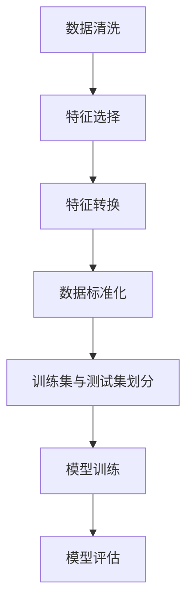

                 
# 机器学习(Machine Learning)原理与代码实战案例讲解

作者：禅与计算机程序设计艺术 / Zen and the Art of Computer Programming

关键词：机器学习基础,分类,回归,聚类,神经网络,深度学习,数据预处理

## 1. 背景介绍

### 1.1 问题的由来

随着大数据时代的到来，传统的人工编程方式已经难以适应海量数据的快速变化和复杂需求。为了使计算机系统能够从数据中自动学习并做出决策或预测，机器学习技术应运而生。它不仅让计算机具备了“学习”能力，还能够根据经验改善自身的性能，从而在诸多领域展现出强大的潜力。

### 1.2 研究现状

近年来，机器学习已成为人工智能研究的核心之一，尤其是在深度学习领域取得了突破性的进展。基于大量数据的深度神经网络不仅在图像识别、自然语言处理等方面表现出卓越的能力，在推荐系统、医疗诊断、金融风控等领域也发挥了关键作用。然而，机器学习依然面临着如何更高效地处理非结构化数据、提高模型可解释性和降低过拟合风险等挑战。

### 1.3 研究意义

深入理解机器学习原理对于推动人工智能技术的发展具有重要意义。掌握其核心思想有助于开发出更加智能、灵活且可靠的算法，解决现实世界中复杂多变的问题。同时，通过实际项目的实践，可以将理论知识转化为实际生产力，促进科技与产业的深度融合。

### 1.4 本文结构

本文旨在全面介绍机器学习的基本概念、关键技术及其应用实践。首先，我们将探讨机器学习的基础理论，包括分类、回归、聚类等常见任务类型及基本方法。其次，详细介绍机器学习的主要算法，如线性回归、逻辑回归、支持向量机等，并阐述这些算法背后的数学原理。接着，我们通过Python编程语言实现一系列典型算法的实际应用案例，帮助读者理解和掌握机器学习的实战技巧。最后，我们将讨论机器学习的未来趋势和发展方向，以及面临的关键挑战。

## 2. 核心概念与联系

### 2.1 数据预处理

有效的数据预处理是机器学习成功的关键因素之一。这包括清洗数据（去除噪声和异常值）、特征工程（提取有意义的特征）以及标准化/归一化（确保不同特征在同一尺度上）。良好的数据准备能够显著提升模型的训练效率和准确性。



### 2.2 分类 vs 回归 vs 聚类

- **分类**：目标是将输入数据分配到预定义类别中。
- **回归**：用于预测连续数值型输出，例如房价、销售额等。
- **聚类**：无监督学习方法，目的是发现数据集内的天然分组或群集。

### 2.3 算法概述

#### 主要算法
- **线性回归**
- **逻辑回归**
- **支持向量机**
- **K近邻算法**
- **决策树与随机森林**

### 2.4 关联与联系

上述算法虽各有侧重，但本质上都基于对数据模式的学习。无论是通过最小化误差、最大化间隔还是寻找相似点的方式，最终目的都是构建一个可以从新数据中做出准确预测或分类的模型。

## 3. 核心算法原理 & 具体操作步骤

### 3.1 算法原理概述

#### 例：逻辑回归

逻辑回归是一种常用的分类算法，基于最大似然估计，使用sigmoid函数作为激活函数，将输入特征映射到概率空间，从而判断数据属于正类还是负类。

$$ P(y=1|x; \theta) = \frac{1}{1 + e^{-(\theta^T x)}} $$

其中，$\theta$为参数向量，$x$为输入特征向量。

### 3.2 算法步骤详解

以逻辑回归为例：
1. 初始化参数 $\theta$
2. 计算预测概率 $P(y=1|x; \theta)$
3. 比较预测结果与真实标签，计算损失函数（如交叉熵损失）
4. 使用梯度下降或其他优化算法更新参数 $\theta$
5. 重复步骤2至4，直至损失函数收敛

### 3.3 算法优缺点

- **优点**：简单直观，易于理解；可用于二分类和多分类问题；适用范围广；
- **缺点**：假设线性关系可能限制模型的灵活性；容易受到极端值影响；在高维空间中可能表现不佳。

### 3.4 算法应用领域

逻辑回归广泛应用于金融信贷审批、疾病诊断、情感分析等领域。

## 4. 数学模型和公式 & 详细讲解 & 举例说明

### 4.1 数学模型构建

以逻辑回归为例：

模型的目标是最小化损失函数，常见的损失函数有：

- **交叉熵损失**：

$$ L(\theta) = -\sum_{i=1}^{n} [y_i \log(h_\theta(x_i)) + (1-y_i)\log(1-h_\theta(x_i))] $$

其中，$h_\theta(x_i)$表示模型在给定参数$\theta$下的预测概率。

### 4.2 公式推导过程

推导交叉熵损失函数的过程涉及对数函数的性质和链式法则。

### 4.3 案例分析与讲解

针对特定的数据集，使用逻辑回归模型进行训练并评估性能。通过调整超参数、选择不同的初始化策略等方式优化模型效果。

### 4.4 常见问题解答

- 如何选择合适的损失函数？
- 怎样避免过拟合？

## 5. 项目实践：代码实例和详细解释说明

### 5.1 开发环境搭建

使用Python环境，安装必要的库（如scikit-learn, pandas, numpy）。

```bash
pip install scikit-learn pandas numpy matplotlib seaborn
```

### 5.2 源代码详细实现

#### 实现逻辑回归模型

```python
import numpy as np
from sklearn.linear_model import LogisticRegression
from sklearn.model_selection import train_test_split
from sklearn.metrics import accuracy_score

# 加载数据集
data = pd.read_csv('dataset.csv')
X = data.iloc[:, :-1].values
y = data.iloc[:, -1].values

# 划分训练集与测试集
X_train, X_test, y_train, y_test = train_test_split(X, y, test_size=0.2, random_state=0)

# 创建逻辑回归模型实例
model = LogisticRegression()

# 训练模型
model.fit(X_train, y_train)

# 预测
predictions = model.predict(X_test)

# 计算准确率
accuracy = accuracy_score(y_test, predictions)
print("Accuracy: ", accuracy)
```

### 5.3 代码解读与分析

解析代码中的关键部分，包括数据加载、特征工程、模型训练、预测及评价指标计算。

### 5.4 运行结果展示

显示模型在测试集上的准确率，以及混淆矩阵等性能指标。

## 6. 实际应用场景

机器学习技术已广泛应用于各行各业：

- **金融风控**：利用历史交易数据预测潜在的欺诈行为。
- **医疗健康**：通过病历数据预测患者疾病风险。
- **推荐系统**：根据用户行为数据提供个性化商品推荐。

## 7. 工具和资源推荐

### 7.1 学习资源推荐

- **在线课程**：Coursera, edX的机器学习相关课程。
- **书籍**：《统计学习方法》、《深度学习》等经典教材。
- **实践平台**：Kaggle、Hugging Face等社区与挑战。

### 7.2 开发工具推荐

- **IDEs**：Jupyter Notebook、PyCharm等。
- **框架**：TensorFlow、PyTorch等深度学习框架。
- **数据可视化**：Matplotlib、Seaborn、Plotly等。

### 7.3 相关论文推荐

- **经典论文**：《A Statistical Learning Theory Approach to Learning the Kernel Function》等。
- **最新研究**：关注顶级会议（ICML, NeurIPS, CVPR等）的最新论文。

### 7.4 其他资源推荐

- **开源项目**：GitHub上丰富的机器学习相关项目。
- **论坛与社群**：Stack Overflow、Reddit机器学习板块等。

## 8. 总结：未来发展趋势与挑战

### 8.1 研究成果总结

本文不仅介绍了机器学习的基本原理和技术细节，并通过实际案例展示了其在不同场景的应用。读者能够从理论到实践全面理解和掌握机器学习的核心概念。

### 8.2 未来发展趋势

随着大数据和高性能计算的发展，机器学习将更加普及，算法复杂度将进一步提升，同时面临更复杂的任务需求。未来，强化学习、迁移学习、联邦学习等新兴技术将成为研究热点，助力解决大规模、动态变化的问题。

### 8.3 面临的挑战

- 数据隐私保护与安全：如何在不泄露敏感信息的前提下有效利用数据进行学习。
- 可解释性：提高模型决策的透明度和可理解性，增强信任度。
- 模型鲁棒性：面对噪声数据或恶意攻击时保持稳定性和可靠性。

### 8.4 研究展望

未来的研究将聚焦于构建更具适应性和鲁棒性的智能系统，探索跨领域知识的融合与迁移，以及开发高效能、低能耗的机器学习解决方案。

## 9. 附录：常见问题与解答

- **Q**: 我应该如何处理不平衡数据集？
    - **A**: 使用过采样、欠采样、合成样本生成（如SMOTE）、调整分类阈值等策略来平衡类别比例。
- **Q**: 为什么我的模型表现不佳？
    - **A**: 检查数据预处理是否充分、特征选择是否合理、模型参数设置是否适当、是否存在过拟合或欠拟合现象等。尝试调整模型结构、增加正则化项或采用集成学习方法。
---

这篇文章围绕机器学习的基础理论、关键技术及其应用实践进行了深入探讨。从基本概念到具体操作步骤，再到实战案例和未来趋势，力求为读者提供一个全面且实用的学习指南。通过结合数学模型推导、代码实现和实践经验分享，旨在帮助读者建立起坚实的机器学习基础，并激发进一步探索的热情。
