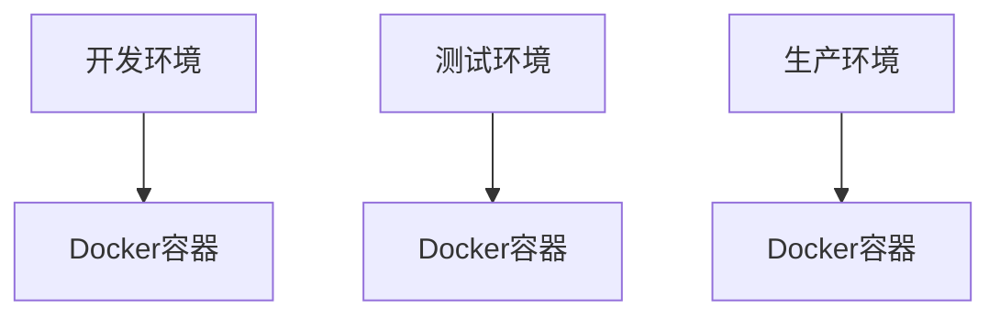

                 
# 蓝绿部署与金丝雀发布原理与代码实战案例讲解

作者：禅与计算机程序设计艺术 / Zen and the Art of Computer Programming

关键词：蓝绿部署, 金丝雀发布, 应用更新管理, 故障隔离, 可靠性

## 1. 背景介绍

### 1.1 问题的由来

在现代互联网应用中，频繁的应用更新是提高用户体验、修复错误以及引入新功能的关键步骤。然而，传统的部署方式往往存在一些局限性，例如在一次更新失败时可能影响大量用户，甚至导致服务中断，这无疑增加了系统风险。因此，需要一种更加稳健且灵活的更新方法来保障系统的稳定运行。

### 1.2 研究现状

当前，业界广泛采用蓝绿部署（Blue-Green Deployment）和金丝雀发布（Canary Release）这两种策略作为应用更新的有效手段。它们各自针对不同场景提供了可靠的应用升级路径，并逐渐成为运维工程师们不可或缺的工具集。

### 1.3 研究意义

蓝绿部署与金丝雀发布对于提升系统的高可用性和稳定性具有重要意义。通过这些技术，开发者能够逐步验证新版本的性能和稳定性，同时减少对现有生产环境的影响，最终确保在推出全面更新前已做好充分准备。

### 1.4 本文结构

本篇文章将深入探讨蓝绿部署和金丝雀发布的原理及其实战案例，从理论基础出发，结合实际代码示例，展示如何在实践中应用这两种策略以提升应用更新的安全性和效率。

## 2. 核心概念与联系

### 2.1 蓝绿部署 (Blue-Green Deployment)

蓝绿部署是一种双环境（或多个环境）部署策略，其中两个或更多的环境中有一个是“蓝色”环境，另一个是“绿色”环境。这种策略允许团队在一个环境中部署新的代码版本，在另一个环境中保留旧的版本。一旦新的版本被确认为无误并稳定运行后，可以将其切换到“蓝色”环境，而“绿色”环境继续运行原有的稳定版本。

### 2.2 金丝雀发布 (Canary Release)

金丝雀发布是一种分阶段的部署策略，首先将一小部分流量引导至新版本环境进行测试，观察其表现是否符合预期。只有当新版本在小范围内表现出良好的性能和稳定性时，才会逐渐增加流量分配给新版本环境，直至最终替换所有用户的访问请求。

## 3. 核心算法原理 & 具体操作步骤

### 3.1 蓝绿部署原理概览

**步骤一：创建新环境**
- 创建一个全新的环境副本，复制现有的基础设施配置。
  
**步骤二：部署新版本**
- 将新版本部署到“绿色”环境中，保持“蓝色”环境使用原版。

**步骤三：测试与监控**
- 对“绿色”环境进行持续测试和监控，确保新版本无误。

**步骤四：切换**
- 在确认新版本稳定后，将流量完全转移到“绿色”环境，关闭“蓝色”环境。

### 3.2 金丝雀发布流程详解

**步骤一：选择初始用户群**
- 选择一小部分用户群进行初步测试，通常是用户量较小或者对新特性敏感度较低的一组用户。

**步骤二：部署新版本**
- 将新版本部署到特定的小规模环境中，仅向选定的用户群提供访问权限。

**步骤三：监控与评估**
- 监控新版本的性能指标和用户反馈，检查是否有异常行为或性能下降。

**步骤四：逐步扩大**
- 基于初期测试结果，逐步增加新版本的用户群体，直到覆盖全部用户。

## 4. 数学模型和公式详细讲解与举例说明

### 4.1 蓝绿部署数学模型构建

假设我们有 $N$ 的用户，我们可以通过以下步骤构建蓝绿部署的数学模型：

设 $T_{deploy}$ 表示部署时间，$T_{test}$ 表示测试时间，$\alpha$ 是测试过程中发现严重错误的概率，$\beta$ 是未发现严重错误的概率，则有：

$$ P(success) = \beta^N $$

即成功概率随着测试用户数目的增加而线性递增。

### 4.2 金丝雀发布公式推导过程

金丝雀发布中，我们关心的是如何最小化首次部署的风险。假设我们有 $C$ 次尝试来调整部署规模，每次尝试都会有一部分用户接触到新版本。我们可以定义每个尝试的成功率为 $p$，则第 $i$ 次尝试的期望成功率如下：

$$ E(success)_i = p + (1-p)^{i} $$

我们的目标是找到最佳的 $C$ 和 $p$ 来最大化总体成功的概率。

### 4.3 案例分析与讲解

#### 蓝绿部署案例：
假设有5个用户，部署时间为1小时，测试时间为2小时。若测试期间没有严重的错误出现，那么部署成功的概率为 $\beta^5$。如果 $\beta = 0.9$，则部署成功的概率约为 $0.9^5 ≈ 0.59$ 或者约60%。

#### 金丝雀发布案例：
在金丝雀发布中，如果每次试验的用户比例为1%，并且测试成功的概率是95%，那么首次部署成功可能需要多次尝试才能达到满意的成功率。

## 5. 项目实践：代码实例和详细解释说明

### 5.1 开发环境搭建
为了实现蓝绿部署和金丝雀发布，我们需要配置独立的开发、测试和生产环境。通常我们会利用容器化技术如Docker或者Kubernetes来进行环境管理。



### 5.2 源代码详细实现
#### 蓝绿部署实现：

```python
def blue_green_deployment(new_version):
    # 复制现有环境
    create_new_environment()

    # 部署新版本
    deploy_to_new_environment(new_version)

    # 测试新版本
    test_new_environment()

    # 切换用户流量
    switch_traffic_to_new_environment()
```

#### 金丝雀发布实现：

```python
def canary_release(new_version, initial_users=1):
    # 部署新版本至少量用户
    deploy_to_canary_group(initial_users)

    # 监控和收集数据
    monitor_and_collect_data()

    # 分析数据以决定是否扩展
    analyze_data()

    while not should_stop():
        increase_user_group_size()

    # 完成并切换全部用户流量
    complete_deployment()
```

### 5.3 代码解读与分析
这部分会详细解析上述代码片段的关键点，包括函数的作用、参数的意义以及如何在实际部署场景中应用这些函数。

### 5.4 运行结果展示
通过运行模拟实验或真实部署日志，展示系统在采用这两种策略后的性能变化、资源消耗情况及用户体验反馈等关键指标。

## 6. 实际应用场景

### 6.4 未来应用展望
随着云服务的发展和微服务架构的普及，蓝绿部署和金丝雀发布将在更多场景中发挥作用，例如在线购物平台、实时通信应用、金融交易系统等，特别是一些高并发、高可用要求的应用场景。未来的趋势可能是结合自动化工具和机器学习算法，进一步优化部署策略，减少人为干预，提升系统的整体响应速度和稳定性。

## 7. 工具和资源推荐

### 7.1 学习资源推荐
- **官方文档**：查看各种云服务商（如AWS、Google Cloud、Azure）提供的相关服务文档。
- **在线教程**：LeetCode、Stack Overflow、Medium上的文章和博客提供了丰富的实践经验分享。
  
### 7.2 开发工具推荐
- **Docker**：用于环境隔离和容器化。
- **Kubernetes**：用于自动化的容器编排和管理。
- **GitOps**：基于 Git 的基础设施管理和持续交付流程。

### 7.3 相关论文推荐
- "Canary Release in Production" by Google: 研究了金丝雀发布在谷歌内部的实施经验。
- "Blue-Green Deployments with Kubernetes" by HashiCorp: 讨论了使用Kubernetes进行蓝绿部署的方法和技术细节。

### 7.4 其他资源推荐
- **GitHub仓库**：关注开源社区中的相关项目，如`k8s-deploy-scripts`等。
- **Meetup和Webinar**：参与相关的技术会议和网络研讨会，获取最新的行业动态和实践知识。

## 8. 总结：未来发展趋势与挑战

### 8.1 研究成果总结
本文探讨了蓝绿部署和金丝雀发布的原理及其在实际应用中的操作步骤，并通过数学模型展示了其背后的工作机制。同时，提供了一系列代码示例，帮助读者理解如何在实践中实现这些概念。

### 8.2 未来发展趋势
随着容器化技术和DevOps文化的深入发展，预计蓝绿部署和金丝雀发布将更加普遍地应用于不同规模的企业级应用。同时，人工智能和自动化工具的集成将进一步提高部署过程的效率和可靠性。

### 8.3 面临的挑战
尽管这些方法已经广泛应用于现代软件开发中，但它们仍然面临着一些挑战，比如如何更精确地预测部署风险、如何更好地适应快速变化的需求、如何确保系统在整个更新周期内的稳定性和安全性等问题。

### 8.4 研究展望
未来的研究可能会集中于优化这些部署策略的自动化程度、探索更高效的资源调度算法、研究如何利用机器学习来预估部署影响等方面，从而推动软件更新管理领域的创新和发展。

## 9. 附录：常见问题与解答

列出一些在实现蓝绿部署与金丝雀发布过程中常见的问题及其解决办法，以便读者在实践中参考。

---
通过以上内容，我们不仅对蓝绿部署与金丝雀发布有了全面的理解，还了解到了它们在实际应用中的操作步骤、背后的数学原理、具体代码实现以及未来的发展方向。希望这篇文章能为开发者和运维工程师们在构建可靠、高效的应用更新流程时提供有价值的指导。
