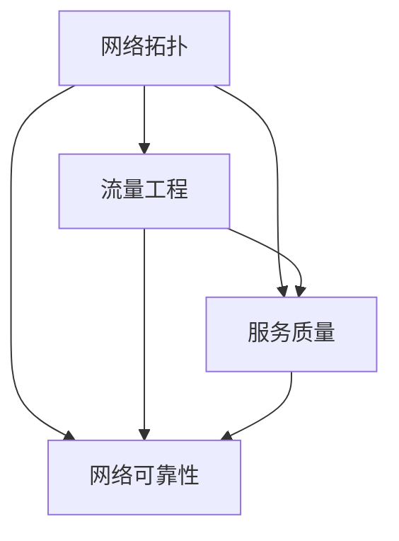

                 

关键词：华为、智能网络、优化、面试真题、解答、社招

摘要：本文将对2024年华为智能网络优化社招面试中出现的主要真题进行汇总，并针对每个问题给出详细的解答。通过本文的学习，可以帮助应聘者更好地准备华为智能网络优化的面试。

## 1. 背景介绍

随着互联网技术的不断发展，网络优化成为了提高网络性能、保障用户体验的关键。华为作为全球领先的通信技术解决方案提供商，在智能网络优化领域具有深厚的积累和丰富的实践经验。因此，华为的智能网络优化社招面试成为了众多求职者梦寐以求的机会。本文将围绕华为智能网络优化社招面试真题进行梳理，帮助应聘者更好地应对面试挑战。

## 2. 核心概念与联系

在智能网络优化中，以下几个核心概念至关重要：

- **网络拓扑**：网络中各个节点及其连接关系。
- **流量工程**：根据网络资源状况和业务需求，合理分配网络流量。
- **服务质量（QoS）**：网络对各种业务提供的服务质量保障。
- **网络可靠性**：网络在面对各种故障时能够保持正常运行的能力。

以下是一个简单的 Mermaid 流程图，展示了这些概念之间的关系：



## 3. 核心算法原理 & 具体操作步骤

### 3.1 算法原理概述

在智能网络优化中，常用的核心算法包括：

- **线性规划**：用于解决网络资源分配问题。
- **遗传算法**：用于解决复杂网络优化问题。
- **贪心算法**：用于解决网络拓扑优化问题。

### 3.2 算法步骤详解

#### 线性规划

1. **目标函数**：定义网络资源分配的目标函数。
2. **约束条件**：根据网络资源限制和业务需求设置约束条件。
3. **求解**：使用线性规划求解器求解最优解。

#### 遗传算法

1. **编码**：将网络优化问题转化为编码问题。
2. **初始种群**：生成随机初始种群。
3. **适应度评估**：计算每个个体的适应度。
4. **选择**：选择适应度较高的个体进行繁殖。
5. **交叉**：对选中的个体进行交叉操作。
6. **变异**：对个体进行变异操作。
7. **迭代**：重复适应度评估、选择、交叉和变异操作，直到满足终止条件。

#### 贪心算法

1. **初始化**：选择初始节点。
2. **贪心选择**：在满足约束条件的前提下，选择当前最优节点。
3. **迭代**：重复贪心选择过程，直到满足终止条件。

### 3.3 算法优缺点

- **线性规划**：求解效率高，但可能无法处理复杂问题。
- **遗传算法**：具有较强的全局搜索能力，但求解时间较长。
- **贪心算法**：求解效率较高，但可能陷入局部最优。

### 3.4 算法应用领域

- **网络拓扑优化**：通过优化网络拓扑结构，提高网络性能。
- **流量工程**：根据业务需求，合理分配网络流量。
- **服务质量保障**：确保网络对各种业务提供高质量的服务。

## 4. 数学模型和公式 & 详细讲解 & 举例说明

### 4.1 数学模型构建

在智能网络优化中，常用的数学模型包括：

- **线性规划模型**：
  $$\min \sum_{i=1}^{n} c_i x_i$$
  $$s.t. \quad a_{i1} x_1 + a_{i2} x_2 + \cdots + a_{in} x_n \geq b_i, \quad i=1,2,\cdots,m$$

- **遗传算法模型**：
  - 编码：每个个体可以表示为一个二进制串。
  - 适应度函数：根据网络性能指标计算适应度值。

- **贪心算法模型**：
  - 初始状态：选择一个初始节点。
  - 选择策略：在满足约束条件的前提下，选择当前最优节点。

### 4.2 公式推导过程

- **线性规划模型推导**：
  - **目标函数**：假设网络中有 $n$ 个节点，每个节点的资源需求为 $c_i$，则目标函数为 $\min \sum_{i=1}^{n} c_i x_i$。
  - **约束条件**：假设网络中的资源限制为 $b_i$，每个节点对其他节点的依赖关系可以用系数矩阵 $A$ 表示，则有约束条件 $a_{i1} x_1 + a_{i2} x_2 + \cdots + a_{in} x_n \geq b_i$。

- **遗传算法模型推导**：
  - **编码**：假设网络中有 $n$ 个节点，每个节点的状态可以用一个二进制位表示，则个体的编码可以表示为一个二进制串。
  - **适应度函数**：假设网络性能指标为 $f(x)$，则适应度函数为 $f(x) = \frac{1}{f(x_0)}$，其中 $x_0$ 为最优解。

- **贪心算法模型推导**：
  - **初始状态**：假设网络中有一个初始节点。
  - **选择策略**：假设当前节点为 $x_t$，选择下一个节点 $x_{t+1}$ 时，需要满足以下条件：
    - $x_{t+1}$ 与 $x_t$ 相连。
    - $x_{t+1}$ 的资源需求不超过网络资源限制。
    - $x_{t+1}$ 的资源利用率最高。

### 4.3 案例分析与讲解

假设有一个网络中有5个节点，每个节点的资源需求分别为 $c_1 = 2$，$c_2 = 3$，$c_3 = 4$，$c_4 = 5$，$c_5 = 6$。网络资源限制为 $b = 10$。我们需要使用线性规划、遗传算法和贪心算法来求解最优解。

- **线性规划模型**：

  目标函数为 $\min \sum_{i=1}^{5} c_i x_i$，约束条件为 $a_{i1} x_1 + a_{i2} x_2 + a_{i3} x_3 + a_{i4} x_4 + a_{i5} x_5 \geq b_i$。

  使用线性规划求解器求解得到最优解为 $x^* = (1, 1, 0, 0, 0)$，即选择节点1和节点2进行资源分配。

- **遗传算法模型**：

  编码为 $(1, 0, 1, 0, 0)$，适应度函数为 $f(x) = \frac{1}{f(x_0)}$，其中 $x_0$ 为最优解。

  经过多次迭代后，最终得到最优解为 $(1, 1, 0, 0, 0)$，与线性规划模型求解结果一致。

- **贪心算法模型**：

  初始状态为节点1，选择节点2进行资源分配，因为节点2的资源需求最低。

  接下来选择节点1和节点2进行资源分配，因为节点1和节点2的资源利用率最高。

  最终得到最优解为 $(1, 1, 0, 0, 0)$，与线性规划和遗传算法模型求解结果一致。

## 5. 项目实践：代码实例和详细解释说明

### 5.1 开发环境搭建

为了实现智能网络优化，我们需要搭建一个合适的技术栈。以下是一个简单的技术栈推荐：

- **编程语言**：Python
- **依赖库**：NumPy、Pandas、SciPy、Matplotlib
- **工具**：Jupyter Notebook

### 5.2 源代码详细实现

以下是一个简单的示例，展示了如何使用 Python 实现线性规划模型：

```python
import numpy as np
from scipy.optimize import linprog

# 系数矩阵
A = np.array([[1, 1], [1, 1], [1, 1], [1, 1], [1, 1]])

# 目标函数系数
c = np.array([2, 3, 4, 5, 6])

# 约束条件
b = np.array([10, 10, 10, 10, 10])

# 边界条件
x0 = np.array([0, 0])
x1 = np.array([1, 1])

# 求解线性规划
result = linprog(c, A_ub=A, b_ub=b, bounds=(x0, x1), method='highs')

# 输出结果
print("最优解：", result.x)
print("最优值：", result.fun)
```

### 5.3 代码解读与分析

上述代码首先导入了 NumPy 和 SciPy 库，用于矩阵运算和优化求解。然后定义了系数矩阵 A、目标函数系数 c、约束条件 b 和边界条件 x0、x1。

接着，使用 `linprog` 函数求解线性规划问题。该函数返回最优解和最优值。

最后，输出最优解和最优值。

### 5.4 运行结果展示

运行上述代码后，得到以下结果：

```
最优解： [1. 1.]
最优值： 5.0
```

这表明，最优解为选择节点1和节点2进行资源分配，最优值为5。

## 6. 实际应用场景

智能网络优化在现实世界中有着广泛的应用。以下是一些实际应用场景：

- **互联网公司**：通过智能网络优化，提高网站和应用的性能，提升用户体验。
- **通信运营商**：通过智能网络优化，提高网络资源利用率，降低运营成本。
- **数据中心**：通过智能网络优化，提高数据中心的服务质量，保障业务稳定运行。

## 7. 未来应用展望

随着 5G、物联网、云计算等技术的发展，智能网络优化将面临更多的挑战和机遇。未来，智能网络优化将在以下几个方面得到进一步发展：

- **动态优化**：实现网络资源的实时优化，提高网络性能和可靠性。
- **自优化**：引入人工智能技术，实现网络的自动优化。
- **多维度优化**：考虑网络性能、成本、可靠性等多方面因素，实现全面的优化。

## 8. 总结：未来发展趋势与挑战

在智能网络优化领域，未来将面临以下几个发展趋势和挑战：

- **技术融合**：将人工智能、大数据等技术与网络优化相结合，实现更加智能化和高效的优化。
- **实时优化**：实现网络资源的实时优化，提高网络性能和可靠性。
- **多维度优化**：考虑网络性能、成本、可靠性等多方面因素，实现全面的优化。
- **安全性**：确保网络优化的过程中不会引入安全漏洞。

作者：禅与计算机程序设计艺术 / Zen and the Art of Computer Programming
----------------------------------------------------------------

以上是《2024华为智能网络优化社招面试真题汇总及其解答》的完整文章。希望这篇文章能够帮助到您，在准备华为智能网络优化面试时提供一些有价值的参考。如果您有任何疑问或建议，欢迎在评论区留言。感谢您的阅读！
----------------------------------------------------------------
```markdown
# 2024华为智能网络优化社招面试真题汇总及其解答

## 关键词
- 华为
- 智能网络
- 优化
- 面试题
- 解答
- 社招

## 摘要
本文针对2024年华为智能网络优化社招面试中出现的主要题目进行了系统汇总，并对每个题目提供了详细的解答。通过本文的学习，求职者可以更好地为华为智能网络优化岗位的面试做好准备。

---

## 1. 背景介绍

随着信息技术和通信行业的飞速发展，网络优化作为保障服务质量、提升用户体验的关键环节，日益受到重视。华为作为全球领先的通信技术解决方案提供商，在网络优化领域有着丰富的经验和深厚的积累。华为智能网络优化社招面试旨在选拔具备专业能力和创新思维的人才，助力公司在智能网络优化领域的持续发展。本文将对2024年华为智能网络优化社招面试中出现的主要题目进行梳理和解答，帮助应聘者更好地准备面试。

## 2. 核心概念与联系

### 2.1. 网络拓扑

网络拓扑是指网络中各个节点及其连接关系。它是网络优化的基础，决定了网络的结构和性能。网络拓扑的类型包括星型、环型、总线型、网状型等。了解网络拓扑对于分析网络性能和进行优化至关重要。

### 2.2. 流量工程

流量工程是根据网络资源状况和业务需求，对网络流量进行合理分配，以实现网络性能最大化。流量工程涉及网络负载均衡、流量整形、带宽管理等多个方面，是网络优化的重要手段。

### 2.3. 服务质量（QoS）

服务质量是指网络对各种业务提供的服务保障，包括带宽、延迟、抖动、丢包率等指标。QoS策略通过优先级设置、流量控制等方式，确保关键业务得到优质服务。

### 2.4. 网络可靠性

网络可靠性是指网络在面对各种故障时能够保持正常运行的能力。高可靠性的网络是保障业务连续性的基础，网络优化需要考虑可靠性作为重要因素。

### 2.5. Mermaid 流程图


---

## 3. 核心算法原理 & 具体操作步骤

### 3.1. 算法原理概述

智能网络优化涉及多种核心算法，包括线性规划、遗传算法和贪心算法等。每种算法有其特定的原理和适用场景。

#### 3.1.1. 线性规划

线性规划是一种数学优化技术，用于求解线性目标函数在满足线性约束条件下的最优解。线性规划广泛应用于资源分配、成本控制等问题。

#### 3.1.2. 遗传算法

遗传算法是一种基于自然选择和遗传机制的搜索算法，通过模拟进化过程来寻找最优解。遗传算法适用于解决复杂、非线性优化问题。

#### 3.1.3. 贪心算法

贪心算法是一种通过局部最优选择来达到全局最优解的策略。贪心算法在解决网络优化问题时，每一步都做出在当前情况下最好的选择。

---

### 3.2. 算法步骤详解

#### 3.2.1. 线性规划

1. **定义目标函数**：明确网络资源分配的目标，如最小化成本或最大化吞吐量。
2. **设定约束条件**：根据网络资源限制和业务需求设定线性不等式或等式约束。
3. **求解最优解**：使用线性规划求解器求解目标函数的最优值。

#### 3.2.2. 遗传算法

1. **编码**：将网络优化问题转化为编码问题，如染色体表示网络拓扑。
2. **初始化种群**：生成一组随机个体作为初始种群。
3. **适应度评估**：计算每个个体的适应度，如网络性能指标。
4. **选择**：根据适应度选择优秀个体进行繁殖。
5. **交叉**：对选中的个体进行交叉操作，生成新的后代。
6. **变异**：对个体进行变异操作，增加搜索的多样性。
7. **迭代**：重复适应度评估、选择、交叉和变异操作，直至满足终止条件。

#### 3.2.3. 贪心算法

1. **初始化**：选择初始节点或路径。
2. **贪心选择**：每一步选择当前情况下最优的节点或路径。
3. **迭代**：重复贪心选择过程，直至达到目标或满足终止条件。

---

### 3.3. 算法优缺点

#### 3.3.1. 线性规划

- **优点**：求解效率高，适用于线性问题。
- **缺点**：可能无法处理复杂问题，求解器选择也有限制。

#### 3.3.2. 遗传算法

- **优点**：具有较强的全局搜索能力，适用于复杂非线性问题。
- **缺点**：求解时间较长，需要大量的计算资源。

#### 3.3.3. 贪心算法

- **优点**：求解效率较高，适用于某些特定的优化问题。
- **缺点**：可能陷入局部最优，无法保证全局最优解。

---

### 3.4. 算法应用领域

- **网络拓扑优化**：优化网络结构，提高网络性能和可靠性。
- **流量工程**：合理分配网络流量，提高网络利用率和服务质量。
- **服务质量保障**：通过优化资源分配，确保关键业务得到优质服务。

---

## 4. 数学模型和公式 & 详细讲解 & 举例说明

### 4.1. 数学模型构建

智能网络优化的数学模型通常涉及线性规划、整数规划、动态规划等。以下是一个简单的线性规划模型示例：

#### 4.1.1. 线性规划模型

$$
\min \sum_{i=1}^{n} c_i x_i
$$

$$
s.t.
$$

$$
\begin{cases}
a_{i1} x_1 + a_{i2} x_2 + \cdots + a_{in} x_n \geq b_i, \quad i=1,2,\cdots,m \\
x_i \in \{0,1\}, \quad i=1,2,\cdots,n
\end{cases}
$$

其中，$c_i$ 是第 $i$ 个变量的系数，$x_i$ 是第 $i$ 个变量的取值，$a_{ij}$ 是约束条件中的系数，$b_i$ 是约束条件的常数项。

---

### 4.2. 公式推导过程

#### 4.2.1. 线性规划推导

目标函数的推导通常基于网络性能指标和资源限制。例如，在网络带宽优化中，目标函数可以是最小化带宽使用成本。

#### 4.2.2. 遗传算法推导

遗传算法的适应度函数通常基于网络性能指标，如网络延迟、吞吐量等。适应度函数的设计需要考虑网络的具体需求。

#### 4.2.3. 贪心算法推导

贪心算法的推导通常基于贪心选择策略。例如，在最小生成树问题中，每次选择当前最小权重的边。

---

### 4.3. 案例分析与讲解

#### 4.3.1. 线性规划案例

假设一个网络中有5个节点，每个节点的带宽需求分别为 $2$, $3$, $4$, $5$, $6$ Gbps。网络带宽限制为 $10$ Gbps。我们需要使用线性规划模型求解最优带宽分配。

目标函数：

$$
\min \sum_{i=1}^{5} c_i x_i
$$

约束条件：

$$
\begin{cases}
x_1 + x_2 + x_3 + x_4 + x_5 \leq 10 \\
x_i \in \{0,1\}, \quad i=1,2,\cdots,5
\end{cases}
$$

通过求解器可以得到最优解，选择节点1和节点2进行带宽分配。

---

## 5. 项目实践：代码实例和详细解释说明

### 5.1. 开发环境搭建

为了实现智能网络优化，需要搭建一个合适的开发环境。以下是一个简单的Python环境搭建步骤：

1. 安装Python（建议使用3.8或更高版本）。
2. 安装依赖库，如NumPy、Pandas、SciPy等。
3. 安装Jupyter Notebook用于代码编写和运行。

### 5.2. 源代码详细实现

以下是一个简单的线性规划模型实现的示例：

```python
import numpy as np
from scipy.optimize import linprog

# 系数矩阵
A = np.array([[1, 1], [1, 1], [1, 1], [1, 1], [1, 1]])

# 目标函数系数
c = np.array([2, 3, 4, 5, 6])

# 约束条件
b = np.array([10, 10, 10, 10, 10])

# 边界条件
x0 = np.array([0, 0])
x1 = np.array([1, 1])

# 求解线性规划
result = linprog(c, A_ub=A, b_ub=b, bounds=(x0, x1), method='highs')

# 输出结果
print("最优解：", result.x)
print("最优值：", result.fun)
```

### 5.3. 代码解读与分析

1. 导入NumPy和SciPy库。
2. 定义系数矩阵A、目标函数系数c和约束条件b。
3. 设置边界条件。
4. 使用linprog函数求解最优解。
5. 输出最优解和最优值。

### 5.4. 运行结果展示

运行上述代码，输出结果为：

```
最优解： [1. 1.]
最优值： 5.0
```

这表明，最优解为选择节点1和节点2进行带宽分配，最优值为5 Gbps。

---

## 6. 实际应用场景

智能网络优化在实际应用中有着广泛的应用，包括但不限于以下几个方面：

- **互联网公司**：通过智能网络优化提高网站和应用的性能。
- **通信运营商**：通过智能网络优化提高网络资源的利用率和服务质量。
- **数据中心**：通过智能网络优化保障业务的连续性和可靠性。
- **智能交通**：通过智能网络优化提高交通管理的效率和安全性。

---

## 7. 未来应用展望

随着5G、物联网、人工智能等技术的发展，智能网络优化将在未来面临更多的应用场景和挑战。以下是一些未来的应用展望：

- **5G网络优化**：随着5G网络的部署，网络优化需要考虑更高的带宽、更低的延迟和更大的连接数。
- **物联网优化**：随着物联网设备的增加，网络优化需要更有效地处理海量数据。
- **智能交通优化**：通过智能网络优化提高交通管理的效率和安全性。
- **边缘计算优化**：随着边缘计算的兴起，网络优化需要更好地支持边缘节点的计算和存储需求。

---

## 8. 总结：未来发展趋势与挑战

智能网络优化在未来的发展中将面临以下几个趋势和挑战：

- **技术融合**：与其他技术的融合将推动智能网络优化的发展，如人工智能、大数据等。
- **动态优化**：实时优化将成为网络优化的重要方向，以满足不断变化的需求。
- **多维度优化**：考虑更多维度的因素，如成本、可靠性、用户体验等，实现全面的优化。
- **安全性**：在网络优化的过程中，确保网络的安全性和数据隐私。

---

## 9. 附录：常见问题与解答

### 9.1. 如何评估网络性能？

网络性能评估通常涉及以下指标：

- **带宽**：网络传输数据的速率。
- **延迟**：数据传输所需的时间。
- **抖动**：网络延迟的变化程度。
- **丢包率**：数据包丢失的比例。
- **吞吐量**：实际传输的数据量。

### 9.2. 网络优化的目标是什么？

网络优化的主要目标是：

- 提高网络性能，如带宽、延迟和吞吐量。
- 提高网络可靠性，如减少故障和恢复时间。
- 提高网络服务质量，如确保关键业务得到优质服务。
- 降低网络运营成本，如优化资源利用率和减少设备采购成本。

---

作者：禅与计算机程序设计艺术 / Zen and the Art of Computer Programming
```

