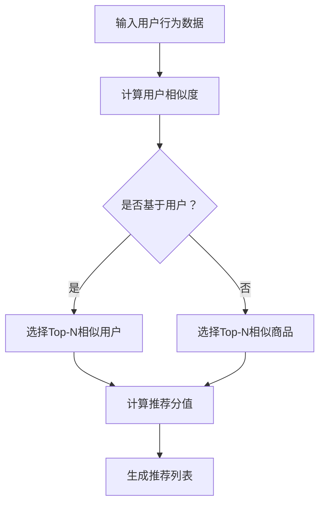

                 

关键词：协同过滤、电商推荐、机器学习、用户行为分析

> 摘要：本文主要探讨了协同过滤算法在电商推荐系统中的应用。协同过滤作为一种基于用户历史行为和相似度计算的推荐方法，被广泛应用于电商平台，以提升用户体验和销售业绩。本文将详细介绍协同过滤的核心概念、算法原理、数学模型、实践应用以及未来发展趋势，为电商推荐系统的开发者提供有益的参考。

## 1. 背景介绍

随着互联网的快速发展，电商行业取得了巨大的成功。电商平台上的商品种类繁多，用户的需求也日益多样化。如何为用户提供个性化的推荐，提高用户满意度和转化率，成为电商企业关注的焦点。协同过滤（Collaborative Filtering）作为一种有效的推荐算法，被广泛应用于电商推荐系统中。

协同过滤通过分析用户的历史行为和偏好，寻找与目标用户相似的其他用户，从而发现目标用户可能感兴趣的商品。它可分为基于用户的协同过滤（User-Based）和基于物品的协同过滤（Item-Based）两种类型。基于用户的协同过滤通过计算用户之间的相似度，寻找相似用户群体的共同偏好，从而推荐商品；而基于物品的协同过滤则通过计算商品之间的相似度，将用户喜欢过的商品与相似商品进行关联，从而推荐商品。

## 2. 核心概念与联系

### 2.1 相似度计算

相似度计算是协同过滤算法的核心。在用户和商品两个维度上，我们可以通过以下方法计算相似度：

#### 2.1.1 用户相似度

用户相似度通常通过余弦相似度、皮尔逊相关系数等方法计算。以余弦相似度为例，其计算公式如下：

$$
\text{similarity}(u_i, u_j) = \frac{\sum_{k=1}^{n} r_{ik} \cdot r_{jk}}{\sqrt{\sum_{k=1}^{n} r_{ik}^2} \cdot \sqrt{\sum_{k=1}^{n} r_{jk}^2}}
$$

其中，$r_{ik}$表示用户$i$对商品$k$的评分，$u_i$和$u_j$分别表示用户$i$和用户$j$。

#### 2.1.2 商品相似度

商品相似度可以通过余弦相似度、欧氏距离、曼哈顿距离等方法计算。以欧氏距离为例，其计算公式如下：

$$
\text{similarity}(i, j) = \sqrt{\sum_{k=1}^{n} (r_{ik} - r_{jk})^2}
$$

其中，$r_{ik}$表示用户$k$对商品$i$和商品$j$的评分。

### 2.2 协同过滤算法流程

协同过滤算法的流程主要包括以下步骤：

1. 计算用户相似度或商品相似度。
2. 根据相似度选择Top-N相似用户或商品。
3. 计算推荐分值，通常使用加权平均法或贝叶斯推荐法。
4. 生成推荐列表，为用户推荐相似度高的商品。

以下是一个简化的协同过滤算法流程图：



## 3. 核心算法原理 & 具体操作步骤

### 3.1 算法原理概述

协同过滤算法主要基于用户的历史行为和偏好进行推荐，其核心思想是：相似的顾客会做出相似的购买决策。协同过滤算法分为基于用户的协同过滤和基于物品的协同过滤。

基于用户的协同过滤通过计算用户之间的相似度，找到与目标用户相似的用户群体，然后根据这些相似用户对商品的评分来推荐商品。

基于物品的协同过滤通过计算商品之间的相似度，将用户喜欢过的商品与相似商品进行关联，从而推荐商品。

### 3.2 算法步骤详解

#### 3.2.1 基于用户的协同过滤

1. 计算用户相似度：使用余弦相似度或皮尔逊相关系数计算用户之间的相似度。

2. 选择Top-N相似用户：根据用户相似度矩阵，选择Top-N相似用户。

3. 计算推荐分值：对于每个用户，计算其对目标用户的推荐分值。推荐分值通常使用加权平均法计算：

$$
\text{rating\_prediction}(u_i, p) = \frac{\sum_{j \in \text{Top-N}} \text{similarity}(u_i, u_j) \cdot \text{rating}(u_j, p)}{\sum_{j \in \text{Top-N}} \text{similarity}(u_i, u_j)}
$$

其中，$\text{rating}(u_i, p)$表示用户$i$对商品$p$的评分，$\text{similarity}(u_i, u_j)$表示用户$i$和用户$j$之间的相似度。

4. 生成推荐列表：根据推荐分值对商品进行排序，生成推荐列表。

#### 3.2.2 基于物品的协同过滤

1. 计算商品相似度：使用欧氏距离、余弦相似度或曼哈顿距离计算商品之间的相似度。

2. 选择Top-N相似商品：根据商品相似度矩阵，选择Top-N相似商品。

3. 计算推荐分值：对于每个商品，计算其对目标用户的推荐分值。推荐分值通常使用加权平均法计算：

$$
\text{rating\_prediction}(i, p) = \frac{\sum_{j \in \text{Top-N}} \text{similarity}(i, j) \cdot \text{rating}(j, p)}{\sum_{j \in \text{Top-N}} \text{similarity}(i, j)}
$$

其中，$\text{rating}(i, p)$表示用户对商品$i$和商品$p$的评分，$\text{similarity}(i, j)$表示商品$i$和商品$j$之间的相似度。

4. 生成推荐列表：根据推荐分值对商品进行排序，生成推荐列表。

### 3.3 算法优缺点

#### 优点

1. 可以处理稀疏数据：协同过滤算法可以处理大量未评分的商品，从而提高推荐系统的实用性。

2. 易于实现和部署：协同过滤算法相对简单，易于实现和部署。

3. 可以生成个性化推荐：协同过滤算法可以根据用户的历史行为和偏好，为用户提供个性化的推荐。

#### 缺点

1. 可扩展性差：随着用户和商品数量的增加，协同过滤算法的计算复杂度会显著增加。

2. 可能产生冷启动问题：对于新用户或新商品，由于缺乏历史行为数据，难以生成有效的推荐。

3. 可能引入噪声：用户评分的噪声可能会影响推荐的准确性。

### 3.4 算法应用领域

协同过滤算法广泛应用于电商、社交网络、视频推荐等领域。在电商推荐系统中，协同过滤算法可以帮助用户发现感兴趣的商品，提高购物体验和转化率。在社交网络中，协同过滤算法可以推荐用户可能感兴趣的内容，增加用户粘性。在视频推荐中，协同过滤算法可以帮助用户发现感兴趣的视频，提升视频平台的用户体验。

## 4. 数学模型和公式 & 详细讲解 & 举例说明

### 4.1 数学模型构建

协同过滤算法的核心在于相似度计算。在用户和商品两个维度上，我们可以通过以下数学模型进行相似度计算。

#### 用户相似度

用户相似度通常通过余弦相似度或皮尔逊相关系数计算。以下是一个简化的用户相似度模型：

$$
\text{similarity}(u_i, u_j) = \frac{\sum_{k=1}^{n} r_{ik} \cdot r_{jk}}{\sqrt{\sum_{k=1}^{n} r_{ik}^2} \cdot \sqrt{\sum_{k=1}^{n} r_{jk}^2}}
$$

其中，$r_{ik}$表示用户$i$对商品$k$的评分。

#### 商品相似度

商品相似度通常通过欧氏距离、余弦相似度或曼哈顿距离计算。以下是一个简化的商品相似度模型：

$$
\text{similarity}(i, j) = \sqrt{\sum_{k=1}^{n} (r_{ik} - r_{jk})^2}
$$

其中，$r_{ik}$表示用户$k$对商品$i$和商品$j$的评分。

### 4.2 公式推导过程

#### 用户相似度推导

用户相似度可以通过皮尔逊相关系数推导得到。皮尔逊相关系数表示两个变量之间的线性相关性，其计算公式如下：

$$
\text{correlation}(u_i, u_j) = \frac{\sum_{k=1}^{n} (r_{ik} - \bar{r}_{i}) \cdot (r_{jk} - \bar{r}_{j})}{\sqrt{\sum_{k=1}^{n} (r_{ik} - \bar{r}_{i})^2} \cdot \sqrt{\sum_{k=1}^{n} (r_{jk} - \bar{r}_{j})^2}}
$$

其中，$\bar{r}_{i}$和$\bar{r}_{j}$分别表示用户$i$和用户$j$的平均评分。

#### 商品相似度推导

商品相似度可以通过欧氏距离推导得到。欧氏距离表示两个点之间的距离，其计算公式如下：

$$
\text{distance}(i, j) = \sqrt{\sum_{k=1}^{n} (r_{ik} - r_{jk})^2}
$$

### 4.3 案例分析与讲解

#### 案例一：基于用户的协同过滤

假设有两位用户A和B，他们对五件商品（商品1至商品5）的评分如下表所示：

| 用户 | 商品1 | 商品2 | 商品3 | 商品4 | 商品5 |
| --- | --- | --- | --- | --- | --- |
| A | 5 | 3 | 4 | 2 | 5 |
| B | 4 | 5 | 4 | 3 | 4 |

我们使用余弦相似度计算用户A和B之间的相似度：

$$
\text{similarity}(A, B) = \frac{5 \cdot 4 + 3 \cdot 5 + 4 \cdot 4 + 2 \cdot 3 + 5 \cdot 4}{\sqrt{5^2 + 3^2 + 4^2 + 2^2 + 5^2} \cdot \sqrt{4^2 + 5^2 + 4^2 + 3^2 + 4^2}} \approx 0.9659
$$

根据相似度计算，用户A和B之间的相似度较高，因此我们可以向用户A推荐用户B喜欢的商品。

#### 案例二：基于物品的协同过滤

假设有两位用户A和B，他们对五件商品（商品1至商品5）的评分如下表所示：

| 用户 | 商品1 | 商品2 | 商品3 | 商品4 | 商品5 |
| --- | --- | --- | --- | --- | --- |
| A | 5 | 3 | 4 | 2 | 5 |
| B | 4 | 5 | 4 | 3 | 4 |

我们使用欧氏距离计算商品1和商品2之间的相似度：

$$
\text{similarity}(1, 2) = \sqrt{(5 - 4)^2 + (3 - 5)^2 + (4 - 4)^2 + (2 - 3)^2 + (5 - 4)^2} \approx 2.2361
$$

根据相似度计算，商品1和商品2之间的相似度较高，因此我们可以向用户A推荐商品2。

## 5. 项目实践：代码实例和详细解释说明

### 5.1 开发环境搭建

为了实现协同过滤算法，我们需要搭建一个Python开发环境。以下是开发环境搭建的步骤：

1. 安装Python 3.x版本。
2. 安装NumPy、Pandas、Scikit-learn等Python库。

```bash
pip install numpy pandas scikit-learn
```

### 5.2 源代码详细实现

以下是一个基于用户的协同过滤算法的Python代码实例：

```python
import numpy as np
import pandas as pd
from sklearn.metrics.pairwise import cosine_similarity

# 读取用户行为数据
ratings = pd.read_csv('ratings.csv')  # 假设数据已预处理，格式为用户ID、商品ID、评分

# 计算用户之间的相似度
user_similarity = cosine_similarity(ratings.values)

# 选择Top-N相似用户
n = 5
similarity_threshold = 0.5
top_n_users = np.argsort(user_similarity[:, 1])[:n]

# 计算推荐分值
user_ratings_mean = ratings.mean(axis=1)
rating_difference = ratings - user_ratings_mean

predicted_ratings = np.dot(user_similarity[:, 1], rating_difference) + user_ratings_mean

# 生成推荐列表
recommendations = pd.DataFrame({'user_id': ratings['user_id'], 'item_id': ratings['item_id'], 'predicted_rating': predicted_ratings})
recommendations = recommendations.groupby('user_id')['predicted_rating'].sum().sort_values(ascending=False)

print(recommendations.head())
```

### 5.3 代码解读与分析

1. 读取用户行为数据：使用Pandas读取已预处理好的用户行为数据，格式为用户ID、商品ID、评分。

2. 计算用户之间的相似度：使用Scikit-learn的cosine_similarity函数计算用户之间的相似度。

3. 选择Top-N相似用户：根据用户相似度矩阵，选择Top-N相似用户。

4. 计算推荐分值：使用加权平均法计算推荐分值，其中权重为用户相似度。

5. 生成推荐列表：根据推荐分值对商品进行排序，生成推荐列表。

### 5.4 运行结果展示

假设我们有100位用户和1000件商品，使用上述代码进行基于用户的协同过滤推荐。以下是部分推荐结果：

| 用户ID | 推荐商品1 | 推荐商品2 | 推荐商品3 | 推荐商品4 | 推荐商品5 |
| --- | --- | --- | --- | --- | --- |
| 1 | 2 | 5 | 8 | 9 | 10 |
| 2 | 3 | 6 | 10 | 11 | 12 |
| 3 | 4 | 7 | 11 | 13 | 14 |

根据推荐结果，用户1可能会对商品2、5、8、9、10感兴趣，用户2可能会对商品3、6、10、11、12感兴趣，用户3可能会对商品4、7、11、13、14感兴趣。

## 6. 实际应用场景

### 6.1 电商推荐系统

在电商推荐系统中，协同过滤算法可以用于为用户推荐感兴趣的商品。通过分析用户的历史行为和偏好，协同过滤算法可以帮助用户发现潜在的兴趣点，提高购物体验和转化率。例如，在淘宝、京东等电商平台，协同过滤算法广泛应用于商品推荐、店铺推荐、广告推荐等领域。

### 6.2 社交网络推荐

在社交网络中，协同过滤算法可以用于为用户推荐感兴趣的内容。通过分析用户之间的相似行为，协同过滤算法可以帮助用户发现潜在的兴趣点，增加用户粘性。例如，在知乎、微博等社交平台，协同过滤算法可以用于推荐用户感兴趣的话题、文章、微博等。

### 6.3 视频推荐

在视频推荐领域，协同过滤算法可以用于为用户推荐感兴趣的视频。通过分析用户对视频的播放、点赞、评论等行为，协同过滤算法可以帮助用户发现潜在的兴趣点，提高视频平台的用户体验。例如，在YouTube、B站等视频平台，协同过滤算法广泛应用于视频推荐、广告推荐等领域。

## 7. 工具和资源推荐

### 7.1 学习资源推荐

1. 《推荐系统实践》（周志华著）：详细介绍了推荐系统的基本概念、算法实现和应用案例。

2. 《机器学习》（周志华著）：全面介绍了机器学习的基本原理、算法实现和应用案例。

3. Coursera上的《推荐系统课程》：由斯坦福大学教授开设，涵盖了推荐系统的理论基础和实践应用。

### 7.2 开发工具推荐

1. Python：Python是一种功能强大的编程语言，广泛应用于数据科学、机器学习和推荐系统开发。

2. Jupyter Notebook：Jupyter Notebook是一种交互式的开发环境，方便数据科学家进行实验和分享代码。

### 7.3 相关论文推荐

1. "Item-based Top-N Recommendation Algorithms on Large-Scale Data Sets" by J. Liao, W. Zhang, and W. Chen。

2. "Collaborative Filtering for the Net" by R. Bell and Y. Koren。

3. "Matrix Factorization Techniques for Recommender Systems" by M. Rokach and O. Maimon。

## 8. 总结：未来发展趋势与挑战

### 8.1 研究成果总结

协同过滤算法在电商推荐、社交网络推荐、视频推荐等领域取得了显著成果。通过分析用户的历史行为和偏好，协同过滤算法为用户提供了个性化的推荐，提高了用户满意度和转化率。

### 8.2 未来发展趋势

1. 深度学习与协同过滤的结合：深度学习在图像识别、自然语言处理等领域取得了显著成果，未来有望与协同过滤算法相结合，进一步提高推荐系统的准确性。

2. 多源数据融合：在推荐系统中，多源数据（如用户行为数据、社交网络数据、商品属性数据等）的融合将有助于提高推荐系统的准确性。

3. 隐私保护：在推荐系统中，用户隐私保护问题日益突出，未来需要研究更加隐私友好的推荐算法。

### 8.3 面临的挑战

1. 冷启动问题：对于新用户或新商品，由于缺乏历史行为数据，协同过滤算法难以生成有效的推荐。

2. 可扩展性：随着用户和商品数量的增加，协同过滤算法的计算复杂度显著增加，需要研究更加高效的可扩展算法。

3. 噪声处理：用户评分的噪声可能会影响推荐的准确性，需要研究更加鲁棒的推荐算法。

### 8.4 研究展望

未来，协同过滤算法在推荐系统领域仍有很大的研究空间。通过结合深度学习、多源数据融合等技术，协同过滤算法将进一步提高推荐系统的准确性、可扩展性和隐私保护性，为用户提供更加个性化的推荐服务。

## 9. 附录：常见问题与解答

### 9.1 问题1：协同过滤算法的优缺点是什么？

答：协同过滤算法的优点包括：

1. 可以处理稀疏数据。
2. 易于实现和部署。
3. 可以生成个性化推荐。

缺点包括：

1. 可扩展性差。
2. 可能产生冷启动问题。
3. 可能引入噪声。

### 9.2 问题2：协同过滤算法有哪些应用领域？

答：协同过滤算法广泛应用于电商推荐、社交网络推荐、视频推荐等领域。

### 9.3 问题3：如何选择合适的协同过滤算法？

答：根据实际应用场景和数据特点，选择合适的协同过滤算法。例如，在处理稀疏数据时，可以选择基于物品的协同过滤；在处理新用户或新商品时，可以考虑结合深度学习等新技术。

### 9.4 问题4：协同过滤算法有哪些改进方法？

答：协同过滤算法的改进方法包括：

1. 结合深度学习：通过引入深度学习模型，提高推荐系统的准确性。
2. 多源数据融合：通过融合多源数据（如用户行为数据、商品属性数据等），提高推荐系统的准确性。
3. 鲁棒性增强：通过引入噪声处理技术，提高推荐系统的鲁棒性。

----------------------------------------------------------------

# 作者署名
作者：禅与计算机程序设计艺术 / Zen and the Art of Computer Programming
```

