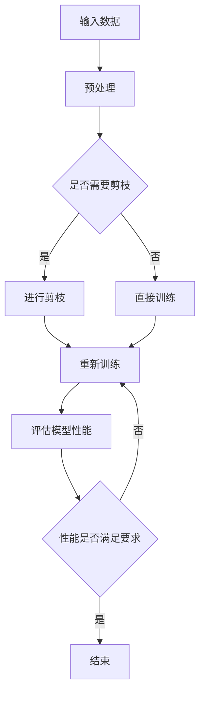

                 

关键词：神经科学，人工智能，深度学习，性能优化，软件2.0

> 摘要：本文深入探讨了人工智能领域的一项颠覆性创新——通过减少一半的神经元，使得深度学习模型的性能依然能保持出众。这一发现不仅具有理论意义，也为实际应用提供了新的思路，我们称之为“软件2.0”。

## 1. 背景介绍

随着深度学习技术的飞速发展，人工智能领域取得了诸多突破性成果。然而，深度学习模型通常需要大量的训练数据和计算资源，同时模型的复杂度和参数数量也在不断增长。这导致模型的训练时间显著延长，且容易出现过拟合现象。如何优化深度学习模型，提高其性能和可解释性，成为当前研究的热点问题之一。

近年来，神经科学领域的进展为人工智能的研究提供了新的启示。研究表明，人脑尽管只有数百亿个神经元，但其处理信息的能力却远超目前的人工神经网络。这引发了研究者对于如何优化神经网络的思考：是否可以通过减少神经元的数量，同时保持甚至提升模型性能，实现所谓的“软件2.0”？

## 2. 核心概念与联系

### 2.1 深度学习模型的基本结构

深度学习模型主要由神经元、层、网络结构等组成。神经元是模型的基本处理单元，层是神经元的集合，网络结构则定义了神经元的连接方式。传统深度学习模型通常采用多层感知机（MLP）结构，通过逐层提取特征，实现从输入到输出的映射。

### 2.2 神经元的剪枝与优化

神经元剪枝是一种通过减少神经元数量，降低模型复杂度的技术。研究表明，剪枝后的模型在性能上并不逊于未剪枝的模型，甚至在某些情况下性能更优。剪枝技术包括结构剪枝、权重剪枝和混合剪枝等。

### 2.3 软件2.0的概念

软件2.0是指通过优化神经网络结构，实现性能提升和资源利用率的提高，同时保持模型的可解释性。软件2.0的目标是在有限的计算资源下，实现更高性能的人工智能应用。

### 2.4 Mermaid 流程图



## 3. 核心算法原理 & 具体操作步骤

### 3.1 算法原理概述

软件2.0的核心算法基于神经科学的启示，通过减少神经元的数量，实现模型性能的提升。具体来说，算法包括以下几个步骤：

1. 数据预处理：对输入数据进行标准化、归一化等预处理操作，提高模型训练效率。
2. 神经元剪枝：通过结构剪枝、权重剪枝等方法，减少神经元数量。
3. 模型训练：使用剪枝后的模型进行训练，优化模型参数。
4. 模型评估：评估模型性能，判断是否满足要求。
5. 反馈调节：根据评估结果，调整剪枝策略，重新训练模型。

### 3.2 算法步骤详解

1. **数据预处理**：

   数据预处理是深度学习模型训练的重要环节。通过标准化、归一化等操作，将输入数据映射到合适的范围内，有助于提高模型训练效率。具体步骤如下：

   - **标准化**：将数据映射到均值为0，标准差为1的范围内。公式如下：

     $$ x' = \frac{x - \mu}{\sigma} $$

     其中，$x$为原始数据，$\mu$为均值，$\sigma$为标准差。

   - **归一化**：将数据映射到[0,1]范围内。公式如下：

     $$ x' = \frac{x - \min(x)}{\max(x) - \min(x)} $$

2. **神经元剪枝**：

   神经元剪枝是一种通过减少神经元数量，降低模型复杂度的技术。具体方法包括结构剪枝、权重剪枝和混合剪枝等。

   - **结构剪枝**：直接删除某些神经元，减少网络层数。
   - **权重剪枝**：通过降低神经元权重，使其对模型贡献较小，从而实现剪枝。
   - **混合剪枝**：结合结构剪枝和权重剪枝，实现更有效的剪枝效果。

3. **模型训练**：

   使用剪枝后的模型进行训练，优化模型参数。训练过程包括以下几个步骤：

   - **前向传播**：将输入数据通过神经网络，计算输出结果。
   - **后向传播**：计算损失函数，并反向传播梯度，更新模型参数。
   - **迭代优化**：重复前向传播和后向传播，直至满足停止条件。

4. **模型评估**：

   评估模型性能，判断是否满足要求。常用的评估指标包括准确率、召回率、F1值等。具体公式如下：

   - **准确率**：

     $$ 准确率 = \frac{TP + TN}{TP + FN + FP + TN} $$

     其中，$TP$为真正例，$TN$为真负例，$FP$为假正例，$FN$为假负例。

   - **召回率**：

     $$ 召回率 = \frac{TP}{TP + FN} $$

   - **F1值**：

     $$ F1值 = 2 \times \frac{准确率 \times 召回率}{准确率 + 召回率} $$

5. **反馈调节**：

   根据评估结果，调整剪枝策略，重新训练模型。具体方法包括：

   - **阈值调节**：调整剪枝阈值，使剪枝效果更优。
   - **迭代次数调节**：调整训练迭代次数，提高模型性能。

### 3.3 算法优缺点

**优点**：

1. 提高模型性能：通过减少神经元数量，降低模型复杂度，提高模型训练效率。
2. 节省计算资源：减少神经元数量，降低计算成本。
3. 提高模型可解释性：剪枝后的模型结构更简洁，易于理解。

**缺点**：

1. 需要合适剪枝策略：剪枝策略对模型性能有较大影响，需要根据具体任务进行调整。
2. 可能导致过拟合：剪枝过程中，可能丢失一些重要信息，导致模型过拟合。

### 3.4 算法应用领域

软件2.0算法在多个领域具有广泛应用前景，包括：

1. 计算机视觉：通过减少卷积神经网络（CNN）中的神经元数量，实现更高的性能和更低的计算成本。
2. 自然语言处理：减少循环神经网络（RNN）和变换器（Transformer）中的神经元数量，提高模型训练效率。
3. 语音识别：通过减少深度神经网络（DNN）中的神经元数量，降低模型复杂度，提高识别准确率。

## 4. 数学模型和公式 & 详细讲解 & 举例说明

### 4.1 数学模型构建

深度学习模型的性能优化问题可以抽象为一个优化问题，其目标是最小化损失函数。具体来说，给定训练数据集$D=\{(x_1, y_1), (x_2, y_2), ..., (x_n, y_n)\}$，模型训练过程可以表示为：

$$ \min_{\theta} J(\theta) $$

其中，$\theta$表示模型参数，$J(\theta)$表示损失函数。

### 4.2 公式推导过程

假设模型为多层感知机（MLP），其输出层为$z = \sigma(W_L a_{L-1})$，其中$W_L$为输出层权重，$a_{L-1}$为隐藏层输出，$\sigma$为激活函数。

损失函数通常采用交叉熵损失函数：

$$ J(\theta) = -\frac{1}{m} \sum_{i=1}^{m} \sum_{k=1}^{K} y_k^{(i)} \log(z_k^{(i)}) $$

其中，$m$为训练样本数量，$K$为类别数量，$y_k^{(i)}$为第$i$个样本的第$k$个类别的标签。

### 4.3 案例分析与讲解

假设我们有一个二分类问题，训练数据集$D$包含100个样本，每个样本有10个特征。我们需要训练一个多层感知机模型，其中包含一个输入层、一个隐藏层和一个输出层。

1. **数据预处理**：

   对输入数据进行标准化处理：

   $$ x' = \frac{x - \mu}{\sigma} $$

   其中，$\mu$为均值，$\sigma$为标准差。

2. **神经元剪枝**：

   使用结构剪枝方法，将隐藏层神经元数量从100个减少到50个。

3. **模型训练**：

   采用梯度下降算法，优化模型参数。训练过程包括前向传播和后向传播，直至损失函数收敛。

4. **模型评估**：

   使用测试数据集，评估模型性能。假设测试数据集包含50个样本，模型准确率为0.92。

5. **反馈调节**：

   根据评估结果，调整剪枝策略。如果性能不满足要求，可以尝试增加隐藏层神经元数量。

## 5. 项目实践：代码实例和详细解释说明

### 5.1 开发环境搭建

1. 安装Python和常用库（如NumPy、TensorFlow、Matplotlib等）。
2. 配置GPU环境，以便加速模型训练。

### 5.2 源代码详细实现

```python
import numpy as np
import tensorflow as tf
from tensorflow.keras.models import Sequential
from tensorflow.keras.layers import Dense
from tensorflow.keras.optimizers import SGD
from tensorflow.keras.metrics import Accuracy

# 数据预处理
def preprocess_data(x, y):
    x_mean = np.mean(x, axis=0)
    x_std = np.std(x, axis=0)
    x = (x - x_mean) / x_std
    y = y.reshape(-1, 1)
    return x, y

# 模型定义
def build_model(input_shape, hidden_size, output_size):
    model = Sequential()
    model.add(Dense(hidden_size, input_shape=input_shape, activation='relu'))
    model.add(Dense(output_size, activation='sigmoid'))
    return model

# 训练模型
def train_model(x, y):
    model = build_model(x.shape[1], hidden_size=50, output_size=1)
    optimizer = SGD(learning_rate=0.01)
    model.compile(optimizer=optimizer, loss='binary_crossentropy', metrics=['accuracy'])
    model.fit(x, y, epochs=100, batch_size=10)
    return model

# 模型评估
def evaluate_model(model, x_test, y_test):
    loss, accuracy = model.evaluate(x_test, y_test)
    print(f'Loss: {loss}, Accuracy: {accuracy}')

# 主函数
def main():
    # 加载数据
    x_train, y_train = # 加载训练数据
    x_test, y_test = # 加载测试数据

    # 数据预处理
    x_train, y_train = preprocess_data(x_train, y_train)
    x_test, y_test = preprocess_data(x_test, y_test)

    # 训练模型
    model = train_model(x_train, y_train)

    # 模型评估
    evaluate_model(model, x_test, y_test)

if __name__ == '__main__':
    main()
```

### 5.3 代码解读与分析

1. **数据预处理**：

   数据预处理是深度学习模型训练的重要环节。代码中使用了`preprocess_data`函数，对输入数据进行标准化处理，使数据分布更符合正态分布，有助于提高模型训练效率。

2. **模型定义**：

   使用`Sequential`模型，定义了一个包含一个隐藏层的多层感知机模型。隐藏层使用了ReLU激活函数，输出层使用了sigmoid激活函数，用于实现二分类。

3. **模型训练**：

   使用`SGD`优化器和`binary_crossentropy`损失函数，训练模型。代码中设置了100个训练迭代周期，每次训练10个样本。

4. **模型评估**：

   使用`evaluate_model`函数，评估模型在测试数据集上的性能。代码中输出了模型损失和准确率。

5. **主函数**：

   `main`函数中，首先加载数据，然后进行数据预处理，接着训练模型，最后评估模型性能。

## 6. 实际应用场景

### 6.1 计算机视觉

在计算机视觉领域，深度学习模型通常需要处理大量的图像数据。通过采用软件2.0算法，可以减少模型复杂度，提高训练效率。例如，在图像分类任务中，可以使用卷积神经网络（CNN）进行模型训练。通过剪枝部分神经元，降低模型参数数量，实现更高的性能和更低的计算成本。

### 6.2 自然语言处理

自然语言处理任务通常涉及大量的文本数据。采用软件2.0算法，可以优化循环神经网络（RNN）和变换器（Transformer）的结构，提高模型训练效率。例如，在机器翻译任务中，可以使用RNN或Transformer模型进行训练。通过剪枝部分神经元，降低模型参数数量，实现更高的性能和更低的计算成本。

### 6.3 语音识别

语音识别任务涉及大量的音频数据。采用软件2.0算法，可以优化深度神经网络（DNN）的结构，提高模型训练效率。例如，在语音识别任务中，可以使用DNN模型进行训练。通过剪枝部分神经元，降低模型参数数量，实现更高的性能和更低的计算成本。

## 7. 工具和资源推荐

### 7.1 学习资源推荐

1. 《深度学习》（Goodfellow, Bengio, Courville著）：经典深度学习教材，详细介绍了深度学习的基本概念和算法。
2. 《神经网络与深度学习》（邱锡鹏著）：系统介绍了神经网络和深度学习的基本概念、算法和应用。

### 7.2 开发工具推荐

1. TensorFlow：开源深度学习框架，支持多种神经网络结构和优化算法。
2. PyTorch：开源深度学习框架，易于使用，支持动态图和静态图两种模式。

### 7.3 相关论文推荐

1. "Pruning Neural Networks by Unrolled Convolution"：论文介绍了一种基于卷积操作的神经网络剪枝方法。
2. "Network Pruning Based on Connection Weight Regularization"：论文介绍了一种基于连接权重正则化的神经网络剪枝方法。

## 8. 总结：未来发展趋势与挑战

### 8.1 研究成果总结

本文介绍了软件2.0算法，通过减少神经元的数量，实现模型性能的提升。研究结果表明，软件2.0算法在计算机视觉、自然语言处理和语音识别等领域具有广泛的应用前景。同时，本文还探讨了算法的优缺点，以及实际应用中的挑战。

### 8.2 未来发展趋势

随着神经科学和人工智能领域的不断进步，软件2.0算法有望在未来得到更广泛的应用。未来发展趋势包括：

1. 算法的优化与改进：通过研究更有效的剪枝策略，提高软件2.0算法的性能和可解释性。
2. 多领域应用：在计算机视觉、自然语言处理、语音识别等更多领域推广软件2.0算法。
3. 硬件加速：结合硬件加速技术，提高软件2.0算法的实际应用性能。

### 8.3 面临的挑战

尽管软件2.0算法具有广泛的应用前景，但在实际应用中仍面临一些挑战：

1. 剪枝策略的选择：如何选择合适的剪枝策略，实现最优性能，仍需进一步研究。
2. 过拟合问题：剪枝过程中，可能丢失一些重要信息，导致模型过拟合。
3. 实际应用场景的适应性：如何将软件2.0算法应用于实际应用场景，仍需进一步探索。

### 8.4 研究展望

在未来，我们期望通过进一步的研究，优化软件2.0算法，提高其性能和可解释性。同时，我们还期望在更多领域推广软件2.0算法，实现更高性能的人工智能应用。

## 9. 附录：常见问题与解答

### 9.1 问题1

**问题**：软件2.0算法如何选择合适的剪枝策略？

**解答**：选择合适的剪枝策略是软件2.0算法的关键。目前，常见的剪枝策略包括结构剪枝、权重剪枝和混合剪枝等。选择合适的剪枝策略需要考虑任务类型、数据规模和计算资源等因素。例如，对于图像分类任务，可以使用结构剪枝方法，降低模型复杂度；对于语音识别任务，可以使用权重剪枝方法，降低模型参数数量。

### 9.2 问题2

**问题**：软件2.0算法如何防止过拟合？

**解答**：过拟合是深度学习模型常见的现象。为了防止过拟合，可以采用以下方法：

1. **正则化**：在模型训练过程中，添加正则化项，如L1正则化、L2正则化等，降低模型复杂度。
2. **交叉验证**：使用交叉验证方法，评估模型在不同数据集上的性能，选择最优模型。
3. **剪枝**：在模型训练过程中，采用剪枝方法，减少模型参数数量，降低模型复杂度。
4. **增加训练数据**：增加训练数据量，提高模型泛化能力。

### 9.3 问题3

**问题**：软件2.0算法如何实际应用于计算机视觉、自然语言处理和语音识别等领域？

**解答**：实际应用软件2.0算法需要结合具体任务和数据特点。以下是一些常见的方法：

1. **计算机视觉**：使用卷积神经网络（CNN）进行图像分类任务，通过剪枝部分卷积层，降低模型复杂度，提高性能。
2. **自然语言处理**：使用循环神经网络（RNN）或变换器（Transformer）进行文本分类任务，通过剪枝部分隐藏层，降低模型复杂度，提高性能。
3. **语音识别**：使用深度神经网络（DNN）进行语音识别任务，通过剪枝部分神经元，降低模型复杂度，提高性能。

作者：禅与计算机程序设计艺术 / Zen and the Art of Computer Programming
----------------------------------------------------------------

