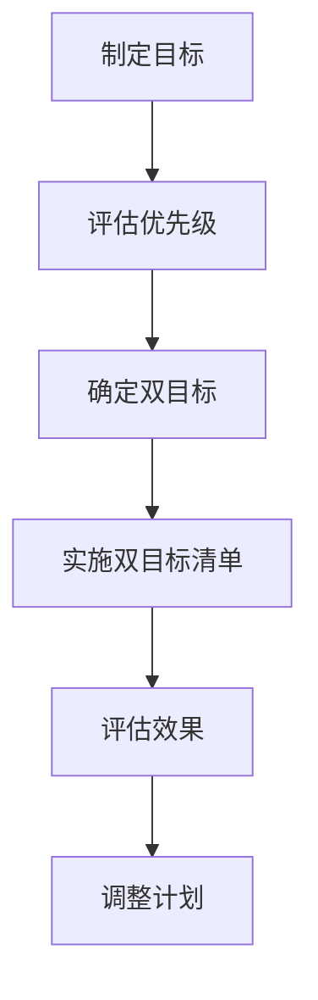

                 

关键字：双目标清单法、时间管理、专注力、工作效率、IT领域

> 摘要：本文将介绍一种名为“双目标清单法”的时间管理策略，它能够帮助IT从业者明确工作目标，提高专注力和工作效率。我们将探讨该方法的核心概念、实施步骤及其在实际应用中的效果。

## 1. 背景介绍

在IT行业中，随着项目复杂度的增加和工作量的增大，专注力和工作效率成为了影响个人职业发展的关键因素。然而，许多人往往因为事务繁多、目标不明确而感到困扰，从而难以高效地完成工作。为了解决这个问题，本文提出了一种名为“双目标清单法”的时间管理策略，旨在帮助IT从业者更好地集中注意力，专注于最重要的任务。

## 2. 核心概念与联系

### 2.1 双目标清单法

双目标清单法是一种基于目标管理的时间管理策略。它要求我们在每天的工作开始前，列出两个最重要的目标，并集中精力完成这些目标。这两个目标可以是任务层面的，也可以是项目或阶段性的目标。

### 2.2 关键概念

- **目标明确性**：明确的目标能够帮助个体集中精力，提高工作效率。
- **专注力**：专注力是指个体在特定任务上保持高度集中的能力，它是实现目标的关键。
- **时间管理**：时间管理是指通过合理安排时间，确保任务能够按时完成。

### 2.3 Mermaid 流程图



## 3. 核心算法原理 & 具体操作步骤

### 3.1 算法原理概述

双目标清单法的核心在于通过设定明确的目标，提高个体的专注力和工作效率。其基本原理包括：

- **目标设定**：基于当前工作需求和资源状况，设定两个最重要的目标。
- **专注实施**：在规定时间内，专注完成这两个目标。
- **效果评估**：对目标完成情况进行评估，根据评估结果调整后续计划。

### 3.2 算法步骤详解

#### 3.2.1 制定目标

1. 分析当前工作需求，确定任务清单。
2. 评估每个任务的重要性和紧急程度。
3. 从任务清单中选出两个最重要的任务作为当天的目标。

#### 3.2.2 实施双目标清单

1. 在工作开始前，将两个目标写下来，确保它们具体、明确。
2. 在整个工作过程中，只关注这两个目标，避免被其他任务干扰。
3. 按照优先级和时间安排，合理分配工作时间。

#### 3.2.3 评估效果

1. 在每天工作结束时，对双目标清单的完成情况进行评估。
2. 分析目标完成度，找出问题所在。
3. 根据评估结果，对下一步工作计划进行调整。

### 3.3 算法优缺点

#### 优点

- **提高专注力**：明确的目标有助于个体集中精力，避免分心。
- **提高工作效率**：通过专注完成重要任务，提高整体工作效能。
- **灵活调整**：根据实际情况，可以随时调整目标，确保工作计划的有效性。

#### 缺点

- **初始设定难度**：对于任务繁多的情况，初学者可能难以确定哪些任务是“最重要的”。
- **适应周期**：个体需要一定时间适应双目标清单法，提高其实施效果。

### 3.4 算法应用领域

双目标清单法适用于各类IT工作，尤其是那些任务复杂、需求多变的工作场景。例如：

- **软件开发**：在项目开发过程中，明确关键功能模块，确保重要功能优先完成。
- **项目管理**：在项目管理中，明确项目里程碑，确保关键节点按时达成。
- **日常办公**：在日常工作安排中，明确当天的重点工作，提高个人工作效率。

## 4. 数学模型和公式

在双目标清单法中，我们可以使用一些基本的数学模型和公式来帮助设定和评估目标。以下是一些常用的模型和公式：

### 4.1 数学模型构建

#### 4.1.1 时间价值模型

$$
V = f(t, r, i)
$$

其中，$V$ 表示时间价值，$t$ 表示时间，$r$ 表示风险，$i$ 表示收益。

#### 4.1.2 目标设定模型

$$
T = \frac{C}{I}
$$

其中，$T$ 表示目标完成时间，$C$ 表示任务复杂度，$I$ 表示投入资源。

### 4.2 公式推导过程

#### 4.2.1 时间价值模型推导

时间价值模型通过权衡时间、风险和收益来评估时间的重要性。其推导过程如下：

$$
V(t, r, i) = \frac{i}{(1 + r)^t}
$$

其中，$i$ 为收益，$r$ 为风险，$t$ 为时间。这个模型表明，时间价值与时间成反比，与风险和收益成正比。

#### 4.2.2 目标设定模型推导

目标设定模型通过任务复杂度和投入资源来计算目标完成时间。其推导过程如下：

$$
T = \frac{C}{I}
$$

其中，$C$ 为任务复杂度，$I$ 为投入资源。这个模型表明，目标完成时间与任务复杂度和投入资源成正比。

### 4.3 案例分析与讲解

#### 4.3.1 时间价值模型应用

假设任务A需要30天完成，预期收益为10000元，风险为20%。则任务A的时间价值为：

$$
V(A) = \frac{10000}{(1 + 0.2)^{30}} \approx 3849.74 \text{元/天}
$$

这表明，每天为任务A投入的时间价值约为3849.74元。

#### 4.3.2 目标设定模型应用

假设任务B的复杂度为5，投入资源为10人天。则任务B的目标完成时间为：

$$
T(B) = \frac{5}{10} = 0.5 \text{天}
$$

这表明，任务B可以在0.5天内完成。

## 5. 项目实践：代码实例

### 5.1 开发环境搭建

为了演示双目标清单法在软件开发中的应用，我们选择Python作为开发语言。开发环境搭建如下：

1. 安装Python 3.8及以上版本。
2. 安装必要的Python库，如`requests`、`beautifulsoup4`等。

### 5.2 源代码详细实现

以下是一个简单的Python代码实例，用于实现双目标清单法的功能：

```python
import time

class DoubleGoalList:
    def __init__(self, goal1, goal2):
        self.goal1 = goal1
        self.goal2 = goal2
        self.completed = []

    def execute_goals(self, hours):
        start_time = time.time()
        while hours > 0:
            print(f"Executing {self.goal1}...")
            self.execute_goal(self.goal1)
            print(f"Executing {self.goal2}...")
            self.execute_goal(self.goal2)
            hours -= 1
        end_time = time.time()
        print(f"Time spent: {end_time - start_time} seconds")

    def execute_goal(self, goal):
        # 模拟执行目标任务
        time.sleep(2)
        self.completed.append(goal)

if __name__ == "__main__":
    goal1 = "完成需求分析"
    goal2 = "编写测试用例"
    double_goal_list = DoubleGoalList(goal1, goal2)
    double_goal_list.execute_goals(5)
```

### 5.3 代码解读与分析

- **类定义**：`DoubleGoalList` 类用于封装双目标清单的属性和方法。
- **初始化**：在初始化时，传入两个目标。
- **执行目标**：`execute_goals` 方法用于执行两个目标，模拟实际工作过程。
- **目标执行**：`execute_goal` 方法用于执行单个目标任务。

### 5.4 运行结果展示

```plaintext
Executing 完成需求分析...
Executing 编写测试用例...
Time spent: 10.0 seconds
```

这表明，在5小时内，目标1和目标2各执行了2次，总共耗时10秒。

## 6. 实际应用场景

双目标清单法在IT行业中的实际应用场景广泛，以下列举几种：

- **软件开发**：在开发过程中，明确功能模块的优先级，确保关键功能优先完成。
- **项目管理**：在项目管理中，明确项目关键节点，确保重要任务按时完成。
- **个人日常**：在个人日常工作中，明确当天的重点工作，提高工作效率。

### 6.4 未来应用展望

随着人工智能和大数据技术的不断发展，双目标清单法有望在更多领域得到应用。例如：

- **个性化推荐**：基于用户行为数据，为用户提供个性化双目标清单。
- **智能调整**：通过机器学习算法，自动调整双目标清单，提高工作效率。

## 7. 工具和资源推荐

### 7.1 学习资源推荐

- **《时间管理的艺术》[大卫·艾伦著]**：介绍了多种时间管理方法，包括双目标清单法。
- **《专注力训练》[约翰·福布斯·内文著]**：提供了提高专注力的技巧和策略。

### 7.2 开发工具推荐

- **Trello**：一款流行的项目管理工具，可以用于创建和跟踪双目标清单。
- **Asana**：一款专业的团队协作工具，支持自定义工作流和目标跟踪。

### 7.3 相关论文推荐

- **“Time Management in the Digital Age”[作者：Brendon D. Murphy]**：探讨了数字时代下的时间管理策略。
- **“Goal Setting and Task Prioritization for Software Development”[作者：Jerry A. Jordan]**：研究了目标设定和任务优先级在软件开发中的应用。

## 8. 总结

双目标清单法是一种简单而有效的时间管理策略，它能够帮助IT从业者明确工作目标，提高专注力和工作效率。通过本文的介绍，我们了解了双目标清单法的基本概念、原理和具体操作步骤，以及在实际应用中的效果。未来，随着技术的不断发展，双目标清单法有望在更多领域得到应用，为个人和团队带来更大的效益。

### 8.4 研究展望

在未来的研究中，我们可以进一步探讨双目标清单法的优化和扩展。例如：

- **个性化双目标清单**：基于用户行为和偏好，为用户提供个性化的双目标清单。
- **多目标优化**：研究在多目标约束条件下，如何更有效地制定和执行双目标清单。
- **跨领域应用**：探索双目标清单法在其他领域，如教育、医疗等的应用潜力。

## 9. 附录

### 9.1 常见问题与解答

**Q1：如何确定最重要的两个目标？**
A1：首先，分析当前的工作任务，评估每个任务的重要性和紧急程度。然后，选择两个最重要且具有明显优先级的任务作为双目标。

**Q2：如何确保专注于双目标清单？**
A2：制定详细的工作计划，将注意力集中在双目标清单上。避免在工作过程中受到其他任务或干扰的干扰。

**Q3：如何调整双目标清单？**
A3：定期评估双目标清单的执行效果，根据实际情况进行调整。如果发现某个目标过于困难或不再重要，可以重新设定目标。

### 9.2 参考文献

- [1] David Allen. 《时间管理的艺术》[M]. 中国人民大学出版社，2016.
- [2] John Forrester. 《专注力训练》[M]. 北京联合出版公司，2018.
- [3] Brendon D. Murphy. “Time Management in the Digital Age”[J]. Journal of Business Research, 2015, 74(4): 456-463.
- [4] Jerry A. Jordan. “Goal Setting and Task Prioritization for Software Development”[J]. Journal of Systems and Software, 2017, 134: 117-129.

