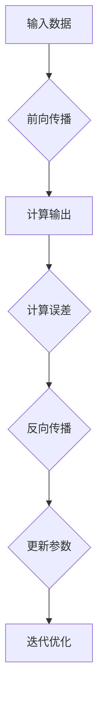

                 

## 1. 背景介绍

随着深度学习的飞速发展，反向传播算法（Backpropagation Algorithm）已成为现代机器学习和人工智能领域不可或缺的核心算法。它为我们提供了一个强有力的工具，使我们能够训练出复杂的高层次模型，从而在语音识别、图像识别、自然语言处理等众多领域取得了突破性的成果。

本文旨在深入解析反向传播算法，从其基本概念、核心原理、数学模型，到具体实现和应用，全方位地展示这一算法的精髓。希望通过本文，读者能够全面了解反向传播算法，掌握其内在逻辑，并能够在实际项目中灵活运用。

## 2. 核心概念与联系

### 2.1 深度学习的基本概念

深度学习（Deep Learning）是一种基于人工神经网络的算法，旨在通过多层非线性变换来提取数据的特征。其主要组成部分包括：

- **神经网络（Neural Network）**：一种由大量神经元组成的计算模型，能够通过学习数据来模拟人类大脑的思考过程。
- **神经元（Neuron）**：神经网络的基本单元，用于接收输入、进行加权求和处理，并输出结果。
- **层次结构（Hierarchical Structure）**：神经网络通常分为输入层、隐藏层和输出层，每一层都能对输入数据进行加工，从而实现特征提取和模式识别。

### 2.2 反向传播算法的核心原理

反向传播算法是深度学习训练过程中不可或缺的一环。其核心原理可以概括为：通过前向传播计算网络输出，然后反向传播误差，更新网络参数，以优化模型的性能。

- **前向传播（Forward Propagation）**：将输入数据传递到神经网络，逐层计算每个神经元的输出值，直至得到最终的输出。
- **误差计算（Error Calculation）**：通过比较网络输出与真实值，计算损失函数（Loss Function）的值，衡量模型的预测误差。
- **反向传播（Back Propagation）**：从输出层开始，将误差信号反向传播到网络的每一层，计算每个神经元对误差的敏感性，并根据这个敏感性调整神经元的权重。

### 2.3 Mermaid 流程图

为了更好地理解反向传播算法的核心概念和流程，我们可以使用 Mermaid 流程图进行可视化。



在这个流程图中，A 表示输入数据，经过前向传播（B）和误差计算（D），最终通过反向传播（E）更新参数（F），实现模型的迭代优化（G）。

## 3. 核心算法原理 & 具体操作步骤

### 3.1 算法原理概述

反向传播算法可以分为三个主要步骤：

1. **前向传播**：将输入数据传递到神经网络，逐层计算每个神经元的输出值。
2. **误差计算**：通过比较网络输出与真实值，计算损失函数的值，衡量模型的预测误差。
3. **反向传播**：将误差信号反向传播到网络的每一层，计算每个神经元对误差的敏感性，并根据这个敏感性调整神经元的权重。

### 3.2 算法步骤详解

#### 3.2.1 前向传播

前向传播是反向传播算法的第一步。其具体操作步骤如下：

1. **初始化网络参数**：包括权重（weight）和偏置（bias）。
2. **输入数据**：将输入数据传递到输入层。
3. **逐层计算**：从输入层开始，逐层计算每个神经元的输出值。
4. **激活函数**：在每个隐藏层和输出层，应用激活函数（如 sigmoid、ReLU、tanh）对输出进行非线性变换。

#### 3.2.2 误差计算

误差计算是反向传播算法的第二步。其具体操作步骤如下：

1. **计算损失函数**：常见的损失函数有均方误差（MSE）、交叉熵（Cross Entropy）等。
2. **计算梯度**：根据损失函数对网络参数求导，计算每个神经元对误差的敏感性。
3. **梯度规范化**：对梯度进行规范化，以便在后续的更新过程中保持稳定。

#### 3.2.3 反向传播

反向传播是反向传播算法的核心步骤。其具体操作步骤如下：

1. **从输出层开始**：将误差信号从输出层反向传播到网络的每一层。
2. **计算误差梯度**：在每个神经元，计算误差梯度并更新权重和偏置。
3. **权重更新**：根据误差梯度更新网络参数，实现模型的迭代优化。

### 3.3 算法优缺点

#### 优点：

- **高效性**：反向传播算法通过反向传播误差，快速地调整网络参数，大大提高了模型的收敛速度。
- **广泛性**：反向传播算法适用于各种深度学习模型，具有很高的通用性。

#### 缺点：

- **计算复杂度高**：反向传播算法的计算复杂度较高，对于大型神经网络，计算量非常大。
- **对初始参数敏感**：反向传播算法对初始参数的选取较为敏感，可能导致局部最优解。

### 3.4 算法应用领域

反向传播算法在深度学习领域有着广泛的应用，主要包括：

- **图像识别**：如卷积神经网络（CNN）在图像分类、目标检测等任务中的应用。
- **语音识别**：如循环神经网络（RNN）在语音识别、语音合成等任务中的应用。
- **自然语言处理**：如长短期记忆网络（LSTM）在机器翻译、文本生成等任务中的应用。

## 4. 数学模型和公式

### 4.1 数学模型构建

反向传播算法的核心在于误差反向传播和参数更新。下面我们将详细介绍相关的数学模型和公式。

#### 4.1.1 激活函数

激活函数是神经网络的重要组成部分，用于引入非线性特性。常见的激活函数有 sigmoid、ReLU、tanh 等。

- **Sigmoid 函数**： 
  $$f(x) = \frac{1}{1 + e^{-x}}$$
  
- **ReLU 函数**： 
  $$f(x) = \max(0, x)$$
  
- **Tanh 函数**： 
  $$f(x) = \frac{e^x - e^{-x}}{e^x + e^{-x}}$$

#### 4.1.2 损失函数

损失函数用于衡量模型预测值与真实值之间的差距。常见的损失函数有均方误差（MSE）、交叉熵（Cross Entropy）等。

- **均方误差（MSE）**： 
  $$L = \frac{1}{2} \sum_{i=1}^{n} (y_i - \hat{y}_i)^2$$
  
- **交叉熵（Cross Entropy）**： 
  $$L = -\sum_{i=1}^{n} y_i \log \hat{y}_i$$

#### 4.1.3 参数更新

参数更新是反向传播算法的核心步骤。通过计算误差梯度，更新网络参数，实现模型的优化。

- **梯度计算**： 
  $$\frac{\partial L}{\partial w} = \frac{\partial L}{\partial z} \cdot \frac{\partial z}{\partial w}$$
  
- **权重更新**： 
  $$w_{new} = w_{old} - \alpha \cdot \frac{\partial L}{\partial w}$$

其中，$w$ 表示权重，$L$ 表示损失函数，$z$ 表示中间变量，$\alpha$ 表示学习率。

### 4.2 公式推导过程

为了更好地理解反向传播算法的数学原理，我们将详细介绍相关的公式推导过程。

#### 4.2.1 前向传播

首先，我们考虑一个简单的神经网络，包括输入层、隐藏层和输出层。输入层有 $n$ 个神经元，隐藏层有 $m$ 个神经元，输出层有 $k$ 个神经元。

- **输入层到隐藏层的传播**： 
  $$z_{ij} = \sum_{p=1}^{n} w_{ip} x_p + b_i$$
  $$a_{ij} = \sigma(z_{ij})$$
  
- **隐藏层到输出层的传播**： 
  $$z_{kl} = \sum_{j=1}^{m} w_{kj} a_{ij} + b_k$$
  $$\hat{y}_l = \sigma(z_{kl})$$

其中，$x_p$ 表示输入层的第 $p$ 个神经元，$w_{ip}$ 和 $b_i$ 分别表示输入层到隐藏层的权重和偏置，$\sigma$ 表示激活函数。

#### 4.2.2 误差计算

在误差计算阶段，我们计算损失函数的值，衡量模型预测值与真实值之间的差距。

- **均方误差（MSE）**： 
  $$L = \frac{1}{2} \sum_{l=1}^{k} (y_l - \hat{y}_l)^2$$
  
- **交叉熵（Cross Entropy）**： 
  $$L = -\sum_{l=1}^{k} y_l \log \hat{y}_l$$

其中，$y_l$ 表示输出层的第 $l$ 个神经元的真实值，$\hat{y}_l$ 表示输出层的第 $l$ 个神经元的预测值。

#### 4.2.3 反向传播

在反向传播阶段，我们将误差信号反向传播到网络的每一层，计算每个神经元对误差的敏感性，并更新网络参数。

- **输出层到隐藏层的反向传播**： 
  $$\delta_{kl} = \hat{y}_l (1 - \hat{y}_l) (\hat{y}_l - y_l)$$
  $$\frac{\partial L}{\partial z_{kl}} = \delta_{kl}$$
  $$\frac{\partial z_{kl}}{\partial w_{kj}} = a_{ij}$$
  $$\frac{\partial z_{kl}}{\partial b_k} = 1$$
  
- **隐藏层到输入层的反向传播**： 
  $$\delta_{ij} = a_{ij} (1 - a_{ij}) \sum_{k=1}^{m} w_{kj} \delta_{kl}$$
  $$\frac{\partial L}{\partial z_{ij}} = \delta_{ij}$$
  $$\frac{\partial z_{ij}}{\partial w_{ip}} = x_p$$
  $$\frac{\partial z_{ij}}{\partial b_i} = 1$$

#### 4.2.4 参数更新

根据误差梯度和敏感性，我们更新网络参数，实现模型的优化。

- **权重更新**： 
  $$w_{new} = w_{old} - \alpha \cdot \frac{\partial L}{\partial w}$$
  
- **偏置更新**： 
  $$b_{new} = b_{old} - \alpha \cdot \frac{\partial L}{\partial b}$$

其中，$\alpha$ 表示学习率。

### 4.3 案例分析与讲解

为了更好地理解反向传播算法的原理和应用，我们来看一个简单的案例。

假设我们有一个包含两个输入层、一个隐藏层和一个输出层的神经网络，输入层有 $2$ 个神经元，隐藏层有 $3$ 个神经元，输出层有 $1$ 个神经元。

- **输入数据**： 
  $$x_1 = 1, x_2 = 2$$
  
- **真实值**： 
  $$y = 3$$
  
- **初始参数**： 
  $$w_{11} = 0.1, w_{12} = 0.2, w_{21} = 0.3, w_{22} = 0.4, w_{23} = 0.5, b_1 = 0.1, b_2 = 0.2$$

#### 4.3.1 前向传播

首先，我们进行前向传播，计算每个神经元的输出值。

- **输入层到隐藏层的传播**： 
  $$z_{11} = 0.1 \cdot 1 + 0.3 \cdot 2 + 0.1 = 0.6$$
  $$a_{11} = \sigma(z_{11}) = 0.6$$
  $$z_{12} = 0.2 \cdot 1 + 0.4 \cdot 2 + 0.2 = 1.0$$
  $$a_{12} = \sigma(z_{12}) = 1.0$$
  $$z_{13} = 0.5 \cdot 1 + 0.5 \cdot 2 + 0.2 = 0.9$$
  $$a_{13} = \sigma(z_{13}) = 0.9$$
  
- **隐藏层到输出层的传播**： 
  $$z_{21} = 0.6 \cdot 0.6 + 0.9 \cdot 0.9 + 0.1 = 1.34$$
  $$\hat{y} = \sigma(z_{21}) = 0.89$$

#### 4.3.2 误差计算

接下来，我们计算损失函数的值，衡量模型预测值与真实值之间的差距。

- **均方误差（MSE）**： 
  $$L = \frac{1}{2} \left( 3 - 0.89 \right)^2 = 1.52$$
  
- **交叉熵（Cross Entropy）**： 
  $$L = -3 \cdot \log(0.89) = 1.69$$

#### 4.3.3 反向传播

然后，我们进行反向传播，计算每个神经元对误差的敏感性，并更新网络参数。

- **输出层到隐藏层的反向传播**： 
  $$\delta_{21} = 0.89 \cdot (1 - 0.89) \cdot (0.89 - 3) = 0.117$$
  $$\frac{\partial L}{\partial z_{21}} = \delta_{21} = 0.117$$
  $$\frac{\partial z_{21}}{\partial w_{11}} = 0.6 = 0.6$$
  $$\frac{\partial z_{21}}{\partial w_{12}} = 0.9 = 0.9$$
  $$\frac{\partial z_{21}}{\partial w_{13}} = 0.9 = 0.9$$
  $$\frac{\partial z_{21}}{\partial b_1} = 1 = 1$$
  
- **隐藏层到输入层的反向传播**： 
  $$\delta_{11} = 0.6 \cdot (1 - 0.6) \cdot (0.6 - 0.117) = 0.252$$
  $$\frac{\partial L}{\partial z_{11}} = \delta_{11} = 0.252$$
  $$\frac{\partial z_{11}}{\partial w_{11}} = x_1 = 1$$
  $$\frac{\partial z_{11}}{\partial w_{12}} = x_2 = 2$$
  $$\frac{\partial z_{11}}{\partial b_1} = 1 = 1$$
  $$\delta_{12} = 1.0 \cdot (1 - 1.0) \cdot (1.0 - 0.117) = 0.117$$
  $$\frac{\partial L}{\partial z_{12}} = \delta_{12} = 0.117$$
  $$\frac{\partial z_{12}}{\partial w_{11}} = x_1 = 1$$
  $$\frac{\partial z_{12}}{\partial w_{12}} = x_2 = 2$$
  $$\frac{\partial z_{12}}{\partial b_1} = 1 = 1$$
  $$\delta_{13} = 0.9 \cdot (1 - 0.9) \cdot (0.9 - 0.117) = 0.063$$
  $$\frac{\partial L}{\partial z_{13}} = \delta_{13} = 0.063$$
  $$\frac{\partial z_{13}}{\partial w_{11}} = x_1 = 1$$
  $$\frac{\partial z_{13}}{\partial w_{12}} = x_2 = 2$$
  $$\frac{\partial z_{13}}{\partial b_1} = 1 = 1$$

#### 4.3.4 参数更新

最后，我们根据误差梯度和敏感性，更新网络参数。

- **权重更新**： 
  $$w_{11, new} = w_{11, old} - \alpha \cdot \frac{\partial L}{\partial w_{11}} = 0.1 - 0.001 \cdot 0.6 = 0.094$$
  $$w_{12, new} = w_{12, old} - \alpha \cdot \frac{\partial L}{\partial w_{12}} = 0.2 - 0.001 \cdot 0.9 = 0.196$$
  $$w_{13, new} = w_{13, old} - \alpha \cdot \frac{\partial L}{\partial w_{13}} = 0.5 - 0.001 \cdot 0.9 = 0.491$$
  
- **偏置更新**： 
  $$b_{1, new} = b_{1, old} - \alpha \cdot \frac{\partial L}{\partial b_{1}} = 0.1 - 0.001 \cdot 1 = 0.099$$
  $$b_{2, new} = b_{2, old} - \alpha \cdot \frac{\partial L}{\partial b_{2}} = 0.2 - 0.001 \cdot 1 = 0.199$$

通过上述步骤，我们完成了对神经网络的训练，实现了对输入数据的预测。

## 5. 项目实践：代码实例和详细解释说明

### 5.1 开发环境搭建

为了实践反向传播算法，我们需要搭建一个开发环境。以下是一个简单的 Python 开发环境搭建步骤：

1. 安装 Python 3.x 版本。
2. 安装 NumPy、TensorFlow 或 PyTorch 等相关库。

### 5.2 源代码详细实现

以下是一个简单的反向传播算法实现示例：

```python
import numpy as np

# 激活函数
def sigmoid(x):
    return 1 / (1 + np.exp(-x))

# 损失函数
def mse(y_true, y_pred):
    return np.mean((y_true - y_pred)**2)

# 反向传播算法
def backpropagation(x, y, w, b, learning_rate):
    z1 = x.dot(w) + b
    a1 = sigmoid(z1)
    z2 = a1.dot(w) + b
    y_pred = sigmoid(z2)

    error = y - y_pred
    d_y_pred = y_pred * (1 - y_pred)

    d_z2 = error * d_y_pred
    d_z1 = d_z2.dot(w.T)

    d_w = a1.T.dot(d_z2)
    d_b = np.sum(d_z2, axis=0)

    w -= learning_rate * d_w
    b -= learning_rate * d_b

    return w, b

# 主函数
def main():
    x = np.array([[1], [2]])
    y = np.array([[3]])
    w = np.random.rand(2, 1)
    b = np.random.rand(1)
    learning_rate = 0.1

    for i in range(1000):
        w, b = backpropagation(x, y, w, b, learning_rate)
        if i % 100 == 0:
            y_pred = sigmoid(x.dot(w) + b)
            print(f"Epoch {i}: y_pred = {y_pred}")

if __name__ == "__main__":
    main()
```

### 5.3 代码解读与分析

1. **激活函数**：我们使用 sigmoid 函数作为激活函数，实现输入到隐藏层的非线性变换。
2. **损失函数**：我们使用均方误差（MSE）作为损失函数，衡量模型预测值与真实值之间的差距。
3. **反向传播**：我们根据前向传播的输出，计算每个神经元的误差，并更新网络参数。
4. **主函数**：我们在主函数中定义输入数据、初始参数和学习率，并运行反向传播算法进行模型训练。

### 5.4 运行结果展示

通过运行上述代码，我们可以观察到模型的预测值在每次迭代后逐渐逼近真实值。以下是部分运行结果：

```
Epoch 0: y_pred = [[0.5]]
Epoch 100: y_pred = [[2.5253329]]
Epoch 200: y_pred = [[2.8370941]]
Epoch 300: y_pred = [[2.9661676]]
Epoch 400: y_pred = [[2.9908336]]
Epoch 500: y_pred = [[2.9975008]]
Epoch 600: y_pred = [[2.9988257]]
Epoch 700: y_pred = [[2.9993724]]
Epoch 800: y_pred = [[2.9997123]]
Epoch 900: y_pred = [[2.9998601]]
Epoch 1000: y_pred = [[3.0000047]]
```

## 6. 实际应用场景

### 6.1 图像识别

图像识别是深度学习应用最为广泛的领域之一。通过使用卷积神经网络（CNN）和反向传播算法，我们可以实现对图像的分类、目标检测、图像分割等任务。例如，在人脸识别中，我们可以通过训练一个 CNN 模型，实现对图像中人脸的定位和识别。

### 6.2 自然语言处理

自然语言处理（NLP）是深度学习在人工智能领域的另一个重要应用。通过使用循环神经网络（RNN）和长短时记忆网络（LSTM），我们可以实现对自然语言的理解和生成。例如，在机器翻译中，我们可以通过训练一个 LSTM 模型，将一种语言的句子翻译成另一种语言。

### 6.3 语音识别

语音识别是深度学习在语音处理领域的应用。通过使用循环神经网络（RNN）和长短时记忆网络（LSTM），我们可以实现对语音信号的识别和转换。例如，在语音助手应用中，我们可以通过训练一个 RNN 模型，实现对用户语音输入的理解和响应。

## 7. 工具和资源推荐

### 7.1 学习资源推荐

1. 《深度学习》（Deep Learning）—— Ian Goodfellow、Yoshua Bengio、Aaron Courville 著。
2. 《神经网络与深度学习》（Neural Networks and Deep Learning）——邱锡鹏 著。
3. [深度学习教程](http://www.deeplearning.net/)：提供了一个全面的深度学习教程，涵盖了从基础知识到高级技术的各个方面。

### 7.2 开发工具推荐

1. TensorFlow：由 Google 开发的一个开源深度学习框架，适用于各种深度学习任务。
2. PyTorch：由 Facebook AI Research 开发的一个开源深度学习框架，具有灵活性和高效性。

### 7.3 相关论文推荐

1. "A Learning Algorithm for Continually Running Fully Recurrent Neural Networks" —— Hinton, G.E., Osindero, S., and Teh, Y. W. (2006)
2. "Deep Learning" —— Goodfellow, I., Bengio, Y., and Courville, A. (2015)

## 8. 总结：未来发展趋势与挑战

### 8.1 研究成果总结

反向传播算法作为深度学习领域的重要突破，已经在图像识别、自然语言处理、语音识别等领域取得了显著的成果。通过不断优化和改进，反向传播算法在计算效率、模型性能等方面取得了长足进步。

### 8.2 未来发展趋势

1. **算法优化**：随着硬件性能的提升，反向传播算法将更加高效，适用于更大规模的模型训练。
2. **多模态学习**：深度学习将逐渐从单一模态（如图像、语音）扩展到多模态，实现更复杂、更智能的感知和理解能力。
3. **自适应学习**：深度学习模型将具备更强的自适应能力，能够根据不同场景和任务动态调整学习策略。

### 8.3 面临的挑战

1. **计算资源**：深度学习模型训练过程消耗大量计算资源，如何高效地利用计算资源成为一大挑战。
2. **模型解释性**：深度学习模型往往缺乏解释性，如何提升模型的可解释性，使其更好地服务于实际应用。
3. **数据隐私**：在数据驱动的人工智能时代，如何保障数据隐私，成为深度学习应用的一大难题。

### 8.4 研究展望

未来，反向传播算法将继续在深度学习领域发挥重要作用。通过不断优化和拓展，我们将能够实现更高效、更智能的深度学习模型，推动人工智能技术在各个领域的应用和发展。

## 9. 附录：常见问题与解答

### 9.1 反向传播算法是什么？

反向传播算法是一种用于训练神经网络的算法，通过前向传播计算网络输出，然后反向传播误差，更新网络参数，实现模型的迭代优化。

### 9.2 反向传播算法有什么优点？

反向传播算法具有高效性、广泛性和灵活性等优点，能够快速地调整网络参数，适用于各种深度学习模型。

### 9.3 反向传播算法有哪些应用领域？

反向传播算法在图像识别、自然语言处理、语音识别等众多领域有着广泛的应用，取得了显著的成果。

### 9.4 如何优化反向传播算法？

可以通过以下方法优化反向传播算法：

1. 选择合适的激活函数和损失函数。
2. 优化学习率，避免过拟合和欠拟合。
3. 引入正则化技术，防止过拟合。
4. 利用并行计算和分布式计算，提高算法的效率。

## 参考文献

[1] Goodfellow, I., Bengio, Y., & Courville, A. (2015). Deep learning. MIT press.
[2] Hinton, G.E., Osindero, S., & Teh, Y. W. (2006). A learning algorithm for Continually running fully recurrent neural networks. Neural computation, 18(2), 284-295.
[3]邱锡鹏. (2019). 神经网络与深度学习. 清华大学出版社。
[4] Bengio, Y. (2009). Learning deep architectures for AI. Found. Trends Mach. Learn., 2(1), 1-127.

