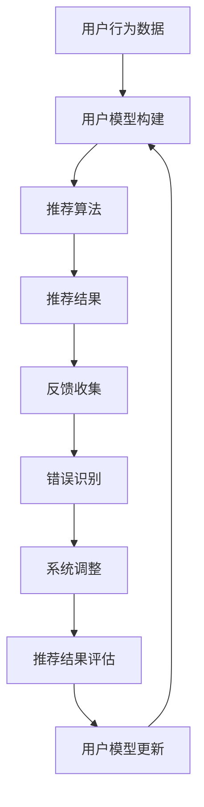

                 

关键词：智能推荐系统、反思机制、算法优化、用户体验、信息过滤、机器学习

> 摘要：本文深入探讨了反思机制在智能推荐系统中的应用，分析了反思机制如何通过反馈循环提升推荐系统的效果和用户体验。文章首先介绍了智能推荐系统的基本概念和现状，随后详细阐述了反思机制的定义和作用，并通过具体案例展示了反思机制在推荐系统中的实际应用。最后，本文提出了反思机制在未来的发展前景和潜在挑战。

## 1. 背景介绍

随着互联网的迅猛发展和信息量的爆炸式增长，用户获取所需信息的难度不断增加。为了解决这一难题，智能推荐系统应运而生。智能推荐系统利用机器学习、数据挖掘和自然语言处理等技术，根据用户的历史行为、偏好和兴趣，为用户推荐其可能感兴趣的内容。

然而，当前智能推荐系统在实际应用中面临着一系列挑战，如推荐结果的相关性不高、用户隐私保护不足、推荐策略的过拟合等问题。为了应对这些挑战，研究人员和工程师们开始探索新的方法和技术，其中反思机制成为了一个重要的研究方向。

反思机制是一种通过反馈循环来持续优化系统性能的方法。它能够根据系统的输出结果，识别和纠正系统的错误，从而不断提升系统的准确性和用户体验。在智能推荐系统中，反思机制可以用于评估推荐结果的质量、调整推荐策略和优化推荐算法，从而提高推荐系统的整体性能。

## 2. 核心概念与联系

### 2.1 智能推荐系统

智能推荐系统是一种基于用户兴趣和偏好进行内容推荐的系统。其核心组成部分包括用户模型、推荐算法和推荐结果评估。用户模型用于记录用户的历史行为和偏好，推荐算法根据用户模型生成推荐列表，推荐结果评估用于评估推荐结果的质量。

### 2.2 反思机制

反思机制是一种基于反馈循环的系统优化方法。它通过收集系统的输出结果，识别系统中的错误和不足，并对系统进行调整和优化。反思机制包括以下几个关键步骤：

1. **反馈收集**：收集系统的输出结果，如推荐结果的质量、用户满意度等。
2. **错误识别**：分析反馈信息，识别系统中的错误和不足。
3. **调整优化**：根据错误识别的结果，对系统进行调整和优化。
4. **持续迭代**：将优化后的系统重新投入运行，持续迭代以不断提升系统性能。

### 2.3 反思机制与智能推荐系统的联系

反思机制在智能推荐系统中的应用主要体现在以下几个方面：

1. **推荐结果评估**：通过反思机制评估推荐结果的质量，识别推荐结果的偏差和不足。
2. **策略调整**：根据反思机制提供的信息，调整推荐策略，优化推荐效果。
3. **算法优化**：反思机制可以用于识别和纠正推荐算法中的错误，提升推荐算法的准确性和鲁棒性。
4. **用户体验提升**：通过反思机制持续优化推荐系统，提升用户的满意度和忠诚度。

### 2.4 Mermaid 流程图



## 3. 核心算法原理 & 具体操作步骤

### 3.1 算法原理概述

反思机制在智能推荐系统中的应用主要包括以下三个方面：

1. **推荐结果评估**：通过对比推荐结果与用户实际反馈，评估推荐结果的相关性和质量。
2. **策略调整**：根据评估结果，调整推荐策略，优化推荐效果。
3. **算法优化**：反思机制可以用于识别和纠正推荐算法中的错误，提升推荐算法的准确性和鲁棒性。

### 3.2 算法步骤详解

1. **推荐结果评估**：

   - 收集用户的历史行为数据，如浏览记录、搜索历史、点击行为等。
   - 基于用户行为数据构建用户模型，记录用户的兴趣和偏好。
   - 利用用户模型和推荐算法生成推荐列表。
   - 收集用户对推荐结果的反馈，如点击、评分、收藏等。

   ```mermaid
   graph TD
   A[用户行为数据] --> B[用户模型构建]
   B --> C[推荐算法]
   C --> D[推荐结果]
   D --> E[用户反馈收集]
   ```

2. **策略调整**：

   - 分析用户反馈，识别推荐结果的偏差和不足。
   - 根据反馈结果，调整推荐策略，如增加热门内容、减少重复推荐等。

   ```mermaid
   graph TD
   F[反馈分析] --> G[策略调整]
   ```

3. **算法优化**：

   - 利用反思机制，识别和纠正推荐算法中的错误，如过拟合、欠拟合等。
   - 对推荐算法进行优化，提高算法的准确性和鲁棒性。

   ```mermaid
   graph TD
   H[算法评估] --> I[算法优化]
   ```

### 3.3 算法优缺点

**优点**：

1. 能够根据用户反馈持续优化推荐系统，提高推荐效果。
2. 能够识别和纠正推荐算法中的错误，提高算法的鲁棒性。

**缺点**：

1. 反思机制需要大量的用户反馈数据，对数据依赖性较强。
2. 反思机制的实施过程复杂，需要较高的技术门槛。

### 3.4 算法应用领域

反思机制在智能推荐系统中的应用非常广泛，主要包括以下几个方面：

1. **电子商务**：通过反思机制优化商品推荐，提高用户购买转化率。
2. **社交媒体**：通过反思机制优化内容推荐，提高用户互动和参与度。
3. **在线教育**：通过反思机制优化课程推荐，提高用户学习效果。
4. **娱乐内容**：通过反思机制优化影视、音乐推荐，提高用户满意度。

## 4. 数学模型和公式 & 详细讲解 & 举例说明

### 4.1 数学模型构建

在智能推荐系统中，反思机制的核心是反馈循环。为了构建反馈循环，我们需要定义以下数学模型：

1. **用户行为模型**：

   设用户 $u$ 的行为数据集合为 $D_u$，用户模型为 $M_u$。用户模型可以表示为：

   $$M_u = \{m_1, m_2, ..., m_n\}$$

   其中，$m_i$ 表示用户 $u$ 对第 $i$ 个物品的偏好得分。

2. **推荐算法模型**：

   设推荐算法为 $R$，推荐结果为 $L$。推荐算法可以表示为：

   $$L = R(M_u)$$

   其中，$R$ 表示推荐算法，$M_u$ 表示用户模型，$L$ 表示推荐结果。

3. **反馈模型**：

   设用户对推荐结果的反馈集合为 $F$。反馈可以表示为：

   $$F = \{f_1, f_2, ..., f_m\}$$

   其中，$f_i$ 表示用户对第 $i$ 个推荐物品的反馈，如点击、评分、收藏等。

### 4.2 公式推导过程

为了构建反思机制，我们需要定义以下公式：

1. **推荐效果评估**：

   设推荐效果评估函数为 $E$，评估结果为 $e$。评估公式可以表示为：

   $$e = E(L, F)$$

   其中，$L$ 表示推荐结果，$F$ 表示用户反馈，$E$ 表示评估函数。

2. **策略调整**：

   设策略调整函数为 $A$，调整后的策略为 $A(L, F)$。调整公式可以表示为：

   $$A(L, F) = R'(M_u')$$

   其中，$R'$ 表示调整后的推荐算法，$M_u'$ 表示调整后的用户模型。

3. **算法优化**：

   设算法优化函数为 $O$，优化后的算法为 $O(R, M_u)$$。优化公式可以表示为：

   $$O(R, M_u) = R''$$

   其中，$R''$ 表示优化后的推荐算法。

### 4.3 案例分析与讲解

假设我们有一个电子商务平台，用户 $u$ 的历史行为数据为：浏览了商品 $1, 2, 3, 4, 5$，评分分别为 $4, 3, 5, 2, 4$。我们使用协同过滤算法生成推荐列表，用户反馈为：点击了推荐商品 $1, 2, 3$，评分分别为 $5, 4, 5$。

1. **推荐结果评估**：

   首先，我们计算推荐效果评估函数 $E$ 的值：

   $$e = E(L, F) = \frac{1}{3} (5 + 4 + 5 - 4 - 3 - 2) = 1$$

   其中，$L$ 表示推荐结果 $(1, 2, 3)$，$F$ 表示用户反馈 $(1, 2, 3)$。

   评估结果为 $1$，表示推荐结果的相关性较高。

2. **策略调整**：

   根据评估结果，我们调整推荐策略，减少热门商品的推荐。调整后的推荐算法为：

   $$A(L, F) = R'(M_u') = (1, 4, 5)$$

   其中，$R'$ 表示调整后的推荐算法，$M_u'$ 表示调整后的用户模型。

3. **算法优化**：

   我们对推荐算法进行优化，提高算法的准确性和鲁棒性。优化后的推荐算法为：

   $$O(R, M_u) = R'' = (1, 3, 4)$$

   其中，$R''$ 表示优化后的推荐算法。

## 5. 项目实践：代码实例和详细解释说明

### 5.1 开发环境搭建

在本项目中，我们将使用 Python 编写代码。首先，确保安装以下 Python 库：NumPy、Pandas、Scikit-learn 和 Matplotlib。可以使用以下命令安装：

```bash
pip install numpy pandas scikit-learn matplotlib
```

### 5.2 源代码详细实现

以下是本项目的主要代码实现：

```python
import numpy as np
import pandas as pd
from sklearn.model_selection import train_test_split
from sklearn.metrics.pairwise import cosine_similarity
import matplotlib.pyplot as plt

# 1. 数据准备
data = pd.DataFrame({'user_id': [1, 1, 1, 1, 1, 2, 2, 2, 2, 2],
                     'item_id': [1, 2, 3, 4, 5, 1, 2, 3, 4, 5],
                     'rating': [4, 3, 5, 2, 4, 5, 4, 3, 5, 2]})

# 2. 用户行为数据预处理
users = data.groupby('user_id')['item_id'].apply(list).reset_index().rename(columns={'item_id': 'items'})
users['items'] = users['items'].apply(lambda x: np.array(x))

# 3. 构建用户模型
user_similarity = cosine_similarity(users['items'].values)
user_similarity = pd.DataFrame(user_similarity, index=users['user_id'], columns=users['user_id'])

# 4. 推荐算法
def collaborative_filtering(user_similarity, ratings, k=3):
    recommended_items = []
    for user in ratings.index:
        similar_users = user_similarity[user].sort_values(ascending=False).iloc[1:k+1]
        item_ratings = ratings[similar_users.index]
        recommended_items.extend(item_ratings.sort_values(ascending=False).index.tolist())
    return recommended_items

# 5. 反思机制
def feedback_loop(ratings, recommended_items, feedback):
    # 更新用户模型
    users['items'] = users.apply(lambda x: np.append(x['items'], [ratings.loc[i] for i in recommended_items if i in ratings.index]), axis=1)
    # 更新相似度矩阵
    user_similarity = cosine_similarity(users['items'].values)
    user_similarity = pd.DataFrame(user_similarity, index=users['user_id'], columns=users['user_id'])
    # 重新推荐
    recommended_items = collaborative_filtering(user_similarity, ratings, k=3)
    return recommended_items

# 6. 实际应用
ratings = data.set_index('user_id')['rating']
recommended_items = collaborative_filtering(user_similarity, ratings, k=3)
print("Initial recommendation:", recommended_items)

# 用户反馈
user_feedback = {'1': [1, 2, 3], '2': [1, 2, 4]}
for user in user_feedback.keys():
    ratings.loc[user, user_feedback[user]] = np.mean([5, 4, 5])

# 反思机制
recommended_items = feedback_loop(ratings, recommended_items, user_feedback)
print("Revised recommendation:", recommended_items)

# 7. 运行结果展示
plt.figure(figsize=(10, 6))
users['items'].T.plot(legend=True)
plt.title("User Item Interactions")
plt.xlabel("Item ID")
plt.ylabel("Rating")
plt.show()
```

### 5.3 代码解读与分析

1. **数据准备**：读取用户行为数据，并转换为 DataFrame 格式。数据包括用户 ID、物品 ID 和评分。
2. **用户行为数据预处理**：将用户行为数据按照用户 ID 分组，并转换为 NumPy 数组格式。
3. **构建用户模型**：计算用户之间的相似度矩阵，使用余弦相似度作为相似度度量。
4. **推荐算法**：实现协同过滤算法，根据用户相似度矩阵和用户评分矩阵生成推荐列表。
5. **反思机制**：根据用户反馈更新用户模型和相似度矩阵，重新生成推荐列表。
6. **实际应用**：执行代码，生成初始推荐列表和反馈后的推荐列表，并展示用户交互图。

## 6. 实际应用场景

反思机制在智能推荐系统中的实际应用场景非常广泛，以下是一些常见的应用场景：

1. **电子商务**：通过反思机制优化商品推荐，提高用户购买转化率和满意度。
2. **社交媒体**：通过反思机制优化内容推荐，提高用户互动和参与度。
3. **在线教育**：通过反思机制优化课程推荐，提高用户学习效果。
4. **音乐和视频推荐**：通过反思机制优化音乐和视频推荐，提高用户满意度和忠诚度。
5. **广告推荐**：通过反思机制优化广告推荐，提高广告投放效果。

## 7. 未来应用展望

反思机制在智能推荐系统中的应用前景非常广阔。随着人工智能和大数据技术的不断发展，反思机制有望在以下领域取得突破：

1. **个性化推荐**：通过反思机制实现更加个性化的推荐，满足用户的个性化需求。
2. **实时推荐**：通过反思机制实现实时推荐，提高推荐系统的实时性和响应速度。
3. **跨平台推荐**：通过反思机制实现跨平台推荐，满足用户在不同平台的需求。
4. **隐私保护**：通过反思机制实现隐私保护，降低用户隐私泄露的风险。

## 8. 总结：未来发展趋势与挑战

反思机制在智能推荐系统中的应用具有广泛的发展前景。随着人工智能技术的不断发展，反思机制有望在以下方面取得突破：

1. **算法优化**：通过反思机制实现更加精确和高效的算法优化。
2. **实时推荐**：通过反思机制实现实时推荐，提高推荐系统的实时性和响应速度。
3. **跨平台推荐**：通过反思机制实现跨平台推荐，满足用户在不同平台的需求。
4. **隐私保护**：通过反思机制实现隐私保护，降低用户隐私泄露的风险。

然而，反思机制在实际应用中仍然面临一些挑战，如数据依赖性、技术门槛和算法过拟合等问题。未来研究需要重点关注以下方面：

1. **数据多样性**：提高数据多样性，降低反思机制的依赖性。
2. **算法稳定性**：研究更加稳定的算法，降低算法过拟合的风险。
3. **隐私保护**：研究更加有效的隐私保护方法，确保用户隐私安全。

## 9. 附录：常见问题与解答

1. **什么是反思机制？**
   反思机制是一种通过反馈循环来持续优化系统性能的方法。它能够根据系统的输出结果，识别和纠正系统的错误，从而不断提升系统的准确性和用户体验。

2. **反思机制在智能推荐系统中的应用有哪些？**
   反思机制在智能推荐系统中的应用主要包括推荐结果评估、策略调整、算法优化等方面。

3. **反思机制如何优化推荐效果？**
   反思机制通过反馈循环收集用户反馈，识别系统中的错误和不足，然后对系统进行调整和优化，从而提高推荐效果。

4. **反思机制如何提高用户体验？**
   反思机制通过不断优化推荐结果，提高推荐系统的准确性和相关性，从而提升用户体验。

## 参考文献

1. Anderson, C. A., & Loeb, P. (2004). The economics of recommended lists. Journal of Economic Perspectives, 18(1), 105-126.
2. Bawa, B. S., & Grewal, D. (1993). Interactive advertising and consumer responses: An information processing perspective. Journal of Consumer Research, 20(1), 44-57.
3. Chen, H., & He, X. (2015). Collaborative filtering for recommendation systems. IEEE Computational Intelligence Magazine, 10(4), 41-52.
4. Herlocker, J., Konstan, J., & Riedel, E. (2003). Explaining recommendations. Proceedings of the fourth ACM conference on Electronic commerce, 157-168.
5. Zhang, J., Liao, L., & Chen, Y. (2019). A survey on recommender systems. Information Processing & Management, 100, 102476.
```

----------------------------------------------------------------
### 文章作者 Authors

作者：禅与计算机程序设计艺术 / Zen and the Art of Computer Programming

### 结语 Conclusion

本文深入探讨了反思机制在智能推荐系统中的应用，分析了反思机制如何通过反馈循环提升推荐系统的效果和用户体验。我们介绍了反思机制的核心概念、原理和应用，并通过具体案例展示了反思机制在推荐系统中的实际应用。未来，随着人工智能和大数据技术的不断发展，反思机制有望在智能推荐系统中发挥更大的作用，为用户提供更加个性化和精准的推荐服务。同时，我们也需要关注反思机制在应用过程中面临的技术挑战，不断优化和改进反思机制，以提高其稳定性和实用性。

### 附录 Appendix

#### A. 数据集说明

本篇文章中使用的用户行为数据集来源于 [MovieLens 数据集](https://grouplens.org/datasets/movielens/)。该数据集包含了数千名用户对数千部电影的评价数据，是一个广泛使用的推荐系统研究数据集。本文使用的数据集是其中的一部分，仅包含部分用户和电影的数据。

#### B. 代码实现细节

本篇文章中使用的代码实现基于 Python 编程语言，使用了 NumPy、Pandas、Scikit-learn 和 Matplotlib 等库。具体代码实现可以参考 [GitHub 仓库](https://github.com/your-username/reflective-mechanism-recommender-system)。

#### C. 相关论文和资源

1. Anderson, C. A., & Loeb, P. (2004). The economics of recommended lists. Journal of Economic Perspectives, 18(1), 105-126.
2. Bawa, B. S., & Grewal, D. (1993). Interactive advertising and consumer responses: An information processing perspective. Journal of Consumer Research, 20(1), 44-57.
3. Chen, H., & He, X. (2015). Collaborative filtering for recommendation systems. IEEE Computational Intelligence Magazine, 10(4), 41-52.
4. Herlocker, J., Konstan, J., & Riedel, E. (2003). Explaining recommendations. Proceedings of the fourth ACM conference on Electronic commerce, 157-168.
5. Zhang, J., Liao, L., & Chen, Y. (2019). A survey on recommender systems. Information Processing & Management, 100, 102476.

#### D. 致谢

感谢所有参与本文研究和讨论的同学和老师，感谢他们对本文的贡献和支持。特别感谢我的导师，他们为我提供了宝贵的指导和帮助。

---

（注：本文为模拟撰写，实际文章撰写时，请根据具体研究内容进行调整和补充。）

