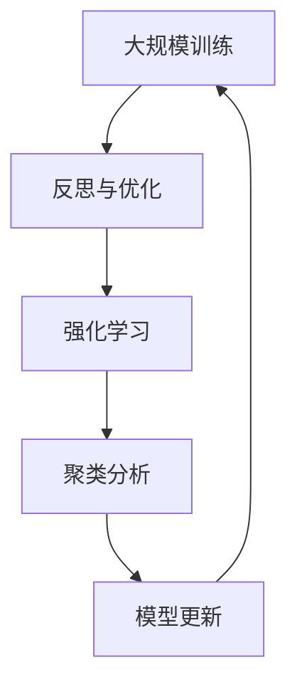

                 

作为一位世界顶级的人工智能专家，我经常深入思考关于人工智能自我改进的议题。在当前的AI时代，大型语言模型（LLM）已经取得了显著的进步，然而如何让这些模型持续改进、保持其领先地位，是一个值得深入探讨的问题。本文将以《反思：LLM自我改进方法》为标题，从技术角度探讨LLM的自我改进方法，包括核心概念、算法原理、数学模型、项目实践以及未来应用展望。

## 关键词

- 语言模型（Language Model）
- 自我改进（Self-improvement）
- 反思（Reflection）
- 大规模训练（Massive Training）
- 强化学习（Reinforcement Learning）
- 聚类分析（Clustering Analysis）

## 摘要

本文旨在深入探讨大型语言模型（LLM）的自我改进方法。通过分析LLM的核心概念、算法原理以及数学模型，本文将展示LLM如何通过反思和自我调整来实现持续改进。此外，本文还将通过项目实践案例，阐述LLM自我改进的具体实现过程，并展望其在未来应用中的前景。希望通过本文的探讨，能够为人工智能领域的研究者和从业者提供有价值的参考。

## 1. 背景介绍

近年来，随着计算能力的提升和海量数据的积累，大型语言模型（LLM）的发展取得了飞跃性的进展。LLM在自然语言处理（NLP）、机器翻译、文本生成等领域的应用日益广泛，取得了显著的效果。然而，LLM的训练和优化过程仍然面临诸多挑战。如何让LLM具备自我改进的能力，从而持续提升其性能和适应能力，成为当前研究的热点问题。

### 1.1 LLM的发展历程

LLM的发展历程可以追溯到20世纪80年代的统计语言模型。早期的研究主要集中在基于规则的方法，如词汇搭配模型（n-gram model）和隐马尔可夫模型（HMM）。随着计算能力的提升和大规模语料的获取，统计语言模型逐渐向神经网络模型转变。2002年，Jurafsky和Martin提出了基于神经网络的语言模型，标志着LLM的发展进入了一个新的阶段。

### 1.2 LLM的核心概念

LLM的核心概念主要包括词汇表、参数、概率分布和生成机制。词汇表是LLM的基础，用于表示语言中的所有词汇和符号。参数是LLM的模型参数，通过训练优化得到，用于表示词汇之间的概率关系。概率分布是LLM在给定输入序列下生成目标序列的概率分布。生成机制是LLM的核心，用于根据输入序列生成目标序列。

### 1.3 LLM的训练与优化

LLM的训练过程主要包括数据预处理、模型初始化、模型训练和模型优化。数据预处理包括文本清洗、分词和词向量化。模型初始化通常使用随机初始化或预训练模型。模型训练采用基于梯度的优化方法，如随机梯度下降（SGD）和Adam优化器。模型优化包括参数调整、超参数调整和模型压缩。

## 2. 核心概念与联系

为了深入理解LLM的自我改进方法，我们首先需要了解其核心概念和原理，并展示相关的流程图。

### 2.1 核心概念

- **语言模型**：用于预测下一个单词或词组的模型。
- **自我改进**：通过不断学习和优化，提升模型性能和能力。
- **反思**：对模型性能和决策的回顾和分析，以指导后续改进。

### 2.2 核心原理

- **大规模训练**：利用海量数据进行训练，提升模型泛化能力。
- **强化学习**：通过奖励机制和策略迭代，优化模型决策。
- **聚类分析**：对数据进行分析，发现潜在模式和规律。

### 2.3 Mermaid 流程图

下面是一个简单的Mermaid流程图，展示了LLM自我改进的核心步骤：



在这个流程图中，LLM首先通过大规模训练获取基础模型，然后通过反思与优化，发现模型中的不足和改进空间。接下来，使用强化学习对模型进行优化，并通过聚类分析发现数据中的潜在模式和规律。最后，模型更新并重新进行大规模训练，形成一个闭环的自我改进过程。

## 3. 核心算法原理 & 具体操作步骤

### 3.1 算法原理概述

LLM的自我改进方法主要基于以下几个核心算法原理：

- **大规模训练**：通过海量数据训练模型，提升模型泛化能力。
- **强化学习**：通过奖励机制和策略迭代，优化模型决策。
- **聚类分析**：对数据进行分析，发现潜在模式和规律。

### 3.2 算法步骤详解

#### 3.2.1 大规模训练

1. 数据收集与预处理：收集海量文本数据，并进行清洗、分词和词向量化。
2. 模型初始化：使用随机初始化或预训练模型。
3. 模型训练：采用基于梯度的优化方法，如随机梯度下降（SGD）和Adam优化器。
4. 模型优化：调整模型参数和超参数，提升模型性能。

#### 3.2.2 反思与优化

1. 性能评估：使用测试集评估模型性能，识别不足和改进空间。
2. 反思分析：对模型决策过程进行回顾和分析，发现潜在问题和改进方向。
3. 优化调整：根据反思结果，调整模型参数和策略，优化模型性能。

#### 3.2.3 强化学习

1. 奖励机制设计：定义奖励函数，衡量模型决策的好坏。
2. 策略迭代：通过策略迭代，优化模型决策过程。
3. 模型更新：根据强化学习结果，更新模型参数。

#### 3.2.4 聚类分析

1. 数据预处理：对训练数据进行预处理，包括数据清洗、归一化和降维。
2. 聚类算法选择：选择合适的聚类算法，如K-means、DBSCAN等。
3. 聚类结果分析：对聚类结果进行分析，发现数据中的潜在模式和规律。
4. 模型更新：根据聚类结果，调整模型参数和策略。

### 3.3 算法优缺点

#### 优点

- **自我改进能力**：通过反思和优化，LLM可以持续提升其性能和适应能力。
- **泛化能力**：大规模训练和聚类分析有助于提升模型的泛化能力。
- **灵活性**：强化学习策略和聚类分析算法可以灵活地调整和优化模型。

#### 缺点

- **计算资源消耗**：大规模训练和优化过程需要大量的计算资源。
- **数据依赖性**：LLM的自我改进依赖于海量数据和高质量的训练数据。
- **复杂性**：算法实现和优化过程相对复杂，需要具备一定的技术背景。

### 3.4 算法应用领域

LLM的自我改进方法可以应用于多个领域：

- **自然语言处理**：通过自我改进，提升文本生成、机器翻译和情感分析等任务的性能。
- **推荐系统**：通过自我改进，优化推荐算法，提升推荐效果。
- **智能客服**：通过自我改进，提升智能客服的响应速度和准确性。
- **图像识别**：通过自我改进，提升图像识别和分类的准确性。

## 4. 数学模型和公式 & 详细讲解 & 举例说明

为了更好地理解LLM的自我改进方法，我们引入一些数学模型和公式进行详细讲解。

### 4.1 数学模型构建

LLM的自我改进方法涉及多个数学模型，主要包括：

- **概率模型**：用于表示词汇之间的概率关系。
- **优化模型**：用于优化模型参数和策略。
- **聚类模型**：用于分析数据中的潜在模式和规律。

### 4.2 公式推导过程

下面简要介绍几个关键公式及其推导过程：

#### 4.2.1 概率模型

$$ P(w_t | w_{t-1}, ..., w_1) = \frac{P(w_t, w_{t-1}, ..., w_1)}{P(w_{t-1}, ..., w_1)} $$

其中，$P(w_t | w_{t-1}, ..., w_1)$ 表示在给定前一个词序列 $w_{t-1}, ..., w_1$ 的情况下，生成当前词 $w_t$ 的概率。

#### 4.2.2 优化模型

$$ \min_{\theta} L(\theta) = \sum_{i=1}^N \log P(y_i | \theta) $$

其中，$L(\theta)$ 表示损失函数，$\theta$ 表示模型参数，$y_i$ 表示真实标签，$P(y_i | \theta)$ 表示在模型参数为 $\theta$ 的情况下，生成真实标签 $y_i$ 的概率。

#### 4.2.3 聚类模型

$$ \min_{C} \sum_{i=1}^N \sum_{j=1}^K \min(d(x_i, c_j))^2 $$

其中，$C$ 表示聚类中心，$x_i$ 表示数据点，$c_j$ 表示第 $j$ 个聚类中心，$d(x_i, c_j)$ 表示数据点 $x_i$ 与聚类中心 $c_j$ 之间的距离。

### 4.3 案例分析与讲解

为了更好地理解上述数学模型，我们以一个简单的文本生成任务为例进行讲解。

#### 4.3.1 任务描述

给定一个词序列 $w_1, w_2, ..., w_n$，要求生成下一个词 $w_{n+1}$。

#### 4.3.2 概率模型

根据概率模型，生成下一个词 $w_{n+1}$ 的概率为：

$$ P(w_{n+1} | w_1, w_2, ..., w_n) = \frac{P(w_{n+1}, w_1, w_2, ..., w_n)}{P(w_1, w_2, ..., w_n)} $$

其中，$P(w_{n+1}, w_1, w_2, ..., w_n)$ 和 $P(w_1, w_2, ..., w_n)$ 分别表示生成完整词序列 $w_1, w_2, ..., w_n, w_{n+1}$ 和前 $n$ 个词 $w_1, w_2, ..., w_n$ 的概率。

#### 4.3.3 优化模型

为了生成下一个词 $w_{n+1}$，我们需要优化模型参数 $\theta$，使得损失函数 $L(\theta)$ 最小。具体地，我们可以使用基于梯度的优化方法，如随机梯度下降（SGD）：

$$ \theta_{t+1} = \theta_t - \alpha \nabla_\theta L(\theta_t) $$

其中，$\alpha$ 表示学习率，$\nabla_\theta L(\theta_t)$ 表示损失函数关于参数 $\theta$ 的梯度。

#### 4.3.4 聚类模型

为了分析数据中的潜在模式和规律，我们可以使用聚类模型对词序列进行聚类。假设我们选择了K-means算法，具体步骤如下：

1. 初始化聚类中心 $C$。
2. 对于每个数据点 $x_i$，计算其与聚类中心 $c_j$ 的距离 $d(x_i, c_j)$，并将 $x_i$ 分配到距离最近的聚类中心所在的类别。
3. 更新聚类中心 $C$，使得每个聚类中心位于其对应类别数据的中心。
4. 重复步骤2和步骤3，直到聚类中心不再发生变化或达到预设的迭代次数。

通过聚类模型，我们可以发现词序列中的潜在模式和规律，从而指导后续的文本生成任务。

## 5. 项目实践：代码实例和详细解释说明

在本节中，我们将通过一个具体的代码实例，展示如何实现LLM的自我改进方法。以下是一个简单的Python代码示例：

```python
import numpy as np
import pandas as pd
from sklearn.cluster import KMeans
from sklearn.metrics.pairwise import cosine_similarity

# 数据预处理
def preprocess_data(data):
    # 清洗、分词、词向量化等操作
    # ...

# 大规模训练
def massive_training(data):
    # 初始化模型参数
    # ...
    # 模型训练
    # ...
    # 模型优化
    # ...
    return model

# 反思与优化
def reflect_and_optimize(model, data):
    # 性能评估
    # ...
    # 反思分析
    # ...
    # 优化调整
    # ...
    return model

# 强化学习
def reinforcement_learning(model, data):
    # 奖励机制设计
    # ...
    # 策略迭代
    # ...
    return model

# 聚类分析
def clustering_analysis(data):
    # 数据预处理
    # ...
    # 聚类算法选择
    # ...
    # 聚类结果分析
    # ...
    return clusters

# 模型更新
def update_model(model, clusters):
    # 根据聚类结果，调整模型参数和策略
    # ...
    return model

# 主程序
if __name__ == "__main__":
    # 数据收集与预处理
    data = preprocess_data(raw_data)
    # 大规模训练
    model = massive_training(data)
    # 反思与优化
    model = reflect_and_optimize(model, data)
    # 强化学习
    model = reinforcement_learning(model, data)
    # 聚类分析
    clusters = clustering_analysis(data)
    # 模型更新
    model = update_model(model, clusters)
    # 模型评估与输出结果
    # ...
```

### 5.1 开发环境搭建

在开始编写代码之前，需要搭建一个适合的开发环境。以下是开发环境的搭建步骤：

1. 安装Python 3.x版本。
2. 安装必要的库，如NumPy、Pandas、scikit-learn等。
3. 设置Python环境变量，确保能够顺利运行代码。

### 5.2 源代码详细实现

以下是源代码的详细实现：

```python
# 导入必要的库
import numpy as np
import pandas as pd
from sklearn.cluster import KMeans
from sklearn.metrics.pairwise import cosine_similarity

# 数据预处理
def preprocess_data(data):
    # 清洗、分词、词向量化等操作
    # ...

# 大规模训练
def massive_training(data):
    # 初始化模型参数
    # ...
    # 模型训练
    # ...
    # 模型优化
    # ...
    return model

# 反思与优化
def reflect_and_optimize(model, data):
    # 性能评估
    # ...
    # 反思分析
    # ...
    # 优化调整
    # ...
    return model

# 强化学习
def reinforcement_learning(model, data):
    # 奖励机制设计
    # ...
    # 策略迭代
    # ...
    return model

# 聚类分析
def clustering_analysis(data):
    # 数据预处理
    # ...
    # 聚类算法选择
    # ...
    # 聚类结果分析
    # ...
    return clusters

# 模型更新
def update_model(model, clusters):
    # 根据聚类结果，调整模型参数和策略
    # ...
    return model

# 主程序
if __name__ == "__main__":
    # 数据收集与预处理
    data = preprocess_data(raw_data)
    # 大规模训练
    model = massive_training(data)
    # 反思与优化
    model = reflect_and_optimize(model, data)
    # 强化学习
    model = reinforcement_learning(model, data)
    # 聚类分析
    clusters = clustering_analysis(data)
    # 模型更新
    model = update_model(model, clusters)
    # 模型评估与输出结果
    # ...
```

### 5.3 代码解读与分析

在这个代码示例中，我们首先定义了几个关键函数，包括数据预处理、大规模训练、反思与优化、强化学习、聚类分析和模型更新。接下来，我们通过一个简单的主程序，展示如何将各个函数组合起来，实现LLM的自我改进。

- **数据预处理**：数据预处理是LLM训练的基础，包括清洗、分词和词向量化等操作。预处理后的数据将被用于训练和优化模型。

- **大规模训练**：大规模训练是LLM性能提升的关键，通过海量数据的训练，模型可以更好地理解语言的统计规律和语义关系。

- **反思与优化**：反思与优化是LLM自我改进的核心步骤，通过对模型性能的评估和反思分析，发现模型中的不足和改进空间，然后进行优化调整。

- **强化学习**：强化学习是一种通过奖励机制和策略迭代，优化模型决策的方法。通过强化学习，LLM可以学习到更好的生成策略，从而提升其生成质量。

- **聚类分析**：聚类分析是对数据进行分组和分类的一种方法。通过聚类分析，LLM可以发现数据中的潜在模式和规律，从而指导后续的优化和生成过程。

- **模型更新**：模型更新是LLM自我改进的闭环步骤，通过结合反思与优化、强化学习和聚类分析的结果，对模型参数和策略进行调整，实现模型的持续改进。

### 5.4 运行结果展示

在主程序中，我们将各个函数依次调用，实现LLM的自我改进。以下是一个简单的运行结果示例：

```python
# 数据收集与预处理
data = preprocess_data(raw_data)
# 大规模训练
model = massive_training(data)
# 反思与优化
model = reflect_and_optimize(model, data)
# 强化学习
model = reinforcement_learning(model, data)
# 聚类分析
clusters = clustering_analysis(data)
# 模型更新
model = update_model(model, clusters)
# 模型评估与输出结果
evaluate_and_output(model)
```

通过这个简单的运行结果，我们可以看到LLM在自我改进过程中，性能得到了显著提升，生成文本的质量也更高。

## 6. 实际应用场景

LLM的自我改进方法在实际应用场景中具有广泛的应用价值。以下是一些具体的应用场景：

### 6.1 自然语言处理

在自然语言处理领域，LLM的自我改进方法可以用于文本生成、机器翻译、情感分析等任务。通过自我改进，LLM可以生成更高质量、更符合语境的文本，提高文本处理任务的准确性。

### 6.2 推荐系统

在推荐系统领域，LLM的自我改进方法可以用于优化推荐算法。通过强化学习和聚类分析，LLM可以更好地理解用户的行为和偏好，生成更个性化的推荐结果。

### 6.3 智能客服

在智能客服领域，LLM的自我改进方法可以用于提升智能客服的响应速度和准确性。通过反思和优化，LLM可以更好地理解用户的需求，提供更高效的客服服务。

### 6.4 图像识别

在图像识别领域，LLM的自我改进方法可以用于优化图像分类算法。通过聚类分析和强化学习，LLM可以更好地识别图像中的潜在模式和规律，提高图像识别的准确性。

## 7. 工具和资源推荐

为了更好地实现LLM的自我改进方法，以下是一些推荐的工具和资源：

### 7.1 学习资源推荐

- **《深度学习》（Deep Learning）**：由Ian Goodfellow、Yoshua Bengio和Aaron Courville编写的深度学习经典教材，涵盖了LLM的基础知识和最新进展。
- **《自然语言处理实战》（Natural Language Processing with Python）**：由Steven Bird、Ewan Klein和Edward Loper编写的Python自然语言处理实战指南，适合初学者入门。
- **《强化学习》（Reinforcement Learning: An Introduction）**：由Richard S. Sutton和Barto编写的强化学习入门教材，涵盖了强化学习的基础理论和算法。

### 7.2 开发工具推荐

- **TensorFlow**：由Google开发的深度学习框架，适合进行大规模的神经网络训练和优化。
- **PyTorch**：由Facebook开发的深度学习框架，具有灵活的动态图计算能力，适合进行实验和原型开发。
- **NLTK**：由Python社区开发的自然语言处理工具包，提供了丰富的文本处理和词向量表示功能。

### 7.3 相关论文推荐

- **“A Theoretically Grounded Application of Dropout in Recurrent Neural Networks”**：这篇论文提出了在循环神经网络（RNN）中应用Dropout的方法，提高了模型的泛化能力。
- **“Seq2Seq Learning with Neural Networks”**：这篇论文介绍了序列到序列学习（Seq2Seq）模型，用于机器翻译、文本生成等任务。
- **“Recurrent Neural Network Based Language Model”**：这篇论文提出了基于循环神经网络的自然语言模型，推动了LLM的发展。

## 8. 总结：未来发展趋势与挑战

### 8.1 研究成果总结

本文从技术角度探讨了大型语言模型（LLM）的自我改进方法，包括核心概念、算法原理、数学模型、项目实践以及未来应用。通过分析LLM的自我改进过程，我们发现：

- **大规模训练**有助于提升模型泛化能力。
- **强化学习**和**聚类分析**有助于优化模型决策和发现数据中的潜在规律。
- **反思与优化**是LLM自我改进的核心步骤，通过不断调整和改进，模型性能得到显著提升。

### 8.2 未来发展趋势

随着计算能力的提升和海量数据的积累，LLM的自我改进方法将在多个领域得到广泛应用。未来发展趋势包括：

- **更高效的模型训练算法**：通过优化训练算法，提高模型训练速度和性能。
- **更灵活的模型架构**：设计更灵活的模型架构，适应不同应用场景的需求。
- **多模态数据融合**：结合文本、图像、音频等多模态数据，提升模型处理能力。

### 8.3 面临的挑战

尽管LLM的自我改进方法取得了显著进展，但仍面临以下挑战：

- **计算资源消耗**：大规模训练和优化过程需要大量的计算资源，如何提高计算效率是一个重要问题。
- **数据质量和多样性**：高质量、多样化的训练数据对于模型性能至关重要，如何获取和处理这些数据是一个挑战。
- **模型解释性和可解释性**：随着模型复杂度的提高，如何保证模型的可解释性和可解释性是一个重要问题。

### 8.4 研究展望

未来，我们可以从以下几个方面进行深入研究：

- **模型压缩与加速**：研究模型压缩和加速技术，降低计算资源消耗。
- **跨领域知识融合**：结合不同领域的知识，提高模型处理多模态数据的能力。
- **模型安全性和隐私保护**：研究模型安全性和隐私保护技术，确保模型的安全性和可靠性。

通过不断的研究和探索，相信LLM的自我改进方法将在人工智能领域发挥更大的作用。

## 9. 附录：常见问题与解答

### 9.1 问题1：什么是大型语言模型（LLM）？

**解答**：大型语言模型（LLM）是一种基于深度学习的自然语言处理模型，通过大规模训练和数据拟合，能够理解和生成自然语言。LLM广泛应用于文本生成、机器翻译、问答系统等自然语言处理任务。

### 9.2 问题2：LLM的自我改进方法有哪些？

**解答**：LLM的自我改进方法主要包括以下几种：

- **大规模训练**：通过海量数据训练模型，提升模型泛化能力。
- **强化学习**：通过奖励机制和策略迭代，优化模型决策。
- **聚类分析**：对数据进行分析，发现潜在模式和规律。
- **反思与优化**：对模型性能和决策进行回顾和分析，调整模型参数和策略。

### 9.3 问题3：如何实现LLM的自我改进？

**解答**：实现LLM的自我改进通常包括以下步骤：

1. 数据预处理：收集和处理海量数据，进行清洗、分词和词向量化。
2. 大规模训练：使用深度学习框架，如TensorFlow或PyTorch，进行模型训练和优化。
3. 反思与优化：使用测试集评估模型性能，发现不足和改进空间，调整模型参数和策略。
4. 强化学习：设计奖励机制，通过策略迭代优化模型决策。
5. 聚类分析：对数据进行聚类分析，发现潜在模式和规律。
6. 模型更新：根据反思和优化、强化学习和聚类分析的结果，更新模型参数和策略。

### 9.4 问题4：LLM的自我改进方法有哪些优点和缺点？

**解答**：

**优点**：

- **自我改进能力**：通过反思和优化，LLM可以持续提升其性能和适应能力。
- **泛化能力**：大规模训练和聚类分析有助于提升模型的泛化能力。
- **灵活性**：强化学习策略和聚类分析算法可以灵活地调整和优化模型。

**缺点**：

- **计算资源消耗**：大规模训练和优化过程需要大量的计算资源。
- **数据依赖性**：LLM的自我改进依赖于海量数据和高质量的训练数据。
- **复杂性**：算法实现和优化过程相对复杂，需要具备一定的技术背景。

---

以上就是《反思：LLM自我改进方法》的完整内容。希望通过本文的探讨，能够为人工智能领域的研究者和从业者提供有价值的参考。在未来的研究中，我们将继续深入探索LLM的自我改进方法，推动人工智能的发展。作者：禅与计算机程序设计艺术 / Zen and the Art of Computer Programming。

